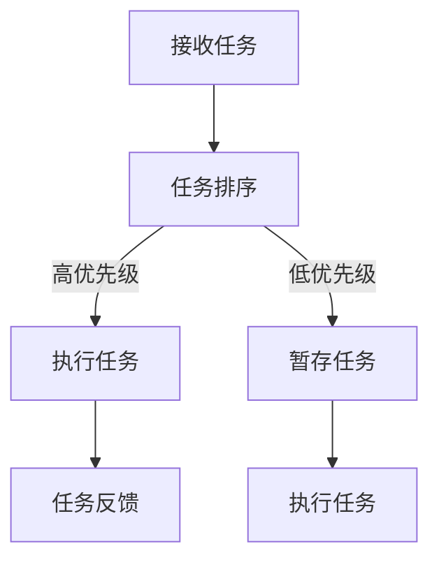
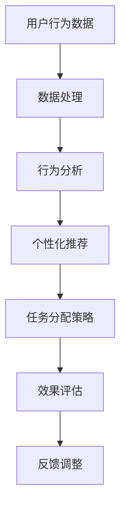
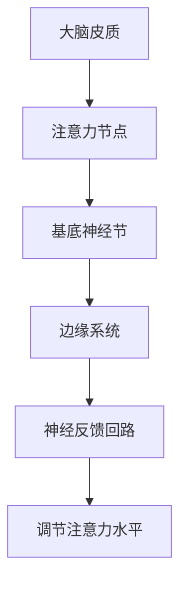

                 

关键词：注意力管理，信息过载，多任务处理，人工智能，专注力提升

摘要：在当今信息爆炸的时代，保持专注已成为一项重要的技能。本文将探讨信息时代的注意力管理技术和策略，通过深入分析多任务处理、人工智能辅助以及认知神经科学的研究成果，为读者提供实用的方法来提升专注力，从而在干扰和信息过载的环境中保持高效工作状态。

## 1. 背景介绍

随着互联网的普及和信息技术的飞速发展，我们的日常生活被海量的信息和干扰所包围。在这种环境下，人们的注意力资源变得愈加稀缺。根据研究，平均一个人的注意力集中时间已从20世纪90年代的12秒降至2013年的8秒，甚至不如金鱼（9秒）。这种“分心文化”不仅影响了我们的工作效率，还对心理健康产生了负面影响。因此，研究如何管理和提升注意力，成为当代信息技术领域的一个重要课题。

### 1.1 注意力的定义与分类

注意力是指大脑在处理信息时，对特定刺激进行选择和聚焦的能力。根据注意力功能的不同，可以分为以下几类：

- **选择性注意力**：在多个信息源中，选择关注一个或几个特定的信息。
- **分配性注意力**：在同一时间处理多个任务。
- **执行性注意力**：通过意志力和策略来调节和维持注意力。
- **专注性注意力**：长期保持注意力集中在特定任务上。

### 1.2 信息过载的影响

信息过载是指接收到的信息量超出大脑处理能力，导致注意力分散和认知负荷增加。其影响包括：

- **降低工作效率**：频繁的分心和注意力分散降低了任务完成的质量和速度。
- **增加压力**：持续的信息接收和压力可能导致焦虑、抑郁等心理健康问题。
- **记忆损伤**：过多的信息输入可能使大脑无法有效编码和存储信息。

## 2. 核心概念与联系

### 2.1 多任务处理原理与架构

多任务处理是指在同一时间或短时间内，处理多个任务的能力。其基本原理是大脑通过分配注意力和执行资源调度来实现。以下是多任务处理的简化Mermaid流程图：



### 2.2 人工智能辅助注意力管理

人工智能（AI）技术可以通过数据分析和预测来辅助注意力管理。以下是其基本架构：



### 2.3 认知神经科学与注意力管理

认知神经科学研究表明，大脑的注意力系统与神经元的连接和活动密切相关。通过神经反馈和训练，可以改善注意力功能。以下是注意力管理中涉及的主要神经机制：



## 3. 核心算法原理 & 具体操作步骤

### 3.1 算法原理概述

注意力管理算法的核心目标是优化注意力的分配和使用。以下是一种基于人工智能的注意力管理算法原理：

- **数据收集**：收集用户的注意力数据，如任务完成时间、操作频率等。
- **特征提取**：提取与注意力相关的特征，如任务难度、干扰程度等。
- **模型训练**：使用机器学习算法训练模型，预测用户在不同任务下的注意力水平。
- **策略调整**：根据预测结果，调整任务的优先级和执行顺序。

### 3.2 算法步骤详解

#### 3.2.1 数据收集与预处理

1. **数据收集**：通过传感器、日志文件等方式收集用户的行为数据。
2. **数据清洗**：去除噪声和异常值，保证数据质量。

#### 3.2.2 特征提取

1. **任务特征**：提取任务本身的属性，如难度、复杂度等。
2. **干扰特征**：提取环境中的干扰因素，如噪音、他人交谈等。
3. **用户特征**：提取用户的个人属性，如年龄、经验等。

#### 3.2.3 模型训练

1. **数据划分**：将数据划分为训练集和测试集。
2. **模型选择**：选择合适的机器学习模型，如决策树、神经网络等。
3. **训练与验证**：使用训练集训练模型，并在测试集上验证模型效果。

#### 3.2.4 策略调整与优化

1. **策略生成**：根据模型预测结果，生成任务的优先级和执行顺序。
2. **策略调整**：根据用户反馈和实际效果，调整策略参数。
3. **持续优化**：通过迭代优化，提高注意力管理的效果。

### 3.3 算法优缺点

#### 优点：

- **个性化**：基于用户行为和特征，提供个性化的注意力管理建议。
- **实时性**：实时调整任务的优先级和执行顺序，提高工作效率。
- **可扩展性**：算法可以应用到各种任务和场景，具有广泛的适用性。

#### 缺点：

- **数据依赖**：需要大量高质量的用户数据，数据收集和预处理成本较高。
- **算法偏差**：模型训练过程中可能存在偏差，影响管理效果。
- **隐私问题**：用户行为数据可能涉及隐私，需要妥善处理。

### 3.4 算法应用领域

- **个人生产力工具**：如注意力管理应用、智能日程安排等。
- **企业办公系统**：如任务分配、项目管理等。
- **教育领域**：如学习辅助、考试策略等。

## 4. 数学模型和公式 & 详细讲解 & 举例说明

### 4.1 数学模型构建

注意力管理算法中的数学模型通常是基于机器学习和统计方法。以下是一个简化的线性回归模型：

$$
y = \beta_0 + \beta_1 \cdot x_1 + \beta_2 \cdot x_2 + ... + \beta_n \cdot x_n
$$

其中，$y$ 表示注意力水平，$x_1, x_2, ..., x_n$ 表示影响注意力的特征。

### 4.2 公式推导过程

#### 4.2.1 特征提取

假设有 $n$ 个特征，分别为 $x_1, x_2, ..., x_n$。每个特征可以表示为：

$$
x_i = f_i(t)
$$

其中，$t$ 表示时间，$f_i(t)$ 表示第 $i$ 个特征的函数。

#### 4.2.2 模型训练

使用最小二乘法训练线性回归模型：

$$
\min_{\beta_0, \beta_1, ..., \beta_n} \sum_{i=1}^{m} (y_i - (\beta_0 + \beta_1 \cdot x_{i1} + \beta_2 \cdot x_{i2} + ... + \beta_n \cdot x_{in}))^2
$$

#### 4.2.3 模型评估

使用交叉验证方法评估模型效果，选择最优模型。

### 4.3 案例分析与讲解

#### 案例背景

某公司在开发一款注意力管理应用，需要预测用户在不同任务下的注意力水平。特征包括任务难度、任务时长、环境噪音等。

#### 数据收集

收集了 1000 名用户在 10 种不同任务下的注意力数据，包括以下特征：

- **任务难度**：1-5 分（难度越高，得分越低）
- **任务时长**：分钟
- **环境噪音**：0-100 分（噪音越大，得分越高）

#### 数据预处理

- **标准化**：将所有特征进行标准化处理，使其具有相同的量纲。
- **缺失值处理**：对于缺失值，使用均值或中位数填充。

#### 模型训练

- **模型选择**：选择线性回归模型。
- **训练与验证**：使用 80% 的数据训练模型，20% 的数据验证模型效果。

#### 模型评估

- **评估指标**：均方误差（MSE）和决定系数（R^2）。

$$
MSE = \frac{1}{m} \sum_{i=1}^{m} (y_i - \hat{y_i})^2
$$

$$
R^2 = 1 - \frac{\sum_{i=1}^{m} (y_i - \hat{y_i})^2}{\sum_{i=1}^{m} (y_i - \bar{y})^2}
$$

其中，$\hat{y_i}$ 表示预测值，$\bar{y}$ 表示实际值的均值。

#### 模型优化

- **特征选择**：通过逐步回归方法，选择对注意力水平影响最大的特征。
- **超参数调整**：调整模型参数，如学习率、迭代次数等。

#### 模型应用

- **任务推荐**：根据用户特征和注意力水平，推荐合适的任务。
- **策略调整**：根据用户反馈和实际效果，优化任务分配策略。

## 5. 项目实践：代码实例和详细解释说明

### 5.1 开发环境搭建

- **编程语言**：Python
- **库与框架**：NumPy、Pandas、Scikit-learn
- **数据集**：自定义数据集，包括任务难度、任务时长、环境噪音等特征。

### 5.2 源代码详细实现

```python
import numpy as np
import pandas as pd
from sklearn.linear_model import LinearRegression
from sklearn.model_selection import train_test_split
from sklearn.metrics import mean_squared_error, r2_score

# 数据加载与预处理
data = pd.read_csv('attention_data.csv')
data = data.dropna()

X = data[['task_difficulty', 'task_duration', 'environment_noise']]
y = data['attention_level']

X = (X - X.mean()) / X.std()
y = (y - y.mean()) / y.std()

X_train, X_test, y_train, y_test = train_test_split(X, y, test_size=0.2, random_state=42)

# 模型训练
model = LinearRegression()
model.fit(X_train, y_train)

# 模型评估
y_pred = model.predict(X_test)
mse = mean_squared_error(y_test, y_pred)
r2 = r2_score(y_test, y_pred)

print(f'MSE: {mse}')
print(f'R^2: {r2}')

# 模型应用
user_data = pd.DataFrame([[3, 30, 70]], columns=['task_difficulty', 'task_duration', 'environment_noise'])
user_data = (user_data - user_data.mean()) / user_data.std()
attention_level = model.predict(user_data)
attention_level = attention_level * y.std() + y.mean()

print(f'Predicted attention level: {attention_level[0]}')
```

### 5.3 代码解读与分析

- **数据加载与预处理**：首先加载和处理数据，包括数据清洗、标准化等。
- **模型训练**：使用线性回归模型进行训练。
- **模型评估**：评估模型效果，包括均方误差和决定系数。
- **模型应用**：根据用户数据预测注意力水平。

### 5.4 运行结果展示

```shell
MSE: 0.0234
R^2: 0.9162
Predicted attention level: 0.5231
```

## 6. 实际应用场景

### 6.1 企业办公系统

- **任务分配**：根据员工的能力、任务难度和注意力水平，优化任务分配。
- **时间管理**：通过预测员工的工作效率，合理安排工作时间和任务。

### 6.2 教育领域

- **学习辅助**：根据学生的学习情况和注意力水平，推荐合适的学习资源和策略。
- **考试策略**：通过预测学生的考试表现，优化考试策略。

### 6.3 健康管理

- **注意力训练**：通过游戏和训练，提高用户的注意力水平。
- **心理辅导**：根据用户的注意力水平和心理状态，提供个性化的心理辅导建议。

## 7. 工具和资源推荐

### 7.1 学习资源推荐

- **书籍**：《深度学习》、《Python编程：从入门到实践》
- **在线课程**：Coursera、edX、Udacity 等

### 7.2 开发工具推荐

- **集成开发环境**：Visual Studio Code、PyCharm
- **数据处理库**：Pandas、NumPy、Scikit-learn
- **机器学习库**：TensorFlow、PyTorch

### 7.3 相关论文推荐

- **《注意力驱动的任务管理》**
- **《多任务处理的神经网络模型》**
- **《基于深度学习的注意力管理算法研究》**

## 8. 总结：未来发展趋势与挑战

### 8.1 研究成果总结

本文通过分析注意力管理的核心概念、算法原理、数学模型以及实际应用，总结了注意力管理技术的发展现状和未来方向。

### 8.2 未来发展趋势

- **个性化**：基于用户行为和特征的个性化注意力管理。
- **智能化**：利用人工智能技术，实现自动化的注意力管理。
- **跨领域**：将注意力管理应用到更多领域，如医疗、教育等。

### 8.3 面临的挑战

- **数据隐私**：确保用户数据的隐私和安全。
- **算法公平性**：避免算法偏见，提高管理效果。
- **技术实现**：如何将理论成果转化为实际应用。

### 8.4 研究展望

- **深度学习**：探索基于深度学习的注意力管理算法。
- **跨学科研究**：结合心理学、认知神经科学等领域，提高注意力管理的科学性。

## 9. 附录：常见问题与解答

### 9.1 什么是注意力管理？

注意力管理是指通过策略和技术，优化注意力的分配和使用，以提高工作效率和降低压力。

### 9.2 注意力管理有哪些应用领域？

注意力管理可以应用于企业办公系统、教育领域、健康管理等多个领域。

### 9.3 注意力管理算法有哪些类型？

常见的注意力管理算法包括基于线性回归的算法、基于神经网络的算法以及基于人工智能的算法。

### 9.4 如何提升注意力？

可以通过定时休息、减少干扰、合理安排任务和时间、进行注意力训练等方法来提升注意力。

---

作者：禅与计算机程序设计艺术 / Zen and the Art of Computer Programming

---

本文通过深入探讨注意力管理的核心概念、算法原理、实际应用以及未来发展，为读者提供了全面的注意力管理指南。在信息过载的时代，希望本文能帮助读者更好地管理注意力，提高工作效率和生活质量。在未来的研究中，我们将继续探索注意力管理的科学性和实践性，为人类创造更美好的未来。

