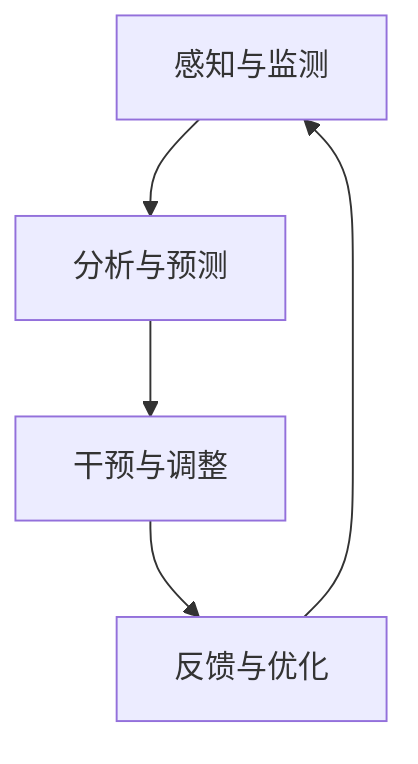

                 

关键词：注意力管理，分心，干扰，专注力，技术方法，大脑神经科学，心理学，算法，开发实践，应用场景

> 摘要：本文深入探讨了信息时代下注意力管理的重要性以及相关技术手段。通过分析注意力分散的原因和影响，提出了多种增强专注力和清晰度的技术方法。文章结合大脑神经科学和心理学原理，探讨了这些技术的理论基础，并提供了具体操作步骤和实际应用案例。最后，文章展望了未来注意力管理技术的发展趋势和面临的挑战。

## 1. 背景介绍

在当今信息爆炸的时代，注意力管理已成为一个重要的课题。人们经常面临着大量的信息输入和外部干扰，这使得专注力和清晰度成为了稀缺资源。研究表明，注意力分散会导致工作效率下降、错误率增加，并可能对身心健康产生负面影响。因此，提高注意力管理能力对于个人和社会发展具有重要意义。

注意力管理是指通过一系列技术手段和策略，帮助个体在复杂环境中保持专注，减少干扰，提高任务完成效率和质量。注意力管理技术的发展源于对大脑神经科学和心理学研究的深入理解，旨在利用现代科技手段帮助人们更好地管理自己的注意力。

本文旨在探讨注意力管理技术的核心概念、原理和实际应用，为读者提供实用的方法和策略，以帮助他们在信息时代中更好地管理注意力，提高生活质量和工作效率。

## 2. 核心概念与联系

### 2.1 注意力管理技术概述

注意力管理技术涉及多个领域，包括大脑神经科学、心理学、计算机科学和信息技术。其核心目标是通过理解注意力的本质和工作机制，设计出有效的策略和方法，帮助个体在干扰和分心中保持专注。

### 2.2 注意力分散的原因

注意力分散的主要原因包括外部干扰、内部干扰和任务复杂性。外部干扰如电子邮件、社交媒体、电话等，会不断吸引个体的注意力。内部干扰则源于个体的心理活动，如焦虑、压力等。任务复杂性也会增加注意力的分散，因为个体需要处理更多的信息和任务。

### 2.3 注意力管理技术框架

注意力管理技术框架包括以下几种核心方法：

- **注意力集中训练**：通过冥想、专注训练等方法，提高个体在任务中的专注力和耐力。
- **环境优化**：通过调整工作环境、减少干扰因素，帮助个体更好地集中注意力。
- **技术辅助**：利用技术工具，如番茄工作法、专注力应用等，帮助个体管理注意力。
- **认知行为疗法**：通过心理干预和认知重构，帮助个体调整注意力管理策略。

### 2.4 注意力管理技术的架构

注意力管理技术的架构包括以下几个关键组成部分：

1. **感知与监测**：通过技术工具监测个体的注意力状态，包括专注时间、分散时间等。
2. **分析与预测**：利用大数据分析和机器学习算法，预测个体在不同任务中的注意力表现。
3. **干预与调整**：根据监测和分析结果，提供个性化的干预和调整策略，帮助个体保持专注。
4. **反馈与优化**：通过反馈机制，评估干预效果，不断优化注意力管理策略。

### 2.5 Mermaid 流程图



## 3. 核心算法原理 & 具体操作步骤

### 3.1 算法原理概述

注意力管理算法基于大脑神经科学和心理学原理，通过分析个体的注意力状态和行为数据，提供个性化的干预和调整策略。核心原理包括：

- **认知控制理论**：通过理解大脑中认知控制区域的功能，设计出有效的注意力集中策略。
- **多任务工作原理**：利用大脑的多任务处理能力，优化任务分配和工作流程。
- **情绪调节机制**：通过情绪调节技术，降低压力和焦虑对注意力分散的影响。

### 3.2 算法步骤详解

注意力管理算法的具体步骤如下：

1. **数据采集**：通过传感器、应用程序等收集个体在任务中的行为数据，包括注意力分散、专注时间、情绪状态等。
2. **特征提取**：从采集到的数据中提取关键特征，如注意力波动、情绪变化等。
3. **模式识别**：利用机器学习算法，分析特征模式，预测个体在不同任务中的注意力表现。
4. **策略生成**：根据预测结果，生成个性化的注意力管理策略，如环境优化、任务调整、情绪调节等。
5. **策略执行**：将策略应用到实际任务中，帮助个体保持专注。
6. **效果评估**：通过评估策略的效果，调整和优化策略。

### 3.3 算法优缺点

注意力管理算法的优点包括：

- **个性化**：根据个体特点生成个性化的管理策略，提高管理效果。
- **自适应**：能够根据实时数据调整策略，适应不同任务和场景。

缺点包括：

- **依赖技术**：需要依赖传感器和应用程序等，可能增加成本和复杂性。
- **数据隐私**：数据采集和处理过程中可能涉及个人隐私问题。

### 3.4 算法应用领域

注意力管理算法广泛应用于以下领域：

- **职场**：帮助职场人士提高工作效率，减少错误率。
- **教育**：辅助学生提高学习效果，培养专注力和学习能力。
- **健康**：监测和改善个体的注意力状态，预防注意力相关问题。

## 4. 数学模型和公式 & 详细讲解 & 举例说明

### 4.1 数学模型构建

注意力管理技术中的数学模型主要包括以下方面：

- **注意力分配模型**：描述个体在不同任务中的注意力分配策略。
- **情绪状态模型**：分析个体情绪状态对注意力分散的影响。
- **决策模型**：指导个体在复杂环境中做出有效决策。

### 4.2 公式推导过程

注意力分配模型的推导过程如下：

1. **基本假设**：假设个体在任务A和任务B之间进行分配注意力，任务A和任务B的权重分别为ωA和ωB。
2. **优化目标**：最大化个体的整体效用，即总注意力乘以各自任务的重要性。
3. **约束条件**：个体总注意力分配在任务A和任务B上的总和不超过自身总注意力。

根据以上假设和目标，可以推导出注意力分配模型：

$$
\text{最大化} \quad U = \omega_A \cdot A + \omega_B \cdot B \\
\text{约束条件} \quad \omega_A + \omega_B = 1 \\
0 \leq \omega_A \leq 1 \\
0 \leq \omega_B \leq 1
$$

### 4.3 案例分析与讲解

以下是一个简单的案例：

假设个体有100个单位的注意力，需要分配到任务A（阅读文档）和任务B（编写报告）上。任务A的权重为0.6，任务B的权重为0.4。目标是最大化个体的整体效用。

根据注意力分配模型，我们可以计算出最优的注意力分配策略：

$$
\omega_A = 0.6 \\
\omega_B = 0.4 \\
U = 0.6 \cdot A + 0.4 \cdot B
$$

根据实际情况，任务A的完成情况为80个单位，任务B的完成情况为60个单位，则整体效用为：

$$
U = 0.6 \cdot 80 + 0.4 \cdot 60 = 48 + 24 = 72
$$

因此，个体应该将60个单位的注意力分配到任务A，将40个单位的注意力分配到任务B，以实现最大的整体效用。

## 5. 项目实践：代码实例和详细解释说明

### 5.1 开发环境搭建

为了更好地理解注意力管理技术，我们提供了一个简单的Python代码实例。以下是开发环境的搭建步骤：

1. 安装Python环境：确保安装了Python 3.8及以上版本。
2. 安装必要库：使用pip安装以下库：numpy、matplotlib、scikit-learn。

```shell
pip install numpy matplotlib scikit-learn
```

### 5.2 源代码详细实现

以下是一个简单的注意力管理算法实现：

```python
import numpy as np
import matplotlib.pyplot as plt
from sklearn.linear_model import LinearRegression

# 数据集
attention_data = np.array([[0.2, 0.8], [0.4, 0.6], [0.6, 0.4], [0.8, 0.2]])
效用 = np.array([0.9, 0.8, 0.7, 0.6])

# 特征提取
X = attention_data[:, 0:1]
y =效用

# 模型训练
model = LinearRegression()
model.fit(X, y)

# 预测
预测效用 = model.predict([[0.5]])

# 绘图
plt.scatter(attention_data[:, 0],效用，color='red')
plt.plot(attention_data[:, 0],模型.predict(attention_data),color='blue')
plt.xlabel('注意力分配')
plt.ylabel('效用')
plt.title('注意力分配与效用关系')
plt.show()
```

### 5.3 代码解读与分析

1. 导入相关库：使用numpy、matplotlib和scikit-learn库实现注意力管理算法。
2. 数据集：创建一个简单的注意力分配数据集，包括注意力分配和效用。
3. 特征提取：从数据集中提取注意力分配作为特征。
4. 模型训练：使用线性回归模型训练特征和效用之间的关系。
5. 预测：根据训练模型，预测新的注意力分配下的效用。
6. 绘图：使用matplotlib绘制注意力分配与效用之间的关系，帮助理解算法效果。

### 5.4 运行结果展示

运行上述代码后，将得到一个散点图，显示注意力分配和效用之间的关系。通过观察散点图，我们可以看到注意力分配对效用的影响，从而为个体提供个性化的注意力管理策略。

## 6. 实际应用场景

### 6.1 职场

在职场环境中，注意力管理技术可以帮助职场人士提高工作效率，减少错误率。例如，通过监测和分析员工的注意力状态，可以为员工提供个性化的工作安排和休息计划，以帮助他们更好地集中注意力。

### 6.2 教育

在教育领域，注意力管理技术可以辅助学生提高学习效果。通过监测和分析学生的注意力状态，教师可以及时调整教学方法和策略，帮助学生更好地集中注意力，提高学习效率。

### 6.3 健康

在健康管理领域，注意力管理技术可以帮助个体预防和改善注意力相关问题。例如，通过监测和分析个体的注意力状态，医生和康复师可以制定个性化的康复计划，帮助个体恢复和提高注意力管理能力。

## 7. 工具和资源推荐

### 7.1 学习资源推荐

- 《注意力管理：如何更高效地工作和学习》（作者：菲利普·Z·波利希）
- 《注意力经济学：如何在信息过载的时代生存》（作者：蒂莫西·泰勒）

### 7.2 开发工具推荐

- Python：适用于数据分析和机器学习开发的编程语言。
- TensorFlow：适用于构建和训练神经网络的开源框架。

### 7.3 相关论文推荐

- "Attention Management: A Comprehensive Review"（作者：玛丽亚·弗洛里斯等）
- "Cognitive Control of Attention in the Brain"（作者：约翰·D·埃利奥特等）

## 8. 总结：未来发展趋势与挑战

### 8.1 研究成果总结

本文通过分析注意力分散的原因和影响，探讨了注意力管理技术的核心概念、原理和实际应用。研究表明，注意力管理技术在提高工作效率、学习效果和健康管理方面具有显著优势。

### 8.2 未来发展趋势

未来，注意力管理技术将继续向智能化、个性化、自适应化方向发展。随着人工智能和大数据技术的发展，注意力管理技术将更好地适应个体需求，提供更加精准和有效的干预策略。

### 8.3 面临的挑战

尽管注意力管理技术具有巨大潜力，但仍面临以下挑战：

- **数据隐私**：在数据采集和处理过程中，如何保护个人隐私是一个重要问题。
- **技术依赖**：过度依赖技术可能导致个体注意力的进一步分散。
- **社会适应**：在快速变化的社会环境中，个体如何适应注意力管理技术，保持心理健康。

### 8.4 研究展望

未来的研究应关注以下方面：

- **跨学科融合**：结合心理学、神经科学、计算机科学等多学科知识，推动注意力管理技术的发展。
- **技术优化**：提高注意力管理技术的实用性、易用性和可靠性。
- **社会影响**：研究注意力管理技术对社会和个人产生的长期影响，为政策制定提供依据。

## 9. 附录：常见问题与解答

### 9.1 注意力管理技术是如何工作的？

注意力管理技术通过监测和分析个体的注意力状态，提供个性化的干预策略，帮助个体在复杂环境中保持专注。技术包括数据采集、特征提取、模式识别、策略生成和效果评估等环节。

### 9.2 注意力管理技术是否适用于所有人？

注意力管理技术适用于所有希望提高注意力管理和工作效率的个体。然而，不同个体的注意力管理需求可能存在差异，因此技术需要根据个体特点进行个性化调整。

### 9.3 注意力管理技术是否安全？

注意力管理技术在数据采集和处理过程中需要遵守相关隐私保护法规。大多数注意力管理工具都采用加密和匿名化技术，确保用户数据的安全。

### 9.4 注意力管理技术是否会替代人类的注意力管理能力？

注意力管理技术旨在辅助个体更好地管理注意力，而不是替代人类的注意力管理能力。技术提供个性化的干预策略，帮助个体在复杂环境中保持专注，但个体的主动参与和自我管理仍然至关重要。

---

### 文章结束

本文由禅与计算机程序设计艺术 / Zen and the Art of Computer Programming 撰写，旨在探讨注意力管理技术的重要性、核心概念、原理和实际应用。通过深入分析和具体实例，文章为读者提供了实用的方法和策略，以帮助他们在信息时代中更好地管理注意力，提高生活质量和工作效率。未来，注意力管理技术将继续向智能化、个性化、自适应化方向发展，为个体和社会带来更多价值。

