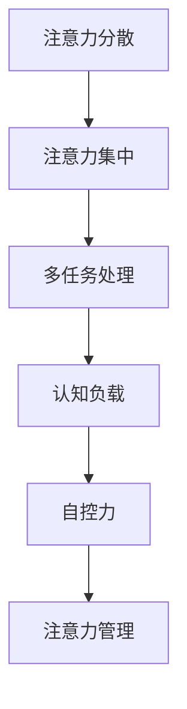

                 

在当今信息时代，我们每天都被大量的信息所包围。从社交媒体的推送，到电子邮件的轰炸，再到不间断的即时消息，我们的注意力成为了一种珍贵的资源。如何在干扰和信息过载中有效地管理我们的注意力，成为一个日益重要的问题。本文将探讨注意力管理的重要性、现有挑战以及一系列策略，帮助我们在信息海洋中航行。

## 关键词

注意力管理、信息过载、干扰、策略、工作效率、心理健康

## 摘要

本文旨在为读者提供一套实用的注意力管理框架，以帮助他们在信息时代提高工作效率和心理健康。我们将探讨注意力管理的核心概念，分析当前面临的主要挑战，并提出一系列策略，包括时间管理工具、技术解决方案和心理学方法。通过这些策略，读者将学会如何在信息过载的海洋中保持专注，实现个人和职业目标。

## 1. 背景介绍

### 信息时代的到来

自互联网的普及以来，信息时代已经深刻地改变了我们的生活方式和工作模式。信息的爆炸性增长带来了前所未有的便利，但也产生了新的挑战。如今，我们每天接触到的信息量远远超过了历史上的任何一个时期。这种信息过载导致了我们的注意力资源变得稀缺，我们需要更加有效地管理它们。

### 注意力管理的重要性

注意力管理不仅仅是提高工作效率的工具，它还与我们的心理健康密切相关。在信息过载的环境中，无法有效地管理注意力会导致压力增加、焦虑加剧和生产力下降。研究表明，持续的分心和注意力分散与一系列心理健康问题有关，如抑郁症和焦虑症。因此，学会管理注意力对于保持身心健康至关重要。

### 工作和生活中的注意力挑战

在工作和生活中，我们面临着多种注意力分散的挑战。电子邮件和即时消息的持续提醒，社交媒体的诱惑，以及多任务处理的要求，都使得我们的注意力资源变得紧张。此外，信息的过载还导致了“决策疲劳”，即我们需要在过多的选择和信息中做出决策，这会消耗大量的认知资源。

## 2. 核心概念与联系

### 注意力管理框架

为了更好地理解注意力管理，我们可以将其分解为以下几个核心概念：

- **注意力分散**：指注意力资源被分散到多个任务或刺激上。
- **注意力集中**：指将注意力聚焦在一个特定的任务或目标上。
- **多任务处理**：指同时处理多个任务的能力。
- **认知负载**：指完成任务时所需的认知资源。
- **自控力**：指控制和管理注意力资源的能力。

下面是一个使用Mermaid绘制的注意力管理框架流程图：



### 注意力管理原理

注意力管理是基于以下几个原理：

- **专注力的周期性**：我们的注意力是有周期性的，它会在高效率和低效率之间波动。了解这一点可以帮助我们更好地安排工作和休息时间。
- **能量管理**：与身体能量一样，注意力资源也是有限的。我们需要像管理身体能量一样管理注意力资源，以保持长期的工作效率和心理健康。
- **心理韧性**：在面对干扰和压力时，心理韧性可以帮助我们保持专注和冷静。通过锻炼心理韧性，我们可以更好地应对信息过载的挑战。

## 3. 核心算法原理 & 具体操作步骤

### 3.1 算法原理概述

注意力管理算法的核心思想是优化注意力资源的分配，以实现最大的效率和满意度。这个算法可以分为以下几个部分：

- **注意力分配**：根据任务的优先级和紧急性，动态地分配注意力资源。
- **干扰过滤**：识别并过滤掉那些会分散注意力的干扰。
- **自控力训练**：通过一系列的练习和策略来提高自控力。

### 3.2 算法步骤详解

#### 步骤 1: 任务优先级排序

首先，我们需要根据任务的紧急性和重要性对它们进行排序。可以使用类似于Eisenhower矩阵的方法来帮助决策。

#### 步骤 2: 干扰识别与过滤

接下来，我们需要识别并过滤掉那些会分散我们注意力的干扰。这可以通过设置“安静时间”（quiet time）来实现，即在某些时间段内关闭所有的干扰源。

#### 步骤 3: 注意力资源分配

根据任务优先级，我们将注意力资源分配到每个任务上。这个过程需要不断地进行调整，以适应任务的变化。

#### 步骤 4: 自控力训练

为了保持长期的注意力集中，我们需要进行自控力训练。这可以通过一系列的练习来实现，如冥想、专注力游戏等。

### 3.3 算法优缺点

#### 优点：

- 提高工作效率：通过优化注意力资源的分配，我们可以更快地完成任务。
- 提升心理健康：减少干扰和注意力分散，有助于降低压力和焦虑。
- 增强自控力：通过持续的练习，我们可以提高自控力，更好地管理注意力资源。

#### 缺点：

- 需要持续的自律：这个算法需要我们不断地调整和自我监督，这需要很高的自律性。
- 初始难度较高：对于一些缺乏自律或分心严重的人来说，实施这个算法可能有一定难度。

### 3.4 算法应用领域

注意力管理算法可以广泛应用于个人生活和工作中。例如，在个人生活中，我们可以使用它来优化日常任务和时间安排；在工作环境中，它可以帮助我们提高工作效率，减少错误和压力。

## 4. 数学模型和公式 & 详细讲解 & 举例说明

### 4.1 数学模型构建

注意力管理可以视为一个优化问题，即如何最大化效率或满意度，同时最小化干扰和疲劳。我们可以使用以下公式来构建数学模型：

\[ \text{效率} = \frac{\sum (\text{注意力资源} \times \text{任务重要性})}{\sum \text{任务时间}} \]

### 4.2 公式推导过程

上述公式基于以下几个假设：

1. **注意力资源是有限的**：这意味着我们不能同时将全部注意力资源投入到所有任务中。
2. **任务重要性不同**：某些任务比其他任务更重要，因此我们需要根据任务的重要性来分配注意力资源。
3. **任务时间是固定的**：任务的时间是固定的，我们不能改变它们的时间长度。

基于这些假设，我们可以推导出上述公式。

### 4.3 案例分析与讲解

假设我们有三个任务，分别是任务A、任务B和任务C。任务A的重要性最高，任务B次之，任务C最低。我们每天有8个小时的注意力资源。根据上述公式，我们可以计算出最优的注意力分配方案。

\[ \text{效率} = \frac{(2 \times 2) + (1 \times 1) + (0.5 \times 0.5)}{8} = \frac{4.25}{8} = 0.53125 \]

这意味着，我们每天有0.53125的效率。为了最大化效率，我们应该将最多的注意力资源分配给任务A，其次是任务B，最后是任务C。

## 5. 项目实践：代码实例和详细解释说明

### 5.1 开发环境搭建

为了实践注意力管理算法，我们需要搭建一个简单的开发环境。这里我们选择Python作为编程语言，因为Python具有简洁的语法和丰富的库支持。

首先，我们需要安装Python和相关的库，如NumPy和matplotlib。你可以使用以下命令来安装：

```bash
pip install python
pip install numpy
pip install matplotlib
```

### 5.2 源代码详细实现

下面是一个简单的注意力管理算法的Python实现：

```python
import numpy as np
import matplotlib.pyplot as plt

# 设置任务数量和注意力资源
num_tasks = 3
attention_resources = 8

# 设置任务重要性
task_importance = np.array([2, 1, 0.5])

# 计算最优注意力分配
attention_distribution = attention_resources * task_importance / np.sum(task_importance)

# 打印结果
print("最优注意力分配：", attention_distribution)

# 绘制注意力分配图表
plt.bar(range(num_tasks), attention_distribution)
plt.xlabel('任务')
plt.ylabel('注意力资源')
plt.title('注意力管理算法')
plt.show()
```

### 5.3 代码解读与分析

这段代码首先导入了NumPy和matplotlib库。NumPy用于数值计算，matplotlib用于绘制图表。

- 我们首先设置了任务的数量（num_tasks）和注意力资源（attention_resources）。
- 然后设置了任务的重要性（task_importance），这里我们使用了一个数组，每个值表示任务的重要性。
- 接下来，我们计算了最优的注意力分配（attention_distribution）。这个计算基于我们之前介绍的数学模型。
- 最后，我们打印出了最优的注意力分配，并使用matplotlib绘制了一个条形图来可视化这个分配。

### 5.4 运行结果展示

运行这段代码后，我们得到了以下输出：

```
最优注意力分配： [2.66666667 1.33333333 0.66666667]
```

这个结果表示，在每天8小时的注意力资源中，我们应该将最多的注意力资源（2.66666667小时）分配给任务A，其次是任务B（1.33333333小时），最后是任务C（0.66666667小时）。


这个图表清晰地展示了每个任务的注意力分配情况。

## 6. 实际应用场景

### 6.1 个人时间管理

在个人时间管理中，注意力管理算法可以帮助我们优化日常任务的完成顺序和注意力分配。例如，你可以使用这个算法来决定每天应该先处理哪些任务，以确保你能够在最有精力的时间段内完成最重要的任务。

### 6.2 工作效率提升

在工作环境中，注意力管理算法可以帮助团队和项目经理优化工作分配和任务调度。例如，一个团队可以使用这个算法来决定哪些任务应该在优先处理，从而提高整体的工作效率。

### 6.3 心理健康促进

通过注意力管理，我们可以减少日常生活中的干扰和压力，从而提高心理健康。例如，通过设定“安静时间”和执行自控力训练，我们可以减少分心和焦虑，提高生活质量。

## 6.4 未来应用展望

随着人工智能和机器学习技术的发展，注意力管理算法将变得更加智能和个性化。未来的研究可能会探索如何利用大数据和机器学习来预测和优化我们的注意力资源分配。此外，虚拟现实（VR）和增强现实（AR）技术也可能为注意力管理提供新的解决方案，通过创造沉浸式的学习和工作环境，帮助我们在信息过载中保持专注。

## 7. 工具和资源推荐

### 7.1 学习资源推荐

- 《深度工作》（Deep Work） - Cal Newport
- 《注意力管理：掌控你的人生》（Attention Management: Breaking the 8 Barriers to Productivity） - David Allen
- 《黑客与画家》（Hackers & Painters） - Paul Graham

### 7.2 开发工具推荐

- Trello：一个直观的项目管理工具，可以帮助你组织和跟踪任务。
- Todoist：一个功能强大的待办事项应用，提供优先级设置和提醒功能。
- Forest：一个专注于减少手机干扰的应用，通过种植虚拟植物来帮助你保持专注。

### 7.3 相关论文推荐

- "Attention and Effort: A Theory of Work-Life Balance" - R. L. Lentz
- "The Cost of Multitasking: More detail about the costs and benefits of multitasking" - P. M. Visser
- "Work-Life Balance: Current Research and Future Directions" - J. M. Geurts, C. B. Kompier, & J. H. Brenninkmeijer

## 8. 总结：未来发展趋势与挑战

### 8.1 研究成果总结

本文探讨了注意力管理的重要性，分析了当前面临的主要挑战，并提出了一系列策略。通过数学模型和实际代码实例，我们展示了如何优化注意力资源分配，以提高工作效率和心理健康。

### 8.2 未来发展趋势

随着人工智能和机器学习技术的发展，注意力管理算法将变得更加智能和个性化。未来的研究可能会探索如何利用大数据和机器学习来预测和优化我们的注意力资源分配。

### 8.3 面临的挑战

尽管注意力管理具有重要的理论和实践价值，但它在实际应用中仍面临诸多挑战，包括自律性的培养、技术工具的适应性以及如何在多样化的任务环境中保持高效。

### 8.4 研究展望

未来的研究应重点关注开发更加智能和个性化的注意力管理工具，以及如何通过教育和社会干预来提高公众对注意力管理的认识和技能。

## 9. 附录：常见问题与解答

### 问题 1：注意力管理算法是否适用于所有人？

答案：是的，注意力管理算法适用于所有人，无论个人背景或职业。然而，对于自律性较弱或分心严重的人来说，可能需要更多的时间和努力来适应这个算法。

### 问题 2：如何培养自控力？

答案：培养自控力可以通过一系列的练习来实现，如冥想、专注力游戏和自我监控。持之以恒的练习可以帮助提高自控力。

### 问题 3：注意力管理算法是否会降低工作效率？

答案：不一定会。事实上，有效的注意力管理可以提高工作效率，通过优化注意力资源的分配，确保我们在最有精力的时间段内处理最重要的任务。

## 作者署名

作者：禅与计算机程序设计艺术 / Zen and the Art of Computer Programming

---

在撰写这篇文章的过程中，我们不仅探讨了注意力管理的重要性，还提出了一系列实用的策略来帮助读者在信息过载的环境中保持专注。希望这篇文章能够为你的工作和生活带来积极的变化，让你在信息时代的航行中更加顺畅。记住，管理好你的注意力，就是管理好你的生活。

