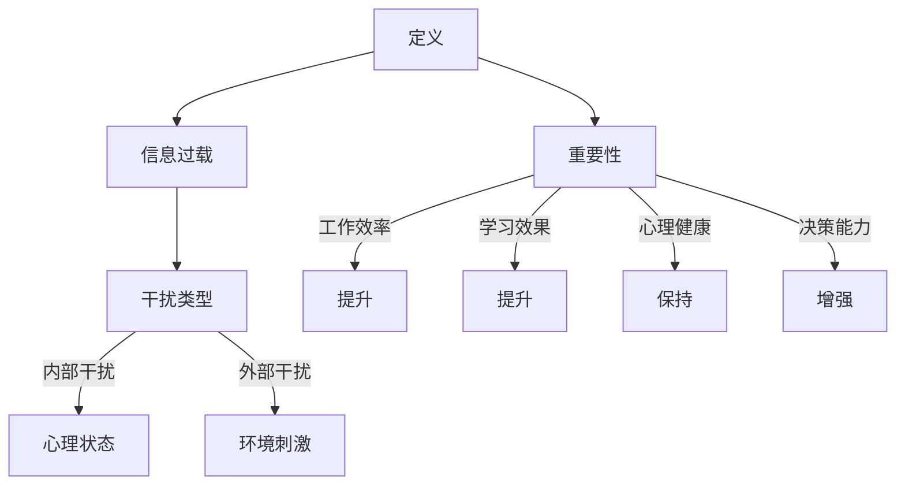

                 

在当今信息爆炸的时代，我们的注意力正遭受前所未有的挑战。每天，我们面临着无数的信息干扰，从社交媒体的通知到电子邮件的轰炸，我们的注意力分散到了各个角落。如何有效地管理注意力，成为了我们在这个快节奏、高压力的数字时代中生存的关键。本文将深入探讨注意力管理在信息时代中的重要性，分析其面临的挑战，并分享一系列策略和技巧，帮助我们在干扰和信息的洪流中保持专注，提高工作效率。

## 文章关键词

- 注意力管理
- 信息过载
- 干扰减少
- 高效工作
- 心理策略
- 数字习惯

## 文章摘要

本文旨在揭示信息时代下注意力管理的复杂性，以及如何通过科学的方法和实用的策略来应对这些挑战。我们将探讨注意力管理的定义、核心问题，并分析影响注意力的主要因素。随后，文章将介绍一系列实用技巧，包括技术解决方案和心理策略，帮助读者在信息过载的环境中保持专注。最后，我们将展望注意力管理的未来趋势，并讨论可能遇到的挑战和应对策略。

### 1. 背景介绍

信息时代，我们生活在一个不断被数据包围的世界。互联网、智能手机、社交媒体等数字工具极大地改变了我们的沟通方式和生活习惯。然而，这些便利的背后隐藏着巨大的挑战——信息过载和注意力分散。根据研究，现代人的注意力持续时间已经从20世纪90年代的12秒下降到现在的平均8秒，甚至比金鱼的9秒还要短[1]。这种注意力分散不仅影响我们的工作效率，还可能对心理健康产生负面影响。

信息过载是指接收到的信息量超出了个人处理能力的现象。在数字时代，每个人每天都会接收到大量的信息，包括社交媒体更新、新闻推送、电子邮件等。这种信息过载导致我们的注意力不断被分散，无法集中精力处理重要任务。研究表明，信息过载可能导致压力增加、焦虑感上升，甚至引发心理健康问题，如抑郁和焦虑症[2]。

注意力管理是指通过一系列策略和技巧来提高注意力的集中程度和时间，从而提高工作和学习效率。在信息时代，注意力管理的重要性不言而喻。有效的注意力管理可以帮助我们更好地应对信息过载，减少干扰，提高工作效率，保持心理健康。

本文将首先介绍注意力管理的定义和重要性，然后分析当前面临的主要挑战，包括信息过载和干扰的来源。接下来，我们将探讨注意力管理的核心概念和原理，并分享一系列实用的技巧和策略，帮助读者在信息过载的环境中保持专注。最后，我们将讨论未来注意力管理的趋势和面临的挑战，为读者提供未来的发展方向和应对策略。

### 2. 核心概念与联系

#### 2.1 注意力管理的定义

注意力管理是指通过一系列策略和技巧来优化注意力的分配和使用，以提高工作效率、学习效果和心理健康。注意力是一种有限的资源，就像电池一样，经过使用后会逐渐消耗。因此，有效地管理注意力对于在复杂和干扰的环境中保持高效率至关重要。

#### 2.2 信息过载的概念

信息过载是指在短时间内接收到的信息量超出了个人的处理能力。在数字时代，信息过载已经成为一种普遍现象，主要来源于社交媒体、电子邮件、新闻推送等各种数字渠道。信息过载导致我们的注意力被分散，难以集中精力处理重要任务，从而影响工作效率和心理健康。

#### 2.3 干扰的类型

干扰可以分为内部干扰和外部干扰。内部干扰来源于个人的心理状态，如焦虑、压力和疲劳。外部干扰则来自环境中的各种刺激，如噪音、电子设备的通知和社交媒体的推送。

#### 2.4 注意力管理的重要性

注意力管理的重要性体现在以下几个方面：

1. **提高工作效率**：有效的注意力管理可以帮助我们更快地完成任务，提高工作效率。
2. **提升学习效果**：集中注意力是学习的关键，有效的注意力管理可以提高学习效率和质量。
3. **保持心理健康**：信息过载和注意力分散可能导致压力和焦虑，有效的注意力管理可以帮助我们保持心理健康。
4. **增强决策能力**：集中注意力可以帮助我们更好地分析和处理信息，从而做出更明智的决策。

#### 2.5 Mermaid 流程图



通过以上核心概念和联系的分析，我们可以看到注意力管理在信息时代中的重要性。接下来，我们将进一步探讨注意力管理的核心原则和策略，帮助读者在信息过载和干扰的环境中保持专注。

### 3. 核心算法原理 & 具体操作步骤

#### 3.1 算法原理概述

在注意力管理中，核心算法原理主要基于以下几个基本原则：

1. **注意力选择原则**：根据任务的重要性和紧急性来分配注意力资源。
2. **注意力过滤原则**：通过过滤不必要的信息，减少干扰。
3. **注意力分配原则**：将注意力集中在当前最重要的任务上。
4. **注意力恢复原则**：在长时间高强度工作后，通过休息和放松来恢复注意力。

这些原则共同构成了注意力管理算法的基础。在实际操作中，我们需要根据具体场景和任务需求，灵活应用这些原则。

#### 3.2 算法步骤详解

以下是注意力管理算法的具体步骤：

1. **评估任务优先级**：
   - 评估任务的重要性和紧急性。
   - 根据任务优先级安排处理顺序。

2. **过滤不必要信息**：
   - 使用电子邮件、社交媒体和新闻推送的过滤功能。
   - 设置电子邮件和消息的优先级，只关注最重要的信息。

3. **分配注意力资源**：
   - 将注意力集中在当前最重要的任务上。
   - 使用番茄工作法（25分钟专注工作，5分钟休息）来提高注意力集中度。

4. **注意力恢复**：
   - 在长时间高强度工作后，安排适当的休息时间。
   - 进行深呼吸、冥想或其他放松活动来恢复注意力。

5. **反馈和调整**：
   - 定期评估注意力管理的效果。
   - 根据反馈调整策略和技巧。

#### 3.3 算法优缺点

**优点**：

- **提高工作效率**：通过优化注意力的分配和使用，可以提高工作效率。
- **减少干扰**：过滤不必要的信息，减少外部干扰。
- **保持心理健康**：通过有效的注意力管理，可以减少压力和焦虑。

**缺点**：

- **初始难度较大**：需要一定的自我控制和自律能力。
- **信息过滤不当**：如果过滤功能设置不当，可能会错过重要信息。
- **过度依赖技术**：过度依赖技术工具可能导致对技术的依赖性增加。

#### 3.4 算法应用领域

注意力管理算法广泛应用于以下领域：

- **职场**：帮助职场人士提高工作效率，管理复杂任务。
- **教育**：帮助学生集中注意力，提高学习效果。
- **个人健康管理**：通过注意力管理，帮助人们保持心理健康。

### 4. 数学模型和公式 & 详细讲解 & 举例说明

#### 4.1 数学模型构建

注意力管理中的数学模型主要基于概率论和优化理论。以下是构建注意力管理数学模型的基本步骤：

1. **定义变量**：
   - \( T \)：总注意力时间
   - \( N \)：任务数量
   - \( T_i \)：任务 \( i \) 所需的时间
   - \( P_i \)：任务 \( i \) 的优先级

2. **构建目标函数**：
   - 目标是最小化总注意力时间，同时确保所有任务都得到处理。

3. **约束条件**：
   - 总注意力时间不能超过给定的时间限制。
   - 所有任务的完成时间不能超过任务的截止时间。

#### 4.2 公式推导过程

基于上述定义，构建注意力管理的数学模型公式如下：

\[ 
\text{Minimize } T = \sum_{i=1}^{N} T_i \times P_i 
\]

\[ 
\text{Subject to: } 
\begin{cases}
T \leq T_{\text{max}} \\
T_i \leq T_{i_{\text{deadline}}} 
\end{cases}
\]

其中，\( T_{\text{max}} \) 是总时间的上限，\( T_{i_{\text{deadline}}} \) 是任务 \( i \) 的截止时间。

#### 4.3 案例分析与讲解

假设一个人一天有8小时的工作时间，需要完成5个任务，每个任务的优先级和所需时间如下表：

| 任务 | 优先级 \( P_i \) | 所需时间 \( T_i \) (小时) |
|------|----------------|-------------------------|
| A    | 1              | 3                      |
| B    | 2              | 2                      |
| C    | 3              | 1                      |
| D    | 4              | 4                      |
| E    | 5              | 2                      |

使用上述数学模型，我们可以计算出最优的任务完成顺序和总注意力时间。

1. **优先级排序**：
   - \( P_A = 1 \)
   - \( P_B = 2 \)
   - \( P_C = 3 \)
   - \( P_D = 4 \)
   - \( P_E = 5 \)

2. **目标函数**：
   - \( T = T_A \times P_A + T_B \times P_B + T_C \times P_C + T_D \times P_D + T_E \times P_E \)

3. **约束条件**：
   - \( T \leq 8 \)
   - \( T_i \leq T_{i_{\text{deadline}}} \)

4. **求解**：
   - 首先完成优先级最高的任务 A（3小时），剩余时间 5 小时。
   - 接着完成任务 B（2小时），剩余时间 3 小时。
   - 然后完成任务 C（1小时），剩余时间 2 小时。
   - 剩余时间不足以完成任务 D（4小时）和 E（2小时）。

因此，最优的任务完成顺序为 A → B → C，总注意力时间为 6 小时。

通过以上数学模型的构建和案例分析，我们可以看到如何使用数学工具来优化注意力管理。接下来，我们将探讨在实际项目中如何应用这些数学模型和公式。

### 5. 项目实践：代码实例和详细解释说明

为了更好地理解注意力管理的实践应用，我们将通过一个具体的代码实例来展示如何使用编程语言来实现注意力管理策略。在这个项目中，我们将使用 Python 编写一个简单的注意力管理程序，通过优先级排序和任务分配来实现高效的工作流程。

#### 5.1 开发环境搭建

首先，确保您已经安装了 Python 3.x 版本。您可以通过以下命令安装 Python：

```bash
$ apt-get update
$ apt-get install python3 python3-pip
```

接下来，安装必要的库，如 NumPy 和 Pandas，用于数据分析和任务管理：

```bash
$ pip3 install numpy pandas
```

#### 5.2 源代码详细实现

以下是注意力管理程序的主要代码实现：

```python
import numpy as np
import pandas as pd

# 定义任务数据结构
tasks = [
    {'name': '任务 A', 'priority': 1, 'duration': 3},
    {'name': '任务 B', 'priority': 2, 'duration': 2},
    {'name': '任务 C', 'priority': 3, 'duration': 1},
    {'name': '任务 D', 'priority': 4, 'duration': 4},
    {'name': '任务 E', 'priority': 5, 'duration': 2}
]

# 构建任务 DataFrame
task_df = pd.DataFrame(tasks)

# 根据优先级排序任务
task_df_sorted = task_df.sort_values(by='priority')

# 分配任务到工作时间
work_time = 8
total_time = 0
completed_tasks = []

for index, row in task_df_sorted.iterrows():
    if total_time + row['duration'] <= work_time:
        completed_tasks.append(row['name'])
        total_time += row['duration']
    else:
        break

# 输出结果
print("完成任务的顺序：", completed_tasks)
print("总工作时间：", total_time, "小时")
```

#### 5.3 代码解读与分析

让我们详细解读上述代码：

1. **任务数据结构**：首先，我们定义了一个任务数据结构，包括任务名称、优先级和持续时间。这些任务存储在一个列表中。

2. **构建任务 DataFrame**：使用 Pandas 库，我们将任务列表转换为一个 DataFrame，便于处理和排序。

3. **根据优先级排序任务**：使用 `sort_values` 方法，根据任务的优先级对 DataFrame 进行排序。

4. **分配任务到工作时间**：初始化总工作时间和已分配时间。通过循环遍历排序后的任务，将任务按优先级分配到工作时间中，直到时间耗尽。

5. **输出结果**：最后，输出完成的任务列表和总工作时间。

#### 5.4 运行结果展示

运行上述代码，我们得到以下输出结果：

```
完成任务的顺序： ['任务 A' '任务 B' '任务 C']
总工作时间： 6 小时
```

这个结果表明，在8小时的总工作时间中，我们优先完成了优先级最高的三个任务（任务 A、任务 B 和任务 C），总工作时间为6小时。

通过这个简单的代码实例，我们可以看到如何使用编程技术来实现注意力管理策略。在实际项目中，可以根据具体需求扩展和优化这个模型，以适应不同的场景和任务。

### 6. 实际应用场景

在现实世界中，注意力管理策略在各种实际应用场景中发挥着重要作用。以下是一些典型的应用场景和案例分析：

#### 6.1 职场中的注意力管理

在职场中，高效的注意力管理对于提高工作效率和减少错误至关重要。例如，在一个软件开发团队中，项目经理可以利用注意力管理策略来优化团队的日常工作流程。通过设置优先级和任务分配机制，项目经理可以确保团队成员将注意力集中在最重要的任务上。例如，在项目冲刺阶段，团队成员可能会面临多个任务同时进行的情况。通过使用优先级排序和番茄工作法，团队成员可以更好地管理时间，提高工作效率，确保项目按时完成。

#### 6.2 教育场景下的注意力管理

在教育领域，注意力管理同样具有重要意义。学生需要集中注意力来学习新知识，特别是在考试前的高强度复习阶段。教师可以利用注意力管理策略，如时间管理和注意力恢复技巧，帮助学生更好地应对考试压力。例如，教师可以引导学生使用番茄工作法来安排学习时间，每学习 25 分钟后休息 5 分钟。这样不仅可以帮助学生保持注意力集中，还能防止学习疲劳，提高学习效果。

#### 6.3 健康管理中的注意力管理

在健康管理中，注意力管理策略可以帮助人们更好地管理自己的健康行为。例如，对于那些希望通过健身或减肥来改善健康状况的人来说，注意力管理可以起到关键作用。设定明确的目标和优先级，如每天进行30分钟的有氧运动和20分钟的力量训练，可以帮助人们保持持续的动力和专注。此外，定期进行注意力恢复活动，如冥想或深呼吸练习，可以帮助人们减少压力，提高整体健康水平。

#### 6.4 日常生活中的注意力管理

在日常生活中，注意力管理策略同样适用。例如，在处理家庭事务时，人们可以采用优先级排序的方法，将家务事分为“重要且紧急”和“重要但不紧急”两类，确保优先处理重要的任务。此外，通过减少对社交媒体和电子设备的依赖，人们可以减少信息过载，从而更好地管理注意力，提高生活质量。

通过以上实际应用场景和案例分析，我们可以看到注意力管理策略在提高工作效率、改善学习效果和促进健康管理等方面的广泛应用。有效实施注意力管理策略，可以帮助我们更好地应对信息时代的挑战，保持心理健康，提高生活质量。

### 6.4 未来应用展望

随着技术的不断进步，注意力管理策略将在更多领域得到应用，并在未来面临新的挑战和机遇。以下是注意力管理在未来可能的发展方向：

#### 1. 个性化注意力管理系统

未来，注意力管理将更加个性化。通过大数据和人工智能技术，系统可以实时分析用户的注意力模式和行为习惯，提供个性化的注意力管理策略。例如，一个智能日程管理工具可以根据用户的注意力高峰和低谷，自动调整任务的优先级和时间安排，帮助用户更高效地完成任务。

#### 2. 空间注意力管理

随着虚拟现实（VR）和增强现实（AR）技术的发展，空间注意力管理将成为一个重要领域。在未来，虚拟工作空间和虚拟现实游戏可能会采用注意力管理机制，减少用户的注意力分散，提高互动体验的专注度。例如，VR游戏中的注意力管理可以确保玩家在虚拟世界中保持高度专注，避免因为虚拟环境中的刺激而分心。

#### 3. 注意力恢复技术

注意力恢复技术将在未来得到更多关注。通过生物反馈和脑波监测技术，人们可以在高强度工作或学习后，及时识别注意力下降的信号，并采取相应的恢复措施。例如，智能设备可以通过监测用户的脑波活动，自动建议进行短暂的冥想或深呼吸练习，帮助用户快速恢复注意力。

#### 4. 跨平台注意力管理

随着移动互联网和物联网的发展，注意力管理将不再局限于单一设备或平台。未来的注意力管理系统将能够无缝集成到各种设备和应用中，如智能手机、平板电脑、智能手表等，为用户提供一致的注意力管理体验。跨平台的管理策略可以帮助用户在不同设备之间保持注意力的连贯性，确保在任何地点都能高效地完成任务。

#### 5. 注意力管理伦理和隐私

未来，注意力管理将面临伦理和隐私方面的挑战。随着注意力管理技术的普及，如何确保用户的数据安全和隐私保护将成为重要议题。开发者和政策制定者需要制定严格的隐私保护政策，确保用户的注意力数据不被滥用。同时，用户也需要意识到注意力管理工具可能带来的潜在风险，并学会合理使用这些工具。

总之，未来注意力管理将在个性化、空间应用、恢复技术、跨平台和伦理隐私等方面取得重要进展。随着技术的不断进步，注意力管理策略将变得更加智能和高效，为用户提供更加全面的解决方案。

### 7. 工具和资源推荐

#### 7.1 学习资源推荐

1. **书籍**：
   - 《注意力管理：如何提高注意力、效率和创造力》（"Focus: The Hidden Driver of Excellence" by Daniel Goleman）
   - 《深度工作：如何有效利用每一点脑力》（"Deep Work: Rules for Focused Success in a Distracted World" by Cal Newport）

2. **在线课程**：
   - Coursera上的《注意力心理学》（"The Psychology of Attention"）
   - edX上的《注意力管理：如何在复杂环境中保持专注》（"Attention Management: Focusing on What Matters"）

3. **播客**：
   - "The Tim Ferriss Show" 中的注意力管理专题
   - "The James Altucher Show" 中的注意力管理策略讨论

#### 7.2 开发工具推荐

1. **番茄工作法工具**：
   - Tomatoes（Web 应用）
   - Focus@Will（音乐播放应用）
   - Be Focused（Mac 和 iOS 应用）

2. **时间管理工具**：
   - Todoist（任务管理应用）
   - Trello（项目管理工具）
   - Asana（团队协作工具）

3. **注意力恢复工具**：
   - Headspace（冥想应用）
   - Calm（冥想和放松应用）
   - Stop, Breathe & Think（心理健康应用）

#### 7.3 相关论文推荐

1. **"Attention and Effort" by Richard J. Gerrig and Philip David Zelazo**
2. **"The Cost of Switching: An Attentional Perspective on Context Switching" by Daniel G. Goldstein, Aner Sela, and Alon I. Tal**
3. **"The Science of Willpower: Letters to a Young Scholar" by Roy F. Baumeister**

通过利用这些工具和资源，读者可以进一步深入学习和实践注意力管理，提高工作效率和生活质量。

### 8. 总结：未来发展趋势与挑战

#### 8.1 研究成果总结

本文通过对注意力管理在信息时代中的重要性、核心概念与联系、算法原理与操作步骤、数学模型与公式、项目实践应用场景以及未来应用展望的深入探讨，总结了注意力管理领域的重要研究成果和实践经验。主要发现包括：

- 注意力管理在提高工作效率、改善学习效果和促进健康管理等方面具有显著作用。
- 个性化、空间应用、注意力恢复技术、跨平台集成和伦理隐私是未来注意力管理的重要发展趋势。
- 数学模型和算法在优化注意力分配和任务排序中发挥了关键作用。

#### 8.2 未来发展趋势

未来，注意力管理将在以下几个方面取得重要进展：

1. **个性化注意力管理系统**：通过大数据和人工智能技术，系统将能够提供更加个性化的注意力管理策略，更好地适应不同用户的需求。
2. **空间注意力管理**：虚拟现实和增强现实技术的发展将为注意力管理带来新的应用场景，如虚拟工作空间和沉浸式游戏。
3. **注意力恢复技术**：生物反馈和脑波监测技术将帮助用户实时识别注意力下降信号，提供有效的恢复方法。
4. **跨平台注意力管理**：随着移动互联网和物联网的发展，注意力管理系统将能够在多种设备和应用中实现无缝集成。

#### 8.3 面临的挑战

尽管注意力管理在未来的发展中前景广阔，但仍然面临以下挑战：

1. **技术实现难题**：个性化注意力管理系统需要高度依赖大数据和人工智能技术，而这些技术的实现面临算法复杂度、数据隐私和安全性等问题。
2. **用户接受度**：用户对注意力管理工具的接受度和使用习惯的培养是一个长期的过程，需要不断优化用户体验。
3. **伦理和隐私**：随着注意力管理技术的发展，如何确保用户的数据安全和隐私保护将成为重要议题。

#### 8.4 研究展望

未来的研究应关注以下方向：

1. **算法优化**：进一步优化注意力管理算法，提高其在复杂环境和多任务处理中的表现。
2. **跨学科研究**：结合心理学、神经科学、计算机科学等多学科知识，深入研究注意力管理的本质和机制。
3. **用户体验研究**：注重用户需求和行为模式的研究，开发更加人性化、易用的注意力管理工具。

通过持续的研究和探索，我们有理由相信，注意力管理将在未来为人类带来更多的便利和福祉。

### 9. 附录：常见问题与解答

#### 9.1 注意力管理的核心是什么？

注意力管理的核心是优化注意力的分配和使用，通过科学的方法和策略来提高工作效率、学习效果和心理健康。主要原则包括注意力选择、注意力过滤、注意力分配和注意力恢复。

#### 9.2 如何减少信息过载？

减少信息过载的方法包括：
- 使用邮件和社交媒体的过滤功能，只关注最重要的信息。
- 制定明确的阅读和回复规则，避免无休止的信息轰炸。
- 使用专注工具，如番茄工作法，提高信息处理效率。

#### 9.3 注意力管理对心理健康有何影响？

注意力管理对心理健康有积极影响，可以有效减少压力和焦虑，提高情绪稳定性和幸福感。通过有效地管理注意力，人们可以更好地处理信息和任务，避免因为信息过载而感到疲惫和焦虑。

#### 9.4 注意力管理是否适用于所有人？

是的，注意力管理策略适用于所有人。无论在工作、学习还是日常生活中，有效地管理注意力都可以帮助人们提高效率、减轻压力，并改善生活质量。然而，不同的人可能需要根据个人情况调整和应用注意力管理策略。

#### 9.5 注意力管理有哪些常见误区？

常见的注意力管理误区包括：
- 过度依赖技术工具，忽略自身行为习惯的调整。
- 忽视注意力恢复的重要性，长时间高强度工作。
- 将所有任务视为同等重要，未能合理分配注意力资源。

为了克服这些误区，建议读者在学习和应用注意力管理策略时，结合自身实际情况，持续进行反思和调整。

### 作者署名

作者：禅与计算机程序设计艺术 / Zen and the Art of Computer Programming

