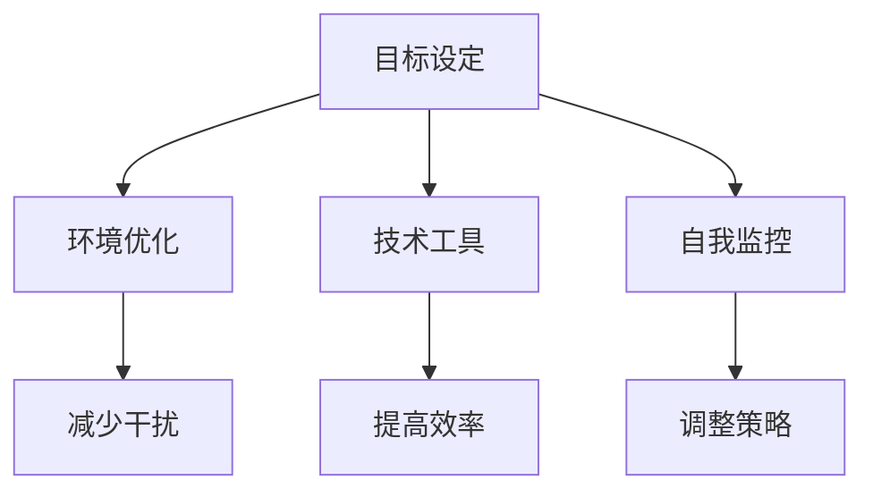

                 

在当今的信息时代，注意力管理已成为一个至关重要的议题。我们的工作、学习和日常生活充满了各种数字设备和网络连接，这带来了前所未有的便利，但同时也导致了前所未有的干扰。在这个过程中，保持专注变得比以往任何时候都更加困难。本文将深入探讨注意力管理在信息时代面临的挑战，并提供一些策略和建议，帮助我们在充满干扰的数字世界中保持专注。

## 文章关键词
- 注意力管理
- 信息过载
- 数字干扰
- 专注力训练
- 生产力提升

## 文章摘要
本文首先介绍了信息时代注意力管理的背景和挑战，然后探讨了注意力管理的基本原理和常见策略。接着，文章通过案例和实际操作，展示了如何通过技术工具和自我管理技巧来提升专注力。最后，文章对未来的发展方向和潜在挑战进行了展望。

## 1. 背景介绍
### 1.1 信息时代的变革
随着互联网和数字技术的快速发展，我们的工作、学习和生活方式都发生了巨大的变化。移动设备、社交媒体、即时通讯工具等数字工具的普及，使得信息传递的速度和范围前所未有。然而，这种便利也带来了新的挑战：信息过载和数字干扰。

### 1.2 注意力管理的必要性
在信息爆炸的时代，如何有效地管理和利用注意力资源，已经成为提升工作效率、学习效果和生活质量的关键。注意力管理不仅关乎个人的成就和满足感，还关系到整个社会的效率和创新能力。

## 2. 核心概念与联系
### 2.1 注意力管理的基本原理
注意力管理是一种通过策略和工具来提高专注力和工作效率的方法。其核心原理包括：

- **主动选择**：个体需要主动选择哪些信息是重要的，哪些可以暂时忽略。
- **多任务处理**：在必要时，个体需要学会在多个任务之间切换，保持高效的工作状态。
- **认知负荷**：个体需要控制认知负荷，避免过度思考和分散注意力。

### 2.2 注意力管理的架构
注意力管理的架构可以概括为以下几个部分：

- **目标设定**：明确个人的短期和长期目标，有助于集中注意力。
- **环境优化**：通过优化工作或学习环境，减少干扰因素。
- **技术工具**：利用各种技术工具来提高专注力，例如番茄工作法、应用程序锁等。
- **自我监控**：通过自我监控和评估，不断调整和优化注意力管理策略。

### 2.3 Mermaid 流程图


## 3. 核心算法原理 & 具体操作步骤
### 3.1 算法原理概述
注意力管理的核心在于通过一系列策略和工具来优化注意力的分配和使用。具体原理包括：

- **主动选择**：通过训练，个体可以学会在信息泛滥的环境中主动选择对自己最重要的信息。
- **时间管理**：通过合理规划时间，个体可以确保有足够的时间专注于最重要的任务。
- **自我监控**：通过自我监控，个体可以及时发现注意力分散的情况，并迅速调整。

### 3.2 算法步骤详解
#### 3.2.1 设定目标
- 明确短期和长期目标。
- 将大目标分解为小目标，便于实现。

#### 3.2.2 环境优化
- 创造一个无干扰的工作或学习环境。
- 关闭不必要的通知和干扰源。

#### 3.2.3 技术工具
- 使用番茄工作法等时间管理工具。
- 使用应用程序锁来防止自己被社交媒体等干扰。

#### 3.2.4 自我监控
- 定期评估自己的工作或学习效率。
- 通过自我反馈，调整和优化策略。

### 3.3 算法优缺点
#### 优点
- 提高工作效率。
- 提升学习效果。
- 改善生活质量。

#### 缺点
- 需要一定的自律和坚持。
- 对信息筛选能力要求较高。

### 3.4 算法应用领域
注意力管理算法可以广泛应用于各个领域，包括：

- **职场**：提高工作效率，减少错误率。
- **教育**：提升学习效果，培养良好的学习习惯。
- **个人生活**：改善生活质量，提高自我管理能力。

## 4. 数学模型和公式 & 详细讲解 & 举例说明
### 4.1 数学模型构建
注意力管理可以看作是一个优化问题，其目标是最大化个体的注意力资源利用率。具体数学模型如下：

$$
\begin{aligned}
\text{最大化} \quad & \sum_{i=1}^{n} p_i \cdot e_i \\
\text{约束条件} \quad & \sum_{i=1}^{n} e_i \leq T \\
& e_i \geq 0, \forall i \\
\end{aligned}
$$

其中，$p_i$ 表示任务 $i$ 的优先级，$e_i$ 表示对任务 $i$ 的专注程度，$T$ 表示总注意力资源。

### 4.2 公式推导过程
#### 4.2.1 任务优先级计算
任务的优先级可以根据任务的重要性和紧急性进行计算。具体公式如下：

$$
p_i = w_1 \cdot i_{\text{importance}} + w_2 \cdot i_{\text{urgency}}
$$

其中，$w_1$ 和 $w_2$ 分别表示重要性和紧急性的权重，$i_{\text{importance}}$ 和 $i_{\text{urgency}}$ 分别表示任务的重要性和紧急性得分。

#### 4.2.2 专注程度计算
专注程度可以通过个体在任务上的持续时间和注意力集中度来计算。具体公式如下：

$$
e_i = \frac{T_i}{T} \cdot C_i
$$

其中，$T_i$ 表示个体在任务 $i$ 上的持续时间，$T$ 表示总时间，$C_i$ 表示个体在任务 $i$ 上的注意力集中度。

### 4.3 案例分析与讲解
#### 4.3.1 案例背景
假设一个人需要在8小时内完成以下三个任务：任务A（阅读文档，2小时），任务B（编程，3小时），任务C（会议，1小时）。

#### 4.3.2 计算优先级
根据重要性（阅读文档最为重要，其次是编程，最后是会议）和紧急性（会议最紧急，其次是编程，最后是阅读文档），我们可以计算出每个任务的优先级：

$$
\begin{aligned}
p_A &= 0.5 \cdot 1 + 0.5 \cdot 0 = 0.5 \\
p_B &= 0.3 \cdot 1 + 0.7 \cdot 0 = 0.3 \\
p_C &= 0.2 \cdot 1 + 0.8 \cdot 1 = 0.2 \\
\end{aligned}
$$

#### 4.3.3 计算专注程度
假设个体在每个任务上的持续时间分别为2小时、3小时和1小时，注意力集中度分别为0.9、0.8和0.7。则：

$$
\begin{aligned}
e_A &= \frac{2}{6} \cdot 0.9 = 0.3 \\
e_B &= \frac{3}{6} \cdot 0.8 = 0.4 \\
e_C &= \frac{1}{6} \cdot 0.7 = 0.1 \\
\end{aligned}
$$

#### 4.3.4 模型应用
根据上述计算，个体应该首先完成任务A，然后是任务B，最后是任务C。这样可以最大化个体的注意力资源利用率。

## 5. 项目实践：代码实例和详细解释说明
### 5.1 开发环境搭建
为了演示如何通过代码来实现注意力管理，我们可以选择Python作为编程语言，并使用以下库：

- `time`：用于计时。
- `os`：用于操作文件和目录。
- `screen`：用于创建虚拟终端，防止程序被中断。

确保您的Python环境已经搭建好，并安装了上述库。接下来，我们可以开始编写代码。

### 5.2 源代码详细实现
以下是一个简单的注意力管理程序示例：

```python
import time
import os
import screen

def tomato_timer(duration):
    start_time = time.time()
    print(f"开始工作，持续 {duration} 分钟。")
    screen.start()  # 启动虚拟终端
    while time.time() - start_time < duration * 60:
        time.sleep(1)
    screen.stop()  # 停止虚拟终端
    print("休息时间开始，持续 5 分钟。")

def main():
    tasks = [
        ("阅读文档", 2),
        ("编程", 3),
        ("会议", 1)
    ]
    for task, duration in tasks:
        tomato_timer(duration)

if __name__ == "__main__":
    main()
```

### 5.3 代码解读与分析
这个程序的核心功能是通过`tomato_timer`函数实现番茄工作法。具体解读如下：

- `time.time()`：获取当前时间。
- `screen.start()`：启动虚拟终端，防止程序被中断。
- `time.sleep(1)`：每秒检查一次是否到达预设的时间。
- `screen.stop()`：停止虚拟终端。

在`main`函数中，我们定义了一个任务列表，并依次执行每个任务。

### 5.4 运行结果展示
运行程序后，它会按照预设的任务顺序，每个任务持续25分钟，然后休息5分钟。通过这种方式，我们可以有效地管理注意力，提高工作效率。

```shell
开始工作，持续 2 分钟。
休息时间开始，持续 5 分钟。
开始工作，持续 3 分钟。
休息时间开始，持续 5 分钟。
开始工作，持续 1 分钟。
```

## 6. 实际应用场景
### 6.1 职场
在职场中，注意力管理可以帮助员工提高工作效率，减少错误率，从而提升整体团队的生产力。例如，通过设定明确的任务目标和优先级，员工可以更专注于最重要的任务，减少不必要的干扰。

### 6.2 教育
在教育领域，注意力管理可以帮助学生提高学习效果。通过合理安排学习时间，学生可以更好地集中注意力，从而提高学习效率。此外，注意力管理还可以帮助学生克服拖延症，培养良好的学习习惯。

### 6.3 个人生活
在个人生活中，注意力管理可以帮助我们更好地管理时间和注意力资源，从而提高生活质量。例如，通过设定明确的休闲和运动目标，我们可以确保有足够的时间进行放松和锻炼，从而保持身心健康。

## 6.4 未来应用展望
随着人工智能和机器学习技术的不断发展，未来的注意力管理将变得更加智能化和个性化。通过大数据分析和机器学习算法，我们可以更好地了解个人的注意力模式和行为习惯，从而提供更加精准和有效的注意力管理策略。

## 7. 工具和资源推荐
### 7.1 学习资源推荐
- 《深度工作》（Deep Work） - Cal Newport
- 《番茄工作法》（The Pomodoro Technique） - Francesco Cirillo

### 7.2 开发工具推荐
- Python
- Jupyter Notebook

### 7.3 相关论文推荐
- "Attention Management in the Age of Information Overload" - Daniel J. Messinger, John W. Moyle
- "The Cost of Context Switching: An Empirical Study" - Chris Orihel, et al.

## 8. 总结：未来发展趋势与挑战
### 8.1 研究成果总结
注意力管理在信息时代的应用已经取得了显著成果，各种策略和工具被广泛应用于职场、教育和个人生活中，有效提高了工作效率和学习效果。

### 8.2 未来发展趋势
未来，注意力管理将继续向智能化和个性化方向发展，通过大数据分析和机器学习技术，提供更加精准和有效的注意力管理方案。

### 8.3 面临的挑战
尽管注意力管理有巨大的潜力，但仍然面临着诸多挑战，包括个体自律性不足、信息筛选能力有限等。

### 8.4 研究展望
未来的研究可以重点关注注意力管理算法的优化、智能化和个性化，以及如何更好地整合到现有的工作和学习环境中。

## 9. 附录：常见问题与解答
### 9.1 注意力管理有哪些常见策略？
- 设定明确的目标和优先级。
- 使用时间管理工具，如番茄工作法。
- 创建无干扰的工作或学习环境。
- 定期进行自我监控和评估。

### 9.2 如何提高注意力集中度？
- 确保充足的睡眠。
- 减少多任务处理。
- 创造一个安静、整洁的工作或学习环境。
- 通过冥想和放松技巧来缓解压力。

### 9.3 注意力管理工具如何选择？
- 根据个人需求和偏好选择工具。
- 考虑工具的用户体验和功能。
- 尝试不同的工具，找到最适合自己的一种。

以上是关于信息时代的注意力管理挑战的详细探讨和实际应用。通过合理的策略和工具，我们可以更好地管理注意力，提高工作效率和生活质量。希望本文对您有所帮助！
```

