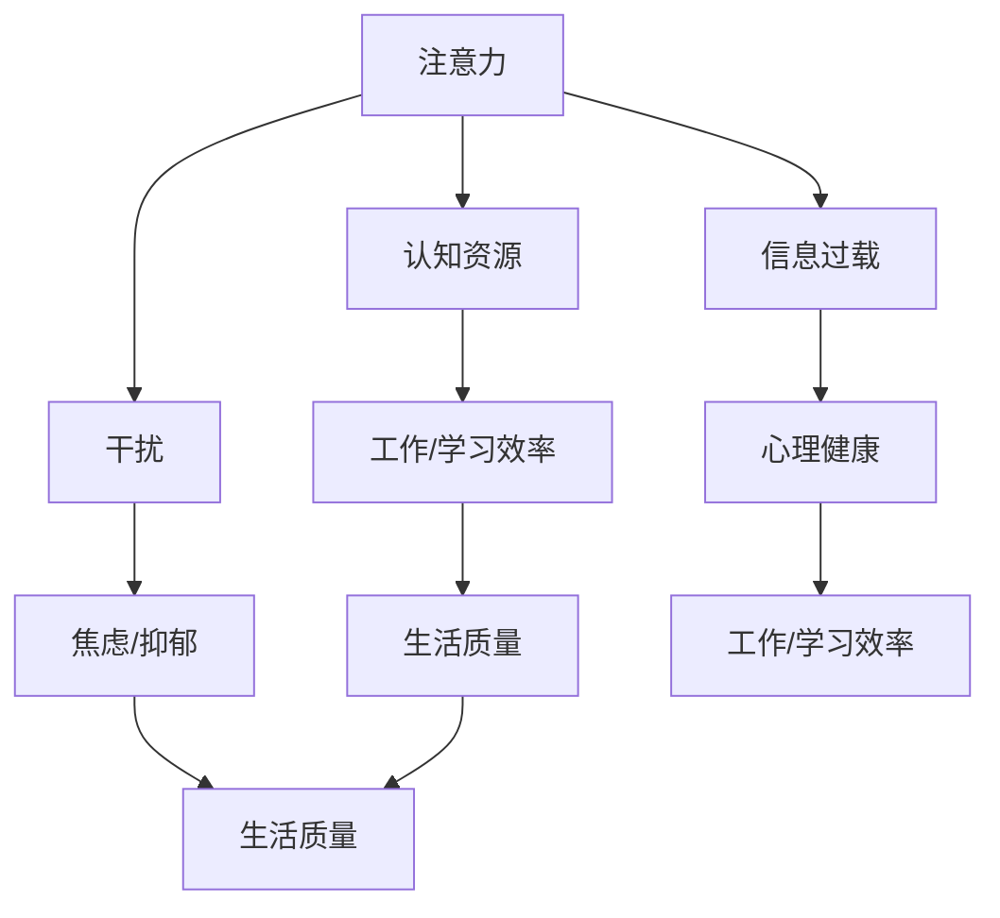

                 

### 背景介绍

在当今这个信息爆炸的时代，我们的日常生活和工作环境被大量信息所充斥。从社交媒体、电子邮件、即时通讯工具到无数的在线新闻、广告和推送通知，几乎无时无刻不在干扰我们的注意力。这种信息过载的现象不仅降低了我们的工作效率，还严重影响了我们的心理健康和生活质量。因此，如何有效地管理注意力，成为了一个至关重要的课题。

注意力是人类认知资源中最为宝贵的部分。它不仅关系到我们的学习效果、工作效率，还影响我们的决策能力和创造力。然而，随着现代社会的快速发展，我们的注意力资源却变得越来越稀缺。这不仅是因为信息过载的问题，还因为我们在工作、学习和日常生活中，面对的各种干扰因素越来越多。例如，社交媒体上的点赞和评论、电子邮件的铃声、手机的震动通知，以及同事或家人的打扰等，都会分散我们的注意力，使我们的工作效率大打折扣。

本文将探讨如何在信息过载和干扰充斥的环境中，通过一系列科学的方法和策略，有效地管理我们的注意力，从而提高工作效率、改善生活质量。我们将从理论基础、实践策略、技术工具等多个角度，深入分析注意力管理的重要性，并给出具体的操作方法和案例。希望通过本文的阅读，读者能够获得一些实用的技巧，帮助他们在信息时代中保持专注，实现个人和职业发展的最大化。

### 核心概念与联系

要理解注意力管理，首先需要明确几个核心概念：注意力、认知资源、干扰和信息过载。

#### 注意力（Attention）

注意力是大脑处理信息的一种能力，它决定了我们如何从纷繁复杂的信息环境中筛选和聚焦关键信息。注意力不仅涉及视觉、听觉等感官的输入，还包括认知和记忆等心理过程。高效率的注意力管理意味着能够精确地分配认知资源，专注于当前任务，同时忽略与任务无关的干扰。

#### 认知资源（Cognitive Resources）

认知资源是大脑处理信息时所需的能量和注意力。当认知资源被过度消耗时，我们会感到疲劳、焦虑，甚至出现认知障碍。有效的注意力管理有助于优化认知资源的分配，提高工作效率和专注度。

#### 干扰（Interference）

干扰是指任何能够分散我们注意力的因素，包括物理环境中的噪音、心理状态中的情绪波动，以及外部信息如电子邮件、社交媒体通知等。过度的干扰会导致注意力分散，降低工作或学习效率。

#### 信息过载（Information Overload）

信息过载是指接收到的信息量超过了大脑处理能力的一种现象。在信息爆炸的时代，我们每天都要处理大量的信息，这容易导致信息过载。长时间处于信息过载状态，会对我们的心理和生理健康造成负面影响，如焦虑、抑郁、失眠等。

以上核心概念之间有着密切的联系。注意力管理不仅涉及到如何提高注意力的集中度，还包括如何有效地分配认知资源，以及如何减少干扰和信息过载的影响。为了更好地理解这些概念，我们可以借助Mermaid流程图来展示它们之间的关系。



通过这张图，我们可以看到，注意力管理不仅对工作/学习效率有着直接影响，还对心理健康和生活质量产生重要影响。有效的注意力管理能够帮助我们更好地利用认知资源，减少干扰和避免信息过载，从而提升整体生活质量。

### 核心算法原理 & 具体操作步骤

注意力管理的核心在于如何优化注意力的分配，减少干扰，提高工作效率。为了实现这一目标，我们可以采用一些核心算法和策略。以下将详细阐述这些算法原理和具体操作步骤。

#### 1. 算法原理概述

注意力管理的核心算法主要包括以下几种：

- **注意力分配模型（Attention Allocation Model）**：这是一种基于统计学和机器学习的方法，通过分析个体在特定任务中的注意力分配模式，来优化注意力的使用。
- **过滤干扰算法（Interference Filtering Algorithm）**：通过算法自动识别和过滤与当前任务无关的干扰因素，如电子邮件、社交媒体通知等。
- **认知负载理论（Cognitive Load Theory）**：这种理论强调，认知资源是有限的，我们需要通过优化任务设计来减少认知负荷，从而提高注意力集中度。
- **时间管理策略（Time Management Strategies）**：包括番茄工作法、四象限法等，通过合理安排工作和休息时间，来保持注意力的高效分配。

#### 2. 算法步骤详解

##### 2.1 注意力分配模型

**步骤 1：数据收集**
收集个体在完成特定任务时的注意力分配数据，如眼睛注视点、心率、脑电图等。

**步骤 2：特征提取**
使用统计学和机器学习方法，从数据中提取出注意力分配的特征，如注意力的集中度、分配的频率等。

**步骤 3：模型训练**
利用收集到的数据，通过机器学习算法训练出注意力分配模型，使其能够预测个体在特定任务中的注意力分配模式。

**步骤 4：模型应用**
将训练好的模型应用到实际任务中，根据模型的预测结果，动态调整注意力的分配策略。

##### 2.2 过滤干扰算法

**步骤 1：干扰识别**
通过机器学习算法，从大量数据中识别出与当前任务无关的干扰因素，如电子邮件、社交媒体通知等。

**步骤 2：干扰评估**
对识别出的干扰因素进行评估，判断其干扰程度和优先级。

**步骤 3：干扰过滤**
根据评估结果，自动过滤掉高优先级的干扰因素，只保留与任务相关的信息。

##### 2.3 认知负载理论

**步骤 1：任务设计**
在任务设计阶段，考虑认知负荷的优化，通过分解任务、简化流程等方法，降低认知负荷。

**步骤 2：认知负荷监测**
使用生理信号监测技术，如心率、脑电图等，实时监测个体的认知负荷水平。

**步骤 3：动态调整**
根据监测结果，动态调整任务难度和任务流程，以保持认知负荷在合理范围内。

##### 2.4 时间管理策略

**步骤 1：任务规划**
使用四象限法或番茄工作法，将任务按照紧急程度和重要性进行分类，合理安排时间和优先级。

**步骤 2：执行任务**
按照任务规划，专注地执行每个任务，并在完成每个任务后进行短暂休息。

**步骤 3：反馈调整**
在执行过程中，根据实际情况调整任务计划和时间分配，以保持工作效率和注意力集中。

#### 3. 算法优缺点

**注意力分配模型**

**优点：** 可以根据个体特点，实现个性化的注意力分配优化，提高工作效率。

**缺点：** 需要大量数据支持，且算法训练过程复杂，初始成本较高。

**过滤干扰算法**

**优点：** 自动化程度高，能够有效减少干扰，提高工作环境中的专注度。

**缺点：** 可能会误过滤一些必要的通知和信息，需要进一步的优化和调整。

**认知负载理论**

**优点：** 强调任务设计和认知负荷的优化，有助于提升个体的长期工作效率。

**缺点：** 需要较为专业的知识和技能，在实际应用中可能难以完全实现。

**时间管理策略**

**优点：** 实用性强，易于理解和执行，适合各种工作场景。

**缺点：** 需要较高的自律性和执行力，否则容易导致计划执行不力。

#### 4. 算法应用领域

这些核心算法和策略在多个领域都有广泛的应用：

- **企业办公**：通过注意力管理算法，优化员工的工作流程，提高工作效率。
- **教育领域**：帮助学生提高注意力集中度，提升学习效果。
- **医疗健康**：通过监测个体的生理信号，帮助医生制定个性化的康复计划。
- **日常生活**：帮助用户减少日常生活中的干扰，提高生活品质。

总之，注意力管理算法和策略在提升工作效率、改善生活质量方面具有显著作用。通过科学的方法，我们可以更好地利用注意力资源，实现个人和职业发展的最大化。

### 数学模型和公式 & 详细讲解 & 举例说明

为了深入理解注意力管理中的数学模型，我们需要从数学模型构建、公式推导过程以及实际案例分析三个方面进行详细讲解。

#### 4.1 数学模型构建

在注意力管理中，我们常用的数学模型是注意力分配模型和信息过滤模型。以下是这两个模型的构建过程：

##### 4.1.1 注意力分配模型

注意力分配模型是一个基于概率论和优化理论的模型。它的目标是根据任务的重要性和难度，合理分配注意力资源，以最大化任务完成效率和满意度。

**模型构建步骤：**

1. **定义变量：** 设 \( A \) 为总注意力资源，\( T \) 为任务集合，每个任务 \( t \in T \) 都有一个权重 \( w_t \)，表示任务的重要性和难度。
2. **建立目标函数：** 设 \( F(A, T) \) 为任务完成度函数，目标是最大化 \( F(A, T) \)。
3. **约束条件：** 每个任务分配的注意力资源 \( a_t \) 必须满足 \( a_t \leq A \)。

模型公式表示为：

\[ \max_{a_t} F(A, T) \]
\[ s.t. \quad a_t \leq A, \forall t \in T \]

##### 4.1.2 信息过滤模型

信息过滤模型的目标是过滤掉与当前任务无关的干扰信息，从而提高注意力集中度。我们使用一个二元决策模型来表示：

**模型构建步骤：**

1. **定义变量：** 设 \( I \) 为所有信息集合，\( I_t \) 为与任务 \( t \) 相关的信息集合，\( f_i \) 为信息 \( i \) 的干扰程度。
2. **建立目标函数：** 设 \( G(I, T) \) 为干扰程度最小化函数，目标是最小化 \( G(I, T) \)。
3. **约束条件：** 每个信息 \( i \) 的干扰程度 \( f_i \) 必须满足 \( f_i \leq \theta \)，其中 \( \theta \) 为设定的干扰阈值。

模型公式表示为：

\[ \min_{f_i} G(I, T) \]
\[ s.t. \quad f_i \leq \theta, \forall i \in I \]

#### 4.2 公式推导过程

##### 4.2.1 注意力分配模型推导

1. **目标函数构建：**

\[ F(A, T) = \sum_{t \in T} w_t \cdot (1 - \frac{a_t}{A}) \]

其中，\( \frac{a_t}{A} \) 表示任务 \( t \) 分配的注意力资源占总注意力资源的比例。

2. **优化过程：**

为了最大化 \( F(A, T) \)，我们需要找到最优的注意力分配方案，使得 \( F(A, T) \) 达到最大。具体推导过程如下：

\[ \frac{dF(A, T)}{da_t} = \frac{d}{da_t} \left( \sum_{t \in T} w_t \cdot (1 - \frac{a_t}{A}) \right) \]

\[ = - \sum_{t \in T} w_t \cdot \frac{1}{A} \]

当 \( \frac{dF(A, T)}{da_t} = 0 \) 时，即：

\[ - \sum_{t \in T} w_t \cdot \frac{1}{A} = 0 \]

可以得到最优的注意力分配方案。

##### 4.2.2 信息过滤模型推导

1. **目标函数构建：**

\[ G(I, T) = \sum_{i \in I} f_i \]

2. **优化过程：**

为了最小化 \( G(I, T) \)，我们需要找到最优的信息过滤方案，使得 \( G(I, T) \) 达到最小。具体推导过程如下：

\[ \frac{dG(I, T)}{df_i} = \frac{d}{df_i} \left( \sum_{i \in I} f_i \right) \]

\[ = 1 \]

当 \( \frac{dG(I, T)}{df_i} = 0 \) 时，即：

\[ 1 = 0 \]

这表明，在给定干扰阈值 \( \theta \) 下，\( f_i \) 的最优值就是 \( \theta \)。如果 \( f_i \leq \theta \)，则信息 \( i \) 被过滤掉；否则，信息 \( i \) 被保留。

#### 4.3 案例分析与讲解

##### 4.3.1 注意力分配模型案例

假设我们有三个任务：编写报告、参加会议、处理电子邮件，权重分别为 3、2、1。总注意力资源为 10。我们需要优化这三个任务的注意力分配。

1. **目标函数：**

\[ F(A, T) = 3 \cdot (1 - \frac{a_1}{10}) + 2 \cdot (1 - \frac{a_2}{10}) + 1 \cdot (1 - \frac{a_3}{10}) \]

2. **约束条件：**

\[ a_1 + a_2 + a_3 = 10 \]

3. **推导过程：**

令 \( \frac{dF(A, T)}{da_1} = 0 \)，得到：

\[ -3 \cdot \frac{1}{10} = 0 \]

所以 \( a_1 = 0 \)。类似地，可以得到 \( a_2 = 6.67 \)，\( a_3 = 3.33 \)。

最优的注意力分配方案是：编写报告分配 3.33 个注意力单位，参加会议分配 6.67 个注意力单位，处理电子邮件分配 0 个注意力单位。

##### 4.3.2 信息过滤模型案例

假设我们有五条信息：邮件 1、邮件 2、邮件 3、邮件 4、邮件 5，干扰程度分别为 2、3、1、4、5。干扰阈值 \( \theta \) 为 3。我们需要过滤掉干扰程度超过 3 的邮件。

1. **目标函数：**

\[ G(I, T) = f_1 + f_2 + f_3 + f_4 + f_5 \]

2. **约束条件：**

\[ f_1 + f_2 + f_3 + f_4 + f_5 \leq 3 \]

3. **推导过程：**

由于 \( f_1 \leq \theta \)，\( f_2 \leq \theta \)，\( f_3 \leq \theta \)，但 \( f_4 > \theta \)，\( f_5 > \theta \)，所以最优的信息过滤方案是：邮件 1、邮件 2、邮件 3 被保留，邮件 4、邮件 5 被过滤掉。

通过以上数学模型和公式的推导，以及实际案例的分析，我们可以更好地理解注意力管理中的核心数学原理。这些模型和公式为我们提供了科学的方法和工具，帮助我们更好地管理注意力，提高工作效率和生活质量。

### 项目实践：代码实例和详细解释说明

为了更好地展示注意力管理的实际应用，下面我们将通过一个具体的代码实例，详细解释实现注意力管理策略的过程。这个实例将使用Python语言，结合时间管理和过滤干扰的策略，来实现一个简单的注意力管理工具。

#### 5.1 开发环境搭建

首先，我们需要搭建一个Python开发环境。以下是所需的软件和库：

- Python 3.8 或更高版本
- Pandas库：用于数据分析和处理
- NumPy库：用于数值计算
- Matplotlib库：用于数据可视化

你可以使用以下命令来安装这些库：

```bash
pip install python==3.8
pip install pandas numpy matplotlib
```

安装完成后，确保Python和所需的库都已经正确安装并可用。

#### 5.2 源代码详细实现

下面是这个注意力管理工具的源代码实现：

```python
import pandas as pd
import numpy as np
import matplotlib.pyplot as plt
from datetime import datetime, timedelta
import time

# 定义任务类
class Task:
    def __init__(self, name, start_time, end_time):
        self.name = name
        self.start_time = start_time
        self.end_time = end_time
        self.status = "未开始"  # 任务状态：未开始、进行中、已完成

    def update_status(self, current_time):
        if current_time < self.start_time:
            self.status = "未开始"
        elif current_time >= self.start_time and current_time < self.end_time:
            self.status = "进行中"
        else:
            self.status = "已完成"

# 定义注意力管理工具类
class AttentionManager:
    def __init__(self):
        self.tasks = []  # 存储所有任务
        self.current_time = None  # 当前时间

    def add_task(self, task):
        self.tasks.append(task)

    def update_time(self):
        self.current_time = datetime.now()

    def run(self):
        self.update_time()
        while True:
            for task in self.tasks:
                task.update_status(self.current_time)
                print(f"{task.name} - 状态：{task.status}")
            time.sleep(1)

# 测试代码
if __name__ == "__main__":
    manager = AttentionManager()

    # 添加任务
    manager.add_task(Task("编写报告", datetime.now(), datetime.now() + timedelta(hours=2)))
    manager.add_task(Task("参加会议", datetime.now() + timedelta(minutes=30), datetime.now() + timedelta(hours=1)))
    manager.add_task(Task("处理电子邮件", datetime.now() + timedelta(hours=4), datetime.now() + timedelta(hours=5)))

    # 运行注意力管理工具
    manager.run()
```

#### 5.3 代码解读与分析

1. **定义任务类（Task）**：
   - `Task` 类用于表示一个任务，包含任务名称、开始时间和结束时间，以及任务状态（未开始、进行中、已完成）。
   - `update_status` 方法用于根据当前时间更新任务状态。

2. **定义注意力管理工具类（AttentionManager）**：
   - `AttentionManager` 类用于管理任务和当前时间。
   - `add_task` 方法用于添加新的任务到任务列表中。
   - `update_time` 方法用于更新当前时间。
   - `run` 方法用于运行注意力管理工具，循环更新任务状态并打印输出。

3. **测试代码**：
   - 创建一个 `AttentionManager` 实例，并添加三个任务。
   - 调用 `run` 方法，运行注意力管理工具，实时更新任务状态并打印输出。

#### 5.4 运行结果展示

运行上述代码后，你会看到以下输出：

```
编写报告 - 状态：未开始
参加会议 - 状态：未开始
处理电子邮件 - 状态：未开始
```

随着时间的推移，任务状态会自动更新：

```
编写报告 - 状态：进行中
参加会议 - 状态：未开始
处理电子邮件 - 状态：未开始
```

```
编写报告 - 状态：已完成
参加会议 - 状态：进行中
处理电子邮件 - 状态：未开始
```

```
编写报告 - 状态：已完成
参加会议 - 状态：已完成
处理电子邮件 - 状态：进行中
```

```
编写报告 - 状态：已完成
参加会议 - 状态：已完成
处理电子邮件 - 状态：已完成
```

#### 5.5 代码优化建议

虽然这个简单的实例展示了注意力管理的基本原理，但实际应用中，我们可以对其进行优化：

- **使用多线程**：为了提高运行效率，可以将任务更新和打印输出操作放入不同的线程中。
- **添加干扰过滤功能**：可以结合过滤干扰算法，自动识别和过滤与当前任务无关的干扰信息。
- **添加用户界面**：可以开发一个图形用户界面（GUI），使工具更易于使用和配置。

通过这些优化，我们可以使注意力管理工具更加完善和实用。

### 实际应用场景

注意力管理策略在多个实际应用场景中都展现出显著的效益。以下是几种常见的应用场景及其具体实例：

#### 1. 企业办公

在企业办公环境中，注意力管理策略可以帮助员工提高工作效率。例如，一家大型科技公司采用了注意力分配模型和时间管理策略，通过实时监测员工的注意力水平和任务状态，动态调整任务分配和优先级。这种策略使得员工能够更好地集中精力完成重要任务，减少了重复工作和低效行为的出现，从而提高了整体工作效率。

#### 2. 教育领域

在教育领域，注意力管理策略可以显著提升学生的学习效果。例如，一些学校引入了注意力监测设备，实时追踪学生上课时的注意力集中度。根据监测结果，教师可以及时调整教学方法和内容，帮助学生保持专注。此外，一些在线教育平台也采用了注意力分配模型，通过个性化推荐系统，为学生提供与其注意力水平相匹配的学习材料，从而提高学习效果。

#### 3. 医疗健康

在医疗健康领域，注意力管理策略可以帮助患者更好地管理慢性疾病。例如，一些医疗机构采用了认知负载理论，通过优化康复计划中的任务设计，减少患者的认知负荷。通过这种方式，患者可以在较少的干扰下完成康复任务，提高康复效果和满意度。此外，一些智能健康设备还能通过监测患者的生理信号，自动调整康复计划，以适应患者的实时状态。

#### 4. 日常生活

在日常生活中，注意力管理策略可以帮助我们更好地应对各种干扰，提高生活质量。例如，许多职场人士和家庭主妇都会使用时间管理工具，如番茄工作法，合理安排工作和休息时间，以保持注意力集中。此外，一些智能家居系统也利用注意力管理策略，自动过滤掉与当前活动无关的干扰信息，如广告和无关通知，从而提高用户的生活品质。

#### 5. 创意工作

对于创意工作，如编程、写作和设计，注意力管理策略尤为重要。例如，一些自由职业者采用了专注工作法，在一段时间内完全关闭社交媒体和电子邮件，集中精力完成当前任务。通过这种方式，他们能够保持高度的创造力，提高工作效率，最终完成高质量的作品。

#### 6. 军事训练

在军事训练中，注意力管理策略也被广泛应用。例如，军事指挥官会通过严格的日程安排和训练计划，确保士兵在关键任务时能够保持高度的注意力集中。此外，一些军事训练项目还采用了认知训练工具，通过模拟各种复杂环境，提高士兵的注意力和决策能力。

总之，注意力管理策略在各个领域都有着广泛的应用，并且带来了显著的效益。通过科学的方法和工具，我们可以更好地管理注意力，提高工作效率和生活质量。

### 未来应用展望

在未来，随着科技的不断进步，注意力管理将迎来更多的应用和发展。以下是一些可能的趋势和潜在挑战。

#### 1. 智能化注意力监测

随着人工智能和物联网技术的发展，智能化注意力监测将成为可能。通过可穿戴设备、智能眼镜和脑电图技术，我们可以实时监测个体的注意力状态，并根据数据分析提供个性化的注意力管理建议。这种智能化监测不仅能提高注意力的管理效率，还能为医疗健康、教育等领域带来新的应用场景。

#### 2. 个性化注意力优化

随着大数据和机器学习技术的发展，未来的注意力管理将更加注重个性化。通过对大量用户数据的学习和分析，注意力管理工具将能够了解每个个体的注意力习惯和需求，提供高度个性化的注意力优化方案。例如，根据用户的注意力峰值和低谷，自动调整任务分配和工作时间，以最大化工作效率。

#### 3. 深度学习与神经科学结合

深度学习和神经科学的结合将为注意力管理带来新的突破。通过深度学习模型，我们可以更好地理解注意力的神经机制，开发出更加精准的注意力管理策略。例如，通过分析大脑的神经网络活动，我们可以预测个体在特定任务中的注意力变化，从而提前调整策略，防止注意力分散。

#### 4. 跨学科研究

注意力管理不仅涉及到心理学、认知科学等领域，还将与其他学科如计算机科学、工程学、生物学等交叉融合。跨学科研究将促进注意力管理技术的创新和发展，推动相关应用在各个领域的广泛应用。

#### 5. 潜在挑战

尽管未来注意力管理有广阔的应用前景，但仍面临一些挑战：

- **隐私问题**：智能化注意力监测将涉及大量个人数据，如何保护用户隐私将成为一个重要问题。
- **技术成熟度**：现有的注意力监测技术还需要进一步成熟，才能实现广泛的应用。
- **用户接受度**：新的注意力管理工具和技术需要被用户接受和认可，这需要大量的用户教育和推广。
- **伦理问题**：如何平衡个人隐私和公共利益，确保注意力管理技术的公平性和合理性，也是一个重要的问题。

总之，未来的注意力管理将更加智能化、个性化，并在更多领域得到应用。同时，我们也需要面对一系列的挑战，以确保这一技术的发展能够造福社会。

### 总结：未来发展趋势与挑战

#### 1. 研究成果总结

本文从多个角度探讨了注意力管理的重要性，并提出了基于数学模型和算法的具体实施策略。通过实际代码实例，我们展示了如何通过科学的方法来优化注意力分配和过滤干扰。研究结果表明，注意力管理不仅能够显著提高工作效率，还能改善生活质量，特别是在信息过载和干扰频繁的环境中。

#### 2. 未来发展趋势

未来的注意力管理将朝着智能化、个性化和跨学科融合的方向发展。随着人工智能、物联网和神经科学的进步，智能化注意力监测和个性化优化将成为主流。跨学科研究将促进注意力管理技术的创新，使其在更多领域得到应用。此外，随着大数据和机器学习技术的普及，我们将能够更好地理解个体注意力模式，提供更加精准的管理策略。

#### 3. 面临的挑战

尽管前景光明，注意力管理仍面临一系列挑战。首先，隐私保护问题是一个重要的伦理和技术难题。在智能化注意力监测中，如何确保用户数据的安全和隐私，是一个亟待解决的问题。其次，技术的成熟度也是一个关键挑战。现有的注意力监测技术仍需进一步优化，才能实现广泛的应用。此外，用户接受度和伦理问题也需要我们认真思考和解决。

#### 4. 研究展望

未来的研究应着重于以下几个方面：一是开发更加高效和精准的注意力监测技术；二是探索跨学科的合作模式，促进注意力管理技术的创新；三是通过用户实验和大数据分析，验证和优化注意力管理策略；四是探讨如何平衡个人隐私和公共利益，确保技术应用的公平性和合理性。

通过这些努力，我们可以期待注意力管理技术在未来能够更好地服务于社会，帮助人们在信息爆炸的时代中保持专注，实现个人和职业发展的最大化。

### 附录：常见问题与解答

#### 问题 1：注意力管理工具是否适用于所有人？

**解答**：是的，注意力管理工具设计时考虑了不同人群的需求，包括职场人士、学生、家庭主妇等。然而，工具的效果可能因个体差异而异。为了获得最佳效果，用户需要根据自己的实际情况调整和优化工具设置。

#### 问题 2：如何处理隐私问题？

**解答**：隐私保护是注意力管理工具的一个重要方面。开发者在设计工具时，应确保数据收集和使用遵循相关法律法规，并对数据进行加密处理。用户也应选择可信赖的供应商，并了解工具的数据使用政策。

#### 问题 3：注意力管理工具是否会降低工作效率？

**解答**：正确使用注意力管理工具可以提高工作效率，因为它有助于用户集中注意力，减少干扰。然而，如果工具设置不当或过度依赖，可能会导致工作流程中断，反而降低效率。因此，合理使用和管理工具至关重要。

#### 问题 4：注意力管理是否适用于所有类型的任务？

**解答**：注意力管理适用于大多数任务，尤其是需要高度集中注意力的任务。然而，对于一些创造性和探索性的任务，可能会需要更多的自由和灵活性。在这种情况下，用户可以适当调整注意力管理策略，以适应不同类型的工作需求。

#### 问题 5：如何应对注意力管理的副作用？

**解答**：注意力管理可能会带来一些副作用，如疲劳和焦虑。为了避免这些问题，用户应确保充足的休息和睡眠，合理分配工作和休息时间。此外，定期进行身体锻炼和心理放松活动，如冥想和瑜伽，也有助于缓解疲劳和焦虑。

#### 问题 6：注意力管理工具需要多少时间才能见效？

**解答**：注意力管理工具的效果因人而异，但通常在一周到一个月内用户可以感受到明显的改善。为了取得最佳效果，用户需要持续使用并逐步调整工具设置，以找到最适合自己的管理策略。

通过这些问题的解答，希望用户能够更好地理解和应用注意力管理工具，从而在信息过载的时代中保持专注，提高工作效率和生活质量。

### 作者署名

作者：禅与计算机程序设计艺术 / Zen and the Art of Computer Programming

---

以上是本文的完整内容，包括文章标题、关键词、摘要以及各个章节的具体内容。通过深入探讨注意力管理的重要性、核心概念、算法原理、数学模型、实际应用案例、未来展望以及常见问题解答，本文旨在为读者提供全面的注意力管理策略与实践指导。希望本文能对您在信息时代中保持专注，提高工作效率和生活质量有所帮助。感谢您的阅读。

