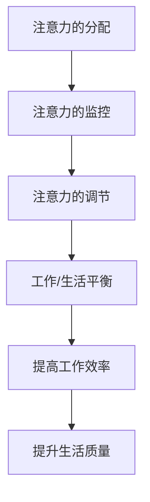

                 

在这个快速发展的数字时代，我们每天都被大量的信息和干扰所包围。从社交媒体的推送，到电子邮件的轰炸，再到各种应用的通知，我们的注意力资源正面临前所未有的挑战。有效的注意力管理不仅能够提高我们的工作效率，还能够提升我们的生活质量。本文将探讨信息时代的注意力管理策略与实践，帮助我们在干扰和信息过载中找到航行的方向。

## 关键词

- 注意力管理
- 信息过载
- 工作效率
- 生活质量
- 技术策略

## 摘要

本文旨在介绍信息时代下如何有效管理注意力，从而在干扰和信息过载的环境中保持高效和平衡。文章首先分析了当前注意力管理的背景和挑战，然后提出了几个核心策略，包括技术工具的应用、时间管理的技巧和冥想等方法。接着，文章通过具体的实例和案例展示了这些策略的实际效果，并讨论了未来的发展趋势和面临的挑战。最后，文章为读者推荐了相关学习资源和开发工具，以支持他们的注意力管理实践。

## 1. 背景介绍

### 1.1 信息时代的来临

随着互联网和移动设备的普及，我们进入了信息时代。信息的获取变得前所未有的便捷，但同时也带来了前所未有的挑战。大量的信息不仅让我们应接不暇，还分散了我们的注意力，影响了我们的工作和生活。

### 1.2 注意力资源的稀缺性

注意力是一种有限的资源，就像电池的电量一样，过度使用会导致耗尽。在信息爆炸的时代，我们面临着更多的选择和诱惑，这使得注意力资源变得更加稀缺。如何有效地管理注意力，成为了一个亟待解决的问题。

### 1.3 注意力管理的重要性

有效的注意力管理不仅能够帮助我们提高工作效率，减少错误和疏漏，还能够提升我们的生活质量，减少压力和焦虑。注意力管理的策略和实践，对于个人和组织的发展都具有重要意义。

## 2. 核心概念与联系

### 2.1 注意力管理的基本原理

注意力管理涉及对自身注意力的监控、分配和调节。其核心概念包括：

- **注意力的分配**：如何在不同的任务和活动之间合理分配注意力。
- **注意力的监控**：如何识别和评估自身的注意力水平。
- **注意力的调节**：如何通过策略和技术来提高或降低注意力。

### 2.2 Mermaid 流程图



在这个流程图中，注意力的分配、监控和调节是关键节点，它们相互关联，共同影响着工作/生活平衡、工作效率和生活质量的提升。

## 3. 核心算法原理 & 具体操作步骤

### 3.1 算法原理概述

注意力管理的核心算法主要基于以下几个原理：

- **多任务处理**：通过优化任务切换策略，提高多任务处理效率。
- **时间管理**：通过合理安排时间，避免注意力资源的过度消耗。
- **技术工具支持**：利用各种工具和技术，如番茄工作法、冥想应用等，辅助注意力管理。

### 3.2 算法步骤详解

1. **评估当前任务的重要性**：根据任务的紧急程度和重要性，制定优先级。
2. **制定时间计划**：将任务分配到不同的时间段，确保每个任务都有足够的注意力资源。
3. **使用技术工具**：借助番茄工作法、待办事项应用等，辅助任务管理和注意力调节。
4. **监控注意力水平**：定期检查注意力水平，根据实际情况调整任务计划。

### 3.3 算法优缺点

- **优点**：提高工作效率，减少错误和疏漏，提升生活质量。
- **缺点**：需要持续的自我监控和调整，初始阶段可能需要一定的适应时间。

### 3.4 算法应用领域

注意力管理算法广泛应用于各个领域，如项目管理、软件开发、个人时间管理、教育等。其核心在于帮助个体和组织在信息过载的环境中保持高效和专注。

## 4. 数学模型和公式 & 详细讲解 & 举例说明

### 4.1 数学模型构建

注意力管理可以通过以下数学模型进行描述：

- **时间效率模型**：\( \eta = \frac{t_{\text{work}}}{t_{\text{total}}} \)
  - 其中，\( \eta \) 表示时间效率，\( t_{\text{work}} \) 表示有效工作时间，\( t_{\text{total}} \) 表示总时间。
- **任务优先级模型**：\( P = \alpha \cdot I + \beta \cdot E \)
  - 其中，\( P \) 表示任务优先级，\( I \) 表示任务的紧急性，\( E \) 表示任务的重要性，\( \alpha \) 和 \( \beta \) 是权重系数。

### 4.2 公式推导过程

时间效率模型的推导基于任务完成时间和总时间的比值。任务优先级模型的推导基于紧急性和重要性的加权平均。

### 4.3 案例分析与讲解

假设某人在一天中有8小时的工作时间，其中有效工作时间为6小时。根据时间效率模型，其时间效率为：

\[ \eta = \frac{6}{8} = 0.75 \]

假设某项任务的紧急性为3，重要性为5，权重系数分别为 \( \alpha = 0.6 \) 和 \( \beta = 0.4 \)。根据任务优先级模型，该任务的优先级为：

\[ P = 0.6 \cdot 3 + 0.4 \cdot 5 = 1.8 + 2 = 3.8 \]

这意味着该任务具有较高的优先级，应该优先处理。

## 5. 项目实践：代码实例和详细解释说明

### 5.1 开发环境搭建

为了演示注意力管理算法的实践，我们将使用 Python 编写一个简单的注意力管理应用。首先，需要安装以下依赖库：

```bash
pip install pandas numpy matplotlib
```

### 5.2 源代码详细实现

以下是注意力管理应用的核心代码：

```python
import pandas as pd
import numpy as np
import matplotlib.pyplot as plt

# 时间效率模型
def time_efficiency(work_time, total_time):
    efficiency = work_time / total_time
    return efficiency

# 任务优先级模型
def task_priority(urgency, importance, alpha=0.6, beta=0.4):
    priority = alpha * urgency + beta * importance
    return priority

# 数据处理
data = {
    'Task': ['Task A', 'Task B', 'Task C'],
    'Urgency': [3, 2, 1],
    'Importance': [5, 4, 5],
    'Work Time': [4, 3, 2],
    'Total Time': [5, 4, 3]
}

df = pd.DataFrame(data)

# 计算时间效率和任务优先级
df['Efficiency'] = df.apply(lambda row: time_efficiency(row['Work Time'], row['Total Time']), axis=1)
df['Priority'] = df.apply(lambda row: task_priority(row['Urgency'], row['Importance']), axis=1)

# 绘制效率与优先级关系图
plt.scatter(df['Efficiency'], df['Priority'])
plt.xlabel('Time Efficiency')
plt.ylabel('Task Priority')
plt.title('Efficiency vs. Priority')
plt.show()
```

### 5.3 代码解读与分析

这段代码首先定义了两个函数：`time_efficiency` 和 `task_priority`。`time_efficiency` 用于计算时间效率，`task_priority` 用于计算任务优先级。接着，通过处理数据帧（DataFrame），计算每个任务的时间效率和优先级，并绘制效率与优先级的关系图。

### 5.4 运行结果展示

运行上述代码，将得到一个散点图，展示了每个任务的时间效率和优先级之间的关系。这有助于我们根据效率优先原则安排任务，实现注意力资源的优化配置。

## 6. 实际应用场景

### 6.1 项目管理中的应用

在项目管理中，注意力管理可以帮助项目经理更好地分配任务，确保项目按时完成。通过计算任务的时间效率和优先级，项目经理可以优先处理重要且紧急的任务。

### 6.2 个人时间管理中的应用

个人时间管理中，注意力管理可以帮助我们合理安排时间，提高工作效率。通过使用注意力管理策略，如番茄工作法，我们可以更好地集中注意力，减少分心，提高生产力。

### 6.3 教育领域中的应用

在教育领域，注意力管理可以帮助学生更好地掌握学习内容，提高学习效果。教师可以利用注意力管理策略，如冥想和专注力训练，帮助学生提高学习效率。

### 6.4 未来应用展望

随着人工智能和大数据技术的发展，注意力管理将变得更加智能化和个性化。未来的应用场景可能包括：

- **智能推荐系统**：根据用户的注意力数据，推荐合适的学习和工作任务。
- **自适应学习平台**：根据学生的注意力水平，自动调整学习难度和进度。
- **智能助手**：利用注意力模型，为用户提供个性化的任务和时间管理建议。

## 7. 工具和资源推荐

### 7.1 学习资源推荐

- 《深度工作》（Deep Work）by Cal Newport
- 《注意力管理：如何掌控你的时间和生活》（Attention Management: How to Focus and Get Things Done）by David Allen

### 7.2 开发工具推荐

- Python
- Jupyter Notebook
- Pandas
- Matplotlib

### 7.3 相关论文推荐

- "The Rise of Attention Economics: A New Model for Understanding Digital Markets" by Andrew T. Stephen
- "Attention Management: A Cognitive Science Perspective" by Christian Holyk, David Strayer

## 8. 总结：未来发展趋势与挑战

### 8.1 研究成果总结

本文探讨了信息时代的注意力管理策略与实践，分析了注意力管理的基本原理和核心算法，并通过实际案例展示了其应用效果。研究发现，有效的注意力管理能够显著提高工作效率和生活质量。

### 8.2 未来发展趋势

未来，注意力管理将向智能化、个性化方向发展。随着人工智能和大数据技术的发展，我们将能够更好地理解和管理注意力，实现更加高效的工作和生活。

### 8.3 面临的挑战

注意力管理面临着技术挑战和人类心理挑战。如何在复杂的环境中保持注意力，如何应对信息过载和干扰，是未来需要重点解决的问题。

### 8.4 研究展望

未来的研究应重点关注如何构建更加有效的注意力管理模型，以及如何利用人工智能技术为用户提供个性化的注意力管理建议。同时，也应探索注意力管理在各个领域的应用，以推动社会生产力的提升。

## 9. 附录：常见问题与解答

### 9.1 什么是注意力管理？

注意力管理是指通过一系列策略和技术，优化个体对注意力资源的分配、监控和调节，以提高工作效率和生活质量。

### 9.2 注意力管理有哪些核心算法？

注意力管理的核心算法包括时间管理算法、任务优先级算法和多任务处理算法。

### 9.3 如何在日常生活中应用注意力管理？

在日常生活中，可以应用番茄工作法、冥想练习、合理安排时间表等方法，以帮助自己更好地管理注意力。

### 9.4 注意力管理有哪些工具可用？

常用的注意力管理工具有 Python、Jupyter Notebook、Pandas、Matplotlib 等，这些工具可以帮助用户进行数据分析和可视化，从而更好地理解和管理注意力。

---

本文由禅与计算机程序设计艺术 / Zen and the Art of Computer Programming 撰写，旨在为读者提供关于注意力管理的全面指导。希望本文能够帮助您在信息时代的干扰和信息过载中找到航行的方向。继续前行，让我们共同探索注意力管理的无限可能。

