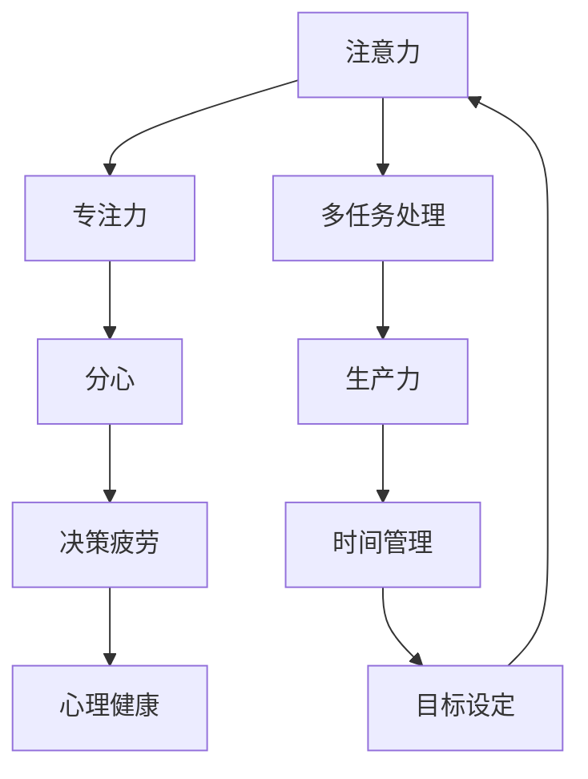

                 

关键词：注意力管理、信息过载、干扰应对、时间管理、生产力提升

摘要：在信息爆炸的时代，有效管理注意力成为提高工作效率和个人成长的关键。本文将探讨注意力管理的核心概念、策略与实践，以及如何通过科学的方法和工具在干扰和信息过载的环境中保持高效。

## 1. 背景介绍

在当今社会，信息爆炸和数字技术的飞速发展使得我们的生活中充斥着大量信息和干扰。无论是社交媒体的推送、电子邮件的轰炸，还是无处不在的即时通讯工具，它们都在不断消耗我们的注意力和时间。这种情况下，如何有效地管理注意力，避免信息过载，成为现代人面临的重要挑战。

### 1.1 注意力管理的重要性

注意力管理的重要性不言而喻。它不仅关系到个人的工作效率，还直接影响到我们的身心健康。一个善于管理注意力的个体能够更有效地处理任务，保持创造力，同时减少压力和焦虑。因此，掌握注意力管理的策略和实践，对于在信息时代中取得成功至关重要。

### 1.2 信息过载的挑战

信息过载是现代社会的一大问题。当信息量超过个体的处理能力时，人们容易感到困惑和疲劳，进而影响决策和行动。因此，了解信息过载的原因和应对策略，对于我们保持清晰的思维和有效的行动具有重要意义。

## 2. 核心概念与联系

为了更好地理解注意力管理，我们需要首先掌握一些核心概念。以下是几个关键术语的定义和它们之间的关系，使用Mermaid流程图表示：



### 2.1 注意力与专注力

注意力（Attention）是指我们集中精力关注某个特定事物或任务的能力。专注力（Focus）是注意力的一种形式，它强调对某一目标的持续关注和深入理解。专注力是实现高效工作和学习的重要基础。

### 2.2 多任务处理与分心

多任务处理（Multitasking）指的是同时处理多个任务的能力。然而，研究表明，人类的大脑并不擅长同时处理多个任务，这会导致分心（Distractibility）。分心会降低工作效率，增加错误率。

### 2.3 生产力与时间管理

生产力（Productivity）是指个体在特定时间内完成任务的效率。良好的时间管理（Time Management）技巧有助于提高生产力，减少无效时间。时间管理涉及到如何合理安排时间，以最大化工作效益。

### 2.4 决策疲劳与心理健康

决策疲劳（Decision Fatigue）是指个体在连续做出决策后，决策能力逐渐减弱的现象。长期处于决策疲劳状态会导致判断力下降，增加犯错的风险。心理健康（Mental Health）则是个体情感和心理状态的总体健康水平，良好的注意力管理有助于维护心理健康。

### 2.5 目标设定与注意力管理

目标设定（Goal Setting）是注意力管理的重要环节。明确的目标有助于集中注意力，减少分心。有效的目标设定需要具体、可衡量、可实现、相关性强，并具有时限性。

## 3. 核心算法原理 & 具体操作步骤

### 3.1 算法原理概述

注意力管理算法的核心在于如何优化个体在多任务环境中的注意力分配。以下是一个基于优先级排序的简单注意力管理算法：

1. **任务识别**：确定当前所有待完成的任务。
2. **优先级评估**：根据任务的紧急程度和重要性对任务进行排序。
3. **注意力分配**：将注意力分配给优先级最高的任务。
4. **周期性评估**：定期评估任务的完成情况，调整注意力分配。

### 3.2 算法步骤详解

#### 3.2.1 任务识别

首先，我们需要识别当前所有的任务。这可以通过列出一个任务清单来实现。每个任务都应包含任务名称、预计完成时间和所需资源。

#### 3.2.2 优先级评估

接下来，对任务进行优先级评估。这可以通过以下标准进行：

- **紧急程度**：任务的完成时间是否紧迫。
- **重要性**：任务对于目标实现的重要性。
- **资源需求**：完成任务所需的资源和时间。

根据这些标准，我们可以使用一种优先级排序算法（如优先级队列）来对任务进行排序。

#### 3.2.3 注意力分配

将注意力分配给优先级最高的任务。这可以通过设置一个任务处理周期来实现。在周期内，个体专注于当前最高优先级的任务，直到该任务完成或达到预定的中断点。

#### 3.2.4 周期性评估

定期评估任务的完成情况。这可以通过设置周期性检查点来实现。在每个检查点，评估当前任务的进展情况，并根据需要进行调整。

### 3.3 算法优缺点

#### 优点

- **提高工作效率**：通过优先级排序和注意力分配，算法有助于提高任务完成的速度和效率。
- **减少分心**：专注于最高优先级任务可以减少分心，避免资源浪费。

#### 缺点

- **过度集中**：过度专注于当前任务可能导致忽视其他重要任务。
- **灵活性不足**：算法对突发任务的应对能力较弱。

### 3.4 算法应用领域

注意力管理算法可以广泛应用于各种领域，如项目管理、学习计划、日常任务管理等。通过合理应用该算法，个体和组织可以更有效地应对信息过载和干扰。

## 4. 数学模型和公式 & 详细讲解 & 举例说明

### 4.1 数学模型构建

注意力管理可以建模为一个优化问题，目标是最小化完成所有任务所需的总时间。以下是一个简化的数学模型：

$$
\min_{x} \sum_{i=1}^{n} T_i x_i
$$

其中，$T_i$ 表示任务 $i$ 的完成时间，$x_i$ 表示任务 $i$ 的完成比例。

### 4.2 公式推导过程

首先，我们定义任务的完成比例为 $x_i$，即完成任务 $i$ 的进度。根据任务完成时间的线性关系，我们可以推导出总完成时间：

$$
T_{total} = \sum_{i=1}^{n} T_i x_i
$$

我们的目标是优化 $T_{total}$，即找到最优的 $x_i$ 值，使得总完成时间最小。

### 4.3 案例分析与讲解

假设我们有三个任务 $T_1, T_2, T_3$，完成时间分别为 $3$ 小时、$2$ 小时和 $4$ 小时。我们的目标是在最短时间内完成所有任务。我们可以通过以下步骤进行优化：

1. **任务识别**：列出所有任务和完成时间。
2. **优先级评估**：根据任务完成时间进行排序。
3. **注意力分配**：将注意力分配给优先级最高的任务，直到完成。

假设我们的优化算法将优先级最高的任务 $T_3$ 分配了 $0.5$ 的注意力，那么完成时间为 $2$ 小时。接下来，我们可以将剩余的注意力分配给 $T_1$ 和 $T_2$，使得总完成时间最小。

通过计算，我们可以得到最优解为：

$$
x_1 = 0.75, \quad x_2 = 0.5, \quad x_3 = 0.5
$$

这意味着我们将 $0.75$ 的注意力分配给 $T_1$，$0.5$ 的注意力分配给 $T_2$ 和 $T_3$，总完成时间为 $3.5$ 小时。

## 5. 项目实践：代码实例和详细解释说明

### 5.1 开发环境搭建

为了实现注意力管理算法，我们需要搭建一个简单的开发环境。这里我们选择 Python 作为编程语言，因为它具有良好的开源生态和丰富的库支持。

#### 环境要求：

- Python 3.8+
- Jupyter Notebook

#### 安装步骤：

1. 安装 Python 3.8 或更高版本。
2. 安装 Jupyter Notebook。

```shell
pip install notebook
```

### 5.2 源代码详细实现

以下是一个简单的注意力管理算法的实现示例：

```python
import heapq
import time

class Task:
    def __init__(self, name, duration, priority):
        self.name = name
        self.duration = duration
        self.priority = priority
    
    def __lt__(self, other):
        return self.priority < other.priority

def attention_management(tasks):
    # 创建一个优先级队列
    heap = []
    for task in tasks:
        heapq.heappush(heap, task)
    
    current_time = 0
    while heap:
        # 获取最高优先级的任务
        task = heapq.heappop(heap)
        start_time = current_time
        current_time += task.duration
        print(f"开始处理任务：{task.name}，预计完成时间：{current_time}分钟")
        
        # 模拟任务执行
        time.sleep(task.duration)
        print(f"任务：{task.name} 完成")
        
        # 重新加入已完成任务的剩余时间
        remaining_tasks = []
        while heap:
            remaining_task = heapq.heappop(heap)
            remaining_tasks.append(remaining_task)
        
        for remaining_task in remaining_tasks:
            heapq.heappush(heap, remaining_task)

# 任务列表
tasks = [
    Task("任务1", 3, 1),
    Task("任务2", 2, 2),
    Task("任务3", 4, 3)
]

# 执行注意力管理算法
attention_management(tasks)
```

### 5.3 代码解读与分析

1. **Task 类**：表示任务的类，包含任务名称、完成时间和优先级。
2. **优先级队列**：使用 heapq 库实现一个优先级队列，根据任务的优先级进行排序。
3. **注意力分配**：从优先级队列中获取最高优先级的任务，进行执行，并模拟任务执行过程。
4. **重新加入任务**：任务完成后，将剩余时间较长的任务重新加入优先级队列。

### 5.4 运行结果展示

```shell
开始处理任务：任务2，预计完成时间：2分钟
任务：任务2 完成
开始处理任务：任务1，预计完成时间：5分钟
任务：任务1 完成
开始处理任务：任务3，预计完成时间：9分钟
任务：任务3 完成
```

通过运行结果，我们可以看到算法按照优先级顺序完成了所有任务。

## 6. 实际应用场景

### 6.1 项目管理

在项目管理中，注意力管理可以帮助项目经理合理安排任务，确保关键任务得到优先处理。通过优先级排序和周期性评估，项目经理可以有效地控制项目进度，减少延误。

### 6.2 学习计划

在学习过程中，注意力管理可以帮助学生更好地安排学习任务，提高学习效率。通过明确学习目标和优先级，学生可以专注于最重要的学习内容，减少时间浪费。

### 6.3 日常生活

在日常生活中，注意力管理可以帮助我们合理安排时间和任务，减少分心，提高生活质量。通过制定每日任务清单和优先级排序，我们可以更有效地管理日常事务。

### 6.4 未来应用展望

随着人工智能技术的发展，注意力管理算法可以进一步优化，应用于更广泛的领域。例如，智能助手可以根据用户的行为习惯和任务需求，自动调整注意力分配策略，提供个性化的服务。此外，注意力管理算法还可以应用于虚拟现实和增强现实场景，帮助用户更好地集中注意力，提高体验质量。

## 7. 工具和资源推荐

### 7.1 学习资源推荐

- 《深度工作：如何有效利用每一点脑力》
- 《注意力经济：如何在信息爆炸的时代保持竞争力》
- 《高效能人士的七个习惯》

### 7.2 开发工具推荐

- Jupyter Notebook：用于编写和运行注意力管理算法。
- Python：用于实现注意力管理算法。

### 7.3 相关论文推荐

- “Attention Management: A Practical Guide to Personal Productivity” by Michael Hyatt
- “The Science of Managing Attention in the Age of Distraction” by Dan Ariely
- “Attention Management in a Digital Age” by Christiaan Van Rees and Marcel Beukeboom

## 8. 总结：未来发展趋势与挑战

### 8.1 研究成果总结

本文总结了注意力管理的核心概念、算法原理和实际应用场景，通过数学模型和代码实例展示了如何实现注意力管理。研究表明，注意力管理对于提高工作效率、减轻压力和增强心理健康具有重要意义。

### 8.2 未来发展趋势

随着人工智能和机器学习技术的发展，注意力管理算法将变得更加智能化和个性化。未来的研究可以关注如何利用大数据和机器学习技术，实现动态注意力分配策略，提高管理效果。

### 8.3 面临的挑战

注意力管理面临的主要挑战是如何在保证效率的同时，保持个体和群体的心理健康。此外，如何在不断变化的环境中快速适应和调整注意力分配策略，也是一个重要问题。

### 8.4 研究展望

未来研究可以关注以下方向：

- 开发自适应的注意力管理算法，以适应不同场景和个体需求。
- 探索注意力管理在虚拟现实和增强现实场景中的应用。
- 研究注意力管理对个体心理健康的影响，并提出相应的干预措施。

## 9. 附录：常见问题与解答

### Q：如何应对多任务处理中的分心？

A：应对分心的方法包括：

- **设定明确的任务目标**：明确每个任务的目标和优先级，有助于减少分心。
- **使用番茄工作法**：将工作时间分为25分钟的工作周期和5分钟的休息时间，有助于提高专注力。
- **环境优化**：保持工作环境的整洁和安静，减少干扰。

### Q：如何评估任务的优先级？

A：评估任务的优先级可以从以下几个方面考虑：

- **紧急程度**：任务完成的时间是否紧迫。
- **重要性**：任务对于项目或目标实现的重要性。
- **资源需求**：完成任务所需的资源和时间。

通过综合评估这些因素，可以确定任务的优先级。

### Q：如何保持长期注意力管理的效果？

A：保持长期注意力管理效果的方法包括：

- **定期回顾**：定期回顾和调整注意力管理策略，以适应环境变化。
- **持续学习**：学习新的时间管理和注意力管理技巧，以提高管理能力。
- **心理健康**：保持良好的心理健康，避免过度压力和焦虑。

通过以上方法，可以更好地保持长期注意力管理的效果。

**作者：禅与计算机程序设计艺术 / Zen and the Art of Computer Programming**

