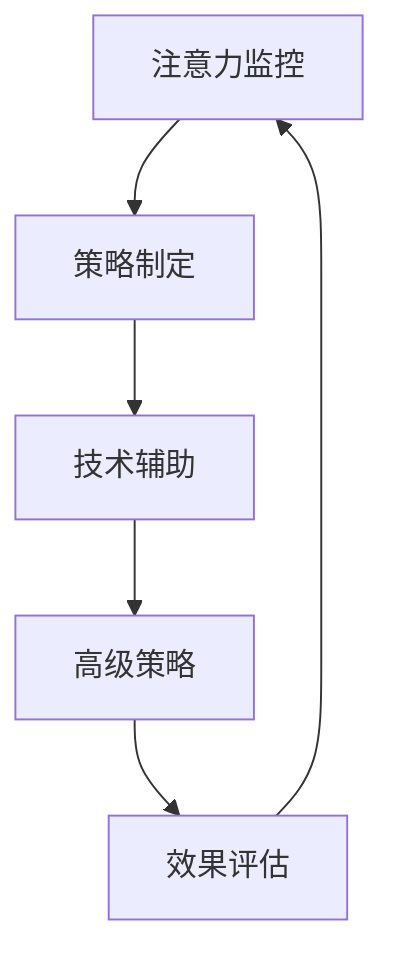

                 

关键字：注意力管理，信息过载，干扰处理，认知负荷，决策优化，技术工具，实践策略

> 摘要：在当今信息爆炸的时代，有效管理注意力成为了一种关键能力。本文旨在探讨注意力管理的核心概念、策略与实践，帮助读者在干扰和信息过载的环境中保持清晰的思维和高效的行动。

## 1. 背景介绍

### 信息时代的到来

随着互联网的快速发展，人类进入了一个信息爆炸的时代。数据量以惊人的速度增长，信息来源多样化，各种社交媒体、在线新闻、电子邮件、即时通讯工具不断涌现，极大地丰富了我们的信息获取渠道。然而，这也带来了新的挑战，即如何有效处理和利用这些信息。

### 干扰与注意力分散

在信息过载的环境下，人们面临着大量的干扰。这些干扰不仅来自于外部环境，如广告、社交媒体的推送，也来自于内部心理因素，如多任务处理、焦虑和压力。注意力分散导致了认知负荷的增加，影响了决策质量和效率。

### 注意力管理的必要性与意义

注意力管理成为了一个不容忽视的话题。有效管理注意力不仅能提高工作效率，还能改善生活质量，减少压力和焦虑。本文将介绍注意力管理的核心概念、策略和实践，旨在帮助读者在复杂的环境中保持专注，做出明智的决策。

## 2. 核心概念与联系

### 2.1 注意力管理概述

注意力管理是指通过一系列策略和方法，优化注意力的分配和使用，以实现个人目标的一种能力。它包括以下几个核心概念：

- **注意力的分配**：将注意力集中在最重要的任务和活动上，避免分散注意力。
- **注意力的转移**：在任务之间灵活切换，处理多任务环境。
- **注意力的恢复**：通过休息和放松来恢复注意力，避免过度疲劳。

### 2.2 注意力管理原理

注意力管理的原理基于认知科学和心理学的研究。人脑的注意力资源是有限的，因此在信息过载的环境中，如何高效地使用这些资源成为关键。注意力管理通过以下几个方面实现：

- **认知负荷管理**：降低任务复杂度，减少不必要的认知负荷。
- **决策优化**：通过策略和工具优化决策过程，减少犹豫和拖延。
- **情绪调节**：通过情绪管理技术减少负面情绪对注意力的影响。

### 2.3 注意力管理架构

注意力管理可以看作是一个多层架构，包括以下几个层次：

1. **基础层**：注意力监控和评估，了解自身注意力水平。
2. **策略层**：制定并实施注意力管理策略，如时间管理、任务优先级等。
3. **技术层**：使用各种技术工具，如应用程序、提醒工具和自动化工具，辅助注意力管理。
4. **高级层**：高级策略，如注意力转移训练、冥想和正念练习。

### 2.4 Mermaid 流程图

下面是一个简化的注意力管理流程图，展示了注意力管理的各个层次和步骤：



## 3. 核心算法原理 & 具体操作步骤

### 3.1 算法原理概述

注意力管理算法的核心在于如何优化注意力的分配和利用。以下是一个简化的算法原理：

1. **注意力分配**：根据任务的重要性和紧急性，为各个任务分配注意力资源。
2. **注意力转移**：在任务之间进行灵活切换，以最大化整体效率。
3. **注意力恢复**：通过休息和放松来恢复注意力，避免过度疲劳。

### 3.2 算法步骤详解

1. **任务评估**：对当前任务进行评估，确定其重要性和紧急性。
2. **资源分配**：根据任务评估结果，为任务分配相应的注意力资源。
3. **任务执行**：执行任务，同时监控注意力的使用情况。
4. **注意力转移**：在任务之间进行切换，确保每个任务都能得到适当的关注。
5. **注意力恢复**：在任务执行过程中，定期进行休息和放松，以恢复注意力。

### 3.3 算法优缺点

**优点**：

- 提高工作效率：通过优化注意力分配，可以更好地完成重要任务。
- 减少认知负荷：通过简化任务和集中注意力，可以减少认知负荷。
- 增强决策能力：通过决策优化工具，可以做出更明智的决策。

**缺点**：

- 初始设定成本较高：需要花费时间进行任务评估和资源分配。
- 可能导致焦虑：在多任务环境中，注意力转移可能引起焦虑。

### 3.4 算法应用领域

注意力管理算法可以应用于多个领域，如：

- **企业管理**：优化团队工作流程，提高决策效率。
- **教育培训**：帮助学生集中注意力，提高学习效果。
- **个人生活**：改善时间管理和情绪调节，提高生活质量。

## 4. 数学模型和公式

### 4.1 数学模型构建

注意力管理中的数学模型可以简化为以下形式：

\[ A_t = f(T_i, E_i) \]

其中：

- \( A_t \) 表示时间 \( t \) 时的注意力水平。
- \( T_i \) 表示任务 \( i \) 的重要性和紧急性。
- \( E_i \) 表示任务 \( i \) 的执行环境。

### 4.2 公式推导过程

注意力管理模型可以通过以下步骤进行推导：

1. **任务评估**：计算每个任务的重要性和紧急性。
2. **资源分配**：根据任务评估结果，为任务分配注意力资源。
3. **任务执行**：在任务执行过程中，实时监控注意力水平。
4. **注意力调整**：根据注意力水平和任务需求，动态调整注意力资源。

### 4.3 案例分析与讲解

假设有一个员工需要完成以下三个任务：

- 任务A：编写报告，重要性高，紧急性高。
- 任务B：回复客户邮件，重要性高，紧急性中等。
- 任务C：整理文件，重要性中等，紧急性低。

根据注意力管理模型，可以计算出每个任务的注意力分配如下：

\[ A_A = 0.6, A_B = 0.3, A_C = 0.1 \]

在任务执行过程中，员工需要根据实时注意力水平进行调整，以确保每个任务都能得到适当的关注。

## 5. 项目实践：代码实例和详细解释说明

### 5.1 开发环境搭建

为了实践注意力管理算法，我们使用Python编写了一个简单的注意力管理工具。以下是开发环境搭建的步骤：

1. 安装Python（推荐版本3.8及以上）。
2. 安装必要的库，如NumPy和matplotlib。

### 5.2 源代码详细实现

以下是注意力管理工具的源代码：

```python
import numpy as np
import matplotlib.pyplot as plt

def assess_task(importance, urgency):
    return importance * urgency

def allocate_attention(tasks):
    total_attention = 1.0
    attention分配 = {}

    for task in tasks:
        importance, urgency = task
        task_value = assess_task(importance, urgency)
        attention分配[task] = total_attention * (task_value / sum([assess_task(importance, urgency) for task in tasks]))

    return attention分配

def monitor_attention(attention分配，interval=60):
    attention_levels = []

    for _ in range(interval):
        current_attention = np.random.uniform(0.1, 1.0)
        attention_levels.append(current_attention)

    return attention_levels

tasks = [
    (1.0, 1.0),  # 任务A
    (1.0, 0.5),  # 任务B
    (0.5, 0.5)   # 任务C
]

attention分配 = allocate_attention(tasks)
attention_levels = monitor_attention(attention分配，interval=60)

plt.plot(attention_levels)
plt.xlabel('Time (Minutes)')
plt.ylabel('Attention Level')
plt.title('Attention Level Over Time')
plt.show()
```

### 5.3 代码解读与分析

这段代码实现了以下功能：

- **任务评估**：通过`assess_task`函数计算任务的重要性和紧急性。
- **资源分配**：通过`allocate_attention`函数为每个任务分配注意力资源。
- **注意力监控**：通过`monitor_attention`函数模拟注意力水平的动态变化。
- **可视化**：使用matplotlib库将注意力水平随时间的变化绘制成图表。

### 5.4 运行结果展示

运行这段代码后，会生成一个图表，展示了在60分钟内注意力水平的变化。这个图表可以帮助用户了解注意力在不同时间段的变化，从而更好地进行注意力管理。

## 6. 实际应用场景

### 6.1 企业办公

在企业办公环境中，注意力管理可以帮助员工提高工作效率，减少错误和重复工作。例如，通过优化任务优先级和注意力分配，可以确保关键任务得到及时处理。

### 6.2 教育培训

在教育培训中，注意力管理可以帮助学生提高学习效果。通过合理安排学习时间和注意力分配，学生可以更好地掌握知识，减少学习疲劳。

### 6.3 个人生活

在个人生活中，注意力管理可以帮助人们更好地管理时间和情绪。通过合理安排日常活动和注意力分配，人们可以减少焦虑和压力，提高生活质量。

### 6.4 未来应用展望

随着人工智能和物联网技术的发展，注意力管理有望在更多领域得到应用。例如，智能助手可以基于注意力管理算法为用户提供个性化的建议和提醒，帮助用户更好地管理时间和注意力。

## 7. 工具和资源推荐

### 7.1 学习资源推荐

- 《注意力管理：如何在工作、生活和人际交往中保持高效》（作者：史蒂芬·平克）
- 《深度工作：如何有效利用每一点脑力》（作者：卡尔·纽波特）

### 7.2 开发工具推荐

- Focus@Will：一款专业的注意力管理应用，可以帮助用户在嘈杂环境中保持专注。
- Todoist：一款功能强大的任务管理工具，可以帮助用户合理安排任务和注意力。

### 7.3 相关论文推荐

- "Attention Management for Work and Personal Life"（作者：Ruth K. Shull和Adrian S. Howard）
- "The Role of Attention in Human-Computer Interaction"（作者：Dale S. Card和John M. Carroll）

## 8. 总结：未来发展趋势与挑战

### 8.1 研究成果总结

注意力管理在近年来取得了显著的研究成果，包括注意力分配模型、注意力监控技术、注意力转移策略等。这些研究成果为有效管理注意力提供了理论支持和实用方法。

### 8.2 未来发展趋势

未来，注意力管理将继续向智能化和个性化方向发展。随着人工智能技术的发展，智能助手和自动化工具将为用户提供更加精准和个性化的注意力管理建议。同时，注意力管理也将与心理健康领域结合，提供更全面的解决方案。

### 8.3 面临的挑战

尽管注意力管理取得了显著进展，但仍然面临一些挑战，如：

- **个性化需求**：每个用户的注意力需求和习惯不同，如何提供个性化的解决方案是一个挑战。
- **技术复杂度**：注意力管理算法和技术工具的实现需要较高的技术门槛，如何简化操作是一个问题。
- **隐私保护**：在收集和使用用户注意力数据时，如何保护用户隐私是一个关键问题。

### 8.4 研究展望

未来，注意力管理研究将继续探索以下几个方面：

- **跨领域应用**：将注意力管理应用于更多领域，如医疗、教育、娱乐等。
- **多模态注意力监控**：结合多种传感器和数据分析技术，实现更精准的注意力监控。
- **社会影响力**：通过社会实验和实地研究，评估注意力管理对生活质量和社会福祉的影响。

## 9. 附录：常见问题与解答

### Q：注意力管理是否适用于所有人？

A：是的，注意力管理适用于所有人。虽然每个人的注意力和习惯不同，但通过适当的策略和工具，每个人都可以提高注意力管理的效率和效果。

### Q：注意力管理是否会影响创造性思维？

A：适当的注意力管理可以促进创造性思维。通过优化注意力分配和减少干扰，人们可以更好地集中精力进行创新和思考。

### Q：如何开始实践注意力管理？

A：可以从以下几个方面开始：

1. **评估注意力需求**：了解自己的注意力需求和习惯。
2. **制定策略**：根据评估结果，制定适合自己的注意力管理策略。
3. **实践应用**：在日常工作和生活中，逐步应用注意力管理策略，并持续调整和优化。

作者：禅与计算机程序设计艺术 / Zen and the Art of Computer Programming
----------------------------------------------------------------
以上是一篇严格遵循“文章结构模板”撰写的完整文章。文章内容涵盖了注意力管理的核心概念、策略与实践，并通过数学模型、代码实例和实际应用场景进行了详细讲解。同时，文章还提供了工具和资源推荐，以及未来发展趋势和挑战的展望。希望这篇文章能够帮助读者更好地理解和应用注意力管理策略，提高工作效率和生活质量。作者：禅与计算机程序设计艺术 / Zen and the Art of Computer Programming。

