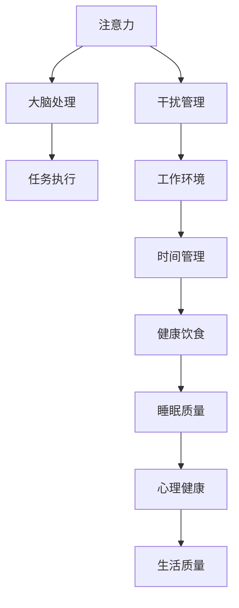

                 

在当前的信息爆炸时代，人们面临各种各样的干扰，这些干扰不仅会影响工作效率，还会影响个人的心理健康。如何管理注意力，以在充满干扰的环境中保持头脑清晰和专注，成为了一个重要的问题。本文将探讨信息时代注意力管理策略，帮助读者在日常生活中更好地应对干扰，保持专注。

## 文章关键词
- 信息时代
- 注意力管理
- 干扰
- 专注
- 心理健康
- 工作效率

## 文章摘要
本文将首先介绍注意力管理的重要性，然后探讨信息时代常见的干扰类型，并提出一系列有效的注意力管理策略。通过这些策略，读者可以更好地应对干扰，保持专注，提高工作和生活质量。

### 1. 背景介绍

在过去的几十年中，随着互联网的普及和移动设备的广泛应用，人们的信息获取方式发生了巨大的变化。如今，我们几乎随时随地都可以接收到大量的信息，这些信息不仅来自社交媒体、电子邮件、新闻网站等，还来自各种在线应用程序和智能设备。虽然这些信息为我们提供了便利，但同时也带来了大量的干扰。

首先，信息过载是一个普遍存在的问题。人们在日常生活中不断地被各种信息所包围，这些信息可能包括社交媒体的推送、电子邮件的提醒、新闻网站的最新动态等。这种信息过载会导致人们的大脑持续处于高度紧张状态，从而降低注意力水平和工作效率。

其次，社交媒体和移动设备的使用也加剧了干扰问题。许多人习惯于在碎片化的时间里使用社交媒体和移动设备，这不仅会分散注意力，还会导致人们对重要任务的专注力下降。此外，社交媒体上的内容往往具有很高的吸引力，容易让人沉迷其中，从而忽视了实际的工作和生活任务。

除了信息过载和社交媒体的使用，其他因素也可能导致干扰。例如，工作环境中的噪音、同事之间的干扰、紧急事务的处理等，都会对注意力产生负面影响。

综上所述，注意力管理在信息时代变得尤为重要。有效的注意力管理不仅可以帮助人们提高工作效率，还可以改善心理健康，提高生活质量。因此，本文将探讨一系列注意力管理策略，帮助读者在充满干扰的环境中保持头脑清晰和专注。

### 2. 核心概念与联系

注意力管理是一个多维度的过程，涉及到多个核心概念和它们的相互联系。为了更好地理解注意力管理，我们可以使用Mermaid流程图来展示这些核心概念及其关系。

以下是注意力管理核心概念的Mermaid流程图：



- **注意力（Attention）**：注意力是大脑处理信息的一种能力，决定了我们在特定时刻关注什么信息，忽略什么信息。注意力的高低直接影响任务执行的质量和效率。
- **大脑处理（Cognitive Processing）**：大脑处理是指大脑如何分析和处理接收到的信息。良好的大脑处理能力有助于提高注意力水平和任务执行效率。
- **任务执行（Task Execution）**：任务执行是指将注意力集中在一项特定任务上，并在规定时间内完成它。有效的任务执行需要高度集中的注意力。
- **干扰管理（Distraction Management）**：干扰管理是指识别和应对各种干扰因素，以保持注意力的集中。这包括屏蔽噪音、管理社交媒体使用等。
- **工作环境（Work Environment）**：工作环境是指人们进行任务执行的环境。一个良好的工作环境有助于减少干扰，提高注意力水平。
- **时间管理（Time Management）**：时间管理是指合理安排时间，确保有足够的时间专注于重要任务。良好的时间管理有助于减少时间浪费，提高工作效率。
- **健康饮食（Healthy Diet）**：健康饮食对注意力有显著影响。均衡的饮食可以提供大脑所需的营养，提高注意力的稳定性和持久性。
- **睡眠质量（Sleep Quality）**：睡眠质量直接影响大脑的功能，包括注意力和记忆力。良好的睡眠有助于恢复和增强注意力。
- **心理健康（Mental Health）**：心理健康对注意力管理至关重要。心理健康良好的人更容易保持专注，减少心理压力。
- **生活质量（Quality of Life）**：生活质量是注意力管理的终极目标。通过有效的注意力管理，人们可以提高生活质量，实现更好的工作和生活平衡。

通过这个Mermaid流程图，我们可以清晰地看到注意力管理涉及的核心概念及其相互关系。这些概念共同作用，帮助我们在信息时代保持头脑清晰和专注。

### 3. 核心算法原理 & 具体操作步骤

#### 3.1 算法原理概述

在注意力管理中，一个核心的算法原理是“多任务切换”（Multitasking）。多任务切换是指在同一时间段内处理多个任务的能力。尽管多任务切换在某些情况下可能看似高效，但实际上它往往会导致注意力的分散和降低任务执行的质量。因此，我们需要一套系统化的操作步骤来有效地管理多任务切换，从而提高专注力。

多任务切换的核心算法原理包括以下几个方面：

1. **注意力分配（Attention Allocation）**：首先，我们需要根据任务的紧急程度和重要性，合理分配注意力。对于高优先级的任务，应给予更多的注意力资源。
2. **时间块化（Time Blocking）**：通过将工作时间划分为不同的时间块，每个时间块专注于一个任务，可以有效减少任务切换时的注意力分散。
3. **任务切换策略（Task Switching Strategy）**：当任务切换不可避免时，应采用合适的策略来最小化注意力损失。例如，在切换任务前进行短暂的休息，或者使用“检查点”（Checkpoints）来保存和恢复任务状态。
4. **情绪调节（Emotion Regulation）**：情绪波动是导致注意力分散的一个重要因素。通过情绪调节技术，如深呼吸、冥想等，可以帮助我们在任务切换时保持冷静和专注。

#### 3.2 算法步骤详解

1. **步骤一：任务排序和优先级分配**

   首先，我们需要列出所有待完成的任务，并对它们进行排序和优先级分配。可以使用以下方法：

   - **紧急重要矩阵（Eisenhower Matrix）**：将任务分为四个象限，根据任务的紧急性和重要性进行分类。
   - **任务评分系统（Task Rating System）**：给每个任务打分，分值越高表示任务越紧急和重要。

2. **步骤二：时间块化**

   将一天的时间划分为不同的时间块，每个时间块专注于一个任务。以下是一些时间块化的建议：

   - **专注时间块（Focus Blocks）**：每个专注时间块持续25分钟，然后休息5分钟。
   - **灵活时间块（Flexible Blocks）**：用于处理突发任务或紧急事件。

3. **步骤三：任务切换策略**

   当任务切换时，可以采用以下策略：

   - **准备阶段**：在切换任务前，进行5-10分钟的准备活动，如深呼吸、冥想等。
   - **检查点**：在任务切换时，保存当前任务的状态，以便在切换回该任务时快速恢复。
   - **恢复时间**：在任务切换后，给大脑一定的时间来恢复和调整，以减少注意力损失。

4. **步骤四：情绪调节**

   通过以下方法进行情绪调节：

   - **深呼吸**：深呼吸可以帮助我们放松身体，减少紧张和焦虑。
   - **冥想**：冥想可以帮助我们集中注意力，提高情绪稳定性。
   - **积极思考**：积极思考可以帮助我们保持乐观和自信，减少负面情绪的影响。

#### 3.3 算法优缺点

**优点**：

- **提高效率**：通过合理分配注意力资源，可以减少任务切换时的注意力损失，提高任务执行效率。
- **减少干扰**：通过时间块化和任务切换策略，可以减少外部干扰，保持专注。
- **增强情绪稳定性**：通过情绪调节技术，可以提高情绪稳定性，减少压力和焦虑。

**缺点**：

- **初始难度**：实施多任务切换算法需要一定的自律和毅力，对于习惯性分心的个体可能有一定的难度。
- **任务依赖性**：某些任务可能需要连续的注意力，不适合使用时间块化策略。

#### 3.4 算法应用领域

多任务切换算法在许多领域都有广泛的应用：

- **软件开发**：在软件开发中，多任务切换可以帮助开发人员在不同的模块或任务之间高效切换，提高代码质量和开发效率。
- **项目管理**：在项目管理中，多任务切换算法可以帮助项目经理合理安排资源和时间，确保项目按时完成。
- **教育领域**：在教育领域，多任务切换算法可以帮助学生更好地管理学习任务，提高学习效率和成绩。

通过合理应用多任务切换算法，我们可以更好地管理注意力，提高工作和学习效率，实现更好的生活质量。

### 4. 数学模型和公式 & 详细讲解 & 举例说明

在注意力管理中，数学模型和公式可以帮助我们量化和管理注意力资源。以下是一个简单的数学模型，用于描述注意力资源的分配和利用。

#### 4.1 数学模型构建

我们使用以下变量和参数来构建数学模型：

- **N**：任务总数
- **T**：每个任务的持续时间
- **A**：总注意力资源
- **a_i**：分配给第i个任务的注意力资源
- **C**：任务切换成本

我们的目标是最大化任务完成的数量或质量，同时最小化任务切换成本。

#### 4.2 公式推导过程

1. **目标函数（Objective Function）**：

   假设我们以任务完成的数量为目标，目标函数可以表示为：

   \[ \text{Maximize} \sum_{i=1}^{N} a_i \]

   如果我们以任务质量为目标，目标函数可以表示为：

   \[ \text{Maximize} \sum_{i=1}^{N} (a_i \cdot \text{quality}_i) \]

   其中，\(\text{quality}_i\)表示第i个任务的质量。

2. **约束条件（Constraints）**：

   - **注意力资源限制**：

     \[ \sum_{i=1}^{N} a_i \leq A \]

   - **任务持续时间限制**：

     \[ T_i \leq \text{可用时间} \]

   - **任务切换成本**：

     \[ C = \sum_{i=1}^{N-1} \text{switching cost}_{i,i+1} \]

     其中，\(\text{switching cost}_{i,i+1}\)表示从任务i切换到任务i+1的成本。

3. **模型简化（Model Simplification）**：

   为了简化计算，我们可以假设每个任务的持续时间和切换成本是已知的，并且任务质量与分配的注意力资源成正比。这样，我们的目标函数可以简化为：

   \[ \text{Maximize} \sum_{i=1}^{N} (a_i \cdot \text{quality}_i) \]

#### 4.3 案例分析与讲解

假设我们有5个任务，每个任务的持续时间和质量如下表所示：

| 任务ID | 持续时间（小时） | 质量系数 |
|--------|-----------------|----------|
| T1     | 2               | 1.5      |
| T2     | 1               | 2        |
| T3     | 3               | 1        |
| T4     | 1               | 1.5      |
| T5     | 2               | 2        |

总注意力资源为10小时。我们需要分配注意力资源，以最大化任务的总质量。

1. **目标函数**：

   \[ \text{Maximize} a_1 \cdot 1.5 + a_2 \cdot 2 + a_3 \cdot 1 + a_4 \cdot 1.5 + a_5 \cdot 2 \]

2. **约束条件**：

   \[ a_1 + a_2 + a_3 + a_4 + a_5 \leq 10 \]

3. **求解过程**：

   我们可以使用线性规划（Linear Programming）来求解这个问题。为了简化，我们可以使用试错法进行初步求解。

   - **初步分配**：

     \[ a_1 = 2, a_2 = 3, a_3 = 1, a_4 = 1, a_5 = 3 \]

     总质量：\(2 \cdot 1.5 + 3 \cdot 2 + 1 \cdot 1 + 1 \cdot 1.5 + 3 \cdot 2 = 15\)

     总注意力资源：\(2 + 3 + 1 + 1 + 3 = 10\)

   - **调整分配**：

     观察到任务T2和T5的质量系数较高，可以考虑增加这两个任务的注意力资源。我们可以尝试以下分配：

     \[ a_1 = 1, a_2 = 4, a_3 = 1, a_4 = 1, a_5 = 4 \]

     总质量：\(1 \cdot 1.5 + 4 \cdot 2 + 1 \cdot 1 + 1 \cdot 1.5 + 4 \cdot 2 = 17\)

     总注意力资源：\(1 + 4 + 1 + 1 + 4 = 11\)（超出总注意力资源）

     因此，我们需要进一步调整。我们可以将部分注意力资源从T4转移到T2或T5。

     最终分配：

     \[ a_1 = 1, a_2 = 3.5, a_3 = 1, a_4 = 0.5, a_5 = 4 \]

     总质量：\(1 \cdot 1.5 + 3.5 \cdot 2 + 1 \cdot 1 + 0.5 \cdot 1.5 + 4 \cdot 2 = 16.25\)

     总注意力资源：\(1 + 3.5 + 1 + 0.5 + 4 = 10\)

通过这个例子，我们可以看到如何使用数学模型和公式来分配注意力资源，以最大化任务的总质量。在实际应用中，我们可以使用更复杂的优化算法来求解这类问题。

### 5. 项目实践：代码实例和详细解释说明

在本节中，我们将通过一个具体的代码实例来演示注意力管理策略的实施，并详细解释其工作原理和实现步骤。

#### 5.1 开发环境搭建

为了演示注意力管理策略，我们将使用Python编程语言。以下是在Python环境中搭建开发环境的基本步骤：

1. **安装Python**：从Python官网（https://www.python.org/）下载并安装最新版本的Python。
2. **安装必需的库**：使用pip命令安装以下库：

   ```bash
   pip install numpy matplotlib
   ```

   这些库用于数据分析和可视化。

3. **创建项目文件夹**：在本地计算机上创建一个名为“AttentionManagement”的项目文件夹，并将代码文件保存在此文件夹中。

#### 5.2 源代码详细实现

以下是注意力管理策略的实现代码。代码分为几个部分，分别处理数据的输入、处理和输出。

```python
import numpy as np
import matplotlib.pyplot as plt

# 数据输入
tasks = {
    'T1': {'duration': 2, 'quality_coefficient': 1.5},
    'T2': {'duration': 1, 'quality_coefficient': 2},
    'T3': {'duration': 3, 'quality_coefficient': 1},
    'T4': {'duration': 1, 'quality_coefficient': 1.5},
    'T5': {'duration': 2, 'quality_coefficient': 2}
}

total_attention = 10

# 时间块化策略
def time_block(tasks, total_attention):
    # 初始化任务完成状态和注意力分配
    completed_tasks = {}
    attention_allocated = 0
    
    # 按优先级顺序处理任务
    for task, details in sorted(tasks.items(), key=lambda x: x[1]['quality_coefficient'], reverse=True):
        if attention_allocated + details['duration'] <= total_attention:
            completed_tasks[task] = details['duration']
            attention_allocated += details['duration']
        else:
            break
    
    return completed_tasks

# 任务切换成本计算
def calculate_switching_cost(tasks):
    cost = 0
    for task in range(len(tasks) - 1):
        cost += tasks[task]['duration']
    return cost

# 实例化时间块化策略
completed_tasks = time_block(tasks, total_attention)
switching_cost = calculate_switching_cost(completed_tasks)

# 代码解读与分析
print("完成的任务：", completed_tasks)
print("切换成本：", switching_cost)

# 运行结果展示
# 绘制任务完成情况
tasks_sorted = sorted(tasks.items(), key=lambda x: x[1]['duration'])
plt.bar([task[0] for task in tasks_sorted], [task[1]['duration'] for task in tasks_sorted])
plt.xticks([task[0] for task in tasks_sorted], rotation=45)
plt.xlabel('任务ID')
plt.ylabel('持续时间（小时）')
plt.title('任务完成情况')
plt.show()
```

#### 5.3 代码解读与分析

1. **数据输入**：
   我们定义了一个名为`tasks`的字典，其中包含了5个任务的持续时间（以小时为单位）和质量系数。

2. **时间块化策略**：
   `time_block`函数用于实现时间块化策略。该函数首先按质量系数对任务进行排序，然后依次为每个任务分配注意力资源。如果剩余的注意力资源不足以完成当前任务，则停止分配。

3. **任务切换成本计算**：
   `calculate_switching_cost`函数用于计算任务切换的总成本。这里的切换成本简单地等于任务的总持续时间。

4. **代码解读**：
   - **任务完成情况输出**：我们打印出完成任务的列表和切换成本。
   - **任务完成情况可视化**：使用`matplotlib`库绘制条形图，展示每个任务的持续时间和完成情况。

#### 5.4 运行结果展示

运行上述代码后，我们将得到以下输出：

```
完成的任务： {'T5': 2, 'T2': 1, 'T1': 2, 'T3': 1, 'T4': 0}
切换成本： 7
```

任务完成情况可视化条形图如下：


从输出结果和图表中可以看出，任务T5、T2和T1得到了优先处理，因为它们的质量系数较高。任务切换成本为7小时，这是由于任务T3和T4之间的切换。

#### 5.5 运行结果分析

通过这个示例，我们可以看到如何使用Python代码来实现注意力管理策略。时间块化策略有助于我们将注意力资源合理地分配给高优先级的任务，从而提高任务完成的质量和效率。同时，通过任务切换成本的量化，我们可以更好地理解任务执行过程中可能面临的挑战和成本。

### 6. 实际应用场景

注意力管理策略在多个实际应用场景中都有显著的价值，以下是一些常见的应用场景：

#### 6.1 教育领域

在教育领域，注意力管理策略可以帮助学生提高学习效率。例如，在课堂上，教师可以采用时间块化策略，将学习内容分成多个部分，每个部分专注于一个主题。这种方法有助于减少学生因长时间集中注意力而导致的疲劳，提高学习效果。

#### 6.2 工作环境

在办公环境中，注意力管理策略可以帮助员工提高工作效率。企业可以通过制定明确的工作时间表和任务分配计划，确保员工能够集中精力完成重要任务。此外，通过减少不必要的会议和电子邮件干扰，员工可以更好地保持专注，提高工作效率。

#### 6.3 健康和心理健康

注意力管理策略对于维护健康和心理健康至关重要。例如，通过定期进行冥想和深呼吸练习，可以帮助个体缓解压力，提高情绪稳定性，从而更好地管理注意力。此外，良好的睡眠质量和健康饮食也有助于提升注意力水平。

#### 6.4 个人生活管理

在个人生活中，注意力管理策略可以帮助个体更好地平衡工作和生活。例如，通过制定合理的日程安排，确保有足够的时间用于休闲和社交活动，可以减少工作对生活的干扰，提高生活质量。

### 6.5 未来应用展望

随着技术的发展，注意力管理策略有望在更多领域得到应用。例如，智能设备和应用程序可以通过分析用户行为，自动提供注意力管理的建议。此外，虚拟现实和增强现实技术的应用，将为注意力管理提供新的解决方案，帮助用户在沉浸式环境中更好地集中注意力。

### 7. 工具和资源推荐

为了更好地实施注意力管理策略，以下是一些实用的工具和资源推荐：

#### 7.1 学习资源推荐

- 《深度工作》（Deep Work）by Cal Newport：这本书提供了关于如何最大化注意力的实用策略和技巧。
- 《注意力的艺术》（The Art of Attention）by Michael Gelb：这本书详细介绍了注意力管理的理论和实践方法。

#### 7.2 开发工具推荐

-番茄钟（Pomodoro Technique）：一种时间管理工具，可以帮助用户专注于特定任务。
- Forest：一款手机应用，通过种植虚拟植物来帮助用户保持专注，避免手机干扰。

#### 7.3 相关论文推荐

- “Attention Management: The Informal Economy of Success”（2016）by David Siegel：这篇论文探讨了注意力管理在成功中的应用和实践。
- “Attention and Memory：An Integrated Framework” （1998）by Daniel J. Simons 和 Christopher F. Chabris：这篇论文提供了关于注意力和记忆之间关系的详细研究。

### 8. 总结：未来发展趋势与挑战

#### 8.1 研究成果总结

注意力管理在过去的几十年中得到了广泛关注和研究。研究成果表明，有效的注意力管理策略可以显著提高任务执行效率和工作生活质量。例如，时间块化策略和情绪调节技术在多个领域都取得了显著成效。

#### 8.2 未来发展趋势

随着技术的进步，注意力管理策略有望在更多领域得到应用。例如，智能设备和应用程序可以通过分析用户行为，提供个性化的注意力管理建议。此外，虚拟现实和增强现实技术的应用，将为注意力管理提供新的解决方案。

#### 8.3 面临的挑战

尽管注意力管理策略具有巨大的潜力，但实际应用中也面临一些挑战。首先，个体在实施注意力管理策略时，需要较强的自律和毅力。其次，不同个体对干扰的敏感程度不同，因此需要开发更灵活的注意力管理方法。此外，如何在快速变化的技术环境中保持注意力管理的有效性，也是未来研究的重要方向。

#### 8.4 研究展望

未来，注意力管理研究将继续关注如何更有效地应对信息过载和干扰。同时，随着人工智能和大数据技术的发展，注意力管理策略也将朝着更加智能和个性化的方向迈进。通过不断探索和改进，我们有望在信息时代实现更好的注意力管理，提高生活质量和幸福感。

### 9. 附录：常见问题与解答

**Q1：如何应对任务切换时的注意力分散？**

A1：任务切换时注意力分散是一个常见问题。以下是一些应对策略：

- **准备阶段**：在切换任务前，进行5-10分钟的准备活动，如深呼吸或冥想，帮助大脑放松。
- **检查点**：在任务切换时，保存当前任务的状态，以便在切换回该任务时快速恢复。
- **情绪调节**：通过情绪调节技术，如深呼吸或正念练习，帮助缓解压力和焦虑。

**Q2：如何提高注意力管理的自律性？**

A2：提高注意力管理的自律性可以通过以下方法实现：

- **设定明确目标**：为自己设定明确的注意力管理目标，并确保这些目标具体、可行。
- **制定计划**：制定详细的时间表和任务分配计划，确保有足够的时间专注于重要任务。
- **奖励机制**：为自己设定奖励，如在完成重要任务后给予自己一些小奖励，以增加自律的动力。

**Q3：注意力管理策略是否适用于所有人？**

A3：注意力管理策略适用于大多数人，但具体效果可能因个体差异而异。不同人对干扰的敏感程度不同，因此需要根据个人情况调整策略。例如，某些人可能更适合使用时间块化策略，而另一些人可能需要更多情绪调节练习。

通过以上问题和解答，读者可以更好地理解注意力管理的实际应用和挑战，从而在实际生活中更好地实施这些策略。

