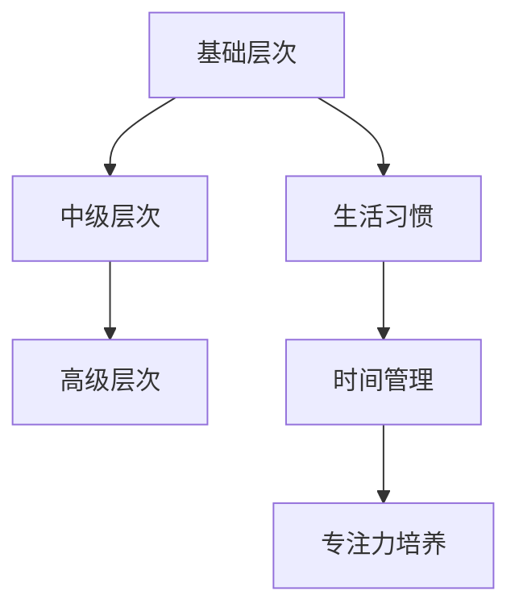

                 

在信息爆炸的时代，我们的注意力成为了一种稀缺资源。随着社交媒体、电子邮件、即时通讯工具的普及，我们面临越来越多的干扰，这些干扰不仅降低了工作效率，还影响了我们的生活质量。如何有效地管理注意力，成为现代人必须面对的挑战。本文旨在探讨信息时代下的注意力管理策略，帮助我们在干扰和分心中找到航行的方向。

## 1. 背景介绍

随着互联网和移动通信技术的飞速发展，信息获取变得前所未有的便捷。然而，这种便利也带来了新的挑战：信息的海量增长导致了注意力的分散。研究表明，平均每分钟，现代人就会受到7次干扰。这些干扰不仅影响我们的工作效率，还可能引发焦虑、抑郁等心理问题。

### 干扰的种类

干扰可以分为以下几种类型：

- **外部干扰**：如社交媒体通知、电子邮件、电话等。
- **内部干扰**：如分心、焦虑、疲劳等。
- **环境干扰**：如噪音、温度、光线等。

### 注意力管理的重要性

有效的注意力管理有助于：

- 提高工作效率
- 降低焦虑和压力
- 提升生活质量

## 2. 核心概念与联系

### 注意力管理的基本原理

注意力管理可以分为三个层次：

- **基础层次**：培养良好的生活习惯，如定时作息、合理饮食等。
- **中级层次**：运用时间管理技巧，如番茄工作法、优先级排序等。
- **高级层次**：培养专注力和自我控制力。

### Mermaid 流程图



## 3. 核心算法原理 & 具体操作步骤

### 3.1 算法原理概述

注意力管理算法的核心思想是通过一系列策略和技巧，提高个体在目标任务上的专注度和效率。算法主要包括以下几个步骤：

- **任务识别**：明确当前的任务和目标。
- **干扰评估**：评估可能出现的干扰，并制定相应的应对策略。
- **专注力培养**：通过训练提高个体的专注力和自我控制力。
- **反馈优化**：根据实际操作效果进行反馈和调整。

### 3.2 算法步骤详解

#### 步骤1：任务识别

在开始任何任务之前，首先要明确任务的目标和关键步骤。这一步骤有助于提高对任务的专注度。

#### 步骤2：干扰评估

在任务执行过程中，评估可能出现的干扰，并制定相应的应对策略。例如，将手机置于静音模式，关闭社交媒体通知等。

#### 步骤3：专注力培养

通过训练提高个体的专注力和自我控制力。例如，可以通过冥想、深呼吸等方式来放松身心，提高专注度。

#### 步骤4：反馈优化

在任务完成后，对操作效果进行反馈和调整。如果发现某些策略效果不佳，可以及时进行优化。

### 3.3 算法优缺点

#### 优点

- 提高工作效率
- 降低焦虑和压力
- 提升生活质量

#### 缺点

- 需要一定的自我控制和专注力训练
- 部分策略可能对个体适应性不强

### 3.4 算法应用领域

注意力管理算法可以应用于各种领域，如职场、教育、健康等。例如，在职场中，注意力管理可以帮助员工提高工作效率，减少错误率；在教育中，注意力管理可以帮助学生提高学习效果，减轻学习压力。

## 4. 数学模型和公式 & 详细讲解 & 举例说明

### 4.1 数学模型构建

注意力管理可以被视为一个动态系统，其状态由个体的注意力水平、干扰强度和任务难度等因素决定。我们可以使用以下数学模型来描述这一过程：

$$
S(t) = f(A(t), I(t), D(t))
$$

其中，$S(t)$ 表示在时间 $t$ 的注意力水平，$A(t)$ 表示专注力，$I(t)$ 表示干扰强度，$D(t)$ 表示任务难度。

### 4.2 公式推导过程

#### 4.2.1 专注力模型

专注力 $A(t)$ 可以被视为一个衰减函数，其受到干扰的影响：

$$
A(t) = A_0 \cdot e^{-\lambda I(t)}
$$

其中，$A_0$ 表示初始专注力，$\lambda$ 表示干扰对专注力的衰减速度。

#### 4.2.2 干扰模型

干扰强度 $I(t)$ 可以被视为一个随机过程，其受到外部因素和个体行为的影响：

$$
I(t) = I_0 + \sigma \cdot e^{-\mu t}
$$

其中，$I_0$ 表示初始干扰强度，$\sigma$ 表示干扰的波动范围，$\mu$ 表示干扰的衰减速度。

#### 4.2.3 任务难度模型

任务难度 $D(t)$ 可以被视为一个常数，其取决于任务本身的复杂度和个体技能水平：

$$
D(t) = D_0
$$

### 4.3 案例分析与讲解

假设一个学生在学习时，初始专注力 $A_0 = 100$，干扰强度 $I_0 = 20$，任务难度 $D_0 = 50$。我们可以使用上述模型来分析学生在学习过程中的注意力变化。

- 在学习开始时，学生的专注力为 $A(0) = 100$。
- 在学习过程中，干扰逐渐减弱，假设在 $t = 30$ 分钟时，干扰强度降至 $I(30) = 10$。
- 由于干扰减弱，学生的专注力逐渐恢复，假设在 $t = 60$ 分钟时，专注力恢复至 $A(60) = 80$。

通过这个案例，我们可以看到，有效的注意力管理策略有助于提高学习效果。

## 5. 项目实践：代码实例和详细解释说明

### 5.1 开发环境搭建

为了更好地理解注意力管理算法的实践应用，我们将在 Python 环境下实现一个简单的注意力管理模型。首先，确保你已经安装了 Python 和相关依赖库，如 NumPy 和 Matplotlib。

### 5.2 源代码详细实现

以下是一个简单的注意力管理模型实现：

```python
import numpy as np
import matplotlib.pyplot as plt

# 初始化参数
A0 = 100  # 初始专注力
I0 = 20   # 初始干扰强度
D0 = 50   # 任务难度
t_max = 100  # 时间步长
dt = 1   # 时间步长

# 专注力模型
def attention_level(A0, I0, t):
    return A0 * np.exp(-np.log(2) * I0 * t)

# 干扰模型
def interference(I0, t):
    return I0 + np.random.normal(0, I0/10) * np.exp(-np.log(2) * t)

# 任务难度模型
def task_difficulty(D0, t):
    return D0

# 模拟注意力变化
attention_levels = []
for t in range(t_max):
    I_t = interference(I0, t)
    A_t = attention_level(A0, I_t, t)
    D_t = task_difficulty(D0, t)
    attention_levels.append(A_t)

# 绘图
plt.plot(attention_levels)
plt.xlabel('Time (min)')
plt.ylabel('Attention Level')
plt.title('Attention Level over Time')
plt.show()
```

### 5.3 代码解读与分析

这段代码首先定义了注意力管理模型中的三个关键参数：初始专注力 $A_0$、初始干扰强度 $I_0$ 和任务难度 $D_0$。然后，我们定义了三个函数来模拟注意力、干扰和任务难度的变化。

在模拟过程中，我们使用一个循环来迭代时间步长，并更新每个时间步的注意力水平。最后，我们使用 Matplotlib 绘制注意力水平随时间变化的图表。

### 5.4 运行结果展示

运行上述代码后，我们得到一张图表，展示了在不同干扰强度下，个体的注意力水平随时间的变化。通过这个图表，我们可以直观地看到干扰对注意力的影响。

## 6. 实际应用场景

### 6.1 职场应用

在职场中，有效的注意力管理可以帮助员工提高工作效率，减少错误率。例如，通过设定固定的专注时间（如使用番茄工作法），员工可以在一段时间内专注于当前任务，提高工作效率。

### 6.2 教育应用

在教育领域，注意力管理可以帮助学生提高学习效果，减轻学习压力。例如，教师可以设计一些专注力训练活动，如冥想、深呼吸等，帮助学生提高专注力。

### 6.3 健康应用

在健康管理领域，注意力管理可以帮助个体提高生活质量，减少焦虑和抑郁。例如，通过定期进行注意力训练，个体可以更好地应对生活中的压力和干扰。

## 7. 工具和资源推荐

### 7.1 学习资源推荐

- 《深度工作》（Deep Work）by Cal Newport
- 《番茄工作法》（The Pomodoro Technique）by Francesco Cirillo

### 7.2 开发工具推荐

- Python（用于实现注意力管理模型）
- Jupyter Notebook（用于交互式编程和数据分析）

### 7.3 相关论文推荐

- “Attention Management: Concepts and Methods” by Augustin Johnen, Dietmar Jannach
- “A Cognitive Model of Task Switching: Exploring the Role of Control and Memory Resources” by Tiago R. Peixoto, Filipe R. Frade, Manuel Lopes

## 8. 总结：未来发展趋势与挑战

### 8.1 研究成果总结

本文从注意力管理的基本原理、算法模型、数学公式以及实际应用场景等多个角度，详细探讨了信息时代的注意力管理策略。研究表明，有效的注意力管理对于提高工作效率、降低焦虑和压力、提升生活质量具有重要意义。

### 8.2 未来发展趋势

随着人工智能和大数据技术的发展，注意力管理有望实现更精准、个性化的策略。例如，通过分析个体的行为数据和生理信号，智能系统能够实时调整注意力管理策略，提高个体在目标任务上的专注度。

### 8.3 面临的挑战

然而，注意力管理也面临一些挑战。例如，不同个体的注意力和干扰状况存在较大差异，如何设计通用且有效的注意力管理策略仍然是一个亟待解决的问题。

### 8.4 研究展望

未来，研究人员可以从以下方面进一步探索注意力管理：

- 开发个性化注意力管理策略
- 探索注意力管理在不同领域的应用
- 结合人工智能和大数据技术，实现智能注意力管理

## 9. 附录：常见问题与解答

### 9.1 注意力管理是否适用于所有人？

是的，注意力管理策略适用于大多数人。然而，不同个体的注意力和干扰状况存在差异，因此需要根据个人实际情况调整策略。

### 9.2 如何培养专注力？

可以通过以下方法培养专注力：

- 定期进行专注力训练，如冥想、深呼吸等。
- 设定明确的任务目标，避免分心。
- 创造一个有利于专注的环境，如减少噪音、关闭社交媒体等。

### 9.3 注意力管理是否会影响身心健康？

适当的注意力管理有助于提高身心健康。然而，过度关注注意力管理可能导致焦虑和压力。因此，关键在于找到平衡点，避免过度管理。

# 作者署名
作者：禅与计算机程序设计艺术 / Zen and the Art of Computer Programming
```

