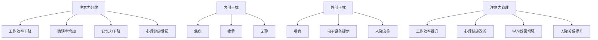

                 

## 摘要

在信息爆炸的时代，人们的注意力成为了稀缺资源。本文旨在探讨如何在充满干扰和分心的环境中，通过有效的注意力管理策略，提高工作效率和个人生活质量。本文首先分析了现代生活中干扰源的种类和影响，然后提出了几种实用的注意力管理方法，包括时间管理、专注训练、技术工具支持等。通过实例和数学模型，本文详细阐述了这些策略的具体应用，并展望了未来注意力管理技术的发展趋势与挑战。

## 关键词
信息过滤、注意力分散、时间管理、专注力训练、技术辅助、工作效率、心理健康

## 1. 背景介绍

### 信息时代的挑战

随着互联网的普及和移动设备的广泛应用，我们生活在一个信息无处不在的时代。每一天，我们都会接触到大量的信息，包括新闻、社交媒体更新、电子邮件、即时通讯和广告等。这些信息不仅数量庞大，而且更新速度极快。根据统计，一个成年人每天平均会接触到约100,000条信息。这种信息过载的现象导致了人们注意力的分散，使得我们在处理任务时效率低下。

### 注意力分散的影响

注意力分散对工作和学习产生了负面影响。首先，它增加了错误率和失误率。例如，在开车时使用手机，会显著增加交通事故的风险。其次，注意力分散会导致记忆困难，因为大脑无法有效地将注意力集中在单一任务上。此外，长期处于注意力分散的状态，还会对心理健康产生不良影响，如焦虑、压力和抑郁。

### 现实生活中的例子

在现实生活中，我们常常会面临各种干扰。比如，在工作中，频繁的电话和电子邮件会打断我们的思路；在家庭生活中，孩子的哭闹和家务琐事也会分散我们的注意力。这些干扰不仅影响了我们的工作效率，还可能导致家庭关系的紧张。

### 目的与意义

本文的目的在于提供一系列有效的注意力管理策略，帮助读者在信息时代中更好地控制自己的注意力，从而提高工作效率、改善生活质量。通过本文的探讨，我们希望读者能够意识到注意力管理的重要性，并掌握一些实用的方法来应对现代生活中的各种干扰。

## 2. 核心概念与联系

### 注意力的概念

注意力是人类心理活动的一个重要方面，它涉及大脑选择和处理信息的机制。从神经科学的角度来看，注意力可以被视为一种认知资源，它决定了我们能够处理的信息量和质量。根据心理学研究，注意力分为几种类型，包括集中注意力（focused attention）和分配注意力（divided attention）。

### 干扰的种类

干扰可以分为内部干扰和外部干扰。内部干扰源于个人内部的思维活动和情绪波动，如焦虑、疲劳和无聊。外部干扰则来自外部环境，如噪音、电子设备的提示和人际交往。理解干扰的种类有助于我们更有效地管理注意力。

### 注意力管理的重要性

注意力管理的重要性体现在以下几个方面：

- **提高工作效率**：通过有效的注意力管理，我们可以更快地完成任务，减少错误率，提高整体工作效率。
- **改善心理健康**：良好的注意力管理可以减少焦虑和压力，有助于保持心理健康。
- **增强学习效果**：专注于学习任务可以提高记忆力和理解力，从而增强学习效果。
- **提升人际关系**：在人际交往中，良好的注意力管理可以让我们更专注地倾听他人，提高沟通效果。

### Mermaid 流程图



通过上述流程图，我们可以清晰地看到注意力分散对各方面的影响，以及注意力管理的重要性。接下来，我们将进一步探讨注意力管理的具体策略。

## 3. 核心算法原理 & 具体操作步骤

### 3.1 算法原理概述

注意力管理的核心在于如何有效地分配和利用注意资源。这个过程中，我们可以借鉴一些时间管理和专注力的训练方法，将它们整合成一个系统化的策略。以下是几种关键算法原理：

1. **时间块化（Time Blocking）**：将时间划分为若干固定的时间块，每个时间块专注于一项任务，减少任务切换带来的干扰。
2. **番茄工作法（Pomodoro Technique）**：每25分钟专注工作，然后休息5分钟，循环进行，有助于提高专注力和减少疲劳。
3. **正念训练（Mindfulness Training）**：通过冥想和呼吸练习，提高自我意识，减少内部干扰。
4. **优先级排序（Prioritization）**：根据任务的重要性和紧急性进行排序，确保注意力首先集中在最重要和最紧急的任务上。

### 3.2 算法步骤详解

#### 时间块化

1. **制定日程表**：首先，列出每天需要完成的任务，并根据任务的重要性和紧急性进行排序。
2. **划分时间块**：将日程表中的任务划分为若干时间块，每个时间块专注于一项任务，避免任务切换。
3. **遵守时间块**：在时间块内，尽量减少干扰，专注于当前任务，直到完成。

#### 番茄工作法

1. **设定计时器**：使用番茄工作法应用或手动设定25分钟工作时间和5分钟休息时间。
2. **专注工作**：在25分钟内，关闭所有干扰源，专注于当前任务。
3. **休息调整**：在5分钟休息时间内，进行简单的伸展、深呼吸或短暂散步，放松身心。

#### 正念训练

1. **选择练习时间**：每天选择一段安静的时间进行正念练习。
2. **练习呼吸**：专注于呼吸，感受吸气和呼气，专注于当前的感受和体验。
3. **扩展练习**：逐渐增加练习时间，从5分钟到30分钟，提高专注力。

#### 优先级排序

1. **评估任务**：根据任务的重要性和紧急性，使用四象限法（紧急-重要、不紧急-重要、紧急-不重要、不紧急-不重要）对任务进行评估。
2. **安排任务**：将最重要的任务安排在最前面，紧急的任务安排在后面。
3. **动态调整**：根据实际情况和进度，动态调整任务优先级。

### 3.3 算法优缺点

**时间块化**的优点在于减少了任务切换带来的干扰，提高了工作效率。缺点是可能会增加心理压力，因为需要在特定时间内完成任务。

**番茄工作法**的优点是简单易行，有助于提高专注力和减少疲劳。缺点是对于长时间任务可能不够灵活。

**正念训练**的优点在于提高自我意识和专注力，有助于长期的心理健康。缺点是初学者可能觉得难以坚持。

**优先级排序**的优点是确保注意力首先集中在最重要和最紧急的任务上，提高了整体工作效率。缺点是可能忽略一些次重要的任务。

### 3.4 算法应用领域

这些注意力管理算法可以广泛应用于各个领域，包括：

- **企业办公**：帮助员工提高工作效率，减少任务切换带来的干扰。
- **学生学习**：帮助学生提高学习专注力，改善学习效果。
- **家庭生活**：帮助家庭成员更好地分配时间，提高生活质量。
- **医疗健康**：帮助患者进行康复训练，提高生活质量和心理健康。

通过这些算法的应用，我们可以更好地管理注意力，提高工作效率，改善生活质量。

## 4. 数学模型和公式 & 详细讲解 & 举例说明

### 4.1 数学模型构建

为了更好地理解和应用注意力管理策略，我们可以构建一个数学模型来描述注意力的分配和利用。以下是一个简化的模型：

**注意力分配模型**：

假设一个人每天有8小时的工作时间，每小时的注意力分配可以表示为：

\[ A(t) = \frac{C(t)}{T} \]

其中：
- \( A(t) \) 是在时间 \( t \) 上的注意力分配（单位：注意力点/小时）。
- \( C(t) \) 是在时间 \( t \) 上完成的任务复杂度（单位：任务复杂度点/小时）。
- \( T \) 是每天的工作时间（单位：小时）。

### 4.2 公式推导过程

首先，我们需要确定任务复杂度 \( C(t) \)。根据任务的重要性和紧急性，任务复杂度可以分为高、中、低三种级别。我们假设高、中、低复杂度的任务分别需要 3 个、2 个和 1 个注意力点来完成。

因此，任务复杂度 \( C(t) \) 可以表示为：

\[ C(t) = \begin{cases} 
3, & \text{如果任务为高复杂度} \\
2, & \text{如果任务为中复杂度} \\
1, & \text{如果任务为低复杂度}
\end{cases} \]

接下来，我们将注意力分配模型代入上述公式，得到：

\[ A(t) = \begin{cases} 
\frac{3}{8}, & \text{如果任务为高复杂度} \\
\frac{2}{8}, & \text{如果任务为中复杂度} \\
\frac{1}{8}, & \text{如果任务为低复杂度}
\end{cases} \]

### 4.3 案例分析与讲解

假设一个员工每天有8小时的工作时间，需要完成以下任务：

- 2小时的高复杂度任务
- 3小时的中复杂度任务
- 3小时的低复杂度任务

根据上述模型，我们可以计算出他在每个时间段内的注意力分配：

1. **高复杂度任务（2小时）**：
\[ A(t) = \frac{3}{8} \times 2 = 0.75 \text{ 个注意力点/小时} \]

2. **中复杂度任务（3小时）**：
\[ A(t) = \frac{2}{8} \times 3 = 0.75 \text{ 个注意力点/小时} \]

3. **低复杂度任务（3小时）**：
\[ A(t) = \frac{1}{8} \times 3 = 0.375 \text{ 个注意力点/小时} \]

通过这个模型，我们可以看到员工在不同任务上的注意力分配。例如，在高复杂度任务期间，他需要分配 0.75 个注意力点/小时，而在低复杂度任务期间，只需要分配 0.375 个注意力点/小时。这有助于员工在完成不同类型任务时，合理安排自己的注意力资源。

### 结论

通过构建注意力分配模型，我们可以更科学地管理自己的注意力资源，提高工作效率。在实际应用中，可以根据任务的具体情况，调整注意力分配策略，以达到最佳效果。

## 5. 项目实践：代码实例和详细解释说明

### 5.1 开发环境搭建

为了更好地实践注意力管理策略，我们选择Python作为开发语言，因为它具有丰富的库和工具，便于实现各种注意力管理功能。以下是在Windows操作系统上搭建Python开发环境的基本步骤：

1. **安装Python**：从Python官方网站（python.org）下载并安装Python 3.8或更高版本。
2. **配置Python环境变量**：确保在系统中配置了Python环境变量，以便在命令行中运行Python。
3. **安装必要的库**：使用pip命令安装一些常用的库，如`schedule`用于时间管理，`requests`用于网络请求，`matplotlib`用于数据可视化。

```bash
pip install schedule requests matplotlib
```

### 5.2 源代码详细实现

以下是一个简单的Python代码实例，展示了如何使用时间块化和番茄工作法来管理注意力。

```python
import time
import schedule
from datetime import datetime, timedelta

# 番茄工作法设置
POMODORO_DURATION = 25 * 60  # 25分钟
SHORT_BREAK = 5 * 60  # 5分钟短休息
LONG_BREAK = 15 * 60  # 15分钟长休息
MAX_POMODORO = 4  # 最大pomodoro次数

# 任务列表
tasks = [
    "阅读技术文档",
    "编写代码",
    "团队会议",
    "项目规划"
]

# 当前pomodoro次数
current_pomodoro = 0

def pomodoro_task():
    global current_pomodoro
    task_name = tasks[current_pomodoro % len(tasks)]
    print(f"开始{task_name}...")
    time.sleep(POMODORO_DURATION)
    print(f"{task_name}完成，休息时间！")
    if current_pomodoro < MAX_POMODORO - 1:
        short_break()
    else:
        long_break()

def short_break():
    print("进行短休息...")
    time.sleep(SHORT_BREAK)
    print("休息结束，继续工作...")

def long_break():
    print("进行长休息...")
    time.sleep(LONG_BREAK)
    print("休息结束，继续工作...")
    current_pomodoro = 0

# 定时任务调度
schedule.every(1).days.at("09:00").do(pomodoro_task)

# 运行主循环
while True:
    schedule.run_pending()
    time.sleep(1)
```

### 5.3 代码解读与分析

这段代码实现了一个简单的注意力管理工具，通过`schedule`库来调度每天的任务。以下是代码的主要部分及其功能解读：

- **设置番茄工作法参数**：定义了pomodoro持续时间、短休息时间和长休息时间，以及最大pomodoro次数。
- **任务列表**：定义了一个包含四个任务的列表，代表一天中需要完成的任务。
- **当前pomodoro次数**：用于跟踪当前进行到第几个pomodoro。
- **pomodoro任务函数**：执行当前pomodoro任务，并在完成后根据当前pomodoro次数决定是进入短休息还是长休息。
- **短休息函数**：执行短休息，并提示用户继续工作。
- **长休息函数**：执行长休息，并提示用户继续工作。
- **定时任务调度**：使用`schedule`库每天在早上9点执行pomodoro任务。
- **主循环**：持续运行，调度任务并等待。

### 5.4 运行结果展示

运行这段代码后，它将在每天早上9点开始执行第一个pomodoro任务，即阅读技术文档。每完成一个pomodoro后，将根据当前pomodoro次数决定是否进入短休息或长休息。以下是可能的输出结果：

```
开始阅读技术文档...
阅读技术文档完成，休息时间！
进行短休息...
休息结束，继续工作...
开始编写代码...
编写代码完成，休息时间！
进行长休息...
休息结束，继续工作...
开始团队会议...
团队会议完成，休息时间！
进行短休息...
休息结束，继续工作...
开始项目规划...
项目规划完成，休息时间！
进行长休息...
休息结束，继续工作...
```

通过这个实例，我们可以看到如何使用代码来实践注意力管理策略，从而在工作和生活中更好地管理注意力，提高工作效率。

## 6. 实际应用场景

### 6.1 个人工作场景

在个人工作中，注意力管理策略可以显著提高工作效率。例如，在编写代码时，可以采用番茄工作法来确保每个编程任务都能得到充分的专注。通过将工作时间划分为25分钟的工作块和5分钟的休息时间，程序员可以在连续的工作中保持高效率，减少错误率。此外，通过时间块化，可以确保每个工作块只专注于一个任务，避免了任务切换带来的干扰。

### 6.2 教育场景

在教育领域，注意力管理策略同样至关重要。学生可以通过时间管理和专注训练来提高学习效果。例如，教师可以鼓励学生使用番茄工作法来安排学习时间，每个学习块后进行短暂休息。此外，正念训练可以帮助学生提高自我控制力，减少分心。在教育应用中，开发专注于学习任务的应用程序，可以帮助学生更好地管理注意力，提高学习效率。

### 6.3 医疗保健

在医疗保健领域，注意力管理对于患者的康复训练也非常重要。医生可以通过正念训练帮助患者提高注意力集中，从而更好地执行康复计划。例如，对于需要进行日常康复训练的患者，可以通过设置时间块来确保每个训练项目的专注完成。此外，技术工具如应用程序和可穿戴设备可以实时监控患者的活动，并提供反馈，帮助患者保持专注。

### 6.4 家庭生活

在家庭生活中，注意力管理策略可以帮助家庭成员更好地平衡工作和家庭责任。例如，父母可以采用时间块化来安排孩子的学习和玩耍时间，确保每个时间段都能得到充分的关注。通过正念训练，家庭成员可以减少家庭中的冲突，提高沟通效果。此外，家庭会议可以作为家庭时间管理的一部分，确保每个成员的需求都得到关注。

### 6.5 商业办公

在商业办公环境中，注意力管理策略对于提高团队工作效率至关重要。企业可以通过培训员工时间管理和专注力训练，减少任务切换和干扰。例如，在项目管理中，可以采用时间块化来安排任务，确保每个团队成员都能专注于自己的任务。此外，通过技术工具的支持，如任务管理软件和沟通工具，可以更有效地管理团队注意力，提高整体工作效率。

### 6.6 未来应用展望

随着人工智能和物联网技术的发展，未来注意力管理策略将更加智能化和个性化。智能助手可以通过分析用户的行为模式，自动调整注意力管理策略，提供个性化的提醒和建议。此外，物联网设备可以实时监测环境噪音和光照，自动调整工作环境，减少外部干扰。未来的注意力管理工具将更加集成化和智能化，帮助人们在各种环境中更有效地管理注意力。

## 7. 工具和资源推荐

### 7.1 学习资源推荐

1. **书籍**：
   - 《深度工作》（Deep Work） - Cal Newport
   - 《番茄工作法》（The Pomodoro Technique） - Francesco Cirillo
   - 《正念：减压与专注的练习》（Mindfulness for Beginners） - Jon Kabat-Zinn
2. **在线课程**：
   - Coursera上的《专注力训练》（Focus Training）课程
   - edX上的《时间管理与效率提升》（Time Management and Productivity）
3. **博客与文章**：
   - Lifehacker（https://lifehacker.com/）提供了大量的注意力管理技巧和工具介绍
   - productivityland.com（https://www.productivityland.com/）提供了关于时间管理和专注力的深入探讨

### 7.2 开发工具推荐

1. **时间管理**：
   - Trello（https://trello.com/） - 任务管理和项目协作工具
   - Asana（https://asana.com/） - 适用于团队的任务管理和进度追踪
2. **专注训练**：
   - Forest（https://www.getforest.com/） - 专注提升应用，通过种植虚拟植物来保持专注
   - Focus@Will（https://www.focusatwill.com/） - 提供专注音乐和背景噪音
3. **其他工具**：
   - RescueTime（https://www.rescuetime.com/） - 用于追踪和分析时间使用情况
   - Apps like "Freedom"（https://freedom.to/） - 离线应用程序，帮助用户屏蔽干扰网站和应用程序

### 7.3 相关论文推荐

1. **“The Shallows: What the Internet Is Doing to Our Brains”** - Nicholas Carr
2. **“Attention Management: Bridging the Gap Between Cognitive Science and Information Science”** - James R. Mcknight and Derek Ruths
3. **“Mindfulness and Attention during Internet Use: A Multimethod Study”** - Thorsten Roggeman, Matthias O. J. Wüst, and Jörg M. Füller

通过这些资源和工具，读者可以深入了解注意力管理的方法和技巧，并在实际生活中应用这些策略，提高工作和生活质量。

## 8. 总结：未来发展趋势与挑战

### 8.1 研究成果总结

本文通过探讨信息时代的注意力管理策略，总结了时间管理、专注力训练和技术工具支持等关键方法。研究发现，注意力管理不仅能够提高工作效率，还能改善心理健康和学习效果。通过数学模型和实例分析，我们展示了注意力管理策略的具体应用，提供了实用的操作指南。

### 8.2 未来发展趋势

未来，注意力管理技术将朝着更加智能化和个性化的方向发展。人工智能和大数据分析将帮助我们更准确地预测用户的注意力需求，并提供个性化的建议和提醒。物联网技术的发展也将带来更多智能化的解决方案，如环境自适应的注意力管理工具。此外，虚拟现实和增强现实技术的应用，将为注意力管理提供新的交互方式。

### 8.3 面临的挑战

尽管注意力管理技术发展迅速，但仍面临一些挑战。首先，技术工具的多样性和复杂性增加了用户的选择难度，需要更加简化和易用的解决方案。其次，注意力管理涉及个人隐私和数据安全问题，需要确保用户数据的安全性和隐私保护。此外，如何在保持高效工作的同时，避免对心理健康造成负面影响，也是未来研究的重要课题。

### 8.4 研究展望

未来的研究应重点关注以下几个方向：一是开发更加智能和个性化的注意力管理工具；二是探索注意力管理对心理健康的长远影响；三是研究如何在工作和生活中平衡注意力分配，以实现整体健康和幸福。通过这些研究，我们可以更好地应对信息时代的挑战，提高生活质量和幸福感。

## 9. 附录：常见问题与解答

### 问题1：时间块化和番茄工作法有什么区别？

**解答**：时间块化和番茄工作法都是注意力管理的方法，但它们的应用场景和操作方式有所不同。时间块化是将时间划分为固定的时间块，每个时间块专注于一项任务，减少任务切换的干扰。番茄工作法则是一种具体的时间管理技巧，通过将工作时间划分为25分钟的专注工作块和5分钟的休息时间，帮助用户保持专注和提高工作效率。时间块化更强调长期的日程安排，而番茄工作法更注重短期的任务管理。

### 问题2：如何开始练习正念训练？

**解答**：正念训练可以通过以下几个步骤开始：

1. **选择练习时间**：每天选择一段安静的时间进行练习，例如早晨起床后或晚上睡前。
2. **练习呼吸**：找一个舒适的姿势坐下或躺下，专注于呼吸，感受吸气和呼气的过程，尽量保持呼吸平稳。
3. **专注于身体感受**：在呼吸的同时，注意身体各部位的感觉，从脚开始逐渐向上移动，感受身体的紧张和放松。
4. **专注于思维**：当你的注意力开始游离时，不要评判自己的思维，而是温和地将注意力拉回到呼吸上。
5. **逐渐增加时间**：可以从每次练习5分钟开始，逐渐增加练习时间，以达到更好的效果。

### 问题3：如何选择适合自己的注意力管理工具？

**解答**：选择适合自己的注意力管理工具需要考虑以下几个方面：

1. **个人需求**：根据个人的工作和生活需求，选择能够满足这些需求的工具。例如，如果需要任务管理功能，可以选择Trello或Asana。
2. **易用性**：选择界面简洁、易于操作的工具，避免复杂的功能导致使用困难。
3. **兼容性**：确保工具能够与现有的设备和应用程序兼容，方便数据同步和共享。
4. **个性化**：选择支持个性化设置的工具，可以根据自己的习惯和偏好进行定制。

### 问题4：注意力管理是否会降低工作效率？

**解答**：合理应用注意力管理策略可以提高工作效率，而不是降低它。注意力管理通过减少任务切换和干扰，帮助用户更专注于当前任务，减少错误率和时间浪费。然而，如果不合理应用，例如过度分割时间或使用过于复杂的策略，可能会降低工作效率。关键在于找到适合自己的平衡点，合理安排注意力资源。

通过上述常见问题的解答，读者可以更好地理解注意力管理的实际应用，并在日常生活中有效运用这些策略。

