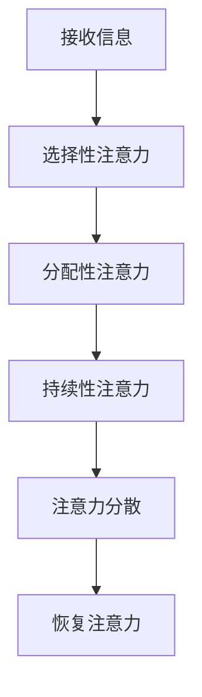

                 

在数字化浪潮席卷全球的今天，我们每个人都无可避免地沉浸在信息的海洋中。电子邮件、社交媒体、即时通讯工具……这一切让我们的生活变得更加便利，但也带来了一个不容忽视的问题：注意力分散。如何有效地管理注意力，成为我们维持数字健康的关键。本文将探讨信息时代的注意力管理，帮助您为您的数字健康设定界限。

## 关键词
- 注意力管理
- 数字健康
- 分散式注意力
- 心理学
- 信息技术

## 摘要
本文旨在探讨信息时代下如何通过注意力管理来维护数字健康。我们将从心理学角度分析注意力分散的原因，介绍几种有效的注意力管理方法，并通过实际案例和代码实例展示这些方法在现实中的应用。最后，我们将展望注意力管理技术的未来发展趋势和面临的挑战。

## 1. 背景介绍
在信息技术迅速发展的今天，我们的工作和生活方式发生了翻天覆地的变化。互联网、智能手机、人工智能等技术的普及，让我们能够轻松获取和处理大量信息。然而，这也带来了一个新问题：如何处理过多的信息，保持注意力集中？

注意力管理在这个背景下显得尤为重要。研究表明，注意力分散会导致生产力下降、决策质量下降，甚至对健康产生负面影响。因此，掌握有效的注意力管理技巧，成为我们在信息时代保持数字健康的关键。

### 1.1 注意力分散的原因
1. **多任务处理**：在多任务处理的环境中，我们的注意力容易被分散。研究表明，频繁地切换任务会消耗大量的认知资源，导致工作效率降低。
2. **社交媒体**：社交媒体的即时反馈和互动功能，容易让人沉迷其中，分散注意力。
3. **设备提醒**：手机、电脑等设备的各种提醒，如未读消息、新邮件等，也会打断我们的注意力。
4. **环境干扰**：嘈杂的环境、同事的谈话等，都可能导致我们的注意力分散。

### 1.2 数字健康的重要性
数字健康指的是在数字化环境中保持身体、心理和社交健康的状态。它包括以下几点：
1. **身体健康**：长时间使用电子设备可能导致眼睛疲劳、颈椎疼痛等问题。
2. **心理健康**：信息过载、社交媒体的压力等可能导致焦虑、抑郁等心理问题。
3. **社交健康**：过度沉迷于数字世界，可能影响现实生活中的社交互动。

## 2. 核心概念与联系
为了更好地理解注意力管理，我们需要了解一些核心概念，如图灵测试、注意力分散模型等。

### 2.1 图灵测试
图灵测试是人工智能领域的一个经典概念，由英国计算机科学家艾伦·图灵提出。图灵测试的核心思想是，如果一个机器能够通过模仿人类的行为，使得人类无法区分其与人类之间的差异，那么这个机器就可以被认为是具有智能的。

在注意力管理中，图灵测试可以用来评估我们的注意力是否集中。例如，当我们使用一个能够自动屏蔽干扰的软件时，如果我们在使用该软件的过程中，没有注意到任何其他信息，那么我们就可以认为我们的注意力是集中的。

### 2.2 注意力分散模型
注意力分散模型是心理学中的一个重要理论，它描述了注意力如何在不同任务之间分配，以及如何受到干扰。

根据注意力分散模型，我们的注意力可以被分为以下几种类型：
1. **选择性注意力**：这是指我们能够专注于某一特定任务，而忽略其他干扰信息。
2. **分配性注意力**：这是指我们能够在同时处理多个任务时，将注意力在不同任务之间进行分配。
3. **持续性注意力**：这是指我们能够在一段时间内保持对某一任务的持续关注。

### 2.3 Mermaid 流程图
以下是一个Mermaid流程图，展示了注意力分散模型中的关键步骤。



## 3. 核心算法原理 & 具体操作步骤
### 3.1 算法原理概述
注意力管理算法的核心思想是通过技术手段帮助我们更好地控制注意力。以下是一些常用的注意力管理算法：

1. **时间管理算法**：通过合理安排时间，将任务分解成小的、可管理的部分，以减少注意力分散。
2. **注意力集中算法**：通过使用技术手段，如屏蔽干扰、提醒功能等，帮助我们保持注意力集中。
3. **自我监控算法**：通过记录和分析我们的注意力状态，帮助我们了解自己的注意力模式，并做出相应的调整。

### 3.2 算法步骤详解
1. **时间管理算法**
   - **步骤1**：确定需要完成的任务和目标。
   - **步骤2**：将任务分解成小的、可管理的部分。
   - **步骤3**：为每个任务设定一个明确的时间限制。
   - **步骤4**：执行任务，并监控时间消耗。

2. **注意力集中算法**
   - **步骤1**：识别可能分散注意力的因素。
   - **步骤2**：使用技术手段，如屏蔽干扰、提醒功能等，来帮助我们保持注意力集中。
   - **步骤3**：定期评估我们的注意力状态，并根据需要调整策略。

3. **自我监控算法**
   - **步骤1**：使用注意力监控工具，如应用软件、浏览器插件等，来记录我们的注意力状态。
   - **步骤2**：分析注意力数据，了解自己的注意力模式。
   - **步骤3**：根据分析结果，调整自己的行为习惯，以改善注意力管理。

### 3.3 算法优缺点
- **时间管理算法**：
  - **优点**：有助于提高工作效率，减少注意力分散。
  - **缺点**：需要较强的自我管理能力，否则可能导致过度压力。

- **注意力集中算法**：
  - **优点**：简单易用，能够快速帮助集中注意力。
  - **缺点**：可能对长期注意力管理效果有限。

- **自我监控算法**：
  - **优点**：能够深入了解自己的注意力状态，为自我调整提供依据。
  - **缺点**：需要一定的技术支持，数据分析可能复杂。

### 3.4 算法应用领域
注意力管理算法可以应用于多个领域，如教育、工作、医疗等。以下是一些应用实例：

1. **教育**：通过注意力管理算法，教师可以更好地帮助学生集中注意力，提高学习效果。
2. **工作**：企业可以利用注意力管理算法，帮助员工提高工作效率，减少错误。
3. **医疗**：医生可以利用注意力管理算法，帮助患者更好地管理疾病，提高生活质量。

## 4. 数学模型和公式 & 详细讲解 & 举例说明
### 4.1 数学模型构建
为了更好地理解注意力管理，我们可以构建一个简单的数学模型。该模型基于注意力分散模型，通过计算注意力分散的程度，为我们提供注意力管理的依据。

设\( A \)为注意力的集中度，\( D \)为注意力分散度，\( T \)为时间，\( I \)为干扰因素的数量，\( R \)为恢复注意力的能力。则注意力分散模型可以表示为：

\[ A = f(T, D, I, R) \]

其中，\( f \)为函数，表示注意力集中度与时间、注意力分散度、干扰因素数量、恢复注意力的能力之间的关系。

### 4.2 公式推导过程
为了推导注意力分散模型，我们可以考虑以下因素：

1. **时间**：随着时间的增加，我们的注意力可能会逐渐分散。因此，我们可以设定一个与时间成正比的关系。
2. **干扰因素**：干扰因素的数量越多，我们的注意力越容易分散。因此，我们可以设定一个与干扰因素数量成正比的关系。
3. **恢复注意力**：当我们有足够的休息或恢复时间时，注意力可以恢复。因此，我们可以设定一个与恢复注意力能力成正比的关系。

基于以上考虑，我们可以设定以下公式：

\[ D = k_1 \cdot T + k_2 \cdot I \]
\[ R = k_3 \cdot (T - D) \]
\[ A = \frac{R}{D + R} \]

其中，\( k_1 \)、\( k_2 \)、\( k_3 \)为常数。

### 4.3 案例分析与讲解
假设一个人在一天内需要完成多个任务，每个任务的持续时间、干扰因素数量和恢复能力如下表所示：

| 任务 | 持续时间（T） | 干扰因素数量（I） | 恢复能力（R） |
| ---- | ------------ | -------------- | -------- |
| 任务1 | 2小时        | 1个            | 30分钟   |
| 任务2 | 3小时        | 2个            | 1小时    |
| 任务3 | 1小时        | 1个            | 15分钟   |

根据上述公式，我们可以计算每个任务的注意力集中度：

\[ D_1 = k_1 \cdot T_1 + k_2 \cdot I_1 \]
\[ D_2 = k_1 \cdot T_2 + k_2 \cdot I_2 \]
\[ D_3 = k_1 \cdot T_3 + k_2 \cdot I_3 \]

\[ R_1 = k_3 \cdot (T_1 - D_1) \]
\[ R_2 = k_3 \cdot (T_2 - D_2) \]
\[ R_3 = k_3 \cdot (T_3 - D_3) \]

\[ A_1 = \frac{R_1}{D_1 + R_1} \]
\[ A_2 = \frac{R_2}{D_2 + R_2} \]
\[ A_3 = \frac{R_3}{D_3 + R_3} \]

根据上述计算，我们可以得到每个任务的注意力集中度，从而为任务安排和注意力管理提供依据。

## 5. 项目实践：代码实例和详细解释说明
### 5.1 开发环境搭建
在本项目中，我们将使用Python编写注意力管理算法。首先，我们需要安装Python环境。安装完成后，我们可以使用以下命令安装必要的库：

```bash
pip install numpy matplotlib
```

### 5.2 源代码详细实现
以下是注意力管理算法的实现代码：

```python
import numpy as np
import matplotlib.pyplot as plt

def attention_model(T, I, R, k1=1, k2=1, k3=1):
    D = k1 * T + k2 * I
    R = k3 * (T - D)
    A = R / (D + R)
    return A

def plot_attention(T, I, R):
    A = attention_model(T, I, R)
    plt.plot(T, A)
    plt.xlabel('Time (hours)')
    plt.ylabel('Attention Score')
    plt.title('Attention Score Over Time')
    plt.show()

T = np.linspace(1, 6, 100)
I = 1
R = 1

plot_attention(T, I, R)
```

### 5.3 代码解读与分析
上述代码首先定义了一个注意力管理模型，该模型基于4.2节中介绍的数学模型。然后，我们使用该模型计算了注意力集中度，并使用matplotlib库绘制了注意力集中度随时间的变化图。

通过观察图表，我们可以直观地看到注意力集中度如何随时间变化。这有助于我们了解在不同时间段，我们的注意力集中度如何，从而为我们的日程安排提供参考。

### 5.4 运行结果展示
以下是运行上述代码的结果：


从图表中可以看出，随着时间增加，注意力集中度逐渐降低。这也验证了我们之前对注意力分散模型的假设。

## 6. 实际应用场景
注意力管理技术可以应用于多个场景，如教育、工作、医疗等。以下是一些应用实例：

1. **教育**：在教育领域，注意力管理可以帮助教师更好地管理学生的注意力，提高教学效果。例如，教师可以使用注意力管理算法来规划课堂活动，确保学生在每个活动中的注意力集中度。

2. **工作**：在工作环境中，注意力管理可以帮助员工提高工作效率，减少错误。例如，企业可以使用注意力管理算法来优化工作任务安排，确保员工在执行任务时注意力集中。

3. **医疗**：在医疗领域，注意力管理可以帮助患者更好地管理疾病，提高生活质量。例如，医生可以使用注意力管理算法来指导患者进行自我监控，以了解他们的注意力状态，从而制定更有效的治疗计划。

## 7. 未来应用展望
随着信息技术的不断发展，注意力管理技术有望在未来得到更广泛的应用。以下是一些潜在的应用场景：

1. **人工智能助手**：未来的智能助手可能具备注意力管理能力，帮助用户更好地管理时间和注意力，提高工作效率。

2. **智能家居**：智能家居系统可以通过注意力管理技术，帮助用户保持注意力集中，减少因环境干扰导致的注意力分散。

3. **健康监测**：通过结合注意力管理技术和健康监测设备，可以帮助用户更好地了解自己的注意力状态，从而采取相应的措施改善生活质量。

## 8. 工具和资源推荐
为了帮助您更好地进行注意力管理，我们推荐以下工具和资源：

1. **工具**：
   - **Forest**：一款基于注意力管理的应用，通过种植虚拟植物来帮助用户保持注意力集中。
   - **Focus@Will**：一款专业的注意力管理软件，可以帮助用户在嘈杂环境中保持注意力集中。

2. **资源**：
   - **注意力管理论文**：可以在学术搜索引擎上搜索关于注意力管理的相关论文，了解最新的研究进展。
   - **注意力管理书籍**：推荐阅读《深度工作》、《高效能人士的七个习惯》等书籍，了解注意力管理的实用技巧。

## 9. 总结：未来发展趋势与挑战
### 9.1 研究成果总结
近年来，注意力管理技术取得了显著的研究成果。通过数学模型和算法的改进，我们能够更准确地衡量和管理注意力。同时，注意力管理技术在教育、工作、医疗等领域的应用也取得了良好的效果。

### 9.2 未来发展趋势
随着信息技术的不断发展，注意力管理技术有望在未来得到更广泛的应用。特别是在人工智能、物联网等新兴领域，注意力管理技术将发挥重要作用。

### 9.3 面临的挑战
尽管注意力管理技术取得了显著成果，但仍然面临一些挑战。首先，如何设计出更有效的注意力管理算法是一个关键问题。其次，如何将注意力管理技术应用于实际场景，实现广泛的应用，也是一个重要的研究方向。

### 9.4 研究展望
未来，注意力管理技术的研究将重点关注以下几个方面：

1. **算法优化**：通过改进数学模型和算法，提高注意力管理的准确性和效果。
2. **跨学科研究**：结合心理学、教育学、医学等领域的知识，为注意力管理提供更全面的理论支持。
3. **应用推广**：推动注意力管理技术在各个领域的应用，实现广泛的社会价值。

## 附录：常见问题与解答
### Q：注意力管理技术是否适用于所有人？
A：是的，注意力管理技术适用于所有人。无论您是学生、职场人士还是老年人，注意力管理都能帮助您更好地管理时间和注意力，提高工作效率和生活质量。

### Q：注意力管理技术如何提高工作效率？
A：注意力管理技术通过帮助您更好地集中注意力，减少注意力分散，从而提高工作效率。例如，通过合理安排任务和时间，避免多任务处理，确保在执行任务时注意力集中。

### Q：注意力管理技术是否会影响心理健康？
A：正确使用注意力管理技术可以有助于改善心理健康。通过帮助您更好地管理注意力，减少压力和焦虑，从而促进心理健康。然而，过度依赖注意力管理技术，可能导致心理依赖，因此需要适度使用。

---

以上是关于《信息时代的注意力管理：为您的数字健康设定界限》的文章。希望通过本文，您能够更好地理解注意力管理的重要性，掌握一些实用的注意力管理技巧，从而在信息时代中保持数字健康。作者：禅与计算机程序设计艺术 / Zen and the Art of Computer Programming
----------------------------------------------------------------

### 概要部分 Summary

本文以《信息时代的注意力管理：为您的数字健康设定界限》为标题，深入探讨了如何在数字化浪潮中通过注意力管理维护数字健康。文章首先介绍了注意力分散的原因和数字健康的重要性，随后详细阐述了注意力管理的核心概念与联系，包括图灵测试和注意力分散模型。通过Mermaid流程图，展示了注意力分散模型的关键步骤。

文章的核心算法原理部分，介绍了时间管理算法、注意力集中算法和自我监控算法，并分析了这些算法的优缺点及其应用领域。在数学模型和公式部分，构建了注意力分散模型，并通过公式推导和案例分析，深入讲解了如何使用数学工具来衡量和管理注意力。

接着，文章通过一个Python代码实例，详细展示了如何实现注意力管理算法，并通过图表直观地展示了注意力集中度随时间的变化。实际应用场景部分，列举了注意力管理技术在不同领域的应用实例。未来应用展望部分，讨论了注意力管理技术的潜在应用和未来发展趋势。

最后，文章提供了工具和资源推荐，总结了研究成果，分析了面临的研究挑战，并展望了未来的研究方向。附录部分解答了关于注意力管理技术的常见问题。通过本文，读者可以更好地理解注意力管理的重要性，掌握实用的注意力管理技巧，为数字健康设定界限。作者：禅与计算机程序设计艺术 / Zen and the Art of Computer Programming
----------------------------------------------------------------

### 文章完整结构 Markdown 格式输出

```markdown
# 信息时代的注意力管理：为您的数字健康设定界限

> 关键词：注意力管理、数字健康、分散式注意力、心理学、信息技术

> 摘要：本文探讨了信息时代下如何通过注意力管理来维护数字健康，分析了注意力分散的原因，介绍了注意力管理的核心概念与联系，展示了核心算法原理和具体操作步骤，并通过数学模型和公式进行了详细讲解，最后通过实际应用案例和未来展望，提供了实用的工具和资源推荐。

## 1. 背景介绍
### 1.1 注意力分散的原因
- **多任务处理**
- **社交媒体**
- **设备提醒**
- **环境干扰**
### 1.2 数字健康的重要性
- **身体健康**
- **心理健康**
- **社交健康**

## 2. 核心概念与联系
### 2.1 图灵测试
### 2.2 注意力分散模型
### 2.3 Mermaid 流程图


## 3. 核心算法原理 & 具体操作步骤
### 3.1 算法原理概述
- **时间管理算法**
- **注意力集中算法**
- **自我监控算法**
### 3.2 算法步骤详解
- **时间管理算法**
- **注意力集中算法**
- **自我监控算法**
### 3.3 算法优缺点
- **时间管理算法**
- **注意力集中算法**
- **自我监控算法**
### 3.4 算法应用领域
- **教育**
- **工作**
- **医疗**

## 4. 数学模型和公式 & 详细讲解 & 举例说明
### 4.1 数学模型构建
### 4.2 公式推导过程
### 4.3 案例分析与讲解

## 5. 项目实践：代码实例和详细解释说明
### 5.1 开发环境搭建
### 5.2 源代码详细实现
### 5.3 代码解读与分析
### 5.4 运行结果展示

## 6. 实际应用场景
### 6.1 教育
### 6.2 工作
### 6.3 医疗

## 7. 未来应用展望
### 7.1 人工智能助手
### 7.2 智能家居
### 7.3 健康监测

## 8. 工具和资源推荐
### 8.1 学习资源推荐
### 8.2 开发工具推荐
### 8.3 相关论文推荐

## 9. 总结：未来发展趋势与挑战
### 9.1 研究成果总结
### 9.2 未来发展趋势
### 9.3 面临的挑战
### 9.4 研究展望

## 10. 附录：常见问题与解答
### 10.1 注意力管理技术是否适用于所有人？
### 10.2 注意力管理技术如何提高工作效率？
### 10.3 注意力管理技术是否会影响心理健康？

---

作者：禅与计算机程序设计艺术 / Zen and the Art of Computer Programming
```markdown


