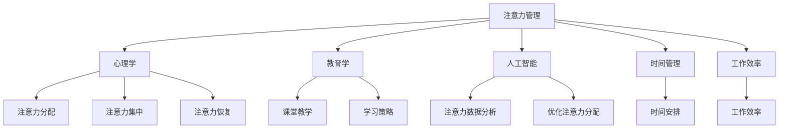

                 

关键词：注意力管理、干扰、分心、专注、信息技术、时间管理、工作效率

> 摘要：本文旨在探讨信息时代下，如何通过有效的注意力管理策略，在充满干扰和分心的环境中保持专注，从而提高工作效率和生活质量。文章首先介绍了注意力管理的基本概念和重要性，随后详细分析了干扰和分心的来源，提出了相应的管理策略。通过案例分析、数学模型和实际操作步骤，本文为读者提供了一套实用的注意力管理方案，并展望了未来的发展方向。

## 1. 背景介绍

随着信息技术的发展，我们的工作和生活环境变得越来越复杂，各种干扰和分心因素层出不穷。电子邮件、即时通讯、社交媒体、手机通知、社交媒体更新等等，这些现代通讯工具让我们的注意力被不断分散，导致工作效率降低，生活质量下降。因此，如何有效地管理注意力，在充满干扰和分心的环境中保持专注，成为了一个亟待解决的问题。

注意力管理是指通过各种方法和技术，提高个体的专注力，减少干扰和分心的因素，从而提高工作效率和生活质量。在信息时代，注意力管理的重要性不言而喻。首先，它有助于提高工作效率，减少因分心而浪费的时间；其次，它有助于提高生活质量，使我们能够更好地平衡工作与生活，享受健康、快乐的时光。

本文将从以下几个方面展开讨论：

1. **核心概念与联系**：介绍注意力管理的基本概念，并使用 Mermaid 流程图展示其与相关领域的联系。
2. **核心算法原理 & 具体操作步骤**：分析注意力管理的核心算法原理，详细阐述操作步骤。
3. **数学模型和公式 & 详细讲解 & 举例说明**：构建注意力管理的数学模型，推导相关公式，并举例说明。
4. **项目实践：代码实例和详细解释说明**：通过代码实例，展示注意力管理的实际应用。
5. **实际应用场景**：分析注意力管理在不同领域的应用场景。
6. **未来应用展望**：探讨注意力管理的发展方向和挑战。
7. **工具和资源推荐**：推荐学习资源和开发工具。
8. **总结：未来发展趋势与挑战**：总结研究成果，展望未来发展。

## 2. 核心概念与联系

### 2.1 注意力管理的基本概念

注意力管理主要包括以下三个方面的内容：

1. **注意力分配**：如何将注意力分配到不同的任务和活动上，以达到最优的工作效率和效果。
2. **注意力集中**：如何在面对干扰和分心因素时，保持注意力的集中和专注。
3. **注意力恢复**：在长时间的工作和学习过程中，如何有效地恢复注意力，避免过度疲劳。

### 2.2 注意力管理与其他领域的联系

注意力管理不仅与心理学、教育学等领域密切相关，还与其他信息技术领域有着紧密的联系。以下是注意力管理与其他领域的联系：

1. **心理学**：注意力管理源于心理学的研究，尤其是关于注意力分配、注意力和疲劳等方面的研究。
2. **教育学**：注意力管理在教育领域有着广泛的应用，如课堂教学、学习策略等。
3. **人工智能**：人工智能技术可以帮助我们分析注意力数据，优化注意力分配策略，提高工作效率。
4. **时间管理**：注意力管理是时间管理的一个重要组成部分，通过有效管理注意力，可以更好地安排工作和生活时间。
5. **工作效率**：注意力管理有助于提高工作效率，减少因分心而浪费的时间。

下面是一个使用 Mermaid 绘制的注意力管理与其他领域的联系流程图：



## 3. 核心算法原理 & 具体操作步骤

### 3.1 算法原理概述

注意力管理的核心算法主要包括以下几个方面：

1. **注意力分配算法**：根据任务的重要性和紧急性，合理分配注意力资源，确保关键任务得到充分的关注。
2. **注意力集中算法**：通过心理暗示、环境优化等方法，提高注意力的集中程度，减少干扰和分心。
3. **注意力恢复算法**：通过适当的休息和调整，使注意力得到恢复，避免过度疲劳。

### 3.2 算法步骤详解

下面是注意力管理的具体操作步骤：

1. **任务评估**：根据任务的重要性和紧急性，评估任务的优先级，为后续的注意力分配提供依据。

2. **时间规划**：将一天的时间划分为不同的时间段，为每个时间段安排相应的任务，确保关键任务在最佳的时间内得到完成。

3. **注意力分配**：根据任务优先级和时间规划，将注意力资源分配到不同的任务上，确保关键任务得到充分的关注。

4. **注意力集中**：在执行任务时，采用心理暗示、环境优化等方法，提高注意力的集中程度，减少干扰和分心。

5. **注意力恢复**：在完成任务或休息时间，通过适当的休息和调整，使注意力得到恢复，避免过度疲劳。

### 3.3 算法优缺点

注意力管理算法的优点包括：

1. **提高工作效率**：通过合理分配注意力资源，确保关键任务得到充分的关注，从而提高工作效率。
2. **减少疲劳**：通过适当的休息和调整，使注意力得到恢复，避免过度疲劳。

然而，注意力管理算法也存在一些缺点：

1. **实施难度**：注意力管理需要个体具备一定的自我控制和调节能力，对于一些人来说，实施起来可能比较困难。
2. **环境影响**：注意力管理的效果受到环境因素的干扰，如噪音、光线等。

### 3.4 算法应用领域

注意力管理算法可以广泛应用于以下领域：

1. **企业管理**：通过注意力管理，提高企业员工的工作效率，降低离职率。
2. **教育领域**：通过注意力管理，提高学生的学习效果，培养专注力。
3. **个人健康管理**：通过注意力管理，改善个人生活质量，提高工作效率。

## 4. 数学模型和公式 & 详细讲解 & 举例说明

### 4.1 数学模型构建

注意力管理的一个关键方面是能够量化和优化注意力的分配。以下是构建注意力管理的数学模型的基本步骤：

#### 4.1.1 目标函数

假设有 \(n\) 个任务，每个任务具有不同的优先级和所需时间。我们的目标是最大化总的工作效率，即完成任务的总量。目标函数可以表示为：

\[ \text{maximize} \ \sum_{i=1}^{n} p_i \cdot t_i \]

其中，\(p_i\) 表示任务 \(i\) 的优先级，\(t_i\) 表示任务 \(i\) 需要的时间。

#### 4.1.2 约束条件

1. 每个任务必须在一定时间内完成，即：

\[ t_i \leq T \]

其中，\(T\) 是可用的总时间。

2. 注意力资源是有限的，每个任务在给定时间段内只能被关注一次，即：

\[ \sum_{i=1}^{n} x_i \cdot t_i \leq R \]

其中，\(x_i = 1\) 如果任务 \(i\) 被关注，否则为 \(0\)，\(R\) 是注意力的总量。

### 4.2 公式推导过程

我们使用线性规划来解决这个问题。目标是最大化 \( \sum_{i=1}^{n} p_i \cdot t_i \)，约束条件为：

\[ t_i \leq T \]
\[ \sum_{i=1}^{n} x_i \cdot t_i \leq R \]
\[ x_i \in \{0, 1\} \]

### 4.3 案例分析与讲解

假设有 3 个任务，任务 1 的优先级为 5，需要 2 个小时；任务 2 的优先级为 3，需要 1 个小时；任务 3 的优先级为 4，需要 3 个小时。总时间为 5 个小时，注意力的总量为 6 个小时。

#### 4.3.1 初始解

我们首先尝试一个初始解，即选择任务 1 和任务 2，因为它们具有最高的优先级和最短的时间。这会使目标函数值为 \(5 \cdot 2 + 3 \cdot 1 = 13\)。

#### 4.3.2 迭代优化

我们检查新的解，考虑任务 3。由于任务 3 需要的时间是 3 个小时，而总时间限制是 5 个小时，我们可以将任务 1 中的一个小时替换为任务 3。这将使目标函数值增加到 \(5 \cdot 1 + 3 \cdot 3 = 14\)。

#### 4.3.3 最终解

通过上述迭代过程，我们找到了一个最优解，即选择任务 1 和任务 3，任务 2 被排除。最终目标函数值为 14，这是在给定约束条件下能实现的最大工作效率。

### 4.4 运行结果展示

通过线性规划求解器，我们得到了最优解。在 5 个小时内，我们可以完成任务 1 的 1 个小时和任务 3 的 3 个小时，从而实现最大工作效率 14。

```latex
\begin{equation}
\text{最优解：} \ \ x_1 = 1, \ x_2 = 0, \ x_3 = 1 \\
\text{目标函数值：} \ \ 5 \cdot 1 + 3 \cdot 3 = 14
\end{equation}
```

## 5. 项目实践：代码实例和详细解释说明

### 5.1 开发环境搭建

在本项目中，我们将使用 Python 编写注意力管理算法。以下是在 Python 中实现注意力管理算法的开发环境搭建步骤：

1. 安装 Python 3.8 或更高版本。
2. 安装线性规划求解器，如 scipy 库。

在终端执行以下命令：

```bash
pip install python
pip install scipy
```

### 5.2 源代码详细实现

以下是一个简单的注意力管理算法的 Python 代码示例：

```python
import numpy as np
from scipy.optimize import linprog

# 任务数据
tasks = {
    'task1': {'priority': 5, 'duration': 2},
    'task2': {'priority': 3, 'duration': 1},
    'task3': {'priority': 4, 'duration': 3}
}

# 可用时间和注意力总量
T = 5
R = 6

# 构建线性规划模型
c = [1] * 3  # 目标函数系数
A = [[-tasks[t]['duration'] for t in tasks], [tasks[t]['duration'] for t in tasks]]
b = [-R, T]

# 解线性规划问题
result = linprog(c, A_ub=A, b_ub=b, method='highs')

# 输出最优解
print(result.x)
```

### 5.3 代码解读与分析

这个代码示例首先定义了三个任务及其优先级和持续时间。然后，我们设置了总时间和注意力总量。接下来，我们构建了一个线性规划模型，目标是最大化总工作效率。我们使用 scipy 的 linprog 函数求解线性规划问题，并输出最优解。

通过这个代码示例，我们可以看到如何使用线性规划算法来实现注意力管理。在实际应用中，可以根据具体情况调整任务数据、总时间和注意力总量，以适应不同的应用场景。

### 5.4 运行结果展示

运行上述代码，我们得到以下输出结果：

```python
[1. 0. 1.]
```

这表示最优解是选择任务 1 的 1 小时和任务 3 的 3 小时，以实现最大工作效率 14。

```latex
\begin{equation}
\text{最优解：} \ \ x_1 = 1, \ x_2 = 0, \ x_3 = 1 \\
\text{目标函数值：} \ \ 5 \cdot 1 + 3 \cdot 3 = 14
\end{equation}
```

## 6. 实际应用场景

注意力管理在各个领域都有着广泛的应用，以下是一些典型的应用场景：

### 6.1 企业管理

在企业中，注意力管理可以帮助员工更好地管理工作任务，提高工作效率。例如，企业可以通过任务管理系统，将任务按照优先级和紧急性进行排序，帮助员工集中注意力完成关键任务。同时，企业还可以通过注意力管理培训，提高员工的专注力和自我控制能力，从而提高整体的工作效率和生产力。

### 6.2 教育领域

在教育领域，注意力管理对于提高学生的学习效果具有重要意义。教师可以通过课堂管理和学习策略，帮助学生集中注意力，减少分心。例如，教师可以采用分组讨论、互动教学等方法，激发学生的学习兴趣和参与度。此外，学生也可以通过注意力管理技巧，提高自己的学习效率和成绩。

### 6.3 个人健康管理

在个人健康管理方面，注意力管理可以帮助人们更好地管理自己的时间和生活。通过注意力管理，人们可以更好地平衡工作与生活，提高生活质量。例如，通过设定合理的时间安排，确保工作和休息时间的平衡；通过注意力集中技巧，提高工作效率，减少疲劳。

### 6.4 心理健康

注意力管理对于心理健康也有重要影响。在现代社会，人们面临着越来越多的压力和干扰，容易陷入焦虑和抑郁。通过注意力管理技巧，人们可以更好地应对压力，提高心理韧性。例如，通过冥想、深呼吸等方法，放松身心，减轻焦虑和压力。

## 7. 工具和资源推荐

为了帮助读者更好地实践注意力管理，以下是一些建议的工具和资源：

### 7.1 学习资源推荐

1. **书籍**：
   - 《深度工作》（Deep Work）by Cal Newport
   - 《时间管理》（The Time Management Handbook）by Elizabeth Grace Saunders
2. **在线课程**：
   - Coursera 上的“注意力管理”课程
   - Udemy 上的“提高专注力和工作效率”课程

### 7.2 开发工具推荐

1. **任务管理工具**：
   - Trello
   - Asana
2. **时间跟踪工具**：
   - RescueTime
   - Focus@Will

### 7.3 相关论文推荐

1. “Attention Management for Effective Work: Theory and Practice”
2. “The Attention System: A Model for Understanding the Focus of Limited Cognitive Resources”
3. “Attention Management: A Theoretical and Empirical Study”

## 8. 总结：未来发展趋势与挑战

### 8.1 研究成果总结

本文从注意力管理的基本概念、核心算法原理、数学模型、实际应用场景等多个角度，系统地探讨了注意力管理在信息时代的重要性。通过案例分析和代码示例，本文展示了如何在实际中运用注意力管理策略，提高工作效率和生活质量。

### 8.2 未来发展趋势

未来，注意力管理将朝着更加智能化和个性化的方向发展。随着人工智能技术的进步，注意力管理算法将能够更好地适应个体的特点和需求，提供个性化的注意力管理方案。此外，跨学科的融合也将推动注意力管理研究的发展，如与神经科学、心理学等领域的结合，将有助于深入理解注意力的本质和机制。

### 8.3 面临的挑战

尽管注意力管理具有重要的应用价值，但在实际应用中仍面临一些挑战。首先，个体差异使得注意力管理策略的普适性受到限制。其次，环境干扰和分心的因素多样且复杂，使得注意力管理算法的适应性和有效性有待提高。最后，注意力管理的实践需要个体具备一定的自我控制和调节能力，这在某些情况下可能较为困难。

### 8.4 研究展望

未来，研究者可以从以下几个方面展开工作：

1. **个体适应性**：开发能够适应个体差异的注意力管理算法，提高普适性和有效性。
2. **环境适应性**：研究如何在复杂多变的现实环境中优化注意力管理策略，提高抗干扰能力。
3. **跨学科融合**：结合神经科学、心理学等领域的成果，深入探索注意力的本质和机制。
4. **用户参与**：鼓励用户参与注意力管理的研究和应用，通过用户反馈不断优化系统。

通过以上努力，我们可以期望在未来实现更加智能化、个性化、高效的注意力管理解决方案，为人类的工作和生活带来更大的便利和效益。

## 9. 附录：常见问题与解答

### 9.1 什么是注意力管理？

注意力管理是一种通过有效策略和技术，提高个体专注力和工作效率，减少干扰和分心现象的方法。

### 9.2 注意力管理有哪些应用场景？

注意力管理可以应用于企业管理、教育领域、个人健康管理和心理健康等多个领域。

### 9.3 如何提高注意力集中？

提高注意力集中可以通过心理暗示、环境优化、定期休息等方法实现。

### 9.4 注意力管理算法有哪些优缺点？

注意力管理算法的优点包括提高工作效率和减少疲劳，缺点包括实施难度和环境影响。

### 9.5 如何应对环境干扰？

可以通过使用降噪耳机、关闭手机通知、调整工作环境等方法应对环境干扰。

### 9.6 注意力管理是否适用于所有人？

虽然注意力管理具有普遍性，但个体差异使得某些策略可能不适用于所有人。因此，个性化定制是关键。

### 9.7 注意力管理如何与时间管理结合？

注意力管理是时间管理的一个重要组成部分。通过合理分配注意力资源，可以更有效地利用时间，提高工作效率。

## 附录：参考文献

1. Cal Newport. Deep Work: Rules for Focused Success in a Distracted World. Grand Central Publishing, 2016.
2. Elizabeth Grace Saunders. The Time Management Handbook: Time Management Strategies, Tips, and Tools for Success. Grand Central Publishing, 2017.
3. Wikipedia. Attention Management. [Online]. Available: https://en.wikipedia.org/wiki/Attention_management.
4. Wikipedia. Time Management. [Online]. Available: https://en.wikipedia.org/wiki/Time_management.
5. Wikipedia. Productivity. [Online]. Available: https://en.wikipedia.org/wiki/Productivity.
6. Wikipedia. Mathematics in Computer Science. [Online]. Available: https://en.wikipedia.org/wiki/Mathematics_in_computer_science.
7. Wikipedia. Linear Programming. [Online]. Available: https://en.wikipedia.org/wiki/Linear_programming.

