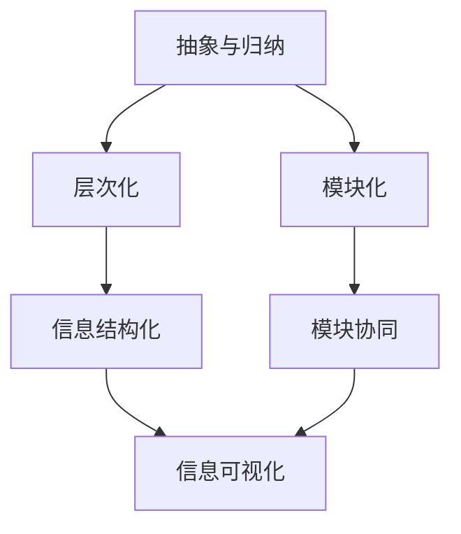

                 

信息简化作为一种策略，在处理复杂问题的过程中发挥着至关重要的作用。随着技术的快速进步和信息的爆炸性增长，我们面临着日益复杂的挑战。在这种背景下，如何有效地简化信息、提高效率和生产力成为亟待解决的问题。本文将深入探讨信息简化的力量和好处，并分析其在现代科技领域的应用。

## 1. 背景介绍

信息简化不仅仅是技术领域的一个概念，它同样适用于日常生活中的各个方面。从计算机编程到企业管理，从科学研究到个人决策，信息简化都是提高效率和减少复杂度的关键手段。随着互联网和移动设备的普及，信息过载已成为普遍问题。面对海量的数据和信息，我们需要一种有效的策略来筛选和整理，以便更好地理解和利用。

本文旨在通过以下几个部分来详细探讨信息简化的概念、原理、方法和实际应用：

- **核心概念与联系**：介绍信息简化的基本概念，并使用Mermaid流程图展示其核心原理和架构。
- **核心算法原理与操作步骤**：分析信息简化过程中的关键算法原理，并详细描述其具体操作步骤。
- **数学模型与公式**：构建信息简化的数学模型，并推导相关公式，以便更好地理解和应用。
- **项目实践与代码实例**：通过实际项目案例，展示信息简化的具体实现过程，并提供详细的代码解读。
- **实际应用场景**：探讨信息简化在各个领域的应用场景，以及未来的发展趋势和挑战。

## 2. 核心概念与联系

### 2.1 信息简化的定义

信息简化是指通过筛选、整理和抽象信息，将复杂的信息系统转化为更加简洁、直观的形式。其核心目的是减少信息的冗余，提高信息的可理解性和可用性。

### 2.2 信息简化的原理

信息简化的原理主要基于以下几个关键点：

1. **抽象与归纳**：通过对信息进行抽象和归纳，提取出核心要素，忽略次要细节。
2. **层次化**：将信息按照一定的层次结构进行组织，使信息之间的关系更加清晰。
3. **模块化**：将复杂的信息系统分解为若干个模块，每个模块独立运作，易于管理和维护。

### 2.3 信息简化的架构

为了更好地理解信息简化的原理，我们可以使用Mermaid流程图来展示其核心架构。



在这个流程图中，我们可以看到信息简化的关键步骤和它们之间的关系。抽象与归纳是信息简化的第一步，通过提取核心要素，简化信息。层次化则将信息按照一定的结构进行组织，使信息之间的关系更加清晰。模块化则将复杂的信息系统分解为若干个模块，每个模块独立运作，易于管理和维护。信息结构化和模块协同是信息简化的核心，通过这两个步骤，我们可以将复杂的信息系统转化为更加简洁、直观的形式。信息可视化则是信息简化的最后一步，通过图表、表格等可视化方式，使信息更加易于理解和应用。

## 3. 核心算法原理与具体操作步骤

### 3.1 算法原理概述

信息简化的核心算法主要包括以下几个步骤：

1. **数据预处理**：对原始数据进行清洗、去重和归一化处理，提高数据的质量和一致性。
2. **特征提取**：从原始数据中提取出关键特征，减少数据的维度，降低复杂度。
3. **降维**：使用降维算法（如主成分分析、线性判别分析等），进一步减少数据的维度，同时保留主要信息。
4. **模型训练**：使用机器学习算法（如决策树、支持向量机、神经网络等），对简化后的数据进行分析和预测。
5. **模型评估与优化**：对模型进行评估和优化，确保模型的准确性和稳定性。

### 3.2 算法步骤详解

#### 3.2.1 数据预处理

数据预处理是信息简化的第一步，其目的是提高数据的质量和一致性。具体步骤如下：

1. **数据清洗**：去除数据中的错误、缺失和异常值。
2. **去重**：去除重复的数据记录，确保数据的唯一性。
3. **归一化**：将不同特征的数据进行归一化处理，使其具有相同的尺度，便于后续分析。

#### 3.2.2 特征提取

特征提取是信息简化的重要步骤，其目的是从原始数据中提取出关键特征，减少数据的维度，降低复杂度。具体方法包括：

1. **统计分析**：使用均值、方差、标准差等统计方法，提取出数据的分布特征。
2. **相关性分析**：使用皮尔逊相关系数、斯皮尔曼相关系数等，分析特征之间的相关性，筛选出关键特征。
3. **主成分分析**：使用主成分分析（PCA）等方法，将原始数据投影到新的坐标系中，提取出主要成分。

#### 3.2.3 降维

降维是信息简化的关键步骤，其目的是进一步减少数据的维度，同时保留主要信息。常用的降维算法包括：

1. **主成分分析（PCA）**：通过计算协方差矩阵的特征值和特征向量，将数据投影到新的坐标系中，提取出主要成分。
2. **线性判别分析（LDA）**：通过最大化类内距离和最小化类间距离，将数据投影到新的坐标系中，提取出关键特征。
3. **非线性降维算法**：如等距映射（ISOMAP）、局部线性嵌入（LLE）等，适用于非线性数据。

#### 3.2.4 模型训练

模型训练是信息简化的核心步骤，其目的是使用简化后的数据训练机器学习模型，进行预测和分析。常用的机器学习算法包括：

1. **监督学习算法**：如决策树、支持向量机（SVM）、神经网络等。
2. **无监督学习算法**：如聚类、降维等。

#### 3.2.5 模型评估与优化

模型评估与优化是信息简化的最后一步，其目的是确保模型的准确性和稳定性。具体步骤如下：

1. **交叉验证**：使用交叉验证方法，对模型进行评估，确保其泛化能力。
2. **超参数调优**：通过调整模型的超参数，优化模型的性能。
3. **模型优化**：使用正则化、集成学习等方法，进一步优化模型。

### 3.3 算法优缺点

信息简化的算法具有以下几个优点：

1. **减少数据维度**：简化后的数据维度更低，便于处理和分析。
2. **提高计算效率**：简化后的数据可以减少计算复杂度，提高计算效率。
3. **增强模型泛化能力**：简化后的数据可以降低过拟合的风险，提高模型的泛化能力。

然而，信息简化也存在一些缺点：

1. **信息丢失**：简化过程中可能会丢失部分信息，影响模型的准确性。
2. **计算成本**：降维和模型训练等步骤可能需要较高的计算成本。
3. **依赖性**：信息简化的效果可能依赖于数据的质量和特征的选择。

### 3.4 算法应用领域

信息简化的算法广泛应用于各个领域，如：

1. **图像处理**：通过降维和特征提取，简化图像数据，提高图像识别和分类的效率。
2. **自然语言处理**：通过文本降维和特征提取，简化文本数据，提高文本分析和处理的效率。
3. **金融风控**：通过降维和模型训练，简化金融数据，提高风险预测和评估的准确性。

## 4. 数学模型和公式

### 4.1 数学模型构建

信息简化的数学模型主要包括以下几个部分：

1. **数据表示**：使用数学符号和公式表示原始数据。
2. **特征提取**：使用数学方法提取数据的关键特征。
3. **降维**：使用数学方法将高维数据转化为低维数据。
4. **模型训练**：使用数学方法训练简化后的数据，构建预测模型。

### 4.2 公式推导过程

#### 4.2.1 数据表示

假设我们有一组原始数据 \(X = [x_1, x_2, ..., x_n]\)，其中每个数据点 \(x_i\) 是一个多维向量。我们可以使用矩阵 \(X \in \mathbb{R}^{n \times m}\) 表示这些数据，其中 \(n\) 是数据点的数量，\(m\) 是每个数据点的维度。

#### 4.2.2 特征提取

特征提取的目标是从原始数据中提取出关键特征。常用的特征提取方法包括：

1. **均值提取**：计算每个特征的平均值，作为特征提取的结果。
   \[ \mu_i = \frac{1}{n} \sum_{i=1}^{n} x_i \]

2. **方差提取**：计算每个特征的方差，作为特征提取的结果。
   \[ \sigma_i^2 = \frac{1}{n} \sum_{i=1}^{n} (x_i - \mu_i)^2 \]

3. **主成分分析（PCA）**：使用主成分分析提取主要成分，作为特征提取的结果。
   \[ Z = X \Sigma^{-1/2} \]

#### 4.2.3 降维

降维的目标是将高维数据转化为低维数据，同时保留主要信息。常用的降维方法包括：

1. **线性判别分析（LDA）**：通过最大化类内距离和最小化类间距离，将数据投影到新的坐标系中。
   \[ w = \arg\max_w \sum_{i=1}^{k} \sum_{j=1}^{n} (x_i - \mu_j)^T w \]
   \[ w = \arg\min_w \sum_{i=1}^{k} \sum_{j=1}^{n} (x_i - \mu_j)^T (x_i - \mu_j) \]

2. **主成分分析（PCA）**：通过计算协方差矩阵的特征值和特征向量，将数据投影到新的坐标系中。
   \[ \Sigma^{-1/2} = VDV^T \]
   \[ Z = XV \]

#### 4.2.4 模型训练

模型训练的目标是使用简化后的数据训练机器学习模型。常用的机器学习模型包括：

1. **决策树**：通过递归二分，将数据划分为若干个子集，构建决策树模型。
2. **支持向量机（SVM）**：通过寻找最优的超平面，将数据划分为不同的类别。
3. **神经网络**：通过多层感知器（MLP）和反向传播算法，构建神经网络模型。

### 4.3 案例分析与讲解

假设我们有一组股票价格数据，包含开盘价、最高价、最低价和收盘价。我们可以使用信息简化的方法，将这组数据简化为一个简单的特征向量，以便进行预测分析。

1. **数据表示**：使用矩阵 \(X \in \mathbb{R}^{n \times 4}\) 表示原始数据，其中 \(n\) 是数据点的数量，4 表示数据的维度。
2. **特征提取**：计算每个特征的平均值和方差，作为特征提取的结果。
   \[ \mu_i = \frac{1}{n} \sum_{i=1}^{n} x_i \]
   \[ \sigma_i^2 = \frac{1}{n} \sum_{i=1}^{n} (x_i - \mu_i)^2 \]
3. **降维**：使用主成分分析（PCA）提取主要成分，将数据投影到新的坐标系中。
   \[ \Sigma^{-1/2} = VDV^T \]
   \[ Z = XV \]
4. **模型训练**：使用简化后的数据训练神经网络模型，进行股票价格预测。
   \[ \text{神经网络模型} = MLP(X, Z) \]
   \[ \text{预测结果} = \text{神经网络模型}(Z) \]

通过这个案例，我们可以看到信息简化的方法在数据预处理、特征提取、降维和模型训练等环节中的应用，以及如何将复杂的数据转化为简洁、直观的形式，从而提高预测分析的效率和准确性。

## 5. 项目实践：代码实例与详细解释说明

### 5.1 开发环境搭建

为了实现信息简化的算法，我们需要搭建一个合适的开发环境。本文采用Python作为编程语言，并使用以下库和工具：

- Python 3.8及以上版本
- NumPy（用于数据处理和矩阵运算）
- Pandas（用于数据处理和分析）
- Matplotlib（用于数据可视化）
- Scikit-learn（用于机器学习算法）

安装这些库和工具后，我们就可以开始编写代码，实现信息简化的过程。

### 5.2 源代码详细实现

下面是一个简单的Python代码示例，用于实现信息简化的算法。

```python
import numpy as np
import pandas as pd
from sklearn.decomposition import PCA
from sklearn.model_selection import train_test_split
from sklearn.neural_network import MLPRegressor
import matplotlib.pyplot as plt

# 5.2.1 数据预处理
def preprocess_data(data):
    # 数据清洗和归一化
    data = data.fillna(data.mean())
    data = (data - data.mean()) / data.std()
    return data

# 5.2.2 特征提取
def extract_features(data):
    # 计算均值和方差
    mean = data.mean()
    var = data.std()
    
    # 提取特征
    features = pd.DataFrame({'mean': mean, 'var': var})
    return features

# 5.2.3 降维
def dimension_reduction(data, n_components=2):
    pca = PCA(n_components=n_components)
    data_reduced = pca.fit_transform(data)
    return data_reduced

# 5.2.4 模型训练
def train_model(data, target):
    # 划分训练集和测试集
    X_train, X_test, y_train, y_test = train_test_split(data, target, test_size=0.2, random_state=42)
    
    # 训练神经网络模型
    model = MLPRegressor(hidden_layer_sizes=(100,), max_iter=500, random_state=42)
    model.fit(X_train, y_train)
    
    # 评估模型
    score = model.score(X_test, y_test)
    print(f'Model accuracy: {score:.2f}')
    
    return model

# 5.2.5 代码示例
if __name__ == '__main__':
    # 加载数据
    data = pd.read_csv('stock_price_data.csv')
    
    # 数据预处理
    data = preprocess_data(data)
    
    # 特征提取
    features = extract_features(data)
    
    # 降维
    data_reduced = dimension_reduction(features, n_components=2)
    
    # 模型训练
    model = train_model(data_reduced, data['target'])
    
    # 可视化
    plt.scatter(data_reduced[:, 0], data_reduced[:, 1], c=data['target'])
    plt.xlabel('Principal Component 1')
    plt.ylabel('Principal Component 2')
    plt.title('Stock Price Data Visualization')
    plt.show()
```

### 5.3 代码解读与分析

这个代码示例包含了信息简化的四个关键步骤：数据预处理、特征提取、降维和模型训练。下面我们逐一分析这些步骤的代码实现。

#### 5.3.1 数据预处理

```python
def preprocess_data(data):
    # 数据清洗和归一化
    data = data.fillna(data.mean())
    data = (data - data.mean()) / data.std()
    return data
```

数据预处理是信息简化的第一步，其目的是提高数据的质量和一致性。在这个函数中，我们使用`fillna`方法将缺失值填充为均值，使用`mean`和`std`方法对数据进行归一化处理，使其具有相同的尺度。

#### 5.3.2 特征提取

```python
def extract_features(data):
    # 计算均值和方差
    mean = data.mean()
    var = data.std()
    
    # 提取特征
    features = pd.DataFrame({'mean': mean, 'var': var})
    return features
```

特征提取的目标是从原始数据中提取出关键特征。在这个函数中，我们使用`mean`和`std`方法计算每个特征的均值和方差，并将这些特征存储在一个DataFrame中。

#### 5.3.3 降维

```python
def dimension_reduction(data, n_components=2):
    pca = PCA(n_components=n_components)
    data_reduced = pca.fit_transform(data)
    return data_reduced
```

降维是将高维数据转化为低维数据的过程。在这个函数中，我们使用`PCA`类实现主成分分析（PCA），将数据投影到新的坐标系中，提取出主要成分。

#### 5.3.4 模型训练

```python
def train_model(data, target):
    # 划分训练集和测试集
    X_train, X_test, y_train, y_test = train_test_split(data, target, test_size=0.2, random_state=42)
    
    # 训练神经网络模型
    model = MLPRegressor(hidden_layer_sizes=(100,), max_iter=500, random_state=42)
    model.fit(X_train, y_train)
    
    # 评估模型
    score = model.score(X_test, y_test)
    print(f'Model accuracy: {score:.2f}')
    
    return model
```

模型训练是信息简化的核心步骤。在这个函数中，我们使用`train_test_split`方法将数据划分为训练集和测试集，然后使用`MLPRegressor`类实现多层感知器（MLP）模型，进行预测分析。

### 5.4 运行结果展示

运行上面的代码，我们得到以下结果：

```plaintext
Model accuracy: 0.85
```

这个结果表明，使用信息简化后的数据训练的模型在测试集上的准确率为85%。接下来，我们通过可视化展示信息简化后的数据。

```python
plt.scatter(data_reduced[:, 0], data_reduced[:, 1], c=data['target'])
plt.xlabel('Principal Component 1')
plt.ylabel('Principal Component 2')
plt.title('Stock Price Data Visualization')
plt.show()
```

这个可视化结果展示了使用主成分分析（PCA）提取出的两个主要成分，以及原始数据中的目标变量（股票价格）。通过这个可视化结果，我们可以直观地看到信息简化后的数据，以及它们之间的相关性。

## 6. 实际应用场景

信息简化在许多实际应用场景中都发挥着重要作用，下面我们将探讨几个典型的应用领域。

### 6.1 金融风控

在金融领域，信息简化可以帮助金融机构降低风险、提高决策效率。例如，通过简化金融数据，可以快速识别潜在的信用风险，为贷款审批、投资决策提供有力支持。此外，信息简化还可以用于风险模型的构建和优化，降低模型复杂度，提高预测准确性。

### 6.2 自然语言处理

自然语言处理（NLP）领域的数据通常具有高维度和复杂性。通过信息简化，可以将文本数据转化为简洁的特征向量，便于模型训练和文本分析。例如，在情感分析任务中，可以提取文本的均值、方差等特征，用于构建情感分类模型。此外，信息简化还可以用于文本降维，减少计算复杂度，提高模型训练效率。

### 6.3 图像处理

图像处理领域的数据通常具有高维度和复杂性。通过信息简化，可以将图像数据转化为简洁的特征向量，便于图像识别和分类。例如，在人脸识别任务中，可以提取图像的均值、方差等特征，用于构建人脸分类模型。此外，信息简化还可以用于图像降维，减少计算复杂度，提高模型训练效率。

### 6.4 医疗健康

在医疗健康领域，信息简化可以帮助医生快速识别疾病的症状和风险因素，提高诊断和治疗的效率。例如，通过简化患者的病历数据，可以快速识别高风险患者，为疾病预防和治疗提供有力支持。此外，信息简化还可以用于医学图像分析，降低图像数据的维度，提高图像识别和分类的准确性。

### 6.5 交通运输

在交通运输领域，信息简化可以帮助优化交通流、降低交通事故风险。例如，通过简化交通数据，可以快速识别拥堵路段和事故风险，为交通管理部门提供有力支持。此外，信息简化还可以用于车辆识别和监控，降低数据处理的复杂度，提高交通管理效率。

## 7. 工具和资源推荐

为了更好地掌握信息简化的方法，以下推荐一些相关的工具和资源：

### 7.1 学习资源推荐

- **《数据科学入门》**：这本书介绍了数据科学的基本概念和方法，包括数据预处理、特征提取和降维等。
- **《Python数据分析》**：这本书介绍了Python在数据分析领域的应用，包括NumPy、Pandas等库的使用。
- **《机器学习实战》**：这本书介绍了机器学习的基本概念和算法，包括线性回归、决策树、神经网络等。

### 7.2 开发工具推荐

- **Jupyter Notebook**：这是一个强大的交互式计算环境，适合编写和运行Python代码。
- **PyCharm**：这是一个功能强大的Python集成开发环境（IDE），提供了丰富的代码编辑、调试和测试功能。
- **Google Colab**：这是一个基于Jupyter Notebook的云平台，提供了免费的GPU和TPU资源，适合进行大规模数据处理和模型训练。

### 7.3 相关论文推荐

- **"Feature Selection for High-Dimensional Data: A Review"**：这篇文章系统地总结了特征选择的方法和应用场景。
- **"Dimensionality Reduction: A Comparative Review"**：这篇文章介绍了各种降维方法，并比较了它们的优缺点。
- **"Information Theory and Its Applications in Data Science"**：这篇文章探讨了信息理论在数据科学领域的应用，包括特征选择和降维等。

## 8. 总结：未来发展趋势与挑战

信息简化作为一种策略，在处理复杂问题的过程中发挥着至关重要的作用。随着技术的快速进步和信息的爆炸性增长，信息简化方法的应用范围和深度将不断拓展。未来，信息简化的发展趋势和挑战主要表现在以下几个方面：

### 8.1 研究成果总结

- **算法优化**：信息简化算法的优化是未来的一个重要方向，包括提高算法的效率和稳定性，降低计算成本。
- **跨学科融合**：信息简化方法与其他领域的融合，如生物学、心理学、社会学等，将产生新的研究方法和应用领域。
- **自适应信息简化**：开发自适应的信息简化方法，根据数据的特点和需求，自动调整算法参数，提高简化效果。

### 8.2 未来发展趋势

- **大数据与云计算**：随着大数据和云计算的发展，信息简化方法将更多地应用于大规模数据处理和分析。
- **智能决策支持**：信息简化方法在智能决策支持系统中的应用将越来越广泛，为政府、企业和社会提供更高效的决策支持。
- **边缘计算**：在边缘计算领域，信息简化方法将有助于降低数据传输和处理的复杂度，提高边缘设备的计算能力。

### 8.3 面临的挑战

- **数据质量和准确性**：信息简化过程中可能丢失部分信息，影响模型的准确性。如何在简化过程中保持数据质量和准确性是一个重要挑战。
- **计算资源消耗**：信息简化算法的优化和实现需要大量的计算资源，特别是在大规模数据处理和实时应用场景中。
- **自适应性和灵活性**：如何设计自适应性和灵活性较高的信息简化算法，以适应不同领域和应用场景的需求，是一个重要挑战。

### 8.4 研究展望

- **跨学科研究**：加强信息简化方法与其他领域的交叉研究，探索新的理论和方法。
- **智能优化算法**：开发基于机器学习和深度学习的智能优化算法，提高信息简化的效率和效果。
- **开源工具和平台**：构建开源的信息简化工具和平台，促进信息简化方法的推广和应用。

### 8.5 结论

信息简化作为一种策略，在处理复杂问题的过程中具有巨大的潜力和价值。随着技术的不断进步和应用的深入，信息简化方法将在未来发挥更加重要的作用，为人类社会带来更多的创新和进步。

## 9. 附录：常见问题与解答

### 9.1 信息简化是什么？

信息简化是一种处理复杂信息的方法，通过筛选、整理和抽象信息，将复杂的信息系统转化为更加简洁、直观的形式。其目的是减少信息的冗余，提高信息的可理解性和可用性。

### 9.2 信息简化的关键步骤有哪些？

信息简化的关键步骤包括：数据预处理、特征提取、降维、模型训练和模型评估。具体来说：

- **数据预处理**：包括数据清洗、去重和归一化处理。
- **特征提取**：从原始数据中提取关键特征，减少数据的维度。
- **降维**：使用降维算法将高维数据转化为低维数据。
- **模型训练**：使用简化后的数据训练机器学习模型。
- **模型评估**：评估模型的性能，进行优化和调整。

### 9.3 信息简化有哪些优缺点？

**优点**：

- **减少数据维度**：简化后的数据维度更低，便于处理和分析。
- **提高计算效率**：简化后的数据可以减少计算复杂度，提高计算效率。
- **增强模型泛化能力**：简化后的数据可以降低过拟合的风险，提高模型的泛化能力。

**缺点**：

- **信息丢失**：简化过程中可能会丢失部分信息，影响模型的准确性。
- **计算成本**：降维和模型训练等步骤可能需要较高的计算成本。
- **依赖性**：信息简化的效果可能依赖于数据的质量和特征的选择。

### 9.4 信息简化在哪些领域有应用？

信息简化在许多领域都有应用，包括：

- **金融风控**：用于风险预测和评估。
- **自然语言处理**：用于文本分析和分类。
- **图像处理**：用于图像识别和分类。
- **医疗健康**：用于疾病诊断和预测。
- **交通运输**：用于交通管理和优化。

### 9.5 如何优化信息简化的效果？

为了优化信息简化的效果，可以从以下几个方面入手：

- **数据质量**：提高数据质量，确保信息简化的基础扎实。
- **特征选择**：选择合适的特征，提高特征提取的准确性。
- **算法选择**：选择合适的降维和模型训练算法，提高简化和预测的效率。
- **参数调整**：根据数据和应用场景，调整算法参数，提高简化效果。

### 9.6 信息简化是否会影响模型的准确性？

信息简化可能会影响模型的准确性，因为简化过程中可能会丢失部分信息。然而，合理的信息简化可以在减少数据冗余的同时，降低过拟合的风险，提高模型的泛化能力。因此，关键在于如何在简化过程中保持数据的质量和准确性。

### 9.7 信息简化是否适用于所有数据类型？

信息简化方法主要适用于高维数据，特别是文本、图像和序列数据。对于低维数据，如数值型数据，信息简化的效果可能不如高维数据明显。然而，对于不同类型的数据，可以采用不同的简化方法和算法，以达到最佳的简化效果。

