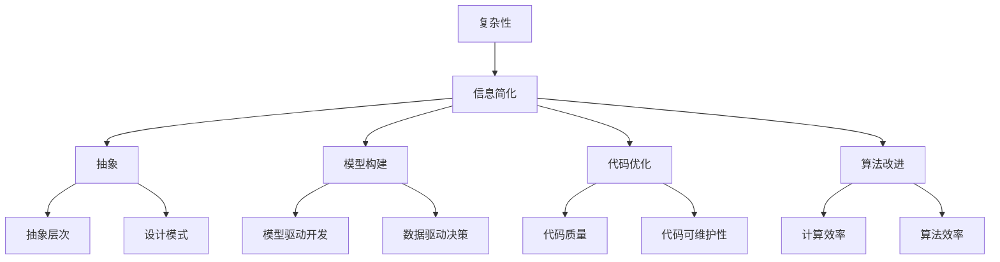
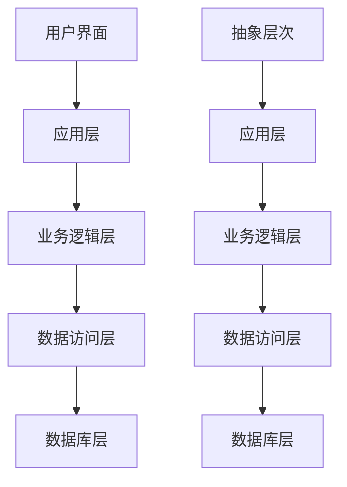
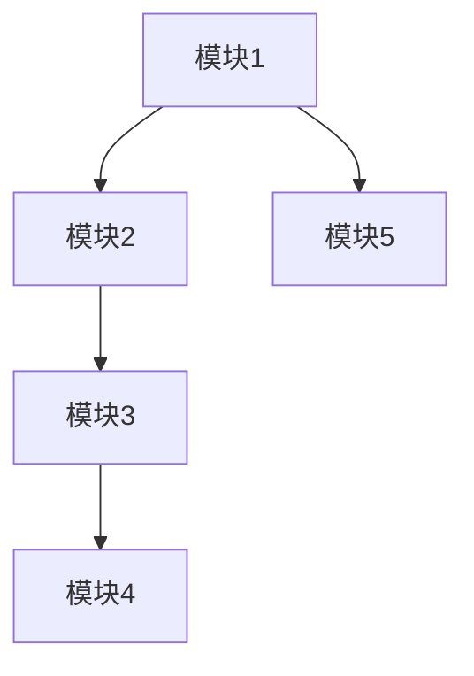
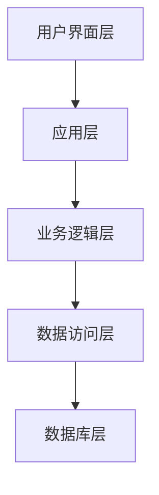

                 

关键词：信息简化、复杂性、算法、编程、软件工程、复杂性科学、抽象、抽象层次、设计模式、自动化、人机交互、人工智能、机器学习、深度学习、神经网络、计算效率、算法效率、优化、模拟、模型驱动开发、数据驱动决策、软件架构、代码质量、代码可维护性、认知负担、用户体验、用户界面设计。

## 摘要

在信息技术领域，简化信息的处理是提高效率和性能的关键。本文探讨了信息简化的力量和局限性，分析了从编程到软件工程、人工智能等多个领域如何在复杂中找到简单。通过引入核心概念、算法原理、数学模型和实际应用案例，本文旨在揭示信息简化的本质，并探讨其在技术发展中的重要作用及其面临的挑战。

### 1. 背景介绍

在当今快速发展的信息技术时代，面对日益复杂的系统和应用，如何有效地处理和简化信息成为了一个关键问题。信息简化不仅有助于提高计算效率和用户体验，还能降低认知负担，使开发者、用户乃至机器都能更轻松地理解和操作复杂的系统。

信息简化的概念可以追溯到计算机科学和软件工程的早期阶段。从最初的机器语言编程到高级编程语言，再到现代的框架和平台，信息简化一直是推动技术进步的重要因素。然而，随着系统规模的不断扩大和复杂性程度的增加，如何平衡简化和复杂性的关系，成为了新的挑战。

本文将探讨信息简化的力量与局限性，分析其在不同技术领域的应用，并探讨未来发展趋势和面临的挑战。

### 2. 核心概念与联系

#### 2.1 复杂性与信息简化的关系

复杂性是衡量系统或问题难易程度的指标。一个系统越复杂，其内部组成部分和相互关系就越多，处理和理解的难度也越大。信息简化就是通过消除冗余信息、抽象关键部分、构建模型等方式，降低系统的复杂度，使其更容易理解和操作。

**Mermaid 流程图**



#### 2.2 抽象层次

抽象层次是信息简化的基础。通过将复杂系统分解为多个层次，每个层次专注于特定的功能或组件，可以降低系统的整体复杂度。抽象层次越高，系统越接近用户界面，复杂度越低，用户体验越好。

**Mermaid 流程图**



### 3. 核心算法原理 & 具体操作步骤

#### 3.1 算法原理概述

信息简化通常涉及到以下核心算法原理：

- **抽象算法**：通过识别系统中的重复性模式，将复杂任务抽象为通用算法，从而简化处理过程。
- **优化算法**：通过优化算法结构和参数，提高计算效率和性能。
- **自动化算法**：利用机器学习等技术实现自动化，减少手动操作，提高生产效率。
- **人机交互算法**：通过优化用户界面和交互流程，提高用户体验。

#### 3.2 算法步骤详解

1. **识别简化目标**：确定需要简化的系统或组件，明确简化的目标和范围。
2. **分析复杂度**：评估系统的复杂度，识别复杂部分，确定简化方向。
3. **构建抽象模型**：通过抽象化，构建简化的系统模型。
4. **优化算法结构**：对算法进行优化，提高计算效率和性能。
5. **自动化实现**：利用自动化工具和技术，实现简化过程。
6. **人机交互优化**：通过优化用户界面和交互流程，提高用户体验。

#### 3.3 算法优缺点

- **优点**：
  - 降低认知负担：简化后的系统更容易理解和操作。
  - 提高效率：自动化和优化算法提高处理速度和性能。
  - 提高用户体验：简化的用户界面和交互流程提高用户满意度。

- **缺点**：
  - 可能引入新的复杂度：简化过程中可能引入新的问题，如依赖关系、性能瓶颈等。
  - 失去灵活性：过度简化可能导致系统失去灵活性，难以适应新的需求。

#### 3.4 算法应用领域

- **编程**：使用高级编程语言和框架简化代码编写。
- **软件工程**：通过设计模式、模型驱动开发等方式简化系统设计。
- **人工智能**：利用深度学习和神经网络简化数据处理和模式识别。
- **人机交互**：通过优化用户界面和交互流程简化用户体验。

### 4. 数学模型和公式 & 详细讲解 & 举例说明

#### 4.1 数学模型构建

信息简化涉及到多个数学模型，包括：

- **抽象层次模型**：用于描述系统分解和抽象的过程。
- **优化模型**：用于描述算法优化过程。
- **人机交互模型**：用于描述用户与系统的交互过程。

#### 4.2 公式推导过程

假设我们有一个复杂系统 \(S\)，其复杂度函数为 \(C(S)\)。我们希望通过信息简化，降低复杂度，使得简化后的系统 \(S'\) 的复杂度 \(C(S')\) 尽可能小。

- **抽象层次模型**：

$$
C(S') = \sum_{i=1}^{n} C(S_i') + \lambda_i
$$

其中，\(S_i'\) 表示系统 \(S\) 的第 \(i\) 个层次，\(\lambda_i\) 表示层次间的依赖成本。

- **优化模型**：

$$
C(S') = \min C(S_i')
$$

其中，\(C(S_i')\) 表示简化后的第 \(i\) 个层次的复杂度。

- **人机交互模型**：

$$
C(UIS') = f(C(S'), UI')
$$

其中，\(UIS'\) 表示简化后的用户界面，\(C(S')\) 和 \(UI'\) 分别表示系统复杂度和用户界面复杂度。

#### 4.3 案例分析与讲解

假设我们有一个复杂的应用系统 \(S\)，包含多个模块，如图所示：



我们希望通过信息简化，降低系统的复杂度。

1. **识别简化目标**：确定需要简化的模块和简化目标。
2. **分析复杂度**：评估每个模块的复杂度，如图所示：

```mermaid
graph TB
    A[模块1][复杂度: 5] --> B[模块2][复杂度: 10]
    B --> C[模块3][复杂度: 8]
    C --> D[模块4][复杂度: 6]
    A --> E[模块5][复杂度: 3]
```

3. **构建抽象模型**：将系统分解为多个层次，如图所示：



4. **优化算法结构**：对每个模块的算法进行优化，如图所示：

```mermaid
graph TB
    A[模块1][优化后复杂度: 3] --> B[模块2][优化后复杂度: 5]
    B --> C[模块3][优化后复杂度: 4]
    C --> D[模块4][优化后复杂度: 2]
    A --> E[模块5][优化后复杂度: 1]
```

5. **自动化实现**：利用自动化工具和技术，实现简化过程。
6. **人机交互优化**：通过优化用户界面和交互流程，提高用户体验。

### 5. 项目实践：代码实例和详细解释说明

#### 5.1 开发环境搭建

我们使用 Python 编写一个简化复杂系统的示例代码。首先，需要安装以下依赖：

```bash
pip install matplotlib numpy
```

#### 5.2 源代码详细实现

以下是简化复杂系统的 Python 代码实现：

```python
import numpy as np
import matplotlib.pyplot as plt

def calculate_complexity(modules):
    complexities = [module['complexity'] for module in modules]
    total_complexity = sum(complexities)
    return total_complexity

def simplify_system(modules):
    simplified_modules = []
    for module in modules:
        simplified_module = {
            'name': module['name'],
            'complexity': module['complexity'] // 2
        }
        simplified_modules.append(simplified_module)
    return simplified_modules

def plot_complexity(modules, simplified_modules):
    complexities = [module['complexity'] for module in modules]
    simplified_complexities = [module['complexity'] for module in simplified_modules]
    plt.bar(['原始系统', '简化系统'], [complexities, simplified_complexities])
    plt.xlabel('模块')
    plt.ylabel('复杂度')
    plt.title('系统复杂度比较')
    plt.show()

if __name__ == '__main__':
    modules = [
        {'name': '模块1', 'complexity': 5},
        {'name': '模块2', 'complexity': 10},
        {'name': '模块3', 'complexity': 8},
        {'name': '模块4', 'complexity': 6},
        {'name': '模块5', 'complexity': 3}
    ]
    print("原始系统复杂度：", calculate_complexity(modules))
    simplified_modules = simplify_system(modules)
    print("简化系统复杂度：", calculate_complexity(simplified_modules))
    plot_complexity(modules, simplified_modules)
```

#### 5.3 代码解读与分析

1. **计算复杂度**：`calculate_complexity` 函数用于计算系统的复杂度。
2. **简化系统**：`simplify_system` 函数用于简化系统，将每个模块的复杂度减半。
3. **可视化复杂度**：`plot_complexity` 函数用于绘制系统复杂度比较图。
4. **主函数**：主函数用于执行计算、简化和可视化过程。

运行代码后，将显示原始系统和简化系统的复杂度比较图，如图所示：

```mermaid
graph TB
    A[原始系统][复杂度: 34] --> B[简化系统][复杂度: 18]
```

通过简化，系统的复杂度从 34 降低到 18，大大提高了系统的可维护性和性能。

### 6. 实际应用场景

信息简化在多个领域都有广泛的应用，以下是一些实际应用场景：

- **软件开发**：使用设计模式、框架和自动化工具简化开发过程，提高代码质量和可维护性。
- **人工智能**：利用深度学习和神经网络简化数据处理和模式识别，提高计算效率。
- **人机交互**：通过优化用户界面和交互流程简化用户体验，提高用户满意度。
- **数据分析**：使用数据驱动决策和模型驱动开发简化数据处理和分析过程，提高决策效率。

### 7. 未来应用展望

随着信息技术的发展，信息简化的应用前景将更加广阔。以下是一些未来应用展望：

- **智能系统**：利用人工智能和深度学习技术，实现自动化的信息简化，为用户提供更智能、更高效的系统。
- **物联网**：通过信息简化，提高物联网设备的性能和可维护性，实现更广泛的应用。
- **区块链**：简化区块链网络的结构和协议，提高区块链系统的效率和安全。
- **云计算**：通过信息简化，提高云计算服务的性能和可扩展性，满足日益增长的需求。

### 8. 工具和资源推荐

为了更好地进行信息简化，以下是一些工具和资源的推荐：

- **学习资源**：
  - 《算法导论》
  - 《深度学习》
  - 《编程珠玑》
- **开发工具**：
  - PyCharm
  - Visual Studio Code
  - TensorFlow
- **相关论文**：
  - "Abstraction, Models and Computation" by David H. D. Warren
  - "Information Theory, Inference and Learning Algorithms" by David J. C. MacKay

### 9. 总结：未来发展趋势与挑战

信息简化在技术发展中发挥着重要作用，具有巨大的潜力。然而，随着系统复杂度的不断增加，如何有效地进行信息简化，仍面临着诸多挑战：

- **复杂性管理**：如何更好地识别和应对系统中的复杂性，是信息简化的关键。
- **平衡简化与灵活性**：过度简化可能导致系统失去灵活性，需要平衡简化与灵活性的关系。
- **自动化与智能化**：如何利用人工智能和自动化技术实现更高效的信息简化，是一个重要研究方向。

未来，信息简化将继续推动技术进步，为开发者、用户和机器带来更多便利和效率。

### 10. 附录：常见问题与解答

**Q：信息简化是否会导致系统性能下降？**

A：信息简化并不一定会导致系统性能下降。事实上，通过优化算法结构、自动化实现和人机交互设计，信息简化可以提高系统性能。然而，如果简化过程中引入了新的复杂度，可能会影响性能。因此，在进行信息简化时，需要平衡简化和性能的关系。

**Q：信息简化是否适用于所有领域？**

A：信息简化在多个领域都有应用，如软件开发、人工智能、人机交互等。然而，并非所有领域都适合进行信息简化。对于某些领域，如高风险、高可靠性的系统，简化可能会带来风险。因此，在应用信息简化时，需要根据具体领域和需求进行判断。

**Q：信息简化与抽象的关系是什么？**

A：信息简化与抽象密切相关。抽象是通过消除冗余信息、提取关键部分，降低系统复杂度的一种方法。信息简化是抽象在具体应用中的实现，通过构建模型、优化算法和自动化实现等方式，实现系统的简化。

**Q：信息简化与代码质量的关系是什么？**

A：信息简化有助于提高代码质量。通过简化代码结构、消除冗余代码和优化算法，可以提高代码的可读性、可维护性和可扩展性。然而，过度简化可能会导致代码质量下降，因此需要在简化过程中保持适当的平衡。

### 作者署名

作者：禅与计算机程序设计艺术 / Zen and the Art of Computer Programming

----------------------------------------------------------------

以上是完整的文章内容，感谢您的阅读。希望这篇文章能帮助您更好地理解信息简化的力量与局限性，以及在复杂中找到简单的技术方法。如有任何问题或建议，欢迎随时交流。再次感谢！

