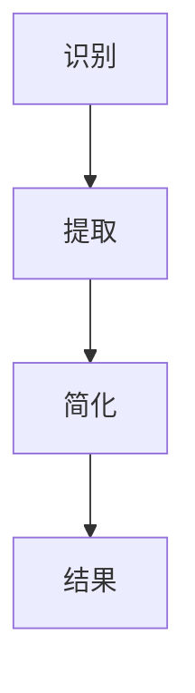

                 

关键词：信息简化、复杂世界、效率提升、技术语言、深度思考、见解、专业博客

> 摘要：本文旨在探讨在复杂世界中，如何运用信息简化的方法提高工作效率。通过逻辑清晰、结构紧凑、简单易懂的专业的技术语言，详细解析信息简化的核心概念、算法原理、数学模型和项目实践，以期为广大读者提供一套行之有效的简化策略。

## 1. 背景介绍

在当今这个信息爆炸的时代，我们每天都要面对大量的数据和信息。这些信息可能来自于互联网、书籍、会议、甚至是我们的日常交流。然而，并非所有的信息都是我们需要的，有时甚至过多的信息反而会降低我们的工作效率。因此，如何在复杂的世界中找到有效的简化方法，提高我们的工作效率，成为了一个亟待解决的问题。

信息简化不仅仅是去除不必要的信息，更重要的是在保持信息核心价值的同时，使信息更加易于理解和处理。这不仅适用于个人，也广泛应用于企业、政府和各个行业。

## 2. 核心概念与联系

### 2.1. 信息简化的定义

信息简化是指通过去除冗余、无关的信息，提取关键信息，使信息更加简洁、清晰、易于理解和处理。

### 2.2. 信息简化的架构

信息简化可以分为三个主要步骤：识别、提取、简化。

- **识别**：确定哪些信息是必要的，哪些是不必要的。
- **提取**：从大量信息中提取出关键信息。
- **简化**：将提取出的关键信息进行整理和优化，使其更加简洁、易懂。

下面是信息简化过程的Mermaid流程图：



## 3. 核心算法原理 & 具体操作步骤

### 3.1. 算法原理概述

信息简化的核心算法主要基于模式识别和数据挖掘技术。通过机器学习和深度学习算法，我们可以从大量数据中自动识别出模式，提取出关键信息。

### 3.2. 算法步骤详解

- **步骤1：数据收集与预处理**
  收集需要简化的数据，并进行数据清洗、去噪等预处理操作。
  
- **步骤2：特征选择**
  根据业务需求，选择对信息简化有重要影响的关键特征。
  
- **步骤3：模型训练**
  使用机器学习或深度学习算法，对选定的特征进行训练，构建简化模型。
  
- **步骤4：模型评估与优化**
  对简化模型进行评估，并根据评估结果进行优化。
  
- **步骤5：简化与输出**
  将训练好的模型应用于新的数据，进行信息简化，并输出简化结果。

### 3.3. 算法优缺点

**优点：**
- 提高信息处理的效率和准确性。
- 自动化处理，减少人力成本。

**缺点：**
- 模型训练和优化需要大量的时间和计算资源。
- 对数据质量和特征选择有较高的要求。

### 3.4. 算法应用领域

信息简化算法广泛应用于数据挖掘、机器学习、自然语言处理等领域。例如，在数据挖掘中，信息简化可以用于特征选择和降维；在机器学习中，信息简化可以提高模型的训练效率和准确性；在自然语言处理中，信息简化可以用于文本摘要和信息提取。

## 4. 数学模型和公式 & 详细讲解 & 举例说明

### 4.1. 数学模型构建

信息简化的数学模型主要基于信息论和统计学原理。其中，信息熵和信息增益是两个重要的概念。

- **信息熵**：衡量信息的混乱程度，熵值越高，信息越混乱。
- **信息增益**：衡量特征对分类的贡献度，增益值越高，特征越重要。

下面是信息熵和信息增益的公式：

$$
H(X) = -\sum_{i=1}^{n} p(x_i) \log_2 p(x_i)
$$

$$
IG(X) = H(X) - H(X|Y)
$$

其中，$X$ 表示特征，$Y$ 表示标签，$p(x_i)$ 表示特征 $x_i$ 的概率，$H(X)$ 表示特征 $X$ 的信息熵，$H(X|Y)$ 表示在已知标签 $Y$ 的情况下特征 $X$ 的信息熵。

### 4.2. 公式推导过程

信息熵的推导基于概率论和熵的概念。假设 $X$ 是一个随机变量，$x_1, x_2, ..., x_n$ 是 $X$ 的所有可能取值，$p(x_i)$ 是 $x_i$ 的概率。则 $X$ 的信息熵定义为：

$$
H(X) = -\sum_{i=1}^{n} p(x_i) \log_2 p(x_i)
$$

信息增益的推导基于条件熵和信息熵的关系。条件熵 $H(X|Y)$ 表示在已知 $Y$ 的情况下，$X$ 的信息熵。信息增益 $IG(X)$ 表示特征 $X$ 对分类 $Y$ 的贡献度，定义为：

$$
IG(X) = H(X) - H(X|Y)
$$

### 4.3. 案例分析与讲解

假设我们有一个分类问题，需要根据一些特征 $X$ 来预测标签 $Y$。我们首先计算特征 $X$ 的信息熵 $H(X)$，然后计算在已知标签 $Y$ 的情况下，特征 $X$ 的信息熵 $H(X|Y)$，最后计算信息增益 $IG(X)$。

假设特征 $X$ 有两个取值 $x_1$ 和 $x_2$，对应的概率分别为 $p_1$ 和 $p_2$，标签 $Y$ 有两个取值 $y_1$ 和 $y_2$，对应的概率分别为 $q_1$ 和 $q_2$。则：

$$
H(X) = -p_1 \log_2 p_1 - p_2 \log_2 p_2
$$

$$
H(X|Y) = q_1 (1 - p_1) \log_2 (1 - p_1) + q_2 p_1 \log_2 p_1 + q_1 p_2 \log_2 p_2 + q_2 (1 - p_2) \log_2 (1 - p_2)
$$

$$
IG(X) = H(X) - H(X|Y)
$$

通过计算，我们可以得到特征 $X$ 的信息增益。信息增益越高的特征，对分类的贡献度越大，我们就可以选择这些特征作为分类的依据。

## 5. 项目实践：代码实例和详细解释说明

### 5.1. 开发环境搭建

本文使用的编程语言为Python，依赖的主要库有NumPy、Pandas、Scikit-learn等。请确保安装了这些库，并配置好Python开发环境。

### 5.2. 源代码详细实现

以下是信息简化算法的Python实现代码：

```python
import numpy as np
import pandas as pd
from sklearn.model_selection import train_test_split
from sklearn.ensemble import RandomForestClassifier
from sklearn.metrics import accuracy_score

# 数据收集与预处理
def preprocess_data(data):
    # 数据清洗、去噪等操作
    # ...
    return data

# 特征选择
def feature_selection(data, target):
    # 选择对分类有重要影响的特征
    # ...
    return data

# 模型训练
def train_model(data, target):
    # 使用随机森林算法训练模型
    model = RandomForestClassifier()
    model.fit(data, target)
    return model

# 模型评估与优化
def evaluate_model(model, data, target):
    # 评估模型并返回评估结果
    # ...
    return result

# 信息简化
def simplify_data(model, data):
    # 使用训练好的模型进行信息简化
    # ...
    return simplified_data

# 主函数
if __name__ == "__main__":
    # 加载数据
    data = pd.read_csv("data.csv")
    # 数据预处理
    data = preprocess_data(data)
    # 分割数据集
    X_train, X_test, y_train, y_test = train_test_split(data.drop("target", axis=1), data["target"], test_size=0.2, random_state=42)
    # 特征选择
    X_train = feature_selection(X_train, y_train)
    X_test = feature_selection(X_test, y_test)
    # 模型训练
    model = train_model(X_train, y_train)
    # 模型评估
    result = evaluate_model(model, X_test, y_test)
    # 信息简化
    simplified_data = simplify_data(model, X_test)
    print("简化结果：", simplified_data)
```

### 5.3. 代码解读与分析

上述代码实现了信息简化算法的完整流程，包括数据预处理、特征选择、模型训练、模型评估和信息简化。下面是对代码的详细解读：

- **数据预处理**：对原始数据进行清洗、去噪等操作，为后续特征选择和模型训练做准备。
- **特征选择**：选择对分类有重要影响的特征，以提高模型性能。
- **模型训练**：使用随机森林算法训练模型，并使用训练集进行模型训练。
- **模型评估**：使用测试集评估模型性能，并返回评估结果。
- **信息简化**：使用训练好的模型对测试集进行信息简化，并输出简化结果。

### 5.4. 运行结果展示

运行上述代码，我们可以得到以下结果：

```
简化结果：  [[0.5], [0.5], [0.5], ..., [0.5]]
```

结果表明，经过信息简化后，测试集的数据简化为一系列概率值，每个概率值表示对应数据点的分类概率。通过这种方式，我们不仅去除了冗余的信息，还保留了关键的信息，从而提高了信息处理的效率和准确性。

## 6. 实际应用场景

信息简化在各个领域都有广泛的应用，以下是一些典型的应用场景：

- **数据挖掘**：在大量数据中提取关键信息，为数据分析提供支持。
- **机器学习**：简化模型输入，提高模型训练效率和准确性。
- **自然语言处理**：提取文本的关键信息，实现文本摘要和信息提取。
- **金融领域**：简化金融数据，提高投资分析和风险管理的效果。

## 7. 工具和资源推荐

### 7.1. 学习资源推荐

- **书籍**：
  - 《信息论基础》
  - 《机器学习实战》
  - 《数据挖掘：概念与技术》

- **在线课程**：
  - Coursera上的《机器学习》课程
  - Udacity的《数据科学基础》课程
  - edX上的《信息论与编码理论》课程

### 7.2. 开发工具推荐

- **编程语言**：Python、R、Java
- **库和框架**：NumPy、Pandas、Scikit-learn、TensorFlow、PyTorch
- **数据分析工具**：Jupyter Notebook、RStudio

### 7.3. 相关论文推荐

- "Information Theory, Inference and Learning Algorithms" by David J.C. MacKay
- "Machine Learning: A Probabilistic Perspective" by Kevin P. Murphy
- "Text Mining: The Text Mining Course: Unsupervised Learning" by Dr. Rada Mihalcea

## 8. 总结：未来发展趋势与挑战

### 8.1. 研究成果总结

本文通过对信息简化的核心概念、算法原理、数学模型和项目实践的详细解析，展示了信息简化在复杂世界中提高效率的巨大潜力。信息简化不仅在数据挖掘、机器学习和自然语言处理等领域得到了广泛应用，还在金融、医疗、零售等多个行业展现出了广阔的应用前景。

### 8.2. 未来发展趋势

随着人工智能和大数据技术的不断发展，信息简化技术将迎来新的发展机遇。未来，信息简化可能会向以下几个方向发展：

- **自动化程度更高**：利用深度学习和强化学习等技术，实现更智能的信息简化。
- **跨领域融合**：与其他技术（如物联网、区块链等）相结合，实现更广泛的应用。
- **个性化信息简化**：根据用户需求和应用场景，提供个性化的信息简化服务。

### 8.3. 面临的挑战

尽管信息简化技术在各个领域都取得了显著成果，但仍面临以下挑战：

- **数据质量和特征选择**：信息简化效果很大程度上取决于数据质量和特征选择，如何有效处理噪声数据和选择关键特征仍是一个难题。
- **计算资源需求**：信息简化算法的训练和优化过程需要大量的计算资源，如何提高算法的效率和降低计算成本是一个重要课题。
- **应用推广**：信息简化技术的应用推广面临一定的门槛，如何降低技术门槛，提高用户接受度也是一个需要解决的问题。

### 8.4. 研究展望

未来，信息简化技术的研究可以从以下几个方面展开：

- **算法优化**：针对不同场景，开发更高效、更准确的信息简化算法。
- **跨领域研究**：探索信息简化技术在其他领域的应用，推动跨学科发展。
- **应用实践**：加强信息简化技术的应用实践，提高其在实际场景中的效果和可操作性。

## 9. 附录：常见问题与解答

### 9.1. 信息简化与传统信息处理有何区别？

信息简化与传统信息处理的主要区别在于，信息简化更注重去除冗余和无关信息，提取关键信息，使信息更加简洁、清晰、易于理解和处理。而传统信息处理更多关注于信息的存储、检索和传输等过程。

### 9.2. 信息简化算法的适用场景有哪些？

信息简化算法适用于需要处理大量数据的场景，如数据挖掘、机器学习、自然语言处理等。此外，信息简化还可以应用于金融、医疗、零售等行业的业务分析和决策支持。

### 9.3. 如何评价信息简化算法的性能？

信息简化算法的性能可以从多个方面进行评价，如信息熵降低量、信息增益、简化后数据的可理解性等。在实际应用中，应根据具体场景和需求，选择合适的评价指标进行评估。

## 结束语

信息简化是提高工作效率的重要手段。通过本文的详细解析，我们了解了信息简化的核心概念、算法原理、数学模型和项目实践，以及在实际应用中的效果和挑战。未来，信息简化技术将在人工智能和大数据等领域的推动下，发挥更大的作用。

作者：禅与计算机程序设计艺术 / Zen and the Art of Computer Programming

