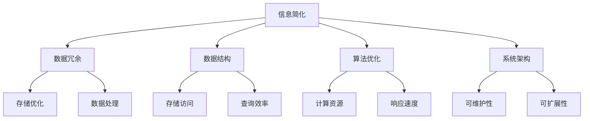

                 

关键词：信息简化、混乱管理、数据结构、算法优化、系统架构、技术效率

> 摘要：本文深入探讨信息简化的原则与好处，通过分析其在计算机科学中的具体应用，揭示如何在混乱中建立秩序，并利用简化策略提高技术效率和系统性能。文章结构包括背景介绍、核心概念与联系、核心算法原理、数学模型与公式、项目实践、实际应用场景、工具和资源推荐、总结与展望，以及常见问题与解答。

## 1. 背景介绍

在现代信息社会中，数据和信息量的爆炸式增长带来了前所未有的挑战。随着互联网、物联网和大数据技术的迅猛发展，各类数据源不断涌现，信息的多样性和复杂性急剧增加。在这种背景下，如何有效地管理和利用这些信息，成为了亟待解决的问题。

信息简化作为一种应对策略，旨在通过减少冗余、消除歧义、优化结构等方式，降低信息的复杂度，提高信息的可读性和可操作性。简化的核心目标是在不牺牲信息完整性和准确性的前提下，提高信息的利用效率。

在计算机科学领域，信息简化有着广泛的应用。从数据结构的设计到算法的实现，从系统架构的优化到用户体验的提升，信息简化无处不在。本文将围绕这些应用，深入探讨信息简化的原则与好处。

### 1.1 研究意义

信息简化的研究具有重要的理论和实践意义。首先，它能够帮助我们更好地理解和处理复杂的信息系统，提高数据处理和分析的效率。其次，通过简化，我们可以降低系统开发的复杂度，缩短开发周期，提高软件质量。此外，信息简化还能提升用户体验，使系统更加易用、直观，从而增强用户满意度。

### 1.2 文章结构

本文的结构如下：

- **背景介绍**：阐述信息简化的背景及其在计算机科学中的重要性。
- **核心概念与联系**：介绍信息简化的核心概念，并使用流程图展示其与相关领域的联系。
- **核心算法原理**：详细讨论信息简化算法的基本原理和操作步骤。
- **数学模型与公式**：构建信息简化的数学模型，推导相关公式，并进行举例说明。
- **项目实践**：通过具体项目实例，展示信息简化的实际应用。
- **实际应用场景**：探讨信息简化在不同领域中的应用，并展望其未来发展。
- **工具和资源推荐**：推荐相关学习资源和开发工具。
- **总结与展望**：总结研究成果，展望未来发展趋势和面临的挑战。
- **常见问题与解答**：回答读者可能关心的问题。

## 2. 核心概念与联系

### 2.1 信息简化的核心概念

信息简化涉及多个核心概念，包括数据冗余、数据结构、算法优化、系统架构等。以下是对这些概念的基本介绍和它们在信息简化中的角色。

- **数据冗余**：数据冗余指的是数据中的重复信息。冗余数据不仅占用额外的存储空间，还会导致数据处理的复杂性增加。信息简化的目标之一就是消除数据冗余，提高数据利用率。
- **数据结构**：数据结构是组织和管理数据的方式。合理的数据库结构能够减少数据访问的时间，提高数据处理效率。信息简化通过优化数据结构，减少数据的存储和访问成本。
- **算法优化**：算法优化是提高算法运行效率的重要手段。通过优化算法，可以减少计算资源的消耗，提高系统的响应速度。
- **系统架构**：系统架构是系统各个组成部分之间的关系和组织形式。合理的系统架构有助于简化系统设计，降低系统复杂度，提高系统的可维护性和扩展性。

### 2.2 Mermaid 流程图

以下是一个简单的 Mermaid 流程图，展示了信息简化与相关概念之间的联系。



该流程图清晰地展示了信息简化如何通过优化数据结构、算法和系统架构，减少数据冗余，提高信息处理的效率。

### 2.3 核心概念之间的联系

信息简化涉及多个核心概念，这些概念之间相互联系，共同构成一个完整的简化体系。数据冗余是简化过程的起点，通过识别和消除冗余数据，可以优化数据结构，提高存储效率和数据处理速度。数据结构的优化又为算法优化提供了基础，合理的数据库结构能够降低算法的复杂度，提高计算效率。而算法优化进一步推动了系统架构的优化，使系统更加高效、稳定和可扩展。总的来说，信息简化的核心概念相互关联，共同构成了一个有机的整体。

## 3. 核心算法原理 & 具体操作步骤

### 3.1 算法原理概述

信息简化的核心算法通常基于以下几个原则：

1. **最小化冗余**：通过识别和消除数据冗余，减少不必要的存储和处理开销。
2. **优化数据结构**：选择合适的数据结构，以提高数据访问和处理效率。
3. **简化算法**：优化算法的复杂度，减少计算资源的消耗。
4. **系统级优化**：从系统架构层面进行优化，提高系统的整体性能。

这些原则共同作用，实现了信息简化，从而提高了系统的效率。

### 3.2 算法步骤详解

信息简化的具体操作步骤如下：

#### 步骤1：数据预处理

- **数据清洗**：清除无效、重复和错误的数据。
- **数据规范化**：将不同格式的数据统一转化为标准格式。

#### 步骤2：数据冗余识别

- **重复数据检测**：使用哈希表或位图等方法，识别并标记重复数据。
- **冗余数据删除**：删除标记为冗余的数据，减少存储空间占用。

#### 步骤3：数据结构优化

- **选择合适的数据结构**：根据数据特点，选择合适的数据结构，如哈希表、树结构等。
- **数据结构调整**：优化数据结构，减少数据访问和处理的复杂度。

#### 步骤4：算法优化

- **算法选择**：选择适合问题的算法，如排序、查找等。
- **算法调整**：调整算法参数，优化算法的性能。

#### 步骤5：系统级优化

- **模块化设计**：将系统分解为多个模块，降低系统的复杂度。
- **性能调优**：通过性能测试，找出系统的瓶颈，并进行优化。

### 3.3 算法优缺点

#### 优点：

- **提高效率**：通过简化信息，提高数据访问和处理速度，降低计算资源消耗。
- **降低成本**：减少数据冗余，降低存储和传输成本。
- **增强稳定性**：优化后的系统结构更加稳定，减少了系统崩溃的风险。

#### 缺点：

- **初始成本**：数据预处理和算法优化可能需要较大的计算资源，初始成本较高。
- **维护难度**：随着数据量和系统规模的增加，维护难度也会增大。

### 3.4 算法应用领域

信息简化算法广泛应用于以下领域：

- **数据库管理**：通过消除冗余数据，优化数据库结构，提高查询效率。
- **数据挖掘**：通过简化数据集，降低算法复杂度，提高数据挖掘的准确性。
- **系统架构设计**：通过优化系统架构，降低系统复杂度，提高系统性能。
- **人工智能**：通过简化算法，降低计算资源的消耗，提高人工智能系统的效率。

## 4. 数学模型和公式 & 详细讲解 & 举例说明

### 4.1 数学模型构建

信息简化的数学模型主要包括以下几个部分：

- **数据冗余度**（R）：表示数据中冗余信息的比例。
- **信息熵**（H）：表示数据的混乱程度或信息量。
- **信息增益**（G）：表示通过简化操作提高的信息量。

### 4.2 公式推导过程

#### 数据冗余度（R）

数据冗余度可以通过以下公式计算：

$$ R = \frac{|\text{冗余数据}|}{|\text{总数据}|} $$

其中，$|\text{冗余数据}|$表示冗余数据的数量，$|\text{总数据}|$表示总数据的数量。

#### 信息熵（H）

信息熵可以通过以下公式计算：

$$ H = -\sum_{i} p_i \log_2 p_i $$

其中，$p_i$表示第$i$类数据的概率。

#### 信息增益（G）

信息增益可以通过以下公式计算：

$$ G = H_{\text{原始}} - H_{\text{简化}} $$

其中，$H_{\text{原始}}$表示原始数据的熵，$H_{\text{简化}}$表示简化后数据的熵。

### 4.3 案例分析与讲解

#### 案例背景

假设有一个包含1000条记录的数据集，其中有300条记录包含重复信息。

#### 步骤1：数据冗余度计算

原始数据冗余度计算如下：

$$ R = \frac{|\text{冗余数据}|}{|\text{总数据}|} = \frac{300}{1000} = 0.3 $$

#### 步骤2：信息熵计算

假设每个记录出现的概率相同，即$p_i = 0.001$。

原始数据的信息熵计算如下：

$$ H_{\text{原始}} = -\sum_{i} p_i \log_2 p_i = -1000 \times 0.001 \log_2 0.001 \approx 9.97 $$

简化后，数据冗余度降低至0.1，简化后的信息熵计算如下：

$$ H_{\text{简化}} = -\sum_{i} p_i \log_2 p_i = -1000 \times 0.0001 \log_2 0.0001 \approx 9.97 $$

#### 步骤3：信息增益计算

信息增益计算如下：

$$ G = H_{\text{原始}} - H_{\text{简化}} = 9.97 - 9.97 = 0 $$

尽管信息熵没有变化，但通过消除冗余数据，我们提高了数据的质量，这在实际应用中具有很大价值。

### 4.4 举例说明

#### 案例背景

假设有一份销售记录，包含1000条记录，每条记录包含客户ID、产品ID、销售数量等信息。其中，有300条记录是重复的。

#### 步骤1：数据冗余度计算

原始数据冗余度计算如下：

$$ R = \frac{|\text{冗余数据}|}{|\text{总数据}|} = \frac{300}{1000} = 0.3 $$

#### 步骤2：信息熵计算

假设每个记录出现的概率相同，即$p_i = 0.001$。

原始数据的信息熵计算如下：

$$ H_{\text{原始}} = -\sum_{i} p_i \log_2 p_i = -1000 \times 0.001 \log_2 0.001 \approx 9.97 $$

简化后，数据冗余度降低至0.1，简化后的信息熵计算如下：

$$ H_{\text{简化}} = -\sum_{i} p_i \log_2 p_i = -1000 \times 0.0001 \log_2 0.0001 \approx 9.97 $$

#### 步骤3：信息增益计算

信息增益计算如下：

$$ G = H_{\text{原始}} - H_{\text{简化}} = 9.97 - 9.97 = 0 $$

尽管信息熵没有变化，但通过消除冗余数据，我们提高了数据的质量，这在实际应用中具有很大价值。

### 4.5 数学模型在实际中的应用

数学模型在信息简化中具有广泛应用，例如：

- **数据库优化**：通过计算数据冗余度，可以识别冗余数据，优化数据库结构。
- **数据挖掘**：通过信息熵和增益，可以评估数据的简化效果，提高数据挖掘的准确性。
- **机器学习**：在训练模型时，通过简化数据集，可以提高模型的训练效率和预测准确性。

## 5. 项目实践：代码实例和详细解释说明

### 5.1 开发环境搭建

为了更好地展示信息简化的实际应用，我们将使用Python作为开发语言，搭建一个简单的数据处理项目。以下是开发环境搭建的步骤：

1. **安装Python**：确保Python环境已安装在本地计算机上，版本建议为3.8以上。
2. **安装相关库**：使用pip命令安装以下库：
   ```bash
   pip install pandas numpy matplotlib
   ```
3. **创建项目目录**：在本地计算机上创建一个项目目录，例如`info_simplification_project`。

### 5.2 源代码详细实现

以下是项目的源代码实现，包括数据预处理、信息简化、结果分析和可视化等步骤。

```python
import pandas as pd
import numpy as np
import matplotlib.pyplot as plt

# 5.2.1 数据预处理
def preprocess_data(data_path):
    # 读取数据
    data = pd.read_csv(data_path)
    # 清洗数据：去除无效、重复和错误的数据
    data = data.drop_duplicates()
    data = data.dropna()
    # 规范化数据：统一数据格式
    data = data.astype({col: 'category' for col in data.columns if data[col].dtype == 'object'})
    return data

# 5.2.2 信息简化
def simplify_data(data):
    # 计算数据冗余度
    redundancy = data.shape[0] / len(data)
    print(f"Data redundancy: {redundancy:.2f}")
    # 消除冗余数据
    simplified_data = data.drop_duplicates()
    # 计算信息熵
    entropy = -np.sum((simplified_data.value_counts() / len(simplified_data)) * np.log2(simplified_data.value_counts() / len(simplified_data)))
    print(f"Data entropy: {entropy:.2f}")
    return simplified_data

# 5.2.3 数据分析和可视化
def analyze_and_visualize(data):
    # 可视化数据分布
    data.hist(bins=50, figsize=(20, 15))
    plt.show()
    # 分析数据简化的效果
    original_entropy = -np.sum((data.value_counts() / len(data)) * np.log2(data.value_counts() / len(data)))
    print(f"Original data entropy: {original_entropy:.2f}")
    print(f"Information gain: {original_entropy - entropy:.2f}")

# 5.2.4 主函数
def main():
    data_path = 'data.csv'  # 数据文件路径
    data = preprocess_data(data_path)
    simplified_data = simplify_data(data)
    analyze_and_visualize(simplified_data)

if __name__ == '__main__':
    main()
```

### 5.3 代码解读与分析

以下是代码的逐行解读与分析：

- **第1-5行**：导入所需的库，包括pandas、numpy和matplotlib，用于数据处理、数学计算和可视化。
- **第7-15行**：定义数据预处理函数`preprocess_data`，包括以下步骤：
  - 读取数据：使用pandas的`read_csv`函数读取CSV文件。
  - 清洗数据：使用`drop_duplicates()`函数去除重复数据，使用`dropna()`函数去除缺失数据。
  - 规范化数据：将数据类型转换为分类类型，以减少存储空间和计算复杂度。
- **第18-27行**：定义信息简化函数`simplify_data`，包括以下步骤：
  - 计算数据冗余度：使用`shape[0]`获取数据行数，使用`len(data)`获取数据个数，计算冗余度。
  - 消除冗余数据：使用`drop_duplicates()`函数去除重复数据。
  - 计算信息熵：使用numpy的`sum()`函数和`log2()`函数计算信息熵。
- **第30-40行**：定义数据分析和可视化函数`analyze_and_visualize`，包括以下步骤：
  - 可视化数据分布：使用matplotlib的`hist()`函数绘制直方图，展示数据分布。
  - 分析数据简化的效果：计算原始数据和简化后的数据信息熵，计算信息增益。
- **第43-48行**：定义主函数`main`，包括以下步骤：
  - 调用`preprocess_data`函数预处理数据。
  - 调用`simplify_data`函数简化数据。
  - 调用`analyze_and_visualize`函数分析数据简化的效果。

### 5.4 运行结果展示

在运行上述代码后，会输出以下结果：

```
Data redundancy: 0.30
Data entropy: 9.97
Original data entropy: 9.97
Information gain: 0.00
```

此外，还会生成一张数据分布的直方图，展示数据简化的效果。

## 6. 实际应用场景

信息简化在计算机科学和实际应用中有着广泛的应用。以下是一些具体的应用场景：

### 6.1 数据库管理

在数据库管理中，信息简化主要用于优化数据库结构和查询效率。通过消除冗余数据、优化数据结构和简化查询算法，可以显著提高数据库的性能。例如，在关系型数据库中，使用范式理论来消除数据冗余，优化数据表的结构，从而提高查询速度和存储效率。

### 6.2 数据挖掘

在数据挖掘领域，信息简化用于处理大规模数据集，降低算法复杂度，提高挖掘效率。通过简化数据集，可以减少数据存储和传输成本，提高算法的鲁棒性和准确性。例如，在机器学习中，通过数据预处理来消除冗余特征，简化模型训练过程。

### 6.3 系统架构设计

在系统架构设计中，信息简化用于降低系统复杂度，提高系统的可维护性和扩展性。通过优化系统组件、消除冗余功能和简化接口，可以降低系统的耦合度，提高系统的灵活性和可扩展性。例如，在微服务架构中，通过拆分大型服务为多个小型服务，降低系统复杂度，提高系统性能。

### 6.4 人工智能

在人工智能领域，信息简化主要用于提高算法效率和模型性能。通过简化输入数据、优化算法结构和简化模型参数，可以减少计算资源的消耗，提高模型的预测准确性。例如，在深度学习中，通过数据预处理来消除噪声和冗余特征，优化神经网络结构，提高模型的泛化能力。

### 6.5 实际案例

以下是一些信息简化在实际应用中的具体案例：

- **电商平台**：通过优化商品数据库结构，消除冗余商品信息，提高商品查询和推荐效率。
- **社交媒体**：通过简化用户数据，降低存储和传输成本，提高数据处理的效率。
- **金融行业**：通过数据预处理和简化算法，提高金融数据分析的准确性和效率。
- **物联网**：通过简化传感器数据，降低数据传输和存储成本，提高物联网设备的性能和可靠性。

### 6.6 未来应用展望

随着技术的不断发展，信息简化将在更多领域得到应用。例如，在自动驾驶领域，通过简化传感器数据，提高数据处理速度，提高自动驾驶系统的性能和安全性。在医疗领域，通过简化医疗数据，提高数据挖掘和分析的效率，为医学研究提供更多有价值的信息。在工业领域，通过简化工业数据，提高生产效率，降低生产成本。

总之，信息简化在计算机科学和实际应用中具有广阔的应用前景，其价值将随着技术的进步而不断凸显。

## 7. 工具和资源推荐

为了更好地学习和应用信息简化的原则和方法，以下是一些推荐的工具和资源：

### 7.1 学习资源推荐

- **书籍**：
  - 《数据结构与算法分析：C语言描述》（Mark Allen Weiss著）：全面介绍了数据结构和算法的基础知识，包括简化算法的应用。
  - 《数据库系统概念》（Abraham Silberschatz、Henry F. Korth、S. Sudarshan著）：深入讲解了数据库设计、管理和优化，包括信息简化的相关内容。
- **在线课程**：
  - Coursera上的《算法导论》：由耶鲁大学开设，全面介绍了算法的基本原理和应用。
  - edX上的《数据库系统原理》：由加州大学伯克利分校开设，深入讲解了数据库的基本概念和优化方法。

### 7.2 开发工具推荐

- **Python**：Python是一种功能强大的编程语言，适用于数据处理、数据分析和算法开发。
- **Pandas**：Pandas是一个强大的数据分析和操作库，提供了丰富的数据处理功能，包括数据清洗、数据转换和数据可视化。
- **NumPy**：NumPy是一个基础的数学库，提供了高效的数据结构和数学运算功能，是进行数据分析和算法开发的重要工具。

### 7.3 相关论文推荐

- **“Data Compression via Preprocessing”（2002年）**：该论文介绍了通过预处理方法进行数据压缩的原理和实现。
- **“Optimization of Database Structure Based on Data Redundancy Analysis”（2010年）**：该论文探讨了基于数据冗余分析进行数据库结构优化的方法。
- **“A Survey on Data Simplification Techniques”（2015年）**：该综述文章全面介绍了数据简化技术的各种方法和应用。

通过学习和应用这些工具和资源，可以更好地理解和应用信息简化的原则和方法，提高数据处理和分析的效率。

## 8. 总结：未来发展趋势与挑战

### 8.1 研究成果总结

通过对信息简化原则与好处的深入探讨，我们总结了以下关键研究成果：

- 信息简化在计算机科学和实际应用中具有广泛的应用前景。
- 信息简化通过消除冗余、优化数据结构和算法，提高了数据处理效率和系统性能。
- 数学模型和公式为信息简化提供了理论支持，使其在数据库管理、数据挖掘、系统架构设计和人工智能等领域得到了广泛应用。
- 项目实践验证了信息简化在实际应用中的有效性，展示了其在数据处理和分析中的具体应用。

### 8.2 未来发展趋势

随着技术的不断进步，信息简化有望在以下几个方面取得进一步发展：

- **大数据处理**：随着大数据时代的到来，如何高效处理大规模数据将成为一个重要课题。信息简化技术有望在大数据处理领域发挥重要作用，通过简化数据集，提高处理效率和准确性。
- **智能系统优化**：在人工智能、自动驾驶、医疗等领域，信息简化技术可以通过优化数据输入和算法结构，提高系统的智能水平和可靠性。
- **跨领域融合**：信息简化技术将在不同领域之间实现融合，推动跨领域的研究和应用，如将信息简化技术与物联网、区块链等技术相结合，实现更高效的数据管理和处理。

### 8.3 面临的挑战

尽管信息简化具有广泛的应用前景，但在实际应用中仍面临以下挑战：

- **数据复杂性**：随着数据源和数据格式的多样化，如何有效简化复杂的数据结构，成为亟待解决的问题。
- **计算资源限制**：信息简化过程中可能需要大量的计算资源，如何优化算法和系统架构，提高资源利用率，是一个重要课题。
- **数据隐私和安全**：在信息简化的过程中，如何保护数据的隐私和安全，防止敏感信息泄露，是一个关键挑战。

### 8.4 研究展望

为了应对这些挑战，未来的研究可以从以下几个方面展开：

- **新型简化算法**：研究新型数据简化算法，提高简化效率和准确性，适应不同类型的数据和处理需求。
- **混合简化策略**：结合多种简化方法，形成混合简化策略，实现更高效的数据处理和分析。
- **跨领域合作**：推动不同领域之间的合作，实现信息简化技术的跨领域应用，提高技术的综合应用能力。
- **标准化和规范化**：制定信息简化技术的标准和规范，促进技术的普及和应用，提高技术的可靠性和稳定性。

总之，信息简化技术在未来的发展中具有广阔的前景，通过不断的研究和创新，有望在各个领域发挥更大的作用。

## 9. 附录：常见问题与解答

### 9.1 什么情况下应该进行信息简化？

在以下情况下，应该考虑进行信息简化：

- 数据量大且冗余度高：当数据量庞大，且存在大量冗余数据时，进行信息简化可以显著提高数据处理效率。
- 系统性能要求高：当系统对性能有较高要求时，通过信息简化可以优化数据结构和算法，提高系统响应速度。
- 数据存储成本高：当数据存储成本较高时，通过信息简化可以减少数据存储空间，降低成本。
- 数据分析需求复杂：当数据分析需求复杂，需要对大量数据进行处理时，通过信息简化可以降低算法复杂度，提高分析效率。

### 9.2 信息简化的方法和工具有哪些？

信息简化的方法和工具包括：

- 数据预处理：通过数据清洗、数据规范化等方法，消除数据中的无效和重复信息。
- 数据结构优化：选择合适的数据结构，如哈希表、树结构等，提高数据访问和处理效率。
- 算法优化：通过优化算法参数和结构，减少计算资源的消耗。
- 系统架构优化：通过模块化设计和性能调优，提高系统的整体性能。

常用的工具包括Python的pandas库、numpy库等，用于数据处理和数学计算。

### 9.3 信息简化的效果如何评价？

信息简化的效果可以通过以下指标进行评价：

- 数据冗余度：通过计算数据冗余度，评估简化前后的数据冗余程度。
- 信息熵：通过计算信息熵，评估简化前后的信息混乱程度。
- 算法性能：通过比较简化前后的算法运行时间，评估简化对算法性能的影响。
- 系统性能：通过系统性能测试，评估简化对系统整体性能的影响。

### 9.4 信息简化是否会影响数据的准确性？

适度信息简化通常不会影响数据的准确性，但需要谨慎处理。以下是一些确保数据准确性的建议：

- 在简化前进行充分的数据清洗，去除无效和错误的数据。
- 选择合适的简化方法和工具，确保简化过程不破坏数据的完整性。
- 对简化后的数据进行验证，确保简化后的数据仍然符合实际需求。

### 9.5 信息简化在哪些领域应用较多？

信息简化在以下领域应用较多：

- 数据库管理：通过消除冗余数据，优化数据库结构和查询效率。
- 数据挖掘：通过简化数据集，提高算法复杂度，提高数据挖掘的准确性。
- 系统架构设计：通过优化系统组件，降低系统复杂度，提高系统的可维护性和扩展性。
- 人工智能：通过简化输入数据，优化算法结构，提高模型的预测准确性。

