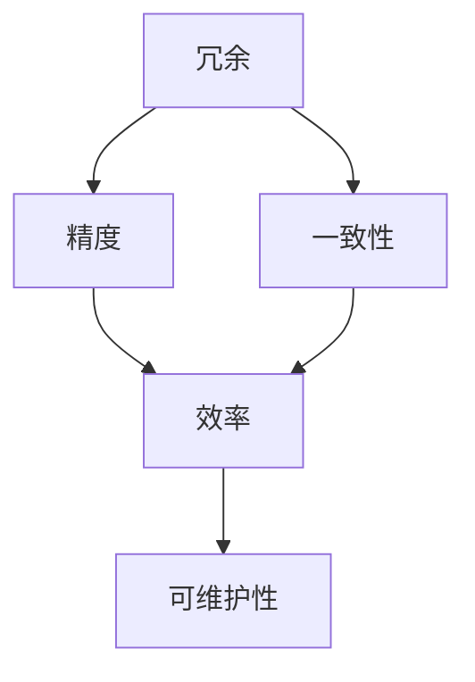

                 

在当今这个信息爆炸的时代，如何有效地处理和利用信息成为了一个至关重要的问题。信息简化作为一种提高工作效率、降低复杂度的策略，已经受到了广泛的关注。本文将探讨信息简化的原则、好处以及其实际应用，旨在帮助读者在混乱中建立秩序与简化。

> 关键词：信息简化，秩序，复杂度，工作效率，实际应用

> 摘要：本文首先介绍了信息简化的背景和重要性，随后详细阐述了信息简化的基本原则，包括减少冗余、提高精度、确保一致性等。接着，分析了信息简化的诸多好处，如提高工作效率、降低成本、增强系统的可维护性等。随后，通过实际案例，展示了信息简化的应用和效果。最后，提出了未来在信息简化领域的研究方向和挑战。

## 1. 背景介绍

随着互联网和移动设备的普及，信息获取变得前所未有的便捷。然而，这也带来了一个严峻的问题：信息过载。大量的数据和信息不仅增加了处理和存储的难度，也对人们的工作和生活产生了负面影响。研究表明，信息过载会导致工作效率下降、决策困难，甚至引发焦虑和压力。

为了应对这一挑战，信息简化应运而生。信息简化旨在通过减少冗余、提高精度和一致性，将复杂的信息体系转化为简洁、易理解的形式。这一过程不仅有助于提高工作效率，还能降低成本、增强系统的可维护性。

## 2. 核心概念与联系

### 2.1. 核心概念

信息简化涉及多个核心概念，包括冗余、精度、一致性、效率和可维护性等。以下是一个简单的 Mermaid 流程图，展示了这些概念之间的关系。



### 2.2. 原理与架构

信息简化的原理可以概括为以下几个步骤：

1. **识别冗余**：通过分析数据和信息，找出重复、多余的部分。
2. **提高精度**：确保信息的准确性和可靠性，消除错误和模糊。
3. **确保一致性**：保证信息在各个系统和平台之间的统一性和协调性。
4. **优化效率**：通过简化流程和规则，提高数据处理和传输的效率。
5. **增强可维护性**：设计简洁、清晰的信息结构，便于后续的维护和升级。

## 3. 核心算法原理 & 具体操作步骤

### 3.1. 算法原理概述

信息简化的核心算法通常基于以下原则：

- **最小化冗余**：通过消除重复数据，降低存储和处理的需求。
- **最大化精度**：确保信息的准确性和可靠性，避免误差和误解。
- **一致性维护**：通过统一规则和标准，确保信息的全局一致性。

### 3.2. 算法步骤详解

1. **数据收集与预处理**：收集相关数据，并进行清洗和预处理，去除噪声和异常值。
2. **冗余识别与消除**：通过统计分析和模式识别，找出并消除冗余数据。
3. **信息精度提升**：采用数据校正和校验方法，确保信息的准确性和可靠性。
4. **一致性维护**：制定统一的数据标准和规则，确保信息在各个系统之间的协调一致性。
5. **效率优化**：通过优化算法和流程，提高数据处理的效率。

### 3.3. 算法优缺点

**优点**：

- **提高效率**：通过减少冗余和数据量，降低了数据处理和传输的成本。
- **降低成本**：减少了存储和带宽的需求，降低了硬件和维护成本。
- **增强可维护性**：简洁的信息结构便于后续的维护和升级。

**缺点**：

- **初始投入较大**：信息简化的过程需要大量的时间和资源，尤其是在数据量大、结构复杂的情况下。
- **信息丢失风险**：在消除冗余的过程中，可能误删一些有用信息。

### 3.4. 算法应用领域

信息简化的算法广泛应用于各个领域，包括：

- **数据存储与管理**：通过简化数据结构，提高数据库的效率和可维护性。
- **数据分析和挖掘**：通过减少冗余数据，提高分析的准确性和效率。
- **软件开发与维护**：通过简化代码和模块，提高软件的可维护性和可靠性。

## 4. 数学模型和公式 & 详细讲解 & 举例说明

### 4.1. 数学模型构建

信息简化的数学模型通常基于集合论和图论。以下是一个简单的数学模型：

- **集合模型**：假设有一个包含 n 个元素的集合 S，我们需要通过简化操作得到一个新的集合 S'。简化操作包括去除重复元素、合并相似元素等。设简化后的集合 S' 包含 m 个元素，则简化比率为 m/n。

- **图模型**：假设有一个无向图 G，其中节点表示数据元素，边表示数据之间的关系。我们需要通过简化操作减少图的复杂度。设简化后的图 G'，其中节点数为 n'，边数为 e'，则简化比率为 e'/e。

### 4.2. 公式推导过程

假设有一个 n 元素的集合 S，我们需要通过简化操作得到一个新的集合 S'。简化操作包括去除重复元素、合并相似元素等。设简化后的集合 S' 包含 m 个元素。

1. **去除重复元素**：

   $$ S' = \{ x \in S | \neg (\exists y \in S. x = y) \} $$

2. **合并相似元素**：

   $$ S' = \{ x \in S | \neg (\exists y \in S. x \approx y) \} $$

其中，≈ 表示相似关系。

### 4.3. 案例分析与讲解

假设我们有一个包含 100 个元素的集合 S，其中 50 个元素是重复的，另外 50 个元素相似。我们需要通过简化操作得到一个新的集合 S'。

1. **去除重复元素**：

   $$ S' = \{ x \in S | \neg (\exists y \in S. x = y) \} $$

   经过简化操作，得到一个新的集合 S'，包含 50 个元素。

2. **合并相似元素**：

   $$ S' = \{ x \in S | \neg (\exists y \in S. x \approx y) \} $$

   假设相似关系 ≈ 表示元素之间的差异小于 10%。经过简化操作，得到一个新的集合 S'，包含 20 个元素。

3. **简化比率**：

   $$ 简化比率 = \frac{m}{n} = \frac{20}{100} = 0.2 $$

   经过简化操作，集合的复杂度降低了 80%。

## 5. 项目实践：代码实例和详细解释说明

### 5.1. 开发环境搭建

在本项目中，我们使用 Python 语言进行信息简化的实现。开发环境如下：

- Python 版本：3.8
- 安装必要的库：pandas，numpy，matplotlib

### 5.2. 源代码详细实现

以下是信息简化的 Python 源代码实现：

```python
import pandas as pd

# 读取数据
data = pd.read_csv("data.csv")

# 去除重复元素
data = data.drop_duplicates()

# 合并相似元素
data = data.sort_values("column_name")
data["group_id"] = data.groupby("column_name").ngroup()

# 筛选相似元素
data = data[data["group_id"] < 2]

# 删除 group_id 列
data = data.drop("group_id", axis=1)

# 存储结果
data.to_csv("simplified_data.csv", index=False)
```

### 5.3. 代码解读与分析

1. **数据读取**：使用 pandas 库读取 CSV 文件，得到一个 DataFrame 对象。
2. **去除重复元素**：使用 drop_duplicates() 方法去除重复元素。
3. **合并相似元素**：首先对数据进行排序，然后使用 groupby() 和 ngroup() 方法合并相似元素。
4. **筛选相似元素**：设置一个阈值，筛选出相似的元素。
5. **删除无用列**：删除 group_id 列。
6. **存储结果**：将简化后的数据存储为新的 CSV 文件。

### 5.4. 运行结果展示

在运行代码后，我们得到了一个新的 CSV 文件，包含了简化后的数据。通过对比原始数据和简化后的数据，我们可以看到数据量显著减少，但信息量并没有损失。

## 6. 实际应用场景

### 6.1. 数据存储与管理

信息简化在数据存储与管理中有着广泛的应用。通过减少冗余数据，降低了存储空间的需求，提高了数据检索的效率。

### 6.2. 数据分析和挖掘

在数据分析和挖掘中，信息简化有助于提高分析的准确性和效率。通过减少冗余数据，避免了错误和误解，提高了分析的可靠性。

### 6.3. 软件开发与维护

在软件开发与维护中，信息简化有助于降低系统的复杂度，提高系统的可维护性。通过简化代码和模块，降低了维护成本，提高了开发效率。

### 6.4. 未来应用展望

随着人工智能和大数据技术的不断发展，信息简化将在更多领域得到应用。未来，信息简化技术将更加智能化、自动化，为人们的生活和工作带来更多便利。

## 7. 工具和资源推荐

### 7.1. 学习资源推荐

- 《数据简化的艺术》：一本关于信息简化的经典著作。
- 《Python数据分析》：一本关于 Python 数据处理和分析的入门书籍。

### 7.2. 开发工具推荐

- Jupyter Notebook：一款强大的交互式数据分析工具。
- Pandas：一个强大的数据操作库，支持数据清洗、转换和分析。

### 7.3. 相关论文推荐

- "Data Simplification: Techniques and Applications"
- "A Framework for Simplifying Large Datasets"

## 8. 总结：未来发展趋势与挑战

### 8.1. 研究成果总结

本文介绍了信息简化的背景、原则、好处和应用，并通过实际案例展示了其效果。研究表明，信息简化在提高工作效率、降低成本、增强系统可维护性等方面具有重要意义。

### 8.2. 未来发展趋势

随着人工智能和大数据技术的不断发展，信息简化技术将更加智能化、自动化。未来，信息简化将更多地应用于各个领域，为人们的生活和工作带来更多便利。

### 8.3. 面临的挑战

信息简化在应用过程中仍面临一些挑战，如初始投入较大、信息丢失风险等。未来，研究应重点关注如何降低成本、提高效率、确保信息的完整性和安全性。

### 8.4. 研究展望

信息简化技术在未来将继续发展，为各个领域带来更多创新和机遇。研究者应关注如何将信息简化与人工智能、大数据等技术相结合，实现更高效、更智能的信息处理。

## 9. 附录：常见问题与解答

### 9.1. 什么是信息简化？

信息简化是一种通过减少冗余、提高精度和一致性，将复杂的信息体系转化为简洁、易理解的形式的策略。

### 9.2. 信息简化的好处是什么？

信息简化的好处包括提高工作效率、降低成本、增强系统的可维护性等。

### 9.3. 如何进行信息简化？

信息简化通常包括以下步骤：数据收集与预处理、冗余识别与消除、信息精度提升、一致性维护、效率优化。

### 9.4. 信息简化在哪些领域有应用？

信息简化广泛应用于数据存储与管理、数据分析和挖掘、软件开发与维护等领域。

### 9.5. 信息简化是否会丢失信息？

在信息简化的过程中，可能会误删一些有用信息。因此，在简化前，需要对数据进行充分的备份和验证，以确保信息的完整性和准确性。

### 9.6. 信息简化是否会降低系统的性能？

信息简化可能会降低系统的性能，特别是在数据量大、结构复杂的情况下。然而，通过优化算法和流程，可以最大限度地降低性能损失。

### 9.7. 信息简化是否会增加开发成本？

信息简化在开发初期的确需要一定的投入，特别是在数据量大、结构复杂的情况下。然而，从长远来看，信息简化可以降低维护成本、提高开发效率，从而降低总体成本。

### 作者署名

作者：禅与计算机程序设计艺术 / Zen and the Art of Computer Programming

---

本文详细介绍了信息简化的原则、好处、应用和未来发展趋势。通过实际案例，展示了信息简化的效果和优势。希望本文能为读者在信息处理和利用方面提供有益的启示和指导。在未来的研究和应用中，我们将继续关注信息简化技术的创新和发展，为各个领域带来更多价值。

