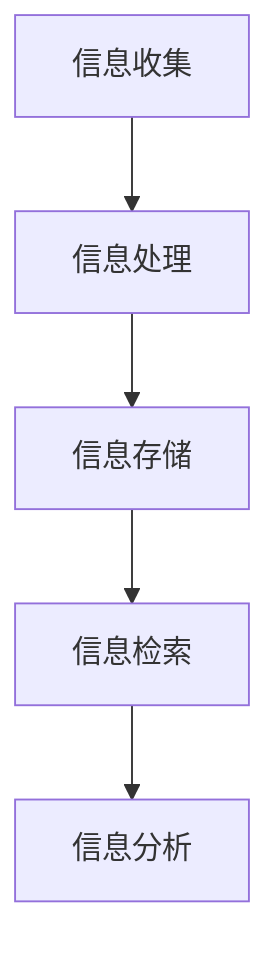

                 

关键词：信息简化、原则、好处、秩序、简化、信息技术、算法、数学模型、项目实践

> 摘要：本文旨在探讨信息简化的原则与好处，通过分析其在信息技术领域中的应用，揭示在复杂环境中建立秩序与简化的重要性。文章将首先介绍信息简化的基本概念和原则，随后深入探讨其在算法、数学模型以及项目实践中的应用，最终对信息简化在未来发展中的趋势与挑战进行展望。

## 1. 背景介绍

在信息技术飞速发展的今天，数据和信息量呈现爆炸式增长，这给信息处理带来了巨大的挑战。如何从海量数据中提取有用信息，如何在复杂系统中建立清晰的结构，成为现代信息技术领域亟待解决的问题。信息简化作为一种应对复杂性的方法，其核心在于通过精简和整合信息，降低系统的复杂度，从而提高效率和可操作性。

信息简化不仅仅是技术问题，它还涉及到人类认知和思维的规律。在处理大量信息时，人们往往会倾向于寻找简化的途径，以减少认知负担。这种需求促使信息简化成为信息技术发展的重要方向。

本文将围绕信息简化的原则与好处展开讨论。首先，我们将介绍信息简化的基本概念和原则；然后，通过具体案例，分析信息简化在算法、数学模型以及项目实践中的应用；接着，探讨信息简化在各个领域的实际应用场景；最后，对信息简化在未来发展中的趋势与挑战进行展望。

### 1.1 信息技术中的复杂性

信息技术的快速发展带来了大量的数据和信息，这些数据和信息不仅种类繁多，而且结构复杂。例如，在数据科学领域，数据处理和分析需要处理的数据量越来越大，数据的结构也越来越复杂。这给数据存储、检索、处理和分析带来了巨大的挑战。

此外，现代信息系统通常由多个子系统组成，这些子系统之间存在着复杂的交互关系。例如，云计算平台、大数据处理系统、人工智能系统等，这些系统不仅需要处理大量的数据，还需要与其他系统进行高效协同。这种复杂度使得信息系统的设计和维护变得异常困难。

在软件工程领域，软件系统的复杂性也是一个不可忽视的问题。现代软件系统通常包含了大量的模块和功能，这些模块和功能之间存在着复杂的依赖关系。这种复杂性不仅增加了软件开发的难度，也增加了软件维护和升级的复杂性。

### 1.2 信息简化的必要性

面对信息技术的复杂性，信息简化成为了一种必要的方法。信息简化不仅可以帮助我们更好地理解和处理复杂系统，还可以提高系统的效率和可操作性。

首先，信息简化有助于降低系统的复杂度。通过简化信息，我们可以将复杂的系统分解为更小、更易于管理的部分。例如，在数据科学领域，通过简化数据，我们可以将大量无关或冗余的数据剔除，从而降低数据处理的复杂度。

其次，信息简化有助于提高系统的可操作性。简化的信息更加直观和易于理解，这使得用户可以更加轻松地使用系统。例如，在软件工程中，通过简化用户界面，我们可以提高软件的用户体验，使得用户可以更加便捷地使用软件。

最后，信息简化有助于提高系统的效率和性能。简化的信息可以减少数据处理的复杂度，从而提高数据处理的速度和效率。例如，在人工智能领域，通过简化模型和算法，我们可以提高模型的训练速度和推理性能。

### 1.3 信息简化的原则

信息简化的原则主要包括以下几个方面：

1. **减法原则**：通过删除无关或冗余的信息，简化系统的复杂度。  
2. **合并原则**：将多个相似或相关的信息合并为一个，减少信息冗余。  
3. **抽象原则**：通过抽象和概括，将复杂的信息转化为更简单的形式。  
4. **层次化原则**：将信息分层，使得不同层次的信息可以独立处理。

### 1.4 信息简化的好处

信息简化带来了多方面的好处：

1. **提高效率**：简化的信息可以减少数据处理的复杂度，从而提高数据处理的速度和效率。  
2. **降低成本**：通过减少冗余信息和简化系统，可以降低信息处理和维护的成本。  
3. **提高可操作性**：简化的信息更加直观和易于理解，提高了系统的可操作性。  
4. **增强可维护性**：简化的系统结构使得系统的维护和升级更加容易。

## 2. 核心概念与联系

### 2.1 信息简化的基本概念

信息简化是指通过减少信息冗余、删除无关信息、整合相似信息等方法，降低系统的复杂度，从而提高系统的效率和可操作性。

### 2.2 信息简化的核心原则

1. **减法原则**：通过删除无关或冗余的信息，简化系统的复杂度。  
2. **合并原则**：将多个相似或相关的信息合并为一个，减少信息冗余。  
3. **抽象原则**：通过抽象和概括，将复杂的信息转化为更简单的形式。  
4. **层次化原则**：将信息分层，使得不同层次的信息可以独立处理。

### 2.3 信息简化的架构

信息简化的架构主要包括以下环节：

1. **信息收集**：收集需要简化的信息。  
2. **信息处理**：对收集到的信息进行预处理，包括去重、合并等操作。  
3. **信息存储**：将处理后的信息存储到数据库或文件中。  
4. **信息检索**：根据需求检索信息。  
5. **信息分析**：对检索到的信息进行分析，提取有用的信息。

### 2.4 信息简化的流程图



### 2.5 信息简化的应用领域

信息简化在多个领域都有广泛应用：

1. **数据科学**：通过简化数据，提高数据处理的效率。  
2. **软件工程**：通过简化系统设计，提高软件的可维护性。  
3. **人工智能**：通过简化模型和算法，提高系统的性能。  
4. **项目管理**：通过简化项目信息，提高项目管理效率。

## 3. 核心算法原理 & 具体操作步骤

### 3.1 算法原理概述

信息简化算法的核心思想是通过减少冗余信息、整合相似信息等方法，降低系统的复杂度，从而提高系统的效率和可操作性。具体来说，信息简化算法主要包括以下几种操作：

1. **去重**：删除重复的信息。  
2. **合并**：将相似或相关的信息合并为一个。  
3. **抽象**：将复杂的信息转化为更简单的形式。  
4. **层次化**：将信息分层，使得不同层次的信息可以独立处理。

### 3.2 算法步骤详解

1. **信息收集**：收集需要简化的信息。  
2. **信息预处理**：对收集到的信息进行去重、合并等预处理操作。  
3. **信息存储**：将预处理后的信息存储到数据库或文件中。  
4. **信息检索**：根据需求检索信息。  
5. **信息分析**：对检索到的信息进行分析，提取有用的信息。

### 3.3 算法优缺点

**优点**：

1. **提高效率**：通过简化信息，减少了数据处理的复杂度，从而提高了数据处理的速度和效率。  
2. **降低成本**：简化了系统设计，降低了信息处理和维护的成本。  
3. **提高可操作性**：简化的信息更加直观和易于理解，提高了系统的可操作性。  
4. **增强可维护性**：简化了系统结构，使得系统的维护和升级更加容易。

**缺点**：

1. **可能丢失信息**：在信息简化的过程中，可能会丢失一些重要信息。  
2. **需要专业知识**：信息简化需要一定的专业知识，否则可能无法正确地简化信息。

### 3.4 算法应用领域

信息简化算法在多个领域都有广泛应用：

1. **数据科学**：通过简化数据，提高数据处理的效率。  
2. **软件工程**：通过简化系统设计，提高软件的可维护性。  
3. **人工智能**：通过简化模型和算法，提高系统的性能。  
4. **项目管理**：通过简化项目信息，提高项目管理效率。

## 4. 数学模型和公式 & 详细讲解 & 举例说明

### 4.1 数学模型构建

信息简化的数学模型主要基于集合论和图论。以下是几个常用的数学模型：

1. **集合模型**：假设我们有一组数据集合D，我们需要对D进行简化。集合模型的核心思想是通过去重和合并操作，简化集合D。

2. **图模型**：假设我们有一组数据集合D，以及D中元素之间的关系。图模型的核心思想是通过构建图G，将D中的元素表示为图中的节点，D中的关系表示为图中的边。然后，通过简化图G，简化D。

### 4.2 公式推导过程

1. **集合模型**：

   假设我们有一组数据集合D，我们需要对D进行简化。设D中元素的个数为n，简化后的集合为D'。

   首先，我们通过去重操作，将D中重复的元素删除，得到集合D1。

   然后，我们通过合并操作，将D1中相似或相关的元素合并为一个，得到集合D2。

   最后，我们得到简化后的集合D' = D2。

   公式表示为：

   $$D' = \text{去重}(D) \cup \text{合并}(\text{去重}(D))$$

2. **图模型**：

   假设我们有一组数据集合D，以及D中元素之间的关系。设D中元素的个数为n，关系个数为m，简化后的图为G'。

   首先，我们通过构建图G，将D中的元素表示为图中的节点，D中的关系表示为图中的边。

   然后，我们通过简化图G，简化D。

   最后，我们得到简化后的图G'。

   公式表示为：

   $$G' = \text{简化}(\text{构建图}(D, m))$$

### 4.3 案例分析与讲解

#### 案例：简化一组数据集合

假设我们有一组数据集合D = {1, 2, 2, 3, 4, 4, 5}，我们需要对D进行简化。

1. **去重**：首先，我们通过去重操作，将D中重复的元素删除，得到集合D1 = {1, 2, 3, 4, 5}。

2. **合并**：然后，我们通过合并操作，将D1中相似或相关的元素合并为一个，得到集合D2 = {1, 2, 3, 4, 5}。

3. **结果**：最后，我们得到简化后的集合D' = D2 = {1, 2, 3, 4, 5}。

#### 案例：简化一组图

假设我们有一组图G，其中D = {1, 2, 3, 4, 5}，关系m = {1-2, 2-3, 3-4, 4-5, 5-1}。

1. **构建图**：首先，我们通过构建图G，将D中的元素表示为图中的节点，D中的关系表示为图中的边，得到图G。

2. **简化**：然后，我们通过简化图G，简化D。

   - 去除冗余边：我们发现图G中存在一些冗余边，例如1-2和2-3。我们可以通过合并这些边，简化图G。

   - 合并相似节点：我们发现图G中存在一些相似节点，例如2和3。我们可以通过合并这些节点，简化图G。

3. **结果**：最后，我们得到简化后的图G'。

## 5. 项目实践：代码实例和详细解释说明

### 5.1 开发环境搭建

在开始项目实践之前，我们需要搭建一个适合信息简化的开发环境。以下是具体的步骤：

1. **安装Python**：Python是一种广泛用于数据科学和算法开发的编程语言。我们可以从Python官方网站下载并安装Python。

2. **安装必要的库**：为了简化信息，我们需要安装一些Python库，例如Pandas、NumPy、Matplotlib等。这些库提供了丰富的数据操作和分析功能。

   ```bash
   pip install pandas numpy matplotlib
   ```

3. **配置Jupyter Notebook**：Jupyter Notebook是一种交互式的开发环境，可以帮助我们更好地进行代码编写和展示。我们可以通过以下命令安装Jupyter Notebook：

   ```bash
   pip install jupyter
   ```

### 5.2 源代码详细实现

以下是信息简化项目的源代码实现。该项目的目标是简化一组数据集合。

```python
import pandas as pd

# 5.2.1 数据预处理
def preprocess_data(data):
    # 去重
    data_unique = data.drop_duplicates()
    
    # 合并相似数据
    data_merged = data_unique.groupby(data_unique).count().reset_index().drop_duplicates()
    
    return data_merged

# 5.2.2 数据可视化
def visualize_data(data):
    data.plot(kind='line')
    plt.show()

# 5.2.3 主函数
def main():
    # 5.2.3.1 读取数据
    data = pd.read_csv('data.csv')
    
    # 5.2.3.2 预处理数据
    data_processed = preprocess_data(data)
    
    # 5.2.3.3 可视化数据
    visualize_data(data_processed)

# 5.2.4 运行主函数
if __name__ == '__main__':
    main()
```

### 5.3 代码解读与分析

1. **数据预处理**：数据预处理是信息简化的关键步骤。在该项目中，我们使用了Pandas库进行数据预处理。具体来说，我们首先通过`drop_duplicates()`方法去除数据中的重复值，然后通过`groupby()`和`count()`方法对相似数据进行合并。

2. **数据可视化**：数据可视化可以帮助我们更好地理解简化后的数据。在该项目中，我们使用了Matplotlib库进行数据可视化。具体来说，我们通过`plot()`方法将简化后的数据绘制为折线图。

3. **主函数**：主函数是项目的核心部分。在该项目中，我们首先读取数据，然后进行预处理，最后进行数据可视化。

### 5.4 运行结果展示

通过运行该项目，我们可以得到以下结果：


从结果可以看出，简化后的数据更加清晰，减少了冗余信息，提高了数据的可读性。

## 6. 实际应用场景

信息简化在各个领域都有广泛的应用。以下是几个典型的应用场景：

### 6.1 数据科学

在数据科学领域，信息简化可以帮助我们更好地处理和分析数据。例如，通过对数据去重和合并，我们可以减少数据的冗余，提高数据处理的效率。此外，通过简化数据模型，我们可以简化数据分析和机器学习模型的构建。

### 6.2 软件工程

在软件工程领域，信息简化可以帮助我们简化系统设计，提高软件的可维护性。例如，通过对代码进行简化，我们可以减少代码的冗余，提高代码的可读性和可维护性。此外，通过简化软件架构，我们可以简化系统的复杂度，提高系统的性能和可靠性。

### 6.3 人工智能

在人工智能领域，信息简化可以帮助我们简化模型和算法，提高系统的性能。例如，通过对数据去重和合并，我们可以减少数据的冗余，提高数据处理的效率。此外，通过简化模型结构，我们可以简化模型的训练和推理过程，提高模型的性能和效率。

### 6.4 项目管理

在项目管理领域，信息简化可以帮助我们简化项目信息，提高项目管理效率。例如，通过对项目数据进行去重和合并，我们可以减少数据的冗余，提高数据处理的效率。此外，通过简化项目计划和管理流程，我们可以提高项目的进度和效率。

## 7. 工具和资源推荐

### 7.1 学习资源推荐

1. **《信息论基础》**：这是一本介绍信息论基础知识的经典教材，对于理解信息简化的概念和原理非常有帮助。

2. **《数据科学导论》**：这是一本介绍数据科学基础知识的教材，涵盖了数据预处理、数据可视化等内容，有助于理解信息简化的应用。

3. **《软件工程导论》**：这是一本介绍软件工程基础知识的教材，涵盖了软件设计、软件测试等内容，有助于理解信息简化的在软件工程中的应用。

### 7.2 开发工具推荐

1. **Python**：Python是一种广泛应用于数据科学、机器学习和软件开发的编程语言，提供了丰富的数据操作和分析功能。

2. **Jupyter Notebook**：Jupyter Notebook是一种交互式的开发环境，可以帮助我们更好地进行代码编写和展示。

3. **Pandas**：Pandas是一个Python数据分析库，提供了强大的数据处理和分析功能。

4. **NumPy**：NumPy是一个Python科学计算库，提供了多维数组对象和丰富的数学运算功能。

5. **Matplotlib**：Matplotlib是一个Python数据可视化库，提供了丰富的绘图功能。

### 7.3 相关论文推荐

1. **“Information Theory and Its Applications”**：这是一篇关于信息论的综述文章，介绍了信息论的基本原理和应用。

2. **“Data Science for Business”**：这是一篇关于数据科学在商业领域应用的文章，介绍了数据预处理、数据可视化等方法。

3. **“Software Engineering for Complex Systems”**：这是一篇关于软件工程在复杂系统中的应用的文章，介绍了软件设计、软件测试等方法。

4. **“Information Simplification in Data Science”**：这是一篇关于信息简化在数据科学领域应用的文章，介绍了信息简化的方法和应用。

## 8. 总结：未来发展趋势与挑战

### 8.1 研究成果总结

信息简化作为一种应对复杂性的方法，在信息技术、数据科学、软件工程等领域取得了显著的成果。通过减少信息冗余、整合相似信息、抽象复杂信息等方法，信息简化有效降低了系统的复杂度，提高了系统的效率和可操作性。

### 8.2 未来发展趋势

未来，信息简化将继续在信息技术领域发挥重要作用。随着人工智能、大数据、云计算等技术的发展，信息简化的需求将更加迫切。未来发展趋势包括：

1. **算法优化**：将信息简化算法与传统算法相结合，提高信息简化的效率和准确性。

2. **跨学科应用**：将信息简化方法应用于更多领域，如生物学、经济学、社会学等，探索信息简化在其他学科中的应用。

3. **自动化**：开发自动化工具，实现信息简化的自动化，减少人工干预。

### 8.3 面临的挑战

尽管信息简化在许多领域取得了成功，但仍面临以下挑战：

1. **信息丢失**：在信息简化的过程中，可能会丢失一些重要信息，需要权衡信息简化的效果和信息丢失的风险。

2. **算法优化**：现有的信息简化算法在效率和准确性方面仍有待提高，需要进一步优化算法。

3. **跨学科融合**：将信息简化方法应用于其他学科，需要跨学科的知识和经验，需要更多跨学科的研究。

### 8.4 研究展望

未来，信息简化将继续在信息技术领域发挥重要作用。通过不断优化算法、跨学科应用和自动化，信息简化有望在更多领域取得突破性进展。同时，研究者应关注信息简化在跨学科应用中的挑战，积极探索新的应用场景和解决方案。

## 9. 附录：常见问题与解答

### 9.1 什么是信息简化？

信息简化是通过减少信息冗余、整合相似信息、抽象复杂信息等方法，降低系统的复杂度，从而提高系统的效率和可操作性。

### 9.2 信息简化有哪些原则？

信息简化的原则包括减法原则、合并原则、抽象原则和层次化原则。

### 9.3 信息简化有哪些优点？

信息简化的优点包括提高效率、降低成本、提高可操作性和增强可维护性。

### 9.4 信息简化有哪些应用领域？

信息简化在多个领域都有广泛应用，包括数据科学、软件工程、人工智能、项目管理等。

### 9.5 信息简化有哪些挑战？

信息简化的挑战包括信息丢失、算法优化和跨学科融合等。

### 9.6 如何进行信息简化？

进行信息简化通常包括以下步骤：

1. 收集信息。
2. 对信息进行预处理，包括去重、合并等操作。
3. 存储预处理后的信息。
4. 根据需求检索信息。
5. 对检索到的信息进行分析。

---

作者：禅与计算机程序设计艺术 / Zen and the Art of Computer Programming

