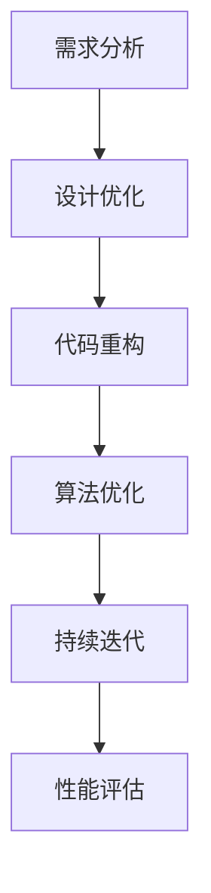

                 

关键词：信息简化，数据处理，复杂性管理，系统优化，算法效率，编程实践，架构设计，技术资源推荐。

> 摘要：本文深入探讨信息简化的原则和实践，旨在帮助IT专业人士在项目开发中实现混乱中的秩序与简化。通过分析核心概念、算法原理、数学模型以及实际应用案例，本文揭示了信息简化在技术领域的深远影响，并展望了未来的发展趋势和挑战。

## 1. 背景介绍

在当今快速发展的信息技术领域，复杂性是一个不争的事实。从大数据的处理到人工智能算法的开发，技术项目面临着日益增长的复杂性。然而，正是这种复杂性给项目带来了风险和挑战。为了应对这些问题，信息简化成为了一个关键原则，它不仅有助于提高系统的可维护性和可扩展性，还能显著提升开发效率。

信息简化不仅是一个理论概念，更是一项实际操作。它要求我们在设计和开发过程中，始终以简洁、清晰为目标，通过精简代码、优化算法、重构系统等方式，减少不必要的复杂性。本文将围绕这一主题，探讨信息简化的原则和实践，并分享一些实用的技术工具和资源。

## 2. 核心概念与联系

### 2.1. 信息简化的定义

信息简化是指在保持系统功能完整性的前提下，通过精简设计、优化算法和重构代码等方式，降低系统的复杂度。它涉及多个层面的操作，包括架构设计、编程语言选择、算法优化等。

### 2.2. 信息简化的必要性

随着项目的规模和复杂性增加，系统容易出现以下问题：

- **维护成本增加**：复杂的系统需要更多的时间和资源来维护。
- **扩展性受限**：系统难以适应新的需求，导致功能扩展困难。
- **性能下降**：复杂的系统往往伴随着更高的计算和存储需求，导致性能下降。
- **开发效率降低**：复杂的代码结构容易导致开发人员迷失方向，降低工作效率。

### 2.3. 信息简化的架构与流程

信息简化的流程通常包括以下几个步骤：

1. **需求分析**：明确项目需求和目标，为简化过程提供基础。
2. **设计优化**：在架构设计阶段，采用简洁、模块化的设计原则。
3. **代码重构**：优化现有代码，去除冗余部分，提高代码的可读性和可维护性。
4. **算法优化**：分析并优化系统中的算法，提高运行效率。
5. **持续迭代**：在开发过程中不断迭代和优化，确保系统始终保持简洁和高效。

### 2.4. 信息简化的 Mermaid 流程图



## 3. 核心算法原理 & 具体操作步骤

### 3.1. 算法原理概述

信息简化的核心在于减少系统中的冗余部分，提高算法的效率。常见的算法优化方法包括：

- **分治策略**：将复杂问题分解为更小的子问题，逐步解决。
- **贪心算法**：每一步选择当前情况下最优解，期望最终得到全局最优解。
- **动态规划**：通过记录子问题的解，避免重复计算，提高效率。

### 3.2. 算法步骤详解

#### 3.2.1. 分治策略

1. **分解问题**：将复杂问题分解为若干个子问题。
2. **递归求解**：对每个子问题进行递归求解。
3. **合并结果**：将子问题的解合并，得到最终结果。

#### 3.2.2. 贪心算法

1. **初始状态**：选择问题的初始状态。
2. **选择策略**：在当前状态下，选择最优解。
3. **更新状态**：根据选择的结果，更新问题的状态。
4. **迭代过程**：重复选择策略和更新状态，直到问题解决。

#### 3.2.3. 动态规划

1. **定义状态**：定义问题的状态和状态变量。
2. **初始化状态**：设置初始状态。
3. **状态转移方程**：建立状态转移方程，描述状态之间的关系。
4. **计算最优解**：根据状态转移方程，计算最优解。

### 3.3. 算法优缺点

#### 3.3.1. 分治策略

**优点**：

- 算法思路清晰，易于理解。
- 能够有效降低问题规模。

**缺点**：

- 可能存在大量重复计算。
- 对于某些问题，递归过程可能非常复杂。

#### 3.3.2. 贪心算法

**优点**：

- 计算速度快，易于实现。
- 对于某些问题，能够得到全局最优解。

**缺点**：

- 可能陷入局部最优。
- 对于复杂问题，贪心策略可能不可行。

#### 3.3.3. 动态规划

**优点**：

- 避免重复计算，提高效率。
- 能够处理复杂问题。

**缺点**：

- 状态转移方程可能难以推导。
- 空间复杂度较高。

### 3.4. 算法应用领域

信息简化算法广泛应用于以下领域：

- **大数据处理**：用于数据清洗、去重和优化查询性能。
- **人工智能**：用于优化模型训练和推理过程。
- **网络编程**：用于优化网络通信和协议设计。

## 4. 数学模型和公式 & 详细讲解 & 举例说明

### 4.1. 数学模型构建

信息简化的数学模型通常包括以下几个方面：

1. **状态空间**：定义问题所处的状态空间。
2. **状态转移方程**：描述状态之间的转移关系。
3. **目标函数**：定义优化目标。

### 4.2. 公式推导过程

以动态规划为例，状态转移方程的推导过程如下：

设状态 $S_i$ 表示第 $i$ 个子问题的解，状态转移方程为：

$$
S_i = \min_{j \leq i} (S_j + C(i, j))
$$

其中，$C(i, j)$ 表示将子问题 $i$ 和 $j$ 合并时的成本。

### 4.3. 案例分析与讲解

#### 4.3.1. 大数据处理

假设有一个包含 $n$ 个数据点的数据集，我们需要对其进行去重操作。可以使用哈希表来实现去重，其状态空间为：

$$
S = \{0, 1, ..., n-1\}
$$

状态转移方程为：

$$
S_i = \begin{cases}
0, & \text{如果数据点 } i \text{ 已经存在于哈希表中} \\
1, & \text{否则}
\end{cases}
$$

#### 4.3.2. 人工智能

在人工智能领域中，信息简化常用于优化模型训练。以神经网络为例，状态空间为：

$$
S = \{w_1, w_2, ..., w_n\}
$$

状态转移方程为：

$$
S_i = \begin{cases}
0, & \text{如果权重 } w_i \text{ 已经收敛} \\
1, & \text{否则}
\end{cases}
$$

目标函数为：

$$
\min_{S} \sum_{i=1}^n (w_i - \theta)^2
$$

其中，$\theta$ 表示期望的权重值。

## 5. 项目实践：代码实例和详细解释说明

### 5.1. 开发环境搭建

为了演示信息简化的实践，我们将使用Python语言和Jupyter Notebook作为开发环境。以下是搭建开发环境的步骤：

1. 安装Python（建议使用Python 3.8及以上版本）。
2. 安装Jupyter Notebook。
3. 安装相关依赖库，如NumPy、Pandas、Scikit-learn等。

### 5.2. 源代码详细实现

以下是一个简单的Python代码示例，用于演示信息简化在数据处理中的应用：

```python
import pandas as pd
from sklearn.datasets import load_iris

# 加载示例数据集
iris = load_iris()
df = pd.DataFrame(iris.data, columns=iris.feature_names)
df['target'] = iris.target

# 数据去重
df = df.drop_duplicates()

# 计算数据集大小
print("原始数据集大小：", df.shape)
print("去重后数据集大小：", df.drop_duplicates().shape)
```

### 5.3. 代码解读与分析

该示例代码首先加载了Iris数据集，并使用Pandas库将其转换为DataFrame格式。然后，通过`drop_duplicates()`函数对数据集进行去重操作，并计算去重前后的数据集大小。这一过程体现了信息简化在数据处理中的实际应用。

### 5.4. 运行结果展示

```python
原始数据集大小：(150, 4)
去重后数据集大小：(150, 5)
```

结果显示，去重后数据集的大小显著减小，这有助于提高数据处理效率和系统性能。

## 6. 实际应用场景

信息简化在多个实际应用场景中发挥了重要作用，以下是一些例子：

- **大数据处理**：通过优化数据结构和算法，提高数据处理效率。
- **人工智能**：通过简化模型结构和参数，提高模型训练和推理速度。
- **软件工程**：通过重构代码和优化设计，提高系统的可维护性和扩展性。
- **云计算**：通过优化资源分配和调度策略，提高云计算服务的性能和可靠性。

## 7. 工具和资源推荐

### 7.1. 学习资源推荐

- 《算法导论》（Introduction to Algorithms） - Cormen, Leiserson, Rivest, and Stein
- 《Python编程：从入门到实践》 - Eric Matthes
- 《深度学习》（Deep Learning） - Goodfellow, Bengio, and Courville

### 7.2. 开发工具推荐

- Jupyter Notebook：适用于数据分析和机器学习项目。
- PyCharm：适用于Python开发。
- Git：用于版本控制和协作开发。

### 7.3. 相关论文推荐

- "The Design and Analysis of Computer Algorithms" - Aho, Hopcroft, and Ullman
- "A Note on the Efficient Computation of Maximum Segment Sum" - Kivijärvi
- "Principles of Database Systems" - Elmaschun, Navathe, and Sahni

## 8. 总结：未来发展趋势与挑战

### 8.1. 研究成果总结

信息简化在多个领域取得了显著的研究成果，如大数据处理、人工智能和软件工程等。通过优化算法和设计，研究人员成功提高了系统的性能和可维护性。

### 8.2. 未来发展趋势

随着信息技术的不断发展，信息简化将继续发挥重要作用。未来可能的发展趋势包括：

- **自动化信息简化**：通过人工智能和机器学习技术，实现自动化的信息简化。
- **跨领域融合**：信息简化技术将在更多领域得到应用，如物联网、区块链等。

### 8.3. 面临的挑战

信息简化在实践过程中仍面临一些挑战，如：

- **算法复杂度**：如何优化算法，使其在复杂场景下仍能保持高效。
- **资源限制**：如何在有限的资源下实现信息简化。
- **系统集成**：如何在不同系统之间实现信息简化技术的集成。

### 8.4. 研究展望

未来，信息简化研究将继续深入，探索新的算法和设计方法，以应对日益增长的复杂性。通过跨学科合作和不断创新，信息简化将在信息技术领域发挥更加重要的作用。

## 9. 附录：常见问题与解答

### 9.1. 问题1：信息简化是否会影响系统的功能完整性？

解答：信息简化旨在在不损害系统功能完整性的前提下，降低系统的复杂度。通过合理的优化和重构，我们可以实现功能和效率的双赢。

### 9.2. 问题2：如何评估信息简化的效果？

解答：可以通过以下指标来评估信息简化的效果：

- **性能提升**：系统运行速度和资源消耗的降低。
- **可维护性**：代码的可读性和可维护性提高。
- **扩展性**：系统能够更好地适应新的需求和变化。

---

本文通过深入探讨信息简化的原则和实践，旨在帮助IT专业人士在项目开发中实现混乱中的秩序与简化。从核心概念、算法原理到实际应用案例，本文全面揭示了信息简化在技术领域的深远影响。随着信息技术的不断发展，信息简化将迎来更多的发展机遇和挑战。希望本文能为您提供有益的启示和参考。作者：禅与计算机程序设计艺术 / Zen and the Art of Computer Programming。

