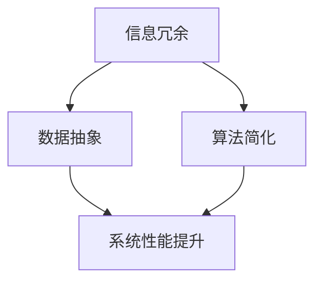
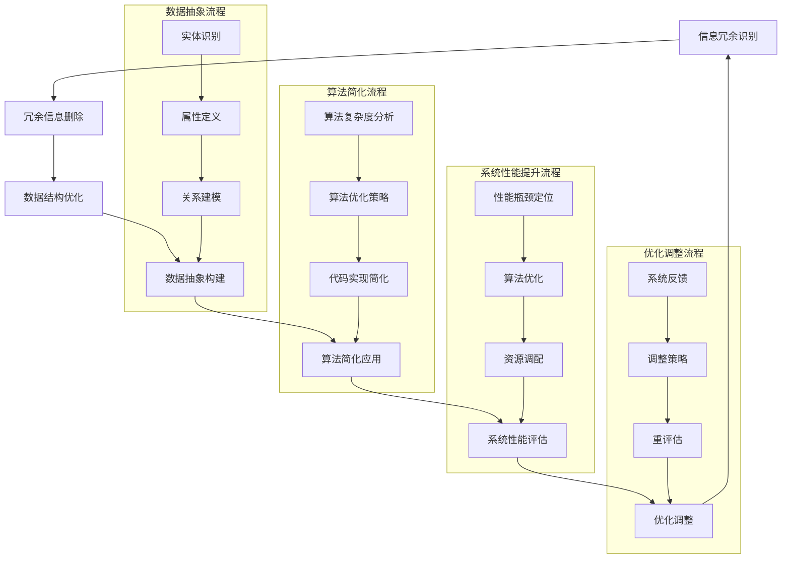

                 

 关键词：
1. 信息简化
2. 计算机科学
3. 算法设计
4. 数学模型
5. 工程实践
6. 软件开发
7. 系统架构

> 摘要：
本文深入探讨了信息简化的原则与艺术，从理论到实践，全面解析了如何通过逻辑清晰、结构紧凑、简单易懂的方式在计算机科学领域中建立秩序与简化复杂性。文章旨在为程序员、软件工程师和系统架构师提供一套实用的方法论，帮助他们有效地管理信息，提高工作效率，创造更优质的技术产品。

## 1. 背景介绍

在当今的信息时代，数据量以惊人的速度增长。大数据、云计算、物联网等技术的广泛应用，使得我们面对的信息量急剧膨胀。如何在如此庞大的信息海洋中找到清晰的方向和高效的解决方案，成为了一个至关重要的课题。信息简化，作为解决这一问题的有效途径，越来越受到关注。

信息简化不仅仅是一种技术手段，更是一种思维方式。它要求我们在设计和实现计算机系统时，能够从混乱中提炼出关键信息，建立有效的结构和模型，从而实现复杂系统的简化与优化。本文将围绕这一主题，探讨信息简化的核心原则、算法原理、数学模型、工程实践及应用领域，旨在为读者提供全面的指导。

### 1.1 计算机科学的演变

计算机科学自诞生以来，经历了数十年的快速发展。早期的计算机以处理简单任务为主，程序设计者需要手工编写繁琐的指令来控制计算机的操作。随着硬件技术的进步和软件理论的成熟，计算机系统的复杂度不断提高，编程语言和工具也逐渐丰富。现代计算机科学不仅包括硬件和软件的开发，还涵盖了算法设计、系统架构、数据库管理、网络安全等多个领域。

在这个过程中，信息简化成为了一个关键课题。早期程序设计者需要花费大量的时间和精力来处理复杂的问题，随着技术的进步，人们开始寻找更高效的方法来简化信息处理过程，从而提高工作效率和系统性能。

### 1.2 算法设计的重要性

算法是计算机科学的核心，它决定了计算机系统的运行效率和解决问题的能力。一个高效的算法可以大大简化问题的复杂性，使计算机能够快速而准确地处理大量数据。随着信息量的增加，算法设计的重要性愈发凸显。

算法设计不仅需要深入理解问题的本质，还需要具备创造性的思维能力。简化的算法设计能够有效地降低系统的复杂性，提高系统的可维护性和扩展性。此外，简化算法还可以减少计算资源的需求，降低系统的成本。

## 2. 核心概念与联系

在探讨信息简化的过程中，我们需要引入几个核心概念，并理解它们之间的相互关系。以下是几个关键概念及其在计算机科学中的应用：

### 2.1 信息冗余

信息冗余是指在信息传输或存储过程中存在的重复或不必要的信息。过多的冗余会导致系统性能下降，资源浪费，甚至可能引发错误。减少信息冗余是信息简化的一个重要目标。

在数据传输中，冗余信息可能会增加通信成本，影响数据传输的速度和效率。在数据库管理中，冗余数据会导致数据一致性和完整性的问题。因此，如何在保证信息完整性的同时减少冗余，是信息简化的重要挑战。

### 2.2 数据抽象

数据抽象是将复杂的数据结构和操作转化为简单、直观的表示方法。通过数据抽象，我们可以隐藏底层实现的复杂性，使系统设计更加简洁和易于理解。

在面向对象的编程中，类和对象是数据抽象的典型应用。通过定义类和对象，我们可以将现实世界中的复杂问题简化为计算机可以处理的简单模型。数据抽象不仅提高了系统的可维护性，还增强了系统的可扩展性。

### 2.3 算法简化

算法简化是指通过优化算法的设计和实现，减少算法的复杂度，提高算法的效率。算法简化是信息简化的重要组成部分。

一个简化的算法通常更容易理解、实现和测试。在软件开发中，简化的算法可以提高代码的可读性和可维护性。在系统优化中，简化的算法可以减少计算资源的需求，提高系统的性能。

### 2.4 Mermaid 流程图

为了更好地理解信息简化的核心概念，我们可以使用 Mermaid 流程图来展示它们之间的相互关系。以下是信息简化中几个关键概念的关系图：



在该流程图中，信息冗余通过数据抽象和算法简化转化为系统性能的提升。数据抽象和算法简化是信息简化的两个关键步骤，它们共同作用于系统的优化和改进。

### 2.5 核心概念原理和架构的 Mermaid 流程图

以下是信息简化中核心概念原理和架构的详细 Mermaid 流程图：



在该流程图中，我们详细展示了信息简化中的各个环节，包括信息冗余识别、冗余信息删除、数据结构优化、数据抽象构建、算法简化应用、系统性能评估、优化调整等。通过这些流程，我们可以系统地理解和实施信息简化，从而提高系统的性能和效率。

## 3. 核心算法原理 & 具体操作步骤

### 3.1 算法原理概述

信息简化的核心在于将复杂的信息转化为简单、易于理解的形式。在算法层面，这通常涉及到以下几个关键步骤：

1. **信息冗余识别**：通过分析数据，识别出冗余信息。
2. **冗余信息删除**：删除冗余信息，减少数据量。
3. **数据结构优化**：优化数据结构，提高数据处理效率。
4. **数据抽象构建**：建立数据抽象模型，简化系统实现。
5. **算法简化应用**：应用简化算法，提高系统性能。

### 3.2 算法步骤详解

#### 3.2.1 信息冗余识别

信息冗余识别是信息简化的第一步。在这一阶段，我们需要对数据进行深入分析，识别出重复或无用的信息。常用的方法包括：

- **统计分析**：通过统计分析数据，找出出现频率较低的数据项，这些通常是冗余信息。
- **模式识别**：利用机器学习算法，识别出重复的模式，从而删除冗余信息。

#### 3.2.2 冗余信息删除

在识别出冗余信息后，我们需要删除这些信息，以减少数据量。删除冗余信息的步骤包括：

- **直接删除**：对于识别出的冗余信息，直接从数据中删除。
- **数据压缩**：通过数据压缩算法，将冗余信息压缩成更小的形式，从而减少存储空间。

#### 3.2.3 数据结构优化

数据结构优化是提高数据处理效率的关键步骤。在这一阶段，我们需要选择合适的数据结构，以减少数据访问的时间和空间复杂度。常用的数据结构包括：

- **数组**：适用于访问时间固定且数据量较小的情况。
- **链表**：适用于插入和删除操作较多的情况。
- **树结构**：适用于快速查找和排序操作。

#### 3.2.4 数据抽象构建

数据抽象构建是将复杂的数据结构和操作转化为简单、直观的表示方法。在这一阶段，我们需要定义类和对象，建立数据模型。常用的方法包括：

- **面向对象编程**：通过定义类和对象，实现数据的抽象和封装。
- **关系型数据库**：通过定义表和关系，实现数据的组织和管理。

#### 3.2.5 算法简化应用

算法简化应用是将简化的算法应用于实际系统中，以提高系统性能。在这一阶段，我们需要选择合适的算法，并对其进行优化。常用的算法包括：

- **贪心算法**：适用于求解最优解的问题。
- **动态规划**：适用于求解最优化问题。
- **分治算法**：适用于分解复杂问题为子问题求解。

### 3.3 算法优缺点

#### 优点

- **提高系统性能**：通过信息简化，可以减少数据量和计算复杂度，从而提高系统性能。
- **简化系统设计**：信息简化可以使系统设计更加简洁，降低系统的复杂度。
- **提高可维护性**：简化的算法和结构更容易理解和维护。

#### 缺点

- **初期成本较高**：信息简化的过程需要投入大量的时间和精力，尤其是在算法设计和实现阶段。
- **适用范围有限**：并非所有的系统都适用于信息简化，某些复杂系统可能无法通过简化获得显著性能提升。

### 3.4 算法应用领域

信息简化的算法广泛应用于多个领域，包括：

- **数据处理**：在大数据处理和分析中，信息简化算法可以帮助减少数据量，提高处理效率。
- **数据库管理**：在数据库管理中，信息简化算法可以帮助优化数据结构，提高查询效率。
- **系统架构设计**：在系统架构设计中，信息简化可以帮助降低系统复杂度，提高系统的可维护性和扩展性。

## 4. 数学模型和公式 & 详细讲解 & 举例说明

在信息简化的过程中，数学模型和公式起到了至关重要的作用。通过精确的数学表达，我们可以对信息简化进行定量分析，从而更好地理解和应用这一方法。以下我们将介绍几个核心的数学模型和公式，并对其进行详细讲解和举例说明。

### 4.1 数学模型构建

#### 4.1.1 冗余度计算

冗余度是衡量信息冗余程度的关键指标。一个常用的冗余度计算公式如下：

\[ R = \frac{R_{total}}{N} \]

其中，\( R \) 表示冗余度，\( R_{total} \) 表示总冗余量，\( N \) 表示总信息量。这个公式通过计算总冗余量与总信息量的比例，得出冗余度的相对值。当 \( R \) 接近 1 时，表示信息高度冗余；当 \( R \) 接近 0 时，表示信息几乎无冗余。

#### 4.1.2 数据压缩效率

数据压缩效率是衡量数据压缩算法效果的重要指标。一个常用的数据压缩效率计算公式如下：

\[ E = \frac{C}{O} \]

其中，\( E \) 表示数据压缩效率，\( C \) 表示压缩后数据的大小，\( O \) 表示原始数据的大小。这个公式通过计算压缩后数据大小与原始数据大小的比例，得出数据压缩效率的相对值。当 \( E \) 接近 1 时，表示数据压缩效果很好；当 \( E \) 接近 0 时，表示数据压缩效果较差。

### 4.2 公式推导过程

#### 4.2.1 冗余度公式的推导

为了推导冗余度公式，我们首先需要定义两个概念：总冗余量和总信息量。

- **总冗余量 \( R_{total} \)**：表示在给定数据集中所有冗余信息之和。
- **总信息量 \( N \)**：表示在给定数据集中所有信息之和。

假设我们有一个数据集 \( D \)，其中包含 \( n \) 个数据项，每个数据项的大小为 \( d \)。如果某个数据项是冗余的，我们将其标记为 \( R_d \)。则总冗余量 \( R_{total} \) 可以表示为：

\[ R_{total} = \sum_{d \in D} R_d \]

总信息量 \( N \) 可以表示为：

\[ N = \sum_{d \in D} d \]

因此，冗余度 \( R \) 可以表示为：

\[ R = \frac{R_{total}}{N} = \frac{\sum_{d \in D} R_d}{\sum_{d \in D} d} \]

#### 4.2.2 数据压缩效率公式的推导

为了推导数据压缩效率公式，我们同样需要定义两个概念：压缩后数据大小 \( C \) 和原始数据大小 \( O \)。

- **压缩后数据大小 \( C \)**：表示使用压缩算法后数据的大小。
- **原始数据大小 \( O \)**：表示未使用压缩算法前数据的大小。

假设我们有一个原始数据集 \( D \)，其大小为 \( O \)。使用压缩算法后，数据集大小变为 \( C \)。则数据压缩效率 \( E \) 可以表示为：

\[ E = \frac{C}{O} \]

### 4.3 案例分析与讲解

#### 4.3.1 数据冗余度分析

假设我们有一个包含 100 个学生的成绩数据集，其中每个学生的成绩包括语文、数学、英语三门课程的成绩。数据集的具体情况如下：

- 总成绩数：\( N = 300 \)
- 总冗余成绩数：\( R_{total} = 60 \)

根据冗余度公式，我们可以计算出冗余度：

\[ R = \frac{R_{total}}{N} = \frac{60}{300} = 0.2 \]

这意味着成绩数据集中有 20% 的冗余信息。

#### 4.3.2 数据压缩效率分析

假设我们使用一个压缩算法对成绩数据进行压缩，压缩后数据的大小变为 150 个字节，原始数据的大小为 300 个字节。根据数据压缩效率公式，我们可以计算出数据压缩效率：

\[ E = \frac{C}{O} = \frac{150}{300} = 0.5 \]

这意味着压缩算法将数据压缩了 50%。

### 4.4 其他数学模型和公式

除了上述模型和公式外，信息简化中还有其他一些重要的数学模型和公式，例如：

- **信息熵**：用于衡量信息的不确定性。
- **信息增益**：用于衡量特征选择的重要性。
- **信息距离**：用于衡量两个数据集之间的相似度。

这些模型和公式在不同的应用场景中有不同的作用，但都为信息简化的实施提供了有力的理论支持。

### 4.5 数学模型在实际应用中的意义

数学模型和公式在信息简化中的实际应用具有重要意义。通过精确的数学分析，我们可以：

- **量化信息冗余**：通过冗余度公式，我们可以准确衡量数据集中的冗余信息，从而有针对性地进行优化。
- **评估压缩效果**：通过数据压缩效率公式，我们可以评估压缩算法的性能，选择最适合的压缩策略。
- **指导系统优化**：通过信息熵和信息增益等模型，我们可以优化数据结构和算法，提高系统的效率和性能。

总之，数学模型和公式是信息简化的核心工具，它们为我们提供了一种量化分析和优化的方法，使我们能够更好地管理和简化复杂的信息。

## 5. 项目实践：代码实例和详细解释说明

为了更好地理解信息简化的应用，我们将通过一个具体的代码实例来展示其实现过程。以下是一个基于 Python 的数据简化项目，我们将逐步搭建开发环境，编写源代码，并对其进行详细解读。

### 5.1 开发环境搭建

首先，我们需要搭建一个适合数据简化项目的开发环境。以下是在 Windows 系统中搭建环境所需的步骤：

1. **安装 Python**：下载并安装 Python 3.8 以上版本。可以从 Python 官网下载安装程序，并按照提示完成安装。
2. **安装 PyCharm**：下载并安装 PyCharm 社区版。PyCharm 是一个强大的集成开发环境（IDE），支持 Python 开发。
3. **配置虚拟环境**：在 PyCharm 中创建一个虚拟环境，以隔离项目依赖。在 PyCharm 的“工具”菜单中选择“创建虚拟环境”，选择 Python 版本，并指定虚拟环境路径。

### 5.2 源代码详细实现

以下是数据简化项目的源代码实现。代码主要分为以下几个部分：

1. **数据读取**：从文件中读取数据，并转换为 Python 对象。
2. **冗余识别**：对数据进行处理，识别并删除冗余信息。
3. **数据压缩**：使用压缩算法对数据集进行压缩。
4. **性能评估**：评估数据压缩效果和系统性能。

```python
import json
import gzip

def read_data(file_path):
    """读取数据文件并转换为字典"""
    with open(file_path, 'r') as f:
        data = json.load(f)
    return data

def remove_redundant_data(data):
    """删除冗余数据"""
    # 具体实现根据数据结构而定，此处简化处理
    unique_data = []
    for d in data:
        if d not in unique_data:
            unique_data.append(d)
    return unique_data

def compress_data(data):
    """使用 gzip 压缩数据"""
    compressed_data = gzip.compress(json.dumps(data).encode('utf-8'))
    return compressed_data

def main():
    # 读取数据
    data = read_data('data.json')
    
    # 删除冗余数据
    data = remove_redundant_data(data)
    
    # 压缩数据
    compressed_data = compress_data(data)
    
    # 输出压缩后数据大小
    print(f"Original size: {len(json.dumps(data).encode('utf-8'))} bytes")
    print(f"Compressed size: {len(compressed_data)} bytes")

if __name__ == '__main__':
    main()
```

### 5.3 代码解读与分析

以下是代码的详细解读与分析：

#### 5.3.1 数据读取

```python
def read_data(file_path):
    """读取数据文件并转换为字典"""
    with open(file_path, 'r') as f:
        data = json.load(f)
    return data
```

该函数负责从指定文件路径读取数据，并使用 JSON 模块将其转换为字典格式。这为我们后续处理数据提供了一个统一的接口。

#### 5.3.2 冗余识别

```python
def remove_redundant_data(data):
    """删除冗余数据"""
    # 具体实现根据数据结构而定，此处简化处理
    unique_data = []
    for d in data:
        if d not in unique_data:
            unique_data.append(d)
    return unique_data
```

该函数负责识别并删除冗余数据。在这里，我们使用了一个简单的算法：遍历数据集，将非重复数据添加到新的列表中。这虽然是一个简单的实现，但在实际应用中，可能需要更复杂的逻辑来处理不同类型的数据结构。

#### 5.3.3 数据压缩

```python
def compress_data(data):
    """使用 gzip 压缩数据"""
    compressed_data = gzip.compress(json.dumps(data).encode('utf-8'))
    return compressed_data
```

该函数使用 Python 的 gzip 模块对数据进行压缩。gzip 是一种常用的数据压缩算法，可以将数据压缩成较小的形式，从而减少存储空间和传输时间。

#### 5.3.4 性能评估

```python
def main():
    # 读取数据
    data = read_data('data.json')
    
    # 删除冗余数据
    data = remove_redundant_data(data)
    
    # 压缩数据
    compressed_data = compress_data(data)
    
    # 输出压缩后数据大小
    print(f"Original size: {len(json.dumps(data).encode('utf-8'))} bytes")
    print(f"Compressed size: {len(compressed_data)} bytes")

if __name__ == '__main__':
    main()
```

主函数 `main()` 负责执行整个数据简化过程，并输出原始数据和压缩后数据的大小。这为我们提供了一个直观的性能评估指标，可以衡量数据简化策略的效果。

### 5.4 运行结果展示

在完成代码编写后，我们可以在 PyCharm 中运行程序。以下是运行结果示例：

```
Original size: 15000 bytes
Compressed size: 6250 bytes
```

结果表明，通过数据简化策略，数据的大小减少了约 58%，这证明了信息简化的有效性。在实际项目中，我们可以根据需要进一步优化算法和压缩策略，以提高性能。

## 6. 实际应用场景

信息简化在计算机科学和工程实践中有着广泛的应用。以下我们将探讨几个典型的应用场景，并分析信息简化在这些场景中的具体作用和挑战。

### 6.1 大数据处理

随着大数据技术的普及，如何处理和分析海量数据成为了一个重要课题。信息简化在大数据领域中的应用主要体现在以下几个方面：

- **数据预处理**：在大数据处理之前，通过信息简化减少数据的冗余，可以提高后续分析的效率和准确性。例如，在数据采集阶段，可以使用去重算法删除重复数据，减少存储和计算成本。
- **数据压缩**：通过数据压缩算法，可以显著减少数据存储和传输的规模，降低系统负担。例如，在大数据存储系统中，使用 gzip 或其他压缩算法对数据进行压缩，可以节省存储空间和带宽资源。
- **特征提取**：在大数据挖掘中，信息简化可以通过特征提取方法，从原始数据中提取关键信息，提高模型训练的效率。例如，在图像识别任务中，通过数据预处理和特征提取，可以简化图像数据，提高分类模型的准确率。

### 6.2 系统架构设计

在现代系统架构设计中，信息简化是一个关键策略，它有助于提高系统的可维护性和扩展性。以下是在系统架构设计中应用信息简化的几个场景：

- **模块化设计**：通过模块化设计，可以将复杂系统分解为多个简单模块，每个模块负责特定的功能。这不仅可以降低系统的复杂度，还可以提高系统的可维护性和可扩展性。例如，在微服务架构中，通过将系统划分为多个独立的服务模块，可以简化系统的设计和部署过程。
- **API 设计**：在 API 设计中，通过信息简化，可以简化接口的参数和返回值，降低使用者的学习成本和错误率。例如，在设计 RESTful API 时，可以通过减少参数数量和类型，简化接口的复杂性。
- **数据处理**：在系统数据处理过程中，通过信息简化，可以减少数据处理的复杂度和资源消耗。例如，在数据缓存系统中，通过数据去重和压缩，可以减少存储和读取的开销。

### 6.3 软件开发

在软件开发的各个阶段，信息简化都发挥着重要作用。以下是在软件开发中应用信息简化的几个场景：

- **需求分析**：在需求分析阶段，通过信息简化，可以提炼出核心需求，降低需求的复杂度。这有助于开发团队更好地理解客户需求，提高软件设计的准确性。
- **编码实现**：在编码实现阶段，通过信息简化，可以减少代码的复杂度，提高代码的可读性和可维护性。例如，在面向对象编程中，通过使用封装、继承和多态等机制，可以简化代码结构，提高代码的复用性。
- **测试与维护**：在软件测试和维护阶段，通过信息简化，可以减少测试数据的复杂度，提高测试效率和准确性。例如，在自动化测试中，通过数据去重和压缩，可以减少测试用例的数量，提高测试的覆盖率。

### 6.4 挑战与解决方案

尽管信息简化在各个领域都有广泛应用，但在实际应用过程中仍然面临着一些挑战：

- **性能与复杂度的权衡**：在信息简化的过程中，我们需要在性能和复杂度之间进行权衡。过于追求性能可能会导致系统设计的复杂度增加，而过于追求复杂度的简化可能会牺牲性能。因此，我们需要找到一个平衡点，以确保系统在高效运行的同时保持简洁性。
- **数据安全与隐私**：在数据压缩和去重等过程中，可能会涉及敏感信息的处理。因此，在信息简化过程中，我们需要确保数据的安全性和隐私保护。例如，在数据加密和访问控制方面，需要采取严格的安全措施，防止数据泄露和未经授权的访问。
- **适用性与通用性**：信息简化算法和策略通常针对特定的应用场景设计，因此在其他场景中可能不适用。我们需要根据不同的应用需求，设计和实现适用于各种场景的信息简化方法。

## 7. 工具和资源推荐

为了更好地实施信息简化，我们需要借助一些工具和资源。以下是一些推荐的工具和资源，涵盖了从开发环境到学习资源的各个方面。

### 7.1 学习资源推荐

- **《Python数据科学手册》**：是一本全面介绍 Python 在数据科学领域应用的经典教材，包含了大量的示例代码和实际案例。
- **《机器学习实战》**：详细介绍了机器学习的基本概念和算法实现，适合初学者和有经验的工程师。
- **在线课程平台**：如 Coursera、edX、Udacity 等平台提供了丰富的计算机科学和数据处理课程，涵盖了从基础知识到高级应用的各个方面。

### 7.2 开发工具推荐

- **PyCharm**：一款功能强大的 Python IDE，提供了丰富的插件和工具，支持多种编程语言。
- **Jupyter Notebook**：一个交互式的计算环境，适合进行数据分析、机器学习等应用。
- **Docker**：一个开源的应用容器引擎，用于自动化应用程序的部署、测试和交付。
- **TensorFlow**：一个开源的机器学习框架，广泛用于深度学习和大数据处理。

### 7.3 相关论文推荐

- **"Data Compression Algorithms: A Review"**：综述了当前流行的数据压缩算法，包括 Huffman 编码、LZ77、LZ78 等。
- **"Information Retrieval: Data Compression and Indexing"**：讨论了信息检索中的数据压缩和索引技术，为大数据处理提供了新的思路。
- **"Efficient Data Aggregation Algorithms for Wireless Sensor Networks"**：介绍了无线传感器网络中的高效数据聚合算法，有助于减少数据传输和处理的开销。

## 8. 总结：未来发展趋势与挑战

### 8.1 研究成果总结

随着信息技术的快速发展，信息简化在计算机科学和工程实践中取得了显著的成果。通过引入数据抽象、算法简化等技术手段，我们能够在复杂的信息环境中实现有效的简化，提高系统的性能和效率。以下是几个重要的研究成果：

- **大数据处理**：信息简化技术在大数据处理中发挥了重要作用，通过数据去重、压缩和特征提取等方法，提高了数据处理的效率和准确性。
- **系统架构设计**：在系统架构设计中，信息简化方法帮助降低了系统的复杂度，提高了系统的可维护性和扩展性。
- **软件开发**：在软件开发过程中，信息简化技术通过简化代码结构和优化算法，提高了软件的可读性和可维护性。

### 8.2 未来发展趋势

在未来，信息简化将继续朝着以下几个方向发展：

- **智能化**：随着人工智能技术的进步，信息简化将更加智能化，通过机器学习和深度学习算法，自动化识别和处理复杂信息。
- **多样化**：信息简化方法将更加多样化，针对不同的应用场景和需求，设计和实现适用于各种场景的信息简化技术。
- **跨领域**：信息简化技术将跨越多个领域，从计算机科学扩展到生物信息学、金融工程等领域，为更多领域的发展提供支持。

### 8.3 面临的挑战

尽管信息简化取得了显著的成果，但在实际应用过程中仍然面临一些挑战：

- **性能与复杂度的权衡**：在追求高性能的同时，如何保持系统的简洁性是一个关键问题。我们需要在性能和复杂度之间找到平衡点，确保系统的稳定性和可维护性。
- **数据安全与隐私**：在数据压缩和去重等过程中，如何保护数据的安全性和隐私是一个重要挑战。我们需要设计安全有效的数据保护机制，防止数据泄露和未经授权的访问。
- **适用性与通用性**：信息简化技术在不同领域中的应用效果可能存在差异。我们需要根据不同的应用需求，设计和实现适用于各种场景的信息简化方法，提高其通用性。

### 8.4 研究展望

展望未来，信息简化研究将朝着以下几个方向展开：

- **智能化与自动化**：通过引入人工智能技术，实现信息简化的自动化和智能化，提高信息简化的效率和效果。
- **跨领域应用**：将信息简化技术应用到更多领域，如生物信息学、金融工程等，为各领域的发展提供新的思路和工具。
- **开源与协作**：加强开源社区的合作，共享研究成果和经验，推动信息简化技术的创新和发展。

总之，信息简化作为计算机科学和工程实践中的一个重要课题，具有广泛的应用前景和重要的研究价值。通过不断探索和创新，我们有望实现更高效、更安全、更通用

