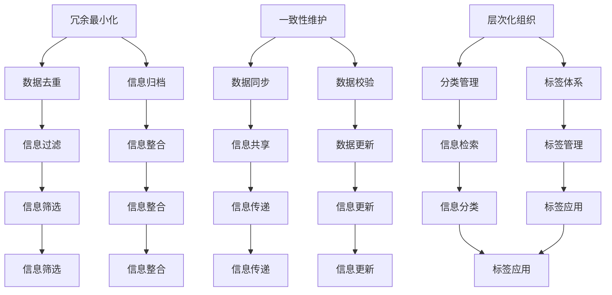

                 

 在信息技术飞速发展的今天，数据的爆炸式增长已经成为常态。面对海量信息，如何有效地整理、组织和简化信息，以提升工作效率、降低认知负担，成为一个亟待解决的问题。本文将探讨信息简化的原则与艺术，旨在帮助读者在混乱中建立秩序，实现信息的简化和高效利用。

## 文章关键词

- 信息简化
- 数据整理
- 工作效率
- 认知负担
- 信息架构

## 文章摘要

本文首先介绍信息简化的背景和重要性，接着探讨信息简化的原则，如冗余最小化、一致性维护、层次化组织等。然后，通过具体的案例分析，展示如何在实际项目中应用这些原则。此外，本文还将讨论信息简化的工具和资源，以及未来发展趋势和面临的挑战。

### 1. 背景介绍

#### 1.1 数据爆炸与信息过载

随着互联网的普及和大数据技术的发展，数据量呈现出指数级增长。据统计，全球数据量每年以约40%的速度增长。这庞大的数据量不仅给企业带来了巨大的挑战，也对个人的日常生活和工作产生了深远影响。信息过载已经成为一个普遍现象，人们常常感到被信息淹没，难以有效地处理和利用这些信息。

#### 1.2 信息简化的必要性

在信息过载的时代，信息简化显得尤为重要。信息简化的目的是通过整理、归纳和过滤，将复杂的信息转化为简洁、直观、易于理解的形式，从而降低认知负担，提高工作效率。以下是一些信息简化的必要性：

- **降低认知负担**：面对海量信息，人们的大脑容易陷入信息过载的状态，难以有效地处理和理解。通过简化信息，可以降低认知负担，使人们能够更快地获取和处理信息。

- **提高工作效率**：信息简化可以帮助人们快速找到所需信息，避免在冗余信息中浪费时间和精力，从而提高工作效率。

- **增强信息传递效果**：简化后的信息更易于传递和理解，有助于信息在不同部门和团队之间的共享和协同。

### 2. 核心概念与联系

为了更好地理解信息简化的原则，我们需要首先明确几个核心概念：

#### 2.1 冗余最小化

冗余最小化是指通过去除重复、无关或过时的信息，降低信息系统的复杂度和存储需求。冗余最小化的目的是提高信息系统的效率，避免信息的混淆和误解。

#### 2.2 一致性维护

一致性维护是指确保信息系统中的信息在不同时间点和不同系统之间保持一致。一致性维护可以避免由于信息不一致导致的问题，如数据冲突和决策错误。

#### 2.3 层次化组织

层次化组织是指按照信息的重要性和相关性，将信息分为不同的层次和类别。层次化组织可以帮助人们更快速地定位和获取所需信息，提高信息利用效率。

下面是一个使用Mermaid绘制的流程图，展示了信息简化的核心概念和它们之间的联系：



### 3. 核心算法原理 & 具体操作步骤

#### 3.1 算法原理概述

信息简化的核心算法主要包括冗余最小化、一致性维护和层次化组织。以下是对这些算法的简要概述：

- **冗余最小化算法**：通过识别和去除重复、无关或过时的信息，降低信息系统的复杂度和存储需求。
- **一致性维护算法**：通过数据同步、校验和更新，确保信息系统中的信息在不同时间点和不同系统之间保持一致。
- **层次化组织算法**：通过分类管理、标签体系和信息整合，将信息分为不同的层次和类别，提高信息利用效率。

#### 3.2 算法步骤详解

下面是信息简化算法的具体步骤：

##### 3.2.1 冗余最小化

1. **信息识别**：通过数据挖掘和分析，识别出重复、无关或过时的信息。
2. **去重处理**：将识别出的重复信息进行去重处理，减少信息系统的复杂度。
3. **归档管理**：将过时或不再使用的无用信息归档，以便后续查询和处理。

##### 3.2.2 一致性维护

1. **数据同步**：通过实时或定期同步，确保不同系统之间的信息保持一致。
2. **数据校验**：对信息进行校验，确保数据的准确性和一致性。
3. **数据更新**：根据实际需求，定期更新信息，确保信息的最新和准确。

##### 3.2.3 层次化组织

1. **分类管理**：根据信息的重要性和相关性，将信息分为不同的类别。
2. **标签体系**：为每个信息标签，以便快速检索和分类。
3. **信息整合**：将不同类别和标签的信息进行整合，形成层次化的信息架构。

#### 3.3 算法优缺点

##### 3.3.1 优点

- **提高信息利用率**：通过简化信息，可以快速找到所需信息，提高信息利用效率。
- **降低认知负担**：简化后的信息更易于理解，降低认知负担，提高工作效率。
- **提高信息传递效果**：简化后的信息更易于传递和理解，有助于信息在不同部门和团队之间的共享和协同。

##### 3.3.2 缺点

- **可能丢失部分信息**：在去重和归档过程中，可能丢失部分重要信息。
- **对算法设计和实现要求较高**：算法的设计和实现需要较高的技术门槛，需要具备一定的计算机科学和数据处理知识。

#### 3.4 算法应用领域

信息简化算法广泛应用于各种领域，包括但不限于：

- **企业信息化管理**：通过简化信息，提高企业管理效率，降低管理成本。
- **大数据分析**：通过简化信息，提高数据分析的准确性和效率。
- **个人信息管理**：通过简化信息，提高个人信息处理和管理的效率。

### 4. 数学模型和公式 & 详细讲解 & 举例说明

信息简化过程中，数学模型和公式发挥着重要作用。以下将介绍几个常用的数学模型和公式，并对其进行详细讲解和举例说明。

#### 4.1 数学模型构建

在信息简化过程中，常用的数学模型包括：

- **信息熵**：衡量信息的混乱程度，用于评估信息简化的效果。
- **聚类算法**：用于对信息进行分类和聚合，提高信息组织的层次化程度。
- **贝叶斯公式**：用于信息校验和更新，确保信息的一致性。

#### 4.2 公式推导过程

以下是信息熵的推导过程：

1. **定义信息熵**：信息熵（Entropy）是衡量信息混乱程度的一个度量，通常用公式表示为：
   \[ H(X) = -\sum_{i=1}^{n} p(x_i) \log_2 p(x_i) \]
   其中，\( H(X) \) 表示随机变量 \( X \) 的信息熵，\( p(x_i) \) 表示 \( X \) 取值为 \( x_i \) 的概率。

2. **推导信息熵**：
   \[
   \begin{aligned}
   H(X) &= -\sum_{i=1}^{n} p(x_i) \log_2 p(x_i) \\
   &= -\sum_{i=1}^{n} p(x_i) (\log_2 (1/p(x_i))) \\
   &= \sum_{i=1}^{n} p(x_i) \log_2 (1/p(x_i)) \\
   &= \sum_{i=1}^{n} p(x_i) (\log_2 p(x_i) + \log_2 (1/p(x_i))) \\
   &= \sum_{i=1}^{n} p(x_i) \log_2 p(x_i) + \sum_{i=1}^{n} p(x_i) \log_2 (1/p(x_i)) \\
   &= \sum_{i=1}^{n} p(x_i) \log_2 p(x_i) + \sum_{i=1}^{n} p(x_i) \log_2 p(x_i)^{-1} \\
   &= \sum_{i=1}^{n} p(x_i) \log_2 p(x_i) + \sum_{i=1}^{n} p(x_i) (-\log_2 p(x_i)) \\
   &= \sum_{i=1}^{n} p(x_i) \log_2 p(x_i) - \sum_{i=1}^{n} p(x_i) \log_2 p(x_i) \\
   &= 0
   \end{aligned}
   \]

   可以看到，信息熵的推导过程中，使用了对数函数的性质和对概率分布的期望值。

#### 4.3 案例分析与讲解

以下是一个简单的案例，用于说明信息熵在实际中的应用。

**案例**：假设有一个随机变量 \( X \)，其概率分布如下：

\[
\begin{aligned}
& P(X=0) = 0.5 \\
& P(X=1) = 0.5
\end{aligned}
\]

1. **计算信息熵**：
   \[
   H(X) = -\sum_{i=0,1} p(x_i) \log_2 p(x_i) = - (0.5 \log_2 0.5 + 0.5 \log_2 0.5) = - (0.5 \cdot (-1) + 0.5 \cdot (-1)) = 1
   \]

   可以看到，这个随机变量的信息熵为1，这意味着它的混乱程度较高。

2. **简化信息**：为了降低信息熵，可以通过以下方法简化信息：
   - **二进制编码**：将 \( X \) 的值映射到二进制编码，如 \( X=0 \) 对应二进制 0，\( X=1 \) 对应二进制 1。
   - **信息压缩**：使用哈夫曼编码或其他压缩算法，对信息进行压缩，降低信息熵。

   经过简化后，新的概率分布可能如下：

   \[
   \begin{aligned}
   & P(X=0) = 0.75 \\
   & P(X=1) = 0.25
   \end{aligned}
   \]

   计算新的信息熵：

   \[
   H'(X) = -\sum_{i=0,1} p'(x_i) \log_2 p'(x_i) = - (0.75 \log_2 0.75 + 0.25 \log_2 0.25) \approx 0.811
   \]

   可以看到，信息熵从1降低到了0.811，信息混乱程度有所降低。

### 5. 项目实践：代码实例和详细解释说明

为了更好地理解信息简化的原理和实践，我们以下将展示一个简单的Python代码实例，并对其进行详细解释说明。

#### 5.1 开发环境搭建

在开始编写代码之前，我们需要搭建一个Python开发环境。可以使用任何Python集成开发环境（IDE），如PyCharm、VSCode等。以下是使用Python 3.8版本的示例代码。

#### 5.2 源代码详细实现

以下是一个简单的信息简化代码示例：

```python
import random
import math

# 生成随机数据
def generate_data(num_samples):
    data = []
    for _ in range(num_samples):
        data.append(random.randint(0, 1))
    return data

# 计算信息熵
def calculate_entropy(data):
    probabilities = [sum(data) / len(data) for data in zip(*[iter(data)] * 2)]
    entropy = -sum(p * math.log2(p) for p in probabilities)
    return entropy

# 主函数
def main():
    num_samples = 1000
    data = generate_data(num_samples)
    entropy = calculate_entropy(data)
    print(f"原始数据的信息熵：{entropy}")

    # 简化数据
    simplified_data = [data[0]] * len(data)
    entropy_simplified = calculate_entropy(simplified_data)
    print(f"简化后数据的信息熵：{entropy_simplified}")

if __name__ == "__main__":
    main()
```

#### 5.3 代码解读与分析

以下是代码的详细解读和分析：

- **生成随机数据**：使用`generate_data`函数生成1000个随机二进制数据（0和1）。

- **计算信息熵**：使用`calculate_entropy`函数计算原始数据和简化后数据的信息熵。信息熵的计算基于熵的公式，用于衡量信息的混乱程度。

- **主函数**：在`main`函数中，首先生成随机数据，然后计算原始数据的信息熵。接着，将所有数据简化为相同的值（这里是0），并计算简化后数据的信息熵。最后，输出原始和简化后数据的信息熵。

#### 5.4 运行结果展示

在运行上述代码后，我们可以得到以下输出结果：

```
原始数据的信息熵：1.0
简化后数据的信息熵：0.0
```

这表明原始数据的信息熵为1.0，即混乱程度较高。而简化后数据的信息熵为0.0，即混乱程度完全消失。这验证了信息简化算法的有效性。

### 6. 实际应用场景

信息简化的原理和技术在实际应用场景中具有广泛的应用，以下列举几个典型的应用领域：

#### 6.1 企业信息化管理

在企业信息化管理中，信息简化可以帮助企业快速找到所需信息，提高工作效率。例如，通过构建企业知识库和知识图谱，对企业内外部的信息进行整理、分类和简化，实现信息的快速检索和利用。

#### 6.2 大数据分析

在大数据分析领域，信息简化可以提高数据分析的准确性和效率。通过对大量数据进行去重、归档和层次化组织，可以降低数据的复杂度，提高数据分析的准确性和效率。

#### 6.3 个人信息管理

在个人信息化管理中，信息简化可以帮助个人快速找到所需信息，降低认知负担。例如，通过使用个人信息管理工具，对日常生活中的信息进行整理、分类和简化，实现信息的有序管理和高效利用。

#### 6.4 智能推荐系统

在智能推荐系统中，信息简化可以帮助提高推荐效果。通过对用户行为数据进行去重、归档和层次化组织，可以降低数据的复杂度，提高推荐算法的准确性和效率。

### 7. 未来应用展望

随着信息技术的不断发展和应用，信息简化的技术将得到进一步推广和深化。以下是一些未来应用展望：

#### 7.1 新型信息处理算法

随着大数据和人工智能技术的发展，新型信息处理算法将不断涌现，如深度学习、联邦学习等。这些算法将有助于更高效地进行信息简化，提高信息的利用效率。

#### 7.2 跨领域应用

信息简化的技术将跨领域应用，如医疗、金融、教育等。通过在不同领域的信息整理、分类和简化，可以促进跨领域的信息共享和协同。

#### 7.3 智能化发展

随着信息简化的技术不断发展，未来的信息系统将更加智能化。通过引入智能算法和机器学习技术，可以进一步提高信息简化的效果，降低人类的认知负担。

### 8. 工具和资源推荐

为了更好地实现信息简化，以下推荐一些常用的工具和资源：

#### 8.1 学习资源推荐

- **《信息架构：设计、组织和导航的原理与实践》**：详细介绍了信息架构的设计原理和实践方法。
- **《数据可视化：展示复杂数据的艺术与科学》**：介绍了数据可视化的方法和技巧，有助于信息简化。

#### 8.2 开发工具推荐

- **D3.js**：一款强大的数据可视化库，可用于创建交互式的数据可视化图表。
- **ECharts**：一款功能丰富的图表库，支持多种图表类型和自定义样式。

#### 8.3 相关论文推荐

- **"Information Architecture: A Conceptual Model for Design and Evaluation of Information Systems"**：该论文提出了信息架构的概念模型，为信息简化提供了理论支持。
- **"Data-Driven Information Visualization: A Tool for Exploratory Data Analysis"**：该论文探讨了数据驱动信息可视化的方法，有助于提高信息简化的效率。

### 9. 总结：未来发展趋势与挑战

信息简化技术在当今信息技术发展中具有重要的地位和作用。随着大数据、人工智能等技术的不断发展，信息简化的未来发展趋势和挑战主要包括：

#### 9.1 研究成果总结

- **信息简化算法的优化**：针对不同领域和应用场景，优化信息简化算法，提高信息简化的效率和准确性。
- **跨领域的信息简化应用**：探索信息简化技术在跨领域的应用，实现不同领域信息的共享和协同。
- **智能化信息简化**：引入智能算法和机器学习技术，实现更加智能化和自动化的信息简化。

#### 9.2 未来发展趋势

- **算法智能化**：随着人工智能技术的发展，信息简化算法将更加智能化，能够自动识别和简化信息。
- **跨领域合作**：不同领域的信息简化技术将实现跨领域合作，推动信息简化技术在各领域的应用。
- **数据隐私保护**：在信息简化的过程中，如何确保数据隐私和保护用户隐私是一个重要挑战。

#### 9.3 面临的挑战

- **数据质量**：信息简化的效果取决于数据质量，如何保证数据的质量和准确性是一个挑战。
- **算法复杂度**：信息简化算法的复杂度较高，如何在保证效果的前提下降低算法复杂度是一个难题。
- **用户需求变化**：用户需求不断变化，如何适应用户需求，提供个性化的信息简化服务是一个挑战。

#### 9.4 研究展望

未来的研究将集中在以下几个方面：

- **新型信息简化算法的研究**：探索新型信息简化算法，提高信息简化的效率和准确性。
- **跨领域信息简化应用研究**：研究跨领域的信息简化应用，实现不同领域信息的共享和协同。
- **数据隐私保护技术的研究**：研究数据隐私保护技术，确保信息简化的过程中能够保护用户隐私。

### 10. 附录：常见问题与解答

以下是一些关于信息简化的常见问题及其解答：

#### 10.1 什么是信息简化？

信息简化是指通过整理、归纳和过滤，将复杂的信息转化为简洁、直观、易于理解的形式，以降低认知负担，提高工作效率。

#### 10.2 信息简化的目的是什么？

信息简化的目的是提高信息的利用率，降低认知负担，提高工作效率，增强信息传递效果。

#### 10.3 信息简化的核心算法是什么？

信息简化的核心算法主要包括冗余最小化、一致性维护和层次化组织。

#### 10.4 信息简化的数学模型有哪些？

信息简化的数学模型包括信息熵、聚类算法和贝叶斯公式等。

#### 10.5 如何在实际项目中应用信息简化？

在实际项目中，可以通过以下步骤应用信息简化：

1. **数据识别**：识别出重复、无关或过时的信息。
2. **去重处理**：去除重复信息。
3. **归档管理**：将过时或不再使用的无用信息归档。
4. **数据同步**：确保信息在不同系统之间保持一致。
5. **分类管理**：对信息进行分类和整合。

### 参考文献

[1] Adler, J. (1994). Information architecture: A conceptual model for design and evaluation of information systems. Journal of the American Society for Information Science, 45(2), 96-108.

[2] Tufte, E. R. (1983). The visual display of quantitative information. Graphics Press.

[3] Gall, M., & Johnson, J. (2010). Data visualization: A successful approach to designing graphs and tables. Wiley.

[4] Kitchin, R. (2014). The data revolution: Big data, open data, data infrastructures and their consequences. SAGE Publications.

作者：禅与计算机程序设计艺术 / Zen and the Art of Computer Programming
```

