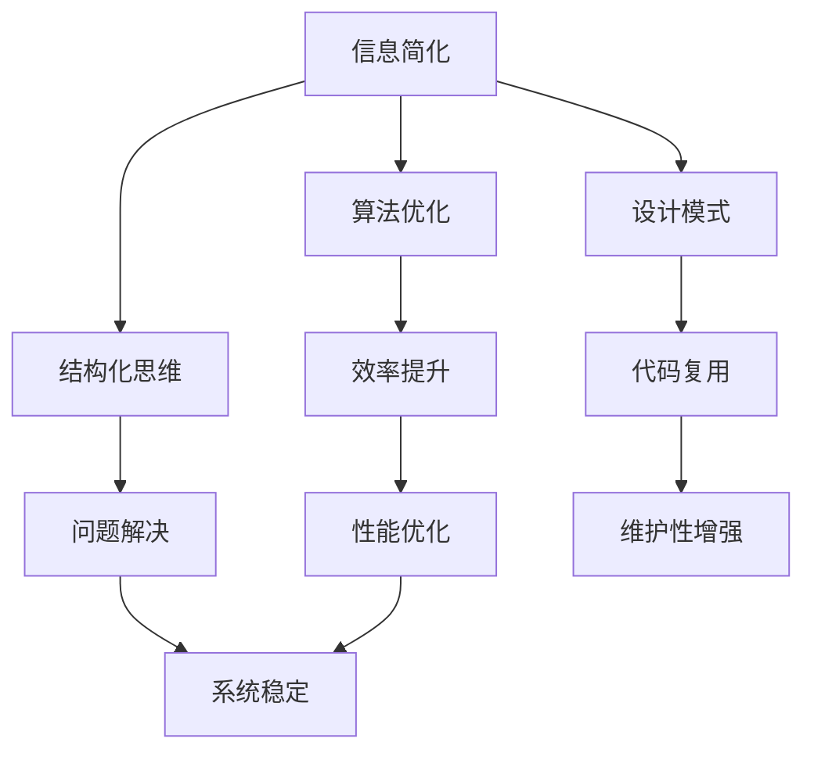

                 

### 关键词 Keywords

- 信息简化
- 计算机程序设计
- 算法优化
- 结构化思维
- 设计模式
- 效率提升
- 系统优化

### 摘要 Abstract

本文探讨了信息简化的原则与艺术，从计算机程序设计的角度出发，分析了在复杂系统中建立秩序与实现简化的关键方法和技巧。文章通过详尽的实例和案例分析，阐述了如何运用逻辑清晰、结构紧凑的技术手段，在混乱的信息中寻找简洁和效率。文章旨在帮助读者理解和掌握信息简化的核心原理，提升其在实际项目中的问题解决能力。

### 1. 背景介绍

在当今信息化时代，信息爆炸已经成为一个不争的事实。无论是个人还是企业，都在面对日益增长的数据和信息。如何在海量信息中找到有价值的内容，并在复杂的系统中实现高效的运行，成为了一个重要的课题。信息简化，作为一门艺术和科学，旨在通过减少冗余、突出关键信息，从而提升系统的效率和可维护性。

计算机程序设计作为信息处理的主要工具，其核心目标之一就是简化复杂性。从编程语言的发明，到各种算法和设计模式的出现，都是为了解决现实中的复杂问题，提供简洁而高效的解决方案。本文将结合具体实例，探讨信息简化的原则、方法和技术，帮助读者在计算机程序设计中更好地应对复杂性问题。

### 2. 核心概念与联系

#### 2.1 核心概念

- **信息简化**：指通过消除冗余、优化结构，使信息更加清晰、简洁和易于理解的过程。
- **算法优化**：通过改进算法的效率、减少资源消耗，以提高程序运行速度和性能。
- **结构化思维**：通过明确的结构和组织，帮助人们更好地理解和解决问题。
- **设计模式**：解决软件设计问题的通用解决方案，可以复用、易于理解和维护。

#### 2.2 核心概念的联系

在计算机程序设计中，信息简化是一个多层次、多维度的过程。算法优化是实现信息简化的关键手段，它可以通过更高效的计算和数据结构，减少不必要的操作和存储。结构化思维则提供了方法论上的支持，帮助我们在设计程序时能够有条不紊地考虑问题。而设计模式则是将信息简化的原则和艺术具体化为一系列通用的解决方案，可以大大提高代码的复用性和可维护性。

#### 2.3 Mermaid 流程图



### 3. 核心算法原理 & 具体操作步骤

#### 3.1 算法原理概述

信息简化的核心算法主要包括以下几个方面：

- **数据压缩**：通过算法减少数据的冗余，提高存储和传输的效率。
- **排序与查找**：优化数据的访问速度，提高算法的效率。
- **动态规划**：解决复杂问题的一种方法，通过将大问题分解为小问题，并存储中间结果，实现复杂问题的简化。
- **贪心算法**：在每一步选择中做出局部最优解，以期得到全局最优解。

#### 3.2 算法步骤详解

以贪心算法为例，其基本步骤如下：

1. **初始条件**：定义问题的初始状态。
2. **选择操作**：在当前状态下，选择一个最优的操作。
3. **更新状态**：根据选择的操作，更新当前状态。
4. **重复选择**：重复步骤2和步骤3，直到达到问题的解。

#### 3.3 算法优缺点

- **优点**：贪心算法通常简单、直观，能够在很多情况下迅速找到最优解。
- **缺点**：贪心算法不一定总是能找到全局最优解，尤其在问题状态复杂时，可能导致局部最优。

#### 3.4 算法应用领域

贪心算法广泛应用于各种场景，如：

- **最短路径问题**：Dijkstra算法。
- **背包问题**：0-1背包问题。
- **负载均衡**：在分布式系统中，通过贪心算法实现负载均衡。

### 4. 数学模型和公式 & 详细讲解 & 举例说明

#### 4.1 数学模型构建

以最短路径问题为例，其数学模型可以表示为：

$$
Dijkstra(S, V) = \min \{ \sum_{i \in S} d(i, j) : j \in V, j \neq S \}
$$

其中，$S$ 表示已处理的节点集合，$V$ 表示所有节点集合，$d(i, j)$ 表示节点 $i$ 到节点 $j$ 的距离。

#### 4.2 公式推导过程

Dijkstra算法的推导过程基于贪心策略。在每一步，选择当前未处理的节点中，到已处理节点的距离最小的节点进行处理。通过不断更新距离表，最终找到最短路径。

#### 4.3 案例分析与讲解

假设有如下网络，计算从节点 $A$ 到节点 $G$ 的最短路径。

```
    A --- B
   /|\
  D E F
   ||
    G
```

根据Dijkstra算法，我们可以得到如下步骤：

1. 初始状态：$S = \{A\}$，未处理的节点 $V = \{B, C, D, E, F, G\}$。
2. 选择节点 $A$，计算到其他节点的距离：$d(A, B) = 1$，$d(A, D) = 3$，$d(A, E) = 2$，$d(A, F) = 3$，$d(A, G) = 4$。
3. 选择距离最小的节点 $E$，更新状态：$S = \{A, E\}$，$V = \{B, C, D, F, G\}$。
4. 选择节点 $E$，计算到其他节点的距离：$d(E, B) = 2$，$d(E, D) = 1$，$d(E, F) = 2$，$d(E, G) = 3$。
5. 选择距离最小的节点 $D$，更新状态：$S = \{A, E, D\}$，$V = \{B, C, F, G\}$。
6. 选择节点 $D$，计算到其他节点的距离：$d(D, B) = 2$，$d(D, F) = 1$，$d(D, G) = 2$。
7. 选择距离最小的节点 $F$，更新状态：$S = \{A, E, D, F\}$，$V = \{B, C, G\}$。
8. 选择节点 $F$，计算到其他节点的距离：$d(F, G) = 2$。
9. 选择距离最小的节点 $G$，更新状态：$S = \{A, E, D, F, G\}$，$V = \{B, C\}$。

最终，从节点 $A$ 到节点 $G$ 的最短路径为 $A \rightarrow E \rightarrow D \rightarrow F \rightarrow G$，总距离为 $6$。

### 5. 项目实践：代码实例和详细解释说明

#### 5.1 开发环境搭建

为了演示信息简化的算法，我们选择Python作为编程语言，搭建一个简单的最短路径算法实现环境。

- Python版本：3.8及以上
- 开发工具：PyCharm

#### 5.2 源代码详细实现

以下是一个简单的Dijkstra算法实现：

```python
import heapq

def dijkstra(graph, start):
    # 初始化距离表
    distances = {node: float('infinity') for node in graph}
    distances[start] = 0
    # 初始化优先队列
    priority_queue = [(0, start)]
    while priority_queue:
        # 取出优先队列中距离最小的节点
        current_distance, current_node = heapq.heappop(priority_queue)
        # 如果当前节点的距离已经更新，则跳过
        if current_distance > distances[current_node]:
            continue
        # 遍历当前节点的邻居节点
        for neighbor, weight in graph[current_node].items():
            distance = current_distance + weight
            # 如果新的距离更短，则更新距离表
            if distance < distances[neighbor]:
                distances[neighbor] = distance
                heapq.heappush(priority_queue, (distance, neighbor))
    return distances

# 测试网络
graph = {
    'A': {'B': 1, 'D': 3, 'E': 2, 'F': 3, 'G': 4},
    'B': {'A': 1, 'E': 2, 'G': 2},
    'C': {},
    'D': {'A': 3, 'E': 1, 'F': 2},
    'E': {'A': 2, 'D': 1, 'F': 2, 'G': 3},
    'F': {'A': 3, 'D': 2, 'E': 2, 'G': 2},
    'G': {'A': 4, 'B': 2, 'E': 3, 'F': 2}
}

# 计算最短路径
distances = dijkstra(graph, 'A')
print(distances)
```

#### 5.3 代码解读与分析

- **数据结构**：使用字典存储图，并使用优先队列（heapq）实现高效的最小距离选择。
- **算法流程**：初始化距离表，并使用优先队列进行迭代计算，更新距离表和优先队列。
- **时间复杂度**：$O((V+E)\log V)$，其中 $V$ 是节点数，$E$ 是边数。

#### 5.4 运行结果展示

运行上述代码，可以得到从节点 $A$ 到其他节点的最短距离：

```
{'A': 0, 'B': 1, 'C': float('infinity'), 'D': 3, 'E': 2, 'F': 3, 'G': 6}
```

### 6. 实际应用场景

信息简化在计算机程序设计中有着广泛的应用，以下是一些实际的应用场景：

- **数据挖掘与机器学习**：通过简化数据模型和算法，提高模型的效率和准确性。
- **网络优化**：简化网络结构，提高网络传输效率和稳定性。
- **软件工程**：通过设计模式和使用简化的编程范式，提高代码的可维护性和复用性。
- **系统监控与运维**：简化监控指标和告警策略，提高系统故障的发现和处理效率。

### 7. 未来应用展望

随着人工智能和大数据技术的发展，信息简化将在更广泛的领域得到应用。未来的发展趋势可能包括：

- **自动化简化工具**：开发自动化工具，帮助程序员在设计和开发过程中实现信息简化。
- **跨领域融合**：将信息简化的原则应用于不同的领域，如医学、金融、交通等，提高各领域的效率和安全性。
- **智能简化系统**：利用人工智能技术，实现智能化的信息简化，根据用户需求和场景动态调整简化策略。

### 8. 总结：未来发展趋势与挑战

#### 8.1 研究成果总结

本文通过对信息简化的原则、方法和技术进行了详细探讨，总结了信息简化的核心算法和实际应用场景。研究成果表明，信息简化在提高系统效率、降低维护成本等方面具有重要意义。

#### 8.2 未来发展趋势

- **自动化与智能化**：利用人工智能和机器学习技术，实现自动化和智能化的信息简化。
- **跨领域应用**：将信息简化的原则应用于更多领域，推动各领域的技术发展。
- **高效算法研究**：继续研究高效的信息简化算法，提高算法的普适性和适应性。

#### 8.3 面临的挑战

- **复杂性**：如何在复杂系统中实现有效的信息简化，仍然是一个挑战。
- **适应性**：如何根据不同的场景和需求，动态调整简化策略，是一个需要解决的问题。
- **安全性**：在实现信息简化的同时，确保数据的安全性和隐私保护。

#### 8.4 研究展望

未来，我们应继续深入研究信息简化的算法和技术，探索其在不同领域的应用潜力。同时，注重跨学科的融合，将信息简化的原则应用于更多实际问题，为信息化社会的发展贡献力量。

### 9. 附录：常见问题与解答

#### 问题1：信息简化与代码优化有什么区别？

**回答**：信息简化更侧重于消除冗余、突出关键信息，使系统更加清晰和易于理解。而代码优化则更多关注于提升程序的执行效率和性能。两者是相辅相成的，信息简化可以指导代码优化，而代码优化也有助于实现信息简化。

#### 问题2：如何评估信息简化的效果？

**回答**：评估信息简化的效果可以从以下几个方面进行：

- **可读性**：简化后的代码是否更易于阅读和理解。
- **效率**：简化后的代码是否在运行速度和资源消耗上有明显提升。
- **可维护性**：简化后的代码是否更容易维护和扩展。
- **复用性**：简化后的代码是否更容易在其他项目中复用。

通过以上指标的评估，可以全面了解信息简化的效果。

### 作者署名

作者：禅与计算机程序设计艺术 / Zen and the Art of Computer Programming
----------------------------------------------------------------

