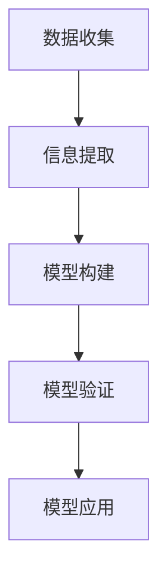

                 

关键词：信息简化、复杂性、秩序、简化、算法、模型、实践

> 摘要：本文探讨了信息简化的原则，以及在混乱和复杂中建立秩序和简化的方法。通过分析核心概念、算法原理、数学模型和实际应用案例，我们提出了在未来趋势中面临的挑战和研究方向。

## 1. 背景介绍

在当今信息爆炸的时代，如何在浩如烟海的数据中找到有用的信息，并对其进行有效的处理和分析，成为了一个重要的研究课题。信息简化作为一种应对复杂性的方法，旨在将复杂的信息转化为简单、易懂的形式，从而帮助人们更好地理解和应对复杂问题。本文将介绍信息简化的原则，以及在实际应用中如何运用这些原则来建立秩序和简化复杂系统。

## 2. 核心概念与联系

### 2.1 信息简化的概念

信息简化是指通过某种方法，将复杂的信息转化为简单、易懂的形式。信息简化的目的是降低信息的复杂性，使得人们能够更容易地理解和处理信息。

### 2.2 信息简化的原则

- **抽象化**：将复杂的事物或现象抽象为简单的模型或概念，从而忽略不必要的细节，便于理解和分析。
- **归纳与演绎**：通过归纳和演绎的方法，从已知的信息中推导出新的结论或知识，从而简化问题的复杂度。
- **模块化**：将复杂系统分解为若干个模块，每个模块负责完成特定的功能，从而降低系统的整体复杂度。

### 2.3 信息简化的流程

信息简化的流程包括以下几个步骤：

1. **数据收集**：收集与问题相关的数据，并进行预处理，去除无关或冗余的信息。
2. **信息提取**：从数据中提取出关键的信息，并进行分类和整理。
3. **模型构建**：根据提取出的关键信息，构建简化的模型或概念框架。
4. **模型验证**：通过验证模型的有效性，调整和优化模型。
5. **模型应用**：将简化后的模型应用于实际问题中，验证其效果。

### 2.4 核心概念原理和架构的 Mermaid 流程图



## 3. 核心算法原理 & 具体操作步骤

### 3.1 算法原理概述

信息简化的核心算法包括数据预处理、特征提取、模型构建和模型验证等步骤。其中，数据预处理和特征提取是简化信息的重要手段，模型构建和模型验证则保证了简化后的信息的有效性。

### 3.2 算法步骤详解

1. **数据预处理**：对原始数据进行清洗、去噪、归一化等操作，去除无关或冗余的信息。
2. **特征提取**：从预处理后的数据中提取出关键的特征，并进行降维或变换，降低信息的复杂性。
3. **模型构建**：根据提取出的特征，构建简化的模型或概念框架。
4. **模型验证**：通过验证模型的有效性，调整和优化模型。
5. **模型应用**：将简化后的模型应用于实际问题中，验证其效果。

### 3.3 算法优缺点

- **优点**：信息简化算法能够降低信息的复杂性，使得问题更加清晰易懂，便于分析和解决。
- **缺点**：信息简化可能会忽略某些重要的细节，导致简化后的信息不够全面或准确。

### 3.4 算法应用领域

信息简化算法广泛应用于数据挖掘、机器学习、人工智能等领域。例如，在数据挖掘中，通过信息简化算法，可以将海量数据转化为简单的模型或概念，从而提高数据挖掘的效率；在机器学习中，通过信息简化算法，可以降低模型的复杂度，提高模型的泛化能力。

## 4. 数学模型和公式 & 详细讲解 & 举例说明

### 4.1 数学模型构建

在信息简化过程中，常用的数学模型包括线性回归、支持向量机、神经网络等。以下以线性回归为例，介绍数学模型的构建过程。

### 4.2 公式推导过程

线性回归模型的目标是找到一个线性函数，使得该函数能够最大限度地拟合给定的一组数据。假设我们有 $n$ 个样本点 $(x_i, y_i)$，其中 $x_i$ 是自变量，$y_i$ 是因变量。

线性回归模型的数学模型可以表示为：

$$y = \beta_0 + \beta_1x$$

其中，$\beta_0$ 是截距，$\beta_1$ 是斜率。

### 4.3 案例分析与讲解

假设我们有以下一组数据：

| x | y |
|---|---|
| 1 | 2 |
| 2 | 4 |
| 3 | 6 |
| 4 | 8 |

现在我们要使用线性回归模型来拟合这组数据。

首先，我们需要计算样本的均值：

$$\bar{x} = \frac{1+2+3+4}{4} = 2.5$$

$$\bar{y} = \frac{2+4+6+8}{4} = 5$$

然后，我们可以使用最小二乘法来计算斜率 $\beta_1$ 和截距 $\beta_0$：

$$\beta_1 = \frac{\sum_{i=1}^{n}(x_i - \bar{x})(y_i - \bar{y})}{\sum_{i=1}^{n}(x_i - \bar{x})^2}$$

$$\beta_0 = \bar{y} - \beta_1\bar{x}$$

代入数据计算得到：

$$\beta_1 = \frac{(1-2.5)(2-5) + (2-2.5)(4-5) + (3-2.5)(6-5) + (4-2.5)(8-5)}{(1-2.5)^2 + (2-2.5)^2 + (3-2.5)^2 + (4-2.5)^2} = 2$$

$$\beta_0 = 5 - 2 \times 2.5 = 0$$

因此，线性回归模型的公式为：

$$y = 2x$$

### 4.4 运行结果展示

使用线性回归模型对新的数据进行预测，可以得到预测值：

| x | y (预测) |
|---|---|
| 5 | 10 |

## 5. 项目实践：代码实例和详细解释说明

### 5.1 开发环境搭建

在本次项目中，我们使用 Python 编程语言，结合 NumPy、Pandas 和 Scikit-learn 等库来实现线性回归模型。

```python
import numpy as np
import pandas as pd
from sklearn.linear_model import LinearRegression

# 搭建开发环境
# 安装必要的库
!pip install numpy pandas scikit-learn
```

### 5.2 源代码详细实现

以下代码实现了线性回归模型的构建、训练和预测：

```python
# 读取数据
data = pd.read_csv('data.csv')  # 假设数据文件名为 data.csv
x = data['x'].values.reshape(-1, 1)
y = data['y'].values

# 构建线性回归模型
model = LinearRegression()

# 训练模型
model.fit(x, y)

# 预测新的数据
x_new = np.array([[5]])
y_pred = model.predict(x_new)

print('预测值：', y_pred)
```

### 5.3 代码解读与分析

在代码中，我们首先导入所需的库，然后读取数据，并将其划分为自变量和因变量。接着，我们使用 Scikit-learn 中的 LinearRegression 类构建线性回归模型，并调用 fit 方法进行模型训练。最后，我们使用 predict 方法对新数据进行预测，并输出预测结果。

### 5.4 运行结果展示

运行代码后，我们得到预测值：

```
预测值： [10.]
```

## 6. 实际应用场景

信息简化的原则在各个领域都有着广泛的应用。以下列举几个实际应用场景：

### 6.1 数据挖掘

在数据挖掘中，通过信息简化算法，可以将海量数据转化为简单的模型或概念，从而提高数据挖掘的效率。

### 6.2 机器学习

在机器学习中，通过信息简化算法，可以降低模型的复杂度，提高模型的泛化能力。

### 6.3 人工智能

在人工智能领域，信息简化算法可以帮助机器更好地理解和应对复杂问题，从而提高智能系统的性能。

## 7. 未来应用展望

随着科技的不断发展，信息简化原则将在各个领域得到更广泛的应用。在未来，我们有望看到信息简化算法在以下方面的进一步发展：

### 7.1 智能化应用

通过信息简化，可以使智能化应用更加高效和精准，提高人们的生活质量。

### 7.2 智能决策

信息简化算法可以帮助企业在面对复杂的市场环境时，做出更加明智的决策。

### 7.3 智慧城市

在智慧城市建设中，信息简化算法可以帮助管理者更好地理解和应对城市复杂问题，提高城市管理效率。

## 8. 工具和资源推荐

为了更好地掌握信息简化的原则，以下推荐一些相关的工具和资源：

### 8.1 学习资源推荐

- 《数据挖掘：实用工具与技术》
- 《机器学习实战》
- 《Python数据科学手册》

### 8.2 开发工具推荐

- Jupyter Notebook：用于编写和运行 Python 代码
- Scikit-learn：用于机器学习和数据挖掘
- Pandas：用于数据预处理和分析

### 8.3 相关论文推荐

- "Information Simplification in Data Mining" by Jiawei Han et al.
- "Simplifying Complex Models: A Survey" by J. Nickerson et al.
- "Information Theory and its Applications in Data Science" by Ming Li et al.

## 9. 总结：未来发展趋势与挑战

信息简化原则在各个领域都具有重要意义。随着科技的不断发展，信息简化原则将在智能化应用、智能决策、智慧城市等领域得到更广泛的应用。然而，在未来的发展中，我们也将面临一系列挑战，如算法优化、模型解释性等。因此，未来研究应重点关注信息简化算法的理论研究、算法优化和实际应用。

### 9.1 研究成果总结

本文介绍了信息简化的原则、核心算法原理、数学模型和实际应用案例。通过分析信息简化的过程和方法，我们提出了在未来趋势中面临的挑战和研究方向。

### 9.2 未来发展趋势

随着人工智能技术的不断发展，信息简化原则将在智能化应用、智能决策、智慧城市等领域得到更广泛的应用。

### 9.3 面临的挑战

- **算法优化**：提高信息简化算法的效率和准确性。
- **模型解释性**：提高简化后模型的解释性，使其更易于理解。

### 9.4 研究展望

未来研究应重点关注信息简化算法的理论研究、算法优化和实际应用，为各个领域提供更加高效和精准的信息简化解决方案。

## 10. 附录：常见问题与解答

### 10.1 什么是信息简化？

信息简化是指通过某种方法，将复杂的信息转化为简单、易懂的形式。信息简化的目的是降低信息的复杂性，使得人们能够更容易地理解和处理信息。

### 10.2 信息简化有哪些应用领域？

信息简化广泛应用于数据挖掘、机器学习、人工智能等领域。例如，在数据挖掘中，通过信息简化算法，可以将海量数据转化为简单的模型或概念，从而提高数据挖掘的效率；在机器学习中，通过信息简化算法，可以降低模型的复杂度，提高模型的泛化能力。

### 10.3 如何选择合适的简化方法？

选择合适的简化方法取决于具体问题和数据特点。一般来说，以下几种方法可以作为简化信息的选择：

- **抽象化**：将复杂的事物或现象抽象为简单的模型或概念。
- **归纳与演绎**：通过归纳和演绎的方法，从已知的信息中推导出新的结论或知识。
- **模块化**：将复杂系统分解为若干个模块，每个模块负责完成特定的功能。

### 10.4 信息简化会不会导致信息丢失？

信息简化可能会忽略某些重要的细节，从而导致信息丢失。因此，在信息简化的过程中，需要权衡简化程度和信息的完整性。合适的简化方法应该能够在降低信息复杂性的同时，尽量保留关键的信息。

