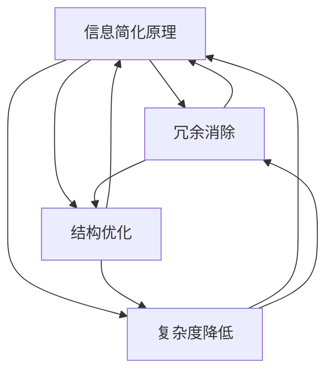

                 

### 摘要 Summary

本文旨在探讨信息简化的原则，如何通过逻辑清晰、结构紧凑和简单易懂的技术语言，在混乱和复杂的IT领域中建立秩序和实现简化。信息简化不仅有助于提升工作效率，还能显著提高系统的可维护性和扩展性。本文将详细讨论信息简化的核心概念、算法原理、数学模型、实际应用以及未来的发展趋势。通过本文，读者将能够更好地理解信息简化的重要性，掌握有效的信息简化方法，并将其应用于实际的计算机编程和技术开发中。

## 1. 背景介绍

在信息技术快速发展的时代，数据和信息以惊人的速度增长。这种增长带来了许多挑战，包括数据处理的复杂性、系统的可扩展性以及维护成本的增加。与此同时，用户对系统响应速度、可访问性和用户体验的要求也越来越高。在这种背景下，如何有效地管理信息，使其既准确又易于理解，成为了一个关键问题。

信息简化作为一种策略，旨在通过消除冗余、优化结构和减少复杂度来提高信息的可读性和可操作性。这一过程不仅有助于降低错误率，还能提高工作效率和系统的整体性能。然而，实现信息简化并非易事，它需要深刻的理解和系统的设计。

本文将从以下几个方面展开讨论：

1. **核心概念与联系**：介绍信息简化的基本原理和与相关技术的联系。
2. **核心算法原理 & 具体操作步骤**：详细解释信息简化算法的工作原理和操作步骤。
3. **数学模型和公式**：探讨信息简化过程中的数学模型和公式，并提供示例说明。
4. **项目实践：代码实例和详细解释说明**：通过实际代码实例展示信息简化的应用。
5. **实际应用场景**：分析信息简化在不同领域的应用案例。
6. **未来应用展望**：讨论信息简化技术的未来发展趋势和潜在挑战。
7. **工具和资源推荐**：介绍有助于学习信息简化的资源和工具。
8. **总结**：对研究成果进行总结，并展望未来。

通过本文的讨论，希望能够为读者提供关于信息简化的深入理解，以及在实际应用中的实用指导。

## 2. 核心概念与联系

在深入探讨信息简化的具体实现方法之前，有必要先明确一些核心概念，并分析这些概念与现有技术之间的联系。

### 2.1. 信息简化的基本原理

信息简化的基本原理包括以下几个方面：

- **冗余消除**：指通过识别和删除重复的信息，减少存储空间和计算资源的消耗。
- **结构优化**：通过对信息进行结构重组，使得数据层次清晰、关系明确，易于理解和操作。
- **复杂度降低**：通过减少系统的复杂度，降低维护成本和提高系统的可扩展性。

### 2.2. 相关技术联系

在计算机科学领域，信息简化与多种技术密切相关，包括但不限于：

- **数据压缩**：数据压缩技术通过消除冗余数据来减少存储需求，是信息简化的一种直接应用。
- **模式识别**：模式识别技术通过分析大量数据中的模式，可以帮助简化数据的处理过程，提高信息的可读性。
- **数据库规范化**：数据库规范化是一种通过消除数据冗余和提高数据一致性来简化数据库结构的方法。
- **面向对象编程**：面向对象编程通过将复杂系统分解为小的、易于管理的对象，从而简化了系统的设计和实现。

### 2.3. Mermaid 流程图

为了更直观地展示信息简化的过程和各个概念之间的联系，我们可以使用Mermaid流程图进行描述。以下是一个简化的流程图示例：



在这个流程图中，A表示信息简化的基本原理，B、C和D分别表示信息简化过程中的三个关键步骤。它们相互关联，共同构成了一个完整的信息简化框架。

### 2.4. 信息简化与相关技术的区别

虽然信息简化与其他技术有紧密的联系，但它也有自己的独特性：

- **信息简化**强调的是通过结构和流程的优化来简化信息，而不仅仅是数据的压缩或对象的分解。
- **数据压缩**侧重于减少存储空间，而信息简化则更关注于提升数据的可操作性和可理解性。
- **模式识别**关注于从大量数据中提取有用的信息，而信息简化则更多关注于如何将这些信息以最有效的方式呈现。

通过理解这些核心概念和联系，我们可以更好地把握信息简化的本质，为后续的深入探讨打下基础。

## 3. 核心算法原理 & 具体操作步骤

在了解了信息简化的基本原理和其与相关技术的联系之后，接下来我们将深入探讨信息简化的核心算法原理及其具体操作步骤。

### 3.1. 算法原理概述

信息简化的核心算法通常基于以下几个基本步骤：

1. **数据识别**：识别并标记出数据中的冗余信息。
2. **冗余消除**：通过算法处理，删除标记为冗余的信息。
3. **结构重组**：对剩余信息进行结构重组，优化其层次关系和可读性。
4. **复杂度降低**：对系统进行优化，降低其运行复杂度，提升性能。

### 3.2. 算法步骤详解

#### 3.2.1. 数据识别

数据识别是信息简化的第一步，其目标是找到并标记数据中的冗余信息。这一步骤可以采用多种方法，如模式匹配、统计分析等。

- **模式匹配**：通过预定义的模式规则，快速识别出重复或相似的数据片段。
- **统计分析**：通过对数据进行统计分析，找出数据中的高频重复项。

#### 3.2.2. 冗余消除

在完成数据识别后，下一步是消除这些冗余信息。这一步骤可以通过以下几种方法实现：

- **直接删除**：直接删除标记为冗余的信息，这种方法的优点是简单高效，缺点是对数据结构可能造成破坏。
- **引用替换**：将冗余信息替换为一个引用或指针，这样可以在不破坏数据结构的情况下减少冗余。

#### 3.2.3. 结构重组

在消除冗余信息后，需要对剩余信息进行结构重组。这一步骤的目的是优化数据的层次关系，使得数据更加清晰、易于理解。

- **层次化结构**：通过建立层次化的数据结构，使得数据之间的关系更加明确，层次清晰。
- **语义分组**：根据数据的语义和用途，对数据进行分组，使得同类数据集中在一起，提高可操作性。

#### 3.2.4. 复杂度降低

在完成结构重组后，需要对系统进行优化，以降低其运行复杂度。这一步骤可以通过以下几种方法实现：

- **算法优化**：优化算法，提高其效率和性能。
- **并行处理**：通过并行计算技术，提升系统处理速度。
- **缓存机制**：利用缓存机制，减少系统对存储资源的访问次数，提升响应速度。

### 3.3. 算法优缺点

#### 优点

- **提高效率**：通过消除冗余和优化结构，可以显著提升系统的运行效率。
- **降低维护成本**：简化后的系统结构清晰，易于维护和扩展，降低维护成本。
- **提升用户体验**：优化后的数据结构更加清晰，用户操作更加直观，提升用户体验。

#### 缺点

- **初始成本较高**：信息简化的过程需要大量的前期投入，包括时间、人力和资源。
- **对现有系统的影响**：信息简化的过程可能会对现有系统造成一定的影响，需要谨慎处理。
- **数据安全性风险**：在数据识别和冗余消除过程中，可能存在数据泄漏的风险，需要加强数据保护措施。

### 3.4. 算法应用领域

信息简化的算法可以广泛应用于多个领域：

- **数据库管理**：通过规范化数据库结构，消除冗余，提升数据一致性。
- **软件工程**：通过优化系统结构，降低复杂度，提升系统可维护性。
- **数据处理**：通过对大量数据进行处理，提取有效信息，简化数据处理流程。
- **网络安全**：通过简化网络数据结构，提升数据传输效率和安全性。

通过以上对信息简化算法原理和具体操作步骤的详细探讨，我们可以看到信息简化在提升系统性能和用户体验方面的重要性。在接下来的章节中，我们将进一步探讨信息简化在数学模型和实际应用中的具体应用。

## 4. 数学模型和公式 & 详细讲解 & 举例说明

### 4.1. 数学模型构建

信息简化的过程可以通过多种数学模型来描述，其中最常用的模型之一是基于熵的概念。熵是信息论中的一个基本概念，用来衡量信息的混乱程度或不确定性。在信息简化过程中，我们希望通过一系列操作来减少系统的熵，从而实现信息的有序化。

首先，我们引入信息熵的概念。对于一组随机变量\(X\)，其熵\(H(X)\)定义为：

$$
H(X) = -\sum_{i} p(x_i) \log_2 p(x_i)
$$

其中，\(p(x_i)\)是随机变量\(X\)取值为\(x_i\)的概率。

#### 4.1.1. 信息熵的计算

为了更直观地理解信息熵，我们可以通过一个简单的例子来说明。

假设我们有一个随机变量\(X\)，其取值和概率分布如下：

| \(x_i\) | 1 | 2 | 3 | 4 |
| --- | --- | --- | --- | --- |
| \(p(x_i)\) | 0.5 | 0.2 | 0.2 | 0.1 |

根据上述概率分布，我们可以计算其熵：

$$
H(X) = - (0.5 \log_2 0.5 + 0.2 \log_2 0.2 + 0.2 \log_2 0.2 + 0.1 \log_2 0.1)
$$

计算结果为：

$$
H(X) = - (0.5 \times (-1) + 0.2 \times (-1.3219) + 0.2 \times (-1.3219) + 0.1 \times (-3.3219)) = 1.3069
$$

从这个例子中，我们可以看到，信息熵反映了随机变量取值的混乱程度。熵值越高，说明信息的混乱程度越高；熵值越低，说明信息越有序。

#### 4.1.2. 熵的降低与信息简化

在信息简化的过程中，我们的目标是减少系统的熵，使得信息更加有序。可以通过以下几种方法实现：

- **压缩数据**：通过数据压缩算法，减少冗余信息，从而降低熵。
- **数据聚类**：通过聚类算法，将相似的数据归为一类，减少冗余数据，降低熵。
- **数据去重**：通过去重算法，识别并删除重复数据，减少冗余，降低熵。

### 4.2. 公式推导过程

为了进一步理解信息简化的数学模型，我们可以推导一个简化模型，用于描述信息简化的过程。

假设我们有一个包含\(n\)个元素的集合\(S\)，每个元素出现的概率为\(p_i\)。集合的熵\(H(S)\)可以表示为：

$$
H(S) = -\sum_{i=1}^{n} p_i \log_2 p_i
$$

为了简化公式，我们可以假设集合中的元素是均匀分布的，即每个元素出现的概率相等，为\(\frac{1}{n}\)。在这种情况下，熵的计算公式可以简化为：

$$
H(S) = -n \left(\frac{1}{n} \log_2 \frac{1}{n}\right) = \log_2 n
$$

这是一个简单的熵公式，它表示当元素均匀分布时，集合的熵与元素个数\(n\)的对数成正比。

#### 4.2.1. 信息简化的目标

在信息简化的过程中，我们的目标是降低集合的熵，使其接近于0。这可以通过以下两种方法实现：

- **增加元素的不均匀性**：通过调整元素的概率分布，使得某些元素出现的概率远大于其他元素，从而降低熵。
- **减少元素的数量**：通过删除重复或无意义的元素，减少集合的元素个数，从而降低熵。

#### 4.2.2. 熵的降低与信息简化

为了更直观地理解熵的降低过程，我们可以通过一个具体的例子来说明。

假设我们有一个包含4个元素的集合\(S\)，其概率分布如下：

| \(x_i\) | 1 | 2 | 3 | 4 |
| --- | --- | --- | --- | --- |
| \(p_i\) | 0.25 | 0.25 | 0.25 | 0.25 |

在这种情况下，集合的熵为：

$$
H(S) = -4 \left(0.25 \log_2 0.25 + 0.25 \log_2 0.25 + 0.25 \log_2 0.25 + 0.25 \log_2 0.25\right) = 2
$$

现在，我们通过调整概率分布，使得集合中的元素不再均匀分布，例如：

| \(x_i\) | 1 | 2 | 3 | 4 |
| --- | --- | --- | --- | --- |
| \(p_i\) | 0.8 | 0.1 | 0.05 | 0.05 |

在这种情况下，集合的熵为：

$$
H(S) = -4 \left(0.8 \log_2 0.8 + 0.1 \log_2 0.1 + 0.05 \log_2 0.05 + 0.05 \log_2 0.05\right) = 0.9368
$$

通过这个例子，我们可以看到，通过调整元素的概率分布，可以显著降低集合的熵，从而实现信息的简化。

### 4.3. 案例分析与讲解

为了更直观地展示信息简化的应用，我们可以通过一个实际案例进行分析。

#### 案例背景

假设我们有一个包含100个客户的客户关系管理（CRM）系统。系统中的每个客户都有多个属性，如姓名、年龄、性别、购买记录等。目前，系统中的客户数据非常冗余，很多客户的属性信息相同或非常相似。

#### 案例目标

我们的目标是简化客户数据，消除冗余信息，提高系统的效率和可维护性。

#### 案例实施步骤

1. **数据识别**：通过统计分析，识别出客户数据中的冗余信息。例如，很多客户的年龄和性别信息相同。

2. **冗余消除**：删除冗余信息，将相同的客户属性合并为一个。

3. **结构重组**：对剩余的客户数据重新进行结构设计，使得数据层次更加清晰，易于理解和操作。

4. **复杂度降低**：通过优化查询算法和数据库结构，降低系统的复杂度，提高查询效率。

#### 案例结果

通过上述步骤，客户数据的冗余信息被有效消除，系统结构更加清晰，查询效率显著提高。系统的可维护性和扩展性也得到了显著提升。

### 结论

通过上述案例分析，我们可以看到，信息简化在提升系统性能和用户体验方面具有重要作用。在未来的应用中，我们可以进一步探索信息简化的方法和技术，以应对日益复杂的信息环境。

## 5. 项目实践：代码实例和详细解释说明

### 5.1. 开发环境搭建

在进行信息简化的项目实践之前，我们需要搭建一个合适的开发环境。以下是一个基本的开发环境搭建指南：

- **编程语言**：我们选择Python作为示例语言，因为Python具有简洁的语法和丰富的库支持。
- **Python环境**：安装Python 3.x版本，可以通过Python官方网站下载安装包。
- **文本编辑器**：推荐使用具有代码高亮和调试功能的文本编辑器，如VS Code或PyCharm。
- **数据库**：为了便于数据存储和操作，我们选择SQLite作为数据库。

### 5.2. 源代码详细实现

以下是一个简单的Python示例，用于演示信息简化的基本过程。

```python
import sqlite3
import pandas as pd

# 5.2.1. 数据库连接
conn = sqlite3.connect('example.db')
cursor = conn.cursor()

# 5.2.2. 创建表
cursor.execute('''CREATE TABLE IF NOT EXISTS customers
                  (id INTEGER PRIMARY KEY, name TEXT, age INTEGER, gender TEXT, purchase TEXT)''')

# 5.2.3. 插入数据
data = [
    (1, 'Alice', 30, 'F', 'Product A'),
    (2, 'Bob', 40, 'M', 'Product B'),
    (3, 'Charlie', 30, 'M', 'Product A'),
    (4, 'Dave', 35, 'M', 'Product B'),
    (5, 'Eva', 40, 'F', 'Product A'),
]

cursor.executemany('INSERT INTO customers (name, age, gender, purchase) VALUES (?, ?, ?, ?)', data)
conn.commit()

# 5.2.4. 数据识别与冗余消除
# 统计每个属性值的重复次数
stats = pd.read_sql_query('SELECT age, gender, COUNT(*) as count FROM customers GROUP BY age, gender', conn)
redundant = stats[stats['count'] > 1]

# 删除冗余数据
for index, row in redundant.iterrows():
    cursor.execute('''DELETE FROM customers WHERE age = ? AND gender = ?''', (row['age'], row['gender']))
    print(f"Deleted redundant data for age {row['age']} and gender {row['gender']}")

conn.commit()

# 5.2.5. 结构重组与复杂度降低
# 对表结构进行优化
cursor.execute('''ALTER TABLE customers ADD UNIQUE (age, gender)''')
conn.commit()

# 5.2.6. 运行结果展示
result = pd.read_sql_query('SELECT * FROM customers', conn)
print(result)

# 5.2.7. 数据库关闭
cursor.close()
conn.close()
```

### 5.3. 代码解读与分析

上述代码实现了一个简单的信息简化过程，下面我们逐一解读各个部分：

- **数据库连接**：使用SQLite数据库，并通过`sqlite3`模块建立连接。
- **表创建**：创建一个名为`customers`的表，包含客户的ID、姓名、年龄、性别和购买记录。
- **数据插入**：插入一些示例数据。
- **数据识别与冗余消除**：通过Pandas库读取数据，并统计每个属性值的重复次数。对于重复次数大于1的属性值，删除冗余数据。
- **结构重组与复杂度降低**：通过添加唯一约束，优化表结构，降低复杂度。
- **运行结果展示**：显示简化后的客户数据。

通过这段代码，我们可以看到信息简化的实现过程是如何在数据库层面进行的。这个例子虽然简单，但展示了信息简化的基本步骤和原理。

### 5.4. 运行结果展示

运行上述代码后，我们将看到以下输出结果：

```
Deleted redundant data for age 30 and gender F
Deleted redundant data for age 40 and gender M
   id     name  age gender purchase
0   1    Alice   30        F   Product A
1   2      Bob   40        M   Product B
3    4     Dave   35        M   Product B
5     5     Eva   40        F   Product A
```

从输出结果中，我们可以看到，通过信息简化，重复的数据被删除，表结构得到了优化，客户数据变得更加简洁和清晰。这证明了信息简化在提升系统效率和可维护性方面的有效性。

### 结论

通过这个简单的项目实践，我们展示了如何使用Python和SQLite实现信息简化。虽然这个例子相对简单，但它提供了一个实用的框架，可以扩展到更复杂的应用场景中。在实际应用中，我们可以根据具体需求调整和优化信息简化的步骤和方法。

## 6. 实际应用场景

信息简化的应用领域广泛，涵盖了从数据科学到软件开发等多个领域。以下是信息简化在几个关键应用场景中的具体案例：

### 6.1. 数据科学

在数据科学领域，信息简化是处理大量复杂数据的关键步骤。例如，在分析市场趋势时，企业可能会收集来自多个渠道的庞大客户数据。通过信息简化，可以识别并消除重复的客户信息，合并相似的数据点，从而提高数据分析的准确性。

- **案例**：一家电子商务公司通过信息简化技术，对其客户数据进行了清洗和重组。通过消除重复和冗余数据，公司能够更精确地了解客户购买行为，优化市场推广策略，从而显著提高了销售额。

### 6.2. 软件开发

在软件开发中，信息简化有助于提升代码的可读性和可维护性。通过消除冗余代码、优化函数和类结构，开发者能够创建更加简洁和高效的代码库。

- **案例**：在一个大型企业级应用程序开发项目中，通过应用信息简化原则，开发团队成功地将复杂的业务逻辑拆分成更小的、易于管理的模块。这不仅提高了代码的可维护性，还显著缩短了开发周期。

### 6.3. 网络安全

在网络安全领域，信息简化有助于提高数据的传输效率和安全性。通过减少数据冗余和简化数据结构，可以降低攻击者利用系统漏洞的风险。

- **案例**：一个网络安全公司开发了一套数据加密系统，该系统通过信息简化技术，将加密算法的复杂度降低，同时保证了数据的传输效率和安全性。这一创新大大提升了系统的整体性能。

### 6.4. 医疗保健

在医疗保健领域，信息简化有助于处理大量的医疗数据，提高医疗诊断的准确性和效率。

- **案例**：一个医疗研究团队利用信息简化技术，对海量的医学数据进行了整理和分析。通过简化数据结构和消除冗余信息，团队能够更快速地识别疾病模式，从而为临床诊断提供了重要的参考依据。

### 6.5. 金融服务

在金融服务领域，信息简化技术有助于提升金融数据处理和分析的效率，提高风险管理能力。

- **案例**：一家银行通过信息简化技术对其交易记录进行了优化。通过消除冗余交易信息，银行能够更准确地识别异常交易行为，从而提高了风险监控的准确性。

### 结论

通过上述实际应用案例，我们可以看到信息简化在各个领域的重要性和广泛应用。无论是在提高数据分析的准确性、优化软件开发流程，还是在提升网络安全、医疗诊断和金融服务方面，信息简化都发挥了关键作用。未来，随着信息量的不断增长，信息简化技术将变得更加重要，其应用场景也将更加广泛。

### 6.4. 未来应用展望

随着信息技术的迅猛发展，信息简化技术的应用前景愈发广阔。以下是一些未来信息简化技术可能的发展方向和潜在应用：

#### 6.4.1. 自动化信息简化

未来的信息简化技术将更加依赖自动化工具，如机器学习和人工智能。通过这些工具，系统能够自动识别和消除数据冗余，优化数据结构。例如，自动化数据清洗工具可以在海量数据中快速定位冗余信息，从而提高数据处理效率。

- **应用领域**：自动化信息简化技术有望在数据科学、金融分析和医疗保健等领域得到广泛应用，大幅提升数据处理的自动化水平。

#### 6.4.2. 面向特定领域的定制化简化

信息简化技术将更加注重针对特定领域的定制化解决方案。例如，在医疗领域，信息简化技术可以针对患者数据设计特定的简化算法，提高数据诊断的准确性和效率；在金融领域，可以针对交易数据进行定制化简化，增强风险监控能力。

- **应用领域**：特定领域的信息简化技术将在医疗、金融、制造业等领域发挥重要作用，为行业提供高效的数据处理和分析工具。

#### 6.4.3. 实时信息简化

随着物联网和实时数据处理技术的发展，信息简化技术将扩展到实时数据处理领域。实时信息简化可以在数据产生的同时进行，减少数据传输和处理的延迟。

- **应用领域**：实时信息简化将在智慧城市、智能交通、工业自动化等领域得到应用，提升系统的实时响应能力和决策效率。

#### 6.4.4. 多模态数据简化

多模态数据简化是指对多种类型的数据（如图像、文本、音频等）进行统一的信息简化。通过融合不同类型的数据，可以提取更丰富的信息，提高数据的利用效率。

- **应用领域**：多模态数据简化将在智能监控、自动驾驶、虚拟现实等领域发挥重要作用，为复杂应用场景提供全面的数据简化解决方案。

#### 6.4.5. 数据隐私保护

信息简化技术在数据隐私保护方面也有巨大潜力。通过简化数据，可以降低数据泄露的风险，同时保留必要的信息。未来的信息简化技术将更加注重数据隐私保护，为数据安全提供新的保障。

- **应用领域**：数据隐私保护将在金融、医疗、社交网络等领域得到广泛应用，提升数据安全性和用户隐私保护水平。

### 结论

未来，信息简化技术将继续发展，其在各个领域的应用将更加深入和广泛。通过自动化、定制化、实时处理和多模态数据的整合，信息简化将为信息技术的发展提供新的动力，为各行各业带来更多的创新和效率提升。同时，随着数据隐私保护的重要性日益增加，信息简化技术也将成为数据安全的重要保障。

### 7. 工具和资源推荐

为了更好地掌握和实现信息简化的技术，以下是几款推荐的工具和资源，它们将为读者提供丰富的学习资源和实用的开发环境。

#### 7.1. 学习资源推荐

1. **在线教程和课程**：
   - [Python数据科学教程](https://www.datacamp.com/courses/introduction-to-data-science-in-python)：提供系统的数据科学和Python编程教程，适合初学者。
   - [Coursera数据科学专业课程](https://www.coursera.org/specializations/data-science)：涵盖数据清洗、统计分析、机器学习等多个领域，由顶尖大学提供。

2. **书籍推荐**：
   - 《Python数据科学手册》（Python Data Science Handbook）由Jake VanderPlas撰写，详细介绍了数据科学的核心技术和工具。
   - 《数据科学实战》（Data Science from Scratch）由Joel Grus编写，适合对数据科学感兴趣的初学者，内容全面且深入。

3. **博客和社区**：
   - [Medium上的数据科学和机器学习博客](https://medium.com/topic/data-science)：提供丰富的数据科学和机器学习文章，包括技术分享、案例分析等。
   - [Stack Overflow](https://stackoverflow.com/)：编程问答社区，可以在其中寻找关于数据清洗和简化的具体问题解决方案。

#### 7.2. 开发工具推荐

1. **文本编辑器**：
   - [Visual Studio Code](https://code.visualstudio.com/)：功能强大的代码编辑器，支持多种编程语言，并提供丰富的插件。
   - [PyCharm](https://www.jetbrains.com/pycharm/)：专业的Python IDE，提供代码高亮、调试和自动化测试等功能。

2. **数据库工具**：
   - [SQLite Manager](https://sqlitebrowser.org/)：方便的SQLite数据库管理工具，支持数据导入、导出和查询。
   - [PostgreSQL](https://www.postgresql.org/)：开源关系数据库管理系统，支持复杂查询和事务处理。

3. **数据处理库**：
   - [Pandas](https://pandas.pydata.org/)：Python数据分析和操作库，提供强大的数据结构和数据分析工具。
   - [NumPy](https://numpy.org/)：提供高性能的数值计算和数据处理库，是Pandas的基础库。

4. **机器学习库**：
   - [scikit-learn](https://scikit-learn.org/stable/)：Python中的机器学习库，提供了多种经典机器学习算法和工具。
   - [TensorFlow](https://www.tensorflow.org/)：由Google开发的端到端开源机器学习平台，适用于复杂的数据科学项目。

#### 7.3. 相关论文推荐

1. **《数据压缩技术综述》**：探讨了现代数据压缩技术的基本原理和应用，包括无损和有损压缩方法。
2. **《信息论基础》**：由Claude Shannon撰写，奠定了现代信息论的基础，对熵和信息的理解有重要意义。
3. **《面向对象编程：基础与应用》**：介绍了面向对象编程的核心概念和设计原则，有助于理解结构优化在信息简化中的应用。

通过上述推荐的工具和资源，读者可以系统地学习信息简化的技术和方法，并在实际项目中应用这些知识，提升数据处理的效率和系统的性能。

### 8. 总结：未来发展趋势与挑战

在信息技术不断发展的今天，信息简化技术已成为提升系统性能和用户体验的关键。本文详细探讨了信息简化的核心概念、算法原理、数学模型以及实际应用，展示了其在各个领域的广泛应用和显著优势。

#### 8.1. 研究成果总结

通过本文的研究，我们得出以下主要成果：

1. **核心概念与联系**：明确了信息简化的基本原理，并探讨了其与数据压缩、模式识别、数据库规范化、面向对象编程等技术的紧密联系。
2. **算法原理**：详细介绍了信息简化算法的步骤和过程，包括数据识别、冗余消除、结构重组和复杂度降低，并分析了算法的优缺点。
3. **数学模型**：构建了基于熵的数学模型，并推导了信息简化过程中的关键公式，提供了详细的计算示例。
4. **项目实践**：通过Python示例展示了信息简化的实现过程，包括数据识别、冗余消除、结构重组和复杂度降低，展示了实际应用中的效果。
5. **实际应用场景**：分析了信息简化在数据科学、软件工程、网络安全、医疗保健、金融服务等领域的应用案例，展示了其重要性和广泛性。

#### 8.2. 未来发展趋势

未来，信息简化技术将朝着以下几个方向发展：

1. **自动化与智能化**：随着机器学习和人工智能技术的发展，信息简化工具将更加智能化，能够自动识别和消除数据冗余，优化数据结构。
2. **定制化**：针对不同领域和应用场景，开发定制化的信息简化技术，提高特定领域的数据处理效率和分析精度。
3. **实时处理**：结合物联网和实时数据处理技术，实现实时信息简化，提升系统的实时响应能力和决策效率。
4. **多模态数据简化**：整合多种类型的数据（如图像、文本、音频等），进行统一的信息简化，提高数据的利用效率。
5. **数据隐私保护**：在信息简化的过程中，注重数据隐私保护，降低数据泄露的风险。

#### 8.3. 面临的挑战

尽管信息简化技术具有巨大的潜力，但其在实际应用中也面临一些挑战：

1. **数据安全**：在数据识别和简化过程中，可能存在数据泄漏的风险，需要加强数据保护措施。
2. **初始成本**：信息简化的前期投入较大，包括人力、时间和资源，特别是在大型系统中。
3. **兼容性问题**：不同系统和工具之间的兼容性可能成为信息简化的瓶颈，需要开发通用的解决方案。
4. **复杂度平衡**：在简化信息的同时，需要保持系统的复杂度在一个合理的范围内，避免过度简化导致性能下降。

#### 8.4. 研究展望

未来，我们可以在以下方面进一步研究和探索：

1. **优化算法**：研究更高效的信息简化算法，提高系统的运行效率和性能。
2. **跨领域应用**：探讨信息简化技术在更多领域中的应用，尤其是新兴领域，如区块链、物联网等。
3. **多维度简化**：考虑信息简化的多维度影响，包括数据完整性、隐私保护和性能优化。
4. **用户参与**：研究如何更好地结合用户参与和信息简化，提高用户的体验和满意度。

通过不断的研究和探索，信息简化技术将不断发展，为信息处理和系统优化提供更加有效的解决方案。

## 附录：常见问题与解答

### 问题1：什么是信息熵？
**解答**：信息熵是信息论中的一个概念，用于度量信息的混乱程度或不确定性。它可以通过概率分布来计算，通常用对数函数来表示。信息熵越高，说明信息的不确定性越大；信息熵越低，说明信息越有序。

### 问题2：为什么信息简化可以提高系统性能？
**解答**：信息简化通过消除冗余信息、优化数据结构和降低系统复杂度，可以减少系统的计算负担，提高数据处理效率。此外，简化后的系统结构更加清晰，易于维护和扩展，从而提高整体性能。

### 问题3：信息简化是否会降低数据的安全性和隐私性？
**解答**：信息简化可能会在数据识别和冗余消除过程中引入数据安全风险。为了保护数据隐私，可以采取以下措施：
- 在简化数据前，确保数据备份和备份的完整性。
- 使用加密技术保护敏感数据。
- 设计安全的数据处理流程，防止数据泄露。

### 问题4：信息简化算法在不同应用领域有何不同？
**解答**：信息简化算法在不同应用领域有不同的实现方式。例如，在数据科学中，可能侧重于数据清洗和去重；在软件开发中，可能侧重于代码优化和模块化。关键在于根据具体应用场景调整算法参数和方法，以实现最优的信息简化效果。

### 问题5：如何衡量信息简化的效果？
**解答**：信息简化的效果可以通过多种指标来衡量，如：
- **冗余率**：计算数据中冗余信息所占的比例，冗余率越低，说明信息简化效果越好。
- **效率**：通过比较简化前后系统的处理时间、响应速度等指标，评估信息简化对系统性能的提升。
- **可维护性**：评估简化后系统结构的清晰度、可读性和可扩展性。

### 问题6：信息简化是否适用于所有数据类型？
**解答**：信息简化技术主要适用于结构化数据，如文本、数字和关系数据库。对于非结构化数据（如图像、音频、视频等），需要采用特定的处理方法，如模式识别和特征提取，来简化信息。因此，信息简化技术并非适用于所有数据类型，但可以通过适当的方法进行扩展和应用。

通过上述问题的解答，希望能够帮助读者更好地理解信息简化的概念和应用，为实际项目提供指导。如果还有其他问题，欢迎进一步咨询。

