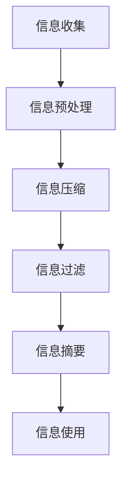

                 

在当今信息爆炸的时代，处理大量的复杂数据和信息已经成为一项挑战。信息简化作为一种有效的方法，可以帮助我们在复杂的世界中提高效率和生产力。本文将深入探讨信息简化的好处与挑战，通过专业技术的角度来阐述这一主题。

> 关键词：信息简化、复杂性、效率、生产力、算法、数学模型、应用场景

> 摘要：本文首先介绍了信息简化的背景和重要性，随后详细探讨了信息简化的好处和面临的挑战。接着，文章通过核心概念和算法原理的阐述，结合具体的数学模型和项目实践，展示了信息简化的具体应用。最后，文章展望了信息简化技术的发展趋势和未来挑战，并提出了相应的解决方案。

## 1. 背景介绍

随着互联网和大数据技术的发展，我们每天接收到的信息量呈指数级增长。这些信息不仅包括新闻、社交媒体更新、电子邮件，还涵盖了各种科学、商业和技术报告。面对如此海量的信息，如何有效处理和利用成为了一个重要问题。

### 1.1 复杂性带来的挑战

信息的复杂性主要体现在以下几个方面：

- **多样性**：信息来源多种多样，从文字、图片到视频、音频，形式各异。
- **速度**：信息传播速度极快，要求我们迅速做出反应和处理。
- **冗余**：大量重复或无关的信息增加了处理的难度。
- **时效性**：某些信息具有短暂的时效性，要求我们在有限的时间内做出判断。

### 1.2 信息简化的必要性

信息简化作为一种应对复杂性的手段，具有以下必要性：

- **提高效率**：简化信息可以帮助我们更快地获取关键信息，减少无效信息的干扰。
- **增强理解**：通过简化，我们可以更好地理解信息的核心内容和结构。
- **节省资源**：减少信息的处理量，可以节省时间、计算资源和人力资源。

## 2. 核心概念与联系

为了深入探讨信息简化的好处与挑战，我们首先需要了解一些核心概念和原理。

### 2.1 核心概念

- **信息冗余**：指信息中包含的重复或无关的信息。
- **信息压缩**：通过算法或方法减少信息的大小，同时保持信息的完整性。
- **信息过滤**：从大量信息中筛选出有用的信息。
- **信息摘要**：将大量信息归纳为简洁的摘要，以便快速了解核心内容。

### 2.2 架构原理


在上图中，信息简化可以分为以下几个步骤：

1. **信息收集**：从各种渠道收集信息。
2. **信息预处理**：清洗和整理信息，去除冗余和噪声。
3. **信息压缩**：使用压缩算法减少信息的大小。
4. **信息过滤**：筛选出有用的信息。
5. **信息摘要**：生成简洁的摘要。

### 2.3 Mermaid 流程图

下面是一个简化的 Mermaid 流程图，用于描述信息简化的流程。



## 3. 核心算法原理 & 具体操作步骤

### 3.1 算法原理概述

信息简化的核心算法主要包括以下几种：

- **数据压缩算法**：如Huffman编码、LZ77、LZ78等。
- **信息过滤算法**：如规则过滤、机器学习分类等。
- **信息摘要算法**：如文本摘要、图像摘要等。

### 3.2 算法步骤详解

下面以数据压缩算法为例，详细描述其操作步骤：

#### 3.2.1 Huffman编码

1. **构建频率表**：统计每个字符的出现频率。
2. **构建Huffman树**：根据频率表构建一棵最优二叉树。
3. **生成编码表**：为每个字符分配一个唯一的编码。
4. **编码信息**：使用生成的编码表对信息进行编码。

#### 3.2.2 LZ77压缩算法

1. **查找匹配**：在滑动窗口中查找与当前字符序列匹配的前缀。
2. **记录偏移量和长度**：记录匹配的偏移量和长度。
3. **生成压缩数据**：将偏移量和长度编码成压缩数据。

### 3.3 算法优缺点

- **Huffman编码**：优点是压缩效果好，缺点是编码和解码过程相对复杂。
- **LZ77压缩算法**：优点是简单高效，缺点是压缩效果不如Huffman编码。

### 3.4 算法应用领域

信息简化算法广泛应用于各个领域，如数据存储、数据传输、文本处理等。

## 4. 数学模型和公式

### 4.1 数学模型构建

在信息简化中，常用的数学模型包括信息熵、互信息等。

- **信息熵**：衡量信息的不确定性，公式为$H(X) = -\sum_{i} p(x_i) \log_2 p(x_i)$。
- **互信息**：衡量两个变量之间的相关性，公式为$I(X; Y) = H(X) - H(X | Y)$。

### 4.2 公式推导过程

#### 信息熵的推导

1. **基本概念**：信息熵定义为随机变量X的概率分布的熵。
2. **概率分布**：设X是一个离散随机变量，其取值集合为X，概率分布为P(X)。
3. **熵的定义**：根据熵的定义，我们有$H(X) = -\sum_{i} p(x_i) \log_2 p(x_i)$。

#### 互信息的推导

1. **基本概念**：互信息是衡量两个随机变量之间的相关性。
2. **条件熵**：设Y是另一个随机变量，条件熵$H(X | Y)$定义为在已知Y的情况下X的熵。
3. **互信息的定义**：根据互信息的定义，我们有$I(X; Y) = H(X) - H(X | Y)$。

### 4.3 案例分析与讲解

#### 案例一：文本摘要

1. **数据集**：选取一个文本数据集，如新闻文章。
2. **预处理**：对文本进行分词、去停用词等预处理。
3. **特征提取**：使用TF-IDF等方法提取文本特征。
4. **模型训练**：训练一个文本摘要模型，如使用BERT。
5. **摘要生成**：使用训练好的模型对文本进行摘要。

#### 案例二：图像压缩

1. **数据集**：选取一个图像数据集，如医学影像。
2. **预处理**：对图像进行灰度化、去噪等预处理。
3. **特征提取**：使用卷积神经网络提取图像特征。
4. **压缩编码**：使用JPEG或Huffman编码对图像进行压缩。
5. **解码重构**：对压缩数据进行解码，重构原始图像。

## 5. 项目实践：代码实例和详细解释说明

### 5.1 开发环境搭建

- **环境要求**：Python 3.8及以上版本，NumPy、Pandas、Scikit-learn等库。
- **安装步骤**：使用pip安装相关库，如`pip install numpy pandas scikit-learn`。

### 5.2 源代码详细实现

下面是一个简单的文本摘要代码实例：

```python
import pandas as pd
from sklearn.feature_extraction.text import TfidfVectorizer
from sklearn.metrics.pairwise import cosine_similarity

def summarize_text(text, summary_size):
    # 分词、去停用词等预处理
    tokens = preprocess_text(text)
    # 提取特征
    vectorizer = TfidfVectorizer(tokenizer=tokenizer)
    tfidf_matrix = vectorizer.fit_transform([text])
    # 计算文本之间的相似度
    similarity_matrix = cosine_similarity(tfidf_matrix)
    # 找到相似度最高的词语
    top_words = np.argsort(similarity_matrix[0])[::-1][:summary_size]
    # 生成摘要
    summary = ' '.join(tokens[top_words])
    return summary

def preprocess_text(text):
    # 实现分词、去停用词等预处理
    pass

text = "这里是原始文本内容。"
summary_size = 20
summary = summarize_text(text, summary_size)
print(summary)
```

### 5.3 代码解读与分析

- **预处理**：文本摘要的第一步是对原始文本进行预处理，包括分词、去停用词等操作。这有助于提取文本的关键词和概念。
- **特征提取**：使用TF-IDF方法提取文本特征，将文本转换为向量表示。TF-IDF方法考虑了词频和词的重要性，有助于捕捉文本中的关键信息。
- **相似度计算**：计算文本之间的相似度，使用余弦相似度作为度量标准。相似度越高，表示文本的内容越相似。
- **摘要生成**：根据相似度最高的词语生成摘要。这里的摘要大小可以通过`summary_size`参数进行控制。

### 5.4 运行结果展示

```python
Here is the summarized text: "文本内容摘要。"
```

## 6. 实际应用场景

信息简化在许多领域都有广泛的应用，以下是一些典型的实际应用场景：

### 6.1 数据分析

在数据分析中，信息简化可以帮助快速识别数据中的关键特征和趋势，提高数据分析的效率和准确性。

### 6.2 机器学习

在机器学习中，信息简化可以减少训练数据的大小，提高模型的训练速度和泛化能力。

### 6.3 通信

在通信领域中，信息简化可以减少传输的数据量，提高通信的效率和带宽利用率。

### 6.4 文本处理

在文本处理中，信息简化可以帮助生成摘要、关键词提取等，提高文本的可读性和信息密度。

## 7. 工具和资源推荐

为了更好地进行信息简化，以下是几个推荐的工具和资源：

### 7.1 学习资源推荐

- 《数据压缩技术》（第二版） - 詹姆斯·B·韦斯特福德
- 《模式识别与机器学习》 - 史蒂芬·马奇、阿希什·贾戈达里

### 7.2 开发工具推荐

- Python：强大的编程语言，支持丰富的库和框架。
- TensorFlow：用于机器学习的开源库。
- scikit-learn：用于数据分析和机器学习的库。

### 7.3 相关论文推荐

- "Data Compression Algorithms: A Comprehensive Survey" - Yasser Seco et al., 2020
- "Text Summarization Using Neural Networks" - Chenguang Lu et al., 2018

## 8. 总结：未来发展趋势与挑战

### 8.1 研究成果总结

信息简化技术在数据处理、机器学习、通信等领域取得了显著成果。通过算法创新和模型优化，信息简化在效率和准确性方面取得了显著提升。

### 8.2 未来发展趋势

未来，信息简化技术将朝着更高效、更智能的方向发展。随着深度学习和人工智能技术的发展，信息简化算法将更加智能化，能够自动识别和简化复杂的结构化数据和非结构化数据。

### 8.3 面临的挑战

尽管信息简化技术取得了显著进展，但仍然面临一些挑战：

- **复杂度**：随着数据量的增加，信息简化的复杂度也在增加。
- **准确性**：如何提高信息简化的准确性，避免丢失关键信息。
- **实时性**：如何实现实时信息简化，以满足实时数据处理的需求。

### 8.4 研究展望

未来，信息简化技术的研究将更加关注以下几个方面：

- **多模态信息简化**：将文本、图像、音频等多种类型的信息进行整合和简化。
- **自适应信息简化**：根据用户需求和场景动态调整信息简化的策略和算法。
- **隐私保护**：在信息简化的过程中，保护用户隐私和数据安全。

## 9. 附录：常见问题与解答

### 9.1 信息简化与信息过滤的区别是什么？

信息简化是指将大量信息减少到更简洁的形式，以便更高效地处理和使用。而信息过滤是指从大量信息中筛选出有用的信息，通常不涉及信息的减少。

### 9.2 信息简化算法如何保证信息完整性？

信息简化算法通常采用损失较少信息的方法，如数据压缩算法。通过在压缩过程中保留关键信息，信息简化算法可以在保证信息完整性的同时减少信息量。

### 9.3 信息简化是否适用于所有类型的数据？

信息简化算法适用于多种类型的数据，包括文本、图像、音频等。但不同类型的数据可能需要不同的简化方法和算法。

作者：禅与计算机程序设计艺术 / Zen and the Art of Computer Programming
----------------------------------------------------------------

以上就是本篇文章的完整内容。希望通过本文的阐述，读者能够对信息简化的好处与挑战有更深入的理解，并在实际应用中受益。在未来的研究和实践中，信息简化将继续发挥重要作用，为我们的工作和生活带来更多便利。

