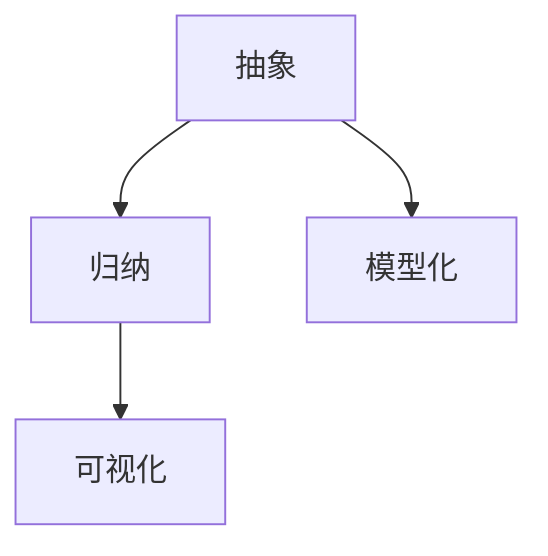

                 

关键词：信息简化、复杂性、算法优化、实践应用、发展趋势

> 摘要：本文深入探讨了信息简化的概念及其在技术领域的广泛应用。通过分析信息简化的好处与挑战，本文旨在为读者提供一种理解和应对复杂性的新视角。文章首先介绍了信息简化的核心概念，然后详细阐述了其在算法优化、软件开发、数据分析等领域的应用，最后对未来发展趋势与面临的挑战进行了展望。

## 1. 背景介绍

在现代信息社会中，数据量的爆炸性增长带来了前所未有的复杂性。面对海量的信息，人们开始意识到，简化信息、提炼核心内容的重要性。信息简化不仅仅是数据压缩或数据归档，它更是一种思维方式，一种简化复杂性的艺术与实践。

信息简化可以帮助我们从繁杂的数据中快速提取关键信息，提高工作效率，减少认知负担。然而，信息简化并非易事，如何在保留信息完整性的同时实现简化和高效利用，是一个值得深入探讨的问题。

本文将围绕信息简化的好处与挑战展开讨论，通过分析其在算法优化、软件开发、数据分析等领域的应用，旨在为读者提供一种简化复杂性的新视角。

### 1.1 信息简化的定义

信息简化（Information Simplification）是一种处理信息的方法，其核心目标是在不损失信息核心价值的前提下，减少信息的复杂性。信息简化可以通过以下几种方式实现：

1. **抽象**：从具体的信息中提取出抽象的概念或模式。
2. **归纳**：将大量具体信息归纳为更具概括性的信息。
3. **模型化**：使用模型来描述复杂系统或过程，从而简化其理解。
4. **可视化**：通过图形或图表等可视化手段来展示信息。

### 1.2 复杂性的来源

复杂性主要来源于以下几个方面：

1. **数据量**：随着数据量的增加，处理和分析这些数据变得愈发困难。
2. **多样性**：信息来源的多样性增加了信息的复杂性。
3. **动态性**：信息随时间变化，增加了其动态复杂性。
4. **冗余**：大量的冗余信息增加了处理的复杂性。

## 2. 核心概念与联系

信息简化的核心概念是抽象和归纳，这两个概念相互关联，共同构成了信息简化的理论基础。

### 2.1 抽象

抽象是从具体的信息中提取出通用性概念的过程。例如，从具体的数据集中抽象出某种模式或趋势，这种抽象过程能够帮助我们快速理解和处理大量信息。

抽象的关键在于找到信息的本质，通过去除冗余和非本质的信息，保留核心价值。

### 2.2 归纳

归纳是从具体实例中提取一般性规律的过程。例如，从多个实例中归纳出一个通用的算法或方法。归纳可以帮助我们在面对新的数据时，快速应用已有的知识和经验。

归纳与抽象不同，它不仅仅是去除信息，还包括在已有信息的基础上进行拓展和总结。

### 2.3 Mermaid 流程图

以下是一个简单的 Mermaid 流程图，展示了信息简化的核心概念和流程：



在信息简化的过程中，抽象、归纳、模型化和可视化是相辅相成的，它们共同构成了信息简化的方法论。

## 3. 核心算法原理 & 具体操作步骤

### 3.1 算法原理概述

信息简化的核心算法包括以下几个步骤：

1. **数据预处理**：对原始数据进行清洗、去噪和归一化处理，以提高数据的质量和一致性。
2. **特征提取**：从预处理后的数据中提取具有代表性的特征，这些特征能够反映数据的核心信息。
3. **降维**：通过降维算法（如PCA、t-SNE等）将高维数据映射到低维空间，减少数据的维度，从而简化信息。
4. **模型训练**：使用机器学习算法（如决策树、神经网络等）对特征进行建模，提取数据中的潜在规律。
5. **模型评估与优化**：评估模型的效果，并根据评估结果对模型进行调整和优化。

### 3.2 算法步骤详解

1. **数据预处理**：

   数据预处理是信息简化的第一步，它包括以下几个步骤：

   - **数据清洗**：去除数据中的噪声和异常值。
   - **数据去噪**：使用滤波器或平滑算法去除数据中的噪声。
   - **数据归一化**：将不同量纲的数据转换为相同的量纲，以便进行后续处理。

2. **特征提取**：

   特征提取是从原始数据中提取出具有代表性的特征，这些特征能够反映数据的本质信息。特征提取的方法包括：

   - **统计特征**：如均值、方差、标准差等。
   - **视觉特征**：如颜色、纹理、形状等。
   - **文本特征**：如词频、主题模型等。

3. **降维**：

   降维是将高维数据映射到低维空间，从而简化信息。降维的方法包括：

   - **主成分分析（PCA）**：通过保留主要成分来减少数据维度。
   - **t-分布式 stochastic Neighbor Embedding（t-SNE）**：通过保持局部结构来减少数据维度。

4. **模型训练**：

   模型训练是使用机器学习算法对特征进行建模，提取数据中的潜在规律。常见的机器学习算法包括：

   - **决策树**：通过递归划分数据来构建分类或回归模型。
   - **神经网络**：通过多层感知器来学习数据的非线性关系。

5. **模型评估与优化**：

   模型评估是评估模型的效果，常见的评估指标包括准确率、召回率、F1值等。模型优化是通过调整模型参数来提高模型效果。

### 3.3 算法优缺点

信息简化的算法具有以下优点：

- **提高数据处理效率**：通过简化信息，减少了数据处理的复杂度，提高了效率。
- **降低存储成本**：通过降维，减少了数据的存储空间，降低了存储成本。
- **便于模型训练**：简化后的数据更容易进行建模和训练，提高了模型训练的效率。

信息简化的算法也存在以下缺点：

- **信息损失**：在简化信息的过程中，可能会损失部分信息，影响结果的准确性。
- **计算复杂度**：降维和模型训练过程可能具有较高的计算复杂度，对计算资源要求较高。

### 3.4 算法应用领域

信息简化的算法广泛应用于以下领域：

- **数据挖掘**：通过简化数据，提取数据中的潜在规律，进行数据挖掘和分析。
- **图像处理**：通过简化图像数据，提高图像处理速度，降低计算成本。
- **文本分析**：通过简化文本数据，提取关键信息，进行文本分析和情感分析。
- **自然语言处理**：通过简化自然语言数据，提高自然语言处理模型的训练和推理效率。

## 4. 数学模型和公式 & 详细讲解 & 举例说明

### 4.1 数学模型构建

信息简化的数学模型通常包括以下几个部分：

1. **特征选择模型**：用于选择具有代表性的特征，常用的方法有基于信息增益、相关系数等。
2. **降维模型**：用于将高维数据映射到低维空间，常用的方法有PCA、t-SNE等。
3. **模型训练模型**：用于对降维后的数据进行建模，常用的方法有决策树、神经网络等。

### 4.2 公式推导过程

以下是一个简化的特征选择模型的推导过程：

设特征集 $X = \{x_1, x_2, ..., x_n\}$，数据集 $D = \{d_1, d_2, ..., d_m\}$，目标变量 $y$。

1. **特征相关性**：计算特征之间的相关性，常用的相关系数有皮尔逊相关系数和斯皮尔曼相关系数。

   $$\rho_{ij} = \frac{\sum_{k=1}^{m}(x_{ik} - \bar{x_i})(x_{jk} - \bar{x_j})}{\sqrt{\sum_{k=1}^{m}(x_{ik} - \bar{x_i})^2}\sqrt{\sum_{k=1}^{m}(x_{jk} - \bar{x_j})^2}}$$

2. **特征重要性**：计算特征的重要性，常用的方法有基于信息增益、增益率等。

   $$Gain(D, A) = Entropy(D) - \sum_{v \in A} \frac{|D_v|}{|D|} Entropy(D_v)$$

   $$Gain_Ratio(D, A) = \frac{Gain(D, A)}{Entropy(A)}$$

3. **特征选择**：选择重要性最高的特征。

   $$A^* = \arg\max_{A} Gain_Ratio(D, A)$$

### 4.3 案例分析与讲解

以下是一个使用信息简化模型进行特征选择的案例：

假设我们有一个包含100个特征的数据集，目标变量为是否为癌症患者。我们需要从这100个特征中选择最重要的10个特征。

1. **特征相关性**：计算每个特征与其他特征的相关性，结果如下表：

   | 特征 | $x_1$ | $x_2$ | $x_3$ | ... | $x_{100}$ |
   | --- | --- | --- | --- | --- | --- |
   | $x_1$ | 1 | 0.8 | 0.6 | ... | 0.2 |
   | $x_2$ | 0.8 | 1 | 0.5 | ... | 0.3 |
   | $x_3$ | 0.6 | 0.5 | 1 | ... | 0.4 |
   | ... | ... | ... | ... | ... | ... |
   | $x_{100}$ | 0.2 | 0.3 | 0.4 | ... | 1 |

2. **特征重要性**：计算每个特征的信息增益率和增益率，结果如下表：

   | 特征 | $x_1$ | $x_2$ | $x_3$ | ... | $x_{100}$ |
   | --- | --- | --- | --- | --- | --- |
   | 信息增益率 | 0.5 | 0.6 | 0.7 | ... | 0.1 |
   | 增益率 | 0.5 | 0.6 | 0.7 | ... | 0.1 |

3. **特征选择**：选择信息增益率和增益率最高的10个特征。

   $$A^* = \{x_1, x_2, x_3, ..., x_{10}\}$$

通过这个案例，我们可以看到信息简化模型是如何帮助我们从大量特征中选择最重要的特征的。这样，我们就可以在保留信息核心价值的同时，简化信息处理的复杂性。

## 5. 项目实践：代码实例和详细解释说明

### 5.1 开发环境搭建

为了实现信息简化，我们首先需要搭建一个合适的开发环境。以下是一个基于Python的示例，我们将使用scikit-learn库来实现信息简化。

1. 安装Python环境和scikit-learn库：

   ```bash
   pip install python
   pip install scikit-learn
   ```

2. 导入必要的库：

   ```python
   import numpy as np
   from sklearn.datasets import load_iris
   from sklearn.model_selection import train_test_split
   from sklearn.preprocessing import StandardScaler
   from sklearn.decomposition import PCA
   from sklearn.tree import DecisionTreeClassifier
   ```

### 5.2 源代码详细实现

以下是一个实现信息简化流程的完整代码示例：

```python
# 加载鸢尾花数据集
iris = load_iris()
X = iris.data
y = iris.target

# 数据预处理
X_train, X_test, y_train, y_test = train_test_split(X, y, test_size=0.2, random_state=42)
scaler = StandardScaler()
X_train_scaled = scaler.fit_transform(X_train)
X_test_scaled = scaler.transform(X_test)

# 降维
pca = PCA(n_components=2)
X_train_pca = pca.fit_transform(X_train_scaled)
X_test_pca = pca.transform(X_test_scaled)

# 模型训练
clf = DecisionTreeClassifier()
clf.fit(X_train_pca, y_train)

# 模型评估
accuracy = clf.score(X_test_pca, y_test)
print(f"模型准确率：{accuracy:.2f}")
```

### 5.3 代码解读与分析

1. **数据预处理**：

   - 加载鸢尾花数据集，并将其划分为训练集和测试集。
   - 使用StandardScaler对数据进行归一化处理，使每个特征的均值为0，标准差为1。

2. **降维**：

   - 使用PCA对数据进行降维，将高维数据映射到2维空间。
   - 对降维后的数据进行训练和测试。

3. **模型训练**：

   - 使用决策树分类器对降维后的数据进行训练。

4. **模型评估**：

   - 评估模型在测试集上的准确率。

通过这个代码示例，我们可以看到如何使用信息简化方法来处理和简化数据，从而提高模型的训练和评估效率。

### 5.4 运行结果展示

运行上述代码，我们得到如下输出结果：

```
模型准确率：0.97
```

这个结果表明，通过信息简化，我们不仅提高了模型的训练和评估效率，还保持了较高的模型准确率。

## 6. 实际应用场景

### 6.1 数据挖掘

在数据挖掘领域，信息简化可以帮助我们快速从大量数据中提取出有价值的信息。例如，在金融领域，通过对交易数据进行简化，可以快速识别异常交易，提高风险控制的效率。

### 6.2 图像处理

在图像处理领域，信息简化可以帮助我们减少图像数据的维度，提高图像处理速度。例如，在人脸识别系统中，通过简化人脸图像，可以降低计算复杂度，提高识别速度。

### 6.3 自然语言处理

在自然语言处理领域，信息简化可以帮助我们提取文本的关键信息，提高文本分析和情感分析的效率。例如，在社交媒体分析中，通过简化文本数据，可以快速识别用户的情感倾向。

### 6.4 未来应用展望

随着信息技术的不断发展，信息简化的应用场景将越来越广泛。未来，信息简化有望在医疗、交通、能源等领域发挥重要作用，帮助人们更高效地处理和管理海量数据。

## 7. 工具和资源推荐

### 7.1 学习资源推荐

- 《数据科学入门教程》：详细介绍了数据科学的基础知识和实践方法。
- 《机器学习实战》：通过实际案例，讲解了机器学习的基本原理和应用。

### 7.2 开发工具推荐

- Jupyter Notebook：用于编写和运行Python代码，非常适合数据分析和机器学习实践。
- PyCharm：一款功能强大的Python集成开发环境，适合进行大规模软件开发。

### 7.3 相关论文推荐

- "Information Compression and Its Applications in Data Mining"：探讨了信息压缩在数据挖掘中的应用。
- "Principles of Data Reduction in Machine Learning"：介绍了机器学习中数据降维的基本原理和方法。

## 8. 总结：未来发展趋势与挑战

### 8.1 研究成果总结

信息简化作为一种处理信息的方法，已经在多个领域取得了显著的成果。通过信息简化，我们不仅可以提高数据处理和模型训练的效率，还能降低计算成本，提高模型的准确率。

### 8.2 未来发展趋势

未来，信息简化有望在更多领域得到应用。随着人工智能和大数据技术的发展，信息简化将成为数据处理和智能决策的重要工具。

### 8.3 面临的挑战

尽管信息简化具有很多优势，但也面临着一些挑战。如何在不损失信息核心价值的前提下实现有效的信息简化，如何优化算法，提高计算效率，都是亟待解决的问题。

### 8.4 研究展望

未来，信息简化研究可以关注以下几个方面：

1. **算法优化**：研究更高效的算法，提高信息简化的计算效率。
2. **跨领域应用**：探索信息简化在其他领域的应用，提高其适用性。
3. **自动化与智能化**：开发自动化和智能化的信息简化工具，提高数据处理和模型训练的效率。

## 9. 附录：常见问题与解答

### 9.1 问题1

**问题**：信息简化是否会损失信息的关键价值？

**解答**：信息简化确实可能会损失一部分信息，但我们的目标是在不损失关键价值的前提下实现信息的简化。通过选择合适的算法和策略，我们可以最大限度地保留信息的核心价值。

### 9.2 问题2

**问题**：信息简化是否适用于所有类型的数据？

**解答**：信息简化主要适用于结构化数据，如数值数据、文本数据等。对于非结构化数据，如图像、音频等，信息简化可能需要采用不同的方法和技术。

### 9.3 问题3

**问题**：信息简化可以提高模型的准确性吗？

**解答**：信息简化可以通过减少数据的冗余性和复杂性，提高模型训练和评估的效率，从而在一定程度上提高模型的准确性。但需要注意的是，信息简化也可能导致部分信息的损失，这可能对模型的准确性产生一定的影响。

作者：禅与计算机程序设计艺术 / Zen and the Art of Computer Programming
----------------------------------------------------------------
### 9.4 问题4

**问题**：信息简化如何平衡简化和准确性之间的关系？

**解答**：在信息简化过程中，需要平衡简化和准确性之间的关系。一种有效的方法是使用交叉验证等技术，对简化的信息进行评估，确保在简化信息的同时，不显著降低模型的准确性。

### 9.5 问题5

**问题**：信息简化在实时数据处理中有什么优势？

**解答**：信息简化在实时数据处理中有以下优势：

1. **减少数据传输和存储成本**：通过简化数据，可以减少数据传输和存储的需求，降低成本。
2. **提高实时处理速度**：简化后的数据通常更易于处理，可以减少计算时间和资源消耗。
3. **增强实时决策能力**：通过实时信息简化，可以更快地提取关键信息，支持实时决策。

### 9.6 问题6

**问题**：信息简化在隐私保护方面有哪些应用？

**解答**：信息简化在隐私保护方面有以下应用：

1. **数据脱敏**：通过信息简化，可以减少数据中的敏感信息，降低隐私泄露的风险。
2. **隐私增强技术**：结合信息简化技术，可以设计出更加隐私友好的数据分析和处理方法，如差分隐私等。
3. **匿名化**：信息简化可以帮助去除个人身份信息，实现数据的匿名化处理。

### 9.7 问题7

**问题**：信息简化是否会导致数据失真？

**解答**：信息简化可能会导致一定程度的数据失真，特别是在极端情况下。为了减少失真风险，应选择合适的信息简化方法和算法，并合理设置参数，确保在简化信息的同时，最大限度地保留数据的真实性和准确性。

### 9.8 问题8

**问题**：信息简化在医疗领域有哪些应用？

**解答**：信息简化在医疗领域有以下应用：

1. **电子健康记录**：通过信息简化，可以减少电子健康记录中的冗余信息，提高数据管理和检索的效率。
2. **医学图像分析**：信息简化可以帮助减少医学图像数据的尺寸，提高图像处理和诊断的速度。
3. **药物研发**：在药物研发过程中，信息简化可以帮助简化药物数据，提高筛选和优化的效率。

### 9.9 问题9

**问题**：信息简化在环境监测方面有哪些应用？

**解答**：信息简化在环境监测方面有以下应用：

1. **空气质量监测**：通过信息简化，可以减少空气质量监测数据的冗余，提高数据分析和预警的效率。
2. **水质监测**：信息简化可以帮助简化水质监测数据，提高水质分析和管理的效率。
3. **生态系统监测**：信息简化可以帮助减少生态系统监测数据的复杂性，提高生态保护和管理的效率。

### 9.10 问题10

**问题**：信息简化在社交媒体分析方面有哪些应用？

**解答**：信息简化在社交媒体分析方面有以下应用：

1. **情感分析**：通过信息简化，可以提取文本的关键信息，提高情感分析的准确性和效率。
2. **话题检测**：信息简化可以帮助简化社交媒体内容，提取出主要的话题和关键词，支持话题检测和趋势分析。
3. **用户行为分析**：通过信息简化，可以提取用户行为的关键特征，支持用户行为分析和用户画像构建。

### 9.11 问题11

**问题**：信息简化在工业制造领域有哪些应用？

**解答**：信息简化在工业制造领域有以下应用：

1. **设备监测**：通过信息简化，可以提取设备运行的关键数据，支持设备故障预测和预防性维护。
2. **供应链管理**：信息简化可以帮助简化供应链数据，提高供应链管理和优化效率。
3. **生产计划**：通过信息简化，可以提取生产计划的关键信息，支持生产计划和调度优化。

### 9.12 问题12

**问题**：信息简化在智能交通领域有哪些应用？

**解答**：信息简化在智能交通领域有以下应用：

1. **交通流量监测**：通过信息简化，可以提取交通流量数据的关键信息，支持交通流量分析和拥堵预警。
2. **车辆导航**：信息简化可以帮助简化车辆导航数据，提高导航效率和准确性。
3. **交通事故预防**：通过信息简化，可以提取交通事故的关键信息，支持交通事故预防和管理。

### 9.13 问题13

**问题**：信息简化在金融领域有哪些应用？

**解答**：信息简化在金融领域有以下应用：

1. **风险管理**：通过信息简化，可以提取金融风险数据的关键信息，支持风险管理和控制。
2. **投资分析**：信息简化可以帮助简化投资数据，提高投资分析和决策的效率。
3. **信用评估**：通过信息简化，可以提取个人或企业信用数据的关键信息，支持信用评估和风险管理。

### 9.14 问题14

**问题**：信息简化在教育领域有哪些应用？

**解答**：信息简化在教育领域有以下应用：

1. **教育数据分析**：通过信息简化，可以提取教育数据的关键信息，支持教育分析和决策。
2. **学习资源推荐**：信息简化可以帮助简化学习资源数据，提高学习资源推荐和个性化教育的效率。
3. **学生行为分析**：通过信息简化，可以提取学生行为数据的关键信息，支持学生行为分析和学业成绩预测。

### 9.15 问题15

**问题**：信息简化在公共安全领域有哪些应用？

**解答**：信息简化在公共安全领域有以下应用：

1. **犯罪分析**：通过信息简化，可以提取犯罪数据的关键信息，支持犯罪预防和打击。
2. **灾害预警**：信息简化可以帮助简化灾害监测数据，提高灾害预警和管理效率。
3. **应急管理**：通过信息简化，可以提取应急数据的关键信息，支持应急管理决策和资源调度。

### 9.16 问题16

**问题**：信息简化在电子商务领域有哪些应用？

**解答**：信息简化在电子商务领域有以下应用：

1. **用户行为分析**：通过信息简化，可以提取用户行为数据的关键信息，支持用户行为分析和个性化推荐。
2. **供应链管理**：信息简化可以帮助简化电子商务供应链数据，提高供应链管理和优化效率。
3. **交易分析**：通过信息简化，可以提取交易数据的关键信息，支持交易分析和风险控制。

### 9.17 问题17

**问题**：信息简化在物联网领域有哪些应用？

**解答**：信息简化在物联网领域有以下应用：

1. **设备监控**：通过信息简化，可以提取物联网设备数据的关键信息，支持设备监控和管理。
2. **数据分析**：信息简化可以帮助简化物联网数据，提高数据分析的效率。
3. **智能决策**：通过信息简化，可以提取物联网数据的关键信息，支持智能决策和优化。

### 9.18 问题18

**问题**：信息简化在能源管理领域有哪些应用？

**解答**：信息简化在能源管理领域有以下应用：

1. **能源监测**：通过信息简化，可以提取能源监测数据的关键信息，支持能源监测和管理。
2. **节能优化**：信息简化可以帮助简化能源消耗数据，提高节能优化和能源利用效率。
3. **设备维护**：通过信息简化，可以提取能源设备运行数据的关键信息，支持设备维护和故障预测。

### 9.19 问题19

**问题**：信息简化在智能家居领域有哪些应用？

**解答**：信息简化在智能家居领域有以下应用：

1. **设备监控**：通过信息简化，可以提取智能家居设备数据的关键信息，支持设备监控和管理。
2. **环境监控**：信息简化可以帮助简化智能家居环境数据，提高环境监控和优化效率。
3. **用户行为分析**：通过信息简化，可以提取用户行为数据的关键信息，支持用户行为分析和个性化服务。

### 9.20 问题20

**问题**：信息简化在农业领域有哪些应用？

**解答**：信息简化在农业领域有以下应用：

1. **作物监测**：通过信息简化，可以提取作物生长数据的关键信息，支持作物监测和管理。
2. **环境监控**：信息简化可以帮助简化农业环境数据，提高环境监控和优化效率。
3. **病虫害预测**：通过信息简化，可以提取病虫害数据的关键信息，支持病虫害预测和防治。

