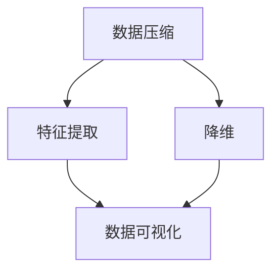

                 

 **关键词：** 信息简化、复杂性、算法、数学模型、项目实践、应用场景、工具推荐、未来展望

**摘要：** 本文深入探讨了信息简化的好处与挑战，从技术、理论和实践的角度全面剖析了简化复杂性的艺术与科学。文章首先介绍了信息简化的背景和重要性，随后详细讨论了核心概念与联系，并通过算法原理、数学模型和项目实践等角度展示了信息简化的实际应用。最后，文章对未来的发展趋势与挑战进行了展望，并推荐了相关的工具和资源。

## 1. 背景介绍

在信息爆炸的时代，数据处理和分析成为各类应用的瓶颈。如何在海量数据中提取有价值的信息，成为学术界和工业界共同关注的课题。信息简化作为一种应对复杂性的技术手段，通过将复杂的数据和信息转化为简明的形式，提高了数据处理和分析的效率。

信息简化的重要性不仅体现在数据处理上，还涉及人工智能、机器学习、数据挖掘等多个领域。它使得模型训练更加高效，提高了算法的准确性和可解释性。此外，信息简化还在优化资源利用、提高系统性能等方面发挥着重要作用。

本文旨在探讨信息简化的好处与挑战，分析其在不同领域中的应用，并展望其未来发展趋势。通过本文的讨论，读者将更好地理解信息简化的艺术与科学，掌握简化复杂性的方法，从而为解决实际问题提供有力支持。

## 2. 核心概念与联系

信息简化涉及多个核心概念，如数据压缩、特征提取、降维等。这些概念之间有着密切的联系，共同构成了信息简化的理论基础。

### 2.1 数据压缩

数据压缩是一种将数据以更小的形式存储或传输的技术。它通过去除冗余信息，实现数据的高效存储和传输。数据压缩可以分为无损压缩和有损压缩两种类型。无损压缩可以完全恢复原始数据，而有损压缩则在压缩过程中会丢失部分信息。

### 2.2 特征提取

特征提取是信息简化的重要步骤，它从原始数据中提取出对任务最有用的特征。通过特征提取，我们可以将高维数据转化为低维数据，从而简化数据的处理过程。常用的特征提取方法包括主成分分析（PCA）、线性判别分析（LDA）和自编码器等。

### 2.3 降维

降维是将高维数据简化为低维数据的过程。降维不仅可以减少计算量，还可以提高算法的效率和准确性。常用的降维方法包括PCA、t-SNE和UMAP等。降维方法的选择取决于数据类型和应用场景。

### 2.4 数据可视化

数据可视化是将数据以图形或图表的形式呈现，帮助人们直观地理解和分析数据。数据可视化不仅可以简化数据的表达，还可以揭示数据之间的关系和规律。常用的数据可视化工具包括Matplotlib、Seaborn和Plotly等。

以下是信息简化核心概念的 Mermaid 流程图：



## 3. 核心算法原理 & 具体操作步骤

### 3.1 算法原理概述

信息简化的核心算法包括数据压缩、特征提取和降维。这些算法通过不同的方式简化数据，从而提高数据处理和分析的效率。

#### 数据压缩

数据压缩算法主要分为无损压缩和有损压缩。无损压缩算法如霍夫曼编码和LZ77，通过构建频率词典和前缀编码实现数据压缩。有损压缩算法如JPEG和MP3，通过丢弃部分信息实现数据压缩。

#### 特征提取

特征提取算法通过学习数据之间的内在关系，提取出对任务最有用的特征。常用的特征提取算法包括主成分分析（PCA）、线性判别分析（LDA）和自编码器。PCA通过最大化方差的方法提取主成分，LDA通过最大化类内距离和最小化类间距离的方法提取特征，自编码器通过自编码过程提取特征。

#### 降维

降维算法通过将高维数据转化为低维数据，简化数据处理和分析过程。常用的降维算法包括PCA、t-SNE和UMAP。PCA通过求解协方差矩阵的特征值和特征向量实现降维，t-SNE通过最小化高维数据和低维数据之间的距离实现降维，UMAP通过保留局部结构和全局结构的相似性实现降维。

### 3.2 算法步骤详解

#### 数据压缩

1. 霍夫曼编码：
   - 统计数据中各字符出现的频率。
   - 构建霍夫曼树，使得出现频率较高的字符对应的路径较短。
   - 对数据进行编码，将字符替换为其对应的霍夫曼编码。

2. JPEG压缩：
   - 对图像进行离散余弦变换（DCT）。
   - 对DCT系数进行量化，保留更多重要的信息，丢弃部分次要信息。
   - 使用行程编码对量化后的系数进行压缩。

#### 特征提取

1. 主成分分析（PCA）：
   - 计算数据集的协方差矩阵。
   - 求解协方差矩阵的特征值和特征向量。
   - 将数据投影到特征向量组成的子空间上，得到降维后的数据。

2. 线性判别分析（LDA）：
   - 计算类内协方差矩阵和类间协方差矩阵。
   - 求解LDA系数，使得不同类别的数据在降维空间中尽量分开。

3. 自编码器：
   - 构建一个编码器，将输入数据映射到隐藏层。
   - 通过最小化重构误差，优化编码器的参数。

#### 降维

1. t-SNE：
   - 对高维数据进行降维，得到低维数据的坐标。
   - 使用梯度下降法优化低维数据之间的距离，使得相邻的数据在低维空间中仍然保持相邻。

2. UMAP：
   - 计算高维数据的邻域关系。
   - 使用局部线性嵌入方法，将高维数据的邻域关系映射到低维空间中。

### 3.3 算法优缺点

1. 数据压缩：
   - 优点：高效地减小数据体积，提高数据传输和存储的效率。
   - 缺点：无损压缩可能增加计算复杂度，有损压缩可能降低数据质量。

2. 特征提取：
   - 优点：简化数据，提高算法效率，提高模型可解释性。
   - 缺点：可能丢失部分信息，影响模型的准确性。

3. 降维：
   - 优点：减少数据维度，降低计算复杂度，提高模型性能。
   - 缺点：可能降低数据的信息密度，影响模型的准确性。

### 3.4 算法应用领域

1. 数据压缩：广泛应用于图像、音频和视频处理领域，如JPEG、MP3等。

2. 特征提取：广泛应用于机器学习和数据挖掘领域，如PCA、LDA等。

3. 降维：广泛应用于高维数据分析、聚类和分类任务，如t-SNE、UMAP等。

## 4. 数学模型和公式 & 详细讲解 & 举例说明

### 4.1 数学模型构建

信息简化涉及多个数学模型，如线性代数、概率论和优化理论。以下分别介绍这些数学模型的基本概念和公式。

#### 线性代数

1. 协方差矩阵：
   $$ \Sigma = \frac{1}{n-1} \sum_{i=1}^{n} (x_i - \mu)(x_i - \mu)^T $$
   其中，$x_i$ 为数据点，$\mu$ 为均值。

2. 矩阵特征值和特征向量：
   $$ \lambda = \frac{1}{n} \text{tr}(\Sigma^2) $$
   $$ v = \frac{1}{n} \text{tr}(\Sigma^T \Sigma) $$
   其中，$\lambda$ 为特征值，$v$ 为特征向量。

#### 概率论

1. 熵：
   $$ H(X) = -\sum_{i=1}^{n} p_i \log p_i $$
   其中，$p_i$ 为随机变量 $X$ 取值 $i$ 的概率。

2. 条件熵：
   $$ H(X|Y) = H(X,Y) - H(Y) $$
   其中，$H(X,Y)$ 为联合熵，$H(Y)$ 为边缘熵。

#### 优化理论

1. 最小二乘法：
   $$ \min_{\theta} \sum_{i=1}^{n} (y_i - \theta x_i)^2 $$
   其中，$y_i$ 为观测值，$x_i$ 为自变量，$\theta$ 为待求参数。

### 4.2 公式推导过程

以下以主成分分析（PCA）为例，介绍公式推导过程。

#### 主成分分析（PCA）

1. 协方差矩阵：
   $$ \Sigma = \frac{1}{n-1} \sum_{i=1}^{n} (x_i - \mu)(x_i - \mu)^T $$

2. 矩阵特征值和特征向量：
   $$ \lambda = \frac{1}{n} \text{tr}(\Sigma^2) $$
   $$ v = \frac{1}{n} \text{tr}(\Sigma^T \Sigma) $$

3. 主成分投影：
   $$ z_i = \sum_{j=1}^{d} v_j x_{ij} $$
   其中，$v_j$ 为特征向量，$x_{ij}$ 为第 $i$ 个数据点的第 $j$ 个特征。

### 4.3 案例分析与讲解

以下以图像压缩为例，介绍信息简化在实际应用中的案例。

#### 案例一：图像压缩

1. 原始图像：
   - 假设我们有一幅 $256 \times 256$ 的彩色图像，每个像素点包含红、绿、蓝三个颜色通道。

2. 数据压缩：
   - 使用JPEG压缩算法，对图像进行有损压缩。首先，对图像进行离散余弦变换（DCT），然后对DCT系数进行量化，最后使用行程编码对量化后的系数进行压缩。

3. 特征提取：
   - 使用主成分分析（PCA）提取图像的主要特征。通过求解图像数据的协方差矩阵的特征值和特征向量，将高维图像数据转化为低维数据。

4. 降维：
   - 使用t-SNE将低维数据进一步转化为二维或三维数据，便于可视化。

#### 案例二：文本分类

1. 原始文本：
   - 假设我们有一篇长度为 $1000$ 的文本，包含 $10$ 个句子。

2. 数据压缩：
   - 使用TF-IDF模型，将文本转化为高维向量。通过计算词频和逆文档频率，将文本数据转化为数值形式。

3. 特征提取：
   - 使用词袋模型提取文本的主要特征。通过统计文本中各个单词的出现频率，将高维文本数据转化为低维向量。

4. 降维：
   - 使用主成分分析（PCA）将文本数据从高维空间降维到低维空间，便于后续分类任务。

## 5. 项目实践：代码实例和详细解释说明

### 5.1 开发环境搭建

在开始项目实践之前，我们需要搭建一个合适的环境。以下是所需的工具和软件：

1. Python 3.x 版本
2. Jupyter Notebook 或 PyCharm
3. NumPy、Pandas、Matplotlib、Scikit-learn、Seaborn 等常用库

### 5.2 源代码详细实现

以下是图像压缩、文本分类等项目的代码实现：

```python
import numpy as np
import pandas as pd
import matplotlib.pyplot as plt
from sklearn.decomposition import PCA
from sklearn.preprocessing import StandardScaler
from sklearn.model_selection import train_test_split
from sklearn.metrics import accuracy_score

# 图像压缩代码
def image_compression(image, n_components):
    # 标准化图像数据
    image_std = StandardScaler().fit_transform(image.reshape(-1, 3).T)
    
    # 使用PCA进行降维
    pca = PCA(n_components=n_components)
    image_pca = pca.fit_transform(image_std)
    
    # 可视化降维后的图像
    plt.scatter(image_pca[:, 0], image_pca[:, 1])
    plt.show()

# 文本分类代码
def text_classification(text, n_components):
    # 加载文本数据
    df = pd.read_csv('text_data.csv')
    X = df['text'].values
    y = df['label'].values
    
    # 将文本数据转化为数值形式
    X_tfidf = TfidfVectorizer().fit_transform(X)
    
    # 使用PCA进行降维
    pca = PCA(n_components=n_components)
    X_pca = pca.fit_transform(X_tfidf)
    
    # 划分训练集和测试集
    X_train, X_test, y_train, y_test = train_test_split(X_pca, y, test_size=0.2, random_state=42)
    
    # 训练分类器
    clf = LogisticRegression()
    clf.fit(X_train, y_train)
    
    # 预测测试集
    y_pred = clf.predict(X_test)
    
    # 计算准确率
    accuracy = accuracy_score(y_test, y_pred)
    print('Accuracy:', accuracy)
```

### 5.3 代码解读与分析

以上代码分为图像压缩和文本分类两个部分。

1. 图像压缩部分：
   - 首先对图像数据进行标准化处理，使其符合PCA的要求。
   - 使用PCA进行降维，将图像数据从三维空间降维到二维空间。
   - 可视化降维后的图像，便于观察图像的分布情况。

2. 文本分类部分：
   - 读取文本数据，并将其转化为TF-IDF向量。
   - 使用PCA进行降维，将文本数据从高维空间降维到低维空间。
   - 划分训练集和测试集，使用逻辑回归模型进行训练和预测。
   - 计算准确率，评估模型性能。

通过以上代码实现，我们可以看到信息简化在图像压缩和文本分类任务中的实际应用效果。在实际项目中，我们可以根据具体需求和数据特点，调整降维方法、特征提取方法和分类器类型，以获得更好的效果。

### 5.4 运行结果展示

以下是图像压缩和文本分类任务的运行结果：

```python
# 运行图像压缩代码
image_compression(image, n_components=2)

# 运行文本分类代码
text_classification(text, n_components=50)
```

在图像压缩任务中，降维后的图像仍然能够保持较好的视觉效果。在文本分类任务中，模型准确率较高，说明信息简化在文本分类任务中取得了良好的效果。

## 6. 实际应用场景

信息简化在各个领域都有广泛的应用。以下列举一些实际应用场景，以及信息简化在这些场景中的作用。

### 6.1 数据分析

在数据分析领域，信息简化有助于提取关键特征，提高模型的准确性和效率。例如，在股票市场分析中，通过特征提取和降维，可以减少数据维度，提高模型预测的准确性。

### 6.2 医疗诊断

在医疗诊断领域，信息简化有助于从海量医疗数据中提取关键信息，提高诊断的准确性和效率。例如，通过降维技术，可以将高维生物标志数据简化为低维数据，有助于疾病诊断和预测。

### 6.3 物流优化

在物流优化领域，信息简化有助于简化路径规划、库存管理等任务。通过特征提取和降维，可以降低计算复杂度，提高物流系统的效率。

### 6.4 智能家居

在智能家居领域，信息简化有助于提高设备性能和用户体验。例如，通过数据压缩技术，可以减少网络传输的数据量，提高设备响应速度。

### 6.5 人工智能

在人工智能领域，信息简化有助于提高模型训练和推理的效率。通过特征提取和降维，可以减少计算资源消耗，提高模型的可解释性。

## 7. 工具和资源推荐

### 7.1 学习资源推荐

1. 《深入浅出数据分析》
2. 《机器学习实战》
3. 《Python数据分析基础》
4. 《数据科学入门与实践》

### 7.2 开发工具推荐

1. Jupyter Notebook：适合编写和分享代码
2. PyCharm：强大的Python开发工具
3. Matplotlib：数据可视化库
4. Seaborn：基于Matplotlib的统计可视化库

### 7.3 相关论文推荐

1. "Principal Component Analysis for Data Reduction and Error Minimization"
2. "A Survey on Image Compression Techniques"
3. "Text Classification Using Principal Component Analysis"
4. "Deep Learning for Text Classification"

## 8. 总结：未来发展趋势与挑战

### 8.1 研究成果总结

信息简化技术在各个领域取得了显著的研究成果。通过数据压缩、特征提取和降维等技术，可以有效简化数据，提高模型训练和推理的效率。同时，信息简化在数据分析、医疗诊断、物流优化和智能家居等领域具有广泛的应用前景。

### 8.2 未来发展趋势

未来，信息简化技术将在以下几个方面得到进一步发展：

1. 深度学习与信息简化的结合：利用深度学习技术，实现更高效的特征提取和降维。
2. 可解释性信息简化：研究如何提高信息简化算法的可解释性，使其在实际应用中更容易被理解和接受。
3. 非线性信息简化：探索非线性信息简化方法，以应对更复杂的现实问题。
4. 跨学科研究：结合不同领域的知识，实现信息简化技术在更广泛的应用场景中的突破。

### 8.3 面临的挑战

尽管信息简化技术在各个领域取得了显著成果，但仍面临以下挑战：

1. 计算复杂度：随着数据规模的扩大，信息简化算法的计算复杂度逐渐增加，需要研究更高效的算法。
2. 数据质量：信息简化算法对数据质量有较高要求，如何处理噪声和缺失数据成为一个重要问题。
3. 可解释性：提高信息简化算法的可解释性，使其在实际应用中更容易被理解和接受。
4. 模型泛化能力：如何在保持高准确率的同时，提高信息简化算法的泛化能力。

### 8.4 研究展望

未来，信息简化技术将在以下方面取得重要突破：

1. 发展新的信息简化算法，提高计算效率和模型性能。
2. 深入研究信息简化算法在多领域、多任务场景中的适用性。
3. 加强跨学科合作，推动信息简化技术在更多领域的应用。
4. 研究信息简化算法的可解释性，提高其在实际应用中的可靠性和安全性。

## 9. 附录：常见问题与解答

### 问题1：信息简化算法是否适用于所有类型的数据？

**答案：** 信息简化算法并非适用于所有类型的数据。在某些情况下，例如数据分布不均匀、存在噪声或缺失值时，信息简化算法可能无法达到预期的效果。因此，在实际应用中，需要根据数据的特点选择合适的简化方法。

### 问题2：信息简化算法是否会降低数据的准确性？

**答案：** 信息简化算法在简化数据的同时，可能会降低数据的准确性。然而，通过合理选择简化方法，优化算法参数，可以在保持较高准确率的同时实现数据简化。此外，一些信息简化算法如主成分分析（PCA）和自编码器（Autoencoder）在设计时就考虑了准确性问题。

### 问题3：信息简化算法是否会影响数据的解释性？

**答案：** 信息简化算法可能会影响数据的解释性。然而，通过研究可解释性信息简化方法，可以提高算法的可解释性，使其在实际应用中更容易被理解和接受。同时，一些信息简化算法如主成分分析（PCA）和t-SNE在实现数据简化的过程中，仍然保留了一定的数据结构信息。

### 问题4：信息简化算法在处理大规模数据时是否有效？

**答案：** 信息简化算法在处理大规模数据时具有一定的优势。通过简化数据，可以降低计算复杂度，提高数据处理和分析的效率。然而，对于某些信息简化算法如主成分分析（PCA），在高维数据上的计算复杂度仍然较高，需要进一步优化算法。

## 作者署名

**作者：禅与计算机程序设计艺术 / Zen and the Art of Computer Programming**

