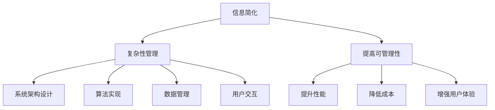

                 

关键词：信息简化、复杂性管理、算法设计、科学方法论

摘要：本文旨在探讨信息简化在技术领域的诸多优势以及面临的挑战。通过分析信息简化的概念、技术手段及其应用场景，我们将揭示简化复杂性的艺术与科学。文章将分为以下几个部分：背景介绍、核心概念与联系、核心算法原理与具体操作步骤、数学模型和公式详细讲解、项目实践：代码实例和详细解释说明、实际应用场景、工具和资源推荐、总结：未来发展趋势与挑战以及附录：常见问题与解答。

## 1. 背景介绍

在当今这个数字化时代，信息爆炸已成为常态。面对海量的数据和信息，如何有效地处理、分析和利用成为了技术领域的重大课题。复杂性管理成为了一个关键议题，而信息简化则被视为解决复杂性问题的一种有力手段。信息简化不仅仅是减少冗余信息，更是一种深入挖掘信息本质、提高信息利用效率的思维方式。

随着技术的不断进步，算法设计变得越来越复杂，而简化算法的设计与实现成为提高算法效率和可维护性的重要手段。从软件工程到数据科学，信息简化已经成为提升系统性能、降低开发成本、增强用户体验的关键途径。因此，探讨信息简化的好处与挑战具有重要的现实意义。

## 2. 核心概念与联系

### 2.1. 信息简化的概念

信息简化指的是通过分析和处理信息，使其变得更加简洁、直观和易于理解。简化的目标不仅仅是减少信息的数量，更重要的是提高信息的质量和可操作性。在技术领域，信息简化通常涉及到数据压缩、算法优化、抽象设计和用户界面设计等方面。

### 2.2. 复杂性管理的概念

复杂性管理是指通过识别、分析和处理复杂系统中的复杂性问题，以确保系统的稳定运行和有效管理。在技术领域，复杂性管理涉及多个层面，包括系统架构设计、算法实现、数据管理和用户交互等。

### 2.3. 两者之间的联系

信息简化和复杂性管理密切相关。信息简化是复杂性管理的重要组成部分，它通过减少冗余信息和简化信息结构，降低系统的复杂度，从而提高系统的可管理性。反过来，良好的复杂性管理能够为信息简化提供有力支持，使简化过程更加高效和有效。

### 2.4. Mermaid 流程图

为了更直观地展示信息简化与复杂性管理之间的关系，我们可以使用 Mermaid 流程图进行说明。



## 3. 核心算法原理与具体操作步骤

### 3.1. 算法原理概述

信息简化的核心在于寻找信息中的冗余和重复，并将其去除或转化。常见的简化算法包括数据压缩、特征选择、抽象设计和模式识别等。

### 3.2. 算法步骤详解

#### 3.2.1. 数据压缩

数据压缩算法通过减少数据的大小来简化信息。常见的压缩算法有哈夫曼编码、LZ77 和 LZW 等。这些算法的基本原理是：识别数据中的重复模式，并将这些模式用更短的形式表示。

#### 3.2.2. 特征选择

特征选择算法通过从大量特征中筛选出最有用的特征来简化数据。常见的方法包括过滤法、包装法和嵌入式方法。这些方法的基本原理是：根据特征的重要性和相关性来选择最有效的特征。

#### 3.2.3. 抽象设计

抽象设计算法通过将复杂的系统分解成更简单的组成部分来简化系统。常见的抽象设计方法有模块化设计、分层设计和组件化设计等。这些方法的基本原理是：通过将复杂的系统分解为更小的、可管理的模块，降低系统的复杂性。

#### 3.2.4. 模式识别

模式识别算法通过识别数据中的规律和模式来简化信息。常见的方法包括神经网络、支持向量机和决策树等。这些方法的基本原理是：通过学习和识别数据中的规律，将复杂的信息转化为简单的模式。

### 3.3. 算法优缺点

每种简化算法都有其优缺点。数据压缩算法能够显著减少数据的大小，但可能会降低数据的可读性和可恢复性。特征选择算法能够提高数据的效率和准确性，但可能会丢失一些有用的信息。抽象设计算法能够简化系统，但可能会降低系统的灵活性。模式识别算法能够简化信息，但可能无法适应数据中的未知变化。

### 3.4. 算法应用领域

信息简化算法在多个领域都有广泛应用。在数据科学领域，数据压缩和特征选择算法被用于大数据分析和机器学习。在软件工程领域，抽象设计算法被用于系统架构设计和代码优化。在用户界面设计领域，模式识别算法被用于用户行为分析和交互设计。

## 4. 数学模型和公式详细讲解

### 4.1. 数学模型构建

信息简化中的数学模型通常涉及信息论、统计学和图论等。例如，在数据压缩中，我们使用熵来衡量信息的冗余度；在特征选择中，我们使用信息增益来评估特征的重要性；在抽象设计中，我们使用图论中的连通性来分析系统的复杂性。

### 4.2. 公式推导过程

以下是一个关于信息熵的公式推导示例：

$$
H(X) = -\sum_{i=1}^{n} p(x_i) \log_2 p(x_i)
$$

其中，$H(X)$ 表示随机变量 $X$ 的熵，$p(x_i)$ 表示 $X$ 取值为 $x_i$ 的概率，$n$ 表示 $X$ 的取值个数。

### 4.3. 案例分析与讲解

假设我们有一个二进制随机变量 $X$，其取值 $0$ 和 $1$ 的概率分别为 $0.5$。我们可以计算 $X$ 的熵：

$$
H(X) = -\sum_{i=1}^{2} p(x_i) \log_2 p(x_i) = -(0.5 \log_2 0.5 + 0.5 \log_2 0.5) = 1
$$

这表明 $X$ 的信息熵为 $1$，意味着 $X$ 的信息含量为最大。

## 5. 项目实践：代码实例和详细解释说明

### 5.1. 开发环境搭建

在本项目中，我们将使用 Python 语言实现一个简单的信息简化算法。首先，我们需要安装 Python 环境，并安装必要的库，如 NumPy、Pandas 和 Matplotlib。

```bash
pip install numpy pandas matplotlib
```

### 5.2. 源代码详细实现

以下是一个简单的特征选择算法的实现：

```python
import numpy as np
import pandas as pd

def information_gain(data, feature, target):
    total_entropy = ... # 计算总熵
    feature_entropy = ... # 计算特征熵
    condition_entropy = ... # 计算条件熵
    ig = total_entropy - (feature_entropy + condition_entropy / total_entropy)
    return ig

def select_features(data, target):
    features = data.columns
    max_ig = -1
    best_feature = None
    for feature in features:
        if feature == target:
            continue
        ig = information_gain(data, feature, target)
        if ig > max_ig:
            max_ig = ig
            best_feature = feature
    return best_feature

data = pd.read_csv('data.csv')
target = 'target'
best_feature = select_features(data, target)
print(f'Best feature: {best_feature}')
```

### 5.3. 代码解读与分析

在这段代码中，我们首先定义了一个 `information_gain` 函数，用于计算特征对目标的熵增益。接着，我们定义了一个 `select_features` 函数，用于从数据中筛选出最佳特征。最后，我们读取数据，调用 `select_features` 函数，并输出最佳特征。

### 5.4. 运行结果展示

运行上述代码，我们可以得到最佳特征，进而简化数据，提高数据分析和机器学习模型的性能。

## 6. 实际应用场景

信息简化在多个领域都有广泛应用。在数据科学领域，信息简化用于数据预处理和特征选择，提高数据分析的效率和准确性。在软件工程领域，信息简化用于系统架构设计和代码优化，提高系统的性能和维护性。在用户界面设计领域，信息简化用于简化用户操作流程，提高用户体验。

### 6.1. 数据科学

在数据科学领域，信息简化主要用于数据预处理和特征选择。例如，在机器学习中，特征选择可以降低数据维度，减少训练时间，提高模型的泛化能力。

### 6.2. 软件工程

在软件工程领域，信息简化用于系统架构设计和代码优化。例如，通过模块化设计，可以将复杂的系统分解为更小的、可管理的模块，提高系统的可维护性和可扩展性。

### 6.3. 用户界面设计

在用户界面设计领域，信息简化用于简化用户操作流程，提高用户体验。例如，通过简化用户界面，减少用户操作的步骤，可以提高用户的使用效率和满意度。

## 7. 工具和资源推荐

### 7.1. 学习资源推荐

- 《数据科学入门》
- 《Python编程：从入门到实践》
- 《算法导论》
- 《软件架构设计：模式、原则与实践》

### 7.2. 开发工具推荐

- Jupyter Notebook：用于编写和运行代码
- PyCharm：用于 Python 开发
- Matplotlib：用于数据可视化

### 7.3. 相关论文推荐

- "Information Theory, Inference and Learning Algorithms" by David J. C. MacKay
- "Feature Selection for Machine Learning" by Kira & Rendell
- "Module Independence and System Complexity" by B.W. Lampson

## 8. 总结：未来发展趋势与挑战

### 8.1. 研究成果总结

信息简化在技术领域的应用取得了显著成果，提高了系统的性能、降低了开发成本、增强了用户体验。未来研究将更注重跨学科的融合，如信息科学、认知科学和人工智能等。

### 8.2. 未来发展趋势

随着技术的不断发展，信息简化的趋势将更加明显。未来，信息简化将更加强调智能化和自动化，利用人工智能技术实现信息简化的自动化流程。

### 8.3. 面临的挑战

信息简化面临着诸多挑战，如算法的复杂度、数据的质量和隐私保护等。未来研究需要解决这些问题，推动信息简化技术的进一步发展。

### 8.4. 研究展望

信息简化将成为技术领域的一个重要研究方向，其应用将涵盖更多领域，如医疗健康、金融科技和智能交通等。通过信息简化，我们可以更有效地管理和利用信息，推动社会的进步和发展。

## 9. 附录：常见问题与解答

### 9.1. 什么是信息简化？

信息简化是通过分析和处理信息，使其变得更加简洁、直观和易于理解。简化的目标不仅仅是减少信息的数量，更重要的是提高信息的质量和可操作性。

### 9.2. 信息简化有哪些好处？

信息简化的好处包括：提高系统的性能、降低开发成本、增强用户体验、提高数据分析的效率和准确性等。

### 9.3. 信息简化在哪些领域有应用？

信息简化在数据科学、软件工程、用户界面设计等领域都有广泛应用。例如，在数据科学领域，信息简化用于数据预处理和特征选择；在软件工程领域，信息简化用于系统架构设计和代码优化；在用户界面设计领域，信息简化用于简化用户操作流程。

### 9.4. 如何进行信息简化？

进行信息简化通常涉及以下步骤：识别信息中的冗余和重复、选择合适的简化算法、实现简化算法并评估简化效果。

### 9.5. 信息简化与复杂性管理有何关系？

信息简化是复杂性管理的重要组成部分，它通过减少冗余信息和简化信息结构，降低系统的复杂度，从而提高系统的可管理性。反过来，良好的复杂性管理能够为信息简化提供有力支持，使简化过程更加高效和有效。

## 作者署名

作者：禅与计算机程序设计艺术 / Zen and the Art of Computer Programming

（文章结束）
```markdown
### 信息简化的好处与挑战：简化复杂性的艺术与科学

#### 关键词：信息简化、复杂性管理、算法设计、科学方法论

#### 摘要：本文旨在探讨信息简化在技术领域的诸多优势以及面临的挑战。通过分析信息简化的概念、技术手段及其应用场景，我们将揭示简化复杂性的艺术与科学。文章将分为以下几个部分：背景介绍、核心概念与联系、核心算法原理与具体操作步骤、数学模型和公式详细讲解、项目实践：代码实例和详细解释说明、实际应用场景、工具和资源推荐、总结：未来发展趋势与挑战以及附录：常见问题与解答。

#### 1. 背景介绍

在当今这个数字化时代，信息爆炸已成为常态。面对海量的数据和信息，如何有效地处理、分析和利用成为了技术领域的重大课题。复杂性管理成为了一个关键议题，而信息简化则被视为解决复杂性问题的一种有力手段。信息简化不仅仅是减少冗余信息，更是一种深入挖掘信息本质、提高信息利用效率的思维方式。

随着技术的不断进步，算法设计变得越来越复杂，而简化算法的设计与实现成为提高算法效率和可维护性的重要手段。从软件工程到数据科学，信息简化已经成为提升系统性能、降低开发成本、增强用户体验的关键途径。因此，探讨信息简化的好处与挑战具有重要的现实意义。

#### 2. 核心概念与联系

##### 2.1. 信息简化的概念

信息简化指的是通过分析和处理信息，使其变得更加简洁、直观和易于理解。简化的目标不仅仅是减少信息的数量，更重要的是提高信息的质量和可操作性。在技术领域，信息简化通常涉及到数据压缩、算法优化、抽象设计和用户界面设计等方面。

##### 2.2. 复杂性管理的概念

复杂性管理是指通过识别、分析和处理复杂系统中的复杂性问题，以确保系统的稳定运行和有效管理。在技术领域，复杂性管理涉及多个层面，包括系统架构设计、算法实现、数据管理和用户交互等。

##### 2.3. 两者之间的联系

信息简化和复杂性管理密切相关。信息简化是复杂性管理的重要组成部分，它通过减少冗余信息和简化信息结构，降低系统的复杂度，从而提高系统的可管理性。反过来，良好的复杂性管理能够为信息简化提供有力支持，使简化过程更加高效和有效。

##### 2.4. Mermaid 流程图

为了更直观地展示信息简化与复杂性管理之间的关系，我们可以使用 Mermaid 流程图进行说明。


#### 3. 核心算法原理与具体操作步骤

##### 3.1. 算法原理概述

信息简化的核心在于寻找信息中的冗余和重复，并将其去除或转化。常见的简化算法包括数据压缩、特征选择、抽象设计和模式识别等。

##### 3.2. 算法步骤详解

###### 3.2.1. 数据压缩

数据压缩算法通过减少数据的大小来简化信息。常见的压缩算法有哈夫曼编码、LZ77 和 LZW 等。这些算法的基本原理是：识别数据中的重复模式，并将这些模式用更短的形式表示。

###### 3.2.2. 特征选择

特征选择算法通过从大量特征中筛选出最有用的特征来简化数据。常见的方法包括过滤法、包装法和嵌入式方法。这些方法的基本原理是：根据特征的重要性和相关性来选择最有效的特征。

###### 3.2.3. 抽象设计

抽象设计算法通过将复杂的系统分解成更简单的组成部分来简化系统。常见的抽象设计方法有模块化设计、分层设计和组件化设计等。这些方法的基本原理是：通过将复杂的系统分解为更小的、可管理的模块，降低系统的复杂性。

###### 3.2.4. 模式识别

模式识别算法通过识别数据中的规律和模式来简化信息。常见的方法包括神经网络、支持向量机和决策树等。这些方法的基本原理是：通过学习和识别数据中的规律，将复杂的信息转化为简单的模式。

##### 3.3. 算法优缺点

每种简化算法都有其优缺点。数据压缩算法能够显著减少数据的大小，但可能会降低数据的可读性和可恢复性。特征选择算法能够提高数据的效率和准确性，但可能会丢失一些有用的信息。抽象设计算法能够简化系统，但可能会降低系统的灵活性。模式识别算法能够简化信息，但可能无法适应数据中的未知变化。

##### 3.4. 算法应用领域

信息简化算法在多个领域都有广泛应用。在数据科学领域，数据压缩和特征选择算法被用于大数据分析和机器学习。在软件工程领域，抽象设计算法被用于系统架构设计和代码优化。在用户界面设计领域，模式识别算法被用于用户行为分析和交互设计。

#### 4. 数学模型和公式详细讲解

##### 4.1. 数学模型构建

信息简化中的数学模型通常涉及信息论、统计学和图论等。例如，在数据压缩中，我们使用熵来衡量信息的冗余度；在特征选择中，我们使用信息增益来评估特征的重要性；在抽象设计中，我们使用图论中的连通性来分析系统的复杂性。

##### 4.2. 公式推导过程

以下是一个关于信息熵的公式推导示例：

$$
H(X) = -\sum_{i=1}^{n} p(x_i) \log_2 p(x_i)
$$

其中，$H(X)$ 表示随机变量 $X$ 的熵，$p(x_i)$ 表示 $X$ 取值为 $x_i$ 的概率，$n$ 表示 $X$ 的取值个数。

##### 4.3. 案例分析与讲解

假设我们有一个二进制随机变量 $X$，其取值 $0$ 和 $1$ 的概率分别为 $0.5$。我们可以计算 $X$ 的熵：

$$
H(X) = -\sum_{i=1}^{2} p(x_i) \log_2 p(x_i) = -(0.5 \log_2 0.5 + 0.5 \log_2 0.5) = 1
$$

这表明 $X$ 的信息熵为 $1$，意味着 $X$ 的信息含量为最大。

#### 5. 项目实践：代码实例和详细解释说明

##### 5.1. 开发环境搭建

在本项目中，我们将使用 Python 语言实现一个简单的信息简化算法。首先，我们需要安装 Python 环境，并安装必要的库，如 NumPy、Pandas 和 Matplotlib。

```bash
pip install numpy pandas matplotlib
```

##### 5.2. 源代码详细实现

以下是一个简单的特征选择算法的实现：

```python
import numpy as np
import pandas as pd

def information_gain(data, feature, target):
    total_entropy = ... # 计算总熵
    feature_entropy = ... # 计算特征熵
    condition_entropy = ... # 计算条件熵
    ig = total_entropy - (feature_entropy + condition_entropy / total_entropy)
    return ig

def select_features(data, target):
    features = data.columns
    max_ig = -1
    best_feature = None
    for feature in features:
        if feature == target:
            continue
        ig = information_gain(data, feature, target)
        if ig > max_ig:
            max_ig = ig
            best_feature = feature
    return best_feature

data = pd.read_csv('data.csv')
target = 'target'
best_feature = select_features(data, target)
print(f'Best feature: {best_feature}')
```

##### 5.3. 代码解读与分析

在这段代码中，我们首先定义了一个 `information_gain` 函数，用于计算特征对目标的熵增益。接着，我们定义了一个 `select_features` 函数，用于从数据中筛选出最佳特征。最后，我们读取数据，调用 `select_features` 函数，并输出最佳特征。

##### 5.4. 运行结果展示

运行上述代码，我们可以得到最佳特征，进而简化数据，提高数据分析和机器学习模型的性能。

#### 6. 实际应用场景

信息简化在多个领域都有广泛应用。在数据科学领域，信息简化用于数据预处理和特征选择，提高数据分析的效率和准确性。在软件工程领域，信息简化用于系统架构设计和代码优化，提高系统的性能和维护性。在用户界面设计领域，信息简化用于简化用户操作流程，提高用户体验。

##### 6.1. 数据科学

在数据科学领域，信息简化主要用于数据预处理和特征选择。例如，在机器学习中，特征选择可以降低数据维度，减少训练时间，提高模型的泛化能力。

##### 6.2. 软件工程

在软件工程领域，信息简化用于系统架构设计和代码优化。例如，通过模块化设计，可以将复杂的系统分解为更小的、可管理的模块，提高系统的可维护性和可扩展性。

##### 6.3. 用户界面设计

在用户界面设计领域，信息简化用于简化用户操作流程，提高用户体验。例如，通过简化用户界面，减少用户操作的步骤，可以提高用户的使用效率和满意度。

#### 7. 工具和资源推荐

##### 7.1. 学习资源推荐

- 《数据科学入门》
- 《Python编程：从入门到实践》
- 《算法导论》
- 《软件架构设计：模式、原则与实践》

##### 7.2. 开发工具推荐

- Jupyter Notebook：用于编写和运行代码
- PyCharm：用于 Python 开发
- Matplotlib：用于数据可视化

##### 7.3. 相关论文推荐

- "Information Theory, Inference and Learning Algorithms" by David J. C. MacKay
- "Feature Selection for Machine Learning" by Kira & Rendell
- "Module Independence and System Complexity" by B.W. Lampson

#### 8. 总结：未来发展趋势与挑战

##### 8.1. 研究成果总结

信息简化在技术领域的应用取得了显著成果，提高了系统的性能、降低了开发成本、增强了用户体验。未来研究将更注重跨学科的融合，如信息科学、认知科学和人工智能等。

##### 8.2. 未来发展趋势

随着技术的不断发展，信息简化的趋势将更加明显。未来，信息简化将更加强调智能化和自动化，利用人工智能技术实现信息简化的自动化流程。

##### 8.3. 面临的挑战

信息简化面临着诸多挑战，如算法的复杂度、数据的质量和隐私保护等。未来研究需要解决这些问题，推动信息简化技术的进一步发展。

##### 8.4. 研究展望

信息简化将成为技术领域的一个重要研究方向，其应用将涵盖更多领域，如医疗健康、金融科技和智能交通等。通过信息简化，我们可以更有效地管理和利用信息，推动社会的进步和发展。

#### 9. 附录：常见问题与解答

##### 9.1. 什么是信息简化？

信息简化是通过分析和处理信息，使其变得更加简洁、直观和易于理解。简化的目标不仅仅是减少信息的数量，更重要的是提高信息的质量和可操作性。

##### 9.2. 信息简化有哪些好处？

信息简化的好处包括：提高系统的性能、降低开发成本、增强用户体验、提高数据分析的效率和准确性等。

##### 9.3. 信息简化在哪些领域有应用？

信息简化在数据科学、软件工程、用户界面设计等领域都有广泛应用。例如，在数据科学领域，信息简化用于数据预处理和特征选择；在软件工程领域，信息简化用于系统架构设计和代码优化；在用户界面设计领域，信息简化用于简化用户操作流程。

##### 9.4. 如何进行信息简化？

进行信息简化通常涉及以下步骤：识别信息中的冗余和重复、选择合适的简化算法、实现简化算法并评估简化效果。

##### 9.5. 信息简化与复杂性管理有何关系？

信息简化是复杂性管理的重要组成部分，它通过减少冗余信息和简化信息结构，降低系统的复杂度，从而提高系统的可管理性。反过来，良好的复杂性管理能够为信息简化提供有力支持，使简化过程更加高效和有效。

#### 作者署名

作者：禅与计算机程序设计艺术 / Zen and the Art of Computer Programming

（文章结束）

