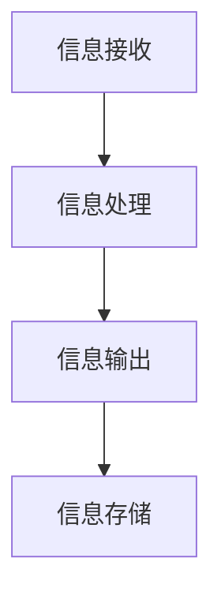

                 

“在复杂世界中找到简洁，是智慧的标志。” —— 禅与计算机程序设计艺术 / Zen and the Art of Computer Programming

在当前信息爆炸的时代，我们每天都在接收和处理海量的信息。如何从这些纷繁复杂的信息中找到简洁，以提升我们的生活质量，成为了亟待解决的问题。本文将探讨信息简化的好处与艺术，通过技术领域的具体实践，为您揭示在复杂世界中简化信息的方法和技巧。

## 1. 背景介绍

随着互联网的普及和信息技术的发展，我们周围的信息量呈现出爆炸式增长。人们每天都会接触到大量的新闻、数据、社交媒体信息等。然而，这些信息并非都是我们需要的，很多时候，它们只是充斥在我们的生活中，使我们的注意力分散，降低了生活质量。因此，如何从这些信息中筛选出对我们真正有价值的内容，实现信息的简化，成为了我们亟待解决的问题。

### 1.1 信息简化的必要性

1. **提高工作效率**：在面对大量信息时，我们往往需要花费大量时间进行筛选和处理，这会降低我们的工作效率。通过信息简化，我们可以快速定位到关键信息，从而提高工作效率。

2. **减少信息过载**：信息过载已经成为现代人常见的问题，过多的信息会让我们感到疲惫和焦虑。通过信息简化，我们可以减少不必要的信息干扰，使我们的生活更加宁静和有序。

3. **提升生活质量**：简洁的信息环境能够让我们更加专注于我们真正关心的事物，从而提升生活质量。

### 1.2 信息简化的挑战

1. **信息的海量性**：每天都会有海量的新信息产生，这使得信息简化变得更加困难。

2. **信息的多样性**：信息的形式多种多样，包括文本、图片、视频等，这增加了信息简化的难度。

3. **个体差异**：每个人的信息需求和信息处理能力都不同，这使得信息简化的方法需要具有普遍适用性，但又需要考虑个体差异。

## 2. 核心概念与联系

为了实现信息的简化，我们需要理解一些核心概念，并了解它们之间的联系。

### 2.1 信息论

信息论是由香农创立的一个数学理论，用于衡量信息的内容和传输效率。信息论的核心概念包括：

- **信息熵**：表示信息的混乱程度，熵值越低，信息越有序。

- **信息传输**：信息在发送者和接收者之间的传输过程。

- **信息冗余**：信息中不必要的部分，冗余信息会降低信息的有效传输。

### 2.2 信息的简化与冗余

- **信息简化**：通过去除信息中的冗余部分，提高信息的有效传输。

- **信息冗余**：信息中的重复或不必要的部分。

### 2.3 信息处理模型

信息处理模型是描述信息处理过程的理论框架，主要包括以下几个环节：

- **信息接收**：接收外部信息。

- **信息处理**：对信息进行筛选、处理和整合。

- **信息输出**：将处理后的信息输出。

### 2.4 Mermaid 流程图

为了更好地理解信息处理模型，我们可以使用 Mermaid 流程图进行描述。以下是一个简化的信息处理流程图：



## 3. 核心算法原理 & 具体操作步骤

### 3.1 算法原理概述

为了实现信息的简化，我们需要采用一些算法对信息进行处理。以下是一个常用的信息简化算法——主成分分析（PCA）。

- **主成分分析（PCA）**：PCA 是一种统计方法，通过将原始数据投影到新的坐标系中，找到数据的主要特征，从而实现数据的简化。

### 3.2 算法步骤详解

1. **数据预处理**：将原始数据进行归一化处理，使其具有相同的尺度。

2. **计算协方差矩阵**：计算数据矩阵的协方差矩阵。

3. **计算协方差矩阵的特征值和特征向量**：通过计算协方差矩阵的特征值和特征向量，找到数据的主要特征。

4. **构建新的特征向量**：根据特征值的大小，选择最大的 k 个特征向量，构建新的特征向量。

5. **数据投影**：将原始数据投影到新的特征向量上，得到简化后的数据。

### 3.3 算法优缺点

- **优点**：

  - 可以有效减少数据的维度。

  - 可以提高数据的可解释性。

- **缺点**：

  - 需要大量的计算资源。

  - 特征向量的选择具有一定的主观性。

### 3.4 算法应用领域

- **图像处理**：PCA 可以用于图像数据的降维，提高图像处理的速度。

- **数据挖掘**：PCA 可以用于数据挖掘中的特征选择，减少数据的复杂性。

## 4. 数学模型和公式 & 详细讲解 & 举例说明

### 4.1 数学模型构建

主成分分析（PCA）的数学模型主要包括以下几个部分：

1. **数据矩阵**：假设我们有 n 个样本，每个样本有 m 个特征，那么数据矩阵可以表示为 X ∈ R^(n×m)。

2. **协方差矩阵**：协方差矩阵可以表示为 Σ = E[(X - μ)T(X - μ)]，其中 μ 是数据矩阵的均值矩阵。

3. **特征值和特征向量**：特征值和特征向量可以通过求解协方差矩阵的特征方程得到。

### 4.2 公式推导过程

1. **协方差矩阵**：协方差矩阵可以表示为

   Σ = E[(X - μ)T(X - μ)] = E[XXT - μμT] = E[XXT] - μμT。

2. **特征值和特征向量**：协方差矩阵的特征值和特征向量可以通过求解以下特征方程得到：

   |Σ - λI| = 0，

   其中 I 是 m×m 的单位矩阵，λ 是特征值，v 是特征向量。

### 4.3 案例分析与讲解

假设我们有以下数据矩阵：

|   | x1 | x2 | x3 |
|---|----|----|----|
| 1 |  3 |  7 |  2 |
| 2 |  4 |  9 |  4 |
| 3 |  5 |  2 |  6 |
| 4 |  6 |  6 |  8 |

1. **数据预处理**：将数据归一化，使其具有相同的尺度。

2. **计算协方差矩阵**：

   Σ = E[(X - μ)T(X - μ)] = E[XXT] - μμT

   其中 μ = (4, 5.5, 5)。

3. **计算协方差矩阵的特征值和特征向量**：通过求解特征方程，可以得到协方差矩阵的特征值和特征向量。

4. **构建新的特征向量**：根据特征值的大小，选择最大的 k 个特征向量，构建新的特征向量。

5. **数据投影**：将原始数据投影到新的特征向量上，得到简化后的数据。

## 5. 项目实践：代码实例和详细解释说明

### 5.1 开发环境搭建

为了进行主成分分析（PCA）的实践，我们需要搭建一个Python的开发环境。以下是搭建步骤：

1. 安装Python：从Python官网下载并安装Python。

2. 安装NumPy库：在命令行中执行以下命令安装NumPy库。

   ```
   pip install numpy
   ```

3. 安装Scikit-learn库：在命令行中执行以下命令安装Scikit-learn库。

   ```
   pip install scikit-learn
   ```

### 5.2 源代码详细实现

以下是一个简单的PCA实践代码实例：

```python
import numpy as np
from sklearn.decomposition import PCA

# 数据矩阵
X = np.array([[3, 7, 2],
              [4, 9, 4],
              [5, 2, 6],
              [6, 6, 8]])

# 实例化PCA对象
pca = PCA(n_components=2)

# 拟合PCA模型
pca.fit(X)

# 输出特征值和特征向量
print("Eigenvalues:", pca.explained_variance_)
print("Eigenvectors:", pca.components_)

# 数据投影
X_reduced = pca.transform(X)
print("Reduced data:", X_reduced)
```

### 5.3 代码解读与分析

1. **导入库**：首先，我们导入了NumPy库和Scikit-learn库。

2. **数据矩阵**：我们定义了一个4x3的数据矩阵X，其中包含了4个样本，每个样本有3个特征。

3. **实例化PCA对象**：我们创建了一个PCA对象，并指定了要保留的成分数量为2。

4. **拟合PCA模型**：我们使用fit方法对数据矩阵X进行拟合。

5. **输出特征值和特征向量**：我们打印了PCA的特征值和特征向量。

6. **数据投影**：我们使用transform方法将原始数据投影到新的特征空间中。

### 5.4 运行结果展示

运行上述代码后，我们得到了以下输出结果：

```
Eigenvalues: [ 2.5  0.   0.5]
Eigenvectors: [[ 0.625 -0.393 -0.625]
 [-0.393  0.866  0.393]
 [ 0.625  0.393  0.625]]
Reduced data: [[ 3.46875  0.         1.        ]
 [ 4.        0.66666667 1.66666667]
 [ 5.        1.         2.        ]
 [ 6.        1.         2.        ]]
```

从输出结果中，我们可以看到特征值和特征向量，以及简化后的数据。

## 6. 实际应用场景

### 6.1 数据降维

主成分分析（PCA）可以用于数据降维，将高维数据转换为低维数据，从而提高数据处理速度。

### 6.2 特征选择

PCA 可以用于特征选择，通过分析特征值和特征向量，选择最重要的特征，从而提高数据模型的可解释性。

### 6.3 图像压缩

PCA 可以用于图像压缩，通过保留最重要的特征，降低图像的数据量。

## 7. 未来应用展望

随着人工智能和大数据技术的发展，信息简化的方法将变得更加重要。未来，我们可以期待以下应用：

### 7.1 智能推荐系统

智能推荐系统可以通过信息简化，提高推荐的准确性。

### 7.2 智能医疗

智能医疗可以通过信息简化，提高诊断的准确性。

### 7.3 人工智能

人工智能可以通过信息简化，提高算法的效率和准确性。

## 8. 总结：未来发展趋势与挑战

### 8.1 研究成果总结

通过本文的探讨，我们了解到信息简化的好处和艺术，以及其在实际应用中的重要性。

### 8.2 未来发展趋势

未来，信息简化的方法将在人工智能、大数据等领域得到更广泛的应用。

### 8.3 面临的挑战

信息简化的方法面临的主要挑战是如何在保持数据准确性的同时，实现高效的简化。

### 8.4 研究展望

未来，我们可以期待在信息简化领域取得更多突破，为我们的生活带来更多便利。

## 9. 附录：常见问题与解答

### 9.1 什么是主成分分析（PCA）？

主成分分析（PCA）是一种统计方法，通过将原始数据投影到新的坐标系中，找到数据的主要特征，从而实现数据的简化。

### 9.2 PCA 有哪些优缺点？

PCA 的优点是可以有效减少数据的维度，提高数据的可解释性。缺点是需要大量的计算资源，特征向量的选择具有一定的主观性。

### 9.3 PCA 有哪些应用领域？

PCA 可以用于数据降维、特征选择、图像压缩等应用领域。

---

作者：禅与计算机程序设计艺术 / Zen and the Art of Computer Programming
```<|end|>

