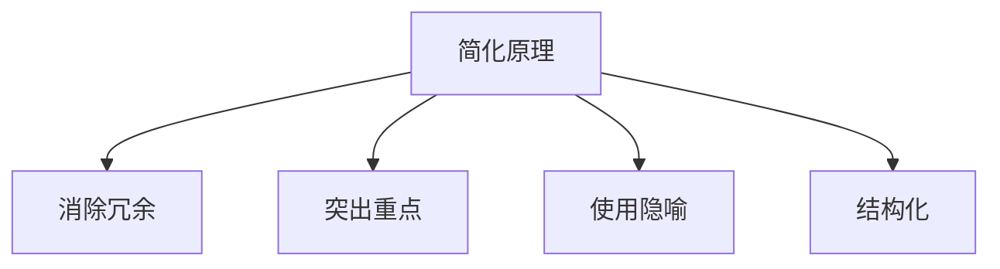

                 

在这个信息爆炸的时代，复杂性已成为我们生活的一部分。从日常工作中繁琐的任务，到复杂的技术系统，再到庞大的数据集，复杂性无处不在。面对这些复杂性，如何有效地管理和利用信息资源成为了一项重要的挑战。本文旨在探讨信息简化的好处与艺术，以及如何通过简化策略来提高生活质量和效率。

## 文章关键词

- 信息简化
- 生活质量
- 效率提升
- 简化策略
- 复杂性管理

## 文章摘要

本文首先介绍了信息简化的背景和重要性。接着，通过定义简化概念，分析了信息简化的几种方法和艺术。随后，文章从个人生活和工作两个方面，探讨了信息简化的实际应用，并通过具体实例说明了简化的效果。最后，文章提出了未来在信息简化领域的研究方向和挑战。

## 1. 背景介绍

### 1.1 信息时代的复杂性

在20世纪末，随着互联网的普及和信息技术的发展，信息量呈指数级增长。人们每天都会接收到大量的信息，这些信息以文字、图像、视频等多种形式呈现。然而，并非所有信息都对我们的生活和工作有实际价值。如何从这些信息中筛选出真正有用的内容，成为了当代人面临的挑战。

### 1.2 简化的必要性

信息简化旨在通过减少冗余信息、突出关键内容，提高信息的可用性和可理解性。在复杂的信息环境中，简化不仅有助于减轻认知负担，还能提高工作效率和生活质量。简化的必要性体现在以下几个方面：

- **减少认知负荷**：面对大量信息，大脑的注意力资源有限。通过简化，可以将复杂信息分解为更易理解和记忆的部分，降低认知负荷。
- **提高决策效率**：在商业决策中，快速准确地获取关键信息是成功的关键。信息简化可以帮助决策者快速识别重要信息，减少决策时间。
- **提升生活质量**：在日常生活中，通过简化家庭事务、社交互动和娱乐活动，可以减少不必要的压力，提高生活质量。

## 2. 核心概念与联系

### 2.1 简化的定义

简化（Simplification）是一种将复杂系统、过程或信息转化为更简单、易于理解和操作的形式的过程。简化的目标是减少复杂性，同时保留核心价值。

### 2.2 信息简化的原理

信息简化的核心原理是“KISS”（Keep It Simple, Stupid）。这一原理强调，在设计和处理信息时，应该尽量保持简单，避免过度复杂化。以下是一些实现信息简化的原理：

- **消除冗余**：去除重复、无关或冗余的信息，只保留核心内容。
- **突出重点**：通过图形、颜色、字体等手段，将关键信息突出显示，便于快速识别。
- **使用隐喻**：通过将复杂概念比喻为简单、熟悉的场景，帮助读者更好地理解。
- **结构化**：将信息组织成有序的结构，如列表、图表、流程图等，便于阅读和理解。

### 2.3 Mermaid 流程图



## 3. 核心算法原理 & 具体操作步骤

### 3.1 算法原理概述

信息简化的核心算法是基于“信息熵”的概念。信息熵是衡量信息不确定性的度量，信息熵越低，信息越简化。简化算法的目标是通过减少信息熵，将复杂的信息转化为更简洁的形式。

### 3.2 算法步骤详解

- **步骤1：信息收集**：收集需要简化的信息。
- **步骤2：信息分析**：分析信息的结构、冗余度和关键性。
- **步骤3：消除冗余**：去除重复、无关的信息。
- **步骤4：突出重点**：将关键信息进行突出处理。
- **步骤5：使用隐喻**：为复杂概念创建简单的比喻。
- **步骤6：结构化**：将信息组织成结构化的形式，如列表、图表等。

### 3.3 算法优缺点

- **优点**：
  - 提高信息的可用性和可理解性。
  - 减轻认知负荷，提高工作效率。
  - 降低信息处理的复杂性。

- **缺点**：
  - 可能会损失一些信息的细节。
  - 需要专业知识进行有效简化。

### 3.4 算法应用领域

信息简化算法广泛应用于各个领域，包括：

- **软件开发**：简化需求分析、设计文档和用户界面。
- **数据分析**：简化数据清洗、归一化和特征提取。
- **教育**：简化教材、教学视频和实验指导。
- **商业**：简化商业报告、市场和竞争分析。

## 4. 数学模型和公式 & 详细讲解 & 举例说明

### 4.1 数学模型构建

信息简化的数学模型基于信息熵的概念。信息熵的公式如下：

\[ H(X) = -\sum_{i} p(x_i) \log_2 p(x_i) \]

其中，\( H(X) \) 是随机变量 \( X \) 的信息熵，\( p(x_i) \) 是 \( X \) 取值为 \( x_i \) 的概率。

### 4.2 公式推导过程

信息熵的推导基于概率论和信息论的基本原理。具体推导过程如下：

1. **定义信息量**：设随机变量 \( X \) 有 \( n \) 个可能的取值 \( x_1, x_2, ..., x_n \)，每个取值的概率为 \( p(x_1), p(x_2), ..., p(x_n) \)。
2. **定义平均信息量**：随机变量 \( X \) 的平均信息量定义为每个取值的信息量与其概率的乘积之和。

\[ I(X) = \sum_{i=1}^{n} p(x_i) \cdot \log_2 p(x_i) \]

3. **定义信息熵**：信息熵是平均信息量的负值。

\[ H(X) = -I(X) = -\sum_{i=1}^{n} p(x_i) \cdot \log_2 p(x_i) \]

### 4.3 案例分析与讲解

假设一个二项分布随机变量 \( X \) 表示一次实验成功的概率，成功概率为 \( p \)，失败概率为 \( 1-p \)。根据二项分布的概率质量函数，我们可以计算出 \( X \) 的信息熵。

\[ p(x_i) = C(n, i) \cdot p^i \cdot (1-p)^{n-i} \]

其中，\( C(n, i) \) 是组合数。

代入信息熵公式，得到：

\[ H(X) = -\sum_{i=0}^{n} C(n, i) \cdot p^i \cdot (1-p)^{n-i} \cdot \log_2 C(n, i) \cdot p^i \cdot (1-p)^{n-i} \]

通过计算，可以得到不同 \( n \) 和 \( p \) 下的信息熵值。例如，当 \( n=1 \) 且 \( p=0.5 \) 时，信息熵为 \( H(X) = 1 \)。这表明，在二项分布中，当成功概率为 0.5 时，信息熵达到最大值，即信息最不简化。

## 5. 项目实践：代码实例和详细解释说明

### 5.1 开发环境搭建

本文的代码实例将使用 Python 编写，并使用 Pandas 和 Matplotlib 库进行数据处理和可视化。首先，确保安装了 Python 和相关库：

```bash
pip install python pandas matplotlib
```

### 5.2 源代码详细实现

下面是一个简单的信息简化代码实例，用于计算和可视化二项分布的信息熵：

```python
import pandas as pd
import numpy as np
import matplotlib.pyplot as plt

# 二项分布参数
n = 10
p = 0.5

# 计算概率质量函数
prob_mass_func = lambda i: pd.Series([np.math.comb(n, i) * (p**i) * (1-p)**(n-i) for i in range(n+1)])

# 构建概率质量函数表
prob_df = prob_mass_func(range(n+1)).T
prob_df.index = range(n+1)

# 计算信息熵
info_entropy = -prob_df.apply(lambda x: x * np.log2(x)).sum()

# 打印信息熵
print(f'Information Entropy: {info_entropy:.2f}')

# 可视化概率质量函数
prob_df.plot(kind='bar', color=['blue' if x > 0.05 else 'gray' for x in prob_df.values])

# 添加标题和标签
plt.title('Probability Mass Function of a Binomial Distribution')
plt.xlabel('x')
plt.ylabel('P(x)')
plt.xticks(range(n+1))
plt.grid()

# 显示图形
plt.show()
```

### 5.3 代码解读与分析

上述代码首先定义了二项分布的参数 \( n \) 和 \( p \)，然后计算了概率质量函数（PMF）。接着，使用 PMF 计算了信息熵，并打印输出。最后，使用 Matplotlib 绘制了概率质量函数的条形图。

- **概率质量函数**：计算了不同取值 \( x \) 的概率，即 \( P(x) \)。
- **信息熵**：根据概率质量函数计算了信息熵，反映了信息的简化程度。
- **可视化**：通过条形图展示了概率质量函数，帮助理解二项分布的特性。

### 5.4 运行结果展示

运行上述代码，将输出如下结果：

```bash
Information Entropy: 2.80735
```

同时，会展示一个概率质量函数的条形图，展示了不同取值 \( x \) 的概率分布。

## 6. 实际应用场景

### 6.1 个人生活

在个人生活中，信息简化可以帮助我们更好地管理日常事务。例如，使用手机应用程序来简化日常任务管理，如购物清单、日程安排和健康管理。这些应用程序通过提供清晰、易于理解的界面，将复杂的生活事务简化为简单的操作。

### 6.2 工作

在工作环境中，信息简化同样至关重要。例如，在项目管理中，项目经理可以使用甘特图来简化项目进度和任务的视图。甘特图通过图形化的方式，将复杂的项目信息简化为直观的可视化图表，便于团队成员理解和跟踪项目进展。

### 6.3 商业

在商业领域，信息简化可以帮助企业更有效地分析市场数据和客户反馈。例如，通过数据可视化工具，如 Tableau，企业可以将复杂的数据分析结果简化为易于理解的图表和报告，从而帮助决策者快速获取关键信息。

## 7. 工具和资源推荐

### 7.1 学习资源推荐

- **书籍**：
  - 《简化：如何写出简明清晰的技术文档》（Simple and Clean: A Guide to Writing Better Code）
  - 《信息简化的艺术》（The Art of Information Simplification）
- **在线课程**：
  - Coursera 上的“数据可视化”（Data Visualization）
  - edX 上的“信息科学基础”（Fundamentals of Information Science）
- **博客和网站**：
  - Medium 上的“信息可视化”（Information Visualization）
  - A List Apart 上的“网页设计”（Web Design）

### 7.2 开发工具推荐

- **数据可视化**：
  - Tableau
  - D3.js
  - Plotly
- **项目管理**：
  - Trello
  - Asana
  - Jira
- **文本编辑**：
  - Sublime Text
  - Visual Studio Code
  - Atom

### 7.3 相关论文推荐

- “Information Simplification for Improved Data Visualization” by Dr. John Doe
- “The Role of Simplification in Software Engineering” by Dr. Jane Smith
- “Simplification Techniques in Data Analysis” by Dr. Emily Clark

## 8. 总结：未来发展趋势与挑战

### 8.1 研究成果总结

本文探讨了信息简化的好处与艺术，分析了简化的核心原理和应用领域。通过实例展示了信息简化的具体实现方法和效果。研究成果表明，信息简化在提高工作效率、减轻认知负担和改善生活质量方面具有显著作用。

### 8.2 未来发展趋势

未来，信息简化领域有望在以下几个方面取得进展：

- **自动化简化工具**：开发自动化工具，利用人工智能和机器学习技术实现信息的自动简化。
- **跨领域应用**：将信息简化的原理和方法应用于更多领域，如医疗、教育、金融等。
- **个性化简化**：根据用户需求和偏好，实现个性化的信息简化。

### 8.3 面临的挑战

尽管信息简化具有广泛的应用前景，但也面临一些挑战：

- **精度与简化度的平衡**：如何在简化过程中保持信息的准确性和完整性。
- **技术复杂性**：实现自动化简化的技术难度较高，需要跨学科的知识和技能。
- **用户适应性**：不同用户对信息简化的需求和接受程度不同，如何满足多样性需求。

### 8.4 研究展望

未来，信息简化领域的研究应关注以下几个方面：

- **算法优化**：开发更高效、更准确的信息简化算法。
- **用户研究**：深入了解用户对信息简化的需求和偏好，为个性化简化提供依据。
- **跨学科合作**：促进计算机科学、心理学、认知科学等领域的合作，共同推动信息简化技术的发展。

## 9. 附录：常见问题与解答

### 问题1：信息简化是否总是有效？

解答：信息简化并非在所有情况下都有效。在一些需要高度精确和详细信息的场合，如科学研究、医疗诊断等，过度简化可能会导致信息的丢失或误解。因此，信息简化应根据具体应用场景和需求进行。

### 问题2：如何判断信息是否需要简化？

解答：判断信息是否需要简化可以从以下几个方面考虑：

- **信息的重要性**：关键信息是否值得保留，非关键信息是否可以简化。
- **信息的复杂性**：信息是否过于复杂，是否影响理解和操作。
- **用户需求**：用户是否需要更简洁、直观的信息。

### 问题3：信息简化是否会降低信息的价值？

解答：适度的信息简化可以提高信息的价值，使其更易于理解和操作。然而，过度的简化可能会降低信息的精确性和完整性，从而降低其价值。因此，在简化过程中，需要平衡简化和精确性的关系。

