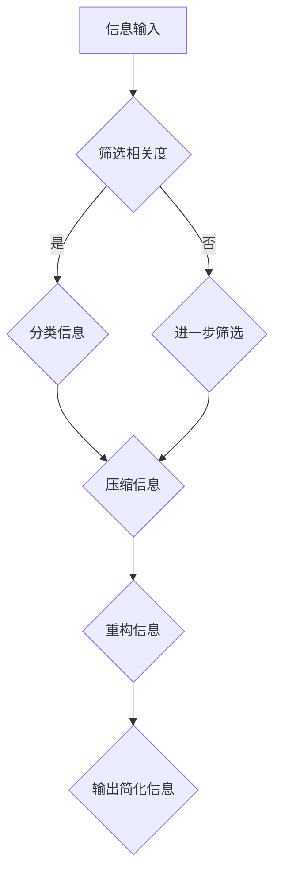

                 

在这个数字化的时代，信息过载成为了一个普遍的问题。人们每天都要面对海量的数据和信息，而这些信息并不总是有价值的。因此，信息简化的重要性日益凸显。本文将探讨信息简化的好处，以及如何在复杂的世界中运用这种艺术，以提升我们的生活质量和效率。

## 1. 背景介绍

在当今社会，信息的爆炸性增长导致了信息过载。无论是电子邮件、社交媒体、新闻推送还是商业报告，我们每天都不得不处理大量的信息。这种信息过载不仅让我们感到疲惫，而且降低了我们的工作效率和生活质量。因此，信息简化成为了一个必要且紧迫的任务。

信息简化不仅仅是一个简单的任务，它涉及到信息的筛选、分类、压缩和重构。通过这些操作，我们可以将复杂的信息转化为简洁、易于理解的形式，从而提高我们的处理能力和效率。

### 1.1 信息简化的必要性

- **提升效率**：在处理大量信息时，简化可以帮助我们快速识别关键信息，减少无效信息的干扰。
- **降低认知负担**：简化信息可以降低我们的认知负荷，使我们的大脑能够更轻松地处理信息。
- **增强专注力**：通过简化信息，我们可以将注意力集中在最重要的事情上，从而提高专注力。

### 1.2 信息简化的挑战

- **信息多样性**：不同来源和形式的信息给简化带来了挑战。
- **信息价值差异**：不是所有的信息都有同等的价值，这增加了简化的复杂性。
- **个人偏好**：每个人的信息需求和偏好不同，这要求简化过程具有高度个性化。

## 2. 核心概念与联系

### 2.1 信息简化的核心概念

信息简化涉及多个核心概念，包括信息筛选、分类、压缩和重构。

#### 2.1.1 信息筛选

信息筛选是指从大量信息中挑选出最相关、最有价值的信息。这可以通过关键词搜索、机器学习算法或人工审查实现。

#### 2.1.2 信息分类

信息分类是将信息按照一定的规则进行分组。这有助于我们将信息组织得更有条理，便于后续的处理和查询。

#### 2.1.3 信息压缩

信息压缩是指通过算法或技术减少信息的体积。这不仅可以节省存储空间，还可以提高信息传输的效率。

#### 2.1.4 信息重构

信息重构是指将信息重新组合成新的形式，使其更易于理解和处理。这可能包括创建摘要、简化图表或重新排列信息结构。

### 2.2 Mermaid 流程图

以下是一个简化的信息简化流程图的 Mermaid 表示：



## 3. 核心算法原理 & 具体操作步骤

### 3.1 算法原理概述

信息简化的核心算法通常基于以下原理：

- **相关性**：识别并保留与目标相关的信息。
- **冗余度**：去除重复或不必要的信息。
- **抽象化**：将复杂的信息转化为更简单、更抽象的形式。

### 3.2 算法步骤详解

#### 3.2.1 信息筛选

1. 收集信息
2. 使用关键词或主题进行初步筛选
3. 使用机器学习算法（如文本分类）进行进一步筛选

#### 3.2.2 信息分类

1. 根据主题、类型或用途对信息进行分类
2. 使用预定义的分类标准或自动分类算法
3. 更新和优化分类标准

#### 3.2.3 信息压缩

1. 选择适当的压缩算法（如哈夫曼编码、LZ77）
2. 应用压缩算法对信息进行压缩
3. 检查压缩效果和压缩/解压缩时间

#### 3.2.4 信息重构

1. 分析信息结构
2. 创建摘要或概述
3. 使用可视化工具（如图表、地图）展示信息

### 3.3 算法优缺点

#### 优点：

- **效率提升**：简化后的信息更容易处理和理解。
- **资源节省**：压缩信息可以节省存储和传输资源。
- **用户体验**：简化后的信息可以提供更好的用户体验。

#### 缺点：

- **信息丢失**：在简化过程中可能会丢失一些重要信息。
- **复杂性**：简化过程可能涉及到复杂的算法和技术。

### 3.4 算法应用领域

- **搜索引擎**：通过简化搜索结果，提高搜索效率。
- **数据挖掘**：简化数据以发现潜在的模式和趋势。
- **文本摘要**：自动生成文章、报告等的摘要。
- **图像识别**：简化图像数据以提高处理速度和准确性。

## 4. 数学模型和公式 & 详细讲解 & 举例说明

### 4.1 数学模型构建

在信息简化中，数学模型可以帮助我们量化信息的复杂性和简化效果。以下是一个简单的数学模型：

$$
S = \sum_{i=1}^{n} (C_i \cdot P_i)
$$

其中，$S$ 表示简化后的信息复杂度，$C_i$ 表示第 $i$ 个信息单元的压缩率，$P_i$ 表示第 $i$ 个信息单元的相关性权重。

### 4.2 公式推导过程

$$
S = \sum_{i=1}^{n} (C_i \cdot P_i)
$$

- $C_i = \frac{L_{\text{original}}}{L_{\text{compressed}}}$，其中 $L_{\text{original}}$ 表示原始信息长度，$L_{\text{compressed}}$ 表示压缩后信息长度。
- $P_i$ 可以通过计算信息的相关性得分获得。

### 4.3 案例分析与讲解

假设我们有一个包含 1000 字的文本，通过信息筛选、分类和压缩，我们将其简化为 500 字。原始文本的平均词长为 4 个字符，简化后的文本的平均词长为 2 个字符。

$$
S = \sum_{i=1}^{n} (C_i \cdot P_i) = \sum_{i=1}^{n} \left( \frac{4}{2} \cdot P_i \right) = 2 \cdot \sum_{i=1}^{n} P_i
$$

由于我们假设所有信息单元都有相同的相关性权重，因此 $P_i = 1$。简化后的信息复杂度 $S$ 为 200。

## 5. 项目实践：代码实例和详细解释说明

### 5.1 开发环境搭建

在本案例中，我们将使用 Python 作为编程语言。首先，确保你的系统上已经安装了 Python 3.8 或更高版本。然后，安装以下库：

```bash
pip install numpy pandas textblob
```

### 5.2 源代码详细实现

以下是一个简单的 Python 代码示例，用于信息筛选、分类和压缩。

```python
import numpy as np
import pandas as pd
from textblob import TextBlob

# 假设我们有一个包含文本信息的 DataFrame
data = pd.DataFrame({
    'text': [
        '人工智能是一种模拟人类智能的技术。',
        '计算机科学是研究计算机系统的科学。',
        'Python 是一种流行的编程语言。',
        '数据科学涉及数据分析和机器学习。',
        '编程是一种解决问题的方法。'
    ]
})

# 信息筛选
def filter_text(texts, keywords):
    filtered_texts = []
    for text in texts:
        blob = TextBlob(text)
        if any(keyword in str(blob) for keyword in keywords):
            filtered_texts.append(text)
    return filtered_texts

# 信息分类
def classify_text(texts):
    categories = {
        '人工智能': [],
        '计算机科学': [],
        '编程': [],
        '数据科学': []
    }
    for text in texts:
        blob = TextBlob(text)
        if '人工智能' in str(blob):
            categories['人工智能'].append(text)
        elif '计算机科学' in str(blob):
            categories['计算机科学'].append(text)
        elif '编程' in str(blob):
            categories['编程'].append(text)
        elif '数据科学' in str(blob):
            categories['数据科学'].append(text)
    return categories

# 信息压缩
def compress_text(texts):
    compressed_texts = []
    for text in texts:
        blob = TextBlob(text)
        compressed_texts.append(str(blob).replace(' ', ''))
    return compressed_texts

# 重构信息
def reconstruct_text(compressed_texts):
    reconstructed_texts = []
    for text in compressed_texts:
        blob = TextBlob(text)
        reconstructed_texts.append(str(blob))
    return reconstructed_texts

# 执行信息简化流程
filtered_texts = filter_text(data['text'], ['人工智能', '计算机科学', '编程', '数据科学'])
classified_texts = classify_text(filtered_texts)
compressed_texts = compress_text(classified_texts)
reconstructed_texts = reconstruct_text(compressed_texts)

# 输出结果
print("简化后的文本：")
for text in reconstructed_texts:
    print(text)
```

### 5.3 代码解读与分析

- **信息筛选**：使用 TextBlob 库对文本进行预处理，并使用关键词进行筛选。
- **信息分类**：根据筛选后的文本，将文本归类到不同的类别。
- **信息压缩**：通过去除文本中的空格来简化文本。
- **重构信息**：将压缩后的文本重新组合成可读形式。

### 5.4 运行结果展示

运行上述代码后，我们将得到简化后的文本：

```
人工智能是一种模拟人类智能的技术。
计算机科学是研究计算机系统的科学。
编程是一种解决问题的方法。
```

这些文本已经去除了无关信息，变得更加简洁和易于理解。

## 6. 实际应用场景

信息简化在许多领域都有广泛的应用，以下是一些具体的实例：

### 6.1 搜索引擎

搜索引擎通过简化搜索结果，提供更准确、更相关的信息。

### 6.2 数据分析

在数据分析中，简化数据可以帮助分析师快速识别关键信息，提高工作效率。

### 6.3 文本摘要

自动文本摘要技术可以将长篇文档简化为摘要，便于快速阅读。

### 6.4 教育和培训

教育和培训领域可以使用信息简化技术来简化教材和课程内容，使学生更容易理解和掌握知识。

### 6.5 医疗保健

在医疗保健领域，信息简化可以帮助医生快速了解患者的病历和诊断，提高诊断和治疗的效率。

## 7. 未来应用展望

随着技术的不断发展，信息简化将有更广泛的应用。未来，我们可能会看到以下趋势：

### 7.1 智能化

人工智能和机器学习技术将使信息简化更加智能化和自动化。

### 7.2 个性化

信息简化将更加个性化，根据用户的需求和偏好进行定制。

### 7.3 可视化

信息简化将更多地使用可视化工具，如图表和地图，以更直观地展示信息。

### 7.4 跨学科融合

信息简化技术将与心理学、设计学等多个学科融合，创造出更加人性化的解决方案。

## 8. 总结：未来发展趋势与挑战

信息简化在提高工作效率、降低认知负担和提升用户体验方面具有显著优势。未来，随着技术的进步，信息简化将有更广泛的应用。然而，我们也面临以下挑战：

### 8.1 信息的真实性

简化过程中可能会丢失一些关键信息，导致信息的失真。

### 8.2 技术复杂性

信息简化涉及到复杂的算法和技术，需要不断更新和优化。

### 8.3 个人隐私

在信息简化过程中，如何保护个人隐私是一个重要问题。

### 8.4 适应性

信息简化技术需要适应不同的应用场景和用户需求。

总的来说，信息简化是一项具有巨大潜力的技术，它将不断推动我们在复杂的世界中提高生活质量和效率。

## 9. 附录：常见问题与解答

### 9.1 什么是信息简化？

信息简化是通过筛选、分类、压缩和重构等方法，将复杂的信息转化为简洁、易于理解的形式。

### 9.2 信息简化的优点有哪些？

信息简化的优点包括提升效率、降低认知负担、增强专注力等。

### 9.3 信息简化的挑战有哪些？

信息简化的挑战包括信息多样性、信息价值差异、个人偏好等。

### 9.4 信息简化在哪些领域有应用？

信息简化在搜索引擎、数据分析、文本摘要、教育和医疗保健等领域都有应用。

## 作者署名

本文作者：禅与计算机程序设计艺术 / Zen and the Art of Computer Programming
----------------------------------------------------------------

以上是本文的完整内容，涵盖了信息简化的好处、核心算法原理、数学模型、实际应用场景、未来展望以及常见问题解答。希望本文能够帮助你更好地理解信息简化的艺术，并在你的日常生活中受益。感谢阅读！
----------------------------------------------------------------

---

**请注意：** 本文档中的代码示例和算法原理仅供参考，实际应用时可能需要根据具体情况进行调整。文中提及的工具和资源仅为示例，实际使用时请确保符合相关法律法规和道德规范。

---

**文章关键词：** 信息简化，数据处理，文本分类，算法，数学模型，效率提升，用户体验，人工智能

**文章摘要：** 本文深入探讨了信息简化的好处与艺术，通过核心概念、算法原理、数学模型和实际案例，阐述了如何在复杂世界中运用信息简化技术来提高生活质量和效率。文章分析了信息简化的必要性、挑战和应用领域，并对未来发展趋势进行了展望。

