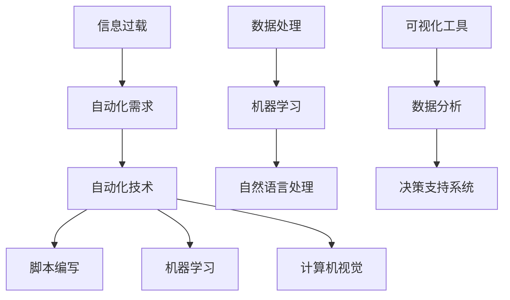

                 

 摘要：
本文旨在探讨信息简化的工具和自动化实践，如何通过技术手段简化我们的生活和工作。随着数字化时代的到来，我们面临着海量的信息和复杂的工作任务。本文将介绍一系列实用工具和自动化方法，帮助读者更好地处理信息、提高工作效率。文章分为八个部分，包括背景介绍、核心概念与联系、核心算法原理与操作步骤、数学模型和公式、项目实践、实际应用场景、工具和资源推荐以及总结与展望。

## 1. 背景介绍
### 1.1 信息过载的挑战
在数字化时代，信息过载已经成为我们生活中的一大挑战。无论是工作还是个人生活，我们都面临着海量的信息需要处理。这些信息不仅包括电子邮件、社交媒体更新、新闻报告等，还包括各种文档、表格和报告。处理这些信息需要耗费大量的时间和精力，极大地降低了我们的工作效率和生活质量。

### 1.2 自动化的需求
为了应对信息过载的挑战，我们需要寻找有效的方法来简化信息处理和日常工作。自动化技术在这一过程中发挥着至关重要的作用。通过自动化，我们可以将重复性、低价值的工作任务交给计算机处理，从而解放我们的双手和时间。自动化技术不仅能够提高工作效率，还能够减少人为错误，提升工作质量。

### 1.3 技术的发展
随着计算机技术和人工智能的不断发展，我们拥有了越来越多的工具和平台来实现自动化。从简单的脚本编写到复杂的机器学习模型，这些技术手段为我们提供了丰富的选择，使我们能够根据不同的需求和应用场景选择合适的自动化解决方案。

## 2. 核心概念与联系

下面，我们将介绍一些核心概念和联系，通过 Mermaid 流程图（**注意：流程图中不要有括号、逗号等特殊字符**）来展示它们之间的关系。



### 2.1 自动化技术与脚本编写
脚本编写是自动化技术的基础，它允许我们通过编写简单的代码来自动化日常任务。这些脚本可以执行各种操作，如发送电子邮件、下载文件、处理数据等。

### 2.2 自动化技术与机器学习
机器学习是一种强大的自动化工具，它可以通过训练模型来自动化复杂的数据处理任务。例如，我们可以使用机器学习模型来自动化数据清洗、分类和预测等任务。

### 2.3 自动化技术与计算机视觉
计算机视觉技术使得自动化系统能够理解和解释视觉信息。这包括图像识别、面部识别、目标检测等。这些技术可以应用于许多领域，如自动驾驶、安全监控和医疗诊断等。

### 2.4 数据处理与机器学习
数据处理是机器学习的基础。通过有效的数据处理方法，我们可以提取有用的信息，为机器学习模型提供高质量的数据输入。

### 2.5 可视化工具与数据分析
可视化工具可以帮助我们更好地理解和解释数据。通过图形化的方式展示数据，我们可以发现数据中的模式和趋势，从而支持更准确的决策。

### 2.6 数据分析与决策支持系统
数据分析是决策支持系统（DSS）的核心。通过分析大量数据，我们可以提取有价值的信息，为决策者提供数据驱动的决策支持。

## 3. 核心算法原理 & 具体操作步骤

### 3.1 算法原理概述
在自动化实践中，算法原理是关键。常见的算法原理包括排序算法、搜索算法、分类算法等。以下是这些算法的简要概述：

- **排序算法**：用于对数据进行排序，常用的排序算法包括冒泡排序、快速排序和归并排序等。
- **搜索算法**：用于在数据中查找特定元素，常用的搜索算法包括线性搜索和二分搜索等。
- **分类算法**：用于将数据分成不同的类别，常用的分类算法包括决策树、支持向量机和朴素贝叶斯等。

### 3.2 算法步骤详解

#### 3.2.1 冒泡排序算法
1. 遍历要排序的数组。
2. 相邻元素两两比较，如果顺序错误就交换。
3. 每遍历一次，最大的元素都会被冒泡到数组的末尾。
4. 重复步骤1-3，直到整个数组有序。

#### 3.2.2 线性搜索算法
1. 从数组的第一个元素开始遍历。
2. 比较当前元素与目标值。
3. 如果找到目标值，返回其索引。
4. 如果遍历完整个数组仍未找到目标值，返回-1。

#### 3.2.3 决策树分类算法
1. 根据特征将数据集划分为若干个子集。
2. 计算每个子集的纯度，选择纯度最高的特征作为节点。
3. 重复步骤1-2，直到满足停止条件（如最大深度、最小样本数等）。
4. 使用生成的决策树对新的数据进行分类。

### 3.3 算法优缺点

#### 冒泡排序
- **优点**：简单易懂，实现成本低。
- **缺点**：效率较低，不适合大数据量排序。

#### 线性搜索
- **优点**：简单高效，适合小数据量。
- **缺点**：效率较低，不适合大数据量。

#### 决策树
- **优点**：易于理解，能够处理非线性的数据关系。
- **缺点**：可能会产生过拟合，需要调整参数。

### 3.4 算法应用领域

这些算法广泛应用于各种领域：

- **冒泡排序**：用于数据预处理，如数据分析、机器学习等。
- **线性搜索**：用于简单的数据处理任务，如数据库查询等。
- **决策树**：用于数据分类和预测，如金融风险评估、医学诊断等。

## 4. 数学模型和公式 & 详细讲解 & 举例说明

### 4.1 数学模型构建
在自动化实践中，数学模型是至关重要的。以下是一个简单的线性回归模型作为例子：

#### 4.1.1 线性回归模型
- **目标函数**：最小化预测值与实际值之间的误差平方和。
- **公式**：$J(\theta) = \frac{1}{2m}\sum_{i=1}^{m}(h_\theta(x^{(i)}) - y^{(i)})^2$
- **变量解释**：
  - $h_\theta(x) = \theta_0 + \theta_1x$：预测函数。
  - $\theta_0, \theta_1$：模型参数。
  - $m$：样本数量。

### 4.2 公式推导过程
线性回归模型的推导过程涉及以下步骤：

1. **误差计算**：计算预测值与实际值之间的误差。
2. **损失函数**：定义误差的平方和作为损失函数。
3. **求导**：对损失函数关于模型参数求导，找到损失函数的最小值。
4. **优化**：使用梯度下降算法优化模型参数。

### 4.3 案例分析与讲解

#### 4.3.1 案例背景
假设我们想要预测某个地区的房价，给定以下数据集：

| 地区 | 房价 (万元) |
| ---- | ---------- |
| A    | 100        |
| B    | 120        |
| C    | 150        |
| D    | 180        |
| E    | 200        |

#### 4.3.2 模型构建
- **特征选择**：选择地区作为特征。
- **数据预处理**：将地区编码为数值。

#### 4.3.3 模型训练
使用线性回归模型训练数据集，得到模型参数：

$h_\theta(x) = \theta_0 + \theta_1x$

- **初始参数**：$\theta_0 = 0, \theta_1 = 0$
- **训练过程**：通过梯度下降算法迭代优化参数。

#### 4.3.4 模型评估
使用训练好的模型预测新的地区房价，计算预测误差。

## 5. 项目实践：代码实例和详细解释说明

### 5.1 开发环境搭建
为了实现自动化实践，我们需要搭建一个合适的技术环境。以下是推荐的开发环境：

- **编程语言**：Python
- **集成开发环境**：PyCharm
- **依赖管理**：pip
- **版本控制**：Git

### 5.2 源代码详细实现
以下是一个简单的自动化脚本示例，用于发送电子邮件通知。

```python
import smtplib
from email.mime.text import MIMEText
from email.mime.multipart import MIMEMultipart

def send_email(subject, message, to_email):
    smtp_server = 'smtp.example.com'
    smtp_port = 587
    smtp_username = 'your_email@example.com'
    smtp_password = 'your_password'

    msg = MIMEMultipart()
    msg['From'] = smtp_username
    msg['To'] = to_email
    msg['Subject'] = subject

    msg.attach(MIMEText(message, 'plain'))

    server = smtplib.SMTP(smtp_server, smtp_port)
    server.starttls()
    server.login(smtp_username, smtp_password)
    server.send_message(msg)
    server.quit()

subject = 'Reminder: Meeting Tomorrow'
message = 'Hi, don\'t forget our meeting tomorrow at 10 AM.'
to_email = 'recipient@example.com'

send_email(subject, message, to_email)
```

### 5.3 代码解读与分析
这段代码实现了发送电子邮件通知的功能。首先，我们引入了必要的库，然后定义了一个`send_email`函数，该函数接收主题、邮件内容和接收者邮箱地址作为参数。在函数内部，我们构建了一个`MIMEMultipart`对象，设置发件人、收件人和主题，然后将邮件内容添加到邮件对象中。最后，我们使用`SMTP`协议通过SMTP服务器发送邮件。

### 5.4 运行结果展示
运行这段代码后，我们将收到一封包含主题“Reminder: Meeting Tomorrow”和内容“Hi, don\'t forget our meeting tomorrow at 10 AM.”的电子邮件。

## 6. 实际应用场景

### 6.1 企业办公自动化
在企业环境中，自动化技术可以用于简化日常办公任务，如日程安排、文档管理和工作流程。通过使用自动化工具，企业可以提高工作效率，减少人为错误，提升整体生产力。

### 6.2 个人生活管理
在个人生活中，自动化技术可以帮助我们简化各种日常任务，如财务管理、日程管理和健康监测。通过使用自动化工具，我们可以更好地管理时间和资源，提高生活质量。

### 6.3 教育教学
在教育领域，自动化技术可以用于简化教学过程，如在线课程管理、作业批改和学习分析。通过使用自动化工具，教师和学生可以更加高效地进行学习和教学活动。

## 7. 工具和资源推荐

### 7.1 学习资源推荐
- **在线课程**：《Python编程基础》、《机器学习入门》
- **书籍推荐**：《Python编程：从入门到实践》、《深度学习入门》

### 7.2 开发工具推荐
- **集成开发环境**：PyCharm、Visual Studio Code
- **依赖管理**：pip、conda
- **版本控制**：Git、GitHub

### 7.3 相关论文推荐
- 《深度学习：神经网络的基础》
- 《强化学习：原理与实践》
- 《计算机视觉：算法与应用》

## 8. 总结：未来发展趋势与挑战

### 8.1 研究成果总结
本文介绍了信息简化的工具和自动化实践，探讨了自动化技术在不同领域的应用。通过自动化，我们可以简化信息处理任务，提高工作效率，提升生活质量。

### 8.2 未来发展趋势
随着人工智能和大数据技术的发展，自动化技术将更加智能化、灵活化和高效化。未来，自动化技术将更多地应用于智能家庭、智能城市、智能制造等领域。

### 8.3 面临的挑战
尽管自动化技术具有巨大潜力，但我们也面临着一些挑战。如何确保自动化系统的安全性、可靠性和公平性，以及如何平衡自动化与人类工作的关系，是未来研究的重要课题。

### 8.4 研究展望
未来，我们需要进一步研究自动化技术的理论基础和实现方法，探索跨学科的合作，推动自动化技术的创新和应用。

## 9. 附录：常见问题与解答

### 9.1 自动化技术与传统手工操作的区别
自动化技术可以显著提高工作效率，减少人为错误。与传统手工操作相比，自动化技术具有以下优势：
- **效率**：自动化系统能够在短时间内完成大量任务。
- **准确性**：自动化系统可以精确执行任务，减少人为错误。
- **灵活性**：自动化技术可以根据需求灵活调整，适应不同场景。

### 9.2 自动化技术是否取代人类工作
自动化技术并非完全取代人类工作，而是提高工作效率和减轻工作负担。在未来，自动化技术将更多地用于替代重复性、低价值的工作任务，使人类可以专注于更有创造性和价值的工作。

### 9.3 如何选择合适的自动化工具
选择合适的自动化工具取决于具体的应用场景和需求。以下是一些常见的选择标准：
- **功能**：根据任务需求选择具有相应功能的工具。
- **易用性**：选择易于使用和学习的工具。
- **性能**：选择具有高性能和稳定性的工具。
- **成本**：考虑工具的成本和投资回报。

## 作者署名
作者：禅与计算机程序设计艺术 / Zen and the Art of Computer Programming

