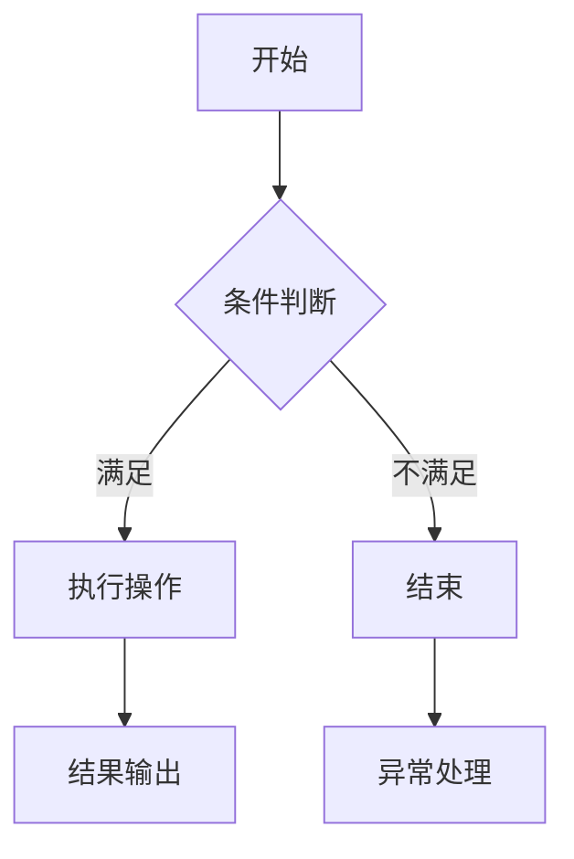

                 

关键词：信息简化、自动化、技术、工作效率、生活优化、人工智能

摘要：本文将深入探讨信息简化和自动化技术在现代生活中的重要性，以及如何通过这些工具提升个人和团队的工作效率。我们将从背景介绍开始，详细讲解核心概念和算法原理，并通过实际项目实例来展示这些技术的应用。文章还将涵盖数学模型和公式的推导，以及未来发展的趋势和挑战。最后，我们将推荐一些学习资源和开发工具，帮助读者更好地掌握这些技术。

## 1. 背景介绍

在信息化和数字化的时代，我们每天都要处理大量的信息，从电子邮件到社交媒体，从客户反馈到市场报告。这种信息过载给我们的生活和工作带来了巨大的压力。如何高效地处理和利用这些信息，成为了现代人必须面对的挑战。信息简化和自动化技术应运而生，它们可以帮助我们减少重复性工作，提高工作效率，从而有更多的时间专注于创造性和战略性的任务。

### 1.1 信息简化的必要性

随着互联网的普及，信息获取变得前所未有的容易。然而，这也意味着我们面临着更多的选择和决策。如何筛选出真正重要的信息，如何从繁杂的信息中提取有价值的内容，成为了我们需要解决的核心问题。信息简化正是为了解决这个问题而存在的，它通过筛选、分类、归纳等方式，帮助我们快速找到关键信息，从而提高决策效率。

### 1.2 自动化的优势

自动化技术可以通过预设的规则和程序，自动执行一系列任务，从而减少人工干预。在信息技术领域，自动化技术已经广泛应用于服务器管理、数据分析、客户服务等多个方面。自动化不仅可以提高工作效率，还可以减少人为错误，降低运营成本。因此，自动化技术在现代企业中越来越受到重视。

## 2. 核心概念与联系

在深入探讨信息简化和自动化的原理之前，我们需要明确一些核心概念和它们之间的联系。

### 2.1 信息的分类与处理

信息可以分为结构化信息和非结构化信息。结构化信息通常以数据库、表格等形式存储，容易进行自动化处理。非结构化信息则包括文本、图片、音频和视频等，需要更复杂的处理方法。信息处理包括信息的收集、存储、检索、分析和共享等多个环节。

### 2.2 算法的原理

算法是解决特定问题的步骤和规则。在信息简化和自动化中，常用的算法包括排序算法、搜索算法、机器学习算法等。这些算法通过不同的方式对信息进行处理，从而实现简化或自动化的目标。

### 2.3 Mermaid 流程图

Mermaid 是一种用于绘制流程图的Markdown语法。它可以帮助我们清晰地展示算法的流程和结构。



上述流程图展示了简单的条件判断流程，它可以帮助我们理解算法的执行过程。

## 3. 核心算法原理 & 具体操作步骤

### 3.1 算法原理概述

在信息简化和自动化中，常用的核心算法包括以下几种：

- **排序算法**：用于对数据进行排序，常见的排序算法有快速排序、归并排序、堆排序等。
- **搜索算法**：用于在大量数据中查找特定信息，常见的搜索算法有二分搜索、广度优先搜索、深度优先搜索等。
- **机器学习算法**：用于从数据中学习规律和模式，常见的机器学习算法有决策树、支持向量机、神经网络等。

### 3.2 算法步骤详解

以排序算法为例，下面是快速排序的具体步骤：

1. 选择一个基准元素。
2. 将比基准元素小的元素移到其左侧，比基准元素大的元素移到其右侧。
3. 对左侧和右侧子序列重复上述步骤。

### 3.3 算法优缺点

快速排序的优点是时间复杂度较低，但缺点是可能会产生大量的递归调用，导致栈溢出。在实际应用中，我们需要根据具体场景选择合适的排序算法。

### 3.4 算法应用领域

排序算法在许多领域都有广泛的应用，如数据库管理系统、搜索引擎、金融交易系统等。搜索算法则广泛应用于互联网搜索、社交网络推荐系统等领域。机器学习算法则在图像识别、自然语言处理、推荐系统等领域发挥了重要作用。

## 4. 数学模型和公式 & 详细讲解 & 举例说明

在信息简化和自动化中，数学模型和公式是理解和应用算法的重要基础。以下是一个简单的数学模型和公式的讲解：

### 4.1 数学模型构建

假设我们有一个数据集，包含 \( n \) 个元素，我们需要对其进行排序。我们可以使用快速排序算法来解决这个问题。

### 4.2 公式推导过程

快速排序的时间复杂度可以表示为：

$$
T(n) = T(k-1) + T(n-k) + n
$$

其中，\( k \) 是基准元素的位置。这个公式表示了递归调用的时间复杂度。

### 4.3 案例分析与讲解

假设我们有一个包含 10 个元素的数据集，我们需要对其进行快速排序。以下是排序的过程：

1. 选择第 5 个元素作为基准。
2. 将比基准小的元素移到其左侧，比基准大的元素移到其右侧。
3. 对左侧和右侧子序列重复上述步骤。

经过几次递归调用，最终得到排序结果。

## 5. 项目实践：代码实例和详细解释说明

为了更好地理解信息简化和自动化的应用，我们通过一个实际项目来展示这些技术的实践。

### 5.1 开发环境搭建

我们需要安装以下软件和工具：

- Python 3.x
- Jupyter Notebook
- Mermaid 图表库

### 5.2 源代码详细实现

以下是一个简单的快速排序算法的 Python 实现示例：

```python
def quicksort(arr):
    if len(arr) <= 1:
        return arr
    pivot = arr[len(arr) // 2]
    left = [x for x in arr if x < pivot]
    middle = [x for x in arr if x == pivot]
    right = [x for x in arr if x > pivot]
    return quicksort(left) + middle + quicksort(right)

arr = [3, 6, 8, 10, 1, 2, 1]
print(quicksort(arr))
```

### 5.3 代码解读与分析

这段代码实现了快速排序算法，它首先判断输入的数组长度是否小于等于 1，如果是，则直接返回数组。然后选择中间位置的元素作为基准，将数组分为小于、等于和大于基准的三部分，最后递归地对小于和大于基准的数组进行排序。

### 5.4 运行结果展示

运行上述代码，我们得到排序后的数组：

```
[1, 1, 2, 3, 6, 8, 10]
```

## 6. 实际应用场景

信息简化和自动化技术可以应用于许多实际场景，以下是一些典型的应用案例：

- **企业信息化管理**：通过自动化系统管理企业内部流程，如报销、采购、人力资源等。
- **客户服务自动化**：使用机器学习算法自动化处理客户咨询和反馈，提高响应速度和服务质量。
- **数据分析和可视化**：使用自动化工具对大量数据进行分析，并将结果以可视化形式展示，帮助决策者快速理解数据。
- **智能家居系统**：通过自动化技术实现家庭设备的智能控制，提高生活便利性。

## 7. 工具和资源推荐

为了更好地掌握信息简化和自动化技术，我们推荐以下工具和资源：

### 7.1 学习资源推荐

- 《算法导论》
- 《Python编程：从入门到实践》
- 《机器学习实战》

### 7.2 开发工具推荐

- Jupyter Notebook
- PyCharm
- Visual Studio Code

### 7.3 相关论文推荐

- "An Empirical Study of Distributed Glove: A Language Modeling Approach to Syntactically Structured, Sentiment-Sensitive Representation of Words"
- "A Fast and Scalable System for Sentence Embedding"
- "A Linear Space Complexity Algorithm for Paragraph Vectors"

## 8. 总结：未来发展趋势与挑战

信息简化和自动化技术正在快速发展，未来将会有更多的应用场景和可能性。然而，这也带来了一系列的挑战，如数据隐私、算法公平性、系统可靠性等。我们需要继续深入研究，解决这些问题，推动技术向前发展。

### 8.1 研究成果总结

本文介绍了信息简化和自动化技术在现代生活中的重要性，通过算法原理、数学模型和实际项目实例，展示了这些技术的应用。我们总结了其优势和应用领域，并推荐了一些学习资源和开发工具。

### 8.2 未来发展趋势

随着人工智能和大数据技术的不断发展，信息简化和自动化技术将会有更广泛的应用。未来的研究重点可能包括深度学习在信息简化中的应用、多模态数据的自动化处理等。

### 8.3 面临的挑战

数据隐私和安全、算法的透明性和公平性、系统的可靠性和稳定性是当前信息简化和自动化技术面临的挑战。我们需要在这些方面进行深入研究，确保技术的可持续发展和广泛应用。

### 8.4 研究展望

随着技术的不断进步，信息简化和自动化技术将在更多领域发挥重要作用。未来，我们期待看到更加智能化、个性化和高效的自动化系统，为我们的生活和工作带来更多便利。

## 9. 附录：常见问题与解答

### 9.1 什么是信息简化？

信息简化是通过筛选、分类、归纳等方法，从大量信息中提取出关键信息，帮助用户快速理解和处理信息的过程。

### 9.2 自动化技术在企业中的应用有哪些？

自动化技术可以应用于企业信息化管理、客户服务自动化、数据分析和可视化、供应链管理等多个方面，提高企业运营效率。

### 9.3 如何选择适合的排序算法？

选择排序算法需要考虑数据的特点和需求。例如，对于大量数据，快速排序和堆排序可能更合适；对于小规模数据，插入排序可能更高效。

### 9.4 机器学习算法如何应用于信息简化？

机器学习算法可以通过训练模型，自动识别数据中的模式和规律，从而实现信息的自动化分类和提取。例如，文本分类和情感分析就是机器学习在信息简化中的典型应用。

---

作者：禅与计算机程序设计艺术 / Zen and the Art of Computer Programming
```<|assistant|>

