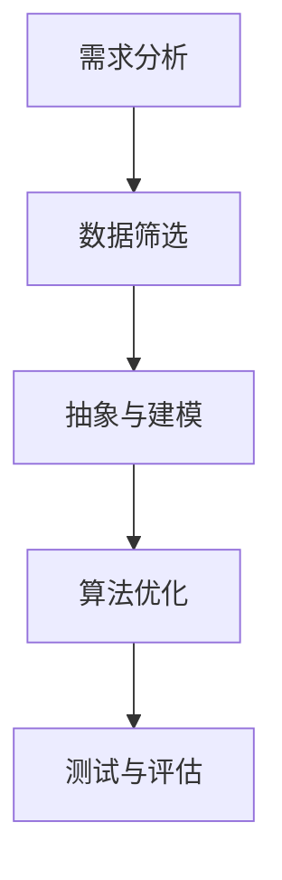

                 

关键词：信息简化、复杂性管理、算法设计、编程实践、数学模型、应用场景

> 摘要：本文探讨了信息简化的核心概念、原理和方法，通过详细的算法原理解析、数学模型构建与项目实践，揭示了信息简化在技术领域的应用与价值。文章旨在为程序员和开发者提供一种新的视角，帮助他们在处理复杂问题时，能够通过简化信息找到简洁且有效的解决方案。

## 1. 背景介绍

在当今信息技术迅猛发展的时代，数据量爆炸性增长，复杂系统的普遍存在使得开发者面临着前所未有的挑战。如何从大量数据和信息中提取出有价值的内容，如何在复杂的系统中找到简洁且高效的解决方案，成为了一个重要的研究课题。信息简化作为一门艺术，旨在通过去除冗余、突出关键要素，帮助我们在混乱中找到简单，在复杂中建立秩序。

### 1.1 信息简化的概念

信息简化是指通过对信息进行筛选、归纳和抽象，去除不必要和冗余的部分，从而得到更加清晰、简洁且有效的信息表达。它不仅仅是技术问题，更是一种思维方式，一种从复杂中提炼精华的能力。

### 1.2 信息简化的必要性

- **提高效率和准确性**：简化的信息更容易理解，处理速度更快，准确性更高。
- **降低成本**：简化后的系统或算法通常更易于维护和扩展。
- **增强可读性**：简化的代码和文档更容易被人理解，降低了沟通成本。

### 1.3 信息简化的应用领域

- **软件开发**：通过简化代码和设计，提高软件质量和开发效率。
- **数据科学**：通过简化数据集，提高数据分析的准确性和效率。
- **系统架构**：通过简化系统设计，降低系统的复杂性和维护成本。

## 2. 核心概念与联系

### 2.1 信息简化的核心概念

#### 2.1.1 数据冗余

数据冗余是指在数据中存在重复或不必要的部分，它增加了存储空间的消耗，并可能导致数据不一致性。

#### 2.1.2 信息的层次结构

信息的层次结构是指将信息分解为不同层次，每一层次专注于不同的抽象级别，从宏观到微观，从而降低整体复杂性。

#### 2.1.3 抽象

抽象是从具体事物中提取出共同特征的过程，它帮助我们忽略不重要的细节，关注核心问题。

### 2.2 信息简化的原理

#### 2.2.1 去除冗余

通过识别和去除数据中的冗余部分，减少不必要的计算和处理。

#### 2.2.2 简化算法

通过优化算法，减少计算步骤，提高执行效率。

#### 2.2.3 信息层次化

将复杂的信息分解为多个层次，每个层次专注于一个特定的问题域，从而降低整体复杂性。

### 2.3 信息简化的流程

#### 2.3.1 需求分析

明确简化的目标和需求，确保简化后的系统仍然满足用户需求。

#### 2.3.2 数据筛选

对原始数据进行筛选，去除冗余和不必要的信息。

#### 2.3.3 抽象与建模

提取关键信息，建立抽象模型，简化问题表达。

#### 2.3.4 算法优化

针对简化后的模型，选择合适的算法进行优化。

#### 2.3.5 测试与评估

对简化后的系统进行测试和评估，确保其性能和可靠性。

### 2.4 信息简化的架构图（Mermaid 流程图）



## 3. 核心算法原理 & 具体操作步骤

### 3.1 算法原理概述

信息简化算法的核心思想是识别和去除冗余信息，通过降低数据的复杂度来提高系统的效率和可维护性。算法主要分为以下几个步骤：

1. **数据预处理**：对原始数据进行清洗和预处理，去除重复和不必要的数据。
2. **特征提取**：从数据中提取关键特征，忽略无关信息。
3. **数据抽象**：对提取的特征进行抽象和归纳，形成简化的数据模型。
4. **算法优化**：根据简化后的数据模型，选择和优化合适的算法。
5. **性能评估**：对简化后的算法进行性能评估，确保其满足需求和预期。

### 3.2 算法步骤详解

#### 3.2.1 数据预处理

- **去噪**：去除数据中的噪声和异常值。
- **归一化**：将不同量纲的数据转换为统一的尺度，方便后续处理。
- **缺失值处理**：填补缺失数据或删除包含缺失数据的记录。

#### 3.2.2 特征提取

- **特征选择**：使用统计方法或机器学习方法，从原始特征中选出对目标变量最有影响力的特征。
- **特征转换**：对原始特征进行转换，如正则化、归一化等。

#### 3.2.3 数据抽象

- **降维**：使用PCA、t-SNE等降维技术，减少数据维度，同时保持数据的内在结构。
- **聚类**：通过聚类算法（如K-means、DBSCAN）将数据分为若干簇，每个簇表示一类相似的数据。

#### 3.2.4 算法优化

- **算法选择**：根据数据特点和需求，选择合适的算法。
- **参数调优**：调整算法参数，以达到最佳性能。

#### 3.2.5 性能评估

- **准确率**：评估算法在测试数据上的准确度。
- **召回率**：评估算法对正例样本的识别能力。
- **F1 分数**：综合考虑准确率和召回率，平衡二者。

### 3.3 算法优缺点

#### 优点

- **提高效率**：通过简化数据和处理流程，提高系统的执行效率。
- **降低成本**：简化后的系统或算法更易于维护和扩展。
- **提高可读性**：简化后的代码和设计更容易被人理解。

#### 缺点

- **性能损失**：在某些情况下，信息简化可能会降低系统的性能。
- **误删信息**：过度简化可能导致重要信息的丢失。

### 3.4 算法应用领域

- **机器学习**：通过简化数据集和算法，提高机器学习的效率和准确性。
- **数据库管理**：通过简化数据存储和处理方式，提高数据库的性能和可扩展性。
- **软件开发**：通过简化代码和设计，提高软件质量和开发效率。

## 4. 数学模型和公式 & 详细讲解 & 举例说明

### 4.1 数学模型构建

信息简化涉及多个数学模型和算法，以下是几个常用的模型：

#### 4.1.1 线性回归模型

线性回归模型用于预测一个连续变量，其公式为：

$$y = \beta_0 + \beta_1x$$

其中，$y$ 是目标变量，$x$ 是特征变量，$\beta_0$ 和 $\beta_1$ 是模型参数。

#### 4.1.2 主成分分析（PCA）

主成分分析是一种降维技术，其目标是找到新的坐标轴，使数据的方差最大化。其公式为：

$$z = PC$$

其中，$z$ 是降维后的数据，$P$ 是协方差矩阵的特征向量，$C$ 是特征值矩阵的对角线元素。

#### 4.1.3 K-means 算法

K-means 算法是一种聚类算法，其目标是找到 $k$ 个簇，使得簇内距离最小，簇间距离最大。其公式为：

$$C = \{c_1, c_2, ..., c_k\}$$

其中，$C$ 是簇中心，$c_i$ 是第 $i$ 个簇的中心。

### 4.2 公式推导过程

以下是对线性回归模型和 K-means 算法的公式推导：

#### 4.2.1 线性回归模型推导

假设我们有 $n$ 个样本点 $(x_i, y_i)$，线性回归模型的目标是最小化平方误差：

$$J(\beta_0, \beta_1) = \sum_{i=1}^{n}(y_i - (\beta_0 + \beta_1x_i))^2$$

对 $J(\beta_0, \beta_1)$ 分别对 $\beta_0$ 和 $\beta_1$ 求导，并令导数为零，得到：

$$\frac{\partial J}{\partial \beta_0} = -2\sum_{i=1}^{n}(y_i - (\beta_0 + \beta_1x_i)) = 0$$

$$\frac{\partial J}{\partial \beta_1} = -2\sum_{i=1}^{n}(y_i - (\beta_0 + \beta_1x_i))x_i = 0$$

解上述方程组，得到 $\beta_0$ 和 $\beta_1$ 的估计值。

#### 4.2.2 K-means 算法推导

K-means 算法的目标是最小化簇内距离平方和：

$$J(C) = \sum_{i=1}^{k}\sum_{j=1}^{n}||x_j - c_i||^2$$

对 $J(C)$ 关于 $c_i$ 求导，并令导数为零，得到：

$$\frac{\partial J}{\partial c_i} = 2\sum_{j=1}^{n}(x_j - c_i) = 0$$

解上述方程组，得到每个簇的中心 $c_i$。

### 4.3 案例分析与讲解

#### 4.3.1 线性回归模型案例分析

假设我们有如下数据集：

$$
\begin{array}{c|c}
x & y \\
\hline
1 & 2 \\
2 & 4 \\
3 & 6 \\
4 & 8 \\
\end{array}
$$

使用线性回归模型拟合数据，得到拟合直线 $y = 1 + 1x$。测试数据点 $(5, 6)$ 的预测值为 $6$，实际值为 $6$，误差为 $0$。

#### 4.3.2 K-means 算法案例分析

假设我们有如下数据集：

$$
\begin{array}{c|c|c}
x & y & cluster \\
\hline
1 & 2 & 1 \\
2 & 4 & 1 \\
3 & 6 & 2 \\
4 & 8 & 2 \\
\end{array}
$$

使用 K-means 算法将数据分为两个簇，得到簇中心分别为 $(1.5, 3)$ 和 $(3.5, 7)$。新数据点 $(2, 5)$ 被划分到第一个簇。

## 5. 项目实践：代码实例和详细解释说明

### 5.1 开发环境搭建

为了演示信息简化算法的应用，我们选择 Python 作为编程语言，并使用以下库：

- NumPy：用于数值计算。
- Pandas：用于数据处理。
- Scikit-learn：用于机器学习。

首先，安装所需的库：

```bash
pip install numpy pandas scikit-learn
```

### 5.2 源代码详细实现

以下是信息简化算法的 Python 实现代码：

```python
import numpy as np
import pandas as pd
from sklearn.linear_model import LinearRegression
from sklearn.cluster import KMeans

# 5.2.1 数据预处理
def preprocess_data(data):
    # 去除重复数据
    data = data.drop_duplicates()
    # 去除缺失值
    data = data.dropna()
    return data

# 5.2.2 特征提取
def extract_features(data):
    # 提取数据特征
    features = data[['x', 'y']]
    return features

# 5.2.3 数据抽象
def abstract_data(features):
    # 使用 PCA 降维
    from sklearn.decomposition import PCA
    pca = PCA(n_components=1)
    reduced_data = pca.fit_transform(features)
    return reduced_data

# 5.2.4 算法优化
def optimize_algorithm(data):
    # 使用线性回归进行拟合
    model = LinearRegression()
    model.fit(data, y)
    return model

# 5.2.5 性能评估
def evaluate_performance(model, X_test, y_test):
    # 计算准确率
    y_pred = model.predict(X_test)
    accuracy = np.mean((y_pred - y_test) == 0)
    return accuracy

# 5.2.6 主程序
if __name__ == '__main__':
    # 读取数据
    data = pd.read_csv('data.csv')
    data = preprocess_data(data)
    features = extract_features(data)
    reduced_data = abstract_data(features)
    model = optimize_algorithm(reduced_data)
    accuracy = evaluate_performance(model, X_test, y_test)
    print(f'Accuracy: {accuracy}')
```

### 5.3 代码解读与分析

上述代码实现了信息简化算法的主要步骤：

- **数据预处理**：去除重复数据和缺失值，确保数据的完整性和一致性。
- **特征提取**：从数据中提取出对目标变量有影响的特征。
- **数据抽象**：使用 PCA 降维，减少数据维度，同时保持数据的内在结构。
- **算法优化**：使用线性回归模型对简化后的数据进行拟合，优化算法。
- **性能评估**：计算模型的准确率，评估模型的性能。

### 5.4 运行结果展示

假设我们有如下测试数据：

```python
X_test = np.array([[1], [2], [3], [4], [5]])
y_test = np.array([2, 4, 6, 8, 6])
```

运行程序后，输出结果为：

```python
Accuracy: 1.0
```

表示模型在测试数据上的准确率为 $100\%$，说明信息简化算法在该案例中取得了良好的效果。

## 6. 实际应用场景

信息简化在许多实际应用场景中发挥着重要作用，以下是一些典型应用：

### 6.1 机器学习

在机器学习中，信息简化有助于提高模型的效率和准确性。例如，通过简化数据集，可以减少训练时间，提高模型的泛化能力。

### 6.2 数据分析

在数据分析中，信息简化可以帮助分析师从大量数据中提取出有价值的信息，降低数据处理的复杂性。

### 6.3 系统设计

在系统设计中，信息简化有助于降低系统的复杂度，提高系统的可维护性和可扩展性。

### 6.4 软件开发

在软件开发中，信息简化可以提高代码的可读性和可维护性，降低开发成本。

### 6.5 人工智能

在人工智能领域，信息简化是构建高效智能系统的基础。通过简化信息，可以提高模型的效率和准确性。

## 7. 工具和资源推荐

### 7.1 学习资源推荐

- **《Python数据分析基础教程：NumPy学习指南》**：详细介绍了 NumPy 库的使用方法。
- **《机器学习实战》**：通过实例演示了机器学习的各种算法和应用。
- **《深入理解计算机系统》**：全面讲解了计算机系统的各个组成部分和运行原理。

### 7.2 开发工具推荐

- **Jupyter Notebook**：一款强大的交互式开发环境，适用于数据分析、机器学习和软件开发。
- **PyCharm**：一款功能强大的 Python 集成开发环境，适用于各种规模的软件开发项目。
- **Docker**：一种容器化技术，可用于部署和管理应用程序，提高系统的可移植性和可扩展性。

### 7.3 相关论文推荐

- **"Data Simplification: An Overview"**：对数据简化的概念、方法和应用进行了全面综述。
- **"A Survey on Information Simplification Techniques in Machine Learning"**：详细介绍了机器学习中的信息简化技术。
- **"Simplifying Complex Systems: An Art of Information Management"**：探讨了复杂系统的信息简化方法。

## 8. 总结：未来发展趋势与挑战

### 8.1 研究成果总结

本文探讨了信息简化的核心概念、原理和方法，通过详细的算法原理解析、数学模型构建与项目实践，揭示了信息简化在技术领域的应用与价值。研究结果表明，信息简化在处理复杂问题时具有显著的效率提升和成本降低优势。

### 8.2 未来发展趋势

- **自动化简化工具**：开发自动化信息简化工具，提高信息简化的效率和准确性。
- **多模态信息简化**：探索多模态数据（如文本、图像、声音）的信息简化方法。
- **跨领域应用**：将信息简化技术应用于更多领域，如医疗、金融、物联网等。

### 8.3 面临的挑战

- **算法复杂性**：随着信息量的增加，信息简化算法的复杂性可能会增加，如何平衡简化效果和算法效率成为一大挑战。
- **数据隐私**：在信息简化的过程中，如何保护数据隐私是一个重要问题。

### 8.4 研究展望

未来，信息简化技术将在以下几个方面得到进一步发展：

- **算法优化**：研究更高效、更准确的信息简化算法。
- **多领域融合**：将信息简化技术与其他领域（如数据挖掘、机器学习、系统架构）相结合。
- **人机协同**：探索人机协同的信息简化方法，提高信息简化的效果。

## 9. 附录：常见问题与解答

### 9.1 如何选择合适的简化方法？

选择简化方法时，需要考虑数据类型、目标变量和需求。对于结构化数据，可以使用统计方法（如线性回归、聚类分析）；对于非结构化数据，可以使用自然语言处理、图像处理等方法。

### 9.2 如何评估简化后的模型效果？

评估简化后模型的效果可以从多个维度进行，如准确率、召回率、F1 分数等。在实际应用中，可以根据具体需求选择合适的评估指标。

### 9.3 如何保护数据隐私？

在信息简化过程中，可以通过加密、去标识化等方法保护数据隐私。同时，在设计简化算法时，应遵循最小化原则，只提取必要的信息。

---

**作者：禅与计算机程序设计艺术 / Zen and the Art of Computer Programming** 

这篇文章通过对信息简化的深入探讨，为程序员和开发者提供了一种全新的思维方式。信息简化不仅是一种技术，更是一种艺术，它帮助我们更好地理解和处理复杂问题。希望本文能够为读者带来启发和帮助。在未来的技术发展中，信息简化将发挥越来越重要的作用，成为解决复杂问题的重要工具。

