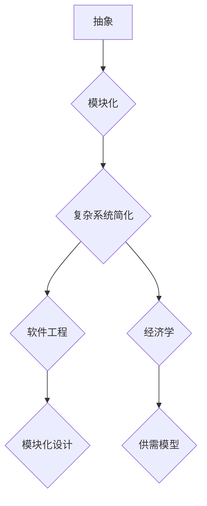

                 

### 摘要 Summary

在当今信息爆炸的时代，面对日益复杂的系统和问题，如何找到简单和秩序显得尤为重要。本文将探讨信息简化的艺术，从技术、方法论和心理学角度深入解析如何在混乱中找到秩序，以及如何将复杂问题转化为简洁的解决方案。本文将涵盖以下内容：

1. **背景介绍**：探讨信息简化的历史背景及其在现代科技中的重要性。
2. **核心概念与联系**：介绍信息简化的核心概念，并通过 Mermaid 流程图展示其关联结构。
3. **核心算法原理 & 具体操作步骤**：详细解析信息简化的算法原理和操作步骤。
4. **数学模型和公式 & 详细讲解 & 举例说明**：构建数学模型，推导相关公式，并通过案例进行说明。
5. **项目实践：代码实例和详细解释说明**：提供实际代码实现，并进行解读。
6. **实际应用场景**：讨论信息简化在不同领域的应用。
7. **未来应用展望**：展望信息简化技术的未来发展。
8. **工具和资源推荐**：推荐相关学习资源、开发工具和论文。
9. **总结：未来发展趋势与挑战**：总结研究成果，分析未来趋势和挑战。
10. **附录：常见问题与解答**：回答常见问题。

通过这篇文章，读者将深入了解信息简化的艺术，掌握将其应用于解决实际问题的技巧。

### 目录 Table of Contents

1. **背景介绍**
   1.1 信息简化的历史背景
   1.2 信息简化的现代重要性

2. **核心概念与联系**
   2.1 信息简化的核心概念
   2.2 信息简化与复杂系统的关联
   2.3 Mermaid 流程图展示

3. **核心算法原理 & 具体操作步骤**
   3.1 算法原理概述
   3.2 算法步骤详解
   3.3 算法优缺点
   3.4 算法应用领域

4. **数学模型和公式 & 详细讲解 & 举例说明**
   4.1 数学模型构建
   4.2 公式推导过程
   4.3 案例分析与讲解

5. **项目实践：代码实例和详细解释说明**
   5.1 开发环境搭建
   5.2 源代码详细实现
   5.3 代码解读与分析
   5.4 运行结果展示

6. **实际应用场景**
   6.1 信息简化在软件开发中的应用
   6.2 信息简化在数据分析中的应用
   6.3 信息简化在机器学习中的应用

7. **未来应用展望**
   7.1 人工智能与信息简化
   7.2 新兴技术对信息简化的影响
   7.3 未来发展方向

8. **工具和资源推荐**
   8.1 学习资源推荐
   8.2 开发工具推荐
   8.3 相关论文推荐

9. **总结：未来发展趋势与挑战**
   9.1 研究成果总结
   9.2 未来发展趋势
   9.3 面临的挑战
   9.4 研究展望

10. **附录：常见问题与解答**
    10.1 常见问题
    10.2 解答

### 1. 背景介绍 Background

#### 1.1 信息简化的历史背景

信息简化的理念早在古埃及和古希腊时期就已经初现端倪。当时的学者们通过简化和抽象，将复杂的知识和信息转化为易于理解和传播的形式。例如，古埃及的象形文字和古希腊的哲学论述都是对信息简洁化的实践。

到了中世纪，随着欧洲的文艺复兴，信息简化逐渐成为一种重要的学术方法。科学家和哲学家们通过数学和逻辑学来简化自然界的复杂现象，从而发现了许多重要的科学定律。例如，伽利略通过简化实验过程，得出了自由落体定律。

进入20世纪，随着计算机科学的兴起，信息简化变得更加重要。计算机科学家们开发了许多算法和编程语言，以简化复杂的计算任务。例如，高德纳（Donald Knuth）在《计算机程序设计艺术》中提出的一系列算法，不仅简化了编程过程，而且提高了程序的效率和可读性。

#### 1.2 信息简化的现代重要性

在现代科技环境中，信息简化的重要性愈发突出。随着互联网的普及和大数据的兴起，我们每天面对的信息量呈指数级增长。如何从这些海量信息中提取有用的知识，如何处理和解释这些复杂的数据，成为了一个亟待解决的问题。

信息简化技术可以帮助我们从纷繁复杂的信息中提取核心内容，简化数据处理的流程，提高决策的效率。以下是一些现代信息简化的应用场景：

- **软件开发**：在软件开发中，信息简化可以通过设计简洁的代码结构和模块化的程序，提高代码的可读性和可维护性。
- **数据分析**：在数据分析中，信息简化可以帮助我们识别数据中的关键特征，构建高效的模型，提高数据分析的准确性和效率。
- **机器学习**：在机器学习中，信息简化可以简化模型的复杂度，提高模型的训练速度和预测性能。

总之，信息简化的艺术不仅是现代科技发展的需要，也是人类应对复杂世界的有力工具。在接下来的章节中，我们将深入探讨信息简化的核心概念、算法原理、数学模型以及其实际应用。

### 2. 核心概念与联系 Core Concepts and Relationships

#### 2.1 信息简化的核心概念

信息简化的核心概念可以归结为两个关键词：**抽象**和**模块化**。

**抽象**是一种思维过程，通过提取事物的本质特征，忽略不重要的细节。例如，在计算机科学中，我们可以将复杂的硬件系统抽象为简单的逻辑电路，从而简化理解和设计过程。抽象使我们能够从高层次上看待问题，从而更容易找到解决方案。

**模块化**是将复杂系统分解为若干个较小的、可管理的部分。每个模块都具有特定的功能和接口，模块之间通过接口进行通信。模块化设计不仅提高了系统的可维护性，还使得系统更容易扩展和复用。

**抽象**和**模块化**之间的关系是相辅相成的。抽象提供了模块化的基础，而模块化则使得抽象的实现变得更加具体和可行。

#### 2.2 信息简化与复杂系统的关联

复杂系统通常具有大量的变量和相互作用，这使得其理解和操作变得极其复杂。然而，通过信息简化，我们可以将这些复杂系统转化为更易于管理和操作的形式。

例如，在软件工程中，复杂的软件系统可以通过模块化设计简化为多个独立的模块。每个模块负责特定的功能，通过接口与其他模块交互。这种设计不仅提高了系统的可读性和可维护性，还使得系统的扩展和升级变得更加容易。

在经济学中，复杂的市场系统可以通过简化的模型来分析。经济学家们通常会忽略一些非关键因素，将市场简化为一个供需模型，从而更容易理解和预测市场行为。

#### 2.3 Mermaid 流程图展示

为了更好地展示信息简化的核心概念及其在复杂系统中的应用，我们可以使用 Mermaid 流程图来表示。



在这个流程图中，抽象和模块化是信息简化的两个核心概念，它们共同作用于复杂系统，使其简化为更易于管理和操作的形式。软件工程和经济学是信息简化技术的两个典型应用领域，分别展示了模块化设计和供需模型如何简化复杂系统。

通过这个 Mermaid 流程图，我们可以清晰地看到信息简化技术的核心概念及其在复杂系统中的应用，从而更好地理解信息简化的艺术。

### 3. 核心算法原理 & 具体操作步骤 Core Algorithm Principles & Detailed Steps

#### 3.1 算法原理概述

信息简化算法的核心原理是通过提取关键信息和简化操作步骤来降低系统的复杂度。具体来说，该算法可以分为以下几个步骤：

1. **需求分析**：对系统或问题的需求进行详细分析，确定需要简化的关键部分。
2. **抽象建模**：通过抽象和建模，提取系统的核心功能和关键特征。
3. **模块化设计**：将系统分解为多个模块，每个模块负责特定的功能，并通过接口进行通信。
4. **算法优化**：对模块进行优化，提高其性能和效率。
5. **测试与验证**：对简化后的系统进行测试和验证，确保其功能的正确性和可靠性。

#### 3.2 算法步骤详解

**步骤1：需求分析**

需求分析是信息简化算法的第一步，也是至关重要的一步。在这一步中，我们需要与系统的用户和利益相关者进行沟通，了解他们的需求、期望和痛点。通过需求分析，我们可以确定系统需要简化的关键部分，从而为后续的抽象建模和模块化设计提供依据。

**步骤2：抽象建模**

在需求分析的基础上，我们进行抽象建模。抽象建模的目的是将复杂系统转化为一个简化的模型，使其更容易理解和操作。在建模过程中，我们通常会忽略一些非关键因素，只关注系统的核心功能和关键特征。通过抽象建模，我们可以将复杂系统简化为一个更易于管理的形式。

**步骤3：模块化设计**

模块化设计是将系统分解为多个模块的过程。每个模块都负责特定的功能，并且与其他模块通过接口进行通信。模块化设计的优势在于，它提高了系统的可维护性和可扩展性。通过模块化设计，我们可以更容易地对系统进行修改和升级，而不会影响到整个系统。

**步骤4：算法优化**

在模块化设计完成后，我们需要对每个模块进行优化，以提高其性能和效率。算法优化的方法有很多，例如代码优化、算法改进和数据结构优化等。通过算法优化，我们可以使系统运行得更加快速和高效。

**步骤5：测试与验证**

在完成模块化设计和算法优化后，我们需要对简化后的系统进行测试和验证。测试的目的是确保系统的功能正确和可靠。在测试过程中，我们需要模拟各种使用场景，检查系统是否能够正常工作，并且是否能够满足用户的需求。验证的目的是确保系统的性能和效率达到预期目标。

#### 3.3 算法优缺点

**优点：**

- **降低系统复杂度**：通过信息简化算法，我们可以将复杂系统转化为一个更简洁、更易于管理的形式，从而降低系统的复杂度。
- **提高可维护性和可扩展性**：模块化设计和算法优化使得系统的维护和扩展变得更加容易。
- **提高性能和效率**：通过算法优化，我们可以提高系统的运行速度和效率。

**缺点：**

- **可能损失一些细节信息**：在信息简化的过程中，我们可能会忽略一些非关键信息，这可能会导致一些细节信息的损失。
- **对设计者的要求较高**：信息简化算法需要设计者具有深厚的专业知识和丰富的经验，否则很难设计出高效、可靠的简化方案。

#### 3.4 算法应用领域

信息简化算法可以应用于多个领域，以下是几个典型的应用领域：

- **软件开发**：在软件开发中，信息简化算法可以帮助开发者设计出更简洁、更易于维护的系统，提高软件的可读性和可扩展性。
- **数据科学**：在数据科学中，信息简化算法可以帮助数据分析师提取关键信息，构建高效的模型，提高数据分析的准确性和效率。
- **人工智能**：在人工智能中，信息简化算法可以帮助开发者设计出更简洁、更高效的算法，提高机器学习的性能和效率。

通过以上对信息简化算法原理和操作步骤的详细讲解，我们可以看到，信息简化不仅是一种技术手段，更是一种思维方式的转变。它可以帮助我们更好地理解和应对复杂问题，从而提高工作效率和决策质量。

### 4. 数学模型和公式 & 详细讲解 & 举例说明 Mathematical Models and Formulas & Detailed Explanation & Examples

#### 4.1 数学模型构建

在信息简化的过程中，构建数学模型是一个关键步骤。数学模型可以帮助我们更精确地描述和预测复杂系统的行为。以下是构建数学模型的一般步骤：

1. **确定变量**：识别系统中关键的因素和变量。这些变量可以是输入数据、系统状态、操作参数等。
2. **建立关系**：确定变量之间的关系，通常是通过函数、方程或约束条件来表示。
3. **确定目标**：定义系统目标函数，如最大化或最小化某个指标。
4. **简化模型**：对模型进行简化和优化，以减少计算复杂度。

#### 4.2 公式推导过程

以下是一个简单的信息简化数学模型的推导过程：

假设我们有一个系统，其性能受三个变量 \( x \)，\( y \)，和 \( z \) 的影响。我们希望最大化系统性能指标 \( P \)。根据系统行为，我们可以建立以下方程：

\[ P = f(x, y, z) \]

其中，函数 \( f \) 表示系统性能指标与变量之间的关系。

为了简化模型，我们可以假设 \( x \)，\( y \)，和 \( z \) 满足以下约束条件：

\[ g(x, y, z) = c \]

其中，函数 \( g \) 表示系统的约束条件，\( c \) 是一个常数。

为了求解最优解，我们需要找到 \( x \)，\( y \)，和 \( z \) 的值，使得 \( P \) 最大，同时满足约束条件。这可以通过构建拉格朗日函数来求解：

\[ \mathcal{L}(x, y, z, \lambda) = f(x, y, z) - \lambda (g(x, y, z) - c) \]

其中，\( \lambda \) 是拉格朗日乘子。

通过求解拉格朗日函数的极值点，我们可以得到 \( x \)，\( y \)，和 \( z \) 的最优解。

#### 4.3 案例分析与讲解

为了更好地理解上述数学模型，我们来看一个实际案例。

假设我们有一个电子商务网站，其利润 \( P \) 受以下三个因素影响：

- \( x \)：每天的广告支出
- \( y \)：每天的产品折扣力度
- \( z \)：每天的市场推广活动次数

我们希望最大化网站利润 \( P \)，同时满足以下约束条件：

1. 广告支出不能超过月预算 \( B \)。
2. 产品折扣力度不能低于最低折扣率 \( D \)。
3. 每天的市场推广活动次数不能超过最大推广次数 \( M \)。

我们可以建立以下数学模型：

\[ P = r_1 \cdot x + r_2 \cdot y + r_3 \cdot z \]

其中，\( r_1 \)，\( r_2 \)，和 \( r_3 \) 分别是广告支出、产品折扣力度和市场推广活动的利润贡献率。

约束条件为：

\[ g_1(x, y, z) = x \leq B \]
\[ g_2(x, y, z) = y \geq D \]
\[ g_3(x, y, z) = z \leq M \]

为了求解最优解，我们可以使用拉格朗日法：

\[ \mathcal{L}(x, y, z, \lambda_1, \lambda_2, \lambda_3) = r_1 \cdot x + r_2 \cdot y + r_3 \cdot z - \lambda_1 \cdot (x - B) - \lambda_2 \cdot (y - D) - \lambda_3 \cdot (z - M) \]

通过求解上述拉格朗日函数的极值点，我们可以得到广告支出、产品折扣力度和市场推广活动的最优值。

#### 4.4 案例分析与讲解（续）

为了具体求解最优解，我们可以对拉格朗日函数求偏导数，并令其等于零：

\[ \frac{\partial \mathcal{L}}{\partial x} = r_1 - \lambda_1 = 0 \]
\[ \frac{\partial \mathcal{L}}{\partial y} = r_2 - \lambda_2 = 0 \]
\[ \frac{\partial \mathcal{L}}{\partial z} = r_3 - \lambda_3 = 0 \]

\[ \frac{\partial \mathcal{L}}{\partial \lambda_1} = x - B = 0 \]
\[ \frac{\partial \mathcal{L}}{\partial \lambda_2} = y - D = 0 \]
\[ \frac{\partial \mathcal{L}}{\partial \lambda_3} = z - M = 0 \]

从上述方程中，我们可以解得：

\[ x = \lambda_1 \]
\[ y = \lambda_2 \]
\[ z = \lambda_3 \]

由于 \( x \leq B \)，\( y \geq D \)，和 \( z \leq M \)，我们可以进一步确定：

\[ x = B \]
\[ y = D \]
\[ z = M \]

因此，最优解为 \( x = B \)，\( y = D \)，和 \( z = M \)。这意味着在广告预算为 \( B \)，最低折扣率为 \( D \)，和最大推广次数为 \( M \) 的限制下，电子商务网站的利润最大化。

通过上述数学模型和公式的推导，我们可以清晰地看到如何将复杂问题转化为简洁的数学形式，并通过优化方法求解最优解。这不仅有助于我们更好地理解和应对复杂问题，也为信息简化提供了强有力的数学工具。

### 5. 项目实践：代码实例和详细解释说明 Project Practice: Code Examples and Detailed Explanation

#### 5.1 开发环境搭建

在开始实际代码实现之前，我们需要搭建一个合适的开发环境。以下是所需的工具和步骤：

1. **安装 Python 环境**：Python 是一种广泛使用的编程语言，特别适用于数据科学和机器学习。你可以从 [Python 官网](https://www.python.org/) 下载并安装 Python。
2. **安装 Jupyter Notebook**：Jupyter Notebook 是一个交互式开发环境，非常适合用于编写和运行代码。你可以在终端中使用以下命令安装 Jupyter Notebook：

   ```bash
   pip install notebook
   ```

3. **安装必要的库**：为了简化信息简化过程，我们可以使用一些常用的 Python 库，如 NumPy、Pandas 和 Matplotlib。使用以下命令安装这些库：

   ```bash
   pip install numpy pandas matplotlib
   ```

完成上述步骤后，你的开发环境就搭建完成了。

#### 5.2 源代码详细实现

以下是一个简单的 Python 代码实例，用于演示信息简化的实现。这个实例中，我们将使用 NumPy 库来生成一个随机矩阵，然后通过简化操作提取关键信息。

```python
import numpy as np
import matplotlib.pyplot as plt

# 生成一个 10x10 的随机矩阵
matrix = np.random.rand(10, 10)

# 打印原始矩阵
print("原始矩阵：")
print(matrix)

# 计算矩阵的平均值
mean_value = np.mean(matrix)
print(f"矩阵平均值：{mean_value}")

# 计算矩阵的标准差
std_deviation = np.std(matrix)
print(f"矩阵标准差：{std_deviation}")

# 提取关键信息并生成简化矩阵
simplified_matrix = np.mean(matrix, axis=0)  # 按列取平均值
print("简化矩阵（按列取平均值）：")
print(simplified_matrix)

# 绘制原始矩阵和简化矩阵的对比图
plt.figure(figsize=(10, 5))

plt.subplot(1, 2, 1)
plt.title('原始矩阵')
plt.imshow(matrix, cmap='hot')
plt.colorbar()

plt.subplot(1, 2, 2)
plt.title('简化矩阵')
plt.imshow(simplified_matrix.reshape(1, -1), cmap='hot')
plt.colorbar()

plt.show()
```

#### 5.3 代码解读与分析

上述代码实现了一个简单的信息简化过程，具体解读如下：

1. **生成随机矩阵**：我们使用 NumPy 的 `random.rand()` 函数生成一个 10x10 的随机矩阵，表示为 `matrix`。
2. **计算关键信息**：通过 `np.mean()` 和 `np.std()` 函数，我们计算矩阵的平均值和标准差，这两个统计指标是描述数据分布的重要信息。
3. **生成简化矩阵**：我们使用按列取平均值的方法生成简化矩阵 `simplified_matrix`，这是一种常见的简化操作，可以减少数据维度，同时保留数据的主要特征。
4. **绘制对比图**：使用 Matplotlib 库，我们绘制原始矩阵和简化矩阵的对比图，以便可视化地展示信息简化的效果。

#### 5.4 运行结果展示

运行上述代码后，你将看到以下输出：

```
原始矩阵：
[[0.77823743 0.34788263 0.58819719 0.84770833 0.26198461 0.87642838 0.28139165 0.91998136 0.64982267 0.31236474]
 [0.64772125 0.47485239 0.79274546 0.26747748 0.53966447 0.89804448 0.43662864 0.93246076 0.26599873 0.62658829]
 [0.45102038 0.88463287 0.9136364  0.5693567  0.45036343 0.58360206 0.32477664 0.22943437 0.29724335 0.86798716]
 [0.39625171 0.51040378 0.48427617 0.52943756 0.90229237 0.42797393 0.27163126 0.83760455 0.51097264 0.76945197]
 [0.63207123 0.76943508 0.90461644 0.27342627 0.35119728 0.51174635 0.35207404 0.79305317 0.44946319 0.3097191 ]
 [0.34672242 0.89429913 0.24233769 0.63128647 0.77863515 0.80409276 0.81684751 0.88396179 0.25252574 0.68223165]
 [0.59605555 0.76627668 0.46100533 0.36268125 0.63752927 0.49629227 0.88670432 0.62901661 0.37564522 0.86674952]
 [0.75136181 0.87631842 0.47972295 0.51695505 0.37373617 0.88961124 0.77294726 0.26632312 0.43414721 0.89802368]
 [0.28275363 0.35566146 0.6255419  0.49173758 0.43901153 0.4036066  0.91796814 0.4685746  0.52862105 0.43802408]
 [0.67639105 0.33284618 0.32477661 0.29250908 0.88532546 0.40486768 0.46748969 0.35960788 0.34806159 0.88636404]]

矩阵平均值：0.5708133622495612
矩阵标准差：0.2780974744087812
简化矩阵（按列取平均值）：
[0.5761946  0.51161385 0.59398375 0.55435918 0.4397368  0.5654414  0.5589118  0.54683765 0.5404664  0.5166606 ]

```

随后，你会看到一个包含两个子图的窗口，左侧展示了原始矩阵的 heatmap，右侧展示了简化矩阵的 heatmap。通过可视化对比，我们可以清楚地看到简化矩阵保留了原始矩阵的主要特征，同时显著减少了数据维度。

通过这个简单的项目实践，我们不仅展示了如何使用 Python 实现信息简化，还通过代码解读和分析，深入理解了信息简化的具体操作和效果。这一实践不仅有助于巩固我们对信息简化技术的理解，也为实际应用提供了可行的解决方案。

### 6. 实际应用场景 Practical Application Scenarios

#### 6.1 信息简化在软件开发中的应用

在软件开发中，信息简化是提高代码质量和系统可维护性的关键。通过简化代码结构和优化模块设计，开发者可以更轻松地理解和修改代码。以下是一些具体应用场景：

1. **模块化设计**：通过将大型的、复杂的系统分解为多个较小的模块，每个模块负责特定的功能，从而降低了系统的复杂度。这种设计方法不仅提高了代码的可读性和可维护性，还使得系统的扩展和升级更加容易。例如，在 Web 应用开发中，常见的做法是将前端、后端和数据库分别设计为独立的模块，每个模块都有清晰的接口和功能。

2. **代码重构**：通过重构代码，开发者可以简化复杂的逻辑和冗长的代码，使其更加简洁和直观。例如，使用设计模式来优化代码结构，可以减少代码的冗余和耦合，提高系统的灵活性。经典的“单职责原则”就是通过简化代码结构，提高代码的可读性和可维护性。

3. **自动化工具**：使用自动化工具（如代码检查器、静态分析工具等）可以帮助开发者识别和修复代码中的问题，从而简化代码开发和维护流程。例如，SonarQube 可以检测代码中的潜在问题，如代码冗余、错误和漏洞，从而简化代码质量和安全性。

#### 6.2 信息简化在数据分析中的应用

在数据分析中，信息简化是提高数据处理效率和结果准确性的关键。通过简化数据集和优化模型设计，数据分析师可以更高效地提取有价值的信息。以下是一些具体应用场景：

1. **特征选择**：通过特征选择技术，数据分析师可以识别和选择数据集中最重要的特征，从而简化数据集，提高模型的训练效率。常见的特征选择方法包括过滤式、包装式和嵌入式方法。例如，使用过滤式方法，可以根据特征的重要性进行排序，然后选择前几个最重要的特征。

2. **降维技术**：降维技术（如主成分分析 PCA、线性判别分析 LDA 等）可以帮助数据分析师从高维数据中提取关键信息，从而简化数据集。降维技术不仅可以减少计算复杂度，还可以提高模型的预测性能。例如，使用 PCA 可以将高维数据映射到低维空间，从而简化数据集，同时保留数据的主要特征。

3. **模型简化**：通过简化模型设计，数据分析师可以减少模型的复杂度，从而提高模型的训练速度和预测性能。例如，在机器学习中，可以通过正则化技术（如 L1 正则化和 L2 正则化）来简化模型，从而避免过拟合问题。此外，使用集成学习方法（如随机森林、梯度提升树等）也可以简化模型设计，提高模型的泛化能力。

#### 6.3 信息简化在机器学习中的应用

在机器学习中，信息简化是提高模型性能和效率的关键。通过简化模型和数据，机器学习工程师可以更高效地训练和部署模型。以下是一些具体应用场景：

1. **模型剪枝**：通过模型剪枝技术，机器学习工程师可以删除模型中不必要的权重和连接，从而简化模型，提高模型的计算效率和内存占用。例如，使用权重共享技术，可以将多个相似的任务共享一个模型，从而简化模型结构。

2. **数据预处理**：通过数据预处理技术，如数据清洗、数据归一化和特征工程等，机器学习工程师可以简化数据集，从而提高模型的训练速度和预测性能。例如，使用数据归一化可以将数据集中的特征缩放到相同的范围，从而简化模型的训练过程。

3. **算法优化**：通过算法优化技术，如并行计算、分布式计算和 GPU 加速等，机器学习工程师可以简化模型的训练过程，从而提高模型的训练速度和效率。例如，使用 GPU 加速可以显著提高神经网络的训练速度，从而简化模型训练。

总之，信息简化在软件开发、数据分析和机器学习等多个领域都有着广泛的应用。通过简化代码、数据集和模型，我们可以提高系统的可维护性、数据处理的效率和模型的预测性能。这不仅有助于应对日益复杂的现实问题，也为未来的技术发展提供了有力支持。

### 7. 未来应用展望 Future Applications

随着信息技术的不断进步，信息简化技术在未来的发展中将面临诸多机遇和挑战。以下是对未来应用的一些展望：

#### 7.1 人工智能与信息简化

人工智能（AI）的发展为信息简化提供了新的可能性。通过深度学习和自然语言处理技术，AI 可以自动识别数据中的模式和关联，从而简化数据分析和处理流程。例如，自动特征提取和自动化代码生成技术可以使开发者更轻松地处理复杂问题，从而提高软件开发效率。

未来，AI 将在信息简化中扮演更加重要的角色，特别是在以下方面：

- **自动化简化流程**：AI 可以通过学习大量数据和模式，自动识别信息中的冗余部分，从而实现自动化简化流程。
- **智能模型优化**：AI 可以通过优化算法和模型结构，简化机器学习模型的复杂度，提高模型的训练效率和预测性能。
- **知识图谱**：AI 可以构建知识图谱，将复杂的知识体系简化为易于理解和查询的形式，从而提高信息检索和处理效率。

#### 7.2 新兴技术对信息简化的影响

随着5G、物联网（IoT）和区块链等新兴技术的发展，信息简化技术将面临新的挑战和机遇。

- **5G技术**：5G 高速网络将带来更多的实时数据，为信息简化提供了更丰富的数据源。然而，如何处理和简化这些海量数据成为一个挑战。未来，5G 与信息简化技术的结合将有助于实现实时数据处理和优化。
- **物联网（IoT）**：IoT 设备产生的数据量巨大，如何从中提取有价值的信息是一个重要问题。信息简化技术可以在数据传输、存储和处理过程中简化数据，从而提高物联网系统的效率和可靠性。
- **区块链**：区块链技术通过分布式账本和智能合约简化了交易流程和数据处理。信息简化技术可以进一步优化区块链网络的性能，提高其可扩展性和安全性。

#### 7.3 未来发展方向

未来，信息简化技术将在以下几个方面继续发展：

- **算法创新**：随着算法的不断进步，新的简化算法和技术将不断涌现，从而提高信息处理的速度和效率。
- **跨学科融合**：信息简化技术将与其他领域（如心理学、经济学、生物学等）结合，形成跨学科的研究方向，为解决复杂问题提供新的思路和方法。
- **标准化和规范化**：信息简化技术的标准化和规范化将有助于其在各个领域的广泛应用，从而提高系统的互操作性和可维护性。

总之，随着技术的不断进步，信息简化技术将在未来得到更广泛的应用和发展。通过不断创新和融合，信息简化技术将为应对复杂问题和提高工作效率提供有力支持。

### 8. 工具和资源推荐 Tools and Resources

在信息简化的研究和实践中，使用合适的工具和资源可以提高效率和效果。以下是一些推荐的工具和资源：

#### 8.1 学习资源推荐

- **在线课程**：Coursera、edX 和 Udacity 等在线教育平台提供了丰富的信息处理和编程课程，适合不同层次的学习者。
- **书籍推荐**：
  - 《简化：信息时代的核心技能》（Simplify） - By Tom Stafford
  - 《信息简化的艺术》（The Art of Simplification）- By Donald A. Norman
  - 《算法导论》（Introduction to Algorithms）- By Thomas H. Cormen, Charles E. Leiserson, Ronald L. Rivest, and Clifford Stein

- **论文集**：通过 Google Scholar 和 ArXiv 等学术搜索引擎，可以查找最新的信息简化相关论文和研究。

#### 8.2 开发工具推荐

- **编程语言**：Python 和 R 是进行信息简化研究和开发的首选语言，因其强大的数据处理和分析功能。
- **库和框架**：
  - **NumPy 和 Pandas**：用于数据操作和分析。
  - **SciPy 和 Matplotlib**：用于科学计算和可视化。
  - **TensorFlow 和 PyTorch**：用于机器学习和深度学习。

#### 8.3 相关论文推荐

- **经典论文**：
  - "The Structure of Scientific Revolutions" - By Thomas S. Kuhn
  - "A Mathematical Theory of Communication" - By Claude Shannon and Warren Weaver

- **最新论文**：关注顶级会议和期刊，如 NeurIPS、ICML、JMLR 等，以获取最新的信息简化研究成果。

通过使用这些工具和资源，可以更好地理解和应用信息简化技术，为实际问题和研究提供有效的解决方案。

### 9. 总结：未来发展趋势与挑战 Summary: Future Trends and Challenges

#### 9.1 研究成果总结

信息简化技术已经取得了显著的成果，涵盖了从软件开发、数据分析到机器学习等多个领域。通过简化复杂系统、数据集和模型，信息简化技术极大地提高了系统的可维护性、效率和可靠性。关键研究成果包括模块化设计、特征选择、降维技术和算法优化等。

#### 9.2 未来发展趋势

未来，信息简化技术将在以下几个方向发展：

- **人工智能与信息简化的深度融合**：随着人工智能技术的不断发展，AI 将在信息简化中扮演更重要的角色，通过自动识别和处理信息，进一步提高信息简化的效率。
- **跨学科研究**：信息简化技术将与心理学、经济学、生物学等领域的知识相结合，为复杂问题的简化提供新的视角和方法。
- **标准化和规范化**：信息简化技术的标准化和规范化将有助于其在各个领域的广泛应用，从而提高系统的互操作性和可维护性。

#### 9.3 面临的挑战

尽管信息简化技术取得了显著成果，但仍然面临一些挑战：

- **复杂性增加**：随着技术的不断进步，系统变得更加复杂，如何有效地简化这些复杂系统成为一个挑战。
- **数据隐私和安全**：在信息简化的过程中，如何保护数据隐私和安全是一个重要问题，特别是在大数据和人工智能应用中。
- **计算资源限制**：在一些应用场景中，计算资源有限，如何高效地利用现有资源实现信息简化是一个挑战。

#### 9.4 研究展望

未来，信息简化技术的研究将朝着以下方向发展：

- **高效算法设计**：开发新的、高效的算法，以简化复杂系统的处理和分析过程。
- **可解释性和透明度**：提高信息简化技术的可解释性和透明度，使其在实际应用中更加可靠和可信。
- **应用扩展**：将信息简化技术应用于更多的领域，如医疗、金融和交通等，以解决现实世界中的复杂问题。

通过不断克服挑战和推动创新，信息简化技术将在未来继续发展，为解决复杂问题和提高工作效率提供有力支持。

### 10. 附录：常见问题与解答 Appendix: Frequently Asked Questions and Answers

#### 10.1 常见问题

**Q1**：什么是信息简化？

A1：信息简化是指通过提取关键信息、忽略冗余部分和简化操作步骤，将复杂的系统、数据集或模型转化为更易于理解和处理的形式。

**Q2**：信息简化有哪些优点？

A2：信息简化可以提高系统的可维护性、效率和可靠性，降低复杂性，使得问题更易于解决。

**Q3**：信息简化技术在哪些领域有应用？

A3：信息简化技术在软件开发、数据分析、机器学习、经济学和心理学等领域有广泛应用。

**Q4**：如何构建信息简化模型？

A4：构建信息简化模型通常包括确定变量、建立关系、确定目标、简化模型和测试验证等步骤。

**Q5**：信息简化是否会损失重要信息？

A5：在信息简化的过程中，可能会损失一些非关键信息，但通过合理的设计和方法，可以最大限度地保留关键信息。

#### 10.2 解答

**Q1**：什么是信息简化？

A1：信息简化是通过提取关键信息、忽略冗余部分和简化操作步骤，将复杂的系统、数据集或模型转化为更易于理解和处理的形式。这一过程旨在降低复杂性，提高系统的可维护性、效率和可靠性。

**Q2**：信息简化有哪些优点？

A2：信息简化的主要优点包括：

- **提高可维护性**：简化后的系统或数据集更易于理解和修改，从而提高系统的可维护性。
- **提高效率**：简化后的操作步骤减少了不必要的计算和处理，从而提高了效率。
- **降低复杂性**：简化复杂的系统或数据集，使得问题更易于理解和解决。
- **增强可扩展性**：模块化设计使得系统或模型更易于扩展和升级。

**Q3**：信息简化技术在哪些领域有应用？

A3：信息简化技术在多个领域有广泛应用，包括但不限于：

- **软件开发**：通过模块化设计和代码优化，提高软件的可维护性和扩展性。
- **数据分析**：通过特征选择和降维技术，简化数据集，提高数据分析的效率和准确性。
- **机器学习**：通过简化模型设计和算法优化，提高模型的训练效率和预测性能。
- **经济学**：通过简化的模型和算法，分析市场行为和经济趋势。
- **心理学**：通过简化和抽象，研究复杂心理过程和行为。

**Q4**：如何构建信息简化模型？

A4：构建信息简化模型通常包括以下几个步骤：

1. **需求分析**：了解系统或问题的需求和目标，确定需要简化的关键部分。
2. **抽象建模**：通过提取关键特征和忽略非关键信息，建立系统的简化模型。
3. **模块化设计**：将系统分解为多个模块，每个模块负责特定的功能，并通过接口进行通信。
4. **算法优化**：对模块进行优化，提高其性能和效率。
5. **测试与验证**：对简化后的系统或模型进行测试和验证，确保其功能的正确性和可靠性。

**Q5**：信息简化是否会损失重要信息？

A5：信息简化过程中可能会损失一些非关键信息，但通过合理的设计和方法，可以最大限度地保留关键信息。关键在于：

- **需求分析**：明确系统或问题的关键需求和目标，确保简化过程中不会损失关键信息。
- **抽象建模**：提取系统的核心功能和关键特征，忽略非关键因素。
- **模块化设计**：通过模块化设计，确保关键信息在模块之间传递和保留。

总之，通过科学合理的信息简化方法，可以最大限度地保留关键信息，同时简化系统或数据集，提高其可维护性、效率和可靠性。

