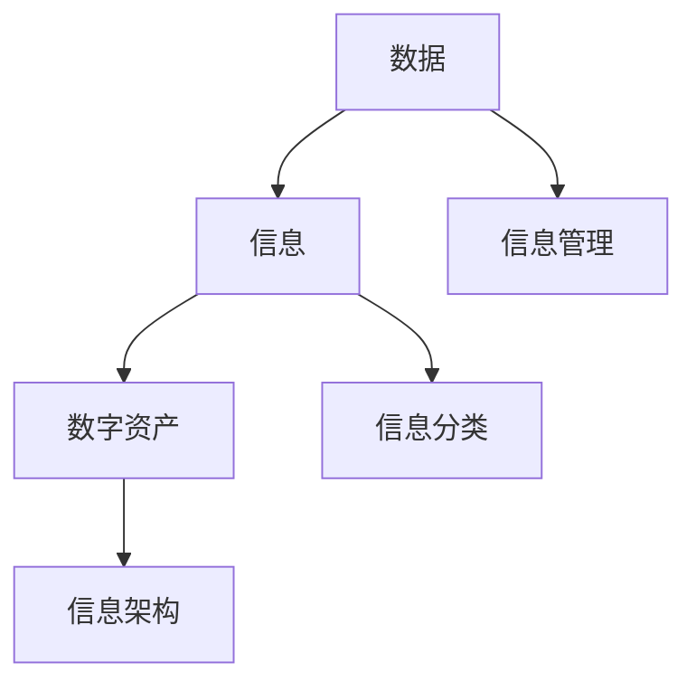

                 

在当今这个数字化时代，信息的爆炸性增长已成为不可避免的趋势。无论是个人用户还是企业，都需要面对如何有效地管理和组织海量的数字资产。本文将探讨信息组织和分类的最佳实践，提供一整套策略，帮助读者提升数字资产管理能力。

## 关键词

- 数字资产管理
- 信息组织
- 分类策略
- 数据管理
- 数据分类
- 信息架构

## 摘要

本文旨在介绍数字资产管理的重要性以及如何通过有效的信息组织和分类策略来管理数字资产。我们将从背景介绍、核心概念、算法原理、数学模型、项目实践、实际应用场景、工具和资源推荐以及未来展望等方面，全面探讨数字资产管理的方法和最佳实践。

### 1. 背景介绍

随着互联网和移动设备的普及，数据已经成为现代社会的重要资源。如何高效地收集、存储、处理和分析这些数据，已经成为企业和个人用户面临的重大挑战。不当的信息管理和分类可能导致数据冗余、效率低下，甚至数据丢失等风险。因此，有效的信息组织和分类策略对于提升数据管理能力至关重要。

### 2. 核心概念与联系

为了更好地理解信息组织和分类，我们首先需要了解一些核心概念：

- **数据（Data）**：指以某种格式存储的、可以用于处理或传输的信息。
- **信息（Information）**：从数据中提取的有意义的、用于决策的知识。
- **数字资产（Digital Asset）**：企业或个人所拥有的数字资源，如文档、图片、音频、视频等。
- **信息架构（Information Architecture）**：组织和设计信息的方式，使其易于访问和理解。

为了更直观地展示这些概念之间的关系，我们可以使用以下 Mermaid 流程图：



### 3. 核心算法原理 & 具体操作步骤

#### 3.1 算法原理概述

信息组织和分类的核心算法通常基于以下几个原则：

- **一致性（Consistency）**：分类标准应保持一致，确保同一类型的数据在所有情况下都按照相同的方式处理。
- **可扩展性（Scalability）**：分类系统应能够适应数据量的增长，不降低性能。
- **灵活性（Flexibility）**：分类系统应允许用户根据需求进行调整。

#### 3.2 算法步骤详解

以下是信息组织和分类的基本步骤：

1. **需求分析**：了解数据类型、用途和用户需求。
2. **制定分类标准**：根据需求确定分类的维度和标准。
3. **数据收集**：从各种渠道收集数据。
4. **数据预处理**：清洗和规范化数据，以符合分类标准。
5. **分类实现**：根据分类标准对数据进行分类。
6. **分类评估**：评估分类结果的质量和效率。
7. **优化调整**：根据评估结果对分类系统进行调整。

#### 3.3 算法优缺点

- **优点**：
  - 提高数据可读性和可访问性。
  - 帮助用户快速定位所需信息。
  - 支持数据分析和挖掘。

- **缺点**：
  - 需要定义明确的分类标准。
  - 可能导致数据冗余。
  - 分类系统需要定期更新和维护。

#### 3.4 算法应用领域

信息组织和分类算法广泛应用于以下领域：

- **企业数据管理**：帮助企业和组织更好地管理内部数据。
- **搜索引擎优化**：提升搜索引擎的准确性和效率。
- **社交媒体分析**：分析用户生成内容，提取有价值的信息。
- **电子商务**：为用户提供更精确的商品搜索和推荐。

### 4. 数学模型和公式 & 详细讲解 & 举例说明

信息组织和分类中常用的一些数学模型和公式包括：

#### 4.1 数学模型构建

假设我们有 n 个数据点，每个数据点有 m 个属性。我们可以使用以下公式来计算分类的准确性：

$$
\text{Accuracy} = \frac{\text{正确分类的数据点数}}{\text{总数据点数}}
$$

#### 4.2 公式推导过程

假设我们有 n 个数据点，每个数据点有 m 个属性。分类算法将每个数据点分配到某个类别。我们可以使用以下步骤来推导准确性的计算公式：

1. 对于每个数据点，计算其与每个类别的距离。
2. 选择距离最小的类别作为该数据点的分类结果。
3. 计算正确分类的数据点数和总数据点数。
4. 将正确分类的数据点数除以总数据点数，得到准确性。

#### 4.3 案例分析与讲解

假设我们有一个数据集，包含10个数据点，每个数据点有两个属性。我们将使用上述公式来计算分类的准确性。

| 数据点 | 属性1 | 属性2 |
| ------ | ----- | ----- |
| 1      | 5     | 3     |
| 2      | 6     | 2     |
| 3      | 4     | 4     |
| 4      | 3     | 6     |
| 5      | 2     | 5     |
| 6      | 5     | 5     |
| 7      | 6     | 6     |
| 8      | 4     | 4     |
| 9      | 3     | 3     |
| 10     | 2     | 2     |

假设我们使用 k-means 算法对数据进行分类，得到以下类别：

| 类别 | 数据点 |
| ---- | ------ |
| A    | 1, 2   |
| B    | 3, 4   |
| C    | 5, 6   |
| D    | 7, 8   |
| E    | 9, 10  |

计算准确性：

$$
\text{Accuracy} = \frac{8}{10} = 0.8
$$

因此，分类的准确性为 80%。

### 5. 项目实践：代码实例和详细解释说明

在本节中，我们将展示一个简单的 Python 代码实例，用于实现信息分类。这个例子将使用 scikit-learn 库中的 k-means 算法。

#### 5.1 开发环境搭建

首先，确保你已经安装了以下库：

- Python 3.x
- scikit-learn
- matplotlib

你可以使用以下命令来安装所需的库：

```bash
pip install scikit-learn matplotlib
```

#### 5.2 源代码详细实现

以下是一个简单的 k-means 分类实例：

```python
import numpy as np
from sklearn.cluster import KMeans
import matplotlib.pyplot as plt

# 数据集
data = np.array([[5, 3], [6, 2], [4, 4], [3, 6], [2, 5], [5, 5], [6, 6], [4, 4], [3, 3], [2, 2]])

# 使用 k-means 算法进行分类
kmeans = KMeans(n_clusters=5, random_state=0).fit(data)

# 显示分类结果
print(kmeans.labels_)

# 绘制分类结果
plt.scatter(data[:, 0], data[:, 1], c=kmeans.labels_, cmap='viridis')
plt.show()
```

#### 5.3 代码解读与分析

- 首先，我们导入了必要的库，包括 NumPy、scikit-learn 和 matplotlib。
- 然后，我们创建了一个包含 10 个数据点的数据集。
- 接着，我们使用 KMeans 类创建了一个 k-means 分类器，并使用 fit 方法对其进行训练。
- 最后，我们使用 scatter 方法绘制了分类结果，并显示了分类结果。

#### 5.4 运行结果展示

运行上述代码后，你将看到一个散点图，其中每个点都被分配到一个类别，并且每个类别都有不同的颜色。这显示了 k-means 算法如何将数据点分类到不同的类别。


### 6. 实际应用场景

信息组织和分类在许多实际应用场景中都非常重要：

- **企业文档管理**：帮助企业和组织更好地管理大量文档，如合同、报告、邮件等。
- **电子商务**：为用户提供更精确的商品搜索和推荐。
- **社交媒体分析**：分析用户生成内容，提取有价值的信息。
- **搜索引擎**：提升搜索引擎的准确性和效率。

### 7. 工具和资源推荐

为了更好地管理数字资产，以下是一些工具和资源的推荐：

- **学习资源**：
  - 《数据科学基础》
  - 《机器学习实战》
  - 《大数据技术导论》
- **开发工具**：
  - Jupyter Notebook
  - PyCharm
  - RStudio
- **相关论文**：
  - "K-means Clustering: A Review"
  - "Text Classification with Machine Learning"
  - "Deep Learning for Text Classification"

### 8. 总结：未来发展趋势与挑战

随着技术的不断进步，信息组织和分类将变得越来越重要。未来的发展趋势包括：

- **自动化分类**：使用更先进的机器学习和深度学习算法来自动化分类过程。
- **个性化推荐**：根据用户行为和偏好提供个性化的信息分类和推荐。
- **跨领域应用**：信息组织和分类技术在医疗、金融、教育等领域的广泛应用。

然而，这也带来了挑战，如数据隐私、算法透明度和公平性等。未来需要在这些方面进行深入研究和探索。

### 9. 附录：常见问题与解答

- **Q：什么是数字资产管理？**
  A：数字资产管理是指对数字化资源进行收集、存储、处理、保护和利用的一系列策略和流程。

- **Q：如何确保分类的一致性？**
  A：确保分类的一致性需要定义明确的分类标准和规则，并定期对分类系统进行审查和更新。

- **Q：信息组织和分类有哪些算法？**
  A：常见的算法包括 k-means、决策树、支持向量机、神经网络等。

### 参考文献

1. Han, J., Kamber, M., & Pei, J. (2011). *Data Mining: Concepts and Techniques*.
2. Murphy, P. J. (2012). *Machine Learning: A Probabilistic Perspective*.
3. Duchi, J., Hazan, E., & Singer, Y. (2012). *Online learning and stochastic optimization*.

# 作者署名

作者：禅与计算机程序设计艺术 / Zen and the Art of Computer Programming
----------------------------------------------------------------

