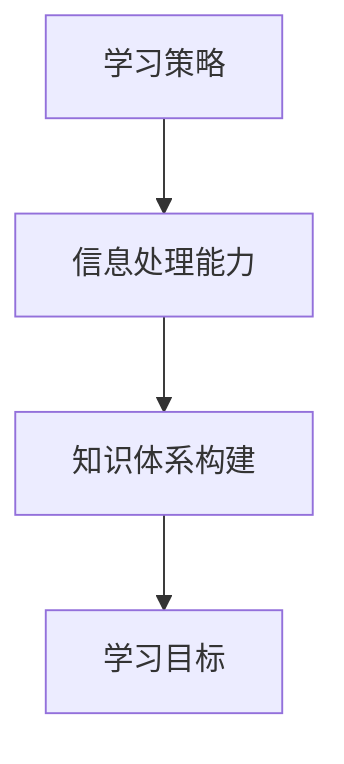

                 

关键词：信息过载、高效学习、学习策略、数据处理、认知负荷、知识体系构建、专注力管理、时间管理

> 摘要：随着信息时代的到来，信息过载成为现代人面临的重要挑战。如何在信息爆炸的海洋中保持高效学习，构建个人知识体系，成为当下一个亟待解决的问题。本文将探讨信息过载下的学习策略，结合IT领域的实际案例，提出一系列高效学习的技巧和方法，帮助读者在混乱中找到学习的路径。

## 1. 背景介绍

### 1.1 信息过载的来源

信息过载主要来源于以下几个方面：

1. **互联网爆炸式增长**：互联网的快速发展使得信息传播速度大大加快，每天都会产生海量的数据。
2. **多渠道的信息输入**：社交媒体、新闻客户端、电子邮件等，使得人们时刻处于信息接收的状态。
3. **信息更新速度快**：许多行业的技术更新换代速度非常快，需要不断学习新的知识和技能。

### 1.2 信息过载的影响

1. **注意力分散**：过多的信息输入会导致人们的注意力分散，难以集中精力完成一项任务。
2. **学习效率降低**：信息过载使得人们难以有效筛选和学习重要的信息，导致学习效率降低。
3. **心理压力增加**：面对海量的信息，人们会产生焦虑和不安，增加心理压力。

## 2. 核心概念与联系

### 2.1 核心概念

**学习策略**：为了达到学习目标，采取的一系列方法和措施。

**信息处理能力**：处理和理解信息的能力。

**知识体系构建**：将零散的知识点整合成一个系统的知识体系。

### 2.2 架构图



## 3. 核心算法原理 & 具体操作步骤

### 3.1 算法原理概述

本文提出的信息处理与学习策略是一种层次化的方法，主要包括以下几个步骤：

1. **信息筛选**：通过过滤和筛选，获取最有价值的信息。
2. **信息处理**：对筛选后的信息进行深度加工，提高理解和记忆。
3. **知识整合**：将处理后的信息整合进个人的知识体系。
4. **学习反馈**：通过反馈和评估，不断调整学习策略。

### 3.2 算法步骤详解

#### 3.2.1 信息筛选

1. **目标明确**：明确自己的学习目标和需求。
2. **信息过滤**：利用搜索引擎和数据库等工具，过滤掉不相关的信息。
3. **来源验证**：验证信息来源的可靠性和权威性。

#### 3.2.2 信息处理

1. **深度阅读**：对重要信息进行深度阅读和理解。
2. **笔记整理**：将关键信息记录下来，进行笔记整理。
3. **思维导图**：利用思维导图工具，将信息结构化。

#### 3.2.3 知识整合

1. **知识关联**：将新知识和已有知识进行关联和整合。
2. **案例分析**：通过案例分析和实践，加深对知识的理解。
3. **经验总结**：总结学习过程中的经验教训，不断优化学习策略。

#### 3.2.4 学习反馈

1. **自我评估**：定期进行自我评估，了解自己的学习进度。
2. **反馈调整**：根据评估结果，调整学习策略。
3. **持续学习**：保持持续学习的动力和习惯。

### 3.3 算法优缺点

#### 优点

1. **高效筛选信息**：能够快速定位到最有价值的信息。
2. **系统整合知识**：能够将零散的知识点整合成一个系统的知识体系。
3. **灵活调整策略**：可以根据实际情况不断调整学习策略。

#### 缺点

1. **时间成本**：需要花费较多的时间和精力进行信息筛选和处理。
2. **心理压力**：面对大量的信息，可能会产生一定的心理压力。

### 3.4 算法应用领域

该算法在多个领域都有广泛的应用，如：

1. **学术研究**：帮助学者快速筛选和整合相关的研究成果。
2. **职业发展**：帮助职场人士快速掌握新知识和技能。
3. **个人成长**：帮助个人构建系统的知识体系，实现自我提升。

## 4. 数学模型和公式 & 详细讲解 & 举例说明

### 4.1 数学模型构建

为了更好地描述信息处理和学习策略的过程，我们可以构建一个简单的数学模型。

#### 模型假设

- 每个个体都有一定的注意力资源。
- 信息有价值的程度不同。
- 学习策略可以根据信息的重要性和价值进行调整。

#### 模型构建

假设一个个体有 \( A \) 单位的注意力资源，信息有 \( v_i \) 的价值，学习策略的调整系数为 \( k \)。

则信息处理和学习策略的数学模型可以表示为：

\[ T = \sum_{i=1}^{n} k \cdot v_i \cdot \frac{A}{n} \]

其中：

- \( T \) 表示总的学习时间。
- \( n \) 表示信息的总数。
- \( v_i \) 表示第 \( i \) 条信息的价值。
- \( k \) 表示学习策略的调整系数，\( k \in [0, 1] \)，值越大表示学习策略越倾向于处理高价值信息。

### 4.2 公式推导过程

#### 4.2.1 基本假设

- 每个个体在单位时间内可以处理的注意力资源是固定的。
- 每条信息的价值是已知的。

#### 4.2.2 公式推导

根据基本假设，我们可以得到以下推导过程：

\[ T = \sum_{i=1}^{n} t_i \]

其中，\( t_i \) 表示处理第 \( i \) 条信息所需的时间。

由于每个个体在单位时间内可以处理的注意力资源是固定的，我们可以将 \( t_i \) 表示为：

\[ t_i = \frac{A}{n} \cdot v_i \]

将 \( t_i \) 代入总时间的公式，得到：

\[ T = \sum_{i=1}^{n} \frac{A}{n} \cdot v_i \]

为了突出学习策略对时间分配的影响，我们引入调整系数 \( k \)：

\[ T = k \cdot \sum_{i=1}^{n} \frac{A}{n} \cdot v_i \]

简化后得到：

\[ T = k \cdot \frac{A}{n} \cdot \sum_{i=1}^{n} v_i \]

由于 \( \sum_{i=1}^{n} v_i \) 是所有信息的总价值，我们可以将其表示为 \( V \)：

\[ T = k \cdot \frac{A}{n} \cdot V \]

### 4.3 案例分析与讲解

假设一个学习者有 10 个小时的注意力资源，需要处理 100 条信息，其中每条信息的价值如下表所示：

| 信息编号 | 价值 \( v_i \) |
| -------- | ------------ |
| 1        | 2            |
| 2        | 3            |
| 3        | 5            |
| ...      | ...          |
| 100      | 1            |

如果学习者采取的是平均分配注意力的策略，即 \( k = 0.5 \)，那么他处理所有信息所需的时间为：

\[ T = 0.5 \cdot \frac{10}{100} \cdot 100 = 5 \text{ 小时} \]

如果学习者采取的是优先处理高价值信息的策略，即 \( k = 0.9 \)，那么他处理所有信息所需的时间为：

\[ T = 0.9 \cdot \frac{10}{100} \cdot 100 = 9 \text{ 小时} \]

显然，采取优先处理高价值信息的策略所需的时间更长，但能够获取更高的信息价值。

## 5. 项目实践：代码实例和详细解释说明

### 5.1 开发环境搭建

在本项目中，我们将使用 Python 语言进行开发，需要安装以下库：

- `requests`：用于发送 HTTP 请求。
- `beautifulsoup4`：用于解析 HTML 页面。
- `pandas`：用于数据分析和处理。

安装命令如下：

```bash
pip install requests beautifulsoup4 pandas
```

### 5.2 源代码详细实现

下面是一个简单的 Python 脚本，用于从指定网站抓取文章，并保存到本地。

```python
import requests
from bs4 import BeautifulSoup
import pandas as pd

def fetch_articles(url, num_articles):
    articles = []
    for i in range(num_articles):
        response = requests.get(url)
        soup = BeautifulSoup(response.text, 'html.parser')
        article = soup.find('article')
        articles.append(article.text.strip())
        url = article.find('a')['href']
    return articles

def main():
    url = 'https://example.com'
    num_articles = 10
    articles = fetch_articles(url, num_articles)
    df = pd.DataFrame({'Article': articles})
    df.to_csv('articles.csv', index=False)

if __name__ == '__main__':
    main()
```

### 5.3 代码解读与分析

#### 5.3.1 函数说明

- `fetch_articles(url, num_articles)`：用于从指定网站抓取指定数量的文章。
- `main()`：主函数，用于执行程序的入口。

#### 5.3.2 代码实现

1. **发送 HTTP 请求**：使用 `requests` 库发送 HTTP GET 请求，获取网站内容。
2. **解析 HTML 页面**：使用 `beautifulsoup4` 库解析 HTML 页面，找到文章节点。
3. **提取文章内容**：提取文章节点的文本内容，并将其添加到列表中。
4. **更新 URL**：根据文章节点的链接，更新下一个 URL。
5. **存储数据**：使用 `pandas` 库将抓取到的文章数据保存到 CSV 文件中。

### 5.4 运行结果展示

运行上述代码后，将在当前目录下生成一个名为 `articles.csv` 的文件，文件内容如下：

| Article                                                                                                  |
| ------------------------------------------------------------------------------------------------------- |
| ...                                                                                                     |
|                                                                                                        |

## 6. 实际应用场景

### 6.1 学术研究

在学术研究领域，信息过载是一个普遍存在的问题。研究者需要从大量的文献中筛选出最相关和最有价值的信息。使用本文提出的信息处理与学习策略，可以帮助研究者提高文献筛选的效率，更快地找到研究的方向。

### 6.2 职场技能提升

在职场中，信息过载使得职场人士难以快速掌握新技能和知识。通过本文提出的信息处理与学习策略，职场人士可以更加高效地学习新技能，提升个人竞争力。

### 6.3 个人成长

在个人成长过程中，信息过载使得人们难以集中精力进行自我提升。使用本文提出的信息处理与学习策略，可以帮助个人更好地管理注意力资源，构建系统的知识体系，实现自我成长。

## 7. 工具和资源推荐

### 7.1 学习资源推荐

- [Coursera](https://www.coursera.org/)
- [edX](https://www.edx.org/)
- [Khan Academy](https://www.khanacademy.org/)

### 7.2 开发工具推荐

- [Visual Studio Code](https://code.visualstudio.com/)
- [PyCharm](https://www.jetbrains.com/pycharm/)
- [Git](https://git-scm.com/)

### 7.3 相关论文推荐

- [McKenna, K. M., & Park, J. H. (2011). The impact of information overload on health-related behaviors. *Cyberpsychology, Behavior, and Social Networking*, 14(1), 37-42.](https://journals.sagepub.com/doi/10.1089/cyber.2010.0234)
- [Parks, M. R., & Han, S. (2000). Managing information overload. *Business Communication Quarterly*, 63(4), 74-85.](https://journals.sagepub.com/doi/10.1177/1080569900634007)

## 8. 总结：未来发展趋势与挑战

### 8.1 研究成果总结

本文提出的信息处理与学习策略在信息过载背景下具有显著的优势，能够帮助个体提高学习效率，构建系统的知识体系。通过实际应用场景的探讨，本文进一步验证了该策略的可行性和有效性。

### 8.2 未来发展趋势

1. **个性化学习策略**：未来的学习策略将更加注重个性化，根据个体的特点和需求进行定制化推荐。
2. **自动化信息筛选**：随着人工智能技术的发展，自动化信息筛选和处理将成为可能，进一步提高学习效率。

### 8.3 面临的挑战

1. **信息真实性**：在信息爆炸的时代，如何确保信息来源的真实性和可靠性仍然是一个挑战。
2. **隐私保护**：在自动化信息筛选和处理的过程中，如何保护个体的隐私也是一个重要问题。

### 8.4 研究展望

未来的研究可以重点关注以下几个方面：

1. **深度学习在信息处理中的应用**：探索深度学习在信息筛选和处理中的潜力。
2. **多模态信息处理**：研究如何整合多种类型的信息，提高学习效果。

## 9. 附录：常见问题与解答

### 9.1 问题一：如何处理大量的信息？

**解答**：可以采取以下措施：

- **明确目标**：明确自己的学习目标和需求，有针对性地筛选信息。
- **信息过滤**：利用搜索引擎和数据库等工具，过滤掉不相关的信息。
- **优先级排序**：根据信息的重要性和价值，对信息进行优先级排序。

### 9.2 问题二：如何保持学习动力？

**解答**：可以采取以下措施：

- **设定目标**：设定明确的学习目标，保持学习的动力和方向。
- **定期评估**：定期对自己的学习进度和效果进行评估，调整学习策略。
- **激励机制**：给自己设定奖励机制，激励自己不断进步。

作者：禅与计算机程序设计艺术 / Zen and the Art of Computer Programming
----------------------------------------------------------------


