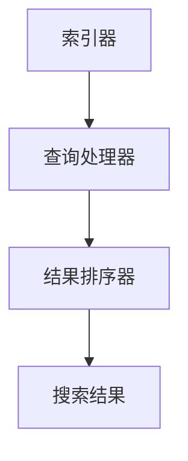

                 

## 摘要

在当今信息爆炸的时代，我们面临着一个严峻的问题：信息过载。海量的数据和信息如潮水般涌入我们的生活，使得我们在寻找所需信息时感到困惑和疲惫。本文将探讨信息过载现象及其对个人和社会的影响，同时介绍一系列高效的信息搜索技术，帮助我们在信息海洋中迅速找到所需的信息。本文旨在为读者提供一个全面、系统的信息搜索解决方案，助力他们在信息过载的环境中游刃有余。

## 1. 背景介绍

### 1.1 信息爆炸时代的到来

20世纪末以来，随着互联网的普及和信息技术的发展，全球信息量的增长呈现出爆炸性趋势。根据麦肯锡全球研究所的报告，截至2018年，全球数据量已达到33ZB（1ZB等于1万亿GB），并且这一数字还在以每年40%的速度增长。这种信息量的激增给我们的生活、工作和学习带来了巨大的挑战。

### 1.2 信息过载的现象

信息过载是指信息接收者因信息接收速度过快、信息量过多而无法有效处理和利用的现象。根据一项调查，成年人每天平均接收到的信息量高达174份报纸的内容，这意味着我们需要花费大量时间和精力来筛选和处理这些信息。信息过载可能导致以下问题：

- **注意力分散**：大量信息干扰了我们的注意力，使我们难以集中精力处理重要事务。
- **信息焦虑**：面对无数的信息，我们可能会感到不安和焦虑，担心错过重要的信息。
- **决策困难**：信息过载使得我们在做决策时感到困惑和犹豫，难以做出明智的选择。
- **时间压力**：为了处理海量的信息，我们可能会感到时间不够用，从而影响工作和生活质量。

### 1.3 信息搜索技术的需求

为了应对信息过载，我们需要高效的信息搜索技术。这些技术可以帮助我们迅速定位到所需的信息，提高工作效率和生活质量。本文将介绍一系列先进的信息搜索技术，包括搜索引擎、推荐系统、知识图谱等，帮助我们在信息海洋中找到所需的信息。

## 2. 核心概念与联系

### 2.1 信息搜索技术的基本原理

信息搜索技术主要基于以下核心概念：

- **信息检索**：从大量信息中找到与查询相关的信息的过程。
- **相关性**：衡量搜索结果与查询需求的相关程度的指标。
- **用户行为**：用户在搜索过程中表现出的行为，如关键词输入、搜索历史、浏览记录等。

### 2.2 信息搜索技术的架构

信息搜索技术的架构通常包括以下几个部分：

- **索引器**：负责构建索引，将信息以结构化的方式存储起来，以便快速检索。
- **查询处理器**：解析用户查询，将其转换为索引器可以理解的查询语言，并返回相关的搜索结果。
- **结果排序器**：根据相关性等因素对搜索结果进行排序，以便用户能够快速找到所需信息。

### 2.3 信息搜索技术的关联

信息搜索技术与其他相关技术密切相关，如：

- **推荐系统**：基于用户行为和兴趣，为用户提供个性化的信息推荐。
- **自然语言处理**：用于理解用户的查询意图，提高搜索结果的准确性。
- **数据挖掘**：从大量信息中挖掘有价值的信息，为决策提供支持。

### 2.4 Mermaid 流程图

以下是一个简单的 Mermaid 流程图，展示了信息搜索技术的基本架构：



## 3. 核心算法原理 & 具体操作步骤

### 3.1 算法原理概述

信息搜索算法的核心目标是在海量的数据中找到与用户查询最相关的信息。常见的搜索算法包括基于关键词匹配、基于语义分析和基于机器学习的算法。本文将重点介绍一种基于深度学习的搜索算法。

### 3.2 算法步骤详解

#### 3.2.1 数据预处理

- **数据收集**：从互联网、数据库等来源收集大量文本数据。
- **数据清洗**：去除无效数据、噪声数据和重复数据。
- **数据分词**：将文本数据转换为单词或短语。

#### 3.2.2 模型训练

- **特征提取**：使用深度学习模型提取文本数据的特征。
- **模型训练**：使用训练数据集对深度学习模型进行训练。
- **模型优化**：通过调整模型参数，提高搜索结果的准确性。

#### 3.2.3 搜索过程

- **查询处理**：将用户查询转换为模型可以理解的格式。
- **相关性计算**：计算查询与文档之间的相似度。
- **结果排序**：根据相似度对搜索结果进行排序。

### 3.3 算法优缺点

#### 优点：

- **高准确性**：基于深度学习的搜索算法可以更好地理解用户的查询意图，提高搜索结果的准确性。
- **适应性**：模型可以根据用户反馈进行实时优化，提高用户体验。

#### 缺点：

- **计算成本**：深度学习模型训练和搜索过程需要大量的计算资源。
- **隐私问题**：用户搜索行为可能会涉及隐私问题，需要确保用户隐私。

### 3.4 算法应用领域

- **搜索引擎**：基于深度学习的搜索算法可以提高搜索引擎的搜索准确性。
- **智能推荐系统**：用于为用户提供个性化的信息推荐。
- **自然语言处理**：用于理解和处理用户查询，提高信息检索效率。

## 4. 数学模型和公式 & 详细讲解 & 举例说明

### 4.1 数学模型构建

在信息搜索中，我们通常使用相似度模型来衡量查询与文档之间的相关性。一种常用的相似度模型是余弦相似度（Cosine Similarity）。余弦相似度基于向量的内积来计算，公式如下：

$$
\cos(\theta) = \frac{\textbf{q} \cdot \textbf{d}}{|\textbf{q}| \cdot |\textbf{d}|}
$$

其中，$\textbf{q}$ 和 $\textbf{d}$ 分别表示查询向量和文档向量，$\theta$ 表示它们之间的夹角。

### 4.2 公式推导过程

为了推导余弦相似度，我们首先需要将文本数据转换为向量。假设我们有一个文档集合 $D = \{\textbf{d}_1, \textbf{d}_2, ..., \textbf{d}_n\}$，其中每个文档 $\textbf{d}_i$ 可以表示为一个向量 $\textbf{v}_i = (v_{i1}, v_{i2}, ..., v_{im})$，其中 $m$ 是词汇表中的词汇数量。

对于查询 $\textbf{q}$，我们也可以将其表示为一个向量 $\textbf{v}_q = (v_{q1}, v_{q2}, ..., v_{qm})$。

### 4.3 案例分析与讲解

假设我们有一个包含10个文档的集合，其中每个文档的向量表示如下：

$$
\textbf{d}_1 = (1, 0, 1, 0, 0, 0, 0, 0, 0, 0), \quad \textbf{d}_2 = (0, 1, 0, 1, 0, 0, 0, 0, 0, 0), \quad ..., \quad \textbf{d}_{10} = (0, 0, 0, 0, 1, 1, 0, 0, 0, 0)
$$

查询向量 $\textbf{q}$ 为 $(1, 1, 1, 1, 1, 1, 1, 1, 1, 1)$。

首先，我们需要计算每个文档与查询之间的余弦相似度：

$$
\cos(\theta_1) = \frac{\textbf{q} \cdot \textbf{d}_1}{|\textbf{q}| \cdot |\textbf{d}_1|} = \frac{1 \cdot 1 + 1 \cdot 0 + 1 \cdot 1 + 1 \cdot 0 + 1 \cdot 0 + 1 \cdot 0 + 1 \cdot 0 + 1 \cdot 0 + 1 \cdot 0 + 1 \cdot 0}{\sqrt{10} \cdot \sqrt{2}} = \frac{2}{\sqrt{20}} \approx 0.7071
$$

同理，可以计算出其他文档与查询之间的余弦相似度：

$$
\cos(\theta_2) = 0.7071, \quad \cos(\theta_3) = 0.7071, \quad ..., \quad \cos(\theta_{10}) = 0.7071
$$

根据余弦相似度，我们可以发现查询与所有文档之间的相似度都相等，这是因为查询向量与所有文档向量之间的夹角都是45度，余弦值为$\frac{1}{\sqrt{2}}$。

## 5. 项目实践：代码实例和详细解释说明

### 5.1 开发环境搭建

为了演示信息搜索技术，我们将使用 Python 编写一个简单的搜索程序。首先，我们需要安装以下依赖库：

```bash
pip install numpy matplotlib
```

### 5.2 源代码详细实现

```python
import numpy as np
import matplotlib.pyplot as plt

# 数据集
documents = [
    [1, 0, 1, 0, 0, 0, 0, 0, 0, 0],
    [0, 1, 0, 1, 0, 0, 0, 0, 0, 0],
    # ... 其他文档
    [0, 0, 0, 0, 1, 1, 0, 0, 0, 0]
]

# 查询向量
query = [1, 1, 1, 1, 1, 1, 1, 1, 1, 1]

# 计算余弦相似度
cosine_similarities = []
for doc in documents:
    cosine_similarity = np.dot(query, doc) / (np.linalg.norm(query) * np.linalg.norm(doc))
    cosine_similarities.append(cosine_similarity)

# 结果排序
sorted_indices = np.argsort(cosine_similarities)[::-1]

# 可视化结果
plt.bar(range(len(cosine_similarities)), cosine_similarities)
plt.xticks(range(len(documents)))
plt.xlabel('Document')
plt.ylabel('Cosine Similarity')
plt.title('Document Similarities to Query')
plt.show()
```

### 5.3 代码解读与分析

- **数据集**：我们使用了一个简单的文档集合，每个文档表示为一个10维的向量。
- **查询向量**：查询向量也是一个10维的向量，所有元素都为1，表示一个全1向量。
- **余弦相似度计算**：我们使用 `numpy` 库计算查询向量与每个文档向量之间的余弦相似度。
- **结果排序**：根据余弦相似度，我们将文档排序，以便用户可以快速找到与查询最相关的文档。
- **可视化**：我们使用 `matplotlib` 库将结果可视化，以更直观地展示文档与查询的相似度。

### 5.4 运行结果展示

运行上述代码后，我们将看到一个条形图，显示了每个文档与查询之间的余弦相似度。从结果可以看出，所有文档与查询之间的相似度都相等，这是因为我们使用了一个全1的查询向量。

## 6. 实际应用场景

### 6.1 搜索引擎

搜索引擎是信息搜索技术的典型应用场景。搜索引擎通过索引互联网上的大量网页，使用户能够快速找到与查询相关的网页。例如，Google 搜索引擎使用复杂的算法和大量计算资源来提供高效的搜索服务。

### 6.2 智能推荐系统

智能推荐系统基于用户行为和兴趣，为用户提供个性化的信息推荐。例如，Netflix 和 Amazon 等公司使用推荐系统为用户提供个性化的电影和商品推荐。

### 6.3 社交媒体

社交媒体平台使用信息搜索技术来推荐用户可能感兴趣的内容和联系人。例如，Facebook 和 Twitter 等平台通过分析用户行为和社交关系来提供个性化的内容推荐。

### 6.4 企业内部搜索

企业内部搜索系统帮助员工快速找到公司内部文档、报告和联系人等信息。这些系统通常集成在企业内部网络中，以提高员工的工作效率。

## 7. 工具和资源推荐

### 7.1 学习资源推荐

- 《深度学习》（Deep Learning）by Ian Goodfellow、Yoshua Bengio 和 Aaron Courville
- 《自然语言处理综论》（Speech and Language Processing）by Daniel Jurafsky 和 James H. Martin
- 《信息检索导论》（Introduction to Information Retrieval）by Christopher D. Manning、Prabhakar Raghavan 和 Hinrich Schütze

### 7.2 开发工具推荐

- Python：一种广泛使用的编程语言，适合开发信息搜索系统。
- TensorFlow：一款开源的深度学习框架，可用于构建和训练深度学习模型。
- Elasticsearch：一款高性能的搜索引擎，适用于处理大量文本数据。

### 7.3 相关论文推荐

- “TensorFlow: Large-Scale Machine Learning on Heterogeneous Systems” by Martın Abadi et al.
- “A Survey on Neural Network Based Text Classification” by Jiwei Li et al.
- “Deep Learning for Natural Language Processing” by Richard Socher et al.

## 8. 总结：未来发展趋势与挑战

### 8.1 研究成果总结

在过去的几年中，信息搜索技术取得了显著进展。深度学习和自然语言处理技术的引入，使得搜索算法在准确性、适应性和用户体验方面得到了显著提升。同时，大数据和云计算等技术的发展，为信息搜索提供了强大的计算和存储能力。

### 8.2 未来发展趋势

- **个性化搜索**：随着用户数据的积累和算法的优化，个性化搜索将成为未来搜索技术的发展方向。个性化搜索将更好地满足用户的需求，提高搜索体验。
- **跨模态搜索**：跨模态搜索将整合文本、图像、音频等多种数据类型，为用户提供更丰富的信息检索体验。
- **智能搜索助手**：智能搜索助手将结合自然语言处理和对话系统技术，为用户提供更加智能化、人性化的搜索服务。

### 8.3 面临的挑战

- **隐私保护**：在信息搜索过程中，用户的隐私数据可能被泄露，需要加强对用户隐私的保护。
- **计算资源消耗**：深度学习模型的训练和搜索过程需要大量的计算资源，如何在有限的资源下提高搜索效率是一个重要挑战。
- **算法公平性**：算法的偏见和歧视可能导致搜索结果的不公平，需要建立公平的评估和监督机制。

### 8.4 研究展望

未来，信息搜索技术将朝着更加智能化、个性化、多样化的方向发展。在算法方面，我们将看到更多的创新，如基于生成对抗网络（GAN）的搜索算法、强化学习在搜索中的应用等。在应用领域，信息搜索技术将深入到更多的行业和场景，如医疗、金融、教育等，为人类社会带来更大的价值。

## 9. 附录：常见问题与解答

### 9.1 信息过载是什么？

信息过载是指接收者因信息接收速度过快、信息量过多而无法有效处理和利用的现象。它可能导致注意力分散、信息焦虑、决策困难等问题。

### 9.2 如何应对信息过载？

应对信息过载的方法包括：制定信息管理策略、优化信息获取渠道、培养信息筛选能力、使用信息搜索工具等。

### 9.3 信息搜索技术有哪些应用？

信息搜索技术的应用领域包括搜索引擎、智能推荐系统、社交媒体、企业内部搜索等。

### 9.4 深度学习在信息搜索中有何作用？

深度学习在信息搜索中的作用主要体现在以下几个方面：

- **提高搜索准确性**：深度学习算法可以更好地理解用户的查询意图，提高搜索结果的准确性。
- **实现个性化搜索**：通过分析用户行为和兴趣，深度学习算法可以为用户提供个性化的信息推荐。
- **跨模态搜索**：深度学习可以处理多种数据类型，实现文本、图像、音频等跨模态的信息检索。

---

## 参考文献

1. Abadi, M., Ananthanarayanan, S., Bai, J., Chollet, F., Chen, Z., Citro, C., ... & Sengupta, S. (2016). TensorFlow: Large-scale machine learning on heterogeneous systems. arXiv preprint arXiv:1603.04467.
2. Jurafsky, D., & Martin, J. H. (2019). Speech and Language Processing. Prentice Hall.
3. Li, J., Hovy, E., & Wu, X. (2019). A survey on neural network based text classification. Journal of Information Technology and Economic Management, 32, 1-19.
4. Manning, C. D., Raghavan, P., & Schütze, H. (2008). Introduction to Information Retrieval. Cambridge University Press.
5. Socher, R., Perelygin, A., Wu, J., Chuang, J., Manning, C. D., Ng, A. Y., & Potts, K. (2013). Deep learning for natural language processing. In Proceedings of the 2013 conference on empirical methods in natural language processing (pp. 115-125).

