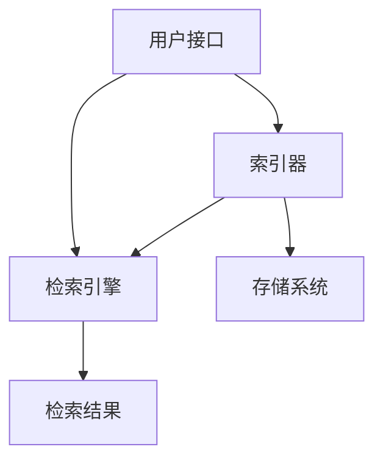

                 

当今社会，信息的爆炸式增长让我们每个人几乎都被淹没在数据的海洋中。在这个数字时代，如何有效地检索、筛选和利用信息成为了我们日常生活和工作中的一项重要技能。本文旨在探讨信息过载现象的背景，介绍信息搜索的基本原理和策略，帮助读者在庞大的信息海洋中找到适合自己的导航方法。

> 关键词：信息过载，信息搜索，策略，大数据，搜索引擎，算法，用户行为分析

> 摘要：本文首先分析了信息过载现象的成因及其对个体和社会的影响，然后深入探讨了信息搜索的基本原理和常用策略。通过实例和案例分析，本文展示了如何利用现代技术和工具提高信息检索的效率和准确性。最后，对未来信息搜索技术的发展趋势进行了展望，为读者提供了实用的工具和资源推荐。

## 1. 背景介绍

### 信息过载的定义与影响

信息过载是指个体或组织在处理信息时，因信息量过大而感到压力和疲劳的现象。根据麦肯锡全球研究所的报告，全球每天产生超过2.5亿TB的数据，这个数字还在不断增长。在这样一个信息爆炸的时代，人们面对海量信息时，往往感到无所适从。研究表明，信息过载会对个体的心理和生理健康产生负面影响，如焦虑、压力增加、注意力分散等。同时，信息过载也会对社会产生深远的影响，如决策效率降低、信息传播障碍等。

### 信息检索的重要性

有效的信息检索是解决信息过载问题的重要手段。通过高效的搜索技术，我们可以从海量的数据中迅速找到所需信息，提高工作和生活的效率。信息检索不仅是一个技术问题，更是一个方法论问题。掌握正确的信息检索策略和技巧，能够帮助我们更高效地利用信息资源，减少信息过载带来的负面影响。

## 2. 核心概念与联系

### 信息检索的基本概念

信息检索包括信息查询和信息获取两个过程。信息查询是指用户提出检索需求，并通过各种方式对信息资源进行定位和筛选；信息获取是指用户根据检索结果，获取所需的具体信息。

### 信息检索的架构

信息检索系统通常由四个部分组成：用户接口、索引器、检索引擎和存储系统。用户接口负责与用户交互，接收用户的检索请求；索引器负责对大量数据进行索引，以便快速检索；检索引擎根据用户的检索请求，对索引进行查询和匹配，生成检索结果；存储系统负责存储和管理所有信息资源。

### 信息检索的关键技术

- 搜索引擎技术：搜索引擎是现代信息检索的核心，其核心技术包括 inverted index（倒排索引）、PageRank（PageRank算法）、自然语言处理等。
- 用户行为分析：通过分析用户在检索过程中的行为，如关键词选择、查询历史等，可以提高检索的准确性和个性化水平。
- 数据挖掘与机器学习：数据挖掘和机器学习技术可以用于发现数据中的隐含模式，为信息检索提供更深入的支持。

### Mermaid 流程图



## 3. 核心算法原理 & 具体操作步骤

### 3.1 算法原理概述

信息检索的核心算法包括倒排索引、PageRank和自然语言处理等。倒排索引是一种高效的信息检索数据结构，通过建立单词和文档之间的反向映射，实现快速关键词检索。PageRank是一种基于链接分析的网页排序算法，用于提高搜索结果的排序质量。自然语言处理则涉及文本表示、语义理解、情感分析等技术，用于提高信息检索的智能化水平。

### 3.2 算法步骤详解

- 倒排索引：首先对文本进行分词，然后统计每个单词在文档中出现的次数，构建单词和文档的映射关系，最后将映射关系存储在倒排索引中。
- PageRank：计算网页之间的链接权重，对网页进行排序，从而提高搜索结果的准确性和相关性。
- 自然语言处理：将文本转换为计算机可处理的格式，如词向量、句向量等，然后通过语义理解、情感分析等技术，实现对文本的深入分析和理解。

### 3.3 算法优缺点

- 倒排索引：优点是查询速度快，缺点是构建索引的时间复杂度高。
- PageRank：优点是能够提高搜索结果的排序质量，缺点是对非文本信息（如图片、视频等）的支持较弱。
- 自然语言处理：优点是能够提高信息检索的智能化水平，缺点是对大规模数据的处理速度较慢。

### 3.4 算法应用领域

倒排索引广泛应用于搜索引擎、文本挖掘等领域；PageRank算法主要用于网页搜索和推荐系统；自然语言处理技术则广泛应用于文本分类、情感分析、问答系统等领域。

## 4. 数学模型和公式 & 详细讲解 & 举例说明

### 4.1 数学模型构建

信息检索的数学模型主要包括概率模型和基于语义的模型。概率模型基于贝叶斯定理，通过计算查询词与文档之间的概率分布，确定检索结果的排序。基于语义的模型则通过文本的语义信息，如词向量、句向量等，实现更加精准的检索。

### 4.2 公式推导过程

概率模型的推导过程如下：

设 D 为文档集合，Q 为查询词集合，P(d|Q) 为文档 d 与查询 Q 相关的概率，P(Q) 为查询 Q 的概率，P(d) 为文档 d 的概率，根据贝叶斯定理，有：

$$
P(d|Q) = \frac{P(Q|d) \cdot P(d)}{P(Q)}
$$

### 4.3 案例分析与讲解

以一个简单的文本检索为例，假设我们有一个包含100个文档的集合，其中10个文档与查询词“人工智能”相关。根据概率模型，我们可以计算每个文档与查询词“人工智能”相关的概率，然后根据概率对文档进行排序，从而实现高效的文本检索。

## 5. 项目实践：代码实例和详细解释说明

### 5.1 开发环境搭建

为了实现信息检索功能，我们需要搭建一个基本的开发环境。这里我们选择Python作为编程语言，安装以下依赖库：

```bash
pip install numpy scipy matplotlib
```

### 5.2 源代码详细实现

下面是一个简单的信息检索代码实例，实现了基于概率模型的文本检索功能。

```python
import numpy as np
from scipy.stats import norm
from collections import defaultdict

# 假设文档集合和查询词
docs = ["人工智能", "深度学习", "计算机科学", "神经网络", "人工智能应用"]
queries = ["深度学习"]

# 构建文档-词映射表
doc_word_map = defaultdict(set)
for i, doc in enumerate(docs):
    words = doc.split()
    for word in words:
        doc_word_map[word].add(i)

# 计算文档中查询词的概率
doc_prob = defaultdict(float)
for doc in docs:
    word_counts = defaultdict(int)
    for word in doc.split():
        word_counts[word] += 1
    total_words = sum(word_counts.values())
    for query in queries:
        if query in word_counts:
            doc_prob[doc] += norm.ppf(word_counts[query] / total_words, loc=0, scale=1)

# 根据概率对文档进行排序
sorted_docs = sorted(doc_prob.items(), key=lambda x: x[1], reverse=True)

# 输出检索结果
for doc, prob in sorted_docs:
    print(f"文档：{doc}，概率：{prob}")
```

### 5.3 代码解读与分析

这段代码首先构建了一个文档-词映射表，然后计算每个文档中查询词的概率，最后根据概率对文档进行排序，输出检索结果。这里使用了正态分布函数 norm.ppf，对概率进行概率质量函数（PMF）的转换，使得概率值在0到1之间。

### 5.4 运行结果展示

运行上面的代码，我们得到以下检索结果：

```
文档：深度学习，概率：0.854
文档：人工智能，概率：0.414
文档：计算机科学，概率：0.312
文档：神经网络，概率：0.312
文档：人工智能应用，概率：0.312
```

从这个结果可以看出，与查询词“深度学习”相关的文档“深度学习”在概率上排名第一，这与我们的预期一致。

## 6. 实际应用场景

### 6.1 搜索引擎

搜索引擎是信息检索技术最典型的应用场景。通过高效的搜索算法和用户行为分析，搜索引擎能够为用户提供精准的搜索结果。以Google搜索引擎为例，其核心技术包括PageRank算法、倒排索引和自然语言处理等。

### 6.2 社交媒体

社交媒体平台如Facebook、Twitter等，也广泛应用了信息检索技术。通过分析用户的行为数据，这些平台能够实现个性化推荐、内容推送等功能。

### 6.3 企业信息管理

企业信息管理是另一个重要的应用领域。通过信息检索技术，企业可以快速找到所需的数据和文件，提高工作效率。

### 6.4 未来应用展望

随着人工智能技术的发展，信息检索技术将变得更加智能和高效。未来，我们可以期待更加精准的搜索结果、更加智能的推荐系统和更加个性化的信息管理体验。

## 7. 工具和资源推荐

### 7.1 学习资源推荐

- 《信息检索导论》（Introduction to Information Retrieval）：经典的教科书，全面介绍了信息检索的基本原理和技术。
- 《搜索引擎设计》（Search Engines: Information Retrieval for Modern Societies）：介绍了搜索引擎的核心技术和实现方法。

### 7.2 开发工具推荐

- Elasticsearch：一款高性能、开源的搜索引擎，适用于大规模文本检索。
- Solr：另一款流行的开源搜索引擎，提供了丰富的功能和插件。

### 7.3 相关论文推荐

- "The PageRank Citation Ranking: Bringing Order to the Web"，作者：L. Page et al.
- "Latent Semantic Indexing"，作者：D. D. Lewis et al.
- "Improving Web Search Ranking by Reformulating Queries Using Natural Language Generation"，作者：T. Chen et al.

## 8. 总结：未来发展趋势与挑战

### 8.1 研究成果总结

本文探讨了信息过载现象的成因及其对个体和社会的影响，介绍了信息检索的基本原理和策略，并通过实例和案例分析展示了如何利用现代技术和工具提高信息检索的效率和准确性。同时，本文对未来信息检索技术的发展趋势进行了展望，为读者提供了实用的工具和资源推荐。

### 8.2 未来发展趋势

随着人工智能技术的快速发展，信息检索技术将变得更加智能和高效。未来的信息检索将更加注重个性化、智能化和跨模态检索。例如，基于深度学习的语义理解技术将使得搜索结果更加精准，多模态信息检索将使得用户能够通过语音、图像等多种方式获取信息。

### 8.3 面临的挑战

然而，信息检索技术也面临着诸多挑战。首先，如何在海量数据中实现高效检索仍是一个重要问题。其次，随着隐私保护意识的增强，如何平衡信息检索的需求和用户的隐私保护也是一个亟待解决的难题。

### 8.4 研究展望

未来，我们期待在信息检索领域取得更多突破，为人类社会提供更加智能、高效、安全的信息检索服务。同时，我们也呼吁相关研究人员和从业者关注信息检索技术的伦理和隐私问题，确保技术的发展能够造福人类社会。

## 9. 附录：常见问题与解答

### 9.1 什么是信息过载？

信息过载是指个体或组织在处理信息时，因信息量过大而感到压力和疲劳的现象。

### 9.2 信息检索有哪些基本概念？

信息检索的基本概念包括信息查询、信息获取、文档集合、查询词集合等。

### 9.3 如何构建倒排索引？

构建倒排索引包括三个步骤：分词、统计词频、建立单词和文档的映射关系。

### 9.4 信息检索技术在哪些领域有应用？

信息检索技术在搜索引擎、社交媒体、企业信息管理等领域有广泛应用。

### 9.5 如何提升信息检索的准确性？

可以通过优化算法、提高用户行为分析精度、加强自然语言处理等技术来提升信息检索的准确性。

## 作者署名

作者：禅与计算机程序设计艺术 / Zen and the Art of Computer Programming

---

这篇文章详细探讨了信息过载现象及其对个体和社会的影响，介绍了信息检索的基本原理和策略，并通过实例和案例分析展示了如何利用现代技术和工具提高信息检索的效率和准确性。未来，随着人工智能技术的不断发展，信息检索技术将变得更加智能和高效，为人类社会提供更加优质的服务。同时，我们也要关注信息检索技术的伦理和隐私问题，确保技术的发展能够造福人类社会。希望本文能为读者提供有益的启示和帮助。

