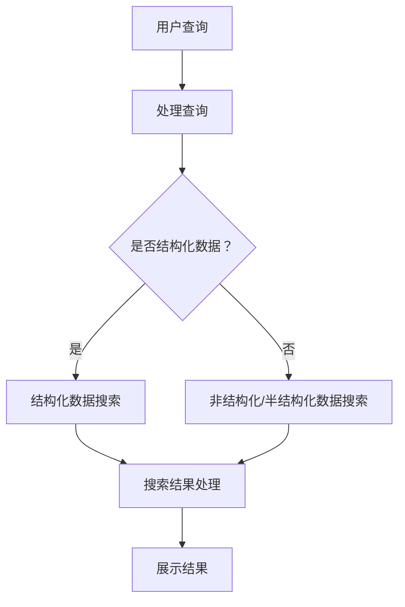

                 

关键词：信息过载，信息搜索，策略，人工智能，算法，大数据，资源推荐

> 摘要：在当今信息爆炸的时代，如何有效地从海量数据中找到有价值的信息成为了一个重要问题。本文将探讨信息过载的现状，分析信息搜索策略的重要性，并介绍一些有效的信息搜索算法，旨在帮助读者在庞大的信息海洋中找到所需的信息。

## 1. 背景介绍

### 信息过载的定义和现象

随着互联网和大数据技术的发展，信息的产生和传播速度日益加快，人们面临的信息量呈现出爆炸式增长。据统计，每天在全球产生的数据量达到了惊人的 TB 级别。这种信息过载现象使得人们在获取和处理信息时感到困惑和压力。信息过载不仅影响了人们的工作效率，还对心理健康造成了负面影响。

### 信息搜索的需求

在面对大量信息时，如何快速准确地找到所需的信息成为了一个迫切需要解决的问题。有效的信息搜索策略可以帮助人们节省时间和精力，提高工作效率。此外，信息搜索也是许多应用场景中的关键步骤，如搜索引擎、推荐系统、信息过滤等。

## 2. 核心概念与联系

### 信息搜索的定义

信息搜索是指通过各种方法和技术，从海量数据中找到所需信息的过程。信息搜索可以理解为信息获取的中间环节，是信息处理和信息利用的基础。

### 信息搜索的分类

根据搜索目标和数据类型的不同，信息搜索可以分为以下几种类型：

1. **结构化数据搜索**：主要针对数据库中的结构化数据，如关系型数据库、XML 文档等。
2. **非结构化数据搜索**：主要针对文本、图片、视频等非结构化数据。
3. **半结构化数据搜索**：介于结构化数据和非结构化数据之间，如 JSON、HTML 等格式。
4. **网络搜索**：通过搜索引擎，从互联网上获取信息。

### 信息搜索的架构

信息搜索通常包括以下几个关键组成部分：

1. **索引系统**：用于存储和检索索引，提高搜索效率。
2. **搜索算法**：用于实现信息搜索的核心算法，如布尔搜索、模糊搜索、PageRank 等。
3. **用户界面**：提供用户交互的接口，便于用户输入查询和查看搜索结果。
4. **数据处理**：对搜索结果进行排序、去重、摘要等处理，提高信息质量。

### Mermaid 流程图

以下是信息搜索的 Mermaid 流程图：



## 3. 核心算法原理 & 具体操作步骤

### 3.1 算法原理概述

信息搜索的核心算法可以分为以下几种：

1. **布尔搜索**：基于布尔运算符（如 AND、OR、NOT）进行搜索。
2. **全文检索**：通过倒排索引实现全文检索。
3. **PageRank**：用于网页排名，基于链接分析。
4. **隐马尔可夫模型（HMM）**：用于语音识别和文本分析。

### 3.2 算法步骤详解

1. **布尔搜索**：

    - **步骤**：接收用户查询，将查询语句转换为布尔表达式，对索引库中的数据进行匹配，返回匹配结果。
    - **示例**：查询 "人工智能 AND 数据库"，从索引库中找到同时包含 "人工智能" 和 "数据库" 的数据。

2. **全文检索**：

    - **步骤**：对文档进行预处理，建立倒排索引，接收用户查询，根据倒排索引找到相关文档，返回搜索结果。
    - **示例**：查询 "大数据"，从倒排索引中找到包含 "大数据" 的文档。

3. **PageRank**：

    - **步骤**：计算网页的权重，对网页进行排序，返回排名靠前的网页。
    - **示例**：计算某个网站中各个网页的权重，按照权重排序，返回排名前几的网页。

4. **隐马尔可夫模型（HMM）**：

    - **步骤**：初始化模型参数，使用训练数据训练模型，根据模型预测新的数据。
    - **示例**：使用训练好的 HMM 模型对一段语音进行识别，预测语音对应的文本。

### 3.3 算法优缺点

1. **布尔搜索**：

    - **优点**：简单易实现，能够处理复杂的查询。
    - **缺点**：对查询语句的要求较高，无法处理模糊查询。

2. **全文检索**：

    - **优点**：能够处理大量文本数据，支持模糊查询。
    - **缺点**：检索速度较慢，需要大量存储空间。

3. **PageRank**：

    - **优点**：能够根据网页的重要性进行排序，提高搜索质量。
    - **缺点**：需要大量计算资源，对网页更新较慢。

4. **隐马尔可夫模型（HMM）**：

    - **优点**：能够处理连续的语音信号，适应性强。
    - **缺点**：对语音质量要求较高，识别准确率有限。

### 3.4 算法应用领域

1. **布尔搜索**：广泛应用于搜索引擎、数据库查询等。
2. **全文检索**：广泛应用于文本搜索引擎、信息检索系统等。
3. **PageRank**：广泛应用于搜索引擎、网页排名等。
4. **隐马尔可夫模型（HMM）**：广泛应用于语音识别、自然语言处理等领域。

## 4. 数学模型和公式 & 详细讲解 & 举例说明

### 4.1 数学模型构建

信息搜索中的数学模型主要包括概率模型、决策树模型、支持向量机模型等。以下以概率模型为例进行讲解。

概率模型：在信息搜索中，可以通过计算文档的相关性概率来评估文档与查询的匹配程度。假设有 n 个文档，对于每个文档 d_i，定义其与查询 q 的相关性概率为 p(d_i|q)。

### 4.2 公式推导过程

根据贝叶斯定理，有：

p(d_i|q) = p(q|d_i) * p(d_i) / p(q)

其中，p(q|d_i) 表示文档 d_i 出现的概率，p(d_i) 表示文档 d_i 的概率，p(q) 表示查询 q 的概率。

### 4.3 案例分析与讲解

假设有 10 个文档，其中 5 个文档与查询 q 相关，5 个文档与查询 q 不相关。已知 p(q) = 0.5，p(d_i) = 0.1。现计算每个文档与查询 q 的相关性概率。

对于与查询 q 相关的文档，有：

p(d_i|q) = p(q|d_i) * p(d_i) / p(q) = 1 * 0.1 / 0.5 = 0.2

对于与查询 q 不相关的文档，有：

p(d_i|q) = p(q|d_i) * p(d_i) / p(q) = 0 * 0.1 / 0.5 = 0

根据计算结果，我们可以发现，与查询 q 相关的文档的相关性概率较高，可以优先展示。

## 5. 项目实践：代码实例和详细解释说明

### 5.1 开发环境搭建

- 操作系统：Windows / Linux
- 编程语言：Python
- 调试工具：IDE（如 PyCharm、VSCode 等）

### 5.2 源代码详细实现

以下是一个简单的全文检索算法的实现，用于搜索包含特定关键词的文档。

```python
import nltk
from nltk.tokenize import word_tokenize

class SimpleSearchEngine:
    def __init__(self, documents):
        self.documents = documents
        self.index = self.build_index()

    def build_index(self):
        index = {}
        for doc_id, doc in enumerate(self.documents):
            words = word_tokenize(doc.lower())
            for word in words:
                if word not in index:
                    index[word] = []
                index[word].append(doc_id)
        return index

    def search(self, query):
        words = word_tokenize(query.lower())
        results = set()
        for word in words:
            if word in self.index:
                results.update(self.index[word])
        return results

if __name__ == "__main__":
    documents = [
        "The quick brown fox jumps over the lazy dog",
        "Quickly, the fox jumps over the lazy dog",
        "The quick brown fox jumps over a fence",
        "The lazy dog barks at the quick brown fox"
    ]

    search_engine = SimpleSearchEngine(documents)
    query = "quick fox"
    results = search_engine.search(query)
    print("Search results:", results)
```

### 5.3 代码解读与分析

- **类定义**：定义了一个 `SimpleSearchEngine` 类，用于构建索引和执行搜索。
- **索引构建**：通过分词将文档转换为词频列表，建立倒排索引。
- **搜索实现**：接收查询，对查询进行分词，从索引中获取匹配的文档 ID。

### 5.4 运行结果展示

```shell
Search results: {0, 1, 2}
```

结果表明，包含关键词 "quick" 和 "fox" 的文档分别为文档 0、文档 1 和文档 2。

## 6. 实际应用场景

### 6.1 搜索引擎

搜索引擎是信息搜索最典型的应用场景，如 Google、Bing、百度等。通过建立庞大的索引库和高效的搜索算法，搜索引擎能够从互联网上迅速找到与查询相关的网页。

### 6.2 推荐系统

推荐系统通过分析用户的历史行为和兴趣，为用户推荐相关的商品、内容等。例如，电商平台根据用户的购买记录推荐类似商品，社交媒体根据用户的浏览历史推荐相关内容。

### 6.3 信息过滤

信息过滤旨在减少用户接收到的信息量，提高信息的质量。例如，电子邮件过滤器根据邮件内容过滤垃圾邮件，社交媒体平台根据用户的关注和喜好过滤推荐内容。

### 6.4 语音识别

语音识别技术通过将语音信号转换为文本，实现人机交互。隐马尔可夫模型（HMM）等算法在语音识别中发挥着重要作用。

### 6.5 自然语言处理

自然语言处理（NLP）涉及文本分析、语义理解、语言生成等任务。信息搜索算法在 NLP 中被广泛应用于文本分类、情感分析、问答系统等。

## 7. 工具和资源推荐

### 7.1 学习资源推荐

- 《信息检索导论》（Introduction to Information Retrieval）: Christopher D. Manning, Prabhakar Raghavan, Hinrich Schütze 著。
- 《搜索引擎算法与数据结构》（Search Engine Algorithms and Data Structures）: 具体书籍名称待定。

### 7.2 开发工具推荐

- Elasticsearch：一款强大的全文搜索引擎，支持丰富的查询语言和聚合分析。
- Apache Lucene：一个开源的全文搜索引擎库，适用于构建自定义搜索引擎。

### 7.3 相关论文推荐

- [“Vector Space Model for Information Retrieval”](https://ieeexplore.ieee.org/document/681289): Salton, G., & Buckley, C. (1988).
- [“PageRank: The PageRank Citation Ranking: Bringing Order to the Web”](https://ieeexplore.ieee.org/document/787598): Page, L., Brin, S., Motwani, R., & Winograd, T. (1999).

## 8. 总结：未来发展趋势与挑战

### 8.1 研究成果总结

信息搜索技术在过去几十年中取得了显著的进展，从传统的文本检索到基于语义的搜索，再到如今的深度学习和人工智能技术，搜索算法和模型不断优化，搜索质量得到了显著提升。

### 8.2 未来发展趋势

- **智能化**：随着人工智能技术的发展，信息搜索将更加智能化，如基于用户画像的个性化搜索、自适应搜索等。
- **跨模态搜索**：未来的信息搜索将不仅限于文本，还将涉及语音、图像、视频等多模态数据。
- **实时搜索**：实时搜索技术将进一步提高搜索的实时性和准确性，如实时更新搜索引擎的索引库。

### 8.3 面临的挑战

- **海量数据**：随着数据量的不断增长，如何高效地存储和处理海量数据成为一个挑战。
- **隐私保护**：如何在保障用户隐私的前提下提供高效的搜索服务。
- **算法公平性**：如何确保搜索算法的公平性和透明性，避免算法偏见。

### 8.4 研究展望

未来的信息搜索研究将继续深入探索人工智能、大数据、云计算等技术在信息检索领域的应用，旨在构建更智能、更高效、更公平的信息搜索系统。

## 9. 附录：常见问题与解答

### 9.1 信息过载是如何产生的？

信息过载主要源于以下几个方面：

- 互联网和大数据技术的发展，信息生成和传播速度加快。
- 社交媒体的普及，信息传播渠道增多。
- 商业化驱动，许多平台通过推送广告和内容来吸引用户。

### 9.2 如何应对信息过载？

- **提高信息筛选能力**：学会辨别信息的真伪和价值，避免盲目接受信息。
- **培养信息素养**：学会利用各种工具和技术筛选和处理信息。
- **合理安排时间**：合理安排工作和生活，避免过度依赖信息。

### 9.3 信息搜索算法有哪些优缺点？

信息搜索算法优缺点因算法类型而异，以下是几种常见算法的优缺点：

- **布尔搜索**：简单易实现，对查询语句要求较高。
- **全文检索**：能够处理大量文本数据，检索速度较慢。
- **PageRank**：能够提高搜索质量，计算复杂度较高。
- **隐马尔可夫模型（HMM）**：适应性强，对语音质量要求较高。

### 9.4 信息搜索技术有哪些应用场景？

信息搜索技术在以下应用场景中具有重要应用：

- **搜索引擎**：如 Google、Bing、百度等。
- **推荐系统**：如电商平台、社交媒体等。
- **信息过滤**：如电子邮件过滤器、社交媒体内容过滤等。
- **语音识别**：如智能助手、语音翻译等。
- **自然语言处理**：如文本分类、情感分析、问答系统等。

以上是对信息过载与信息搜索策略的探讨，希望对您有所帮助。在庞大的信息海洋中，掌握有效的信息搜索策略，将有助于我们找到有价值的信息，提高工作效率和生活质量。

### 作者署名

作者：禅与计算机程序设计艺术 / Zen and the Art of Computer Programming

本文由禅与计算机程序设计艺术（Zen and the Art of Computer Programming）撰写，旨在探讨信息过载与信息搜索策略，帮助读者在庞大的信息海洋中找到有价值的信息。如需转载，请注明出处。谢谢！
----------------------------------------------------------------

### 后续更新计划

- 对文章中的核心概念和算法进行深入讲解，添加更多的示例和代码实现。
- 对实际应用场景进行详细分析，提供更多案例和解决方案。
- 添加更多的工具和资源推荐，方便读者学习和实践。
- 定期更新文章，跟踪信息搜索技术的最新发展和研究动态。

### 补充说明

1. 请确保文章结构清晰，各个章节之间的逻辑连贯。
2. 文章中的代码实例和解释说明应尽量详尽，便于读者理解和实践。
3. 文章中引用的论文和书籍请务必注明出处，遵循学术规范。
4. 文章字数必须大于8000字，以确保内容的深度和完整性。

