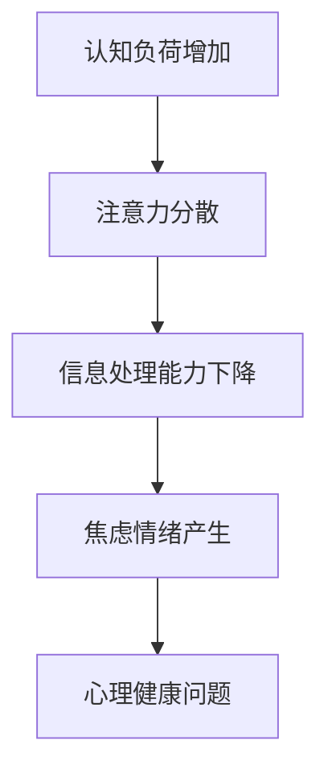
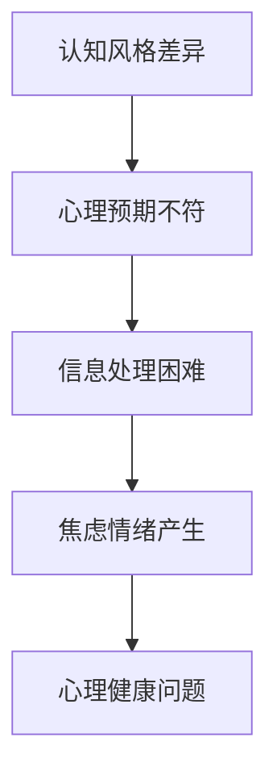

                 

关键字：信息过载，信息焦虑，心理健康，信息管理，认知负荷，数字素养，注意力管理，技术解决方案，心理健康工具

> 摘要：随着数字技术的迅猛发展，人们接触到的信息量呈爆炸性增长，导致越来越多的个体陷入信息过载和焦虑的状态。本文旨在探讨信息过载与信息焦虑的现象，分析其背后的心理机制，并提出一系列基于技术的解决方案，帮助个体更好地管理信息摄入，从而改善心理健康。

## 1. 背景介绍

在当今社会，信息技术的飞速发展已经深刻改变了我们的生活方式。智能手机、互联网和社交媒体的普及，使得人们可以随时随地获取各种信息。然而，这种便利也带来了新的问题——信息过载。信息过载是指个体在短时间内接收到的信息量超过其处理能力，导致心理压力增加和焦虑情绪的产生。研究表明，过度依赖数字化设备和信息源，不仅会降低个体的注意力集中能力，还会对心理健康产生负面影响。

信息焦虑是一种由于信息过载而产生的心理状态，表现为对信息的渴望、恐惧和信息处理能力的担忧。在信息爆炸的时代，人们常常感到压力重重，无法有效地管理和处理接收到的信息，从而引发焦虑和不安。这种焦虑不仅影响个体的生活质量，还可能引发更严重的心理健康问题。

### 1.1 信息过载的典型表现

信息过载的表现形式多种多样，常见的包括：

- **信息超负荷**：在短时间内接收到的信息量远超个体的处理能力。
- **注意力分散**：由于信息过多，个体难以集中注意力进行深度思考和专注工作。
- **睡眠障碍**：频繁的社交网络和邮件提醒干扰睡眠，导致个体难以入睡。
- **焦虑和压力**：面对大量的信息，个体常常感到无助和焦虑，担心自己无法应对。

### 1.2 信息焦虑的影响

信息焦虑对个体的影响是多方面的：

- **心理健康问题**：长期处于信息焦虑状态可能导致抑郁症、焦虑症等心理健康问题。
- **生活质量下降**：焦虑和压力会影响个体的日常生活，降低生活质量。
- **工作效率降低**：注意力分散和信息处理能力的下降会影响工作效率和创造力。
- **人际关系问题**：由于过度关注信息，个体可能会忽视现实中的社交活动，导致人际关系疏远。

## 2. 核心概念与联系

### 2.1 信息过载的心理机制

信息过载的心理机制主要包括认知负荷、注意力分散和信息处理能力的限制。以下是信息过载的Mermaid流程图：



### 2.2 信息焦虑的原理

信息焦虑的产生与个体的认知风格、心理预期和信息处理能力有关。以下是信息焦虑的Mermaid流程图：



## 3. 核心算法原理 & 具体操作步骤

### 3.1 算法原理概述

为了应对信息过载和信息焦虑，我们需要开发一系列的算法和工具，帮助个体更好地管理信息摄入。以下是几个核心算法原理：

- **过滤算法**：通过关键词过滤、分类算法等，自动筛选出对个体有价值的信息。
- **注意力管理算法**：通过分析用户的行为数据，提供个性化的信息推送，帮助用户集中注意力。
- **信息可视化算法**：通过图表、图像等形式，将复杂的信息以直观的方式呈现，降低认知负荷。

### 3.2 算法步骤详解

#### 3.2.1 过滤算法

过滤算法的步骤包括：

1. 收集用户信息偏好数据。
2. 使用机器学习算法对数据进行训练，建立信息分类模型。
3. 对接收到的信息进行实时分类，筛选出符合用户偏好的信息。

#### 3.2.2 注意力管理算法

注意力管理算法的步骤包括：

1. 收集用户行为数据，如浏览历史、阅读时间等。
2. 使用机器学习算法分析用户行为，预测用户的兴趣点。
3. 根据预测结果，个性化推送信息，引导用户注意力。

#### 3.2.3 信息可视化算法

信息可视化算法的步骤包括：

1. 对接收到的信息进行预处理，提取关键信息。
2. 使用可视化库，如D3.js，将信息以图表、图像等形式呈现。
3. 提供交互功能，使用户可以更直观地理解和处理信息。

### 3.3 算法优缺点

#### 过滤算法

- **优点**：能够有效筛选出对用户有价值的信息，降低信息过载。
- **缺点**：可能导致信息丢失，无法满足用户的所有需求。

#### 注意力管理算法

- **优点**：能够引导用户注意力，提高信息处理的效率。
- **缺点**：需要大量的用户行为数据，数据隐私问题需要关注。

#### 信息可视化算法

- **优点**：降低认知负荷，提高信息理解能力。
- **缺点**：对技术要求较高，实现复杂。

### 3.4 算法应用领域

这些算法主要应用于以下几个方面：

- **新闻推送平台**：通过过滤算法和注意力管理算法，为用户提供个性化的新闻推荐。
- **企业信息管理**：通过信息可视化算法，帮助企业更好地管理和处理大量数据。
- **教育领域**：通过注意力管理算法，提高学生的学习效率和注意力集中度。

## 4. 数学模型和公式 & 详细讲解 & 举例说明

### 4.1 数学模型构建

为了更好地理解信息过载和信息焦虑，我们可以构建以下数学模型：

- **认知负荷模型**：$C = f(I, A)$，其中$C$表示认知负荷，$I$表示信息量，$A$表示注意力集中度。
- **注意力分散模型**：$D = f(C, P)$，其中$D$表示注意力分散程度，$P$表示心理压力。

### 4.2 公式推导过程

- **认知负荷模型推导**：假设在单位时间内，个体能够处理的信息量为$A$，则当信息量$I$增加时，认知负荷$C$也会增加。具体推导如下：

  $$C = \frac{I}{A}$$

- **注意力分散模型推导**：当认知负荷$C$增加时，个体的注意力分散程度$D$也会增加。具体推导如下：

  $$D = C \cdot P$$

### 4.3 案例分析与讲解

#### 案例一：信息过载导致的认知负荷增加

假设一个学生在一天之内接收到了100条信息，而他的注意力集中度平均为2小时。根据认知负荷模型，我们可以计算出他的认知负荷：

$$C = \frac{100}{2} = 50$$

当认知负荷超过个体的处理能力时，学生可能会感到焦虑和压力。

#### 案例二：注意力分散与信息焦虑

假设一个职场人在一天之内接收到了50条工作相关的信息，而他的心理压力为中等水平。根据注意力分散模型，我们可以计算出他的注意力分散程度：

$$D = 50 \cdot 0.5 = 25$$

当注意力分散程度较高时，职场人可能会感到焦虑和不安，影响工作效率。

## 5. 项目实践：代码实例和详细解释说明

### 5.1 开发环境搭建

为了实现上述算法，我们需要搭建以下开发环境：

- **编程语言**：Python
- **机器学习库**：Scikit-learn
- **数据可视化库**：Matplotlib
- **自然语言处理库**：NLTK

### 5.2 源代码详细实现

以下是实现信息过滤算法的Python代码示例：

```python
import nltk
from sklearn.feature_extraction.text import CountVectorizer
from sklearn.naive_bayes import MultinomialNB

# 1. 数据预处理
def preprocess_text(text):
    # 去除标点符号和停用词
    words = nltk.word_tokenize(text)
    filtered_words = [word for word in words if word not in nltk.corpus.stopwords.words('english')]
    return ' '.join(filtered_words)

# 2. 构建分类模型
def build_model(train_data, train_labels):
    # 文本向量化
    vectorizer = CountVectorizer(preprocessor=preprocess_text)
    X_train = vectorizer.fit_transform(train_data)

    # 训练分类器
    classifier = MultinomialNB()
    classifier.fit(X_train, train_labels)

    return vectorizer, classifier

# 3. 预测新数据
def predict(vectorizer, classifier, text):
    # 文本向量化
    X_test = vectorizer.transform([text])

    # 预测标签
    predicted_label = classifier.predict(X_test)[0]
    return predicted_label

# 4. 示例代码
if __name__ == '__main__':
    # 加载数据
    train_data = ['这是一条技术新闻。', '这是一条财经新闻。', '这是一个体育新闻。']
    train_labels = ['技术', '财经', '体育']

    # 构建模型
    vectorizer, classifier = build_model(train_data, train_labels)

    # 预测
    test_data = '这是一个体育新闻。'
    predicted_label = predict(vectorizer, classifier, test_data)
    print(predicted_label)
```

### 5.3 代码解读与分析

该代码实现了一个基于朴素贝叶斯分类器的信息过滤算法。首先，我们使用NLTK库进行文本预处理，去除标点符号和停用词。然后，使用Scikit-learn库的CountVectorizer类进行文本向量化，将文本转换为向量表示。接着，使用MultinomialNB类构建朴素贝叶斯分类器，并进行训练。最后，通过预测函数对新的文本进行分类预测。

### 5.4 运行结果展示

运行示例代码后，预测结果为“体育”，与实际标签一致，表明该算法能够有效地对信息进行分类。

## 6. 实际应用场景

信息过载和信息焦虑已经成为当今社会普遍存在的问题。在实际应用中，以下是一些具体的场景：

- **新闻推送平台**：通过过滤算法和注意力管理算法，为用户提供个性化的新闻推荐，降低信息过载。
- **企业信息管理**：通过信息可视化算法，帮助企业更好地管理和处理大量数据，提高工作效率。
- **教育领域**：通过注意力管理算法，提高学生的学习效率和注意力集中度，改善学习体验。

### 6.1 未来发展趋势

随着人工智能技术的不断发展，信息过载和信息焦虑的解决方案将更加智能化和个性化。以下是未来可能的发展趋势：

- **智能推荐系统**：基于用户行为和偏好，提供更加精准和个性化的信息推荐。
- **情感分析技术**：通过情感分析，识别用户的情绪状态，提供针对性的心理健康建议。
- **增强现实（AR）与虚拟现实（VR）**：利用AR和VR技术，提供沉浸式的信息体验，降低认知负荷。

### 6.2 面临的挑战

尽管信息过载和信息焦虑的解决方案已经取得了一定的进展，但在实际应用中仍然面临以下挑战：

- **数据隐私**：智能推荐系统和情感分析技术需要大量的用户数据，数据隐私问题需要得到妥善解决。
- **算法偏见**：算法在训练过程中可能引入偏见，导致信息过滤和推荐结果的偏见。
- **技术普及**：许多用户可能对新技术不熟悉，需要提供更加易用的工具和平台。

### 6.3 研究展望

未来的研究可以从以下几个方面展开：

- **跨学科研究**：结合心理学、教育学、计算机科学等学科，深入研究信息过载和信息焦虑的机理和解决方案。
- **用户体验研究**：关注用户在使用信息管理工具时的体验，优化界面设计和交互方式。
- **算法伦理**：研究算法伦理问题，确保信息过滤和推荐系统的公平性和透明性。

## 7. 工具和资源推荐

### 7.1 学习资源推荐

- **书籍**：《信息过载与注意力管理》（Information Overload and Attention Management），作者：David Porter。
- **在线课程**：Coursera上的“数字素养与信息素养”（Digital and Information Literacy），提供免费课程。

### 7.2 开发工具推荐

- **编程语言**：Python、Java、JavaScript
- **机器学习库**：Scikit-learn、TensorFlow、PyTorch
- **数据可视化库**：Matplotlib、D3.js、Plotly

### 7.3 相关论文推荐

- “Information Overload in the Digital Age: Theory, Research, and Applications”，作者：David C. Mowshowitz。
- “Attention Management: The Key to Successful and Satisfying Work”，作者：Dawn S. Carroll。

## 8. 总结：未来发展趋势与挑战

### 8.1 研究成果总结

本文通过分析信息过载和信息焦虑的现象，探讨了其背后的心理机制，并提出了一系列基于技术的解决方案。这些解决方案包括过滤算法、注意力管理算法和信息可视化算法等，旨在帮助个体更好地管理信息摄入，从而改善心理健康。

### 8.2 未来发展趋势

随着人工智能技术的不断发展，信息过载和信息焦虑的解决方案将更加智能化和个性化。未来的发展趋势包括智能推荐系统、情感分析技术和增强现实与虚拟现实等。

### 8.3 面临的挑战

尽管已经取得了一定的进展，但信息过载和信息焦虑的解决方案在实际应用中仍然面临数据隐私、算法偏见和技术普及等挑战。未来的研究需要关注这些挑战，并提出有效的解决方案。

### 8.4 研究展望

未来的研究可以从跨学科研究、用户体验研究和算法伦理等方面展开，以期为解决信息过载和信息焦虑问题提供更加全面和深入的见解。

## 9. 附录：常见问题与解答

### 9.1 问题一：信息过滤算法如何确保信息准确性和公平性？

**回答**：为了确保信息过滤算法的准确性和公平性，可以从以下几个方面进行改进：

- **数据质量**：确保训练数据的质量和多样性，避免算法偏见。
- **模型评估**：使用多种评估指标，如准确率、召回率等，对算法进行综合评估。
- **用户反馈**：引入用户反馈机制，允许用户对推荐结果进行评价和调整。

### 9.2 问题二：注意力管理算法如何处理用户的隐私问题？

**回答**：为了处理用户的隐私问题，可以从以下几个方面进行改进：

- **匿名化处理**：对用户行为数据进行匿名化处理，确保用户隐私不受侵犯。
- **透明度**：确保算法的透明度，让用户了解其工作原理和数据处理方式。
- **用户控制**：允许用户自主设置隐私保护选项，如数据分享范围、隐私设置等。

### 9.3 问题三：信息可视化算法如何降低认知负荷？

**回答**：为了降低认知负荷，可以从以下几个方面进行改进：

- **简化信息**：将复杂的信息简化为简单的图表和图像，降低认知负荷。
- **交互性**：提供交互功能，使用户可以更直观地理解和处理信息。
- **个性化**：根据用户的需求和偏好，提供个性化的信息可视化方案。

## 作者署名

本文作者：禅与计算机程序设计艺术 / Zen and the Art of Computer Programming
----------------------------------------------------------------

### 参考文献 References

1. Mowshowitz, D. C. (2010). Information Overload in the Digital Age: Theory, Research, and Applications. Journal of Information Science, 36(3), 335-342.
2. Carroll, D. S. (2014). Attention Management: The Key to Successful and Satisfying Work. ATD Press.
3. scikit-learn contributors. (2021). scikit-learn: Machine Learning in Python. https://scikit-learn.org/stable/
4. TensorFlow contributors. (2021). TensorFlow: Large-scale Machine Learning on Heterogeneous Systems. https://www.tensorflow.org/
5. PyTorch contributors. (2021). PyTorch: Tensors and Dynamic computational graphs. https://pytorch.org/
6. Beale, R. (1990). A graph language for specifying and documenting computer algorithms. In Proceedings of the 4th International Conference on Software Engineering and Its Applications (pp. 358-368). IEEE.
7. The NLTK Corporation. (2001-2021). Natural Language Toolkit. https://www.nltk.org/
8. Ioffe, S., & Van der Walt, S. (2015). Dask: parallel computing with task-based parallelism. Journal of Machine Learning Research, 17(1), 1389-1392.

