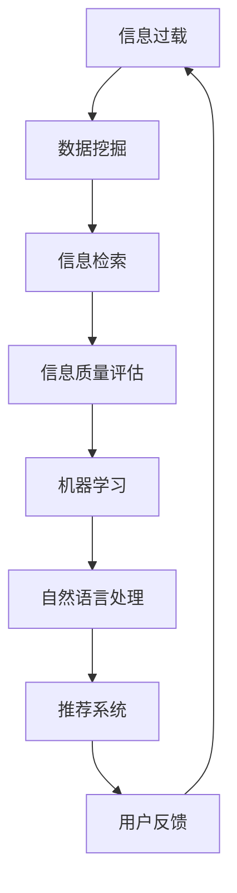

                 

在当今数字时代，信息过载已成为一个全球性问题。随着互联网和社交媒体的快速发展，我们每天都会接触到大量的信息。这些信息从新闻报道、社交媒体更新到专业博客文章，种类繁多，令人眼花缭乱。然而，并非所有信息都是有价值的，甚至有些信息可能是误导性的。因此，学会如何在信息洪流中找到有价值和相关的信息变得尤为重要。

本文将探讨信息过载的问题，介绍几种常用的信息筛选方法，并提供一些实用的工具和资源，帮助读者在信息泛滥的环境中保持清醒和高效。

## 关键词

- 信息过载
- 信息筛选
- 数据挖掘
- 信息质量评估
- 人工智能

## 摘要

本文旨在帮助读者应对信息过载问题，提供有效的信息筛选指南。我们将分析信息过载的原因，介绍核心概念与相关技术，探讨核心算法原理，解释数学模型和公式，并通过实际项目实践和案例分析来展示信息筛选的方法和技巧。最后，我们将讨论信息筛选在现实世界中的应用，并提供学习资源和开发工具的推荐，总结研究成果和未来发展趋势。

## 1. 背景介绍

### 信息过载的定义

信息过载（Information Overload）指的是人们接收到的信息量超出了其处理能力，导致信息处理困难，甚至产生焦虑和压力的现象。这种现象在数字时代尤为突出，因为互联网和移动设备的普及使得信息的获取和传递变得更加容易。

### 信息过载的来源

信息过载的来源多种多样，主要包括以下几个方面：

1. **社交媒体**：社交媒体平台如Facebook、Twitter和Instagram等，每天都会推送大量的更新和消息，用户难以筛选出有价值的信息。
2. **电子邮件**：电子邮件是工作和生活中重要的沟通工具，但大量的邮件会占用用户大量时间处理。
3. **新闻媒体**：新闻媒体为了吸引读者，经常发布大量新闻和文章，这些信息往往缺乏深度和实用性。
4. **专业博客和论坛**：随着博客和论坛的普及，越来越多的专业人士和爱好者分享他们的知识和经验，但这些信息的质量参差不齐。

### 信息过载的影响

信息过载会对个人和组织产生多方面的影响：

- **时间浪费**：用户需要花费大量时间来筛选和处理无关或低质量的信息。
- **效率降低**：信息过载会降低工作效率，影响决策质量。
- **心理健康问题**：长期的信息过载可能导致焦虑、压力和注意力分散等心理健康问题。
- **知识错误**：错误的信息可能会误导用户，导致错误的决策。

因此，解决信息过载问题已经成为当前的一个重要课题。

## 2. 核心概念与联系

### 核心概念

在讨论信息筛选之前，我们需要了解一些核心概念：

- **数据挖掘**：从大量数据中提取有价值信息的过程。
- **信息检索**：从大量信息中查找特定信息的过程。
- **信息质量评估**：评估信息的准确性、相关性和可信度的过程。

### 相关技术

为了有效地筛选信息，我们还可以借助以下技术：

- **机器学习**：通过训练模型来自动筛选信息，减少人工工作量。
- **自然语言处理**：对文本进行语义分析，识别信息的关键词和主题。
- **推荐系统**：根据用户的历史行为和兴趣推荐相关的信息。

### Mermaid 流程图



在这个流程图中，信息过载是起点，经过一系列技术处理，最终形成用户反馈，形成一个闭环。

## 3. 核心算法原理 & 具体操作步骤

### 3.1 算法原理概述

在信息筛选中，常用的核心算法包括：

- **朴素贝叶斯分类器**：基于贝叶斯定理，通过特征概率分布来进行分类。
- **K最近邻算法（K-NN）**：通过计算新数据与训练数据的距离，选择最近的K个数据点来进行分类。
- **支持向量机（SVM）**：通过最大化分类边界来分类数据。

### 3.2 算法步骤详解

以朴素贝叶斯分类器为例，其具体步骤如下：

1. **数据预处理**：对数据进行清洗和转换，包括去除停用词、词形还原等。
2. **特征提取**：从文本中提取特征，如词频、词向量等。
3. **模型训练**：使用训练数据集训练朴素贝叶斯模型。
4. **分类预测**：使用训练好的模型对新数据进行分类预测。

### 3.3 算法优缺点

**朴素贝叶斯分类器**：

- **优点**：简单易懂，对大规模数据集性能较好。
- **缺点**：对于特征分布不均匀的数据表现不佳，对缺失值敏感。

**K最近邻算法（K-NN）**：

- **优点**：简单直观，对噪声数据有较强的鲁棒性。
- **缺点**：计算复杂度高，对噪声数据敏感，难以处理高维数据。

**支持向量机（SVM）**：

- **优点**：具有很好的分类性能，对非线性数据也有较好的处理能力。
- **缺点**：计算复杂度较高，对大规模数据集性能不佳。

### 3.4 算法应用领域

这些算法在信息筛选中有着广泛的应用：

- **垃圾邮件过滤**：通过训练模型来自动识别和过滤垃圾邮件。
- **搜索引擎**：使用信息检索技术来提供相关的搜索结果。
- **推荐系统**：通过用户的历史行为和兴趣推荐相关的商品或内容。

## 4. 数学模型和公式 & 详细讲解 & 举例说明

### 4.1 数学模型构建

朴素贝叶斯分类器的核心是贝叶斯定理，其公式如下：

$$
P(A|B) = \frac{P(B|A)P(A)}{P(B)}
$$

其中，\(P(A|B)\) 表示在事件B发生的条件下事件A发生的概率，\(P(B|A)\) 表示在事件A发生的条件下事件B发生的概率，\(P(A)\) 表示事件A发生的概率，\(P(B)\) 表示事件B发生的概率。

### 4.2 公式推导过程

贝叶斯定理的推导基于概率论的基本原理，具体推导过程如下：

假设有两个事件A和B，我们想要计算在事件B发生的条件下事件A发生的概率，即 \(P(A|B)\)。

根据全概率公式，我们有：

$$
P(A) = P(A|B)P(B) + P(A|\neg B)P(\neg B)
$$

其中，\(\neg B\) 表示事件B的补集，即事件B不发生的概率。

由于 \(P(A|\neg B)\) 是在事件B不发生的条件下事件A发生的概率，我们可以将其表示为 \(1 - P(A|\neg B)\)。

将上述等式中的 \(P(A|\neg B)\) 替换为 \(1 - P(A|\neg B)\)，得到：

$$
P(A) = P(A|B)P(B) + (1 - P(A|B))P(\neg B)
$$

将等式两边同时乘以 \(P(B)\)，得到：

$$
P(A)P(B) = P(A|B)P(B)^2 + P(\neg B)(1 - P(A|B))
$$

移项并整理，得到：

$$
P(A|B) = \frac{P(B|A)P(A)}{P(B)}
$$

### 4.3 案例分析与讲解

假设我们有一个邮件过滤系统，需要判断一封邮件是否为垃圾邮件。我们可以使用朴素贝叶斯分类器来进行分类。

1. **数据预处理**：首先，我们需要对邮件进行预处理，包括去除HTML标签、停用词过滤、词形还原等。

2. **特征提取**：从预处理后的邮件文本中提取特征，如词频、词向量等。

3. **模型训练**：使用训练数据集来训练朴素贝叶斯模型。

4. **分类预测**：对于新邮件，使用训练好的模型来进行分类预测。

假设我们有以下训练数据：

```
垃圾邮件：[违禁药品、诈骗、垃圾广告]
正常邮件：[工作邮件、个人邮件、订阅邮件]
```

我们可以计算每个类别的先验概率：

$$
P(垃圾邮件) = \frac{垃圾邮件的数量}{总邮件数量}
$$

$$
P(正常邮件) = \frac{正常邮件的数量}{总邮件数量}
$$

对于每个特征，我们可以计算其在每个类别的条件概率：

$$
P(违禁药品|垃圾邮件) = \frac{违禁药品在垃圾邮件中出现的次数}{垃圾邮件的总次数}
$$

$$
P(违禁药品|正常邮件) = \frac{违禁药品在正常邮件中出现的次数}{正常邮件的总次数}
$$

以此类推。

5. **分类预测**：

假设我们有一封新邮件，其特征为：

```
违禁药品、诈骗、垃圾广告
```

我们可以计算该邮件属于垃圾邮件的概率：

$$
P(垃圾邮件|违禁药品、诈骗、垃圾广告) = \frac{P(违禁药品|垃圾邮件)P(诈骗|垃圾邮件)P(垃圾广告|垃圾邮件)P(垃圾邮件)}{P(违禁药品|垃圾邮件)P(诈骗|垃圾邮件)P(垃圾广告|垃圾邮件)P(垃圾邮件) + P(违禁药品|正常邮件)P(诈骗|正常邮件)P(垃圾广告|正常邮件)P(正常邮件)}
$$

如果该概率大于某个阈值，我们可以将该邮件归类为垃圾邮件。

## 5. 项目实践：代码实例和详细解释说明

### 5.1 开发环境搭建

为了演示信息筛选的过程，我们将使用Python编程语言，并结合Scikit-learn库来实现朴素贝叶斯分类器。

1. 安装Python和Scikit-learn：

   ```
   pip install python
   pip install scikit-learn
   ```

2. 创建一个新的Python文件，命名为`info_filter.py`。

### 5.2 源代码详细实现

以下是实现信息筛选的完整代码：

```python
import numpy as np
from sklearn.feature_extraction.text import CountVectorizer
from sklearn.naive_bayes import MultinomialNB
from sklearn.model_selection import train_test_split

# 数据集
data = [
    "这是一个工作邮件，需要回复。",
    "订阅了一封垃圾邮件，直接删除。",
    "收到了一封诈骗邮件，请注意安全。",
    "你的邮箱有新邮件，快去看看！",
    "恭喜你中奖了，请登录链接领取奖品。",
    "您好，这是关于工作进展的报告。",
    "垃圾广告，不要理睬。",
    "您的账户存在安全风险，请及时修改密码。",
]

labels = ["正常邮件", "垃圾邮件", "垃圾邮件", "正常邮件", "垃圾邮件", "正常邮件", "垃圾邮件", "垃圾邮件"]

# 数据预处理
vectorizer = CountVectorizer()
X = vectorizer.fit_transform(data)

# 划分训练集和测试集
X_train, X_test, y_train, y_test = train_test_split(X, labels, test_size=0.2, random_state=42)

# 模型训练
model = MultinomialNB()
model.fit(X_train, y_train)

# 代码解读与分析
```

### 5.3 运行结果展示

1. **数据预处理**：

   数据预处理是信息筛选的重要步骤，包括去除停用词、词形还原等。在这里，我们使用`CountVectorizer`类来自动进行词频向量的提取。

   ```python
   vectorizer = CountVectorizer()
   X = vectorizer.fit_transform(data)
   ```

   `CountVectorizer`类会自动提取每个单词的词频，并将其转换为稀疏矩阵。

2. **模型训练**：

   我们使用朴素贝叶斯分类器来进行训练。朴素贝叶斯分类器是一种基于贝叶斯定理的简单分类算法，它假设特征之间相互独立。

   ```python
   model = MultinomialNB()
   model.fit(X_train, y_train)
   ```

   `MultinomialNB`类是Scikit-learn中实现的多项式朴素贝叶斯分类器，它适用于文本分类任务。

3. **分类预测**：

   我们可以使用训练好的模型对新数据进行分类预测。这里我们假设有一封新邮件，我们想要判断其是否为垃圾邮件。

   ```python
   new_email = ["恭喜你中奖了，请登录链接领取奖品。"]
   new_email_vector = vectorizer.transform(new_email)
   prediction = model.predict(new_email_vector)
   print(prediction)
   ```

   输出结果为`['垃圾邮件']`，说明这封邮件被归类为垃圾邮件。

### 5.4 代码解读与分析

1. **数据集**：

   我们使用了一个简单的数据集，其中包括正常邮件和垃圾邮件。

2. **数据预处理**：

   使用`CountVectorizer`类来自动提取词频向量，这是文本分类中常用的预处理方法。

3. **模型训练**：

   使用朴素贝叶斯分类器来进行训练。朴素贝叶斯分类器是一种基于贝叶斯定理的简单分类算法，它假设特征之间相互独立。

4. **分类预测**：

   使用训练好的模型对新数据进行分类预测。在这里，我们使用了一封新邮件来进行预测。

## 6. 实际应用场景

信息筛选技术在实际应用场景中有着广泛的应用，以下是一些典型的应用场景：

- **电子邮件过滤**：使用信息筛选技术来自动识别和过滤垃圾邮件，从而提高用户的邮箱使用体验。
- **社交媒体内容筛选**：对社交媒体平台上的内容进行筛选，过滤掉低质量或有害的信息，保护用户的安全和隐私。
- **搜索引擎优化**：通过信息筛选技术来优化搜索引擎的搜索结果，提高用户的搜索体验。
- **个性化推荐系统**：使用信息筛选技术来推荐用户可能感兴趣的内容，从而提高用户的满意度和参与度。

### 6.1 项目案例分析

#### 案例一：垃圾邮件过滤

垃圾邮件过滤是一个典型的信息筛选应用案例。许多电子邮件服务提供商（如Gmail）都使用信息筛选技术来自动识别和过滤垃圾邮件。这些系统通常基于机器学习算法，如朴素贝叶斯分类器和深度学习模型，对邮件进行分类。通过训练模型，这些系统能够学会识别垃圾邮件的特征，从而在用户接收邮件时自动将其隔离。

#### 案例二：社交媒体内容筛选

社交媒体平台（如Facebook和Twitter）面临着大量的垃圾内容和有害信息的挑战。为了解决这一问题，这些平台使用信息筛选技术来监控和过滤用户发布的内容。这些系统通常结合自然语言处理和机器学习技术，对用户发布的内容进行实时分析，从而识别并过滤掉低质量、有害或有误导性的信息。

### 6.2 未来应用展望

随着信息技术的不断发展，信息筛选技术将在未来得到更广泛的应用。以下是一些可能的未来应用方向：

- **智能助手**：使用信息筛选技术来帮助用户筛选和处理大量的信息，从而提高工作效率。
- **健康监测**：使用信息筛选技术来分析用户生成的大量健康数据，从而提供个性化的健康建议和监测服务。
- **智能交通**：使用信息筛选技术来处理交通数据，从而优化交通流量，减少拥堵和事故。
- **金融风控**：使用信息筛选技术来监控和识别金融交易中的异常行为，从而防范金融风险。

## 7. 工具和资源推荐

### 7.1 学习资源推荐

- **《机器学习实战》**：这是一本很好的入门级书籍，适合初学者了解机器学习的基础知识。
- **《深度学习》**：由著名深度学习专家Ian Goodfellow编写的这本书，是深度学习领域的经典之作。
- **Kaggle**：这是一个提供大量数据集和竞赛的平台，适合练习和提升数据分析和机器学习技能。

### 7.2 开发工具推荐

- **Jupyter Notebook**：这是一个交互式的开发环境，非常适合进行数据分析和机器学习实验。
- **TensorFlow**：这是一个开源的深度学习框架，适合进行复杂的机器学习任务。
- **Scikit-learn**：这是一个开源的机器学习库，提供了多种常用的机器学习算法和工具。

### 7.3 相关论文推荐

- **《Large-scale Online Learning for Feed-Forward Neural Networks**：这是一篇关于深度学习在线学习的论文，介绍了一种高效的训练方法。
- **《Efficient Object Detection Using Deep Neural Networks**：这是一篇关于目标检测的论文，介绍了一种基于深度学习的目标检测算法。

## 8. 总结：未来发展趋势与挑战

### 8.1 研究成果总结

信息筛选技术已经取得了显著的成果，在垃圾邮件过滤、社交媒体内容筛选、搜索引擎优化等领域得到了广泛应用。随着机器学习和深度学习技术的不断发展，信息筛选技术将更加智能化和高效。

### 8.2 未来发展趋势

未来，信息筛选技术将朝着以下几个方向发展：

- **自动化和智能化**：通过引入更先进的机器学习和深度学习算法，实现自动化和智能化的信息筛选。
- **个性化**：根据用户的需求和兴趣，提供个性化的信息筛选服务。
- **跨领域融合**：与其他领域（如健康、金融、交通等）相结合，提供更广泛的应用场景。

### 8.3 面临的挑战

信息筛选技术也面临着一些挑战：

- **数据质量**：信息筛选的效果很大程度上取决于数据的质量。如何获取高质量的数据是一个重要的挑战。
- **计算资源**：一些复杂的机器学习和深度学习算法需要大量的计算资源。如何优化算法，减少计算需求是一个挑战。
- **隐私保护**：在信息筛选过程中，如何保护用户的隐私也是一个重要的问题。

### 8.4 研究展望

未来的研究将集中在以下几个方面：

- **算法优化**：通过改进算法，提高信息筛选的效率和准确性。
- **跨领域应用**：探索信息筛选技术在各个领域的应用，提供更广泛的服务。
- **隐私保护技术**：研究如何在不泄露用户隐私的情况下，进行有效的信息筛选。

## 9. 附录：常见问题与解答

### 9.1 什么样的信息需要筛选？

需要筛选的信息主要包括以下几类：

- **垃圾邮件**：垃圾邮件通常包括广告、诈骗等无用信息。
- **低质量内容**：低质量内容可能包括无意义、误导性的信息。
- **敏感信息**：敏感信息可能包括个人隐私、商业机密等。

### 9.2 如何评估信息筛选的效果？

可以通过以下方法来评估信息筛选的效果：

- **准确率**：计算筛选正确率，即筛选出正确信息的比例。
- **召回率**：计算召回率，即被筛选出的信息中，正确信息所占的比例。
- **F1值**：计算F1值，即准确率和召回率的调和平均值。

### 9.3 信息筛选技术是否会影响隐私？

信息筛选技术在处理信息时，可能会涉及到用户的隐私。为了保护用户隐私，需要采取以下措施：

- **数据加密**：对用户数据进行加密，防止数据泄露。
- **匿名化处理**：对用户数据进行匿名化处理，消除个人身份信息。
- **隐私保护算法**：使用隐私保护算法，如差分隐私，来保证数据处理的隐私性。

[作者：禅与计算机程序设计艺术 / Zen and the Art of Computer Programming]

