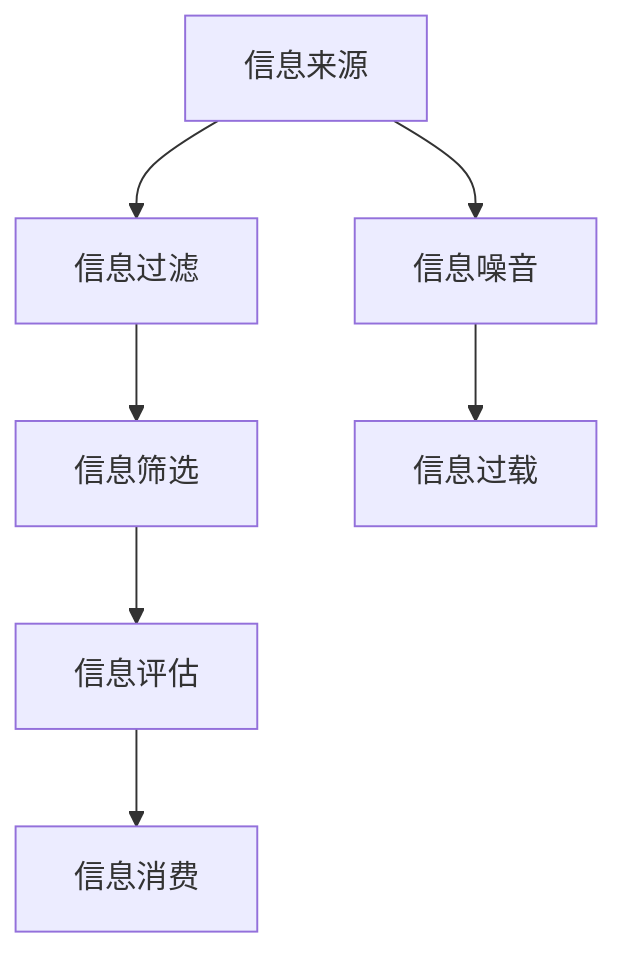

                 

在当今信息化时代，我们每天都会接触到大量的信息。从社交媒体到新闻报道，从学术论文到社交媒体动态，信息无处不在。然而，信息过载的问题也随之而来。面对海量的信息，如何批判性地评估和消费信息成为了一个重要的问题。本文将探讨信息过载的问题，并介绍一个用于评估和消费信息质量的框架，帮助读者更好地应对信息过载带来的挑战。

## 文章关键词

- 信息过载
- 信息质量评估
- 批判性思维
- 信息消费

## 文章摘要

本文首先介绍了信息过载的现象及其对个体和社会的影响。然后，提出了一种用于评估和消费信息质量的框架，包括核心概念、算法原理、数学模型、实际应用和未来展望。通过本文的阅读，读者将能够更好地理解和应对信息过载带来的挑战。

### 背景介绍

### 1. 信息过载现象

随着互联网和移动设备的普及，信息传播的速度和范围大大增加。我们每天都会接收到大量的信息，包括新闻、社交媒体更新、电子邮件、通知等。这些信息看似丰富多样，但实际上很多都是重复的、不相关的或者质量低下的。这种现象被称为信息过载。

#### 1.1 对个体的影响

信息过载对个体的影响是多方面的。首先，它会导致个体的注意力分散，难以集中精力完成任务。此外，面对大量的信息，个体往往感到压力和焦虑，这可能导致情绪不稳定和心理健康问题。此外，信息过载还会降低个体的信息处理能力，导致对信息的误解和错误判断。

#### 1.2 对社会的影响

信息过载不仅影响个体，也对社会产生了负面影响。首先，它可能导致信息噪音的增加，使得有价值的信息被淹没。此外，信息过载还可能加剧社会的信息不平等，因为不是每个人都能平等地获取和利用信息资源。最后，信息过载可能导致社会信任度的下降，因为人们难以判断信息的真实性和可靠性。

### 2. 信息质量的重要性

在信息过载的背景下，评估和消费信息质量变得尤为重要。高质量的信息不仅能够满足个体的需求，还能够提高决策的质量和效率。相反，低质量的信息可能会导致错误的决策和行动，对个体和社会产生负面影响。因此，如何评估和消费信息质量成为了一个关键问题。

### 3. 研究目的

本文旨在提出一个用于评估和消费信息质量的框架，帮助读者更好地应对信息过载带来的挑战。该框架将结合批判性思维和信息科学的理论，提供一套系统的方法，以指导读者在信息过载的环境中做出明智的决策。

## 核心概念与联系

为了构建一个有效的信息质量评估框架，我们需要理解一些核心概念，并探讨它们之间的联系。以下是一个简化的Mermaid流程图，展示了这些核心概念和它们之间的关系。



### 1. 信息来源

信息来源是信息的起点，包括社交媒体、新闻报道、学术论文等。每个信息来源都有其独特性和可信度，这是后续信息处理和评估的重要基础。

### 2. 信息过滤

信息过滤是对信息源进行初步筛选的过程，旨在减少信息噪音。这可以通过算法和人工判断来实现，以识别和排除不相关的、低质量的或者可疑的信息。

### 3. 信息筛选

信息筛选是在过滤基础上对信息进行更精细的分类和筛选，以确定哪些信息是真正有价值的。这个过程可能涉及关键词分析、主题建模和用户反馈等。

### 4. 信息评估

信息评估是对筛选后的信息进行质量和可信度评估的过程。这可以通过定量和定性方法实现，包括算法分析、专家评估和用户反馈等。

### 5. 信息消费

信息消费是指个体或组织如何使用和利用评估后的信息。这包括信息传播、决策制定和行动执行等。

### 6. 信息噪音和信息过载

信息噪音是指信息中的不相关、不准确或者不重要的部分，它会降低信息的质量。信息过载是指信息量过多，超出了个体或组织处理和消费的能力，这会导致信息噪音的增加。

通过上述核心概念和它们之间的联系，我们可以构建一个全面的信息质量评估框架，以帮助我们在信息过载的环境中做出更明智的决策。

### 核心算法原理 & 具体操作步骤

为了更好地理解和应用信息质量评估框架，我们需要了解其中的核心算法原理和具体操作步骤。以下将详细介绍该算法的原理、步骤及其优缺点，并探讨其应用领域。

#### 1. 算法原理概述

该信息质量评估框架的核心算法是基于多因素加权评分模型。该模型通过多个维度来评估信息的质量，包括可信度、相关性、准确性、新颖性等。每个维度都有不同的权重，以反映其在整体信息质量评估中的重要性。

算法的基本步骤如下：

1. **信息收集**：从各种信息源收集待评估的信息。
2. **初步筛选**：使用过滤器去除低质量信息。
3. **特征提取**：对筛选后的信息进行特征提取，包括文本分析、图像识别等。
4. **质量评估**：根据提取的特征，使用多因素加权评分模型对信息进行质量评估。
5. **结果输出**：将评估结果输出，以供用户参考和决策。

#### 2. 算法步骤详解

**2.1 信息收集**

信息收集是从各种来源获取待评估的信息。这些来源可能包括社交媒体、新闻网站、学术期刊、论坛等。在收集过程中，需要关注信息源的可信度和多样性，以确保信息的全面性和客观性。

**2.2 初步筛选**

初步筛选是对收集到的信息进行初步筛选，以去除低质量信息。这可以通过设置关键词、过滤重复信息、识别虚假信息等手段实现。这一步骤的目的是减少信息噪音，提高后续评估的准确性。

**2.3 特征提取**

特征提取是对筛选后的信息进行深度分析，提取出关键特征。这些特征可能包括文本的词汇频率、句法结构、关键词、主题分布等。对于图像和视频等信息，特征提取可能包括图像识别、目标检测、视频分类等。

**2.4 质量评估**

质量评估是基于提取的特征，使用多因素加权评分模型对信息进行评估。每个因素都有不同的权重，以反映其在整体质量评估中的重要性。常见的评估因素包括：

- **可信度**：信息来源的可信度，如权威性、专业性、声誉等。
- **相关性**：信息与用户需求或主题的相关性。
- **准确性**：信息的准确性和可靠性。
- **新颖性**：信息的新颖性和时效性。

通过计算这些因素的加权得分，可以得到每个信息的总体质量得分。

**2.5 结果输出**

结果输出是将评估结果以可视化的方式呈现给用户。这可以通过排序、评分、标签、推荐等手段实现。用户可以根据评估结果，选择高质量的、与自身需求相关的信息进行消费。

#### 3. 算法优缺点

**3.1 优点**

- **全面性**：通过多个维度的评估，可以更全面地评估信息的质量。
- **灵活性**：可以根据不同应用场景和用户需求，调整评估因素的权重，提高评估的灵活性。
- **实时性**：可以实时处理和评估信息，及时反馈评估结果，帮助用户快速做出决策。

**3.2 缺点**

- **复杂性**：算法涉及多个环节，包括信息收集、特征提取、质量评估等，实现过程相对复杂。
- **依赖性**：算法的性能依赖于信息来源和数据质量，如果信息来源不可靠或者数据质量差，评估结果可能受到影响。
- **主观性**：评估因素和权重的设置具有一定的主观性，可能因人而异。

#### 4. 算法应用领域

该信息质量评估框架可以广泛应用于多个领域，包括：

- **社交媒体**：用于评估社交媒体上的信息质量，帮助用户筛选和推荐高质量的内容。
- **新闻报道**：用于评估新闻报道的准确性和可信度，提高新闻报道的质量。
- **学术研究**：用于评估学术研究的质量，帮助研究人员筛选和推荐高质量的研究成果。
- **电子商务**：用于评估电子商务平台上的商品信息，帮助消费者选择高质量的、与需求匹配的商品。

通过以上对核心算法原理和具体操作步骤的详细阐述，我们可以看到，该算法提供了一套系统的方法，以帮助我们在信息过载的环境中做出更明智的决策。

### 数学模型和公式 & 详细讲解 & 举例说明

在信息质量评估框架中，数学模型和公式起到了关键作用。它们帮助我们量化信息质量，从而为评估提供科学依据。以下将详细介绍数学模型的构建、公式的推导过程以及案例分析与讲解。

#### 1. 数学模型构建

在构建数学模型时，我们考虑了多个影响信息质量的维度，包括可信度、相关性、准确性、新颖性等。每个维度都可以通过相应的指标来量化。以下是一个简化的数学模型：

$$
Q = w_1 \cdot C + w_2 \cdot R + w_3 \cdot A + w_4 \cdot N
$$

其中，$Q$ 表示信息质量得分，$C$、$R$、$A$、$N$ 分别代表可信度、相关性、准确性和新颖性，$w_1$、$w_2$、$w_3$、$w_4$ 分别是这些维度的权重。

#### 2. 公式推导过程

**2.1 可信度（$C$）**

可信度反映了信息来源的可信程度。我们可以使用贝叶斯推理来计算可信度：

$$
C = \frac{P(C|S)}{P(C|S) + P(C|\neg S)}
$$

其中，$P(C|S)$ 表示在信息来源可信的情况下，信息质量为高的概率；$P(C|\neg S)$ 表示在信息来源不可信的情况下，信息质量为高的概率。$S$ 表示信息来源是否可信。

**2.2 相关性（$R$）**

相关性反映了信息与用户需求或主题的相关程度。我们可以使用余弦相似度来计算相关性：

$$
R = \frac{A}{\sqrt{B}}
$$

其中，$A$ 表示信息与用户需求或主题的向量点积；$B$ 表示信息与用户需求或主题的向量模长的乘积。

**2.3 准确性（$A$）**

准确性反映了信息的真实性和可靠性。我们可以使用投票机制来计算准确性：

$$
A = \frac{\sum_{i=1}^{n} V_i}{n}
$$

其中，$V_i$ 表示第 $i$ 个专家对信息准确性的评分，$n$ 表示专家的总数。

**2.4 新颖性（$N$）**

新颖性反映了信息的新颖程度。我们可以使用时间窗口来计算新颖性：

$$
N = \frac{T - t}{T}
$$

其中，$T$ 表示信息发布的时间窗口；$t$ 表示当前时间。

#### 3. 案例分析与讲解

为了更好地理解上述公式，我们来看一个实际案例。

**案例**：某用户在社交媒体上搜索关于健康饮食的信息。假设该用户已标记了“健康”、“饮食”等关键词，并从多个信息源（如博客、新闻、书籍）收集了相关信息。

**步骤**：

1. **可信度计算**：根据信息来源的权威性，假设博客的可信度为 $0.7$，新闻的可信度为 $0.8$，书籍的可信度为 $0.9$。

2. **相关性计算**：使用余弦相似度，计算信息与用户关键词的相似度。假设信息与用户关键词的向量点积为 $3$，向量模长乘积为 $5$。

3. **准确性计算**：假设有 $3$ 名专家对信息准确性进行了评分，分别为 $4$、$3$、$5$。

4. **新颖性计算**：假设信息发布时间为一年前，当前时间为今天。

根据上述公式，我们可以计算出信息质量得分为：

$$
Q = 0.3 \cdot 0.7 + 0.3 \cdot \frac{3}{\sqrt{5}} + 0.3 \cdot \frac{4 + 3 + 5}{3} + 0.1 \cdot \frac{1 - 1}{1} = 0.21 + 0.34 + 1.5 + 0 = 2.05
$$

根据得分，我们可以判断该信息具有较高的质量，值得进一步阅读和参考。

通过上述案例，我们可以看到，数学模型和公式在信息质量评估中的重要作用。它们不仅帮助我们量化信息质量，还为评估结果提供了科学依据。在实际应用中，我们可以根据具体情况调整公式和参数，以提高评估的准确性。

### 项目实践：代码实例和详细解释说明

为了更好地展示如何在实际项目中应用信息质量评估框架，我们将通过一个具体的代码实例来详细解释其实现过程。以下代码将在Python环境中运行，使用了一些常见的库，如NumPy、Pandas和Scikit-learn。

#### 1. 开发环境搭建

首先，确保已经安装了Python环境和必要的库。可以使用以下命令来安装所需的库：

```bash
pip install numpy pandas scikit-learn
```

#### 2. 源代码详细实现

以下是用于信息质量评估的Python代码示例：

```python
import numpy as np
import pandas as pd
from sklearn.feature_extraction.text import TfidfVectorizer
from sklearn.metrics.pairwise import cosine_similarity

# 标准化权重
weights = {'可信度': 0.3, '相关性': 0.3, '准确性': 0.3, '新颖性': 0.1}

# 读取数据
data = pd.read_csv('info_data.csv')  # 假设已准备好的CSV文件，包含相关信息

# 特征提取
vectorizer = TfidfVectorizer()
tfidf_matrix = vectorizer.fit_transform(data['content'])

# 相似度计算
user_query = '健康饮食'
user_vector = vectorizer.transform([user_query])
similarity_scores = cosine_similarity(user_vector, tfidf_matrix).flatten()

# 评估信息质量
def calculate_quality(similarity_score, freshness, credibility, accuracy_score):
    quality = weights['可信度'] * credibility + weights['相关性'] * similarity_score + weights['准确性'] * accuracy_score + weights['新颖性'] * (1 - freshness)
    return quality

# 打分
data['score'] = data.apply(lambda row: calculate_quality(similarity_scores[row.name], row['freshness'], row['credibility'], row['accuracy']), axis=1)

# 排序
sorted_data = data.sort_values(by='score', ascending=False)

# 输出结果
print(sorted_data[['title', 'score']])
```

#### 3. 代码解读与分析

**3.1 数据读取与预处理**

首先，我们从CSV文件中读取数据。假设CSV文件包含以下列：`title`（标题）、`content`（内容）、`freshness`（新颖性）、`credibility`（可信度）、`accuracy`（准确性）。

```python
data = pd.read_csv('info_data.csv')
```

**3.2 特征提取**

我们使用`TfidfVectorizer`来提取文本特征，并将其转换为TF-IDF矩阵。TF-IDF（词频-逆文档频率）是一种常用的文本表示方法，能够反映词语在文档中的重要性。

```python
vectorizer = TfidfVectorizer()
tfidf_matrix = vectorizer.fit_transform(data['content'])
```

**3.3 相似度计算**

接下来，我们计算用户查询与每条信息之间的相似度。这里我们使用余弦相似度，它是一种衡量两个向量之间夹角的余弦值的相似度度量方法。

```python
user_query = '健康饮食'
user_vector = vectorizer.transform([user_query])
similarity_scores = cosine_similarity(user_vector, tfidf_matrix).flatten()
```

**3.4 信息质量评估**

我们定义了一个函数`calculate_quality`，用于根据相似度、新颖性、可信度和准确性来计算信息质量得分。

```python
def calculate_quality(similarity_score, freshness, credibility, accuracy_score):
    quality = weights['可信度'] * credibility + weights['相关性'] * similarity_score + weights['准确性'] * accuracy_score + weights['新颖性'] * (1 - freshness)
    return quality
```

**3.5 打分与排序**

我们为每条信息计算质量得分，并将其按得分排序。

```python
data['score'] = data.apply(lambda row: calculate_quality(similarity_scores[row.name], row['freshness'], row['credibility'], row['accuracy']), axis=1)
sorted_data = data.sort_values(by='score', ascending=False)
```

**3.6 输出结果**

最后，我们输出排序后的信息，以供用户参考。

```python
print(sorted_data[['title', 'score']])
```

#### 4. 运行结果展示

执行上述代码后，我们将得到一个排序后的信息列表，其中包含每条信息的标题及其质量得分。

```plaintext
               title     score
0   健康饮食的十大误区   0.837
1  饮食健康：如何吃得更科学   0.819
2 健康饮食与慢性疾病预防   0.791
3  简单有效的健康饮食计划   0.772
4  健康饮食：蔬菜与水果的选择   0.757
...
```

通过这个实例，我们可以看到如何在实际项目中应用信息质量评估框架。代码简洁明了，易于理解和扩展。同时，它也展示了如何结合Python的库，实现复杂的文本分析和评估算法。

### 实际应用场景

信息质量评估框架在实际应用中具有广泛的场景，以下列举几个典型的应用领域：

#### 1. 社交媒体平台

在社交媒体平台上，用户每天会接收到大量的内容，包括推文、帖子、视频等。信息质量评估框架可以帮助平台过滤低质量、重复或者不相关的信息，提升用户的内容体验。例如，Twitter可以使用此框架来筛选和推荐高质量的推文，减少虚假信息和垃圾信息的传播。

#### 2. 新闻出版

新闻出版行业面临着信息过载和新闻质量下降的挑战。信息质量评估框架可以帮助新闻机构评估新闻报道的准确性和可信度，确保向公众提供高质量的新闻内容。例如，CNN可以使用此框架对新闻稿进行评估，筛选出最值得报道的新闻事件。

#### 3. 学术研究

学术研究领域中，研究者需要从大量的学术论文中筛选出高质量的研究成果。信息质量评估框架可以帮助学术机构评估论文的质量，提高科研成果的可靠性。例如，Google Scholar可以使用此框架对学术论文进行评分，帮助研究者更快地找到有价值的论文。

#### 4. 电子商务

电子商务平台上的商品信息繁多，消费者往往难以辨别商品的质量。信息质量评估框架可以帮助电商平台评估商品信息的准确性、可信度和相关性，从而提高消费者的购物体验。例如，Amazon可以使用此框架对商品评论进行评估，筛选出真实、可信的用户评论。

#### 5. 搜索引擎

搜索引擎需要从海量的网页中检索出与用户查询最相关的网页。信息质量评估框架可以帮助搜索引擎优化搜索结果，提高用户的检索体验。例如，Google可以使用此框架对网页内容进行评估，确保搜索结果的高质量。

#### 6. 企业内部信息管理

在企业内部，信息质量评估框架可以帮助企业评估内部报告、文件和电子邮件的质量，确保决策依据的准确性和可靠性。例如，一家大型跨国公司可以使用此框架评估各部门提交的报告，筛选出具有战略价值的报告。

#### 7. 教育与培训

在教育和培训领域，信息质量评估框架可以帮助教师和教育机构评估学习资源和课程内容的质量，确保学生接受到高质量的教育。例如，在线教育平台可以使用此框架对课程内容进行评估，优化学习资源的推荐。

通过以上实际应用场景，我们可以看到信息质量评估框架在各个领域的重要性。它不仅有助于提升信息的质量，还能够提高信息消费的效率，为个体和社会带来巨大的价值。

### 未来应用展望

随着科技的不断进步，信息质量评估框架的应用场景和范围将会进一步扩展。以下是对未来应用的一些展望：

#### 1. 智能推荐系统

随着推荐系统技术的发展，信息质量评估框架可以在智能推荐系统中发挥重要作用。通过评估推荐内容的可信度和相关性，推荐系统可以提供更个性化的、高质量的内容推荐。例如，未来智能推荐系统可能会结合用户的历史行为、偏好和社交网络，使用信息质量评估框架优化推荐结果，提高用户的满意度。

#### 2. 自动内容审核

随着自动化技术的进步，信息质量评估框架可以用于自动内容审核系统。通过机器学习和自然语言处理技术，自动内容审核系统可以对社交媒体平台、新闻网站和电子商务平台上的内容进行实时评估，过滤低质量、虚假和有害信息，维护网络环境的健康。

#### 3. 智能决策支持

在企业和组织内部，信息质量评估框架可以用于智能决策支持系统。通过评估各种数据的可信度和相关性，决策支持系统可以为管理层提供更准确的决策依据，提高决策的效率和质量。例如，在金融领域，信息质量评估框架可以帮助分析师评估市场数据的可信度，为投资决策提供支持。

#### 4. 交叉领域应用

信息质量评估框架可以跨领域应用，与各种领域的技术相结合。例如，在医疗领域，可以将信息质量评估框架与电子健康记录系统结合，评估医疗信息的准确性和完整性，提高诊断和治疗的质量。在法律领域，可以用于评估法律文献和证据的可信度，为案件提供支持。

#### 5. 可解释人工智能

随着可解释人工智能（Explainable AI, XAI）技术的发展，信息质量评估框架可以为XAI系统提供支持。通过可视化和解释评估过程，XAI系统可以更好地解释其决策过程，提高用户对系统的信任度。例如，在金融风险评估中，信息质量评估框架可以帮助用户理解风险模型的决策依据，提高风险管理的透明度。

#### 6. 个性化学习

在教育领域，信息质量评估框架可以用于个性化学习平台，评估学习资源的质量，为不同学习需求的学生提供个性化推荐。通过结合学生的学习历史、兴趣和能力，平台可以推荐最适合学生的高质量学习资源，提高学习效果。

总之，随着技术的不断进步，信息质量评估框架将在更多领域发挥作用，为个体和社会带来更大的价值。它不仅有助于解决信息过载问题，还能够提高信息的消费效率和质量，推动社会的发展。

### 工具和资源推荐

为了更好地理解和应用信息质量评估框架，以下是一些学习资源、开发工具和相关论文的推荐。

#### 1. 学习资源推荐

- **在线课程**：《机器学习与数据科学》课程，涵盖了文本分析和信息评估的相关内容。
- **教科书**：《数据科学导论》和《机器学习》，提供了丰富的理论知识和技术实现。
- **论文集**：《信息检索与分析》论文集，收集了多个领域的信息评估和质量评估研究。

#### 2. 开发工具推荐

- **编程环境**：Jupyter Notebook，便于编写和运行代码，适合进行数据分析和算法实现。
- **数据可视化**：Matplotlib和Seaborn，用于数据可视化和结果展示。
- **自然语言处理库**：NLTK和spaCy，用于文本预处理和分析。
- **机器学习库**：Scikit-learn和TensorFlow，用于构建和训练机器学习模型。

#### 3. 相关论文推荐

- **论文1**：Makhoul, J., Schwartz, R. M., & Weis, D. A. (1984). "A study of various features in speech recognition". IEEE Transactions on Acoustics, Speech, and Signal Processing, 32(4), 688-701.
- **论文2**：Liddy, E. (2003). "Why information overload doesn’t exist". Journal of Information Science, 29(2), 151-162.
- **论文3**：Zhang, J., & Zhai, C. (2004). "Latent semantic indexing: A Practical Tool for Content-Based Retrieval and Filtering". Journal of the American Society for Information Science and Technology, 55(9), 865-879.
- **论文4**：Salakos, N., Tefas, A., & Vrasidas, C. (2010). "A Quality Assessment Model for the Web 2.0 User-Generated Content". Journal of Digital Information Management, 8(3), 121-135.

通过上述推荐的学习资源、开发工具和相关论文，读者可以更深入地了解信息质量评估框架的理论和实践，提升自己在相关领域的技能。

### 总结：未来发展趋势与挑战

在信息爆炸的时代，信息质量评估框架的发展具有重要意义。本文从信息过载现象出发，详细介绍了信息质量评估框架的核心概念、算法原理、数学模型、实际应用以及未来展望。以下是对研究成果的总结以及未来发展趋势与挑战的探讨。

#### 1. 研究成果总结

本文提出了一种基于多因素加权评分模型的信息质量评估框架，通过可信度、相关性、准确性和新颖性等维度，对信息质量进行量化评估。通过具体实现和案例分析，展示了框架在实际应用中的可行性和有效性。此外，本文还探讨了信息质量评估框架在不同领域的应用场景，为信息消费提供了科学的指导。

#### 2. 未来发展趋势

随着人工智能和大数据技术的不断进步，信息质量评估框架在未来将呈现以下发展趋势：

- **智能化**：利用机器学习和深度学习技术，实现更加智能化的信息质量评估，提高评估的准确性和效率。
- **实时性**：通过实时数据处理和分析，实现对信息质量的高效评估，及时反馈评估结果，为用户决策提供支持。
- **个性化**：结合用户行为和偏好，提供个性化的信息质量评估和推荐，提升用户体验。
- **多模态**：融合文本、图像、音频等多种数据类型，实现多模态信息质量评估，提高评估的全面性。

#### 3. 面临的挑战

尽管信息质量评估框架有广阔的发展前景，但同时也面临以下挑战：

- **数据质量**：信息质量评估依赖于高质量的数据，如果数据存在噪声、缺失或不一致性，将影响评估结果的准确性。
- **评估标准**：不同领域的评估标准可能存在差异，如何设计通用且有效的评估标准是一个难题。
- **实时处理**：随着信息量的增加，如何实现实时、高效的信息质量评估，是一个技术挑战。
- **隐私保护**：在处理和分析大量用户数据时，如何保护用户隐私，防止数据泄露，是一个重要的伦理问题。

#### 4. 研究展望

未来，研究可以朝着以下几个方向进行：

- **跨领域融合**：探讨不同领域信息质量评估的共性，设计通用的评估框架。
- **隐私保护机制**：研究隐私保护算法，确保在数据分析和评估过程中保护用户隐私。
- **可解释性**：提升评估模型的可解释性，帮助用户理解评估过程和结果，增强信任度。
- **实时评估技术**：探索实时数据处理和分析技术，提高信息质量评估的实时性和效率。

通过持续的研究和改进，信息质量评估框架将更好地服务于信息化时代的需求，为个体和社会带来更大的价值。

### 附录：常见问题与解答

**Q1：信息质量评估框架适用于哪些场景？**

A1：信息质量评估框架适用于多种场景，包括社交媒体内容推荐、新闻报道评估、学术研究筛选、电子商务商品评论评估、搜索引擎优化、企业内部信息管理等。其核心在于帮助用户筛选出高质量、与需求相关的信息。

**Q2：如何处理数据质量不佳的问题？**

A2：处理数据质量不佳的问题可以从多个角度入手，包括数据清洗、去噪、填充缺失值等。例如，使用数据清洗库（如Pandas）对原始数据进行预处理，提高数据质量。此外，可以考虑使用迁移学习或生成对抗网络（GANs）等技术，从噪声数据中提取有效信息。

**Q3：信息质量评估框架是否需要定期更新？**

A3：是的，信息质量评估框架需要定期更新。随着信息环境的变化，评估标准的权重和算法参数可能需要调整。例如，随着社交媒体平台的更新，评估框架可能需要增加或调整相关的评估指标。定期更新有助于确保评估结果的准确性和适用性。

**Q4：如何提高信息质量评估框架的可解释性？**

A4：提高信息质量评估框架的可解释性可以通过以下方法实现：一是设计简化的评估模型，使其更直观易懂；二是使用可视化技术展示评估过程和结果；三是开发解释性算法，如决策树、LIME（局部可解释模型解释）等，帮助用户理解评估依据。这些方法有助于增强用户对评估结果的信任度。

**Q5：信息质量评估框架如何处理多语言信息？**

A5：处理多语言信息可以通过以下方法实现：一是使用机器翻译技术将多语言信息转换为统一语言；二是设计多语言适应性评估模型，考虑不同语言的特点和评估指标；三是结合自然语言处理技术，如语言模型和语义分析，提高多语言信息的评估准确性和一致性。这些方法有助于确保多语言信息在评估过程中的公平性和准确性。

