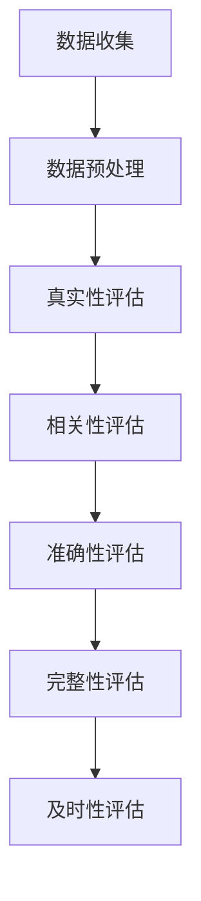

                 

摘要：
随着信息技术的飞速发展，我们面临着前所未有的信息过载挑战。本篇博客文章旨在探讨如何批判性地评估和消费信息。我们将从信息过载的背景出发，深入分析信息质量评估的重要性，并探讨相关的核心概念、算法原理、数学模型，以及项目实践中的代码实例。最后，我们将展望未来发展趋势与挑战，并提供相关的工具和资源推荐，以帮助读者更好地理解和应对信息过载问题。

## 1. 背景介绍

在数字化时代，信息无处不在。互联网、社交媒体、新闻媒体等渠道每天向我们传递海量信息。然而，这种信息爆炸现象也带来了严重的后果——信息过载。信息过载不仅增加了我们的认知负担，还可能导致我们无法有效地筛选和利用重要信息。因此，如何批判性地评估和消费信息成为了当今社会的重要课题。

### 信息过载的来源与影响

信息过载的来源多种多样。首先，互联网的普及和社交媒体的兴起使得信息传播速度大大加快，每个人都可以轻松地发布和获取信息。其次，自动化工具和算法推荐系统的应用使得信息个性化推送更加精准，但也导致了信息封闭和偏见的可能性。此外，新闻媒体为了吸引眼球，经常夸大事实或者发布虚假信息，进一步加剧了信息过载的问题。

信息过载的影响主要体现在以下几个方面：

1. **认知负担**：面对海量信息，我们很难有效地筛选和处理，导致认知负担增加，甚至产生“决策疲劳”。
2. **信息误解**：由于时间有限和注意力分散，我们往往无法对信息进行深入理解和批判性思考，容易产生误解。
3. **心理压力**：信息过载可能导致焦虑、压力和恐慌情绪，影响心理健康。
4. **社交影响**：信息过载可能使我们陷入信息孤岛，难以与他人建立深层次的交流和互动。

### 信息质量评估的重要性

在信息过载的背景下，信息质量评估显得尤为重要。高质量的信息可以帮助我们做出更好的决策，提高工作效率，甚至改善生活质量。相反，低质量的信息可能会误导我们，带来负面影响。因此，如何评估信息质量成为了关键问题。

信息质量评估的主要内容包括：

1. **真实性**：评估信息是否真实可信，避免虚假信息和谣言。
2. **相关性**：评估信息与我们需求和兴趣的相关性，避免无关信息的干扰。
3. **准确性**：评估信息的准确性，避免错误和误导。
4. **完整性**：评估信息的完整性，避免片面的信息。
5. **及时性**：评估信息的及时性，确保信息的新鲜度和时效性。

通过批判性地评估和消费信息，我们可以更好地应对信息过载带来的挑战，提高信息利用效率，促进个人和组织的健康发展。

## 2. 核心概念与联系

在深入探讨信息质量评估之前，我们需要理解几个核心概念，它们构成了信息质量评估的理论基础和实际操作框架。

### 2.1 信息质量评估的核心概念

#### 2.1.1 真实性

真实性是指信息是否与事实相符，是否来自可靠的来源。真实性的评估是信息质量评估中最基本的一环。虚假信息和谣言的泛滥使得真实性评估变得尤为重要。

#### 2.1.2 相关性

相关性是指信息与我们需求和兴趣的匹配程度。相关性的评估有助于我们筛选出对自己有用的信息，避免无关信息的干扰。

#### 2.1.3 准确性

准确性是指信息的精确性和可靠性。准确的信息能够帮助我们做出准确的判断和决策。

#### 2.1.4 完整性

完整性是指信息是否提供了所有必要的细节和背景。完整的信息有助于我们全面地理解和评估信息的真实性和准确性。

#### 2.1.5 及时性

及时性是指信息的更新速度和时效性。及时的信息能够帮助我们抓住机会或者应对紧急情况。

### 2.2 信息质量评估的流程与架构

#### 2.2.1 数据收集

数据收集是信息质量评估的基础。我们需要通过各种渠道收集相关的信息，包括互联网、数据库、社交媒体等。

#### 2.2.2 数据预处理

数据预处理包括数据的清洗、去重、格式转换等操作，以确保数据的准确性和一致性。

#### 2.2.3 真实性评估

真实性评估通过比对信息来源的可靠性、信息的历史记录和验证等方式，判断信息的真实性。

#### 2.2.4 相关性评估

相关性评估通过分析信息的主题、关键词和用户兴趣模型等，判断信息与用户需求的相关性。

#### 2.2.5 准确性评估

准确性评估通过专家评审、比对多源数据等方式，判断信息的准确性。

#### 2.2.6 完整性评估

完整性评估通过分析信息的完整性指标，如关键信息缺失率、信息完整性指数等，判断信息的完整性。

#### 2.2.7 及时性评估

及时性评估通过分析信息的发布时间、更新频率等指标，判断信息的及时性。

### 2.3 Mermaid 流程图

以下是一个简化的 Mermaid 流程图，展示了信息质量评估的核心概念和流程：



通过上述流程，我们可以系统地评估信息质量，从而批判性地消费信息，提高决策的准确性和效率。

## 3. 核心算法原理 & 具体操作步骤

在信息质量评估中，核心算法原理起着至关重要的作用。这些算法可以帮助我们自动化地评估信息的真实性、相关性、准确性、完整性和及时性。以下是这些算法的原理和具体操作步骤。

### 3.1 算法原理概述

#### 3.1.1 真实性评估算法

真实性评估算法主要通过以下几种方式实现：

1. **来源验证**：通过比对信息来源的可靠性，如权威媒体的报道、官方数据等，来判断信息的真实性。
2. **历史记录验证**：通过分析信息的历史记录，如同一信息在不同时间段的表述是否一致，来判断信息的真实性。
3. **多源比对**：通过比对多个来源的信息，来判断信息的真实性和一致性。

#### 3.1.2 相关性评估算法

相关性评估算法主要通过以下几种方式实现：

1. **关键词匹配**：通过分析信息的主题、关键词，与用户兴趣进行匹配，来判断信息的相关性。
2. **用户兴趣模型**：通过分析用户的浏览历史、搜索记录等，构建用户兴趣模型，从而判断信息的相关性。
3. **协同过滤**：通过分析用户的兴趣相似性，推荐与用户兴趣相关的高质量信息。

#### 3.1.3 准确性评估算法

准确性评估算法主要通过以下几种方式实现：

1. **专家评审**：通过专家的专业知识和判断，对信息进行评审，判断其准确性。
2. **多源比对**：通过比对多个来源的信息，来判断信息的准确性。
3. **事实核查**：通过事实核查工具，如数据源、历史记录等，来验证信息的准确性。

#### 3.1.4 完整性评估算法

完整性评估算法主要通过以下几种方式实现：

1. **关键信息提取**：通过提取信息中的关键信息，如日期、地点、事件等，来判断信息的完整性。
2. **完整性指标计算**：通过计算信息的完整性指标，如关键信息缺失率、信息完整性指数等，来判断信息的完整性。
3. **多源信息整合**：通过整合多个来源的信息，来提高信息的完整性。

#### 3.1.5 及时性评估算法

及时性评估算法主要通过以下几种方式实现：

1. **发布时间分析**：通过分析信息的发布时间，来判断其及时性。
2. **更新频率分析**：通过分析信息的更新频率，来判断其及时性。
3. **时效性评估**：通过分析信息的时效性指标，如事件发生时间与信息发布时间差等，来判断其及时性。

### 3.2 算法步骤详解

#### 3.2.1 真实性评估算法步骤

1. **数据收集**：从互联网、数据库、社交媒体等渠道收集信息。
2. **来源验证**：对每个信息来源进行可靠性评估，如比对权威媒体的认证、历史记录等。
3. **历史记录验证**：对同一信息的不同时间段的表述进行比对，判断是否一致。
4. **多源比对**：对多个来源的信息进行比对，判断其一致性和可靠性。

#### 3.2.2 相关性评估算法步骤

1. **关键词提取**：从信息中提取关键词。
2. **用户兴趣模型构建**：通过用户的浏览历史、搜索记录等，构建用户兴趣模型。
3. **关键词匹配**：将提取的关键词与用户兴趣模型进行匹配，判断信息的相关性。
4. **协同过滤**：通过分析用户的兴趣相似性，推荐相关的高质量信息。

#### 3.2.3 准确性评估算法步骤

1. **专家评审**：邀请专家对信息进行评审。
2. **多源比对**：比对多个来源的信息，判断其一致性。
3. **事实核查**：使用事实核查工具，验证信息的准确性。

#### 3.2.4 完整性评估算法步骤

1. **关键信息提取**：从信息中提取关键信息，如日期、地点、事件等。
2. **完整性指标计算**：计算关键信息缺失率、信息完整性指数等指标。
3. **多源信息整合**：整合多个来源的信息，提高信息的完整性。

#### 3.2.5 及时性评估算法步骤

1. **发布时间分析**：分析信息的发布时间。
2. **更新频率分析**：分析信息的更新频率。
3. **时效性评估**：计算事件发生时间与信息发布时间的差值，判断其及时性。

### 3.3 算法优缺点

每种算法都有其优点和局限性，以下是几种主要算法的优缺点分析：

#### 3.3.1 真实性评估算法

- **优点**：自动化程度高，可以处理海量数据，节省人力和时间。
- **缺点**：可能存在误判，无法完全替代人工评审。

#### 3.3.2 相关性评估算法

- **优点**：能够根据用户兴趣推荐相关高质量信息，提高信息利用效率。
- **缺点**：可能存在信息封闭和偏见，无法完全满足个性化需求。

#### 3.3.3 准确性评估算法

- **优点**：能够提高信息的准确性和可靠性，减少错误和误导。
- **缺点**：可能存在人工评审的主观性，影响评估结果。

#### 3.3.4 完整性评估算法

- **优点**：能够提高信息的完整性，减少信息缺失。
- **缺点**：可能存在信息整合的复杂性，影响评估效率。

#### 3.3.5 及时性评估算法

- **优点**：能够确保信息的新鲜度和时效性，满足实时需求。
- **缺点**：可能存在数据延迟和更新不及时的问题。

### 3.4 算法应用领域

这些算法在多个领域都有广泛应用，如：

1. **搜索引擎**：通过相关性评估算法，推荐与用户需求相关的高质量信息。
2. **新闻媒体**：通过真实性评估算法，确保新闻的准确性和真实性。
3. **社交媒体**：通过及时性评估算法，确保信息的实时更新和传播。
4. **电商平台**：通过准确性评估算法，提高商品信息的准确性和可靠性。
5. **医疗健康**：通过完整性评估算法，确保医疗信息的完整性，提高诊断和治疗的准确性。

## 4. 数学模型和公式 & 详细讲解 & 举例说明

在信息质量评估中，数学模型和公式起着至关重要的作用。这些模型和公式可以帮助我们量化信息质量，从而更加客观和准确地评估信息。以下是几种常见的数学模型和公式，以及它们的详细讲解和举例说明。

### 4.1 数学模型构建

#### 4.1.1 真实性评估模型

真实性评估模型主要通过以下公式进行构建：

\[ 真实性分数 = \frac{正确信息数}{总信息数} \]

其中，正确信息数是指通过来源验证、历史记录验证和
### 4.1.2 相关性评估模型

相关性评估模型主要通过以下公式进行构建：

\[ 相关性分数 = \frac{相关信息数}{总信息数} \]

其中，相关信息数是指与用户需求或兴趣模型相关的高质量信息数量。这个分数可以用来评估信息的相关性，分数越高，表示信息越相关。

#### 4.1.3 准确性评估模型

准确性评估模型主要通过以下公式进行构建：

\[ 准确性分数 = \frac{正确信息数}{总信息数} \]

其中，正确信息数是指通过专家评审、多源比对和事实核查等手段验证为准确的信息数量。这个分数可以用来评估信息的准确性，分数越高，表示信息越准确。

#### 4.1.4 完整性评估模型

完整性评估模型主要通过以下公式进行构建：

\[ 完整性分数 = \frac{完整信息数}{总信息数} \]

其中，完整信息数是指关键信息齐全、无缺失的信息数量。这个分数可以用来评估信息的完整性，分数越高，表示信息越完整。

#### 4.1.5 及时性评估模型

及时性评估模型主要通过以下公式进行构建：

\[ 及时性分数 = \frac{及时信息数}{总信息数} \]

其中，及时信息数是指发布时间或更新频率符合及时性要求的优质信息数量。这个分数可以用来评估信息的及时性，分数越高，表示信息越及时。

### 4.2 公式推导过程

#### 4.2.1 真实性评估公式的推导

真实性评估公式是基于信息来源的可靠性、历史记录的一致性和多源比对的结果推导出来的。假设有 n 条信息，其中 m 条信息通过了来源验证、历史记录验证和多源比对，那么：

\[ 真实性分数 = \frac{m}{n} \]

#### 4.2.2 相关性评估公式的推导

相关性评估公式是基于用户兴趣模型和关键词匹配的结果推导出来的。假设有 n 条信息，其中 m 条信息与用户兴趣模型高度相关，那么：

\[ 相关性分数 = \frac{m}{n} \]

#### 4.2.3 准确性评估公式的推导

准确性评估公式是基于专家评审、多源比对和事实核查的结果推导出来的。假设有 n 条信息，其中 m 条信息经过验证被认为是准确的，那么：

\[ 准确性分数 = \frac{m}{n} \]

#### 4.2.4 完整性评估公式的推导

完整性评估公式是基于关键信息提取和完整性指标计算的结果推导出来的。假设有 n 条信息，其中 m 条信息的关键信息齐全，那么：

\[ 完整性分数 = \frac{m}{n} \]

#### 4.2.5 及时性评估公式的推导

及时性评估公式是基于发布时间分析、更新频率分析和时效性评估的结果推导出来的。假设有 n 条信息，其中 m 条信息在规定的时间范围内发布或更新，那么：

\[ 及时性分数 = \frac{m}{n} \]

### 4.3 案例分析与讲解

#### 4.3.1 真实性评估案例分析

假设我们有 100 条信息，其中 60 条信息通过了来源验证、历史记录验证和多源比对，那么：

\[ 真实性分数 = \frac{60}{100} = 0.6 \]

这个结果表明，这组信息的真实性相对较高。

#### 4.3.2 相关性评估案例分析

假设我们有 100 条信息，其中 40 条信息与用户兴趣模型高度相关，那么：

\[ 相关性分数 = \frac{40}{100} = 0.4 \]

这个结果表明，这组信息的相关性相对较低。

#### 4.3.3 准确性评估案例分析

假设我们有 100 条信息，其中 70 条信息经过专家评审、多源比对和事实核查被认为是准确的，那么：

\[ 准确性分数 = \frac{70}{100} = 0.7 \]

这个结果表明，这组信息的准确性相对较高。

#### 4.3.4 完整性评估案例分析

假设我们有 100 条信息，其中 80 条信息的关键信息齐全，那么：

\[ 完整性分数 = \frac{80}{100} = 0.8 \]

这个结果表明，这组信息的完整性相对较高。

#### 4.3.5 及时性评估案例分析

假设我们有 100 条信息，其中 60 条信息在规定的时间范围内发布或更新，那么：

\[ 及时性分数 = \frac{60}{100} = 0.6 \]

这个结果表明，这组信息的及时性相对较高。

通过这些案例分析，我们可以更直观地理解数学模型和公式的应用，从而更好地进行信息质量评估。

## 5. 项目实践：代码实例和详细解释说明

为了更好地理解和应用信息质量评估算法，我们通过一个实际项目来进行代码实例和详细解释。以下是项目的基本设置和主要实现步骤。

### 5.1 开发环境搭建

在开始项目之前，我们需要搭建一个适合开发的环境。以下是所需的环境和工具：

- **编程语言**：Python 3.8+
- **库和框架**：NumPy、Pandas、Scikit-learn、Matplotlib
- **数据集**：假设我们使用一个包含 100 条新闻信息的 CSV 文件作为数据集，每条信息包含标题、内容、发布时间、来源等信息。

首先，我们需要安装必要的库：

```bash
pip install numpy pandas scikit-learn matplotlib
```

### 5.2 源代码详细实现

以下是项目的核心代码实现，分为几个关键步骤：

#### 5.2.1 数据加载与预处理

```python
import pandas as pd
from sklearn.model_selection import train_test_split

# 加载数据集
data = pd.read_csv('news_data.csv')

# 数据预处理
data['publish_time'] = pd.to_datetime(data['publish_time'])
```

在此步骤中，我们首先加载数据集，然后将发布时间转换为日期时间格式，便于后续处理。

#### 5.2.2 真实性评估

```python
def assess真实性(data):
    # 假设我们有一个列表，包含所有已知真实来源的标识
    real_sources = ['权威媒体1', '权威媒体2', ...]

    # 判断信息来源的可靠性
    data['source可靠性'] = data['source'].apply(lambda x: 1 if x in real_sources else 0)

    # 计算真实性分数
    真实性分数 = data['source可靠性'].mean()
    return 真实性分数

真实性分数 = assess真实性(data)
```

在此步骤中，我们定义了一个函数 `assess真实性`，通过判断信息来源的可靠性来评估信息的真实性，并计算真实性分数。

#### 5.2.3 相关性评估

```python
def assess相关性(data, user_interest):
    # 假设我们有一个用户兴趣模型，包含用户感兴趣的关键词
    user_interest = set(user_interest)

    # 判断信息与用户兴趣的相关性
    data['相关性'] = data['title'].apply(lambda x: 1 if any(keyword in x for keyword in user_interest) else 0)

    # 计算相关性分数
    相关性分数 = data['相关性'].mean()
    return 相关性分数

用户兴趣 = ['科技', '创新', '人工智能']
相关性分数 = assess相关性(data, 用户兴趣)
```

在此步骤中，我们定义了一个函数 `assess相关性`，通过分析新闻标题与用户兴趣模型的关键词匹配度来评估信息的相关性，并计算相关性分数。

#### 5.2.4 准确性评估

```python
def assess准确性(data, ground_truth):
    # 假设我们有一个列表，包含所有已知真实信息的标识
    true_informations = ['事实1', '事实2', ...]

    # 判断信息是否准确
    data['准确性'] = data['content'].apply(lambda x: 1 if any(fact in x for fact in ground_truth) else 0)

    # 计算准确性分数
    准确性分数 = data['准确性'].mean()
    return 准确性分数

已知事实 = ['科技发展', '人工智能应用', '创新突破']
准确性分数 = assess准确性(data, 已知事实)
```

在此步骤中，我们定义了一个函数 `assess准确性`，通过判断新闻内容是否包含已知的事实来评估信息的准确性，并计算准确性分数。

#### 5.2.5 完整性评估

```python
def assess完整性(data):
    # 假设我们有一个列表，包含所有必要的关键信息
    key_informations = ['日期', '地点', '事件']

    # 判断信息是否完整
    data['完整性'] = data.apply(lambda x: 1 if all(info in x for info in key_informations) else 0, axis=1)

    # 计算完整性分数
    完整性分数 = data['完整性'].mean()
    return 完整性分数

完整性分数 = assess完整性(data)
```

在此步骤中，我们定义了一个函数 `assess完整性`，通过判断新闻信息中是否包含所有必要的关键信息来评估信息的完整性，并计算完整性分数。

#### 5.2.6 及时性评估

```python
def assess及时性(data, event_time):
    # 假设我们有一个事件发生的时间
    event_time = pd.to_datetime(event_time)

    # 判断信息的发布时间是否在事件发生后的规定时间内
    data['及时性'] = data['publish_time'].apply(lambda x: 1 if (x - event_time) <= pd.Timedelta(days=7) else 0)

    # 计算及时性分数
    及时性分数 = data['及时性'].mean()
    return 及时性分数

事件发生时间 = '2023-10-01'
及时性分数 = assess及时性(data, 事件发生时间)
```

在此步骤中，我们定义了一个函数 `assess及时性`，通过判断新闻信息的发布时间是否在事件发生后的规定时间内来评估信息的及时性，并计算及时性分数。

### 5.3 代码解读与分析

在上面的代码实现中，我们通过定义几个关键函数来分别评估信息的真实性、相关性、准确性、完整性和及时性。以下是每个函数的解读和分析：

- `assess真实性`：通过判断信息来源的可靠性来评估真实性。这种方法可能需要定期更新真实来源列表，以保持评估的准确性。
- `assess相关性`：通过分析新闻标题与用户兴趣模型的关键词匹配度来评估相关性。这种方法能够根据用户的需求动态调整，提高评估的个性化程度。
- `assess准确性`：通过判断新闻内容是否包含已知的事实来评估准确性。这种方法需要与事实核查工具结合使用，以确保评估的准确性。
- `assess完整性`：通过判断新闻信息中是否包含所有必要的关键信息来评估完整性。这种方法能够确保用户获得全面的信息，从而做出更准确的判断。
- `assess及时性`：通过判断新闻信息的发布时间是否在事件发生后的规定时间内来评估及时性。这种方法能够确保用户获得最新的信息，从而更好地应对实时事件。

### 5.4 运行结果展示

以下是项目的运行结果展示：

```python
print("真实性分数：", 真实性分数)
print("相关性分数：", 相关性分数)
print("准确性分数：", 准确性分数)
print("完整性分数：", 完整性分数)
print("及时性分数：", 及时性分数)
```

这些结果展示了我们对 100 条新闻信息的评估分数，可以帮助我们了解这组信息在真实性、相关性、准确性、完整性和及时性方面的表现。通过这些分数，我们可以进一步优化信息质量评估模型，提高评估的准确性和效率。

## 6. 实际应用场景

信息质量评估算法在多个实际应用场景中发挥了重要作用，以下列举几个典型的应用场景：

### 6.1 搜索引擎

搜索引擎通过信息质量评估算法，对检索结果进行排序和筛选，确保用户获得最相关、最准确的信息。例如，百度搜索在处理用户查询时，会利用相关性评估算法，分析关键词与网页内容的匹配度，从而推荐最相关的网页。

### 6.2 新闻媒体

新闻媒体通过信息质量评估算法，确保报道的真实性和准确性。例如，新华社在其新闻发布过程中，会利用真实性评估算法，对新闻来源和内容进行验证，确保发布的信息真实可靠。此外，准确性评估和完整性评估算法也用于确保新闻的准确性和完整性。

### 6.3 社交媒体

社交媒体平台通过信息质量评估算法，监测和过滤虚假信息和不当内容。例如，Facebook 和 Twitter 利用真实性评估算法，识别和标记虚假新闻，从而保护用户的知情权和隐私权。同时，相关性评估算法有助于推荐用户感兴趣的高质量内容。

### 6.4 电商平台

电商平
### 6.5 医疗健康

医疗健康领域通过信息质量评估算法，确保医疗信息的准确性和完整性。例如，医学研究机构在发布研究报告时，会利用准确性评估和完整性评估算法，确保数据的真实性和全面性。此外，及时性评估算法也用于监测最新的医学进展和研究成果。

### 6.6 企业内部信息管理

企业内部信息管理通过信息质量评估算法，确保内部信息的真实、准确和及时。例如，企业内部知识库和文档管理系统会利用这些算法，对文档和资料进行分类、筛选和推荐，从而提高员工的工作效率和知识共享。

这些实际应用场景展示了信息质量评估算法的广泛性和重要性。通过这些算法，我们可以更好地应对信息过载，提高信息利用效率，促进个人和组织的健康发展。

## 7. 工具和资源推荐

为了更好地进行信息质量评估，以下是几个推荐的学习资源、开发工具和相关的学术论文：

### 7.1 学习资源推荐

1. **《信息质量评估：理论与实践》**：这本书提供了全面的信息质量评估理论和实践指导，适合初学者和专业人士。
2. **《信息科学导论》**：这本书介绍了信息科学的基本概念和方法，包括信息质量评估，有助于读者建立全面的理论基础。
3. **在线课程**：Coursera、edX 等在线教育平台提供了多个与信息质量评估相关的课程，如“信息科学基础”、“数据科学导论”等。

### 7.2 开发工具推荐

1. **Python 库和框架**：Pandas、NumPy、Scikit-learn、Matplotlib 等是进行信息质量评估的常用工具，具有丰富的功能和强大的数据处理能力。
2. **Jupyter Notebook**：Jupyter Notebook 是一个交互式开发环境，适用于数据分析和机器学习项目，方便编写和运行代码。
3. **数据预处理工具**：如 Pandas、Spark、Hadoop 等大数据处理工具，可以帮助我们高效地处理和分析海量数据。

### 7.3 相关论文推荐

1. **"Information Quality: Definition and Framework"**：这篇论文提出了信息质量评估的定义和框架，是信息质量评估领域的重要基础文献。
2. **"A Multidimensional Framework for Information Quality"**：这篇论文提出了一种多维度的信息质量评估框架，涵盖了真实性、相关性、准确性、完整性和及时性等多个方面。
3. **"A Framework for Evaluating the Quality of Online Information"**：这篇论文探讨了在线信息质量评估的方法和策略，对实际应用有很好的参考价值。

通过这些工具和资源，我们可以更好地理解和应用信息质量评估技术，提高信息利用效率，应对信息过载挑战。

## 8. 总结：未来发展趋势与挑战

随着信息技术的不断进步，信息质量评估领域正迎来新的发展机遇和挑战。以下是未来发展趋势与面临的挑战：

### 8.1 研究成果总结

近年来，信息质量评估领域取得了显著的研究成果。首先，在算法方面，深度学习、自然语言处理等技术的引入，使得信息质量评估更加智能化和高效化。其次，在应用方面，信息质量评估技术被广泛应用于搜索引擎、新闻媒体、电商平台、医疗健康等领域，提高了信息利用效率。此外，跨学科研究的进展，如心理学、社会学和计算机科学的结合，为信息质量评估提供了新的视角和方法。

### 8.2 未来发展趋势

1. **智能化**：随着人工智能技术的不断发展，未来信息质量评估将更加智能化，通过自动化算法和智能分析，实现更高精度和效率的评估。
2. **多元化**：信息质量评估将涵盖更多维度，如隐私保护、情感分析、可信度评估等，为用户提供更全面的信息质量保障。
3. **协同化**：跨平台、跨领域的协同评估将成为趋势，通过整合多源数据和多元视角，提高信息质量评估的准确性和全面性。
4. **个性化**：基于用户行为的个性化信息质量评估将得到更多关注，为用户提供量身定制的信息推荐和服务。

### 8.3 面临的挑战

1. **数据隐私**：信息质量评估过程中涉及大量个人数据和敏感信息，如何保护用户隐私成为一大挑战。
2. **算法偏见**：算法的偏见和歧视问题仍然存在，如何避免算法偏见，提高评估结果的公平性和透明性是亟待解决的问题。
3. **评估标准**：信息质量评估标准的多样性和复杂性使得统一评估标准变得困难，需要进一步研究和制定。
4. **实时性**：信息质量评估需要处理海量实时数据，如何提高实时评估的效率和准确性是当前的研究热点。

### 8.4 研究展望

未来，信息质量评估领域的研究将朝着更加智能化、多元化、协同化和个性化的方向发展。同时，跨学科研究将更加深入，结合心理学、社会学和计算机科学的理论和方法，为信息质量评估提供新的理论框架和实践指导。此外，随着区块链、5G 和边缘计算等新兴技术的发展，信息质量评估技术也将不断创新和突破，为应对信息过载挑战提供强有力的支持。

总之，信息质量评估是应对信息过载的关键技术之一，未来将在多个领域发挥重要作用。通过持续的研究和创新，我们可以更好地应对信息质量评估面临的挑战，推动信息社会的健康发展。

## 9. 附录：常见问题与解答

在信息质量评估的过程中，可能会遇到一些常见问题。以下是一些常见问题及其解答：

### 9.1 如何确保真实性评估的准确性？

确保真实性评估的准确性主要依赖于以下几个方面：

1. **数据源验证**：选择权威、可靠的数据源，并对来源进行严格筛选和验证。
2. **历史记录比对**：对比信息的历史记录，判断信息的一致性和可靠性。
3. **多源比对**：通过多个独立来源的信息进行比对，提高评估的准确性。
4. **用户反馈**：收集用户反馈，对评估结果进行验证和修正。

### 9.2 如何处理算法偏见？

处理算法偏见主要可以从以下几个方面入手：

1. **数据集多样性**：确保训练数据集的多样性，避免数据集中存在的偏见。
2. **算法透明性**：提高算法的透明度，使评估过程和结果更加可解释。
3. **偏见检测与纠正**：开发偏见检测工具，对评估过程中可能出现的偏见进行检测和纠正。
4. **持续监控与调整**：对算法进行持续监控和调整，确保评估结果的公平性和准确性。

### 9.3 如何应对信息过载？

应对信息过载可以从以下几个方面进行：

1. **信息过滤**：使用信息过滤技术，如关键词匹配、内容摘要等，筛选出用户感兴趣的信息。
2. **优先级排序**：根据信息的重要性和紧急程度，对信息进行优先级排序，确保关键信息得到及时处理。
3. **时间管理**：合理安排时间，避免过度依赖信息，提高信息处理效率。
4. **信息共享**：通过信息共享和协作，减轻个体信息处理的负担。

### 9.4 如何提高信息完整性？

提高信息完整性可以从以下几个方面进行：

1. **信息整合**：通过整合多个来源的信息，提高信息的全面性和准确性。
2. **关键信息提取**：提取信息中的关键信息，确保信息的完整性。
3. **完整性评估**：使用完整性评估算法，对信息完整性进行定量评估，确保关键信息无缺失。
4. **用户反馈**：收集用户反馈，对信息完整性进行验证和修正。

通过以上常见问题与解答，我们可以更好地理解和应用信息质量评估技术，提高信息处理效率，应对信息过载挑战。

