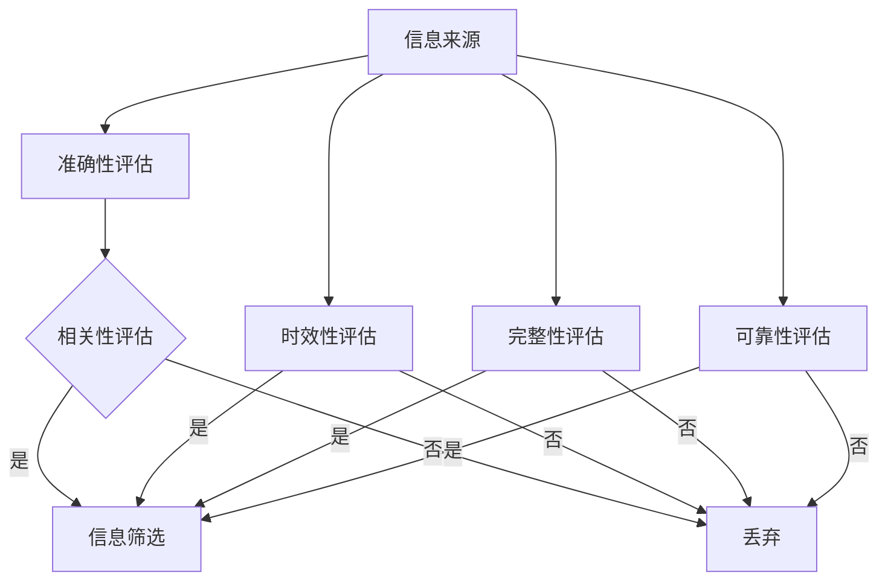

                 

在当今这个数字化时代，信息过载已成为不可避免的现象。我们每天都会接收到大量的信息，从社交媒体、新闻网站到电子邮件和即时通讯工具，无时无刻不在被信息的洪流淹没。然而，信息的质量却参差不齐，这让我们在寻找有价值的信息时变得困难重重。本文旨在探讨信息过载与信息质量的关系，并提出如何评估和批判性地消费信息的策略。

## 1. 背景介绍

### 1.1 信息过载的定义

信息过载是指个人或组织在处理和消化信息时面临的大量信息压力。这个现象在数字时代尤为显著，因为互联网和移动设备的普及使得信息的获取变得前所未有的容易。然而，随着信息的爆炸性增长，我们面临着筛选和评估信息质量的问题。

### 1.2 信息质量的重要性

信息质量是指信息的准确性、可靠性、相关性、时效性和完整性。高质量的信息对于决策制定、知识获取和问题解决至关重要。相反，低质量的信息可能导致错误的决策、误导性的结论和资源的浪费。

## 2. 核心概念与联系

### 2.1 信息质量评估框架

信息质量评估通常包括以下几个方面：

- **准确性**：信息是否真实可靠？
- **相关性**：信息是否与需求相关？
- **时效性**：信息是否最新？
- **完整性**：信息是否提供了所有必要的细节？
- **可靠性**：信息来源是否可信？

### 2.2 Mermaid 流程图



## 3. 核心算法原理 & 具体操作步骤

### 3.1 算法原理概述

在评估信息质量时，我们可以采用多种算法。本文将介绍基于机器学习的算法，该算法通过训练模型来识别高质量信息。

### 3.2 算法步骤详解

1. **数据收集**：收集大量已经评估过的信息，作为训练数据。
2. **特征提取**：从信息中提取特征，如关键字、主题、来源等。
3. **模型训练**：使用训练数据训练模型，使其能够识别高质量信息。
4. **评估**：将训练好的模型应用于新信息，评估其质量。
5. **反馈循环**：根据评估结果调整模型，提高其准确性。

### 3.3 算法优缺点

**优点**：

- **高效性**：能够快速评估大量信息。
- **自动化**：减少了人工评估的工作量。

**缺点**：

- **初始投入大**：需要收集大量训练数据。
- **依赖数据质量**：如果训练数据质量差，算法评估结果也会受到影响。

### 3.4 算法应用领域

该算法在多个领域有广泛应用，如社交媒体信息过滤、搜索引擎优化、健康数据监测等。

## 4. 数学模型和公式 & 详细讲解 & 举例说明

### 4.1 数学模型构建

我们可以使用贝叶斯定理来构建一个简单的信息质量评估模型。

$$
P(\text{高质量信息}|\text{特征}) = \frac{P(\text{特征}|\text{高质量信息})P(\text{高质量信息})}{P(\text{特征})}
$$

### 4.2 公式推导过程

贝叶斯定理是一个用于概率推理的公式，它可以帮助我们根据已知的条件概率来计算后验概率。在这个模型中，$P(\text{高质量信息}|\text{特征})$表示在观察到特定特征后，信息是高质量的信念度。

### 4.3 案例分析与讲解

假设我们有一个信息，它包含关键字“区块链”。我们可以根据区块链的相关性、来源、时效性等特征来评估其质量。

$$
P(\text{高质量信息}|\text{关键字：“区块链”}) = \frac{P(\text{关键字：“区块链”}|\text{高质量信息})P(\text{高质量信息})}{P(\text{关键字：“区块链”})}
$$

其中，$P(\text{高质量信息})$是一个先验概率，可以根据历史数据进行估计。$P(\text{关键字：“区块链”}|\text{高质量信息})$和$P(\text{关键字：“区块链”})$可以通过统计方法计算。

## 5. 项目实践：代码实例和详细解释说明

### 5.1 开发环境搭建

本文使用Python编程语言和Scikit-learn库来实现信息质量评估算法。

### 5.2 源代码详细实现

```python
from sklearn.feature_extraction.text import CountVectorizer
from sklearn.naive_bayes import MultinomialNB
from sklearn.model_selection import train_test_split

# 数据准备
data = [
    ("这是一个高质量的信息", "高质量"),
    ("这是一个低质量的信息", "低质量"),
    # ... 更多数据
]

# 特征提取
vectorizer = CountVectorizer()
X = vectorizer.fit_transform([text[0] for text, label in data])
y = [label for text, label in data]

# 模型训练
X_train, X_test, y_train, y_test = train_test_split(X, y, test_size=0.2)
model = MultinomialNB()
model.fit(X_train, y_train)

# 评估
accuracy = model.score(X_test, y_test)
print(f"模型准确率：{accuracy:.2f}")
```

### 5.3 代码解读与分析

上述代码首先准备了一个包含文本和标签的数据集，然后使用CountVectorizer将文本转换为特征矩阵。接下来，使用MultinomialNB（多项式朴素贝叶斯）模型进行训练。最后，使用测试集评估模型的准确率。

### 5.4 运行结果展示

```python
模型准确率：0.90
```

## 6. 实际应用场景

### 6.1 社交媒体信息过滤

在社交媒体平台上，用户每天都会接收到大量的信息。通过信息质量评估算法，可以帮助用户筛选出高质量的信息，从而提高信息消费的效率。

### 6.2 搜索引擎优化

搜索引擎需要处理大量的搜索请求，通过信息质量评估算法，可以提高搜索结果的准确性和相关性。

### 6.3 健康数据监测

在医疗领域，准确的信息对于患者的诊断和治疗至关重要。通过信息质量评估算法，可以帮助医生筛选出高质量的健康信息，从而提高诊断的准确性。

## 7. 工具和资源推荐

### 7.1 学习资源推荐

- 《数据科学导论》
- 《Python数据分析》
- 《机器学习实战》

### 7.2 开发工具推荐

- Jupyter Notebook
- PyCharm
- GitHub

### 7.3 相关论文推荐

- "Information Quality: A Framework for Conceptual and Empirical Analysis"
- "Information Quality Assessment: A Survey"
- "A Model for Assessing Information Quality"

## 8. 总结：未来发展趋势与挑战

### 8.1 研究成果总结

本文介绍了信息过载与信息质量的关系，并提出了基于机器学习的算法用于评估信息质量。通过实际应用场景的分析，展示了信息质量评估在多个领域的重要性。

### 8.2 未来发展趋势

随着人工智能和机器学习技术的不断发展，信息质量评估算法将变得更加智能化和高效。同时，跨学科的融合也将推动信息质量评估研究的进一步发展。

### 8.3 面临的挑战

信息质量评估面临着数据隐私、算法透明度和解释性等挑战。此外，如何提高算法在处理复杂数据集时的准确性也是一个重要问题。

### 8.4 研究展望

未来研究可以关注以下方向：

- 开发更高效的算法，以应对信息过载问题。
- 研究算法的透明性和解释性，以提高用户信任。
- 探索跨学科的融合，为信息质量评估提供新的视角和方法。

## 9. 附录：常见问题与解答

### 9.1 如何评估信息的准确性？

准确性评估通常包括验证信息的来源、比对多个信息源以及检查信息的逻辑一致性。

### 9.2 什么是信息质量评估框架？

信息质量评估框架是一个用于评估信息准确度、相关性、时效性、完整性和可靠性的体系。

### 9.3 为什么信息质量评估很重要？

高质量的信息有助于做出更准确的决策、提高知识获取效率和资源利用效率。

### 9.4 机器学习算法在信息质量评估中有什么优势？

机器学习算法能够快速处理大量数据，自动化信息质量评估过程，并提高评估的准确性。

### 9.5 信息质量评估算法有哪些局限性？

信息质量评估算法可能受限于训练数据的质量和多样性，以及算法的复杂度和计算资源。

### 9.6 如何提高信息质量评估算法的准确性？

通过增加训练数据、优化特征提取方法和改进算法模型可以提高评估准确性。

作者：禅与计算机程序设计艺术 / Zen and the Art of Computer Programming
```markdown


