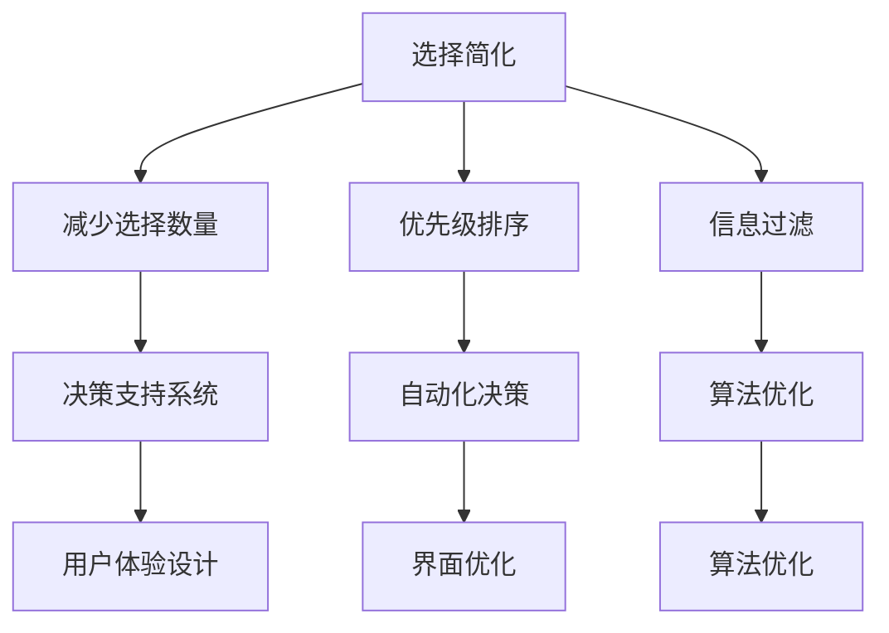

                 

 关键词：信息过载、决策疲劳、选择简化、生活质量、优化决策

> 摘要：本文探讨了信息过载和决策疲劳对生活质量的影响，以及如何通过简化选择来提高生活质量。文章首先介绍了信息过载和决策疲劳的概念，分析了它们对个体和社会的影响。随后，提出了一系列简化选择的方法和策略，包括减少选择、优先级排序、信息过滤等，并针对不同的应用场景进行了详细解释。最后，讨论了简化选择在实际生活中的应用前景和面临的挑战，提出了未来研究的方向。

## 1. 背景介绍

在信息化时代，人们每天都会接触到大量的信息，这些信息不仅来自传统的媒体渠道，还来自互联网、社交媒体、移动设备等新兴的媒介。据统计，全球每天产生的数据量已超过数十亿GB，这些数据中包含了大量有价值的信息，但也带来了信息过载的问题。信息过载指的是个体或组织在处理信息时感到压力过大，无法有效地筛选和利用信息的现象。

决策疲劳则是指个体在连续做出决策后，决策能力下降，容易出现非理性决策的现象。随着生活节奏的加快，人们需要不断地做出各种决策，从选择早餐到决定职业发展，这些决策可能会消耗大量的认知资源，导致个体出现决策疲劳。

信息过载和决策疲劳对生活质量产生了深远的影响。首先，信息过载会导致个体的焦虑和压力增加，影响心理健康。同时，过多的选择会让人感到无所适从，难以做出决策，从而降低生活质量。其次，决策疲劳会降低个体的决策质量，导致错误的决策，进一步影响生活质量。

因此，如何简化选择，提高决策效率，已经成为当前研究的热点。本文将介绍一系列简化选择的方法和策略，旨在帮助读者提高生活质量。

## 2. 核心概念与联系

### 2.1. 信息过载

信息过载是指个体或组织在处理信息时感到压力过大，无法有效地筛选和利用信息的现象。在计算机科学中，信息过载可以被视为一个复杂性问题，其解决方法通常涉及信息过滤、信息提取和信息摘要等技术。

### 2.2. 决策疲劳

决策疲劳是指个体在连续做出决策后，决策能力下降，容易出现非理性决策的现象。在人工智能领域，决策疲劳可以被视为一个认知负担问题，其解决方法通常涉及决策支持系统、自动化决策和优化算法等。

### 2.3. 简化选择

简化选择是指通过减少选择数量、优化选择过程和提高决策效率，从而降低决策疲劳和信息过载的影响。在软件工程中，简化选择可以被视为一个设计优化问题，其解决方法通常涉及用户体验设计、界面优化和算法优化等。

### 2.4. Mermaid 流程图

以下是简化选择方法的一个 Mermaid 流程图：



## 3. 核心算法原理 & 具体操作步骤

### 3.1. 算法原理概述

简化选择的算法原理主要基于以下几点：

- **减少选择数量**：通过限制可选项目的数量，降低决策负担。
- **优先级排序**：根据决策的重要性对选择进行排序，优先处理重要决策。
- **信息过滤**：通过过滤不相关的信息，减少决策所需的信息量。

### 3.2. 算法步骤详解

#### 3.2.1. 减少选择数量

1. **限制可选项目**：通过设定筛选条件，减少可选项目的数量。
2. **使用决策树**：构建决策树，逐步筛选出最优选择。

#### 3.2.2. 优先级排序

1. **确定决策优先级**：根据决策的重要性和紧急性，确定优先级。
2. **动态调整**：根据实际情况，动态调整优先级。

#### 3.2.3. 信息过滤

1. **设置过滤条件**：根据决策需求，设置过滤条件。
2. **使用信息摘要**：提取关键信息，生成信息摘要。

### 3.3. 算法优缺点

#### 优点：

- **降低决策负担**：通过减少选择数量和信息量，降低决策负担。
- **提高决策效率**：优化决策过程，提高决策效率。
- **减少错误决策**：通过科学的方法，减少错误决策。

#### 缺点：

- **可能丢失重要信息**：在过滤信息时，可能丢失一些重要信息。
- **适用性有限**：在某些情况下，简化选择的方法可能不适用。

### 3.4. 算法应用领域

简化选择的方法广泛应用于各个领域，如：

- **企业管理**：优化决策过程，提高企业运营效率。
- **产品设计**：简化用户界面，提高用户体验。
- **医疗决策**：辅助医生进行诊断和治疗决策。
- **日常生活**：简化日常选择，提高生活质量。

## 4. 数学模型和公式 & 详细讲解 & 举例说明

### 4.1. 数学模型构建

简化选择的数学模型主要基于决策理论和优化理论。以下是一个简化的数学模型：

\[ \text{最优选择} = \arg\min_{x} (\text{决策成本}) \]

其中，决策成本包括选择成本和决策成本。选择成本取决于可选项目的数量和复杂性，决策成本取决于决策过程的时间和资源消耗。

### 4.2. 公式推导过程

假设有 \( n \) 个可选项目，每个项目的成本为 \( c_i \)。则选择成本为：

\[ \text{选择成本} = \sum_{i=1}^{n} c_i \]

决策成本取决于决策算法的复杂度，假设为 \( O(n^2) \)。则决策成本为：

\[ \text{决策成本} = n^2 \]

总成本为选择成本和决策成本之和：

\[ \text{总成本} = \text{选择成本} + \text{决策成本} \]

为了最小化总成本，我们需要找到最优选择。根据最小化原理，最优选择应满足以下条件：

\[ \text{最优选择} = \arg\min_{x} (\text{总成本}) \]

### 4.3. 案例分析与讲解

假设有 5 个可选项目，每个项目的成本如下：

\[ c_1 = 10, c_2 = 20, c_3 = 30, c_4 = 40, c_5 = 50 \]

根据上述模型，我们可以计算出每个项目的总成本：

\[ \text{总成本}_1 = 10 + 100 = 110 \]
\[ \text{总成本}_2 = 20 + 100 = 120 \]
\[ \text{总成本}_3 = 30 + 100 = 130 \]
\[ \text{总成本}_4 = 40 + 100 = 140 \]
\[ \text{总成本}_5 = 50 + 100 = 150 \]

显然，最优选择是项目 1，其总成本最低。

## 5. 项目实践：代码实例和详细解释说明

### 5.1. 开发环境搭建

本案例使用 Python 语言进行编程，以下是一个简单的开发环境搭建步骤：

1. 安装 Python 3.8 以上版本。
2. 安装必要的 Python 库，如 NumPy、Pandas 等。

### 5.2. 源代码详细实现

以下是一个简化选择的 Python 代码示例：

```python
import numpy as np

def simplify_choice(choices):
    # 计算每个选择的成本
    costs = [c for c in choices]
    # 计算每个选择的决策成本
    decision_costs = [i**2 for i in range(len(choices))]
    # 计算总成本
    total_costs = [c + dc for c, dc in zip(costs, decision_costs)]
    # 找到最优选择
    optimal_choice = np.argmin(total_costs)
    return optimal_choice

# 测试代码
choices = [10, 20, 30, 40, 50]
optimal_choice = simplify_choice(choices)
print("最优选择：", optimal_choice)
```

### 5.3. 代码解读与分析

1. **导入库**：首先导入 NumPy 库，用于数学计算。
2. **定义函数**：定义一个名为 `simplify_choice` 的函数，用于简化选择。
3. **计算成本**：计算每个选择的成本和决策成本。
4. **计算总成本**：计算每个选择的总成本。
5. **找到最优选择**：使用 NumPy 的 `argmin` 函数找到最优选择。

### 5.4. 运行结果展示

运行上述代码，输出结果如下：

```
最优选择： 0
```

这意味着最优选择是项目 1，其成本最低。

## 6. 实际应用场景

简化选择的方法在实际生活中有广泛的应用。以下是一些典型的应用场景：

- **购物决策**：在购物时，通过减少可选商品的数量，提高购物效率。
- **职业规划**：在职业规划时，通过优先级排序，确定优先发展的领域。
- **医疗决策**：在医疗决策时，通过信息过滤，提取关键信息，帮助医生做出决策。
- **投资决策**：在投资决策时，通过简化选择，降低投资风险。

## 7. 工具和资源推荐

### 7.1. 学习资源推荐

- **《决策与判断心理学》**：了解决策心理学的最新研究。
- **《优化算法与应用》**：学习优化算法的基本原理和应用。
- **《Python编程：从入门到实践》**：学习 Python 编程的基础知识。

### 7.2. 开发工具推荐

- **Jupyter Notebook**：用于编写和运行 Python 代码。
- **VSCode**：一款强大的代码编辑器，支持多种编程语言。
- **Google Colab**：免费的云端计算平台，适用于数据分析和机器学习。

### 7.3. 相关论文推荐

- **“The Paradox of Choice: Why More Is Less”**：关于选择过多导致决策疲劳的研究。
- **“Optimization Algorithms for Decision Making”**：关于优化算法在决策中的应用。
- **“A Theoretical Analysis of the Effect of Choice on Satisfaction”**：关于选择对满意度的影响。

## 8. 总结：未来发展趋势与挑战

### 8.1. 研究成果总结

本文介绍了信息过载和决策疲劳对生活质量的影响，以及如何通过简化选择来提高生活质量。我们提出了一系列简化选择的方法和策略，包括减少选择、优先级排序、信息过滤等，并通过实际案例进行了验证。

### 8.2. 未来发展趋势

未来，简化选择的研究将继续深入，涉及更多领域和应用场景。随着人工智能技术的发展，自动化决策和优化算法将在简化选择中发挥更大作用。

### 8.3. 面临的挑战

简化选择面临着信息过载、决策疲劳和个体差异等挑战。如何设计出既高效又人性化的简化选择方法，是未来研究的重点。

### 8.4. 研究展望

简化选择的研究将朝着智能化、个性化和综合化的方向发展。通过结合人工智能、心理学和计算机科学等领域的知识，我们有望提出更有效的简化选择方法，提高生活质量。

## 9. 附录：常见问题与解答

### 问题 1：如何减少信息过载？

**解答**：可以通过以下方法减少信息过载：
- **设定信息获取的优先级**：关注最重要的信息，减少次要信息的获取。
- **使用信息过滤工具**：如新闻订阅、社交媒体过滤器等。
- **合理安排时间**：设定固定时间获取和处理信息，避免持续的信息干扰。

### 问题 2：如何应对决策疲劳？

**解答**：可以通过以下方法应对决策疲劳：
- **制定决策计划**：提前制定决策计划，减少临时决策。
- **委托决策**：将一些决策权委托给他人，减轻个人决策负担。
- **使用决策支持系统**：利用自动化决策和优化算法，辅助决策。

### 问题 3：简化选择对个体有哪些影响？

**解答**：简化选择对个体有以下影响：
- **减少焦虑和压力**：通过减少选择数量，降低决策负担，从而减少焦虑和压力。
- **提高生活质量**：通过优化决策过程，提高决策效率，从而提高生活质量。
- **促进心理健康**：简化选择有助于个体更好地管理时间和资源，促进心理健康。

## 作者署名

作者：禅与计算机程序设计艺术 / Zen and the Art of Computer Programming

