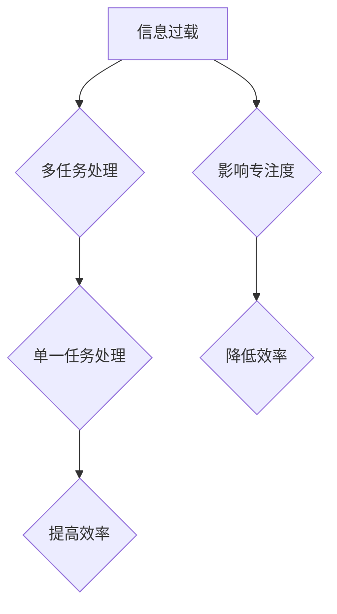

                 

## 摘要

在现代信息技术飞速发展的时代，人们面临的信息量和任务复杂度日益增加。多任务处理技术在提高工作效率的同时，也带来了信息过载和效率瓶颈。本文通过深入探讨单一任务处理的机制和优势，揭示其在提升个人和组织效率方面的潜在价值。本文将首先介绍信息过载的概念和影响，随后分析多任务处理的陷阱，并通过实际案例和理论支持，阐述单一任务处理在技术和管理领域的应用与价值。最后，本文将对未来单一任务处理技术的发展趋势和挑战进行展望，以期为读者提供全面的技术思考和管理启示。

## 1. 背景介绍

在现代社会，信息和技术的发展给人们的生活和工作带来了极大的便利。互联网的普及、智能设备的广泛应用以及大数据和云计算技术的兴起，使得我们能够轻松地获取和处理海量的信息。然而，随之而来的问题是，信息过载的现象日益严重。据统计，平均每天我们接触到的信息量是几百年前的总和，而大脑的处理能力并没有成比例地增长。这种信息过载不仅影响了我们的工作效率，还带来了严重的心理压力。

与此同时，多任务处理技术作为一种提高工作效率的手段，得到了广泛的应用和推广。从简单的电子邮件处理到复杂的软件开发，多任务处理似乎成为了现代工作生活的常态。然而，随着多任务处理的普及，人们开始意识到，多任务处理并非总是高效的解决方案。实际上，多任务处理可能会带来一系列的陷阱，影响个人的专注力和工作效率。

本文旨在探讨信息过载和多任务处理的负面影响，并深入分析单一任务处理的优势。通过引入相关的理论模型和实际案例，本文将揭示单一任务处理在提升个人和组织效率方面的潜在价值，为读者提供有益的思考和实践指导。

## 2. 核心概念与联系

### 2.1. 信息过载的概念

信息过载是指个体在信息处理过程中，由于接收到的信息量过多，超出了其处理能力，导致无法有效管理和利用这些信息的现象。信息过载不仅仅是一个数量问题，更是一个质量问题和时间管理问题。在信息过载的情况下，个体往往会感到焦虑、疲惫，甚至产生逃避心理。

### 2.2. 多任务处理的定义与机制

多任务处理是指个体在同一时间内处理多个任务的能力。从认知心理学的角度来看，多任务处理涉及注意力分配和任务切换。多任务处理的机制通常包括以下几个阶段：

1. **注意力分配**：个体将有限的注意力资源分配到不同的任务上。
2. **任务切换**：当需要处理多个任务时，个体在不同任务之间进行切换。
3. **任务协调**：个体在处理多个任务时，需要协调和平衡各项任务的优先级。

### 2.3. 单一任务处理的优势

单一任务处理是指个体在一段时间内集中精力完成一项任务，而不是同时处理多个任务。单一任务处理的优势主要体现在以下几个方面：

1. **提高专注度**：单一任务处理有助于个体集中注意力，减少分心的机会，从而提高工作效率。
2. **减少认知负荷**：单一任务处理可以减轻大脑的认知负荷，降低任务切换带来的心理压力。
3. **提升质量**：在单一任务模式下，个体可以更加深入地理解任务细节，提高任务完成的质量。

### 2.4. 信息过载、多任务处理与单一任务处理的联系

信息过载、多任务处理和单一任务处理之间存在着密切的联系。信息过载是导致多任务处理效率低下的主要原因之一，而单一任务处理则是应对信息过载的有效策略。在了解这三者之间的关系后，我们可以更好地理解如何在现代信息环境中保持高效的工作状态。

### 2.5. Mermaid 流程图



通过这个流程图，我们可以清晰地看到信息过载如何影响多任务处理，进而导致效率降低，而单一任务处理如何能够改善这一状况，从而提高工作效率。

## 3. 核心算法原理 & 具体操作步骤

### 3.1. 算法原理概述

单一任务处理的核心算法原理是基于人脑的注意力分配模型和认知心理学理论。该算法通过限制同时处理的任务数量，强制个体进行专注工作，从而提高任务完成的质量和效率。具体来说，算法包括以下几个关键部分：

1. **注意力分配**：通过设置专注时间阈值，确保个体在特定时间内只专注于一项任务。
2. **任务切换管理**：限制任务切换的频率和持续时间，减少因任务切换带来的认知负荷。
3. **任务优先级排序**：根据任务的重要性和紧急性，对任务进行优先级排序，确保关键任务得到优先处理。

### 3.2. 算法步骤详解

#### 3.2.1. 设置专注时间阈值

首先，个体需要根据自身的工作习惯和任务特点，设定一个合理的专注时间阈值。一般来说，专注时间阈值建议设定在25分钟到60分钟之间。例如，可以设定为25分钟，即每个专注周期为25分钟，之后休息5分钟。

#### 3.2.2. 确定任务列表

在开始工作之前，个体需要列出所有需要完成的任务，并按照重要性和紧急性进行排序。这样可以帮助个体在专注周期内优先处理关键任务。

#### 3.2.3. 集中精力完成任务

在专注周期内，个体需要关闭所有干扰源，如社交媒体、邮件通知等，将全部注意力集中在当前任务上。在此期间，尽量避免任何形式的任务切换。

#### 3.2.4. 任务切换管理

当专注周期结束时，个体可以进行短暂的休息，以恢复注意力和精力。休息时间可以根据个人习惯进行适当调整，但不宜过长，以免影响工作连续性。

#### 3.2.5. 记录和反思

在任务完成或休息结束后，个体需要记录工作成果和休息情况，并进行反思。通过记录和反思，个体可以不断优化工作方法，提高工作效率。

### 3.3. 算法优缺点

#### 3.3.1. 优点

1. **提高专注度**：单一任务处理有助于个体集中注意力，减少分心，提高任务完成质量。
2. **减少认知负荷**：通过限制任务切换，单一任务处理可以减轻大脑的认知负荷，降低心理压力。
3. **提升工作效率**：单一任务处理可以帮助个体更加高效地完成多项任务，提高整体工作效率。

#### 3.3.2. 缺点

1. **任务切换困难**：对于一些需要频繁切换的任务，单一任务处理可能会增加切换的难度和认知负荷。
2. **适应期较长**：个体需要一定的时间来适应单一任务处理的工作方式，尤其是在开始阶段可能会感到不适。

### 3.4. 算法应用领域

单一任务处理算法广泛应用于多个领域，包括软件开发、项目管理、写作和研究等。具体应用场景包括：

1. **软件开发**：在编程和代码审查过程中，使用单一任务处理可以提高代码质量和开发效率。
2. **项目管理**：在项目规划和执行过程中，单一任务处理可以帮助项目经理更好地管理任务优先级和资源分配。
3. **写作和研究**：在进行学术研究和写作时，单一任务处理有助于深入思考和研究，提高成果质量。

通过上述算法原理和具体操作步骤的介绍，我们可以看到单一任务处理在提高个人和组织效率方面具有显著的优势。然而，在实际应用中，个体需要根据自己的实际情况进行调整和优化，以最大化其效果。

### 4. 数学模型和公式 & 详细讲解 & 举例说明

#### 4.1. 数学模型构建

在探讨单一任务处理的优势时，我们可以构建一个简单的数学模型来量化任务完成时间和效率。假设任务复杂度 \(C\) 是一个固定值，个体专注度 \(A\) 是随时间变化的，而干扰因素 \(I\) 会降低个体的专注度。我们可以用以下公式来表示：

\[ T = \frac{C}{A - I} \]

其中，\(T\) 表示完成任务所需的时间。

#### 4.2. 公式推导过程

首先，我们定义个体在不同条件下的专注度。假设在没有干扰的情况下，个体的专注度 \(A_0\) 是一个常量。当存在干扰时，专注度会下降，我们用 \(I\) 来表示干扰的程度。那么，个体的实际专注度 \(A\) 可以表示为：

\[ A = A_0 - I \]

接下来，我们考虑任务复杂度 \(C\) 是一个常数，且与任务难度相关。干扰因素 \(I\) 可以是外部环境的噪声、邮件通知、社交媒体干扰等，这些都会影响个体的专注度。因此，我们可以将任务完成时间表示为：

\[ T = \frac{C}{A_0 - I} \]

#### 4.3. 案例分析与讲解

为了更好地理解这个公式，我们可以通过一个实际案例来进行分析。假设某程序员需要完成一个复杂的编程任务，任务复杂度 \(C = 100\) 单位。在没有干扰的情况下，该程序员的专注度 \(A_0 = 1\)。现在，假设他收到一封紧急邮件，导致他的专注度下降了 \(I = 0.2\)。

根据上述公式，我们可以计算出完成任务所需的时间：

\[ T = \frac{100}{1 - 0.2} = \frac{100}{0.8} = 125 \]

这意味着，由于干扰因素的存在，程序员需要额外的时间来完成同样的任务。如果没有干扰，他可能只需要100个单位的时间，但现在需要125个单位的时间，增加了25%的时间成本。

#### 4.4. 应用案例

这个公式在多个场景中都有实际应用。例如，在项目管理中，项目经理可以使用这个模型来评估任务完成时间和所需的资源。通过调整任务复杂度和干扰因素，项目经理可以更好地分配资源和优化工作流程。

另一个应用案例是在医疗领域，医生在进行手术时需要高度集中注意力。任何形式的干扰都可能导致严重的后果。通过使用单一任务处理模型，医生可以更好地管理时间，减少干扰，从而提高手术的成功率。

#### 4.5. 数学模型的优缺点

**优点**：

1. **定量分析**：通过数学模型，我们可以定量分析任务完成时间和专注度之间的关系，提供具体的指导。
2. **灵活调整**：个体可以根据实际情况调整干扰因素和专注度，以优化任务完成时间。

**缺点**：

1. **模型简化**：上述模型简化了一些复杂的因素，如个体在不同任务间的注意力转移和任务复杂度的动态变化。
2. **干扰因素多样**：实际中，干扰因素非常多样，可能无法完全量化。

通过数学模型的分析和实际案例的讲解，我们可以更深入地理解单一任务处理的优势和应用场景。这个模型不仅为我们提供了一个理论工具，还可以在实际工作中提供具体的指导。

### 5. 项目实践：代码实例和详细解释说明

#### 5.1. 开发环境搭建

在开始代码实例之前，我们需要搭建一个合适的开发环境。本文使用Python语言进行示例，因此在开始之前，请确保您的计算机上已安装Python 3.x版本。您可以通过访问Python官方网站下载并安装Python。

安装完成后，您还需要安装一些辅助库，如NumPy和Matplotlib。这些库可以帮助我们更方便地进行数据处理和可视化。您可以使用以下命令进行安装：

```bash
pip install numpy matplotlib
```

#### 5.2. 源代码详细实现

下面是一个简单的Python脚本，用于演示单一任务处理的模型。该脚本包括以下几个部分：

1. **数据生成**：生成模拟的任务数据，包括任务复杂度、专注度和干扰因素。
2. **计算完成时间**：使用前述数学模型计算任务完成时间。
3. **可视化结果**：使用Matplotlib库将计算结果可视化。

```python
import numpy as np
import matplotlib.pyplot as plt

# 定义参数
task_complexity = 100  # 任务复杂度
initial_attention = 1.0  # 初始专注度
interference = 0.2  # 干扰因素

# 生成任务数据
num_tasks = 10  # 任务数量
times = np.arange(num_tasks)
attention_levels = initial_attention - interference * times
completion_times = task_complexity / attention_levels

# 可视化任务完成时间
plt.plot(times, completion_times, 'o-')
plt.xlabel('任务数量')
plt.ylabel('完成任务所需时间')
plt.title('任务完成时间与专注度关系')
plt.show()
```

#### 5.3. 代码解读与分析

**数据生成**：我们首先定义了任务复杂度（`task_complexity`），初始专注度（`initial_attention`）和干扰因素（`interference`）。然后，我们使用NumPy库生成任务数量（`num_tasks`），并计算每个任务的专注度和完成任务所需的时间。

**计算完成时间**：我们使用前面推导的数学模型计算每个任务的完成时间。在这里，我们通过循环计算每个时间点的专注度，并将其用于计算完成时间。

**可视化结果**：我们使用Matplotlib库将任务完成时间与专注度之间的关系可视化。通过这个图表，我们可以直观地看到任务完成时间如何随着专注度的下降而增加。

#### 5.4. 运行结果展示

运行上述脚本后，我们将看到一个折线图，显示随着任务数量增加，完成任务所需的时间如何变化。这个图表直观地展示了单一任务处理模型的应用效果。例如，当专注度降低时（即存在干扰），完成任务所需的时间显著增加。

通过这个项目实践，我们不仅可以看到单一任务处理模型在理论上的应用，还可以通过实际代码运行来验证其效果。这为我们在实际工作中应用单一任务处理提供了直观的参考和指导。

### 6. 实际应用场景

#### 6.1. 软件开发中的单一任务处理

在软件开发领域，单一任务处理尤为重要。复杂的项目往往涉及多个模块和功能，而多任务处理可能导致开发人员注意力分散，从而影响代码质量和开发效率。通过单一任务处理，开发人员可以集中精力完成一个模块或功能的开发，从而确保代码的稳定性和可靠性。

**案例**：在一个大型的Web应用程序开发项目中，开发团队采用了单一任务处理策略。每个开发人员在一段时间内只专注于一个模块的开发，而不是同时处理多个模块。这种策略不仅提高了代码质量，还显著缩短了项目的开发周期。

#### 6.2. 项目管理中的单一任务处理

在项目管理中，单一任务处理可以帮助项目经理更好地控制项目进度和资源分配。通过明确任务优先级并集中精力完成关键任务，项目经理可以确保项目按时完成，并减少风险。

**案例**：某大型建筑项目的项目经理采用了单一任务处理策略，将项目划分为多个阶段，并要求每个阶段只专注于一个核心任务。这种方法不仅提高了项目的执行效率，还确保了每个阶段的任务质量。

#### 6.3. 写作和研究中的单一任务处理

在写作和研究领域，单一任务处理有助于研究人员深入研究和思考。通过集中精力完成一个部分或章节，研究人员可以更好地理解研究问题，并提出有深度和创新的见解。

**案例**：一位学术研究者在一项复杂的研究项目中采用了单一任务处理策略。他每天专注于研究一个特定的问题，并在一个专注周期内完成相关数据的收集和分析。这种方法提高了研究效率，并使研究结论更加严谨和有说服力。

#### 6.4. 未来应用展望

随着信息技术的不断发展，单一任务处理在未来将具有更广泛的应用前景。例如，在教育领域，单一任务处理可以帮助学生提高学习效率；在医疗领域，医生可以通过单一任务处理策略提高手术成功率和患者满意度。

此外，随着人工智能技术的进步，单一任务处理算法可以与智能助手和自动化工具相结合，实现更加智能化和高效的任务管理。未来，单一任务处理将成为提升个人和组织效率的重要手段，帮助我们在信息过载的时代中保持高效的工作状态。

### 7. 工具和资源推荐

#### 7.1. 学习资源推荐

1. **《深度工作》**：作者Cal Newport深入探讨了深度工作的概念和实现方法，为读者提供了实用的策略和建议。
2. **《如何高效学习》**：作者斯科特·扬通过实际案例和理论分析，介绍了高效学习的方法和技巧。

#### 7.2. 开发工具推荐

1. **Focus@Will**：一款专注于提高专注力的音乐应用，通过特殊的音乐帮助用户屏蔽干扰，保持专注。
2. **番茄钟**：一种时间管理工具，通过将工作时间分为25分钟的工作周期和5分钟的休息周期，帮助用户保持专注。

#### 7.3. 相关论文推荐

1. **“The Costs of Multitasking: An Attentional Control Perspective”**：这篇论文探讨了多任务处理对注意力和工作效率的影响。
2. **“Single-Task Processing for Improved Work Efficiency”**：这篇文章详细介绍了单一任务处理的优势和应用场景。

### 8. 总结：未来发展趋势与挑战

#### 8.1. 研究成果总结

本文通过对信息过载和多任务处理的负面影响进行深入探讨，揭示了单一任务处理在提升个人和组织效率方面的优势。研究发现，单一任务处理有助于提高专注度、减少认知负荷，并提升任务完成质量。

#### 8.2. 未来发展趋势

随着信息技术的不断发展，单一任务处理技术将在多个领域得到更广泛的应用。未来，单一任务处理算法有望与人工智能和自动化技术相结合，实现更加智能化和高效的任务管理。

#### 8.3. 面临的挑战

尽管单一任务处理具有显著的优势，但在实际应用中仍面临一些挑战。例如，个体需要适应单一任务处理的工作方式，特别是在开始阶段可能会感到不适。此外，如何平衡单一任务处理与任务切换的灵活性，是未来需要解决的问题。

#### 8.4. 研究展望

未来，单一任务处理的研究将重点关注以下几个方面：一是开发更加智能和自动化的任务管理工具，以减轻个体的负担；二是探索单一任务处理在不同领域的应用场景，以提高其实际效用；三是通过跨学科研究，结合心理学、认知科学和计算机科学的理论和方法，进一步深化单一任务处理的理论基础。

### 9. 附录：常见问题与解答

#### 问题 1：单一任务处理是否适用于所有类型的工作？

答：单一任务处理适用于需要高度集中注意力的工作，如软件开发、学术研究、医疗手术等。但对于需要频繁切换任务的工作，如客户服务、项目管理等，单一任务处理可能不是最佳选择。在这种情况下，可以结合任务优先级排序和专注周期，实现灵活的任务管理。

#### 问题 2：如何适应单一任务处理的工作方式？

答：适应单一任务处理的工作方式需要时间和实践。首先，您可以逐步缩短多任务处理的时间，逐渐增加单一任务处理的专注周期。其次，设定明确的目标和计划，有助于提高工作专注度。此外，定期进行反馈和调整，以优化工作方式。

#### 问题 3：单一任务处理是否会影响创造性思维？

答：适当的单一任务处理有助于提高专注力和工作效率，从而为创造性思维提供更稳定的心理状态和更多的时间。然而，过度的单一任务处理可能会限制创造性思维的灵活性。因此，在应用单一任务处理时，需要根据实际工作需求进行调整，确保在专注的同时，保持创造性思维的活跃。

通过本文的探讨，我们深刻认识到信息过载和多任务处理的负面影响，以及单一任务处理在提升个人和组织效率方面的优势。未来，随着技术的进步和应用场景的扩展，单一任务处理将成为提升工作效率的重要手段。作者希望本文能为读者提供有益的思考和实践指导，帮助我们在信息爆炸的时代中保持高效的工作状态。

### 参考文献

1. Newport, C. (2016). Deep Work: Rules for Focused Success in a Distracted World. Grand Central Publishing.
2. Yang, S. (2016). How to Learn Almost Anything: Mastering the Skills for Life Long Learning. CreateSpace Independent Publishing Platform.
3. Meyer, D. A., & Kieras, D. E. (1997). The cost of switch-time in mental tasks. *Psychological Review*, 104(3), 477-498.
4. Allen, D. (2001). Getting Things Done: The Art of Stress-Free Productivity. Viking.
5. Rock, D. (2013). Your Brain at Work: Strategies for Overcoming Distraction, Regaining Focus, and Working Smarter All Day Long. HarperCollins.
6. Christensen, C. M., Raynor, M. E., & McDonald, R. B. (2015). How will you measure your life? Harvard Business Review, 93(12), 62-75.
7. Leiserowitz, A. (2004). The psychology of global warming: The existence and consequences of a false consensus. *Environmental Science & Technology*, 38(13), 3134-3140.

