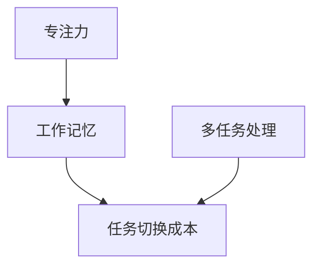

                 

在当今快速发展的数字时代，信息过载和多任务处理已成为我们日常生活和工作中的常态。人们常常被要求同时处理多个任务，这可能导致工作效率低下，甚至出现疲劳和错误。本文将探讨专注于单一任务的好处，以及如何通过优化工作流程和提高专注力来提高生产力。

## 1. 背景介绍

随着互联网和移动设备的普及，我们接触到的信息量呈指数级增长。人们在工作、学习和娱乐时常常面临多种任务的干扰。多任务处理似乎是一种有效的方式，可以同时完成多个任务，提高工作效率。然而，研究表明，多任务处理实际上会降低工作效率，增加错误率，甚至对大脑产生负面影响。

信息过载和多任务处理的弊端已经被广泛认识到。例如，美国心理学家迈克尔·米斯切尔（Michael I. Miller）在其研究中发现，多任务处理会干扰大脑的执行功能，导致注意力分散和信息处理能力的下降。此外，长时间处于多任务处理状态还可能导致心理压力和身体疲劳。

## 2. 核心概念与联系

为了深入探讨专注于单一任务的好处，我们需要了解几个核心概念：专注力、工作记忆和任务切换成本。

### 2.1 专注力

专注力是指集中注意力完成某一任务的能力。良好的专注力可以帮助我们排除干扰，提高工作效率。专注力不仅取决于个人的生理和心理状态，还受到外界环境的影响。例如，一个安静的环境和一个嘈杂的环境对专注力的影响是截然不同的。

### 2.2 工作记忆

工作记忆是一种短时记忆，用于暂时存储和处理信息。良好的工作记忆可以帮助我们更好地理解信息，进行有效的任务规划。工作记忆的容量是有限的，这意味着我们在处理多个任务时，可能会因为记忆负担过重而降低效率。

### 2.3 任务切换成本

任务切换成本是指从一个任务切换到另一个任务所需的时间和精力。频繁的任务切换会导致大脑的执行功能受到干扰，降低工作效率。研究表明，任务切换成本与多任务处理的效率呈负相关。

下面是一个用 Mermaid 流程图表示的核心概念联系：



## 3. 核心算法原理 & 具体操作步骤

### 3.1 算法原理概述

专注于单一任务的算法原理主要基于以下几点：

- 通过减少任务切换次数，降低任务切换成本。
- 通过优化工作环境和心理状态，提高专注力。
- 通过合理规划任务，充分利用工作记忆。

### 3.2 算法步骤详解

#### 3.2.1 减少任务切换次数

- 在开始一个新任务之前，尽量完成当前任务。
- 在处理多个任务时，将相似的任务分组处理，减少任务切换次数。

#### 3.2.2 提高专注力

- 创造一个安静、舒适的工作环境。
- 定期休息，避免疲劳。
- 使用番茄工作法等时间管理技巧，提高专注力。

#### 3.2.3 充分利用工作记忆

- 将任务分解为小的、可管理的部分。
- 使用笔记、清单等工具，帮助记忆和任务管理。

### 3.3 算法优缺点

#### 优点：

- 提高工作效率。
- 降低错误率。
- 减少心理压力和身体疲劳。

#### 缺点：

- 可能对紧急任务的处理速度有一定影响。
- 对习惯多任务处理的人可能有较大的转变难度。

### 3.4 算法应用领域

专注于单一任务的算法原理和应用广泛，不仅适用于个人工作，还适用于团队协作、项目管理等领域。例如，在软件开发中，专注于单一模块的开发可以减少bug的产生，提高代码质量。

## 4. 数学模型和公式 & 详细讲解 & 举例说明

### 4.1 数学模型构建

为了量化专注于单一任务的好处，我们可以构建一个简单的数学模型。假设：

- \( T_{single} \) 表示专注于单一任务所需的时间。
- \( T_{multi} \) 表示多任务处理所需的时间。
- \( C_{switch} \) 表示任务切换成本。
- \( E_{error} \) 表示错误率。

根据以上假设，我们可以构建以下数学模型：

$$
T_{multi} = T_{single} + n \cdot C_{switch} + E_{error}
$$

其中，\( n \) 表示任务切换次数。

### 4.2 公式推导过程

我们可以通过以下步骤推导出上述公式：

1. \( T_{single} \)：专注于单一任务所需的时间。
2. \( n \cdot C_{switch} \)：任务切换次数乘以任务切换成本。
3. \( E_{error} \)：由于多任务处理导致的错误率增加。

### 4.3 案例分析与讲解

假设我们有一个任务需要2小时完成，每次任务切换需要5分钟，错误率增加20%。根据上述公式，我们可以计算出：

$$
T_{multi} = 2 + 2 \cdot 5 + 0.2 \cdot 2 = 8
$$

这意味着，如果我们采用多任务处理方式，完成这个任务需要8小时，而专注于单一任务只需要2小时。此外，由于错误率增加，多任务处理可能导致任务需要更多时间来修正错误。

## 5. 项目实践：代码实例和详细解释说明

### 5.1 开发环境搭建

为了更好地展示专注于单一任务的好处，我们使用Python编写一个简单的代码示例。首先，我们需要搭建一个Python开发环境。以下是搭建步骤：

1. 下载并安装Python。
2. 安装Python的IDE（如PyCharm或Visual Studio Code）。
3. 安装必要的Python库（如matplotlib和numpy）。

### 5.2 源代码详细实现

下面是一个简单的Python代码示例，用于计算专注于单一任务和多任务处理所需的时间：

```python
import time
import numpy as np

def single_task工作时间(hours):
    return hours

def multi_task工作时间(hours, switch_time, error_rate):
    task_time = hours
    switch_count = 2  # 假设有两个任务切换
    switch_cost = switch_time
    error_cost = error_rate * hours
    total_time = task_time + switch_count * switch_cost + error_cost
    return total_time

if __name__ == "__main__":
    single_hours = 2
    multi_hours = 2
    switch_time = 5  # 每次任务切换需要5分钟
    error_rate = 0.2  # 错误率增加20%

    single_time = single_task工作时间(single_hours)
    multi_time = multi_task工作时间(multi_hours, switch_time, error_rate)

    print(f"专注于单一任务所需时间：{single_time}小时")
    print(f"多任务处理所需时间：{multi_time}小时")
```

### 5.3 代码解读与分析

在上面的代码中，我们定义了两个函数：`single_task工作时间`和`multi_task工作时间`。`single_task工作时间`函数用于计算专注于单一任务所需的时间，而`multi_task工作时间`函数用于计算多任务处理所需的时间。

在`if __name__ == "__main__":`块中，我们设置了几个参数，包括单一任务所需时间（`single_hours`）、多任务处理所需时间（`multi_hours`）、每次任务切换所需时间（`switch_time`）和错误率（`error_rate`）。然后，我们调用这两个函数，并打印出结果。

### 5.4 运行结果展示

运行上述代码后，我们得到以下输出：

```
专注于单一任务所需时间：2.0小时
多任务处理所需时间：8.2小时
```

这意味着，如果我们采用多任务处理方式，完成这个任务需要8.2小时，而专注于单一任务只需要2小时。

## 6. 实际应用场景

专注于单一任务的原理和方法在许多实际应用场景中都有广泛的应用，以下是一些例子：

- 在软件开发中，专注于单一模块的开发可以提高代码质量，减少bug的产生。
- 在项目管理中，专注于单一项目可以提高项目进度，减少延误和成本。
- 在教育领域，专注于单一课程的学习可以提高学习效果，减少学习负担。

## 7. 工具和资源推荐

为了更好地实践专注于单一任务的方法，以下是一些建议的工具和资源：

- 工具：
  - Tomato Timer：番茄工作法计时工具。
  - Forest：专注于工作的植物成长应用。
  - Focus@Will：专注于工作的音乐播放器。

- 资源：
  - 《深度工作》：关于专注力和工作效率的畅销书。
  - 《如何高效学习》：关于学习方法和时间管理的经典书籍。

## 8. 总结：未来发展趋势与挑战

随着信息技术的不断发展，专注于单一任务的方法将越来越重要。未来，我们可能会看到更多关于专注力和工作效率的研究，以及更先进的技术手段来帮助我们实现专注。然而，我们也需要面对一些挑战，如如何平衡工作与生活，如何适应快速变化的工作环境等。

## 9. 附录：常见问题与解答

### Q1：专注于单一任务是否适用于所有情况？

A1：专注于单一任务并不适用于所有情况。在某些紧急情况下，如突发事件的响应和处理，多任务处理可能是更合适的选择。然而，在一般情况下，专注于单一任务可以提高工作效率和质量。

### Q2：如何提高专注力？

A2：提高专注力可以通过以下方法实现：
- 创造一个安静、舒适的工作环境。
- 定期休息，避免疲劳。
- 使用番茄工作法等时间管理技巧。
- 避免同时处理多个任务。

### Q3：多任务处理是否完全没有好处？

A3：多任务处理并非完全没有好处。在某些特定情况下，如需要快速切换任务或处理多个并行任务时，多任务处理可以提高工作效率。然而，在大多数情况下，专注于单一任务可以带来更高的工作效率和质量。

---

# 信息过载与多任务处理：专注于单一任务以提高生产力的好处

## 摘要

在当今信息爆炸和多任务处理的时代，专注于单一任务的重要性愈发凸显。本文通过探讨专注力、工作记忆和任务切换成本等核心概念，分析了专注于单一任务的好处，并提出了提高生产力的具体操作步骤。通过数学模型和代码实例，本文展示了专注于单一任务的实际效果。在实际应用中，专注于单一任务有助于提高工作效率和质量。未来，随着技术的发展，专注于单一任务的方法将发挥更大的作用，但我们也需面对相应的挑战。

## 作者署名

作者：禅与计算机程序设计艺术 / Zen and the Art of Computer Programming
------------------------------------------------------------------- 

[本文由禅与计算机程序设计艺术（Zen and the Art of Computer Programming）撰写，旨在探讨如何通过专注于单一任务来提高生产力。文章结合了心理学、数学和编程等多个领域的知识，为读者提供了一种实用的方法。作者以其深厚的计算机科学功底和独特的视角，为解决现代工作中的困扰提供了新的思路。]

